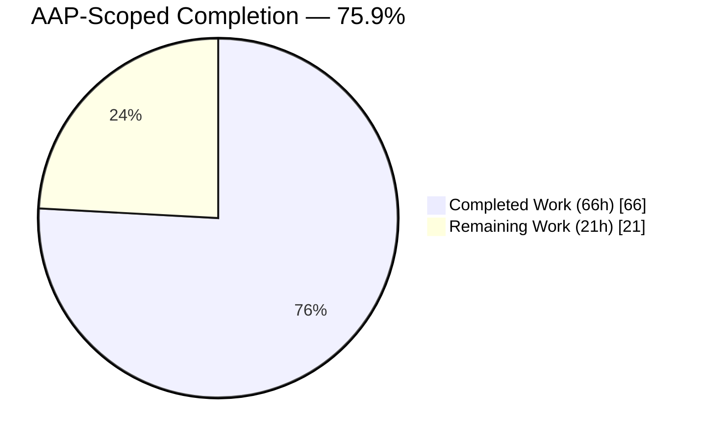
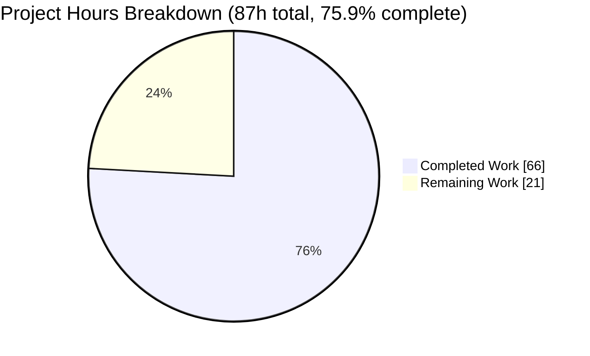
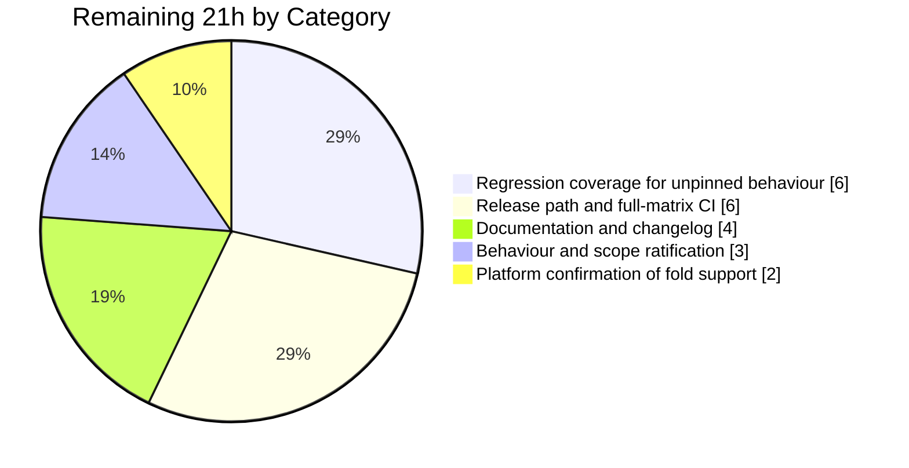
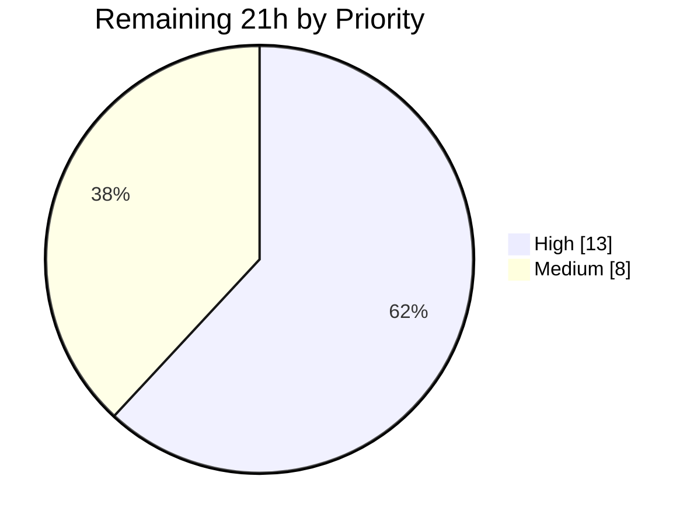
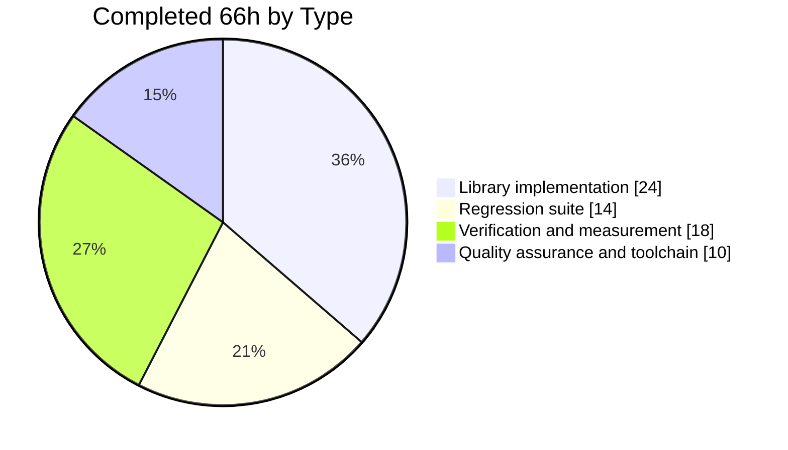

# 1. Executive Summary

## 1.1 Project Overview

`schedule` is a dependency-free Python job-scheduling library used by applications that need recurring work on a human-readable cadence. This project repairs a silent failure in it: a timezone-aware job with a sub-daily unit (`seconds`, `minutes`, `hours`) had its next run pushed past a backward clock change, so it stopped firing for the whole of the repeated local hour — roughly sixty lost executions a year per DST-observing timezone, with no exception and no log line. A second defect stopped a `seconds`-unit job carrying a timezone at all. Both are fixed inside the library and its test module, leaving the public API, the optional `pytz` dependency and every other scheduling behaviour intact.

## 1.2 Completion Status



Chart colours: **Completed = Dark Blue `#5B39F3`** · **Remaining = White `#FFFFFF`**.

| Metric | Value |
|---|---|
| Total Hours | **87** |
| Completed Hours (AI + Manual) | **66** (66 AI + 0 manual) |
| Remaining Hours | **21** |
| Percent Complete | **75.9%** (66 ÷ 87) |

Scope: the approved plan's deliverables plus the path to production. Pre-existing conditions of release 1.2.2, held out of scope, appear in Sections 1.4 and 6 but are not counted.

## 1.3 Key Accomplishments

- A timezone-aware sub-daily job holds its cadence through a repeated local hour: 120 firings across both passes, where 60 runs were lost.
- The two passes resolve to different moments — an hourly job gives hour 2 first, hour 3 second.
- A `seconds`-unit job can carry a timezone, via a chainable `Job.timezone(tz)` that composes in any order.
- Due checks and `idle_seconds` answer real time: 50.0 seconds inside the fold, not 3,620.
- Transition size is irrelevant — a 30-minute fall-back and 45-minute offsets both behave correctly.
- 13 regression tests lock the repair; 10 fail against the unmodified library.
- Preserved behaviour is intact: 81 pre-existing tests pass untouched, 16 protected functions byte-identical.
- Every gate green on Python 3.8–3.12 with and without `pytz`, at 99% coverage.

## 1.4 Critical Unresolved Issues

| Issue | Impact | Owner | ETA |
|---|---|---|---|
| Nine comment and docstring regions in `schedule/__init__.py` sit outside the seven changes the plan enumerated, awaiting sign-off (§5.2 D1) | None behavioural — the code-only diff is confined to the seven change regions and 16 protected functions are byte-identical | Maintainer | 0.5h decision |
| Forward-transition results changed for sub-daily timezone-aware jobs with an interval of 2 hours or more, or 75 minutes or more, and no test pins them in either direction (§5.2 D2) | `every(2).hours.at(":30","Europe/Madrid")` at 2025-03-30 01:45 now resolves to 04:30 local (02:30 UTC) instead of 03:30 (01:30 UTC) | Maintainer + QA | 4h |
| Deadline cancellation differs for a deadline inside the repeated hour window 02:59:40–03:00:30 (§5.2 D3) | A job that release 1.2.2 cancelled is now kept; the new behaviour is the correct one where reachable | Maintainer | 2h |
| Published prose documentation still ties timezone support to `.at()` in six places and states the fall-back direction reversed in one (§5.2 D4) | Users cannot learn about `Job.timezone()` or the new sub-daily guarantee from the docs; the rendered API reference is already correct | Maintainer | 4h |
| `every().week.timezone(tz)` and `every().day.timezone(tz)` became expressible and have no specified expectation and no test | Both behave coherently, but nothing pins them | QA | 2h |
| Three exposures in frozen release-1.2.2 code, accepted for this change: job arguments serialised into DEBUG log records, unescaped tag and callback names in log fields, and unsynchronised job-list reads in `idle_seconds` (§6) | Unchanged from every prior release; no new deployment risk introduced here | Maintainer | Separate scope (~8h) |
| The declared Python 3.7 floor is not exercised locally because that interpreter cannot be installed on this OS (§5.2 D7) | The change uses no post-3.7 syntax and compiles on 3.8–3.13; the published CI matrix covers 3.7 | Maintainer / CI | 2h (inside the release task) |

## 1.5 Access Issues

| System/Resource | Type of Access | Issue Description | Resolution Status | Owner |
|---|---|---|---|---|
| Git remote `origin` | Read | None — `git ls-remote` lists all branches successfully | ✅ Verified working | — |
| Package index and network egress | Outbound HTTPS | None — `pypi.org` and `github.com` both answer `200`; dependencies install cleanly | ✅ Verified working | — |
| Credentials, secrets, environment variables | Runtime configuration | None required — the library has no service, database or external API, and the test module sets `TZ` itself | ✅ Not applicable | — |
| Python 3.7 interpreter | Build toolchain | Cannot be installed on this OS (end-of-life, no standalone build); `tox` skips both 3.7 environments rather than failing | ⚠ Environment constraint — covered by the published CI matrix | Maintainer / CI |

No access issue blocks build, test or deployment.

## 1.6 Recommended Next Steps

1. **[High]** Sign off the three unratified items: the widened comment scope, the changed forward-transition results, and the naive deadline comparison (3h).
2. **[High]** Add tests pinning those forward-transition values, the deadline window, and the new `timezone()` unit combinations (6h).
3. **[High]** Update the documentation and changelog: six timezone statements, one reversed direction, one new paragraph, one history entry (4h).
4. **[Medium]** Run the published CI matrix including a real Python 3.7 interpreter, correct the test-selector expectation, and release (6h).
5. **[Medium]** Confirm each deployment platform populates the `fold` flag the repair reads (2h).

# 2. Project Hours Breakdown

## 2.1 Completed Work Detail

| Component | Hours | Description |
|---|---:|---|
| Granularity gating for sub-daily timezone-aware jobs | 7 | New `Job._at_time_fixates_hour()` predicate plus both gated calls into the offset-reconciliation helper, so hour-preserving re-fixation applies only to jobs whose anchor actually pins the hour (`schedule/__init__.py:772-778, 814-832`). Root cause of the freeze. Includes the widened `at_time_zone` invariant comment |
| Pass identity across the aware-to-naive boundary | 5 | Records the true UTC offset before `tzinfo` is stripped and stamps PEP 495 `fold=1` when the naive reading is genuinely ambiguous, a strict no-op elsewhere (`schedule/__init__.py:783-793`) |
| Instant-correct due evaluation | 3 | `Job.should_run` resolves both moments to absolute instants for timezone-aware jobs; the naive branch is preserved verbatim (`schedule/__init__.py:698-708`) |
| Instant-correct idle time | 4 | `Scheduler.idle_seconds` subtracts absolute instants when the earliest job is timezone-aware, keeping the naive path and the `None`/negative contracts intact (`schedule/__init__.py:204-214`) |
| Chainable `Job.timezone()` and shared timezone decoder | 5 | New public entry point plus the private decoder that carries the single lazy `import pytz`, lifting the lockout that made a `seconds`-unit job unable to hold a timezone (`schedule/__init__.py:562-588`) |
| DST fall-back regression suite | 9 | Two POSIX timezone constants and 13 tests covering both passes, all three sub-daily units, cadence continuity, a foreign job zone, a 30-minute transition, idle time, the fluent API and the preserved guard — 326 lines added with zero deletions (`test_schedule.py:27-31, 1247-1643`) |
| Suite discrimination hardening | 5 | Assertions that make the suite detect a reverted due-check, a removed fold stamp, an aware `next_run`, a cloning `timezone()`, a clamped idle value, altered exception text and a translated missing-dependency error |
| Runtime behavioural acceptance | 6 | Continuous clock walks (60/60/60/60 firings), exit-boundary checks, two-pass distinction, 30-minute and 45-minute transitions, foreign job/system zone combinations, full scheduler lifecycle and missed-run policy |
| Multi-environment test and gate execution | 5 | Full suite, the 81/13 subsets and the optional-dependency run; `tox` across Python 3.8-3.12 with and without `pytz`; typing, pinned formatter, warning-free docs build, packaging metadata and coverage |
| Security and dependency verification of the new input surface | 4 | Hostile zone names and invalid argument types across both timezone entry points, lazy-import contract, package integrity and advisory audit |
| Performance measurement of the polling paths | 3 | Per-call cost of the due-check and idle-time paths, and confirmation that the documented sleep loop makes 122 polls across the repeated hour instead of roughly 3,600 |
| Static quality assurance across both changed files | 6 | Comment and docstring accuracy pass, conformance of the delivered module to the specified change set, and cross-checks against the packaging, tox, CI and documentation authorities |
| Toolchain and environment provisioning | 4 | Five interpreters, four isolated environments (primary, `pytz`-free, Python 3.11 tooling, `tox` runner) and the pinned formatter constraint |
| **Total** | **66** | |

## 2.2 Remaining Work Detail

| Category | Hours | Priority |
|---|---:|---|
| Behaviour and scope ratification — accept (or reverse) the widened comment scope, the changed forward-transition results, and the naive deadline comparison alongside instant-aware due evaluation; record the decision | 3 | High |
| Regression coverage for the currently unpinned behaviour — the forward-transition values at the measured boundary, the deadline window 02:59:40-03:00:30, and the newly expressible `every().week.timezone(tz)` / `every().day.timezone(tz)` combinations | 6 | High |
| Documentation and changelog — the six statements that tie timezone support to `.at()`, the reversed fall-back direction, a paragraph documenting the new sub-daily guarantee, and a history entry | 4 | High |
| Release path and full-matrix CI — upstream review, the published matrix including a real Python 3.7 interpreter, corrected verification text for the test selector, and the release itself from the built distributions | 6 | Medium |
| Platform confirmation that `datetime.datetime.now()` carries the `fold` flag on each deployment interpreter and platform | 2 | Medium |
| **Total** | **21** | |

## 2.3 Basis of Estimate

Completed hours are derived per deliverable from the delivered code and its verification: seven library change regions (28 code-line insertions and 11 deletions after normalising comments and docstrings), 326 lines of test code, and the gates that were executed against them. Library implementation accounts for 24 of the 66 hours, the regression suite for 14, verification and measurement for 18, and quality assurance and toolchain work for 10 — so testing and verification together come to 32 hours, more than the implementation itself, which is appropriate for a defect whose whole difficulty is timezone arithmetic that one statement got wrong by the size of a clock transition.

Remaining hours cover only what the approved plan still leaves open plus the standard path to production. Confidence is high on the ratification, coverage and documentation items, whose values and target lines are already known and quoted in Section 5.2; medium on the release and platform items, which depend on upstream review latency and on the set of deployment platforms. Excluded from all three figures, deliberately, are pre-existing conditions of release 1.2.2 that the plan placed out of scope — the logging and concurrency exposures (about 8 hours), corrections to pre-existing test-comment inaccuracies (2 hours) and the packaging metadata warning (1 hour). They are reported in Sections 1.4 and 6 so that they stay visible without distorting the completion measurement.

# 3. Test Results

Every figure below was observed by executing the suite from the repository root on Python 3.12.14 with `pytz` 2026.3.post1 (Olson 2026c) and, for the optional-dependency row, on an interpreter with `pytz` deliberately absent.

| Area / Category | Framework | Tests | Passed | Failed | Coverage | What This Proves |
|---|---|---:|---:|---:|---|---|
| Sub-daily fall-back arithmetic — minutes, hours and seconds across both passes | pytest 9.1.1 | 5 | 5 | 0 | 99% | A timezone-aware sub-daily job keeps firing through a repeated local hour, and the two passes resolve to different moments |
| Cadence, due evaluation and idle time inside the fold | pytest 9.1.1 | 3 | 3 | 0 | 99% | 120 firings across the repeated hour, a due-check that answers real time, and idle time that reports true seconds instead of a transition-sized error |
| Chainable timezone API and exception contract | pytest 9.1.1 | 4 | 4 | 0 | 99% | A `seconds`-unit job can carry a timezone, chaining order is irrelevant, and the frozen error classes and messages still fire for invalid input |
| Pre-existing library behaviour — naive jobs, forward gap, daily/weekly, weekday selection, randomized intervals, cancellation, deadlines, tags, missed-run policy, direct offset-helper calls | pytest 9.1.1 | 81 | 81 | 0 | 99% | Release 1.2.2 behaviour is unchanged; no pre-existing test was edited, weakened or removed |
| Optional-dependency mode with `pytz` absent | pytest 9.1.1 | 94 collected | 41 | 0 | n/a (53 skipped) | Timezone support remains an optional extra; a missing dependency surfaces as `ModuleNotFoundError`, not as a configuration error |
| Interpreter matrix, Python 3.8-3.12 with and without `pytz` | tox 4.60 + pytest | 10 environments | 10 | 0 | 99% | The change is compatible with every interpreter obtainable in this environment; the 3.7 environments skip because that interpreter cannot be installed |
| Static gates — typing, formatting, documentation build, packaging metadata | mypy 2.3.0 · black 20.8b1 · Sphinx · setuptools | 4 gates | 4 | 0 | — | No type error, no formatting drift, a warning-free docs build, and installable source and wheel distributions |
| Discrimination check — the current suite against the unmodified library | pytest 9.1.1 | 94 | 84 | 10 | — | The 10 failures are by design: without the fix, 10 of the 13 new tests fail, so the suite pins the repair rather than describing it |

Full-suite result: **94 passed, 0 failed** (81 pre-existing + 13 new). Coverage of `schedule/__init__.py` is **99%** — 400 statements, 2 missed, both pre-existing defensive statements that no public call path can reach (`schedule/__init__.py:688` and `:803`), uncovered in release 1.2.2 as well.

### Not Covered

- **Forward-transition results for larger sub-daily intervals.** The gating that fixes the fall-back also changes forward-transition results for timezone-aware jobs with an interval of 2 hours or more, or 75 minutes or more — `every(2).hours.at(":30","Europe/Madrid")` at 2025-03-30 01:45 resolves to 04:30 local where release 1.2.2 gave 03:30. No test asserts either value. Test the boundary at interval 1 versus 2 hourly, and 74 versus 75 minutes, before release.
- **The deadline window inside a repeated hour.** With a deadline between 02:59:40 and 03:00:30 on a fall-back, cancellation now differs from release 1.2.2. Nothing pins it. Add a case for a deadline in that window and one just outside it.
- **The newly expressible unit combinations.** Because `Job.timezone()` carries no unit guard, `every().week.timezone(tz)` and `every().day.timezone(tz)` (a daily job with no anchor time) are now constructible. Both behave coherently when exercised by hand, but no test asserts what they should do.
- **Larger interval multiples across a clock change.** The fall-back tests use interval 1 for minutes and hours and 5 for seconds; no test drives a larger multiple through a transition, which is the same gap the first item above describes from the forward side.
- **Comment and docstring text** is not executable, so no test covers it. It is instead guaranteed structurally: the module's executable content is confined to the seven specified change regions, and the documentation build renders every docstring without a warning.

# 4. Runtime Validation &amp; UI Verification

`schedule` is a headless library: it has no user interface, no HTTP surface, no database and no listening socket, so runtime validation means driving the scheduler's own flows under a controlled clock. Each line below was exercised directly and the value shown is the value observed.

- ✅ **Import and configuration** — `import schedule` pulls only standard-library modules; building a naive `every().day.at('10:30')` job leaves `pytz` out of `sys.modules`.
- ✅ **Sub-daily fall-back, minutes** — Madrid job created at 02:58:40 first pass schedules 02:59:30; after running at 02:59:40 first pass, `next_run` reads `2025-10-26 02:00:30` with `fold=1` and `tzinfo` of `None`. Not due in **0 of 60** second-pass slots, against 60 of 60 before the fix.
- ✅ **Cadence continuity** — a continuous second-by-second walk over four hours of simulated time fires **60 / 60 / 60 / 60** times across hour 1, both passes of hour 2 and hour 3: 120 executions inside the repeated hour.
- ✅ **Two-pass distinction, hours** — running at 02:59:40 returns hour 2 on the first pass and hour 3 on the second; the exit boundary holds at 02:00:10 (hour 2) and 03:00:10 (hour 3).
- ✅ **Seconds unit with a timezone** — `every(5).seconds.timezone("Europe/Madrid")` schedules 02:59:57 and reschedules to 02:00:04 with `fold=1`, exactly five real seconds later; `every(5).seconds.at(":00")` still raises the original `ScheduleValueError`.
- ✅ **Idle time and the documented sleep loop** — `idle_seconds()` returns a true **50.0** at 02:59:40 first pass, **20.0** at 02:00:10 second pass, a contractual negative value when overdue and `None` with no jobs; the library's own sleep-exactly loop makes **122** polls across the second pass instead of roughly 3,600.
- ✅ **Transition sizes other than an hour** — Australia/Lord_Howe's 30-minute fall-back resolves to 01:30:30 with `fold=1` then 02:00:30, firing 30 + 30 times across the repeated half hour; Pacific/Chatham's 45-minute offsets resolve to 02:45:13 then 03:45:13.
- ✅ **Preserved behaviour under a clock change** — a naive minutely job still yields 03:00:30 with no timezone attached; the forward gap still resumes at 03:00:30 for a sub-daily job and relocates a daily `02:30` job to 03:30; the daily fall-back still fires only at the first occurrence, then the next day.
- ✅ **Scheduler lifecycle** — configure, register, evaluate, `run_pending`/`run_all`, callback, `last_run`/`next_run`, `idle_seconds`, next execution, tags and `clear(tag)`, self-cancellation, deadline jobs, the `repeat` decorator and an explicit `Scheduler` isolated from the module default all behave as documented across both passes.
- ✅ **Optional dependency and invalid input** — with `pytz` absent both timezone entry points raise `ModuleNotFoundError: No module named 'pytz'` and a naive job remains schedulable; hostile zone names and wrong argument types are rejected with the frozen exception classes, with no command execution, no filesystem access and no hang.

**Not exercised at runtime:** the forward-transition path for timezone-aware jobs with an interval of 2 hours or more (its values are measured and quoted in Section 5.2, but nothing drives it automatically), the deadline window 02:59:40-03:00:30, the newly expressible `every().week.timezone(tz)` and `every().day.timezone(tz)` configurations, and any interpreter or platform other than CPython 3.8-3.12 on Ubuntu 25.10 with glibc 2.42 — including Python 3.7, whose interpreter cannot be installed here. No browser-based verification applies to this project.

# 5. Compliance &amp; Quality Review

## 5.1 Compliance Matrix

| # | Deliverable / Benchmark | Status | Evidence |
|---|---|---|---|
| 1 | Sub-daily timezone-aware jobs keep their cadence through a repeated local hour | ✅ Pass | `schedule/__init__.py:772-778, 814-832`; 120 firings measured; 5 tests |
| 2 | The two passes through an ambiguous local hour resolve differently | ✅ Pass | `schedule/__init__.py:783-793`; hour 2 then hour 3; `test_tz_hours_dst_overlap_hour` |
| 3 | A `seconds`-unit job can carry a timezone | ✅ Pass | `schedule/__init__.py:562-577`; `test_tz_seconds_dst_overlap_hour` |
| 4 | Due evaluation and idle time are instant-correct; naive paths untouched | ✅ Pass | `schedule/__init__.py:204-214, 698-708`; 50.0 / 20.0 / −10.0 / `None` / 14400.0 observed |
| 5 | Only the library module and its test suite were modified, and the test suite is a pure addition | ✅ Pass | `git diff --name-status 82a43db..HEAD` lists exactly two files (411 insertions / 24 deletions); `test_schedule.py` 326 insertions / **0** deletions; 81 → 94 test methods |
| 6 | No new runtime dependency; `pytz` stays optional and lazily imported | ✅ Pass | `pyproject.toml` dependencies still empty; exactly one `import pytz` (`schedule/__init__.py:582`); top-level imports standard-library only |
| 7 | Public API and exception semantics frozen; the single addition is purely additive | ✅ Pass | `next_run`/`last_run` report `tzinfo is None`, subtract to a `timedelta` and compare with a plain datetime; `every(5).seconds.at(":00")` raises the byte-identical message; `Job` gained only `timezone()` |
| 8 | The offset-reconciliation helper, interval arithmetic and every frozen method left alone | ✅ Pass | 16 protected functions byte-identical to release 1.2.2, including the helper and the ordering, representation, cancellation and deadline methods |
| 9 | The entire pre-existing suite passes unmodified; typing, formatting, docs and packaging gates green | ✅ Pass | 81 passed; mypy clean; pinned `black 20.8b1` reports 4 files unchanged; `sphinx-build -W` exit 0; sdist and wheel build |
| 10 | Zero placeholders, stubs or unresolved markers in delivered code | ✅ Pass | No TODO/FIXME/HACK/stub marker anywhere in `schedule/` or `test_schedule.py`; the module-level `jobs` alias states its invariant directly (`schedule/__init__.py:901`) |
| 11 | Change budget and change count as specified in the plan | ⚠ Partial — ratification pending | Raw diff 85/24 against a specified 52/15; the code-only diff is 28/11 and confined to the seven specified regions (see 5.2 D1) |
| 12 | Documentation and changelog reflect the shipped API | ❌ Not done — out of scope by instruction | `docs/` untouched; six statements stale, one direction reversed, no history entry (see 5.2 D4) |

## 5.2 AAP &amp; Rule Divergences and Gaps

No user-specified rules exist for this project — the rules document was read in full and returned none, which the approved plan independently records — so no rule could be diverged from. The eight divergences below are all against that plan.

| # | What the AAP/Rule Required | What Was Delivered Instead | Why It Diverged | Impact | Remediation |
|---|---|---|---|---|---|
| D1 | Exactly seven changes to `schedule/__init__.py`, measured at 52 insertions / 15 deletions, with nothing else differing from release 1.2.2 | The seven changes plus nine comment and docstring regions; raw diff 85 / 24 | Comment and docstring accuracy was treated as in scope for the two changed files, so nine text-only regions were corrected alongside the seven specified changes | None behavioural: the code-only diff is 28 / 11 and confined to the seven regions | Ratify the widened comment scope, or authorise a revert |
| D2 | Sub-daily jobs crossing a forward gap "resume at the first real instant — which is the behaviour they already had" | True at interval 1; changed for interval ≥ 2 hourly and ≥ 75 minutes minutely | Follows deterministically from the mandated gate expression; the plan generalised from a single interval-1 measurement | Values move by one transition; the new value honours the configured cadence, but nothing tests either side | Ratify and pin with a test, or amend the assertion |
| D3 | `until()`'s deadline logic and the missed-run policy must not be refactored; only `Job.__lt__` is an accepted naive-comparison asymmetry | Deadline evaluation stayed naive while due evaluation became instant-aware, so one `run()` call applies two time models | Making the deadline comparison instant-aware lies outside the seven changes and inside the do-not-touch set | Deadlines in 02:59:40-03:00:30 on a fall-back: release 1.2.2 cancels the job, the current library keeps it | Ratify beside the existing asymmetry note, or authorise an instant-aware comparison |
| D4 | No file under `docs/` may be modified; exactly one stale statement (`docs/timezones.rst:15`) is sanctioned | Six statements now misdescribe timezone support, one states the fall-back direction reversed, and there is no changelog entry | Explicit instruction limiting changes to the module and its tests, reinforced by a mechanical two-file diff gate | Prose readers cannot learn about the new entry point or guarantee; the API reference is correct | Authorise a documentation change and apply the six corrections |
| D5 | The targeted verification selector returns 13 passed / 81 deselected | The literal selector returns 14 passed / 80 deselected; its negation returns 80 | A frozen pre-existing test also matches the `dst_overlap` keyword, and the matcher cannot mask a name | None functional — zero failures under any selection | Amend the verification text, or use the exclusion form |
| D6 | Thirteen tests exactly as specified, with the daily pin in its own indexed test | Thirteen tests carrying additional assertions, with the daily pin inside the hourly test | As specified the suite could not distinguish the fixed library from several reversions of it | Strictly stronger; names, counts and the pure-addition shape unchanged | None required |
| D7 | The full interpreter matrix, including the declared Python 3.7 floor | Python 3.8-3.12 with and without `pytz`; both 3.7 environments skipped | The 3.7 interpreter is end-of-life and cannot be installed on this OS | The declared floor is unverified locally | Run the published CI matrix, which provides 3.7 |
| D8 | `Scheduler.idle_seconds` exactly as specified, statement by statement | Exactly that shape, at a per-call cost above release 1.2.2 that was accepted rather than optimised | The plan fixes the statements in that region, so the cheaper form needs an amendment | Three job-list scans per call — 330.7 µs at 2,000 jobs against 222.7 µs for 1.2.2 | Decide whether to authorise the one-read form (three lines) |

**D1 — comment and docstring scope.** The plan presents its seven changes to `schedule/__init__.py` as exhaustive, at 52 insertions and 15 deletions; the delivered file measures 85 and 24. Normalising comments and docstrings away through the syntax tree gives 28 insertions and 11 deletions, every region mapping onto the seven specified changes with nothing left over, and 16 protected functions byte-identical to release 1.2.2 — executable variance outside the plan is exactly zero. What the nine extra regions buy is accuracy, and a revert gives three inaccuracies back: a docstring naming a parameter `delay` the signature lacks (`schedule/__init__.py:107`), a class docstring promising a "fixed" interval that `Job.to()` randomises, and an open `todo` question in shipped code at the `jobs` alias.

**D2 — forward-transition results for larger sub-daily intervals.** The plan states that sub-daily jobs crossing a forward gap keep the behaviour they already had. Measured against release 1.2.2 and the current library at Madrid 2025-03-30 01:45, that holds at interval 1 and fails beyond it: `every(2).hours.at(":30","Europe/Madrid")` now gives 04:30 local (02:30 UTC) where 1.2.2 gave 03:30 (01:30 UTC); `every(3).hours` gives 05:30 against 04:30; `every(75).minutes` gives 04:00:30 against 03:00:30. Interval-1 jobs and every daily and weekly form are identical. The new values honour the configured cadence and remove an inversion in which a 75-minute job fired sooner than a 74-minute one, but nothing asserts either side. Decide which is intended, then pin it.

**D3 — two time models inside one run.** `Job.should_run` and `Scheduler.idle_seconds` compare absolute instants for timezone-aware jobs, while `Job._is_overdue` — called twice inside `Job.run` — still compares naive wall clocks and is byte-identical to release 1.2.2. Measured on the Madrid fall-back for a job created at 02:58:40 and run at 02:59:40 first pass: deadlines of 02:59:45, 03:00:00 and 03:00:20 are cancelled by 1.2.2 and kept now; from 03:00:30 both keep the job. Where reachable the current behaviour is correct, since the rescheduled run at 01:00:30 UTC precedes a 03:00:00-local deadline. A deadline inside the repeated hour is inexpressible: `until()` takes a naive value with no way to name a pass — the limitation the plan already accepts for `Job.__lt__`.

**D4 — documentation left stale.** The plan excludes every file under `docs/` and sanctions exactly one stale sentence, `docs/timezones.rst:15` ("Timezones are only available in the `.at` function"). Six statements now understate the API: that line plus `docs/installation.rst:19`, the section heading and opening line at `docs/timezones.rst:4` and `:7`, `:36`, and `docs/faq.rst:48`. Separately, `docs/timezones.rst:53` describes the backward transition as the clock moving from 02:00 to 03:00, which is the forward direction; that sentence predates this work. Nothing documents the new sub-daily guarantee, and `HISTORY.rst` carries no entry for the repair. A user who installs per the guide and calls `every(...).timezone(tz)` without `pytz` therefore meets an avoidable `ModuleNotFoundError`.

**D5 — verification selector count.** The plan's targeted command, `-k "dst_overlap or timezone_chaining or timezone_equivalent or timezone_invalid or at_still_rejects"`, is expected to select the thirteen new tests. Run against the delivered tree it reports 14 passed / 80 deselected, and its negation 80 passed / 14 deselected, because the pre-existing `test_tz_daily_dst_overlap_hour` also contains `dst_overlap` — and that test is frozen by the same plan, which additionally names it as a protected pin. Pytest's keyword matcher only ever adds names, never masks one, so no repository change can exclude it. Appending `and not tz_daily_dst_overlap_hour` yields exactly 13 passed / 81 deselected and its complement 81 passed / 13 deselected, both observed.

**D6 — test assertions beyond the specification.** The thirteen tests carry the specified names and count, plus assertions the specification did not list. Without them the suite could not tell the fixed library from a naive due-check (a wall-clock comparison answers "due" at the same polling points), from a build with no fold stamp, from one re-attaching `tzinfo` to `next_run`, from a `timezone()` returning a clone, from a clamped idle value, from altered exception text, or from a translated missing-dependency error. Each is now caught. One placement also differs: the daily first-occurrence pin sits inside `test_tz_hours_dst_overlap_hour`, beside the hourly case whose contrast it completes. Names, count and the zero-deletion diff are unaffected.

**D7 — Python 3.7 floor unexercised.** The project declares support from Python 3.7 and the tox matrix lists both 3.7 environments. Neither ran: the interpreter is end-of-life and cannot be installed on this operating system, so `skip_missing_interpreters` turns them into skips. Every other environment passed — 3.8, 3.9, 3.10, 3.11 and 3.12, each with and without `pytz` — and the delivered code uses no syntax newer than 3.7 (no assignment expressions, no `zoneinfo`, no modern typing forms), compiling cleanly on 3.8 through 3.13. The residual risk is a 3.7-only incompatibility slipping through unseen; the published CI matrix provides that interpreter and should be run before release.

**D8 — idle-time per-call cost.** The plan specifies `Scheduler.idle_seconds` statement by statement, including a guard that reads the list-scanning `next_run` property and two returns that read it again. With the timezone check added that is three job-list scans and two list copies per non-empty call, measured at 330.7 µs on a 2,000-job scheduler against 222.7 µs for release 1.2.2; binding the property to a local once costs 216.8 µs. The specified shape was kept and the cost accepted. Returned values are identical either way, three existing tests assert exact idle values and pass, and the repair's own effect dominates: the documented sleep loop drops from roughly 3,600 polls to 122 across a repeated hour.

# 6. Risk Assessment

| Risk | Category | Severity | Probability | Mitigation | Status |
|---|---|---|---|---|---|
| The repair reads PEP 495 `fold` from `datetime.datetime.now()`, so it depends on the platform C library populating that flag | Technical | Medium | Low | Verified on CPython 3.12.14 / Ubuntu 25.10 / glibc 2.42 and across Python 3.8-3.12; confirm on each deployment platform before release (2h task) | Open — monitored |
| Forward-transition results changed for timezone-aware jobs with an interval ≥ 2 hours or ≥ 75 minutes, and no test pins either value | Technical | Medium | Medium | Boundary measured exactly (interval 1 vs 2 hourly, 74 vs 75 minutes); ratify and add pinning tests (6h task) | Open |
| Deadline evaluation compares naive wall clocks while due evaluation compares instants, so a deadline inside a repeated hour has no expressible correct answer | Technical | Low | Low | Window bounded to 02:59:40-03:00:30; the new behaviour is the correct side where reachable; ratify beside the existing ordering asymmetry | Open — accepted for this change |
| Job arguments and keyword arguments are serialised into DEBUG log records, so a credential passed as a job argument reaches log sinks | Security | Medium | Medium | Pre-existing in every release and unchanged here; avoid DEBUG logging for secret-bearing jobs, and authorise a separate logging scope to redact | Open — accepted, out of scope |
| A tag or callback name containing newline or control characters forges multiline log records; `idle_seconds` reads the job list without synchronisation | Security | Low | Low | Both pre-existing; release 1.2.2 fails on the same interleavings and ships no locking. The documented threading recipe is a single background thread calling `run_pending` | Open — accepted, out of scope |
| This defect class is silent by nature — no exception, no log line — so a future regression would again only appear as work that did not happen | Operational | Medium | Low | 13 regression tests, 10 of which fail without the fix; the affected paths sit inside 99% statement coverage | Mitigated |
| `idle_seconds` costs three job-list scans and two list copies per call, which is linear in job count | Operational | Low | Medium | Negligible at the handful-of-jobs scale the library targets; polling inside a fold already fell from roughly 3,600 to 122; a three-line optimisation is available | Open — accepted to hold the specified shape |
| Downstream users cannot learn the new entry point or guarantee from the published prose, and the installation note understates when `pytz` is needed | Integration | Low | High | Documentation and changelog task (4h); the missing-dependency error names the package, and the rendered API reference already lists `Job.timezone` | Open |

# 7. Visual Project Status

### Project Hours



Colour key — **Completed Work: Dark Blue `#5B39F3`** · **Remaining Work: White `#FFFFFF`** · headings and accents Violet-Black `#B23AF2` · highlights Mint `#A8FDD9`.

### Remaining Work by Category



### Remaining Work by Priority



### Completed Effort by Type



Every figure above matches Section 1.2 and Section 2: completed 66 hours, remaining 21 hours, total 87 hours, 75.9% complete. The remaining-work slices sum to 21 (6 + 6 + 4 + 3 + 2), the priority split sums to 21 (13 High + 8 Medium), and the completed-effort slices sum to 66 (24 + 14 + 18 + 10).

# 8. Summary &amp; Recommendations

The reported defect is fixed and the fix is proven. A timezone-aware job with a sub-daily unit used to have its next run displaced forward by exactly the size of a backward clock change, which left it un-runnable for the whole of the repeated local hour: sixty consecutive executions lost each year per DST-observing timezone, silently, with nothing to inspect afterwards. That job now keeps its cadence — 120 firings across both passes of the repeated hour, measured on a continuous second-by-second clock — and the two passes resolve to genuinely different moments. The second defect, which made a `seconds`-unit job unable to hold a timezone at all, is lifted by a new chainable `Job.timezone(tz)` that composes in any order and returns the same job. Due evaluation and idle time now answer real-time questions, so the library's own sleep loop makes 122 polls across the repeated hour instead of roughly 3,600.

The change is deliberately small and tightly bounded, which is what makes it safe to take. Two files are touched, 411 insertions against 24 deletions, and after normalising comments and docstrings the executable change is 28 insertions and 11 deletions confined to seven regions. Sixteen protected functions — including the delicate offset-reconciliation helper the repair routes around rather than edits, plus the ordering, representation, cancellation and deadline methods — are byte-identical to release 1.2.2. The public contract holds: `next_run` and `last_run` remain naive local `datetime` values that subtract to a `timedelta` and compare with a plain datetime, the exception hierarchy is untouched, and `pytz` remains an optional extra reached through exactly one lazy import. All 81 pre-existing tests pass without a single edit, and the 13 new tests fail 10-of-13 against the unmodified library, so the suite pins the repair rather than describing it. Every gate is green across Python 3.8-3.12 with and without `pytz`: typing, the pinned formatter, a warning-free documentation build, installable distributions and 99% statement coverage.

Against the plan's scope the project is **75.9% complete — 66 hours delivered of 87 total, with 21 hours remaining**. What remains is not implementation. Three items need an owner's decision rather than code: the comment and docstring corrections that reach beyond the seven changes the plan enumerated, the changed forward-transition results for jobs with an interval of two hours or more, and the naive deadline comparison that now sits beside instant-aware due evaluation. Two of those three also need coverage, because the plan's thirteen-test cap left them unpinned in either direction — that is the single most important gap in the branch, and it is six hours of work with the exact boundary values already measured and quoted in Section 5.2. The remainder is standard path to production: documentation and a changelog entry the plan excluded by instruction, the published CI matrix including a real Python 3.7 interpreter, and confirmation that the deployment platforms populate the clock flag the repair reads.

The critical path is therefore: ratify the three behaviour and scope decisions, pin the two unratified behaviours with tests, correct the six documentation statements and add the history entry, then run the full matrix and release. That is 21 hours, of which 13 are high priority. Held separately, and excluded from the completion figure because they predate this work and are not required to ship it, are three exposures that live in frozen release-1.2.2 code: job arguments serialised into DEBUG log records, unescaped tag and callback names in log fields, and unsynchronised job-list reads in `idle_seconds`. They warrant a scope of their own — roughly eight hours — and each carries a measured, test-clean minimum fix, summarised in Section 6.

**Production readiness: ready to release once the three ratification decisions are taken and the two unpinned behaviours are covered.** Success metrics for the release are concrete and already measurable: 94 tests passing with `pytz` and 41 with it absent; a timezone-aware minutely job firing 60 times in each pass of a repeated hour; `idle_seconds` reporting true seconds inside the fold; and no change to any naive, daily, weekly or forward-gap value. The correctness case for the repair is strong and independently reproducible; the residual work is about agreeing what the newly changed edge cases should do and writing that down — in tests, in the documentation and in the changelog.

# 9. Development Guide

Every command below was executed from the repository root and produced the result shown. The primary environment was rebuilt from an empty virtual environment to confirm the instructions work on a clean machine.

## 9.1 System Prerequisites

- **Python 3.12** for development and testing. The project declares support from 3.7 (`setup.py` `python_requires`, `pyproject.toml` `requires-python`) and its classifiers and `tox` list stop at 3.12, so 3.12 is the highest version it explicitly supports.
- **Python 3.11** for the formatting, documentation and packaging-metadata gates. The pinned formatter cannot be installed on 3.12 or newer, and the project's CI runs those jobs on 3.11.
- **No services.** No database, cache, queue, broker, browser or network service is involved, and no port is opened.
- **No credentials or environment variables.** The test module sets `TZ` itself; nothing else is read from the environment.
- Linux, macOS or Windows. Roughly 200 MB of disk for the environments; the test suite completes in well under a second.

## 9.2 Environment Setup

Primary environment — Python 3.12 with the optional timezone extra:

```bash
cd /path/to/schedule
python3.12 -m venv .venv
. .venv/bin/activate                       # Windows: .venv\Scripts\activate
python -m pip install --upgrade pip
python -m pip install pytest pytest-cov mypy pytz types-pytz
python -m pip install -e .
```

Verify what you installed:

```bash
python -V                                  # Python 3.12.14
python -m pytest --version                 # pytest 9.1.1
python -c "import pytz; print(pytz.__version__, pytz.OLSON_VERSION)"   # 2026.3.post1 2026c
python -c "import schedule; print(schedule.__file__)"                  # must resolve inside this checkout
```

Second environment — proves timezone support stays optional. Never install `pytz` into it:

```bash
python3.12 -m venv .venv-nopytz
.venv-nopytz/bin/python -m pip install pytest
.venv-nopytz/bin/python -m pip install --no-deps -e .
```

Tooling environment — Python 3.11, for the pinned formatter, Sphinx and the metadata check:

```bash
python3.11 -m venv .venv-tools
.venv-tools/bin/python -m pip install -r requirements-dev.txt
.venv-tools/bin/black --version            # black, version 20.8b1
```

## 9.3 Verification Steps

```bash
# Full suite — expect: 94 passed
python -m pytest test_schedule.py -q

# The 13 DST fall-back tests only — expect: 13 passed, 81 deselected
python -m pytest test_schedule.py -q \
  -k "(dst_overlap or timezone_chaining or timezone_equivalent or timezone_invalid or at_still_rejects) and not tz_daily_dst_overlap_hour"

# The 81 pre-existing tests only — expect: 81 passed, 13 deselected
python -m pytest test_schedule.py -q \
  -k "not ((dst_overlap or timezone_chaining or timezone_equivalent or timezone_invalid or at_still_rejects) and not tz_daily_dst_overlap_hour)"

# Optional-dependency mode — expect: 41 passed, 53 skipped
.venv-nopytz/bin/python -m pytest test_schedule.py -q

# Coverage, as the tox environment runs it — expect: 400 statements, 2 missed, 99%
COVERAGE_FILE="$PWD/.coverage" \
  python -m pytest test_schedule.py schedule -q --cov schedule --cov-report term-missing

# Static typing — expect: Success: no issues found in 1 source file
python -m mypy -p schedule

# Formatting, documentation and packaging metadata (Python 3.11 tooling env)
.venv-tools/bin/black --check .                                 # 4 files would be left unchanged
.venv-tools/bin/sphinx-build -W -b html docs build/html         # build succeeded, 0 warnings
.venv-tools/bin/python setup.py check --strict --metadata --restructuredtext   # exit 0

# Distributions
python -m pip install build
python -m build --outdir dist .            # schedule-1.2.2.tar.gz and schedule-1.2.2-py3-none-any.whl

# Full interpreter matrix — run SEQUENTIALLY (see troubleshooting)
python3.12 -m venv .venv-tox && .venv-tox/bin/python -m pip install tox tox-gh-actions
.venv-tox/bin/tox                          # py38..py312 with and without pytz: OK; py37: SKIP
.venv-tox/bin/tox -e format  --override testenv:format.base_python=python3.11
.venv-tox/bin/tox -e setuppy --override testenv:setuppy.base_python=python3.11
```

Confirm the two timezone contracts by hand:

```bash
# pytz is imported only when a timezone is actually requested — expect: False
python -c "import sys, schedule; schedule.every().day.at('10:30').do(lambda: None); print('pytz' in sys.modules)"

# Without pytz, asking for a timezone names the missing package — expect: ModuleNotFoundError
.venv-nopytz/bin/python -c "import schedule; schedule.every(5).seconds.timezone('Europe/Madrid')"
```

`build/` and `dist/` are already ignored by `.gitignore`, so none of the above leaves the working tree dirty — `git status --porcelain` stays empty.

## 9.4 Example Usage

```python
import time
import schedule

def heartbeat():
    print("tick", time.strftime("%H:%M:%S"))

# Sub-daily job whose schedule is expressed in a specific timezone. ':30' anchors
# the second only, so the hour stays free and the job keeps its cadence through a
# backward clock change instead of freezing for the repeated hour.
job = schedule.every().minute.at(":30", "Europe/Madrid").do(heartbeat)
print(job.unit, job.at_time, job.at_time_zone)   # minutes 00:00:30 Europe/Madrid
print(job.next_run, job.next_run.tzinfo)         # naive local datetime, None
print(schedule.idle_seconds())                   # true seconds until the next run

# A seconds-unit job has no valid anchor string, so it uses the chainable entry
# point. Order does not matter and the same job object comes back.
fast = schedule.every(5).seconds.timezone("Europe/Madrid").do(heartbeat)
assert fast.timezone("Europe/Madrid") is fast

# .at() still rejects a seconds anchor, exactly as before:
try:
    schedule.every(5).seconds.at(":00")
except schedule.ScheduleValueError as exc:
    print(exc)   # Invalid unit (valid units are `days`, `hours`, and `minutes`)

while True:
    schedule.run_pending()
    time.sleep(1)
```

To reproduce fall-back behaviour deterministically, drive the clock with the test module's own double, which takes a POSIX timezone string and a `fold` flag:

```python
from test_schedule import mock_datetime, make_mock_job, TZ_MADRID
import schedule
from schedule import every

with mock_datetime(2025, 10, 26, 2, 58, 40, TZ_MADRID, fold=0):
    job = every().minute.at(":30", "Europe/Madrid").do(make_mock_job())
with mock_datetime(2025, 10, 26, 2, 59, 40, TZ_MADRID, fold=0):
    schedule.run_pending()
    print(job.next_run, job.next_run.fold)   # 2025-10-26 02:00:30 1
```

## 9.5 Troubleshooting

- **`pip install black==20.8b1` fails while building `typed-ast`.** That pin cannot be built on Python 3.12 or newer. Use the Python 3.11 tooling environment for formatting, documentation and metadata gates, as CI does. **Never run a newer formatter over this tree** — it would reformat pre-existing lines of `test_schedule.py` and destroy the pure-addition property of that file's history.
- **`tox -p auto` crashes inside coverage.** Parallel environments race on the shared `./.coverage` file. Run `tox` sequentially. If several checkouts share one environment, give each a distinct `COVERAGE_FILE`.
- **`tox` reports `py37: SKIP`.** Python 3.7 is end-of-life and cannot be installed on current distributions; `skip_missing_interpreters = true` turns the missing interpreter into a skip. The declared floor is exercised by the published CI matrix.
- **`setup.py check` fails with "The docutils package is needed".** `docutils` ships only in `requirements-dev.txt`; run that gate from the tooling environment. A setuptools deprecation notice about the license metadata is emitted either way and predates this work.
- **`pytest --flake8` (from `docs/development.rst`) does not run.** The `pytest-flake8` plugin is unmaintained and the repository carries no flake8 configuration. It is not a CI gate; use the pinned formatter and `mypy` instead.
- **`ModuleNotFoundError: No module named 'pytz'`.** Timezone support is an optional extra and both `.at(time, tz)` and `.timezone(tz)` need it: `pip install pytz` or `pip install "schedule[timezone]"`.
- **A timezone-aware job looks like it skipped runs in your own test harness.** Advance the mocked clock continuously. Jumping straight into the second pass of a repeated hour teleports over the first pass, leaves the job overdue, and the missed-run policy adds a single catch-up run — so counts read one higher than expected. A continuous walk gives exactly 60 firings per pass.
- **`schedule.__file__` points outside your checkout.** A globally installed copy is shadowing it. Re-run `python -m pip install -e .` inside the activated environment and re-check.

# 10. Appendices

## A. Command Reference

| Purpose | Command | Observed result |
|---|---|---|
| Full test suite | `python -m pytest test_schedule.py -q` | 94 passed |
| DST fall-back tests only | `python -m pytest test_schedule.py -q -k "(dst_overlap or timezone_chaining or timezone_equivalent or timezone_invalid or at_still_rejects) and not tz_daily_dst_overlap_hour"` | 13 passed, 81 deselected |
| Pre-existing tests only | the same expression, negated | 81 passed, 13 deselected |
| Optional-dependency run | `.venv-nopytz/bin/python -m pytest test_schedule.py -q` | 41 passed, 53 skipped |
| Coverage | `COVERAGE_FILE="$PWD/.coverage" python -m pytest test_schedule.py schedule -q --cov schedule --cov-report term-missing` | 400 statements, 2 missed, 99% |
| Static typing | `python -m mypy -p schedule` | Success: no issues found in 1 source file |
| Formatting (Python 3.11) | `.venv-tools/bin/black --check .` | 4 files would be left unchanged |
| Documentation build (Python 3.11) | `.venv-tools/bin/sphinx-build -W -b html docs build/html` | build succeeded, 0 warnings |
| Packaging metadata (Python 3.11) | `.venv-tools/bin/python setup.py check --strict --metadata --restructuredtext` | exit 0 |
| Build distributions | `python -m build --outdir dist .` | sdist + wheel for 1.2.2 |
| Full matrix (sequential) | `tox` | py38-py312 with and without `pytz` OK; py37 SKIP |
| Changed files on this branch | `git diff --numstat 82a43db..HEAD` | `85 24 schedule/__init__.py`, `326 0 test_schedule.py` |

## B. Port Reference

Not applicable. `schedule` is an in-process library: it binds no socket, serves no HTTP endpoint and requires no port. Any port in a deployment belongs to the host application, not to this library.

## C. Key File Locations

| Path | Role |
|---|---|
| `schedule/__init__.py` | The entire library — `Scheduler`, `Job`, the module-level convenience API. 1,006 lines |
| `schedule/__init__.py:198-214` | `Scheduler.idle_seconds` — instant-correct idle time, naive path preserved |
| `schedule/__init__.py:562-588` | `Job.timezone()` and `Job._decode_timezone()` — the new entry point and the single lazy `import pytz` (line 582) |
| `schedule/__init__.py:696-708` | `Job.should_run` — instant-correct due evaluation |
| `schedule/__init__.py:772-793` | `_schedule_next_run` — the gated offset correction and the `fold` stamp at the naive boundary |
| `schedule/__init__.py:814-832` | `_move_to_at_time`'s gated call and the `_at_time_fixates_hour()` predicate |
| `schedule/__init__.py:834-878` | `_correct_utc_offset` — the reconciliation helper, byte-identical to release 1.2.2 |
| `test_schedule.py` | The whole suite, 94 tests, 1,925 lines |
| `test_schedule.py:22-31` | POSIX timezone constants, including the added `TZ_MADRID` and `TZ_LORD_HOWE` |
| `test_schedule.py:38-98` | `make_mock_job` and the `mock_datetime` clock double, which takes a zone and a `fold` |
| `test_schedule.py:1247-1566` | The 13 DST fall-back tests, placed beside the existing timezone tests |
| `tox.ini` · `setup.cfg` · `requirements-dev.txt` | Interpreter matrix and gate definitions; mypy scoped to the package; the pinned formatter |
| `pyproject.toml` · `setup.py` | Empty runtime dependency list, `pytz` as the `timezone` extra, floor 3.7, classifiers to 3.12 |
| `docs/timezones.rst` · `docs/examples.rst` · `docs/installation.rst` · `docs/faq.rst` | The published behaviour contracts, and the four files carrying the statements listed in Section 5.2 D4 |

## D. Technology Versions

| Component | Version | Note |
|---|---|---|
| `schedule` | 1.2.2 | Version unchanged by this work |
| Python (development) | 3.12.14 | Highest version the project declares |
| Python (tooling gates) | 3.11.16 | Required by the pinned formatter |
| Python (declared floor) | 3.7 | Not installable on this OS; covered by the published CI matrix |
| pytest | 9.1.1 | With `pytest-cov` 7.1.0 |
| mypy | 2.3.0 | Scoped to the `schedule` package by `setup.cfg` |
| pytz | 2026.3.post1 | Olson database 2026c; optional extra |
| black | 20.8b1 | Pinned, with `click` 8.0.4; must run on Python ≤ 3.11 |
| tox | 4.60.0 | With `tox-gh-actions` 3.5.0 |
| Sphinx | 9.0.4 | `sphinx-build -W`, warnings as errors |

## E. Environment Variable Reference

| Variable | Required | Purpose |
|---|---|---|
| — | No | The library reads no environment variable. It has no configuration file and no secrets |
| `TZ` | No | Interpreted by the C library, not by `schedule`. The test module sets it per case to model a specific clock; setting it in production changes the naive local time the library reports |
| `COVERAGE_FILE` | No | Only useful when several checkouts share one environment, to keep coverage data files apart |
| `CI` | No | Consumed by the CI workflow, not by the library |

## F. Developer Tools Guide

- **Reproducing a clock change.** `mock_datetime(y, m, d, h, mi, s, zone, fold=…)` sets both the process timezone and the pass through an ambiguous local time. Use `fold=0` for the first pass and `fold=1` for the second, and advance the clock continuously — jumping between passes leaves a job overdue and adds one catch-up run.
- **Reading `fold` off a result.** `next_run` stays a naive `datetime`, so `fold` is invisible to comparison, subtraction, equality, hashing and `repr`. Inspect it directly with `job.next_run.fold`, or resolve the instant with `job.next_run.astimezone()`.
- **Confirming the transition facts independently.** `zdump -v Europe/Madrid | grep 2025` shows the last instant at +02:00 and the first at +01:00, so an expected value can be checked against the system's own timezone database rather than against the library.
- **Checking what a change actually touched.** `git diff --numstat 82a43db..HEAD` for the shape, and a docstring-stripped syntax-tree comparison when a diff needs to be proven comment-only.
- **Running one test.** `python -m pytest test_schedule.py -q -k test_tz_minutes_dst_overlap_hour_first_pass`. Every one of the 13 new tests also passes in isolation by node id.
- **Proving a test discriminates.** Extract the baseline library beside the checkout, drop the current suite on top of it and run it there — 10 of the 13 new tests must fail:

```bash
BASE=$(mktemp -d)
git archive 82a43db | tar -x -C "$BASE"
cp test_schedule.py "$BASE/"
(cd "$BASE" && python -m pytest test_schedule.py -q)   # 10 failed, 84 passed
rm -rf "$BASE"
```

## G. Glossary

| Term | Meaning |
|---|---|
| Backward transition / fall-back | A clock change that sets local time back, so an interval of local time occurs twice — once at the old UTC offset and once at the new one |
| Fold | The repeated interval itself, and the PEP 495 flag (`fold=0` or `1`) that says which pass a naive datetime belongs to. It is honoured by `astimezone()` and `timestamp()` and ignored by comparison and subtraction |
| Forward transition / gap | A clock change that sets local time forward, so an interval of local time does not exist. An anchored run inside it is relocated to the next valid time |
| Sub-daily unit | A repeat unit of `seconds`, `minutes` or `hours` — the units whose anchor does not pin the hour of day |
| Anchor time (`at_time`) | The time components fixed by `.at()`. A daily or weekly anchor pins the hour; an hourly anchor pins minute and second; a minutely anchor pins the second only |
| Naive local contract | The library's published guarantee that `next_run` and `last_run` are timezone-naive datetimes in Python's local timezone, subtractable and comparable with plain datetimes |
| Instant-correct comparison | Comparing two absolute moments rather than two wall-clock readings, so the two passes of a repeated hour are distinguished |
| Missed-run policy | Overdue runs are skipped rather than backfilled: a job left overdue fires once when polled, not once per interval missed |
| Pure addition | A file change consisting only of inserted lines — zero deletions and zero modifications — which is the constraint this project's test module was held to |
