# Technical Specification

# 1. Introduction

## 1.1 Executive Summary

This repository contains **`schedule`**, an open-source Python library that provides in-process periodic job scheduling with a deliberately human-readable, fluent configuration API. The version under documentation is **1.2.2**, declared in `setup.py` (`SCHEDULE_VERSION = "1.2.2"`) and mirrored in the Sphinx documentation configuration `docs/conf.py`. The distribution is published to PyPI as `schedule` and its documentation is hosted at `schedule.readthedocs.io`, both linked from `pyproject.toml` under `[project.urls]`.

The product is intentionally narrow in surface area. The entire runtime implementation is a single module, `schedule/__init__.py` (945 lines), accompanied by a PEP 561 marker file `schedule/py.typed`. Its self-description in the module docstring is precise: *an in-process scheduler for periodic jobs that uses the builder pattern for configuration*, letting callers run Python functions — or any other callable — at pre-determined intervals using a human-friendly syntax. `setup.py` classifies the package as `Development Status :: 5 - Production/Stable`, `Operating System :: OS Independent`, and `Intended Audience :: Developers`.

### 1.1.1 Project Overview

| Attribute | Value | Evidence |
|---|---|---|
| Package name / version | `schedule` 1.2.2 | `setup.py`, `pyproject.toml`, `docs/conf.py` |
| Description | "Job scheduling for humans." | `setup.py`, `pyproject.toml` |
| Runtime footprint | Single module, 945 lines | `schedule/__init__.py` |
| Required runtime dependencies | None (`dependencies = []`) | `pyproject.toml` |
| Optional dependency | `pytz` via the `timezone` extra | `pyproject.toml` |
| Python support | `>= 3.7`; tested on 3.7–3.12 | `setup.py`, `.github/workflows/ci.yml` |
| License | MIT, © 2013 Daniel Bader | `LICENSE.txt` |
| Release lineage | 23 releases, 0.1.0 (2013-05-19) → 1.2.2 (2024-05-25) | `HISTORY.rst` |

### 1.1.2 Core Problem Addressed

The problem the library targets is stated directly in `docs/index.rst`: it is *"designed to be a simple solution for simple scheduling problems."* Developers who need a function to run every ten minutes, every hour, or every Wednesday at 13:15 have historically had two unattractive options — delegate to operating-system facilities such as cron (which requires external process management, separate deployment artifacts, and an opaque crontab syntax), or adopt a full distributed task framework (which requires brokers, workers, and additional operational surface). `schedule` removes both burdens for the simple case by keeping the schedule *inside the application process*: `README.rst` states the design goal as an "In-process scheduler for periodic jobs. No extra processes needed!"

The friction being eliminated is expressed concretely by the project's own lineage. Both `README.rst` and the module docstring credit Adam Wiggins' article *"Rethinking Cron"* and the `clockwork` Ruby module as the direct inspirations, and `setup.py` lists `cron` and `clockwork` among the package keywords — positioning the library as an in-language alternative to externalized cron-style scheduling rather than a replacement for distributed schedulers.

The resulting solution shape is a two-line integration: register jobs with a readable expression chain, then drive the scheduler from the host application's own loop. The canonical form documented in `README.rst` and `docs/index.rst` is:

```python
schedule.every().day.at("10:30").do(job)
while True:
    schedule.run_pending(); time.sleep(1)
```

### 1.1.3 Key Stakeholders and Users

| Stakeholder group | Role and relationship to the system | Evidence |
|---|---|---|
| Python application developers | Primary consumers; embed the scheduler in their own process and drive `run_pending()` | `setup.py` classifier `Intended Audience :: Developers`; `docs/examples.rst` |
| Project maintainers | Own releases, versioning, and the review gate; `pyproject.toml` names Sijmen Huizenga as maintainer; `LICENSE.txt` and `README.rst` credit Daniel Bader as author/creator | `pyproject.toml`, `LICENSE.txt`, `README.rst` |
| Open-source contributors | 46 named contributors credited for features, fixes, and documentation over the project's history | `AUTHORS.rst`, `HISTORY.rst` |
| Downstream packagers | Redistribute the library through channels outside maintainer control (Ubuntu/Debian `python3-schedule`, Arch AUR `python-schedule`, conda-forge) | `docs/installation.rst` |
| Library integrators / operators | Wire the scheduler into threads, work queues, and log pipelines within a host application | `docs/parallel-execution.rst`, `docs/background-execution.rst`, `docs/logging.rst` |

### 1.1.4 Value Proposition

The value the repository actually delivers is verifiable from its own artifacts rather than asserted. Five properties dominate:

| Value driver | Substantiation in the repository |
|---|---|
| Zero required dependencies | `pyproject.toml` declares `dependencies = []`; `schedule/__init__.py` imports only standard-library modules (`datetime`, `functools`, `logging`, `random`, `re`, `time`, `typing`, `collections.abc`) |
| Zero additional infrastructure | Jobs execute inside the caller's own process and loop; `README.rst` — "No extra processes needed!" |
| Readability as a first-class goal | Fluent builder chain (`every(5).to(10).minutes`, `every().wednesday.at("13:15")`) implemented via chained properties in `schedule/__init__.py` lines 325–455 |
| Low adoption and exit cost | `docs/installation.rst` notes the library "consists of a single sourcefile MIT licenced" and can even be vendored manually; `LICENSE.txt` grants unrestricted MIT use |
| Type-safe, quality-gated delivery | `schedule/py.typed` ships type information (added in 1.2.0 per `HISTORY.rst`); `setup.cfg` configures mypy over the package; `.github/workflows/ci.yml` enforces tests, coverage, docs, formatting, and packaging checks on every push and pull request |

The business impact is therefore best characterized as **reduced operational and cognitive overhead for periodic in-process work**: no broker to provision, no external scheduler to synchronize with deployments, no dependency-tree expansion, and an API whose expressions read as English. The corollary — equally important and equally explicit in `docs/index.rst` — is that the library deliberately does not compete on persistence, sub-second precision, concurrency, or calendar localization; those trade-offs are documented in §1.3.2.


## 1.2 System Overview

### 1.2.1 Project Context

#### 1.2.1.1 Business Context and Market Positioning

`schedule` occupies a deliberately narrow position in the Python scheduling landscape, and the repository documents that position explicitly rather than leaving it to inference. `docs/index.rst` opens its non-goals section with the statement that Schedule is *not a 'one size fits all' scheduling library* and that it is *designed to be a simple solution for simple scheduling problems*.

The positioning is defined along three axes that are all traceable to repository artifacts:

| Positioning axis | Stated stance | Source |
|---|---|---|
| Execution locality | In-process scheduler — "No extra processes needed!" | `README.rst`, module docstring in `schedule/__init__.py` |
| Dependency posture | "Very lightweight and no external dependencies"; `dependencies = []` | `README.rst`, `pyproject.toml` |
| Ergonomics | "A simple to use API for scheduling jobs, made for humans" | `README.rst`, `docs/index.rst` |

Market lineage is equally explicit. The module docstring and `README.rst` both credit Adam Wiggins' article *"Rethinking Cron"* and the `clockwork` Ruby module as the design inspirations, and `setup.py` carries `cron` and `clockwork` in its keyword list. The library is therefore positioned as an *in-language alternative to cron-style externalized scheduling* for simple periodic work — not as a competitor to distributed task frameworks. Where distributed execution is genuinely needed, `docs/parallel-execution.rst` points users outward, noting that the queue-based pattern it demonstrates "also makes sense for a distributed application where the workers are separate processes that receive jobs from a distributed work queue."

Distribution reach reinforces the positioning: `pip install schedule` is the preferred channel per `docs/installation.rst`, but the same document records availability through Ubuntu/Debian (`python3-schedule`), Arch AUR (`python-schedule`), and conda-forge — while explicitly warning that these packages "are not maintained by the maintainers of this project" and that the Ubuntu/Debian packages are **OUTDATED** (0.3.2, from 2015, at the time of writing).

#### 1.2.1.2 Current System Limitations

This repository is not a replacement for or an upgrade of a predecessor system; it is a mature standalone library with a continuous 23-release history from 0.1.0 (2013-05-19) to 1.2.2 (2024-05-25) recorded in `HISTORY.rst`. Consequently, "current system limitations" are best read as the *documented behavioral limits of the library itself*, which the project publishes candidly in `docs/index.rst` and its companion pages:

| Limitation | Documented behavior | Source |
|---|---|---|
| No job persistence | The schedule is not remembered between restarts | `docs/index.rst` |
| No sub-second precision | Exact timing is out of scope | `docs/index.rst` |
| Serial execution only | "By default, schedule executes all jobs serially" | `docs/parallel-execution.rst` |
| No built-in background mode | "Out of the box it is not possible to run the schedule in the background" | `docs/background-execution.rst` |
| No calendar localization | Workdays and holidays are not modeled | `docs/index.rst` |
| Job duration is ignored | "Schedule does not account for the time it takes for the job function to execute" | `docs/index.rst` |
| Missed runs are not replayed | Intended behavior: a per-minute job driven hourly runs once, not 60 times | `schedule/__init__.py` `Scheduler.run_pending` docstring (lines 89–98) |
| Exceptions are not caught | Job exceptions "bubble up and interrupt schedule's `run_xyz` function" | `docs/exception-handling.rst` |
| Naive datetime storage | All internal datetimes are naive, so `next_run`/`last_run` are always in Python's local timezone | `docs/timezones.rst` |
| DST ignored without a timezone | Timezone-unaware jobs use naive local time; a 4-hour job may fire after 3 real hours when DST starts | `docs/timezones.rst` |

Two of these limits are architecturally load-bearing rather than incidental. First, the naive-datetime contract is preserved *on purpose*: `_schedule_next_run()` in `schedule/__init__.py` (lines 740–748) converts a timezone-aware computation back to local time and strips `tzinfo`, with an inline comment stating the goal is to keep the API consistent with older versions and remain backwards compatible. Second, serial execution is a considered choice — `docs/parallel-execution.rst` explains the reasoning as the difficulty of "find[ing] a model for parallel execution that makes everyone happy."

#### 1.2.1.3 Integration with the Existing Enterprise Landscape

The library integrates by *embedding*, not by deploying. There is no server, daemon, CLI entry point, or network listener anywhere in the package: `schedule/__init__.py` imports only `collections.abc`, `datetime`, `functools`, `logging`, `random`, `re`, `time`, and `typing`, and contains no socket, subprocess, filesystem, or serialization calls. Integration surfaces are therefore all inside the host application:

| Integration surface | Mechanism | Source |
|---|---|---|
| Host control loop | Caller invokes `run_pending()` on its own cadence; `idle_seconds()` allows sleeping exactly until the next due job | `docs/examples.rst`, `schedule/__init__.py` lines 89–101, 197–206 |
| Threaded / background operation | Caller supplies a `threading.Thread` + `threading.Event` wrapper around `run_pending()` | `docs/background-execution.rst` |
| Parallelism and worker pools | Caller registers `run_threaded(job_func)` or `jobqueue.put` as the job so a `queue.Queue` worker executes the real work | `docs/parallel-execution.rst` |
| Observability | Library emits `DEBUG` records to the standard logger named `schedule` | `docs/logging.rst`, `schedule/__init__.py` line 50 |
| Error handling policy | Caller wraps job functions (e.g. a `catch_exceptions` decorator that may return `schedule.CancelJob`) | `docs/exception-handling.rst` |
| Multi-tenant scheduling | Multiple independent `schedule.Scheduler()` instances are supported; each requires its own `run_pending()` call | `docs/multiple-schedulers.rst` |
| Timezone data | `pytz` imported lazily inside `Job.at()` only when a `tz` argument is passed | `schedule/__init__.py` lines 498–508; `docs/timezones.rst` |
| Type tooling | PEP 561 `py.typed` marker shipped via `package_data`; mypy configured over the package | `setup.py`, `schedule/py.typed`, `setup.cfg` |

### 1.2.2 High-Level Description

#### 1.2.2.1 Primary System Capabilities

| Capability | API surface | Implementation anchor |
|---|---|---|
| Fixed-interval scheduling | `every(n).seconds/minutes/hours/days/weeks`, plus singular forms | `schedule/__init__.py` lines 325–378 |
| Weekday scheduling | `every().monday` … `every().sunday` (weekly interval only) | lines 380–455, `_move_to_next_weekday` 916–928 |
| Clock-time anchoring | `at("HH:MM(:SS)")` for daily, `at("(MM):SS")` for hourly, `at(":SS")` for minutely | `Job.at` lines 471–559 |
| Timezone-aware anchoring | `at(time, tz)` accepting a string or a `pytz` timezone object | lines 471–559, `_correct_utc_offset` 773–817 |
| Randomized intervals | `every(A).to(B).<unit>` — inclusive random interval `A ≤ N ≤ B` | `Job.to` 561–574, `random.randint` at line 712 |
| Deadline-bounded jobs | `until(datetime \| timedelta \| time \| str)` with five accepted string formats | `Job.until` 576–642, `_is_overdue` 819–820 |
| Callable binding with arguments | `do(func, *args, **kwargs)` via `functools.partial` + `update_wrapper` | `Job.do` 644–664 |
| Decorator-based registration | `@repeat(every(10).minutes)` returns the original function unchanged | `repeat` 899–913 |
| Tagging, querying, cancellation | `tag(*tags)`, `get_jobs(tag)`, `clear(tag)`, `cancel_job(job)`, `CancelJob` return sentinel | 457–469, 122–160, 172–175 |
| Execution control | `run_pending()`, `run_all(delay_seconds)` | 89–120 |
| Schedule introspection | `next_run` (optionally filtered by tag), `idle_seconds`, `__str__`/`__repr__` | 177–206, 264–323 |
| DST correctness for tz jobs | Wall-clock fixation across offset changes plus explicit DST-gap fallback | `_correct_utc_offset` 773–817 |

#### 1.2.2.2 Major System Components

The runtime is a single module containing six top-level classes and eleven top-level functions (nine public, two private helpers).

| Component | Responsibility | Location |
|---|---|---|
| `Scheduler` | Job factory, registry (`self.jobs`), and synchronous executor; owns `run_pending`, `run_all`, `get_jobs`, `clear`, `cancel_job`, `next_run`, `idle_seconds` | lines 79–206 |
| `Job` | Mutable fluent builder holding interval, unit, `at_time`, `at_time_zone`, `start_day`, `latest`, `cancel_after`, `tags`, `last_run`, `next_run`; computes the next occurrence and executes the bound callable | lines 209–830 |
| `CancelJob` | Sentinel class a job may return to unschedule itself; recognized as either class or instance | lines 71–76, 172–175 |
| Exception hierarchy | `ScheduleError` → `ScheduleValueError` → `IntervalError` for configuration and validation faults | lines 53–68 |
| Module-level facade | `default_scheduler`, the `jobs` alias, and eight delegating shortcut functions plus the `repeat` decorator factory | lines 833–913 |
| Private helpers | `_move_to_next_weekday`, `_weekday_index`, `_move_to_at_time`, `_correct_utc_offset`, `_is_overdue`, `_decode_datetimestr` | lines 750–830, 916–945 |
| `logger` | Single `logging.getLogger("schedule")` instance used for all DEBUG diagnostics | line 50 |

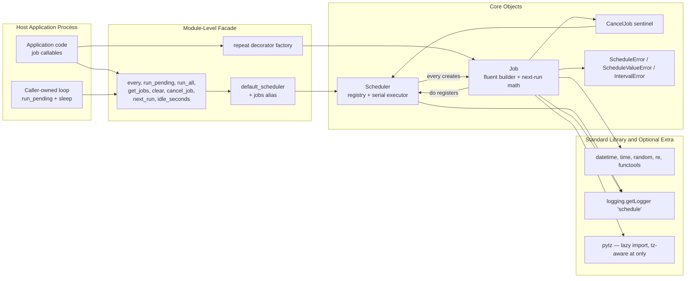
```mermaid
flowchart LR
    subgraph HostProcess["Host Application Process"]
        UserCode["Application code<br/>job callables"]
        Loop["Caller-owned loop<br/>run_pending + sleep"]
    end
    subgraph Facade["Module-Level Facade"]
        DefaultSched["default_scheduler<br/>+ jobs alias"]
        Shortcuts["every, run_pending, run_all,<br/>get_jobs, clear, cancel_job,<br/>next_run, idle_seconds"]
        RepeatDec["repeat decorator factory"]
    end
    subgraph CoreObjects["Core Objects"]
        SchedulerCls["Scheduler<br/>registry + serial executor"]
        JobCls["Job<br/>fluent builder + next-run math"]
        Sentinel["CancelJob sentinel"]
        ErrorTypes["ScheduleError / ScheduleValueError / IntervalError"]
    end
    subgraph Dependencies["Standard Library and Optional Extra"]
        Stdlib["datetime, time, random, re, functools"]
        Logging["logging.getLogger 'schedule'"]
        Pytz["pytz — lazy import, tz-aware at only"]
    end
    UserCode --> Shortcuts
    UserCode --> RepeatDec
    Loop --> Shortcuts
    Shortcuts --> DefaultSched
    DefaultSched --> SchedulerCls
    RepeatDec --> JobCls
    SchedulerCls -->|every creates| JobCls
    JobCls -->|do registers| SchedulerCls
    JobCls --> Sentinel
    Sentinel --> SchedulerCls
    JobCls --> ErrorTypes
    JobCls --> Stdlib
    JobCls --> Pytz
    SchedulerCls --> Logging
    JobCls --> Logging
```

#### 1.2.2.3 Core Technical Approach

The design rests on five decisions that are visible directly in `schedule/__init__.py`:

1. **Builder pattern for configuration.** The module docstring names the pattern explicitly. `Scheduler.every()` returns an *unconfigured* `Job`; each unit and weekday accessor is a property that mutates `self` and returns `self`, so `every(5).to(10).minutes` reads as prose while remaining a single mutable object. Registration is deferred to `do()`, which binds the callable, computes the first `next_run`, and only then appends the job to `scheduler.jobs` — meaning an incomplete chain never pollutes the registry.
2. **Fail-fast validation with a typed error hierarchy.** Singular accessors raise `IntervalError` when the interval is not 1 (`"Use seconds instead of second"`); weekday accessors reject intervals of 2 or more weeks; `at()` validates format with unit-specific regular expressions; `_schedule_next_run()` rejects unknown units; `until()` rejects past deadlines and unsupported types; `_weekday_index()` rejects unknown day names.
3. **Synchronous, ordered, best-effort execution.** `run_pending()` filters on `job.should_run` (`now >= next_run`) and executes the survivors in `sorted()` order — ordering made possible by `Job.__lt__` comparing `next_run`. Execution is single-threaded and in-line with the caller; missed occurrences are intentionally not replayed.
4. **Naive-local time as the public contract, with timezone math internal.** `_schedule_next_run()` performs its arithmetic in the requested timezone when one is present, applies `_move_to_at_time()` and `_correct_utc_offset()`, then converts back and strips `tzinfo` so `next_run` remains naive local — explicitly to preserve backwards compatibility. `_correct_utc_offset()` compares the UTC offset before and after normalization, shifts the moment to preserve the requested wall-clock time, and, when the requested time falls into a DST gap, schedules one offset later as a documented best effort.
5. **Optional dependency isolation.** `pytz` is imported *inside* `Job.at()` and only when a `tz` argument is supplied, which is what allows `pyproject.toml` to declare an empty `dependencies` list while still offering a `timezone` extra. `tox.ini` proves the contract by running every supported Python version both with and without `pytz` installed.

Cancellation is expressed through two complementary paths: a job may return `CancelJob` (or the class itself) and `Scheduler._run_job()` will unschedule it, or a deadline set with `until()` causes `Job.run()` to return `CancelJob` — before execution if already overdue, and after execution if the newly computed `next_run` exceeds the deadline, in which case cancellation takes priority over the job's own return value.

### 1.2.3 Success Criteria

The repository does not publish business SLAs, uptime targets, or adoption KPIs; no such artifact exists in the tree. The criteria below are therefore stated as the objectives the project *itself* verifies, every one of which is mechanically enforced by `.github/workflows/ci.yml` and `tox.ini` on every push and pull request against `master`, or is directly measurable from the source.

#### 1.2.3.1 Measurable Objectives

| Objective | Enforced/measured value | Enforcement point |
|---|---|---|
| Broad interpreter support | Green build on Python 3.7, 3.8, 3.9, 3.10, 3.11, 3.12 | `.github/workflows/ci.yml` matrix (max-parallel 6) |
| Optional-dependency neutrality | 12 tox environments: each version with **and** without `pytz` | `tox.ini` `envlist = py3{7,8,9,10,11,12}{,-pytz}` |
| Zero required runtime dependencies | `dependencies = []`; stdlib-only imports | `pyproject.toml`, `schedule/__init__.py` lines 41–48 |
| Full suite passes | 81 test methods; verified locally as `81 passed` on Python 3.12 | `test_schedule.py` |
| Static type correctness | `mypy -p schedule` runs in every test environment | `tox.ini` `[testenv]`, `setup.cfg` |
| Formatting conformance | `black --check .` must pass (black pinned to `20.8b1`) | `tox.ini` `[testenv:format]`, `requirements-dev.txt` |
| Documentation integrity | `sphinx-build -W` — any warning fails the build | `tox.ini` `[testenv:docs]` |
| Packaging metadata validity | `python setup.py check --strict --metadata --restructuredtext` | `tox.ini` `[testenv:setuppy]` |
| Coverage visibility | Per-version coverage uploaded to Coveralls and aggregated | `.github/workflows/ci.yml` jobs `test` and `coveralls` |

#### 1.2.3.2 Critical Success Factors

| Factor | Why it is critical | Evidence of investment |
|---|---|---|
| Correctness of next-run arithmetic across timezones and DST | The single most defect-prone area; 1.2.1 and 1.2.2 releases were dominated by timezone fixes | 37 of 81 tests are timezone/DST/UTC-focused; `HISTORY.rst` 1.2.2 lists fixes #601, #602, #604, #623 |
| Deterministic, reproducible test conditions | Local-time assertions are meaningless without a fixed zone | `test_schedule.py` sets `TZ` to a POSIX Berlin rule and calls `time.tzset()`; `mock_datetime` context manager supplies a controlled `datetime` subclass |
| Preserved backwards compatibility | Downstream code depends on naive-local `next_run` semantics | Explicit compatibility comment and conversion in `_schedule_next_run()` lines 740–748 |
| API readability | Readability is the product's differentiator, not an aesthetic preference | Fluent property chain, human-sentence `__repr__`, actionable error strings |
| Minimal dependency and packaging footprint | Enables use in constrained environments and even manual vendoring | Single 945-line module; `docs/installation.rst` "consists of a single sourcefile MIT licenced" |
| Documentation completeness | Non-goals and workarounds must be discoverable to prevent misuse | 13 substantive `.rst` pages including a dedicated non-goals section and a 14-workflow example catalogue |
| Sustained community contribution | Long-term maintenance of a small library depends on contributors | 46 contributors in `AUTHORS.rst`; per-release attribution in `HISTORY.rst` |

#### 1.2.3.3 Key Performance Indicators

| Indicator | Observed value | Derivation |
|---|---|---|
| Supported Python versions under CI | 6 (3.7 → 3.12) | `.github/workflows/ci.yml` |
| Tox environments per full run | 12 (6 versions × with/without `pytz`) | `tox.ini` |
| Independent CI gate jobs | 5 (`test`, `coveralls`, `docs`, `formatting`, `setuppy`) | `.github/workflows/ci.yml` |
| Test methods | 81, all passing | `test_schedule.py`; verified execution |
| Timezone/DST-focused tests | 37 | `test_schedule.py` |
| Distinct IANA timezones exercised | 15 | `test_schedule.py` |
| Issue-numbered regression tests | 6 (issues #592, #605, #608 ×4) | `test_schedule.py` |
| Test-to-implementation line ratio | ≈ 1.7 : 1 (1,599 vs 945 lines) | `test_schedule.py`, `schedule/__init__.py` |
| Required runtime dependencies | 0 | `pyproject.toml` |
| Optional runtime dependencies | 1 (`pytz`) | `pyproject.toml`, `docs/installation.rst` |
| Public API entry points | 6 top-level classes + 9 public module functions | `schedule/__init__.py` |
| Released versions to date | 23 (0.1.0 → 1.2.2) | `HISTORY.rst` |
| Named contributors | 46 | `AUTHORS.rst` |

Versioning discipline is itself a stated criterion: `docs/development.rst` declares that the project follows semantic versioning and prescribes the release ritual — update `HISTORY.rst` and `AUTHORS.rst`, bump the version in both `setup.py` and `docs/conf.py`, merge to `master`, tag `X.Y.Z`, then build a wheel and upload to TestPyPI followed by PyPI.


## 1.3 Scope

### 1.3.1 In-Scope

#### 1.3.1.1 Core Features and Functionalities

**Must-have capabilities.** The following are implemented in `schedule/__init__.py` and are the load-bearing obligations of the library. Each is exercised by `test_schedule.py` and documented under `docs/`.

| Must-have capability | Definition of the delivered behavior |
|---|---|
| Interval scheduling | `every(n)` combined with `seconds`, `minutes`, `hours`, `days`, `weeks` (and singular aliases valid only when `n == 1`) |
| Weekday scheduling | `monday` through `sunday`, restricted to a weekly interval; `_move_to_next_weekday` advances to the nearest matching day without moving if already on it |
| Clock-time anchoring | `at()` with unit-aware validated formats: `HH:MM(:SS)` daily, `(MM):SS` hourly, `:SS` minutely |
| Timezone-aware anchoring | `at(time, tz)` accepting an IANA string or a `pytz` timezone object, with DST-correct next-run computation |
| Randomized intervals | `to(latest)` producing an inclusive random interval between `interval` and `latest` |
| Deadline enforcement | `until()` accepting `datetime`, `timedelta`, `time`, or one of five string formats; the job never runs past its deadline |
| Callable binding | `do(func, *args, **kwargs)` binding any callable with positional and keyword arguments |
| Decorator registration | `@repeat(every(...).unit)` registering a function while returning it unmodified |
| Job lifecycle management | `tag`, `get_jobs`, `clear`, `cancel_job`, and the `CancelJob` self-unschedule sentinel |
| Execution entry points | `run_pending()` for due jobs in next-run order and `run_all(delay_seconds)` for forced execution |
| Introspection | `next_run` (globally or per tag), `idle_seconds`, and human-readable `__str__` / `__repr__` |
| Multiple schedulers | Independent `Scheduler()` instances alongside the module-level `default_scheduler` |
| Structured diagnostics | DEBUG-level records on the `schedule` logger for run, cancel, and clear operations |
| Distributed type information | PEP 561 `py.typed` marker plus inline annotations across the public surface |

**Primary user workflows.** `docs/examples.rst` catalogues fourteen supported workflows; these constitute the contractual usage surface of the library.

| Workflow | Entry point |
|---|---|
| Run a job on a recurring interval or weekday-at-time | `every(...).<unit>[.at(...)].do(job)` |
| Register a job declaratively via decorator | `@repeat(every(10).minutes)` |
| Pass positional/keyword arguments to a job | `do(job, name="Peter")` |
| Cancel one specific job | `schedule.cancel_job(job)` |
| Run a job exactly once | job returns `schedule.CancelJob` |
| Enumerate all scheduled jobs | `schedule.get_jobs()` |
| Cancel every scheduled job | `schedule.clear()` |
| Select or cancel a group of jobs by identifier | `get_jobs("friend")`, `clear("daily-tasks")` |
| Run at randomized intervals | `every(5).to(10).minutes` |
| Bound a job with a deadline | `until("18:30")`, `until(timedelta(hours=8))`, `until(datetime(...))` |
| Sleep precisely until the next due job | `idle_seconds()` (negative if overdue, `None` if idle) |
| Force-run everything, optionally spaced | `run_all()`, `run_all(delay_seconds=10)` |
| Schedule in a foreign timezone | `at("10:30", "America/New_York")` |
| Drive the scheduler continuously | `while True: run_pending(); sleep(1)` |

**Essential integrations.** In scope are exactly four integration contracts, all of which are consumer-side:

1. **The Python standard library** — `datetime`, `time`, `random`, `re`, `functools`, `logging`, `collections.abc`, and `typing` are the only imports in the runtime module.
2. **`pytz`, optionally and lazily** — imported inside `Job.at()` only when a timezone is supplied; declared as the `timezone` extra in `pyproject.toml` and validated by the `-pytz` tox environments.
3. **The `schedule` standard logger** — a single `logging.getLogger("schedule")` instance; consumers attach their own handlers and levels as shown in `docs/logging.rst`.
4. **Packaging and distribution toolchain** — setuptools ≥ 61 build backend (`pyproject.toml`), wheel build and twine upload to TestPyPI then PyPI (`docs/development.rst`), with `MANIFEST.in` controlling sdist contents (`README.rst`, `HISTORY.rst`, `LICENSE.txt`, `test_schedule.py`).

**Key technical requirements.**

| Requirement | Specification |
|---|---|
| Interpreter floor | `python_requires = ">=3.7"` in `setup.py`; `requires-python = ">= 3.7"` in `pyproject.toml` |
| Verified interpreters | 3.7, 3.8, 3.9, 3.10, 3.11, 3.12 in the CI matrix |
| Platform neutrality | `Operating System :: OS Independent` classifier; CI executes on `ubuntu-latest` |
| Dependency budget | Zero required; one optional (`pytz`) |
| Type checking | `mypy -p schedule` must pass in every tox environment |
| Formatting | `black --check .` with black pinned to `20.8b1` |
| Documentation build | `sphinx-build -W` (warnings as errors), alabaster theme |
| Packaging metadata | `setup.py check --strict --metadata --restructuredtext` must pass |
| Versioning policy | Semantic versioning, per `docs/development.rst` |
| License | MIT (`LICENSE.txt`) |

#### 1.3.1.2 Implementation Boundaries

**System boundaries.** The library's boundary is the process boundary of the *host application*. Everything the package does happens between a call to `every()` and the return of `run_pending()`/`run_all()`; it owns no thread, no process, no port, and no file.

| Boundary dimension | Inside the boundary | Outside the boundary |
|---|---|---|
| Process model | Objects living in the caller's process; execution driven by the caller | Any daemon, service, or supervisor |
| Concurrency | Serial, in-line execution on the calling thread | Thread/process pools, event loops — supplied by the caller |
| State | In-memory `Scheduler.jobs` list | Any datastore, file, or cache |
| Time source | `datetime.datetime.now()` and, when requested, a `pytz` zone | NTP, external clock services |
| Failure handling | Configuration validation errors raised eagerly | Runtime job exceptions, which propagate to the caller |
| Interfaces | Python function/property calls only | HTTP, RPC, CLI, message brokers |

**User groups covered.** The audience is Python developers embedding the scheduler in their own code — `setup.py` declares `Intended Audience :: Developers` and there is no end-user interface of any kind in the repository. Within that audience, three distinct consumer profiles are served by explicit documentation: single-schedule application authors (`docs/examples.rst`), larger installations needing several independent schedulers (`docs/multiple-schedulers.rst`), and contributors to the library itself (`docs/development.rst`). Deliverables for all three — source, tests, docs, CI, and packaging metadata — are in scope for this repository.

**Geographic and market coverage.**

| Dimension | Coverage in scope |
|---|---|
| Platform reach | OS-independent Python package; validated on Linux runners in CI |
| Distribution reach | PyPI (primary), with documented third-party availability on Ubuntu/Debian, Arch AUR, and conda-forge — the latter explicitly not maintained by this project |
| Timezone reach | Any zone resolvable by `pytz`; 15 distinct IANA zones spanning the Americas, Europe, Asia, and Oceania are exercised in `test_schedule.py`, including quarter-hour offsets such as `Asia/Kathmandu` and the Chatham rule |
| Natural language | English only (`Natural Language :: English` classifier); documentation is English-only reStructuredText |
| Calendar/regional rules | Timezone offsets and DST transitions only |

**Data domains included.** The library handles exactly one data domain: *scheduling metadata held in memory for the lifetime of the process.* Per `Job.__init__`, this comprises `interval`, `latest`, `unit`, `at_time`, `at_time_zone`, `start_day`, `cancel_after`, `tags`, `last_run`, `next_run`, the owning `scheduler` reference, and `job_func` — a `functools.partial` that retains references to the callable and any arguments the caller bound. No business, personal, or persisted data is modeled, read, written, or transmitted anywhere in the package.

### 1.3.2 Out-of-Scope

#### 1.3.2.1 Explicitly Excluded Features and Capabilities

`docs/index.rst` devotes a dedicated section — "When **not** to use Schedule" — to naming the exclusions, making these authoritative rather than inferred. The table below pairs each published exclusion with the corroborating evidence found in the source.

| Excluded capability | Published position | Corroboration in source |
|---|---|---|
| Job persistence across restarts | Look elsewhere if you need the schedule remembered between restarts | No file, database, or serialization call exists in `schedule/__init__.py`; state is a plain in-memory list |
| Sub-second / exact timing | Look elsewhere if you need sub-second precision | `should_run` is a coarse `now >= next_run` comparison evaluated only when the caller polls |
| Concurrent execution | Look elsewhere if you need multiple threads | No threading, locking, or async construct appears anywhere in the module; `run_pending` is a serial loop |
| Localization of workdays/holidays | Look elsewhere if you need workday or holiday awareness | Only weekday names and timezone offsets are modeled |
| Accounting for job duration | "Schedule does not account for the time it takes for the job function to execute" | `run()` sets `last_run` then reschedules from the current moment |
| Built-in background operation | "Out of the box it is not possible to run the schedule in the background" | No thread is ever created by the library |
| Catching job exceptions | "Schedule doesn't catch exceptions that happen during job execution" | `Job.run()` invokes `job_func()` with no `try`/`except` |
| Replaying missed runs | Intended behavior that `run_pending()` does not run missed jobs | Docstring at `schedule/__init__.py` lines 89–98 |
| Timezone-aware public datetimes | All internal datetimes are naive; `next_run`/`last_run` are always local | `_schedule_next_run()` strips `tzinfo` for backwards compatibility (lines 740–748) |
| DST awareness without a timezone | Timezone-unaware jobs do not take clock changes into account | `at_time_zone is None` short-circuits `_correct_utc_offset` |
| Timezones outside `at()` | "Timezones are only available in the `.at` function" | `tz` is a parameter of `Job.at()` alone |
| `@repeat` on instance methods | "The `@repeat` decorator does not work on non-static class methods" | `docs/examples.rst` |
| Weekday selection on multi-week intervals | Using `.monday()` on a job scheduled every 2 or more weeks "is not supported" | `IntervalError` raised in each weekday property (lines 380–455) |
| Non-English localization | English-only classifier and documentation | `setup.py`, `docs/` |

Also outside the delivered artifact set: there is no CLI, no configuration file format, no admin or web interface, no authentication or authorization concept, no metrics/tracing exporter, no health endpoint, and no containerization or deployment manifest anywhere in the repository. `.github/` contains a single file, `workflows/ci.yml` — there are no issue templates, contributor guides, or code-of-conduct documents; contributor guidance lives instead in `docs/development.rst`.

#### 1.3.2.2 Future Phase Considerations

The repository contains **no roadmap, backlog, or planning document**; forward-looking intent must therefore be read from the two markers that do exist and from the trajectory recorded in `HISTORY.rst`.

| Forward-looking signal | Observation |
|---|---|
| Open design question in source | `schedule/__init__.py` line 840: the module-level `jobs` alias carries an inline `todo` asking whether it should be a copy (e.g. `jobs()`) instead of a live reference to `default_scheduler.jobs` |
| Documentation TODO rendering enabled | `docs/conf.py` sets `todo_include_todos = True` with `sphinx.ext.todo` loaded, so any future `todo` directives will surface in published docs |
| Interpreter support cadence | `HISTORY.rst` shows an established add-new/drop-old rhythm: 1.0.0 dropped Python 2.7 and 3.5 while adding 3.8/3.9; 1.2.0 dropped 3.6 while adding 3.10/3.11; 1.2.2 added 3.12 |
| Timezone hardening trend | The three most recent releases are dominated by timezone and DST corrections (#583 in 1.2.1; #601, #602, #604, #623 in 1.2.2), matching the head of the git history |
| Compatibility constraint on change | Semantic versioning is the declared policy, and the naive-local `next_run` contract is preserved deliberately — so any move to timezone-aware public datetimes would be a breaking change requiring a major release |

Items that a future phase would have to introduce from scratch — because no partial implementation exists — include persistence, concurrency primitives, missed-run catch-up, sub-second scheduling, holiday/workday calendars, and any form of remote or multi-process coordination.

#### 1.3.2.3 Integration Points Not Covered

| Integration not provided | Notes |
|---|---|
| Message brokers and distributed queues | `docs/parallel-execution.rst` shows how a *caller* can bridge to a queue (`jobqueue.put`) and mentions beanstalkd/beanstalkc, but no broker client ships with the package |
| Databases and durable stores | No database driver, ORM, or file persistence anywhere in the package |
| Thread pools, process pools, and async runtimes | Threading and queue patterns are documented as *user-implemented* examples only |
| OS schedulers (cron, systemd timers, Task Scheduler) | The library is positioned as an alternative to these, not an interface to them |
| Metrics, tracing, and alerting backends | Only standard-library `logging` at DEBUG level is emitted |
| Non-`pytz` timezone providers | `Job.at()` accepts a string or `pytz.BaseTzInfo` and raises `ScheduleValueError` otherwise; `zoneinfo` objects are not accepted |
| Distribution channels outside PyPI | Ubuntu, Debian, AUR, and conda-forge packages exist but `docs/installation.rst` states they are not maintained by this project |
| Configuration or secret management systems | Jobs are configured only through Python API calls; no config parsing exists |

#### 1.3.2.4 Unsupported Use Cases

| Use case | Why it is unsupported |
|---|---|
| Durable, restart-surviving schedules | Job state is in-memory only and is lost when the process exits |
| High-precision or real-time triggering | Resolution is bounded by how often the caller polls `run_pending()`; sub-second precision is an explicit non-goal |
| Long-running jobs on the scheduler thread | A long job blocks the serial loop and delays every other job; `docs/index.rst` directs such work off the main thread |
| Guaranteed at-least-once or catch-up semantics | Missed occurrences are intentionally skipped, never replayed |
| Multi-process or clustered scheduling with coordination | Each `Scheduler` is process-local with no leader election, locking, or shared state |
| Business-calendar scheduling (holidays, workdays, month-ends) | Only fixed intervals, weekdays, and clock times are modeled |
| Cron-expression compatibility | No cron-expression parser exists; scheduling is expressed exclusively through the fluent API |
| Unattended resilience to failing jobs | An uncaught job exception interrupts the `run_xyz` call; the caller must wrap jobs defensively |
| `@repeat` on non-static class methods | Explicitly documented as not working |
| Timezone-aware jobs without `pytz` | Raises `ModuleNotFoundError`; `docs/faq.rst` documents the resolution as installing `pytz` |
| Sub-minute `at()` anchoring on unsupported units | `at()` rejects any unit other than days, hours, or minutes (or a weekday-qualified week) with `ScheduleValueError` |
| Deadlines in the past | `until()` raises `ScheduleValueError` for a moment already elapsed |


## 1.4 References

Every factual claim in Section 1 is grounded in the repository artifacts listed below. No external web sources were required or used.

### 1.4.1 Source and Package Files

- `schedule/__init__.py` — the complete 945-line runtime implementation; established the module docstring's builder-pattern self-description, the standard-library-only import set (lines 41–48), the `ScheduleError`/`ScheduleValueError`/`IntervalError` hierarchy (53–68), the `CancelJob` sentinel (71–76), the `Scheduler` registry and serial executor (79–206), the `Job` fluent builder with unit/weekday properties (209–455), `tag`/`at`/`to`/`until`/`do` (457–664), `should_run`/`run` (666–698), next-run computation with DST correction (700–817), the module-level facade and `repeat` decorator (833–913), and the private weekday helpers (916–945)
- `schedule/py.typed` — empty PEP 561 marker confirming type information is exported to consumers
- `schedule/` — the sole implementation folder, containing only the module and the typing marker

### 1.4.2 Tests and Continuous Integration

- `test_schedule.py` — 1,599-line unittest suite; established the count of 81 test methods (37 timezone/DST/UTC-focused), the 15 distinct IANA timezones exercised, the four POSIX TZ rule constants, the deterministic `TZ`/`time.tzset()` harness, the `mock_datetime` context manager, and the six issue-numbered regression tests (#592, #605, #608 ×4). Executed during investigation as `python3 -m pytest test_schedule.py -q` on Python 3.12.3 → `81 passed`
- `.github/workflows/ci.yml` — established the "Tests" workflow, its push/pull-request triggers on `master`, the six-version Python matrix with `max-parallel: 6`, and the five CI jobs (`test`, `coveralls`, `docs`, `formatting`, `setuppy`) including the parallel Coveralls upload and aggregation steps
- `.github/workflows/` — confirmed to contain `ci.yml` only; no issue templates or contributor policy files exist

### 1.4.3 Packaging, Build, and Tooling Configuration

- `setup.py` — established version 1.2.2, the description "Job scheduling for humans.", `packages=["schedule"]`, `package_data` shipping `py.typed`, MIT license, author Daniel Bader, the `cron`/`clockwork` keywords, all classifiers (Production/Stable, OS Independent, Intended Audience :: Developers, Natural Language :: English, Python 3.7–3.12), and `python_requires=">=3.7"`
- `pyproject.toml` — established the setuptools ≥ 61 build backend, `dependencies = []`, `requires-python = ">= 3.7"`, the `timezone = ["pytz"]` optional extra, maintainer Sijmen Huizenga, and the documentation/repository/issues/changelog URLs
- `setup.cfg` — established that mypy is configured over the `schedule` package
- `tox.ini` — established the 12-environment matrix `py3{7,8,9,10,11,12}{,-pytz}`, the pytest-with-coverage plus `mypy -p schedule` command pair, and the `docs` (`sphinx-build -W`), `format` (`black --check .`), and `setuppy` (`setup.py check --strict`) environments
- `requirements-dev.txt` — established the 11 development dependencies and the `black==20.8b1` pin
- `MANIFEST.in` — established sdist contents (`README.rst`, `HISTORY.rst`, `LICENSE.txt`, `test_schedule.py`)

### 1.4.4 Project Documentation

- `README.rst` — established the product tagline, the five headline claims (human API, in-process/"no extra processes needed", no external dependencies, excellent test coverage, Python 3.7–3.12), the install command, the canonical `run_pending()` loop, authorship, and the "Rethinking Cron"/clockwork inspirations
- `docs/index.rst` — established the authoritative "When **not** to use Schedule" non-goals (persistence, exact timing, concurrency, localization), the statement that job execution time is not accounted for, the documentation toctree, and the project's "simple solution for simple scheduling problems" positioning
- `docs/installation.rst` — established the Python support statement, the single-optional-dependency contract, the pip/apt/AUR/conda-forge distribution channels with the maintainer disclaimer and OUTDATED warnings, and the "single sourcefile MIT licenced" vendoring note
- `docs/examples.rst` — established the fourteen documented user workflows and the `@repeat` non-static-method limitation
- `docs/timezones.rst` — established that timezones are available only in `.at()`, the naive-datetime storage contract, DST behavior with and without a timezone, and the spring-forward/fall-back/cross-timezone worked examples
- `docs/parallel-execution.rst` — established serial-by-default execution with its stated rationale, and the thread-per-job and shared-queue workaround patterns
- `docs/background-execution.rst` — established that background operation is not available out of the box and the caller-supplied `ScheduleThread`/`threading.Event` pattern
- `docs/multiple-schedulers.rst` — established that multiple independent `Scheduler` instances are supported and each needs its own `run_pending()`
- `docs/exception-handling.rst` — established that job exceptions are never caught and bubble up, plus the `catch_exceptions` decorator remedy
- `docs/logging.rst` — established the `schedule` logger name, the DEBUG level contract, sample log output, and the per-job logging decorator pattern
- `docs/faq.rst` — established the troubleshooting surface, including the missing-`pytz` failure mode and its resolution
- `docs/reference.rst` — established the published API reference surface via Sphinx autodoc directives
- `docs/development.rst` — established the contributor workflow, the black 20.8b1 requirement, the Sphinx/alabaster documentation build, the semantic-versioning policy, and the tag → wheel → twine release procedure
- `docs/changelog.rst` — established that `HISTORY.rst` is the single changelog source
- `docs/conf.py` — established version/release 1.2.2, the alabaster theme, the enabled Sphinx extensions, and `todo_include_todos = True`
- `docs/` — the Sphinx documentation tree; established the count of substantive `.rst` pages and the presence of the `_static` and `_templates` asset folders

### 1.4.5 Project History, Governance, and Licensing

- `HISTORY.rst` — established the 23-release lineage from 0.1.0 (2013-05-19) to 1.2.2 (2024-05-25), the interpreter add/drop cadence, and the feature milestones (timezone `.at()` and `py.typed` in 1.2.0; `@repeat`, `.until()`, tag filtering, and type annotations in 1.1.0; exception hierarchy in 0.6.0; Travis → GitHub Actions in 1.0.0; timezone fixes in 1.2.1 and 1.2.2)
- `AUTHORS.rst` — established the 46 named community contributors
- `LICENSE.txt` — established the MIT license text and the 2013 Daniel Bader copyright
- Repository root — established the top-level inventory of manifests, documentation, tests, and folders used throughout this section


# 2. Product Requirements

## 2.1 Feature Catalog

The repository contains **no requirements document, backlog, issue template, or acceptance-test specification**. `.github/` holds exactly one file (`workflows/ci.yml`), and there is no roadmap or planning artifact anywhere in the tree. The catalog below is therefore *reverse-derived* from three authoritative sources that do exist:

| Evidence source | Role in this catalog |
|---|---|
| `schedule/__init__.py` (945 lines) | Definitive statement of implemented behavior; every feature is anchored to a line range |
| `test_schedule.py` (1,599 lines, 81 test methods) | Executable specification; supplies the acceptance criteria in §2.2 |
| `docs/*.rst` (13 substantive pages) | Published contracts, worked examples, and explicit non-goals |
| `HISTORY.rst` | Release in which each capability first appeared — used for requirement version tracking in §2.5 |

**Status convention.** Every feature listed carries the status **Completed**: each is implemented in release 1.2.2 (`SCHEDULE_VERSION = "1.2.2"` in `setup.py`), covered by at least one passing test method (locally verified: `81 passed`), and the package is classified `Development Status :: 5 - Production/Stable` in `setup.py`. No feature in this repository is in a proposed or partially built state — the only forward-looking marker in the source is an inline `todo` on the module-level `jobs` alias (`schedule/__init__.py` line 840) questioning whether it should return a copy.

**Priority convention.** Priority reflects observable emphasis inside the repository — centrality in the call graph, share of the test suite, and prominence in `README.rst` / `docs/index.rst` — not an external business mandate, because none is recorded in the tree.

**Documented non-goals are deliberately absent from this catalog.** `docs/index.rst` (lines 53–62) directs users elsewhere for job persistence, sub-second precision, concurrent execution, and workday/holiday localization; `docs/background-execution.rst` and `docs/parallel-execution.rst` present threading and queue patterns as *caller-implemented examples*. Accordingly, no persistence, concurrency, retry, catch-up, metrics, authentication, CLI, or configuration-file feature is claimed.

### 2.1.1 Feature Inventory

| ID | Feature Name | Category | Priority |
|---|---|---|---|
| F-001 | Fluent Interval Scheduling | Scheduling Core | Critical |
| F-002 | Weekday Scheduling | Scheduling Core | High |
| F-003 | Clock-Time Anchoring (`at()`) | Scheduling Core | High |
| F-004 | Timezone-Aware Scheduling with DST Correction | Time Correctness | High |
| F-005 | Randomized Interval Scheduling (`to()`) | Scheduling Core | Medium |
| F-006 | Deadline-Bounded Jobs (`until()`) | Job Lifecycle | Medium |
| F-007 | Callable Binding and Job Registration (`do()`) | Job Definition | Critical |
| F-008 | Decorator-Based Registration (`@repeat`) | Developer Ergonomics | Medium |
| F-009 | Serial Execution Engine (`run_pending` / `run_all`) | Execution | Critical |
| F-010 | Job Cancellation (`CancelJob` / `cancel_job`) | Job Lifecycle | High |
| F-011 | Job Tagging, Retrieval and Bulk Clearing | Job Management | Medium |
| F-012 | Schedule Introspection (`next_run` / `idle_seconds`) | Observability | Medium |
| F-013 | Human-Readable Job Representation | Developer Ergonomics | Medium |
| F-014 | Diagnostic Logging | Observability | Medium |
| F-015 | Scheduler Instancing and Module-Level Facade | API Surface | High |
| F-016 | Typed Error Hierarchy and Fail-Fast Validation | Reliability | High |
| F-017 | Zero-Dependency Distribution and Type Information | Packaging & Distribution | High |

| ID | Status | First released (`HISTORY.rst`) | Primary implementation anchor |
|---|---|---|---|
| F-001 | Completed | 0.1.x foundation | `schedule/__init__.py` 162–170, 325–378, 700–748 |
| F-002 | Completed | 0.3.0 (2014-06-14) | `schedule/__init__.py` 380–455, 916–945 |
| F-003 | Completed | 0.2.0 hourly; 0.6.0 second precision | `schedule/__init__.py` 471–559, 750–771 |
| F-004 | Completed | 1.2.0 (#517); hardened 1.2.1–1.2.2 | `schedule/__init__.py` 498–508, 717–748, 773–817 |
| F-005 | Completed | 0.5.0 (2017-11-16) | `schedule/__init__.py` 561–574, 709–712 |
| F-006 | Completed | 1.1.0 (#195) | `schedule/__init__.py` 576–642, 819–820 |
| F-007 | Completed | 0.1.9 argument forwarding | `schedule/__init__.py` 644–664 |
| F-008 | Completed | 1.1.0 (#148) | `schedule/__init__.py` 899–913 |
| F-009 | Completed | 0.1.7 API names; 0.1.8 delay default | `schedule/__init__.py` 89–120, 172–175, 666–698 |
| F-010 | Completed | 0.2.0 (2013-11-09) | `schedule/__init__.py` 71–76, 150–160, 172–175 |
| F-011 | Completed | 0.4.0 tags; 1.1.0 (#419) filtering | `schedule/__init__.py` 122–148, 457–469 |
| F-012 | Completed | 0.1.9; tag filter 1.2.0 (#463) | `schedule/__init__.py` 177–206 |
| F-013 | Completed | 1.1.0 (#430); 1.2.0 (#569) | `schedule/__init__.py` 264–323 |
| F-014 | Completed | 1.0.0 moved to DEBUG | `schedule/__init__.py` 50, 113–117, 144–160 |
| F-015 | Completed | 0.1.7 `schedule.jobs` | `schedule/__init__.py` 79–87, 833–896 |
| F-016 | Completed | 0.6.0 (#271); 0.5.0 (#125) | `schedule/__init__.py` 53–68, 704–708, 644–663 |
| F-017 | Completed | 1.1.0 annotations; 1.2.0 `py.typed` (#521) | `pyproject.toml`, `setup.py`, `schedule/py.typed` |

### 2.1.2 F-001 — Fluent Interval Scheduling

| Metadata | Value |
|---|---|
| Unique ID | F-001 |
| Feature Name | Fluent Interval Scheduling |
| Feature Category | Scheduling Core |
| Priority Level | Critical |
| Status | Completed |

**Description**

- **Overview** — `Scheduler.every(interval=1)` (`schedule/__init__.py` 162–170) returns an *unconfigured* `Job`. Chained unit properties (325–378) set `Job.unit` to `seconds`, `minutes`, `hours`, `days`, or `weeks` and return `self`, so `every(10).minutes` is a single mutable object read as prose. Singular aliases (`second`, `minute`, `hour`, `day`, `week`) exist for the `interval == 1` case. `_schedule_next_run()` (700–748) turns the pair into `datetime.timedelta(**{unit: interval})` and advances the moment until it is strictly in the future.
- **Business Value** — This is the differentiator the project advertises: `README.rst` leads with "A simple to use API for scheduling jobs, made for humans", and the module docstring names the builder pattern explicitly. Readability is the product, not an aesthetic extra.
- **User Benefits** — No crontab string to author or review; schedules are self-documenting at the call site; both `every().hour` and `every(2).hours` are legal spellings, with the wrong spelling rejected with an actionable message.
- **Technical Context** — Properties mutate `self` rather than returning new objects, which is why an abandoned chain leaves no residue: registration happens only in `do()` (F-007). Interval arithmetic is pure `datetime`; there is no clock other than `datetime.datetime.now()`.

**Dependencies**

| Dependency type | Detail |
|---|---|
| Prerequisite features | None — this is the root of every scheduling expression |
| System dependencies | `datetime` (timedelta arithmetic, `now()`); `typing` for annotations |
| External dependencies | None |
| Integration requirements | Requires F-007 to bind a callable and register, and F-009 for the job to execute |

### 2.1.3 F-002 — Weekday Scheduling

| Metadata | Value |
|---|---|
| Unique ID | F-002 |
| Feature Name | Weekday Scheduling |
| Feature Category | Scheduling Core |
| Priority Level | High |
| Status | Completed |

**Description**

- **Overview** — Seven properties, `monday` through `sunday` (`schedule/__init__.py` 380–455), set `Job.start_day` and return `self.weeks`, making `every().wednesday.at("13:15")` a weekly job anchored to a weekday. `_move_to_next_weekday()` (916–928) advances a moment to the nearest matching weekday and deliberately does **not** move it when it is already that day; `_weekday_index()` (931–945) validates the day name.
- **Business Value** — Covers the "every Wednesday at 13:15" class of work that would otherwise require a cron expression, using the same fluent grammar as interval scheduling.
- **User Benefits** — Weekday names read naturally, same-day scheduling works as users expect (a Wednesday 22:38:10 job created at 22:38:05 on a Wednesday fires the same day — `test_weekday_at_todady`), and multi-week weekday combinations are rejected loudly rather than silently misbehaving.
- **Technical Context** — Weekday scheduling is intentionally restricted to a weekly interval: each accessor raises `IntervalError` when `interval != 1` with the message "Scheduling .<day>() jobs is only allowed for weekly jobs…". `_schedule_next_run()` additionally enforces `unit == "weeks"` whenever `start_day` is set (721–724).

**Dependencies**

| Dependency type | Detail |
|---|---|
| Prerequisite features | F-001 (weekday accessors delegate to the `weeks` unit) |
| System dependencies | `datetime` (`weekday()`, `timedelta`) |
| External dependencies | None |
| Integration requirements | Composes with F-003 (`at()` is permitted because `start_day` is set) and F-016 for the interval guard |

### 2.1.4 F-003 — Clock-Time Anchoring (`at()`)

| Metadata | Value |
|---|---|
| Unique ID | F-003 |
| Feature Name | Clock-Time Anchoring |
| Feature Category | Scheduling Core |
| Priority Level | High |
| Status | Completed |

**Description**

- **Overview** — `Job.at(time_str, tz=None)` (`schedule/__init__.py` 471–559) pins a job to a wall-clock time. The accepted format is inferred from the unit: `HH:MM(:SS)` for daily and weekday jobs, `(MM):SS` for hourly jobs, `:SS` for minutely jobs. `_move_to_at_time()` (750–771) then overwrites the relevant components of the computed moment — always second and microsecond, minute for `days`/`hours`/weekday jobs, hour for `days`/weekday jobs.
- **Business Value** — Enables the canonical example that appears in `README.rst` and `docs/index.rst` (`every().day.at("10:30")`), which is the most common real-world scheduling request the library serves.
- **User Benefits** — One method covers three granularities; each unit has its own validation message so a mis-typed format is diagnosed precisely (for example `every().hour.at("2:30:00")` is rejected with "Invalid time format for an hourly job (valid format is (MM)?:SS)").
- **Technical Context** — Validation is three anchored regular expressions (lines 513, 518, 524) plus an explicit 0–23 hour bound (544–549). `at()` is rejected outright unless the unit is `days`, `hours`, or `minutes`, or a weekday has been selected (493–496), and a non-string argument raises `TypeError` (510–511).

**Dependencies**

| Dependency type | Detail |
|---|---|
| Prerequisite features | F-001 (unit must already be `days`/`hours`/`minutes`) or F-002 (weekday selected) |
| System dependencies | `re` for format validation; `datetime.time` for the stored value |
| External dependencies | None (unless the optional `tz` argument is used — see F-004) |
| Integration requirements | Feeds `_schedule_next_run()` (F-001) and is the only entry point for F-004 |

### 2.1.5 F-004 — Timezone-Aware Scheduling with DST Correction

| Metadata | Value |
|---|---|
| Unique ID | F-004 |
| Feature Name | Timezone-Aware Scheduling with DST Correction |
| Feature Category | Time Correctness |
| Priority Level | High |
| Status | Completed |

**Description**

- **Overview** — Passing `tz` to `at()` (`schedule/__init__.py` 498–508) stores a `pytz` zone on `Job.at_time_zone`. `_schedule_next_run()` then performs its arithmetic in that zone (`datetime.datetime.now(self.at_time_zone)`, line 717) and `_correct_utc_offset()` (773–817) keeps the requested wall-clock time stable across UTC-offset changes; when the requested time falls inside a DST gap it schedules one offset later as a documented best effort. The result is converted back to local time and stripped of `tzinfo` (740–747) so the public `next_run` contract stays naive-local.
- **Business Value** — Lets a single process schedule work in the timezone of a remote market or team, which `docs/timezones.rst` demonstrates end-to-end (a Berlin host scheduling `at("10:30", "America/New_York")` yields `next_run` 15:30 local). This is the area the project has invested the most in: releases 1.2.1 and 1.2.2 are dominated by timezone fixes.
- **User Benefits** — Correct behavior across the two hard cases users cannot easily test themselves — the spring-forward gap and the autumn fold — with the documented outcomes published in `docs/timezones.rst`.
- **Technical Context** — `pytz` is imported *inside* `at()` (line 499) and only when `tz` is supplied, which is what allows `pyproject.toml` to declare `dependencies = []`. Zones may be given as a string or a `pytz.BaseTzInfo` object; anything else raises `ScheduleValueError`. Timezone support exists nowhere else in the API — `docs/timezones.rst` states that timezones are only available in the `.at` function.

**Dependencies**

| Dependency type | Detail |
|---|---|
| Prerequisite features | F-003 — `tz` is a parameter of `at()` alone |
| System dependencies | `datetime` (`astimezone`, `utcoffset`, `replace`) |
| External dependencies | `pytz`, declared as the optional `timezone` extra in `pyproject.toml`; absent `pytz`, using `tz` raises `ModuleNotFoundError` (`docs/faq.rst`) |
| Integration requirements | Must not break the zero-dependency contract of F-017; validated by the six `-pytz` tox environments alongside six without |

### 2.1.6 F-005 — Randomized Interval Scheduling (`to()`)

| Metadata | Value |
|---|---|
| Unique ID | F-005 |
| Feature Name | Randomized Interval Scheduling |
| Feature Category | Scheduling Core |
| Priority Level | Medium |
| Status | Completed |

**Description**

- **Overview** — `Job.to(latest)` (`schedule/__init__.py` 561–574) records an upper bound; `_schedule_next_run()` then draws `random.randint(self.interval, self.latest)` (line 712) on every reschedule, so `every(5).to(10).minutes` runs every N minutes with 5 ≤ N ≤ 10, inclusive on both ends.
- **Business Value** — Spreads load and avoids thundering-herd alignment between multiple processes running the same schedule, without the caller writing jitter logic.
- **User Benefits** — A single chained call converts any fixed schedule into a jittered one; the randomized range is visible in the job's `repr` ("Every 5 to 30 minutes do job()").
- **Technical Context** — The draw happens per scheduling cycle rather than once at definition time, so successive intervals differ. An inverted range is rejected with `ScheduleError("`latest` is greater than `interval`")` at scheduling time (709–711).

**Dependencies**

| Dependency type | Detail |
|---|---|
| Prerequisite features | F-001 (the unit and base interval it randomizes) |
| System dependencies | `random.randint` |
| External dependencies | None |
| Integration requirements | Surfaces through F-013 (`__repr__` renders the `to` clause) |

### 2.1.7 F-006 — Deadline-Bounded Jobs (`until()`)

| Metadata | Value |
|---|---|
| Unique ID | F-006 |
| Feature Name | Deadline-Bounded Jobs |
| Feature Category | Job Lifecycle |
| Priority Level | Medium |
| Status | Completed |

**Description**

- **Overview** — `Job.until(until_time)` (`schedule/__init__.py` 576–642) sets `Job.cancel_after` from a `datetime.datetime`, a `datetime.timedelta` (relative to now), a `datetime.time` (today's date), or a string in one of five `strptime` formats. `_is_overdue()` (819–820) is consulted twice inside `run()`: before execution (the job is skipped and unscheduled) and after execution (if the newly computed `next_run` is past the deadline, `CancelJob` is returned and takes priority over the job's own return value).
- **Business Value** — Expresses time-boxed work — "poll every hour until 18:30" — without the caller tracking end-times or cleaning up afterwards. `docs/examples.rst` documents the contract plainly: the job will not run after the deadline.
- **User Benefits** — Five accepted input shapes cover absolute, relative, and time-only deadlines; expired jobs disappear from the registry automatically, so no stale entries accumulate.
- **Technical Context** — A deadline already in the past is rejected at configuration time with `ScheduleValueError("Cannot schedule a job to run until a time in the past")` (638–641); an unsupported type raises `TypeError`; an unparseable string raises `ScheduleValueError("Invalid string format for until()")`. Parsing is delegated to `_decode_datetimestr()` (822–830), which tries each format in order.

**Dependencies**

| Dependency type | Detail |
|---|---|
| Prerequisite features | F-001 (a job under construction); F-010 for the unscheduling mechanism |
| System dependencies | `datetime` (`strptime`, `combine`, `timedelta`) |
| External dependencies | None |
| Integration requirements | Deadline enforcement occurs inside `Job.run()`, so it only takes effect when the caller drives F-009 |

### 2.1.8 F-007 — Callable Binding and Job Registration (`do()`)

| Metadata | Value |
|---|---|
| Unique ID | F-007 |
| Feature Name | Callable Binding and Job Registration |
| Feature Category | Job Definition |
| Priority Level | Critical |
| Status | Completed |

**Description**

- **Overview** — `Job.do(job_func, *args, **kwargs)` (`schedule/__init__.py` 644–664) is the terminal call of every chain. It wraps the callable and its arguments in `functools.partial`, copies metadata with `functools.update_wrapper`, computes the first `next_run`, verifies a scheduler is associated, and only then appends the job to `scheduler.jobs`.
- **Business Value** — Defines the boundary between configuration and commitment: nothing is scheduled until a callable is attached, which is what makes an interrupted definition chain harmless.
- **User Benefits** — Any callable is accepted — named functions, lambdas, and `functools.partial` objects are all exercised in the test suite — and arguments supplied at definition time are forwarded verbatim at execution time.
- **Technical Context** — Ordering matters: `_schedule_next_run()` runs *before* `scheduler.jobs.append(self)` (657–663), so a job with an invalid unit raises `ScheduleValueError` and never enters the registry. A `Job` constructed directly without a scheduler raises `ScheduleError` on `do()`.

**Dependencies**

| Dependency type | Detail |
|---|---|
| Prerequisite features | F-001 (a valid unit must be set); optionally F-002…F-006 for refinement |
| System dependencies | `functools.partial`, `functools.update_wrapper` |
| External dependencies | None |
| Integration requirements | Registry mutation targets the owning `Scheduler` (F-015); registered jobs become visible to F-009, F-011, and F-012 |

### 2.1.9 F-008 — Decorator-Based Registration (`@repeat`)

| Metadata | Value |
|---|---|
| Unique ID | F-008 |
| Feature Name | Decorator-Based Registration |
| Feature Category | Developer Ergonomics |
| Priority Level | Medium |
| Status | Completed |

**Description**

- **Overview** — `repeat(job, *args, **kwargs)` (`schedule/__init__.py` 899–913) is a decorator factory. Its inner `_schedule_decorator` calls `job.do(decorated_function, *args, **kwargs)` and returns the **original** function unchanged, so `@repeat(every(10).minutes)` registers a job as a side effect of definition while leaving the function directly callable.
- **Business Value** — Moves schedule declaration next to the function it governs, which keeps job inventories readable in application code.
- **User Benefits** — Declarative registration with argument support (`@repeat(every().minute, 1, 2, "three", foo=23)`), and the decorated symbol remains the plain function for direct calls and unit testing.
- **Technical Context** — The decorator is a thin adapter over F-007; it adds no scheduling semantics of its own. `docs/examples.rst` records one limitation explicitly: the decorator does not work on non-static class methods.

**Dependencies**

| Dependency type | Detail |
|---|---|
| Prerequisite features | F-007 (delegates to `Job.do`); a job expression from F-001 (typically via the F-015 facade) |
| System dependencies | None beyond the Python decorator protocol |
| External dependencies | None |
| Integration requirements | The decorated job lands in whichever scheduler produced the job expression |

### 2.1.10 F-009 — Serial Execution Engine (`run_pending` / `run_all`)

| Metadata | Value |
|---|---|
| Unique ID | F-009 |
| Feature Name | Serial Execution Engine |
| Feature Category | Execution |
| Priority Level | Critical |
| Status | Completed |

**Description**

- **Overview** — `Scheduler.run_pending()` (`schedule/__init__.py` 89–101) selects jobs whose `should_run` is true (`now >= next_run`, 666–672) and executes them in `sorted()` order — ordering supplied by `Job.__lt__` comparing `next_run` (257–262). `Scheduler.run_all(delay_seconds=0)` (103–120) forces every job to run regardless of schedule, sleeping `delay_seconds` between jobs to spread load. `Job.run()` (674–698) invokes the bound callable, stamps `last_run`, and immediately reschedules.
- **Business Value** — Keeps execution inside the caller's own process and loop — the "No extra processes needed!" claim in `README.rst` — so no broker, daemon, or deployment artifact is required.
- **User Benefits** — The host application retains complete control over cadence and threading; `run_all()` provides a deterministic way to flush every job, which is also how the test suite triggers execution.
- **Technical Context** — Execution is strictly serial and in-line on the calling thread; `docs/parallel-execution.rst` states this is a deliberate design choice. Missed occurrences are never replayed — the `run_pending()` docstring (93–97) calls this intended behavior. Job exceptions are not caught (line 691 has no `try`/`except`), which `docs/exception-handling.rst` documents as bubbling up and interrupting the `run_xyz` call.

**Dependencies**

| Dependency type | Detail |
|---|---|
| Prerequisite features | F-007 (only registered jobs are considered); F-001 for the `next_run` values compared |
| System dependencies | `datetime.datetime.now()`; `time.sleep` for `run_all` spacing |
| External dependencies | None |
| Integration requirements | The caller must drive the loop (`docs/examples.rst`); F-010 cancellation is applied through `_run_job`; F-014 emits DEBUG records per run |

### 2.1.11 F-010 — Job Cancellation (`CancelJob` / `cancel_job`)

| Metadata | Value |
|---|---|
| Unique ID | F-010 |
| Feature Name | Job Cancellation |
| Feature Category | Job Lifecycle |
| Priority Level | High |
| Status | Completed |

**Description**

- **Overview** — Two complementary paths exist. A job may return the `CancelJob` sentinel (`schedule/__init__.py` 71–76) and `Scheduler._run_job()` (172–175) will unschedule it — accepting either the class itself or an instance. Alternatively the caller invokes `Scheduler.cancel_job(job)` (150–160), which removes the job from the registry and treats an unknown job as a silent no-op logged at DEBUG.
- **Business Value** — Supports run-once and self-terminating jobs without the caller maintaining external bookkeeping; `docs/examples.rst` presents "return `schedule.CancelJob`" as the canonical way to run a job exactly once.
- **User Benefits** — Cancellation can be driven from inside the job (return the sentinel) or outside it (call `cancel_job`), and passing something that is not a scheduled job never raises.
- **Technical Context** — `cancel_job` swallows `ValueError` from `list.remove`, so cancelling twice is safe. F-006 reuses this path by returning `CancelJob` from `Job.run()` when a deadline is reached.

**Dependencies**

| Dependency type | Detail |
|---|---|
| Prerequisite features | F-009 (the sentinel is inspected in `_run_job`); F-007 for registry membership |
| System dependencies | `list.remove` semantics on `Scheduler.jobs` |
| External dependencies | None |
| Integration requirements | Reused by F-006 for deadline expiry; exposed at module level by F-015; logged by F-014 |

### 2.1.12 F-011 — Job Tagging, Retrieval and Bulk Clearing

| Metadata | Value |
|---|---|
| Unique ID | F-011 |
| Feature Name | Job Tagging, Retrieval and Bulk Clearing |
| Feature Category | Job Management |
| Priority Level | Medium |
| Status | Completed |

**Description**

- **Overview** — `Job.tag(*tags)` (`schedule/__init__.py` 457–469) attaches any number of hashable identifiers to a job, storing them in a `set` so duplicates are discarded. `Scheduler.get_jobs(tag)` (122–133) returns a copy of the whole registry or only jobs carrying the tag; `Scheduler.clear(tag)` (135–148) deletes all jobs or only the tagged subset.
- **Business Value** — Gives applications a grouping primitive for managing families of jobs — `docs/examples.rst` shows `clear('daily-tasks')` preventing every job in that group from running again.
- **User Benefits** — Group selection and group cancellation use the same identifier vocabulary; tags are arbitrary hashables (strings, integers, booleans) rather than a fixed enumeration.
- **Technical Context** — `tag()` enforces hashability eagerly with `TypeError("Tags must be hashable")`. `get_jobs()` returns a *copy* (`self.jobs[:]`), so callers cannot mutate the registry accidentally; `clear()` uses in-place slice deletion/assignment so the `jobs` alias exposed by F-015 continues to reference the same list object.

**Dependencies**

| Dependency type | Detail |
|---|---|
| Prerequisite features | F-007 (jobs must be registered to be retrievable or clearable) |
| System dependencies | `collections.abc.Hashable`; `set` semantics |
| External dependencies | None |
| Integration requirements | Tag filtering is also consumed by F-012 (`get_next_run(tag)`); clearing and cancelling emit F-014 DEBUG records |

### 2.1.13 F-012 — Schedule Introspection (`next_run` / `idle_seconds`)

| Metadata | Value |
|---|---|
| Unique ID | F-012 |
| Feature Name | Schedule Introspection |
| Feature Category | Observability |
| Priority Level | Medium |
| Status | Completed |

**Description**

- **Overview** — `Scheduler.get_next_run(tag=None)` (`schedule/__init__.py` 177–193), exposed also as the `next_run` property (line 195), returns the earliest `next_run` among all jobs or among jobs carrying a tag, and `None` when there are no jobs or no match. `Scheduler.idle_seconds` (197–206) converts that instant into seconds from now, returning `None` when nothing is scheduled.
- **Business Value** — Lets the host loop sleep exactly as long as necessary instead of polling every second, which is the pattern `docs/examples.rst` recommends for efficiency.
- **User Benefits** — A two-line idle loop replaces fixed-interval polling; a tag argument narrows the question to one group of jobs; the `None` return is a clean "nothing scheduled" signal rather than an exception.
- **Technical Context** — Selection uses `min(jobs_filtered)`, relying on the same `Job.__lt__` ordering as F-009. `docs/examples.rst` documents that the value is negative when the next job is already overdue.

**Dependencies**

| Dependency type | Detail |
|---|---|
| Prerequisite features | F-001 (computed `next_run` values); F-007 (registration); F-011 for the tag filter |
| System dependencies | `datetime` subtraction and `total_seconds()` |
| External dependencies | None |
| Integration requirements | Consumed by caller-owned loops together with F-009; mirrored at module level by F-015 |

### 2.1.14 F-013 — Human-Readable Job Representation

| Metadata | Value |
|---|---|
| Unique ID | F-013 |
| Feature Name | Human-Readable Job Representation |
| Feature Category | Developer Ergonomics |
| Priority Level | Medium |
| Status | Completed |

**Description**

- **Overview** — `Job.__str__` (`schedule/__init__.py` 264–276) produces the structured form `Job(interval=…, unit=…, do=…, args=…, kwargs=…)`; `Job.__repr__` (278–323) produces an English sentence such as `Every 1 day at 10:30:00 do job() (last run: [never], next run: 2022-03-20 15:30:00)`, singularizing the unit when the interval is 1 and rendering the `to` clause for randomized jobs.
- **Business Value** — Makes logs and interactive sessions self-explanatory, reinforcing the "for humans" positioning without any extra tooling.
- **User Benefits** — A job printed in a REPL or a log line states its full configuration and both timestamps; unbound or partially configured jobs still render instead of raising.
- **Technical Context** — Both methods fall back to `repr(self.job_func)` when the callable has no `__name__` (covering lambdas and `functools.partial`), and substitute `"()"`, `"{}"`, and `"[None]"` placeholders when `job_func` is still `None`. `HISTORY.rst` records these as deliberate fixes (1.1.0 issue #430; 1.2.0 issue #569, "Fix crash repr on partially constructed job").

**Dependencies**

| Dependency type | Detail |
|---|---|
| Prerequisite features | None for rendering; reflects state produced by F-001…F-007 |
| System dependencies | `datetime.strftime` |
| External dependencies | None |
| Integration requirements | F-014 embeds `str(job)` in its DEBUG records, so representation robustness is a logging prerequisite |

### 2.1.15 F-014 — Diagnostic Logging

| Metadata | Value |
|---|---|
| Unique ID | F-014 |
| Feature Name | Diagnostic Logging |
| Feature Category | Observability |
| Priority Level | Medium |
| Status | Completed |

**Description**

- **Overview** — The module creates a single logger, `logging.getLogger("schedule")` (`schedule/__init__.py` line 50), and emits DEBUG records for forced runs ("Running *all* %i jobs with %is delay in between", 113–117), individual job runs and cancellations (687–696), job cancellation (157–160), and clearing (144–147).
- **Business Value** — Provides operational insight through the standard library logging framework, so records flow into whatever pipeline the host application already runs — no exporter, agent, or configuration file is introduced.
- **User Benefits** — Enabling diagnostics is a two-line change documented in `docs/logging.rst`; because the library configures no handlers or levels, it is silent by default and cannot interfere with the host's logging setup.
- **Technical Context** — All records are DEBUG level — `HISTORY.rst` notes 1.0.0 changed log messages to DEBUG. Messages use `%`-style lazy formatting and embed `str(job)` (F-013).

**Dependencies**

| Dependency type | Detail |
|---|---|
| Prerequisite features | F-013 for message content; F-009/F-010/F-011 are the emitting call sites |
| System dependencies | `logging` |
| External dependencies | None |
| Integration requirements | The consuming application attaches handlers and sets the level on the `schedule` logger (`docs/logging.rst`) |

### 2.1.16 F-015 — Scheduler Instancing and Module-Level Facade

| Metadata | Value |
|---|---|
| Unique ID | F-015 |
| Feature Name | Scheduler Instancing and Module-Level Facade |
| Feature Category | API Surface |
| Priority Level | High |
| Status | Completed |

**Description**

- **Overview** — The module instantiates `default_scheduler = Scheduler()` (`schedule/__init__.py` line 837), exposes its registry as the `jobs` alias (line 840), and provides eight delegating shortcuts — `every`, `run_pending`, `run_all`, `get_jobs`, `clear`, `cancel_job`, `next_run`, `idle_seconds` (843–896). Independently, applications may instantiate any number of `Scheduler()` objects, each owning its own `self.jobs` list (86–87).
- **Business Value** — Delivers the two-line integration story of `README.rst` for the simple case while still supporting larger installations; `docs/multiple-schedulers.rst` states multiple schedulers are supported.
- **User Benefits** — Zero-ceremony usage (`schedule.every().day.do(job)`) with no object to construct or thread through the codebase, plus clean isolation when separate lifecycles or cadences are needed.
- **Technical Context** — Every shortcut is a one-line delegation, so module-level and instance-level behavior cannot diverge. Each scheduler is fully independent — `docs/multiple-schedulers.rst` notes that `run_pending()` must be called on every scheduler. There is no locking or cross-scheduler coordination anywhere in the module.

**Dependencies**

| Dependency type | Detail |
|---|---|
| Prerequisite features | None; it is the surface through which F-001…F-012 are reached |
| System dependencies | Module-level state in `schedule/__init__.py` |
| External dependencies | None |
| Integration requirements | The `jobs` alias references `default_scheduler.jobs` directly — an inline `todo` at line 840 flags this as an open design question |

### 2.1.17 F-016 — Typed Error Hierarchy and Fail-Fast Validation

| Metadata | Value |
|---|---|
| Unique ID | F-016 |
| Feature Name | Typed Error Hierarchy and Fail-Fast Validation |
| Feature Category | Reliability |
| Priority Level | High |
| Status | Completed |

**Description**

- **Overview** — Three exception classes form a hierarchy: `ScheduleError` → `ScheduleValueError` → `IntervalError` (`schedule/__init__.py` 53–68). Configuration faults are raised at definition time rather than at execution time: wrong singular/plural spelling, weekday accessors on multi-week intervals, invalid `at()` units and formats, out-of-range hours, invalid timezone types, inverted `to()` ranges, past or unparseable `until()` values, unknown weekday names, and missing or invalid units.
- **Business Value** — Misconfiguration surfaces at startup where it is cheap to fix, instead of silently producing a schedule that never fires. `HISTORY.rst` records the hierarchy as a deliberate 0.6.0 investment (issue #271) and improved error messages in 1.1.0 (issues #280, #439).
- **User Benefits** — Callers can catch broadly (`ScheduleError`) or narrowly (`IntervalError`); messages name the fix, for example "Use seconds instead of second" and "Invalid unit (valid units are `days`, `hours`, and `minutes`)".
- **Technical Context** — Because registration happens last inside `do()` (F-007), a chain that raises never enters the registry. `test_misconfigured_job_wont_break_scheduler` proves that abandoned chains leave a fresh `Scheduler` fully usable — the behavior `HISTORY.rst` attributes to 0.5.0 issue #125.

**Dependencies**

| Dependency type | Detail |
|---|---|
| Prerequisite features | Cross-cutting; enforced by F-001…F-007 |
| System dependencies | Python exception machinery; `re` for format checks |
| External dependencies | `pytz.exceptions.UnknownTimeZoneError` propagates unchanged for unknown zone names (F-004) |
| Integration requirements | Callers wishing to guard *runtime* job failures must wrap their own functions — `docs/exception-handling.rst` — because the library does not catch job exceptions |

### 2.1.18 F-017 — Zero-Dependency Distribution and Type Information

| Metadata | Value |
|---|---|
| Unique ID | F-017 |
| Feature Name | Zero-Dependency Distribution and Type Information |
| Feature Category | Packaging & Distribution |
| Priority Level | High |
| Status | Completed |

**Description**

- **Overview** — `pyproject.toml` declares `dependencies = []` and a single optional extra, `timezone = ["pytz"]`; `setup.py` ships the package with `package_data={"schedule": ["py.typed"]}` and `python_requires=">=3.7"`. The runtime module imports only standard-library names (`schedule/__init__.py` 41–48).
- **Business Value** — "Very lightweight and no external dependencies" is a headline claim in both `README.rst` and `docs/index.rst`; it keeps the library adoptable in constrained or audit-sensitive environments. `docs/installation.rst` notes the library consists of a single MIT-licensed source file, so it can even be vendored manually.
- **User Benefits** — Installing `schedule` expands the dependency tree by nothing; type checkers see inline annotations because of the PEP 561 marker; timezone support is opt-in rather than imposed.
- **Technical Context** — The contract is mechanically verified: `tox.ini` defines `envlist = py3{7,8,9,10,11,12}{,-pytz}` — twelve environments, each Python version with and without `pytz` — and runs `mypy -p schedule` in every one. `.github/workflows/ci.yml` executes that matrix on every push and pull request against `master`, plus separate `docs` (`sphinx-build -W`), `formatting` (`black --check .`), and `setuppy` (`setup.py check --strict --metadata --restructuredtext`) gates.

**Dependencies**

| Dependency type | Detail |
|---|---|
| Prerequisite features | None; it constrains every other feature — new code may not add a required import |
| System dependencies | setuptools ≥ 61 build backend (`pyproject.toml`); `schedule/py.typed` marker; `setup.cfg` mypy configuration |
| External dependencies | `pytz` (optional, runtime); tooling in `requirements-dev.txt` (pytest, pytest-cov, mypy, `black==20.8b1`, Sphinx, pytz, types-pytz) |
| Integration requirements | F-004 must keep `pytz` imported lazily; CI must stay green on Python 3.7 through 3.12 |

## 2.2 Functional Requirements Table

Every requirement below is stated so that it can be verified against the repository. Acceptance criteria cite the implementing line range in `schedule/__init__.py` and, wherever one exists, the test method in `test_schedule.py` that already asserts the behavior. Where **no** automated test covers a requirement, that is stated explicitly rather than implied.

### 2.2.1 Requirement Conventions and Global Baseline

| Convention | Meaning as applied in this section |
|---|---|
| Priority `Must-Have` | The feature does not function, or a published contract in `docs/` is broken, without it |
| Priority `Should-Have` | Documented convenience or diagnostic behavior; absence degrades usability, not correctness |
| Priority `Could-Have` | Ergonomic refinement with no functional consequence |
| Complexity `High` | Multi-branch time arithmetic or offset correction (concentrated in `_schedule_next_run`, `_move_to_at_time`, `_correct_utc_offset`) |
| Complexity `Medium` | Input parsing/validation or registry mutation with several branches |
| Complexity `Low` | Single-branch property, delegation, or accessor |

The following baselines apply to **every** requirement in this section and are not repeated per feature; only feature-specific deltas are listed in the tables below.

| Baseline dimension | Repository-wide position |
|---|---|
| Performance | All operations are in-process and in-memory. The costliest paths are linear in the number of registered jobs: `run_pending()` filters and sorts due jobs (`schedule/__init__.py` 99–101), `get_next_run()` takes `min()` over the registry (188–193), `clear()`/`get_jobs()` rebuild or copy the list (122–148). There is no I/O of any kind. **No latency, throughput, or availability target is published anywhere in the repository**; scheduling resolution is bounded by how often the caller invokes `run_pending()`, and sub-second precision is an explicit non-goal (`docs/index.rst`). Reference point: the full 81-method suite executes in 0.12 s on Python 3.12. |
| Data requirements | Exactly one data domain — in-memory scheduling metadata for the life of the process. The fields are those assigned in `Job.__init__` (227–255): `interval`, `latest`, `job_func`, `unit`, `at_time`, `at_time_zone`, `last_run`, `next_run`, `start_day`, `cancel_after`, `tags`, `scheduler`. Nothing is serialized, persisted, or transmitted. |
| Security requirements | The module contains no authentication, authorization, cryptography, network, subprocess, filesystem, deserialization, or `eval`/`exec` code — imports are limited to `collections.abc`, `datetime`, `functools`, `logging`, `random`, `re`, `time`, `typing` (41–48). Jobs execute synchronously with the full privileges of the host process, so the caller-supplied callable is the trust boundary; exceptions from it are not caught (`docs/exception-handling.rst`). `random` is used for interval jitter only and is not a security primitive. |
| Compliance requirements | MIT license (`LICENSE.txt`); PEP 561 type distribution via `schedule/py.typed`; PEP 517/518 build metadata (`pyproject.toml`); semantic versioning declared in `docs/development.rst`; formatting enforced by `black==20.8b1`; static typing enforced by `mypy -p schedule`. No personal, financial, or regulated data is processed, so no data-protection regime is in scope. |

### 2.2.2 F-001 — Fluent Interval Scheduling

| ID | Description | Acceptance criteria | Priority / Complexity |
|---|---|---|---|
| F-001-RQ-001 | `every(interval=1)` returns an unconfigured `Job` bound to the scheduler without registering it | `Scheduler.every` (162–170) returns a `Job` whose `unit` is `None`; the registry is unchanged until `do()`. `test_misconfigured_job_wont_break_scheduler` (test_schedule.py:1591) abandons two chains and `run_pending()` still succeeds | Must-Have / Low |
| F-001-RQ-002 | Plural unit properties set `Job.unit` to `seconds`/`minutes`/`hours`/`days`/`weeks` and return the same job for chaining | `test_time_units` (108) asserts `every().<unit>.unit == "<unit>"` for all five units (325–378) | Must-Have / Low |
| F-001-RQ-003 | Singular aliases are legal only when `interval == 1`; otherwise `IntervalError` naming the plural form | `test_time_units` (108) and `test_at_time` (268) assert `IntervalError` for `every(interval=2).second/.minute/.hour/.day/.week`; `test_singular_time_units_match_plural_units` (236) asserts alias equivalence | Must-Have / Low |
| F-001-RQ-004 | `next_run` equals now plus `interval × unit`, advanced by whole periods until strictly in the future | Lines 729–734 (`period = timedelta(**{unit: interval})`, `while next_run <= now`). `test_next_run_time` (463), `_day_end` (486), `_hour_end` (510), `_minute_end` (557) assert exact datetimes under `mock_datetime` | Must-Have / Medium |

| Technical specification | Detail |
|---|---|
| Input parameters | `interval: int` (default 1) to `every()`; unit selected by attribute access, no arguments |
| Output / response | The same mutated `Job` (fluent chaining); after `do()`, `Job.next_run` is a naive local `datetime` |
| Performance criteria | Constant-time arithmetic per reschedule; the `while` loop advances by whole periods, so cost is proportional to elapsed periods only when a job is far overdue |
| Data requirements | `Job.interval`, `Job.unit`, `Job.next_run` (in memory) |

| Validation rule | Detail |
|---|---|
| Business rules | Exactly five units are legal; singular spellings represent the `interval == 1` case only |
| Data validation | `_schedule_next_run()` rejects a missing or unknown unit with `ScheduleValueError` (704–708) — see F-016-RQ-002 |
| Security requirements | Baseline only; `interval` is used solely as a `timedelta` component |
| Compliance requirements | Annotated (`interval: int`) and covered by the `mypy -p schedule` gate |

### 2.2.3 F-002 — Weekday Scheduling

| ID | Description | Acceptance criteria | Priority / Complexity |
|---|---|---|---|
| F-002-RQ-001 | `monday`…`sunday` set `start_day` and force the `weeks` unit | Lines 380–455 return `self.weeks` after setting `start_day`. `test_run_pending` (1387) registers `every().sunday` and it fires only on the expected date; `test_run_every_weekday_at_specific_time_today` (1427) | Must-Have / Low |
| F-002-RQ-002 | All seven weekday accessors raise `IntervalError` when `interval != 1`, naming the accessor and the restriction | `test_at_time` (268) asserts `IntervalError` for `every(interval=2).monday` … `.sunday`; `test_time_units` (108) matches the message text with `assertRaisesRegex` | Must-Have / Low |
| F-002-RQ-003 | A moment already on the target weekday is not advanced; otherwise it moves to the nearest future matching weekday | `_move_to_next_weekday` (916–928) adds `days_ahead`, adding 7 only when negative. `test_move_to_next_weekday_today` (1252), `_tommorrow` (1259), `_nextweek` (1266); `test_weekday_at_todady` (390) and `test_run_every_weekday_at_specific_time_past_today` (1438) | Must-Have / Medium |
| F-002-RQ-004 | An unknown weekday name, or `start_day` with a unit other than `weeks`, is rejected with `ScheduleValueError` | `_weekday_index` (931–945) lists the valid days in the message; `_schedule_next_run` enforces `unit == "weeks"` (721–724). `test_time_units` asserts both cases (test_schedule.py:195–203) | Must-Have / Low |

| Technical specification | Detail |
|---|---|
| Input parameters | Attribute access only (`.monday` … `.sunday`); no arguments |
| Output / response | Mutated `Job` with `start_day` set and `unit == "weeks"` |
| Performance criteria | One `weekday()` comparison plus one `timedelta` addition per reschedule |
| Data requirements | `Job.start_day` (lowercase weekday string) |

| Validation rule | Detail |
|---|---|
| Business rules | Weekday anchoring is meaningful only for weekly jobs; multi-week weekday jobs are unsupported by design (`docs/index.rst` non-goals reinforce the narrow scope) |
| Data validation | Day names are matched against a fixed lowercase tuple; failure raises `ScheduleValueError` |
| Security requirements | Baseline only |
| Compliance requirements | Behavior documented in `docs/examples.rst`; introduced in 0.3.0 per `HISTORY.rst` |

### 2.2.4 F-003 — Clock-Time Anchoring (`at()`)

| ID | Description | Acceptance criteria | Priority / Complexity |
|---|---|---|---|
| F-003-RQ-001 | `at()` is permitted only when the unit is `days`, `hours`, or `minutes`, or a weekday has been selected | Lines 493–496 raise `ScheduleValueError("Invalid unit (valid units are \`days\`, \`hours\`, and \`minutes\`)")`. **No dedicated test method exercises this guard**; it is verified by code inspection | Must-Have / Low |
| F-003-RQ-002 | The accepted string format is unit-specific — `HH:MM(:SS)` daily/weekday, `(MM):SS` hourly, `:SS` minutely — each with its own error message | Anchored regexes at lines 513, 518, 524. `test_at_time` (268) rejects seven malformed daily strings; `test_at_time_hour` (411) rejects eight hourly strings; `test_at_time_minute` (445) rejects six minutely strings | Must-Have / Medium |
| F-003-RQ-003 | A non-string `time_str` raises `TypeError("at() should be passed a string")` | Lines 510–511. Asserted in `test_at_time` (268), `test_at_time_hour` (411) and `test_at_time_minute` (445) via `assertRaises(TypeError, …, 2)` | Must-Have / Low |
| F-003-RQ-004 | The anchored components are applied per unit — second and microsecond always, minute for `days`/`hours`/weekday jobs, hour for `days`/weekday jobs — and the hour must be 0–23 | `_move_to_at_time` (750–771); hour bound at 544–549. `test_at_time` asserts hour/minute/second for `"10:30"`, `"20:59"`, `"10:30:50"`; `test_at_time_hour` asserts `":30"`, `":10"`, `":00"` and the `MM:SS` form including roll-over to the next hour; `test_at_time_minute` asserts second anchoring and minute roll-over; `test_time_units` asserts `ScheduleValueError` for `"25:00:00"` (test_schedule.py:207) | Must-Have / High |

| Technical specification | Detail |
|---|---|
| Input parameters | `time_str: str` in the unit-appropriate format; optional `tz` (see F-004) |
| Output / response | Mutated `Job` with `at_time: datetime.time`; `ScheduleValueError` or `TypeError` on invalid input |
| Performance criteria | One regex match and one `datetime.time` construction at configuration time; a `replace()` per reschedule |
| Data requirements | `Job.at_time` |

| Validation rule | Detail |
|---|---|
| Business rules | The format must match the repetition granularity — a minutely job cannot be given `HH:MM:SS` (documented in the `at()` docstring, 475–486) |
| Data validation | Three anchored regular expressions plus an explicit 0–23 hour range check; tokens are converted with `int()` after matching |
| Security requirements | Baseline only; the regexes are anchored, fixed-length alternations with no unbounded repetition |
| Compliance requirements | Second-level precision has been part of the contract since 0.6.0 (`HISTORY.rst`, issue #267) |

### 2.2.5 F-004 — Timezone-Aware Scheduling with DST Correction

| ID | Description | Acceptance criteria | Priority / Complexity |
|---|---|---|---|
| F-004-RQ-001 | `tz` accepts an IANA string or a `pytz.BaseTzInfo`; any other type raises `ScheduleValueError`, and an unknown zone name propagates `pytz.exceptions.UnknownTimeZoneError` | Lines 501–508. `test_tz_invalid_timezone_exceptions` (1146) asserts `UnknownTimeZoneError` for `"FakeZone"` and `ScheduleValueError` for the integer `43` | Must-Have / Low |
| F-004-RQ-002 | `pytz` is imported lazily inside `at()` and only when `tz` is supplied, so the library imports and functions fully without `pytz` installed | `import pytz` at line 499 inside the method. `tox.ini` installs `pytz` only in the `-pytz` environments, so six of twelve environments run the whole suite without it; `make_tz_mock_job` (100–106) and `setup_utc_offset_test` (1163–1174) call `skipTest("pytz unavailable")` | Must-Have / Medium |
| F-004-RQ-003 | Next-run arithmetic is performed in the requested zone, then converted back to naive local time so `next_run`/`last_run` stay timezone-naive | Line 717 (`datetime.datetime.now(self.at_time_zone)`) and 740–747 (`astimezone()` then `replace(tzinfo=None)`). `test_tz` (598), `test_tz_daily_midnight` (610), `_half_hour_offset` (622), `_utc` (700), `_exact_seconds_precision` (734); `docs/timezones.rst` publishes the Berlin→New York result `2022-03-20 15:30:00` | Must-Have / High |
| F-004-RQ-004 | Across a UTC-offset change the requested wall-clock time is preserved; a time inside a DST gap is scheduled one offset later; a folded time resolves to the first occurrence when the time is not fixated | `_correct_utc_offset` (773–817). `test_align_utc_offset_with_dst_gap` (1181) asserts Berlin 2024-03-31 02:30 → hour 3, minute 30, offset +02:00; `test_align_utc_offset_with_dst_fold` (1192) asserts the first occurrence; `test_align_utc_offset_no_change` (1175), `_fold_fixate_1` (1201), `_fixate_2` (1216), `_after_fold_fixate` (1229); scenario coverage in `test_tz_daily_dst_skip_hour` (647), `_dst_overlap_hour` (666), `_issue_592` (721), `_issue_605` (814), `_issue_608_*` (857–916) | Must-Have / High |

| Technical specification | Detail |
|---|---|
| Input parameters | `tz: str \| pytz.BaseTzInfo`, supplied only through `Job.at()` |
| Output / response | `Job.at_time_zone` set; `next_run` remains a naive local `datetime` |
| Performance criteria | Two `utcoffset()` comparisons and up to two `normalize()` calls per reschedule; no zone database is loaded unless a timezone is requested |
| Data requirements | `Job.at_time_zone` (a `pytz` zone object) |

| Validation rule | Detail |
|---|---|
| Business rules | Timezones are available in `.at()` only (`docs/timezones.rst`); jobs without a timezone deliberately ignore clock changes; DST-gap handling is documented as best effort |
| Data validation | Type check against `str` and `pytz.BaseTzInfo`; zone-name validity is delegated to `pytz.timezone()` |
| Security requirements | Baseline only; `pytz` is the single optional third-party import and is loaded on demand |
| Compliance requirements | Timezone data correctness depends on the installed `pytz` release; `types-pytz` is installed in every tox environment for type checking |

### 2.2.6 F-005 — Randomized Interval Scheduling (`to()`)

| ID | Description | Acceptance criteria | Priority / Complexity |
|---|---|---|---|
| F-005-RQ-001 | `to(latest)` makes each scheduling cycle draw an interval N with `interval ≤ N ≤ latest`, inclusive | `random.randint(self.interval, self.latest)` at line 712. `test_time_range` (243) samples 100 jobs of `every(5).to(30).minutes` and asserts more than one distinct minute, minimum ≥ 5 and maximum ≤ 30 | Should-Have / Low |
| F-005-RQ-002 | An inverted range (`latest < interval`) raises `ScheduleError` when the next run is computed | Lines 709–711. `test_time_units` asserts `ScheduleError` from `_schedule_next_run` for `latest` values below the interval (test_schedule.py:216–221) | Must-Have / Low |
| F-005-RQ-003 | The randomized range is visible in the job's representation as `Every A to B <unit>` | Lines 311–315. `test_time_range_repr` (260) asserts the repr starts with `"Every 5 to 30 minutes do job()"` | Could-Have / Low |

| Technical specification | Detail |
|---|---|
| Input parameters | `latest: int` |
| Output / response | Mutated `Job` with `latest` set; a fresh random interval on every reschedule |
| Performance criteria | One `randint` call per reschedule |
| Data requirements | `Job.latest` |

| Validation rule | Detail |
|---|---|
| Business rules | The range is inclusive on both ends (documented in the `to()` docstring, 561–572) |
| Data validation | `latest >= interval` is enforced at scheduling time, not at configuration time |
| Security requirements | `random` provides load jitter only — not a cryptographic guarantee |
| Compliance requirements | Introduced in 0.5.0 per `HISTORY.rst` |

### 2.2.7 F-006 — Deadline-Bounded Jobs (`until()`)

| ID | Description | Acceptance criteria | Priority / Complexity |
|---|---|---|---|
| F-006-RQ-001 | `until()` accepts `datetime.datetime`, `datetime.timedelta` (relative to now), `datetime.time` (today's date), and strings in five `strptime` formats | Lines 605–632; formats listed at 616–622. `test_until_time` (312) asserts the resulting `cancel_after` for every accepted form, including that a time-only value takes today's date | Must-Have / Medium |
| F-006-RQ-002 | Invalid input is rejected: unsupported type → `TypeError`; unparseable string → `ScheduleValueError`; a deadline already in the past → `ScheduleValueError` | Lines 624–641. `test_until_time` asserts `TypeError` for `123`, `ScheduleValueError` for `"123"` and `"01-01-3000"`, and `ScheduleValueError` for a past `datetime`, a negative `timedelta`, and a moment one hour ago | Must-Have / Medium |
| F-006-RQ-003 | The job is unscheduled at its deadline — skipped and cancelled if the current moment is already past it, or cancelled after execution if the new `next_run` exceeds it, with cancellation taking priority over the job's return value | `Job.run` (686–698) with `_is_overdue` (819–820). `test_until_time` asserts a job runs twice then disappears when `next_run` passes the deadline, and that a job whose execution moment is past the deadline runs zero times and disappears | Must-Have / Medium |

| Technical specification | Detail |
|---|---|
| Input parameters | `until_time: datetime \| timedelta \| time \| str` |
| Output / response | Mutated `Job` with `cancel_after`; `CancelJob` returned from `run()` at expiry |
| Performance criteria | Up to five `strptime` attempts at configuration time; two comparisons per run |
| Data requirements | `Job.cancel_after` (naive local `datetime`) |

| Validation rule | Detail |
|---|---|
| Business rules | "The job will not run after the deadline" (`docs/examples.rst`); a past deadline is a configuration error |
| Data validation | Format list attempted in order by `_decode_datetimestr` (822–830); a string without `-` is treated as time-only and re-dated to today |
| Security requirements | Baseline only; parsing uses `strptime` with a fixed format allow-list |
| Compliance requirements | Introduced in 1.1.0 (issue #195) per `HISTORY.rst` |

### 2.2.8 F-007 — Callable Binding and Job Registration (`do()`)

| ID | Description | Acceptance criteria | Priority / Complexity |
|---|---|---|---|
| F-007-RQ-001 | `do(job_func, *args, **kwargs)` binds the callable with its arguments via `functools.partial` and forwards them unchanged at execution time | Line 655. `test_job_func_args_are_passed_on` (1319) registers `do(mock_job, 1, 2, "three", foo=23, bar={})` and asserts `assert_called_once_with` the identical arguments after `run_all()` | Must-Have / Low |
| F-007-RQ-002 | Callable metadata is copied onto the partial so the job can be named in diagnostics | `functools.update_wrapper` at line 656. `test_to_string` (1325) asserts the rendered `do=job_fun` name, which requires the copied `__name__` | Should-Have / Low |
| F-007-RQ-003 | The first `next_run` is computed **before** the job is appended to the registry, and a job with no associated scheduler raises `ScheduleError` | Lines 657–663 (compute → scheduler check → append). Registration ordering is asserted indirectly by `test_misconfigured_job_wont_break_scheduler` (1591) and by `test_at_time`'s `ScheduleValueError` for `every().do(lambda: 0)`; **the no-scheduler branch has no dedicated test** and is verified by inspection | Must-Have / Medium |
| F-007-RQ-004 | Any Python callable is accepted, including named functions, lambdas, and `functools.partial` objects | `test_to_string_lambda_job_func` (1363), `test_repr_functools_partial_job_func` (1367), `test_to_string_functools_partial_job_func` (1377), `test_run_all` (1273) | Must-Have / Low |

| Technical specification | Detail |
|---|---|
| Input parameters | `job_func: Callable`, arbitrary `*args` and `**kwargs` |
| Output / response | The registered `Job` (enabling `job = every()…do(f)`); `ScheduleError` when unbound to a scheduler |
| Performance criteria | One `partial` construction and one list append per registration |
| Data requirements | `Job.job_func` holds strong references to the callable and every bound argument for the job's lifetime |

| Validation rule | Detail |
|---|---|
| Business rules | A job exists in the schedule only once a callable is attached — `do()` is the commit point of the builder chain |
| Data validation | Unit validity is checked by `_schedule_next_run()` before registration; scheduler association is checked immediately after |
| Security requirements | The bound callable executes with host-process privileges and its exceptions are not caught — the caller owns input trust and error handling (`docs/exception-handling.rst`) |
| Compliance requirements | Argument forwarding has been contractual since 0.1.9 per `HISTORY.rst` |

### 2.2.9 F-008 — Decorator-Based Registration (`@repeat`)

| ID | Description | Acceptance criteria | Priority / Complexity |
|---|---|---|---|
| F-008-RQ-001 | `@repeat(<job expression>)` registers the decorated function with the job's scheduler and returns the original function unchanged | Lines 909–911 (`job.do(decorated_function, …)` then `return decorated_function`). `test_run_all_with_decorator` (1281) decorates three functions and asserts `call_count == 3` after `run_all()` | Should-Have / Low |
| F-008-RQ-002 | Positional and keyword arguments given to `repeat()` are forwarded to the decorated function, and functions with default arguments are called correctly | `test_run_all_with_decorator_args` (1299) asserts `assert_called_once_with(1, 2, "three", foo=23, bar={})`; `test_run_all_with_decorator_defaultargs` (1309) asserts the default `None` is used | Should-Have / Low |

| Technical specification | Detail |
|---|---|
| Input parameters | `job` (a configured `Job` from `every()…`), plus `*args`/`**kwargs` forwarded to `do()` |
| Output / response | A decorator that returns the undecorated function; the job is registered as a side effect |
| Performance criteria | Executes once at import/definition time |
| Data requirements | None beyond those of F-007 |

| Validation rule | Detail |
|---|---|
| Business rules | The decorator must not alter the function it decorates; it does not work on non-static class methods (`docs/examples.rst`) |
| Data validation | Delegated entirely to `Job.do()` and the underlying job configuration |
| Security requirements | Baseline only; registration occurs wherever the decorated module is imported |
| Compliance requirements | Introduced in 1.1.0 (issue #148) per `HISTORY.rst` |

### 2.2.10 F-009 — Serial Execution Engine

| ID | Description | Acceptance criteria | Priority / Complexity |
|---|---|---|---|
| F-009-RQ-001 | `run_pending()` executes only jobs whose `next_run` has been reached, in ascending `next_run` order | Lines 99–101 with `should_run` (666–672) and `Job.__lt__` (257–262). `test_run_pending` (1387) asserts zero executions before the first due moment and the exact cumulative counts afterwards | Must-Have / Medium |
| F-009-RQ-002 | Missed occurrences are never replayed — a job runs at most once per `run_pending()` call regardless of how many periods elapsed | Docstring 93–97 states this is intended behavior. `test_run_pending` advances the clock by a minute, an hour, a day and four days and asserts counts of 1, 2, 3 and 4 rather than one per elapsed period | Must-Have / Medium |
| F-009-RQ-003 | `run_all(delay_seconds=0)` executes every registered job regardless of schedule, sleeping `delay_seconds` between jobs | Lines 103–120 iterate a copy of the registry and `time.sleep(delay_seconds)` after each job. `test_run_all` (1273) asserts all three jobs ran; `docs/examples.rst` documents `run_all(delay_seconds=10)` | Must-Have / Low |
| F-009-RQ-004 | Exceptions raised by a job propagate to the caller and interrupt the `run_xyz` call | `Job.run` calls `self.job_func()` with no `try`/`except` (line 691); documented in `docs/exception-handling.rst`. **No test asserts propagation**; it is verified by inspection and by the published contract | Must-Have / Low |

| Technical specification | Detail |
|---|---|
| Input parameters | `run_pending()` takes none; `run_all(delay_seconds: int = 0)` |
| Output / response | `None`; side effects are job invocations, `last_run`/`next_run` updates, and possible unscheduling |
| Performance criteria | One `now()` call per `should_run` evaluation; a sort over due jobs per call; `run_all` blocks for `delay_seconds × job count`. Execution is serial on the calling thread, so total time includes every job's own duration — `docs/index.rst` states job duration is not accounted for |
| Data requirements | Reads and mutates `Scheduler.jobs`, `Job.last_run`, `Job.next_run` |

| Validation rule | Detail |
|---|---|
| Business rules | Serial execution is deliberate (`docs/parallel-execution.rst`); the caller owns the loop and cadence; no background thread is ever created (`docs/background-execution.rst`) |
| Data validation | `should_run` asserts `next_run` is set, which holds for every registered job because `do()` computes it first |
| Security requirements | Jobs run in the caller's thread with its privileges; an uncaught exception aborts the remaining due jobs for that call |
| Compliance requirements | `run_all`'s zero-second default has been the contract since 0.1.8 per `HISTORY.rst` |

### 2.2.11 F-010 — Job Cancellation

| ID | Description | Acceptance criteria | Priority / Complexity |
|---|---|---|---|
| F-010-RQ-001 | A job that returns `CancelJob` — the class itself or an instance — is unscheduled immediately after that execution | `_run_job` (172–175) tests `isinstance(ret, CancelJob) or ret is CancelJob`. `test_cancel_job` (1503) asserts the registry shrinks from 2 to 1 after `run_all()`; `test_cancel_jobs` (1525) asserts three self-cancelling jobs all disappear | Must-Have / Low |
| F-010-RQ-002 | `cancel_job(job)` removes the job from the registry; cancelling something that is not scheduled is a silent no-op logged at DEBUG | Lines 150–160 catch `ValueError`. `test_cancel_job` calls `cancel_job("Not a job")` on both the module facade and the default scheduler and asserts the registry is unchanged and no exception is raised | Must-Have / Low |

| Technical specification | Detail |
|---|---|
| Input parameters | Job return value of `CancelJob`; or `cancel_job(job: Job)` |
| Output / response | `None`; the job is absent from `Scheduler.jobs` afterwards |
| Performance criteria | `list.remove` is linear in registry size |
| Data requirements | Membership in `Scheduler.jobs` only |

| Validation rule | Detail |
|---|---|
| Business rules | Returning `CancelJob` is the documented way to run a job exactly once (`docs/examples.rst`); cancellation must never raise for unknown jobs |
| Data validation | Sentinel accepted as class or instance; any other argument to `cancel_job` is tolerated and logged |
| Security requirements | Baseline only |
| Compliance requirements | Both paths have existed since 0.2.0 per `HISTORY.rst` |

### 2.2.12 F-011 — Job Tagging, Retrieval and Bulk Clearing

| ID | Description | Acceptance criteria | Priority / Complexity |
|---|---|---|---|
| F-011-RQ-001 | `tag(*tags)` accepts any number of hashable identifiers, discards duplicates, and returns the job for chaining | Lines 457–469 raise `TypeError("Tags must be hashable")` then `self.tags.update(tags)`. `test_tag_type_enforcement` (1537) asserts `TypeError` for `{}` and for `(1, "a", [])`, then that `tag(0, "a", True)` yields exactly three tags | Should-Have / Low |
| F-011-RQ-002 | `get_jobs(tag)` returns a copy of the full registry when `tag` is omitted, or only the jobs carrying that tag | Lines 122–133. `test_get_by_tag` (1544) asserts the filtered result sets; `docs/examples.rst` documents `get_jobs("friend")` | Should-Have / Low |
| F-011-RQ-003 | `clear(tag)` deletes every job, or only the tagged jobs, and logs the action at DEBUG | Lines 135–148 (`del self.jobs[:]` or in-place slice assignment). `test_clear_by_tag` (1572) asserts the remaining registry contents; `docs/examples.rst` documents `clear("daily-tasks")` | Should-Have / Low |

| Technical specification | Detail |
|---|---|
| Input parameters | `*tags: Hashable`; `tag: Optional[Hashable]` for `get_jobs`/`clear` |
| Output / response | `tag()` → the job; `get_jobs()` → `List[Job]` copy; `clear()` → `None` |
| Performance criteria | Tagging is O(1) per tag; retrieval and clearing are linear in registry size |
| Data requirements | `Job.tags` (a `set`) |

| Validation rule | Detail |
|---|---|
| Business rules | Tags are opaque, caller-defined identifiers with no reserved values; duplicates are meaningless |
| Data validation | `collections.abc.Hashable` check on every supplied tag |
| Security requirements | Baseline only; tags are never logged at levels above DEBUG |
| Compliance requirements | Tagging arrived in 0.4.0; tag-filtered retrieval in 1.1.0 (issue #419) per `HISTORY.rst` |

### 2.2.13 F-012 — Schedule Introspection

| ID | Description | Acceptance criteria | Priority / Complexity |
|---|---|---|---|
| F-012-RQ-001 | `next_run` / `get_next_run(tag)` returns the earliest `next_run` across all jobs or across jobs with the given tag, and `None` when there are no jobs or no match | Lines 177–195 (`min(jobs_filtered).next_run`). `test_next_run_property` (1480) asserts the hourly job wins over the daily job; `test_next_run_with_tag` (222) asserts per-tag results and `None` for an unmatched tag | Should-Have / Low |
| F-012-RQ-002 | `idle_seconds` returns the seconds until the next run, a negative value when the next run is already past, and `None` when nothing is scheduled | Lines 197–206. `test_idle_seconds` (1491) asserts `None` before any job, `3600` for an hourly job, and `None` again after cancellation; the negative case is documented in `docs/examples.rst` | Should-Have / Low |

| Technical specification | Detail |
|---|---|
| Input parameters | Optional `tag: Hashable` for the tag-filtered form |
| Output / response | `Optional[datetime.datetime]` (naive local) and `Optional[float]` seconds |
| Performance criteria | One `min()` scan of the registry, plus one subtraction |
| Data requirements | `Job.next_run` values and `Job.tags` |

| Validation rule | Detail |
|---|---|
| Business rules | `None` means "nothing scheduled" and must not raise — a regression fixed in 0.1.11 and again in 1.0.0 (issue #401) |
| Data validation | Tag filtering reuses `get_jobs()`; an empty filtered list yields `None` |
| Security requirements | Baseline only |
| Compliance requirements | Both accessors date from 0.1.9; tag-filtered next run from 1.2.0 (issue #463) per `HISTORY.rst` |

### 2.2.14 F-013 — Human-Readable Job Representation

| ID | Description | Acceptance criteria | Priority / Complexity |
|---|---|---|---|
| F-013-RQ-001 | `str(job)` renders `Job(interval=…, unit=…, do=…, args=…, kwargs=…)`, falling back to `repr(job_func)` when the callable has no `__name__` and to `"()"`/`"{}"` when no callable is bound | Lines 264–276. `test_to_string` (1325) asserts the exact string; `test_to_string_lambda_job_func` (1363) and `test_to_string_functools_partial_job_func` (1377) assert the fallbacks | Should-Have / Low |
| F-013-RQ-002 | `repr(job)` renders an English sentence including the singularized unit for `interval == 1`, the `to <latest>` clause, the anchored time, and `[never]` for absent timestamps — and must not raise for a partially constructed job | Lines 278–323. `test_to_repr` (1338) asserts the sentence forms; `test_time_range_repr` (260) asserts the randomized form; `test_repr_functools_partial_job_func` (1367) asserts the partial-callable form; `HISTORY.rst` 1.2.0 records issue #569 "Fix crash repr on partially constructed job" | Should-Have / Medium |

| Technical specification | Detail |
|---|---|
| Input parameters | None (dunder methods) |
| Output / response | `str` in the two documented shapes |
| Performance criteria | String formatting only; invoked per log record emitted by F-014 |
| Data requirements | Reads `interval`, `latest`, `unit`, `at_time`, `job_func`, `last_run`, `next_run` |

| Validation rule | Detail |
|---|---|
| Business rules | Representations exist for human consumption, including the exact form published in `docs/timezones.rst` |
| Data validation | Every optional field has a rendering fallback, so no attribute access can fail |
| Security requirements | Argument values are rendered via `repr()` into DEBUG logs — callers must avoid binding secrets as job arguments if DEBUG logging is enabled |
| Compliance requirements | Fallback behavior fixed in 1.1.0 (issue #430) and 1.2.0 (issue #569) per `HISTORY.rst` |

### 2.2.15 F-014 — Diagnostic Logging

| ID | Description | Acceptance criteria | Priority / Complexity |
|---|---|---|---|
| F-014-RQ-001 | All diagnostics are emitted at DEBUG level on the logger named `schedule`, covering forced runs, individual job runs, deadline cancellations, explicit cancellation, and clearing; the library configures no handlers or levels | `logging.getLogger("schedule")` at line 50; emission sites at 113–117 (`run_all`), 144–147 (`clear`), 157–160 (`cancel_job`), 687–696 (`run`). `docs/logging.rst` documents the logger name, the DEBUG level, and sample output. **No test asserts log records**; verified by inspection and documentation | Should-Have / Low |

| Technical specification | Detail |
|---|---|
| Input parameters | None; messages use `%`-style lazy formatting with job and count arguments |
| Output / response | `logging.LogRecord` instances on the `schedule` logger |
| Performance criteria | Lazy formatting means no string is built unless a handler accepts DEBUG |
| Data requirements | Message content derives from `str(job)` (F-013) and registry counts |

| Validation rule | Detail |
|---|---|
| Business rules | The library must remain silent unless the host opts in (`docs/logging.rst`) |
| Data validation | Not applicable — output only |
| Security requirements | DEBUG records include job arguments through `str(job)`, so enabling DEBUG can expose argument values in logs |
| Compliance requirements | Levels standardized to DEBUG in 1.0.0 per `HISTORY.rst` |

### 2.2.16 F-015 — Scheduler Instancing and Module-Level Facade

| ID | Description | Acceptance criteria | Priority / Complexity |
|---|---|---|---|
| F-015-RQ-001 | The module exposes `default_scheduler`, a `jobs` alias to its registry, and eight one-line delegating functions (`every`, `run_pending`, `run_all`, `get_jobs`, `clear`, `cancel_job`, `next_run`, `idle_seconds`) | Lines 833–896. The test suite drives the module-level API throughout (114 `schedule.` references); `test_next_run_with_tag` (222) asserts `schedule.next_run("tag2")`-style calls agree with `schedule.default_scheduler.get_next_run("tag2")` | Must-Have / Low |
| F-015-RQ-002 | Any number of independent `Scheduler()` instances may exist, each owning its own job registry and requiring its own `run_pending()` call | `self.jobs` is per-instance (86–87) and `run_pending` iterates only that list. `test_misconfigured_job_wont_break_scheduler` (1591) constructs a standalone `Scheduler` and drives it; `docs/multiple-schedulers.rst` documents the pattern and states `run_pending` must be called on every scheduler | Must-Have / Low |

| Technical specification | Detail |
|---|---|
| Input parameters | Identical to the corresponding `Scheduler` methods |
| Output / response | Identical to the corresponding `Scheduler` methods |
| Performance criteria | One extra function call per delegation |
| Data requirements | Module-level `default_scheduler` and the `jobs` alias, which references the same list object |

| Validation rule | Detail |
|---|---|
| Business rules | Module-level and instance-level behavior must not diverge — every shortcut is a single delegation |
| Data validation | Not applicable |
| Security requirements | `default_scheduler` is process-global mutable state; unrelated components sharing a process share that registry |
| Compliance requirements | `schedule.jobs` has been public since 0.1.7; the inline `todo` at line 840 records that returning a copy remains an open question |

### 2.2.17 F-016 — Typed Error Hierarchy and Fail-Fast Validation

| ID | Description | Acceptance criteria | Priority / Complexity |
|---|---|---|---|
| F-016-RQ-001 | Errors form the hierarchy `ScheduleError` → `ScheduleValueError` → `IntervalError`, so callers can catch broadly or narrowly | Lines 53–68. `test_schedule.py` imports all three names (line 17 region) and asserts the specific subclass for each fault class throughout `test_time_units`, `test_at_time`, and `test_until_time` | Must-Have / Low |
| F-016-RQ-002 | A job cannot be registered without a valid unit — `_schedule_next_run()` raises `ScheduleValueError` listing the five legal units | Lines 704–708. `test_at_time` (268) asserts `ScheduleValueError` for `every().do(lambda: 0)`, i.e. `do()` with no unit configured | Must-Have / Low |
| F-016-RQ-003 | A definition chain that raises never enters the registry, so an abandoned or misconfigured chain leaves the scheduler fully usable | Registration is the last statement of `do()` (663). `test_misconfigured_job_wont_break_scheduler` (1591) leaves `every()` and `every(10).seconds` unfinished and asserts `run_pending()` still works; `HISTORY.rst` records this as the 0.5.0 fix for issue #125 | Must-Have / Medium |

| Technical specification | Detail |
|---|---|
| Input parameters | Not applicable — validation is applied to the inputs of F-001…F-007 |
| Output / response | Exceptions raised at configuration time with actionable messages |
| Performance criteria | Validation is O(1) per configuration call |
| Data requirements | None |

| Validation rule | Detail |
|---|---|
| Business rules | Configuration faults fail fast; runtime job faults are the caller's responsibility (`docs/exception-handling.rst`) |
| Data validation | Interval/unit/format/timezone/deadline/weekday checks enumerated in §2.2.2–§2.2.7 |
| Security requirements | Error messages echo only the offending configuration value, never job arguments |
| Compliance requirements | Hierarchy introduced in 0.6.0 (issue #271); messages improved in 1.1.0 (issues #280, #439) per `HISTORY.rst` |

### 2.2.18 F-017 — Zero-Dependency Distribution and Type Information

| ID | Description | Acceptance criteria | Priority / Complexity |
|---|---|---|---|
| F-017-RQ-001 | The distribution declares no required runtime dependencies and the runtime module imports only standard-library modules | `pyproject.toml` `dependencies = []`; imports at `schedule/__init__.py` 41–48 are `collections.abc`, `datetime`, `functools`, `logging`, `random`, `re`, `time`, `typing` | Must-Have / Low |
| F-017-RQ-002 | `pytz` is offered as the optional `timezone` extra, and the test suite must pass both with and without it installed | `pyproject.toml` `[project.optional-dependencies] timezone = ["pytz"]`; `tox.ini` `envlist = py3{7,8,9,10,11,12}{,-pytz}` with `pytz: pytz` installed only in the `-pytz` envs; timezone tests self-skip via `skipTest("pytz unavailable")` | Must-Have / Medium |
| F-017-RQ-003 | Type information is distributed under PEP 561 and the package must type-check cleanly | `schedule/py.typed` exists (0 bytes) and is shipped via `package_data={"schedule": ["py.typed"]}` in `setup.py`; `setup.cfg` sets `[mypy] files=schedule`; `tox.ini` runs `python -m mypy -p schedule` in every environment | Must-Have / Low |
| F-017-RQ-004 | The package supports Python 3.7 and later, and every supported version is exercised in CI | `python_requires=">=3.7"` in `setup.py` and `requires-python = ">= 3.7"` in `pyproject.toml`; `.github/workflows/ci.yml` matrix `['3.7','3.8','3.9','3.10','3.11','3.12']` with `max-parallel: 6` | Must-Have / Low |

| Technical specification | Detail |
|---|---|
| Input parameters | Not applicable — packaging and build-time configuration |
| Output / response | An installable wheel/sdist with type information; `MANIFEST.in` adds `README.rst`, `HISTORY.rst`, `LICENSE.txt`, and `test_schedule.py` to the sdist |
| Performance criteria | Import cost is limited to eight standard-library modules; no timezone database is loaded unless F-004 is used |
| Data requirements | Not applicable |

| Validation rule | Detail |
|---|---|
| Business rules | "Very lightweight and no external dependencies" (`README.rst`) is a product commitment — new required imports are not permitted |
| Data validation | Packaging metadata is validated by `python setup.py check --strict --metadata --restructuredtext` (`tox.ini`, CI job `setuppy`) |
| Security requirements | A zero-dependency runtime minimizes third-party supply-chain exposure; `pytz` is the only optional runtime package |
| Compliance requirements | MIT license (`LICENSE.txt`); documentation must build with `sphinx-build -W` and code must satisfy `black --check .` (black pinned to `20.8b1` in `requirements-dev.txt`) |

## 2.3 Feature Relationships

Every relationship documented below is a call, attribute, or state dependency that exists in `schedule/__init__.py`, or an integration pattern published in `docs/`. No inferred or aspirational relationships are included.

### 2.3.1 Feature Dependency Map

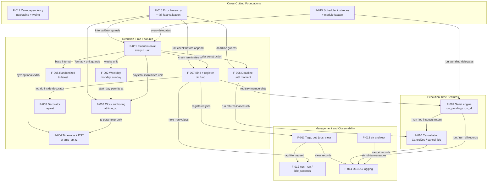
```mermaid
flowchart TD
    subgraph DefinitionTime["Definition-Time Features"]
        F001["F-001 Fluent interval<br/>every n .unit"]
        F002["F-002 Weekday<br/>monday..sunday"]
        F003["F-003 Clock anchoring<br/>at time_str"]
        F004["F-004 Timezone + DST<br/>at time_str, tz"]
        F005["F-005 Randomized<br/>to latest"]
        F006["F-006 Deadline<br/>until moment"]
        F007["F-007 Bind + register<br/>do func"]
        F008["F-008 Decorator<br/>repeat"]
    end
    subgraph ExecutionTime["Execution-Time Features"]
        F009["F-009 Serial engine<br/>run_pending / run_all"]
        F010["F-010 Cancellation<br/>CancelJob / cancel_job"]
    end
    subgraph Management["Management and Observability"]
        F011["F-011 Tags, get_jobs, clear"]
        F012["F-012 next_run / idle_seconds"]
        F013["F-013 str and repr"]
        F014["F-014 DEBUG logging"]
    end
    subgraph Foundations["Cross-Cutting Foundations"]
        F015["F-015 Scheduler instances<br/>+ module facade"]
        F016["F-016 Error hierarchy<br/>+ fail-fast validation"]
        F017["F-017 Zero-dependency<br/>packaging + typing"]
    end
    F001 -->|"weeks unit"| F002
    F001 -->|"days/hours/minutes unit"| F003
    F002 -->|"start_day permits at"| F003
    F003 -->|"tz parameter only"| F004
    F001 -->|"base interval"| F005
    F001 -->|"job under construction"| F006
    F001 -->|"chain terminates in"| F007
    F007 -->|"job.do inside decorator"| F008
    F007 -->|"registry membership"| F009
    F009 -->|"_run_job inspects return"| F010
    F006 -->|"run returns CancelJob"| F010
    F007 -->|"registered jobs"| F011
    F007 -->|"next_run values"| F012
    F011 -->|"tag filter reused"| F012
    F013 -->|"str job in messages"| F014
    F009 -->|"run / run_all records"| F014
    F010 -->|"cancel records"| F014
    F011 -->|"clear records"| F014
    F015 -->|"every delegates"| F001
    F015 -->|"run_pending delegates"| F009
    F016 -->|"IntervalError guards"| F001
    F016 -->|"format + unit guards"| F003
    F016 -->|"deadline guards"| F006
    F016 -->|"unit check before append"| F007
    F017 -->|"pytz optional extra"| F004
```

| Relationship | Evidence |
|---|---|
| F-001 → F-002, F-003, F-005, F-006, F-007 | All refinement methods are `Job` methods reached by chaining from the object `Scheduler.every()` returns (`schedule/__init__.py` 162–170) |
| F-002 → F-003 | `at()` accepts a weekday-qualified job because its unit guard also passes when `start_day` is set (493–496) |
| F-003 → F-004 | `tz` is a parameter of `Job.at()` alone (471, 498–508); `docs/timezones.rst` states timezones are only available in `.at` |
| F-006 → F-010 | `Job.run()` returns `CancelJob` on deadline expiry (686–698), which `Scheduler._run_job()` acts upon (172–175) |
| F-007 → F-009, F-011, F-012 | Registration appends to `scheduler.jobs` (663), the single list all three features read |
| F-011 → F-012 | `get_next_run()` calls `get_jobs(tag)` to apply the same tag filter (190) |
| F-013 → F-014 | Log messages embed `str(job)` / `%s` of the job (113–117, 157–160, 687–696) |
| F-015 → F-001, F-009 | Module functions are one-line delegations to `default_scheduler` (843–896) |
| F-016 → F-001, F-003, F-006, F-007 | Guards raise before mutation completes or before registry insertion (325–455, 493–557, 605–641, 657–663) |
| F-017 → F-004 | `pyproject.toml` declares `timezone = ["pytz"]`; the lazy import at line 499 is what preserves `dependencies = []` |

### 2.3.2 Job Lifecycle Process Flow

The following flow is the process every feature participates in; it is the reference flowchart for §2.2's acceptance criteria and complements the component diagram in §1.2.2.2.

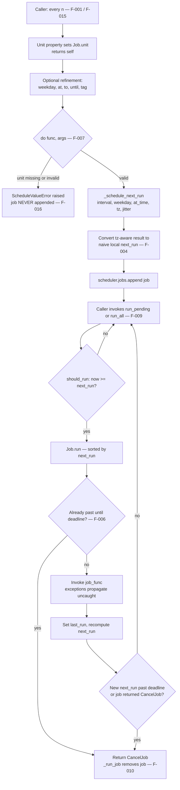
```mermaid
flowchart TD
    Start["Caller: every n — F-001 / F-015"] --> Unit["Unit property sets Job.unit<br/>returns self"]
    Unit --> Refine["Optional refinement:<br/>weekday, at, to, until, tag"]
    Refine --> DoCall{"do func, args — F-007"}
    DoCall -->|"unit missing or invalid"| Reject["ScheduleValueError raised<br/>job NEVER appended — F-016"]
    DoCall -->|"valid"| Compute["_schedule_next_run<br/>interval, weekday, at_time, tz, jitter"]
    Compute --> Naive["Convert tz-aware result to<br/>naive local next_run — F-004"]
    Naive --> Register["scheduler.jobs.append job"]
    Register --> Poll["Caller invokes run_pending or run_all — F-009"]
    Poll --> Due{"should_run: now >= next_run?"}
    Due -->|"no"| Poll
    Due -->|"yes"| RunJob["Job.run — sorted by next_run"]
    RunJob --> Deadline{"Already past until deadline? — F-006"}
    Deadline -->|"yes"| Unschedule["Return CancelJob<br/>_run_job removes job — F-010"]
    Deadline -->|"no"| Invoke["Invoke job_func<br/>exceptions propagate uncaught"]
    Invoke --> Restamp["Set last_run, recompute next_run"]
    Restamp --> PostCheck{"New next_run past deadline<br/>or job returned CancelJob?"}
    PostCheck -->|"yes"| Unschedule
    PostCheck -->|"no"| Poll
```

### 2.3.3 Integration Points

| Integration point | Mechanism and evidence |
|---|---|
| Host control loop | The caller invokes `run_pending()` on its own cadence; `docs/examples.rst` shows both the fixed `sleep(1)` loop and the `idle_seconds()`-driven loop |
| Job callable boundary | `do()` binds an arbitrary callable via `functools.partial` (655) and `run()` invokes it with no exception guard (691) — `docs/exception-handling.rst` makes wrapping the caller's responsibility |
| Threading and background execution | Not provided by the library; `docs/background-execution.rst` supplies a caller-implemented `threading.Thread` + `threading.Event` pattern and `docs/parallel-execution.rst` a `queue.Queue` worker pattern |
| Logging pipeline | The host attaches handlers to the `schedule` logger and sets its level (`docs/logging.rst`); the library only emits records |
| Timezone data | `pytz` is resolved at `at()` call time (499); absent, a `ModuleNotFoundError` surfaces, which `docs/faq.rst` resolves with `pip install pytz` |
| Multi-tenant scheduling | Independent `Scheduler()` instances, each polled separately (`docs/multiple-schedulers.rst`) |
| Type tooling | `schedule/py.typed` plus inline annotations make the public surface visible to consumer type checkers; `setup.cfg` and `tox.ini` enforce `mypy -p schedule` |
| Packaging toolchain | setuptools ≥ 61 backend (`pyproject.toml`); wheel build and twine upload procedure in `docs/development.rst`; sdist contents controlled by `MANIFEST.in` |

There are no HTTP, RPC, CLI, message-broker, database, or filesystem integration points: the runtime module imports only the eight standard-library modules listed at `schedule/__init__.py` 41–48.

### 2.3.4 Shared Components

| Shared component | Location | Features that depend on it |
|---|---|---|
| `Scheduler.jobs` list — the single in-memory registry | 86–87 | F-007 (append), F-009 (iterate), F-010 (remove), F-011 (filter/clear), F-012 (min), F-015 (`jobs` alias) |
| `Job._schedule_next_run()` — the one next-run calculator | 700–748 | F-001, F-002, F-003, F-004, F-005 (jitter draw), F-006 (post-run deadline check), F-007 (first computation) |
| `Job.__lt__` — ordering by `next_run` | 257–262 | F-009 (`sorted()` execution order), F-012 (`min()` selection) |
| `Job._correct_utc_offset()` — offset/DST normalization | 773–817 | F-004 directly; F-003 indirectly through `_move_to_at_time` (769) |
| `Job._is_overdue()` — deadline comparison | 819–820 | F-006 (both pre- and post-execution checks), F-010 (produces the cancellation signal) |
| `CancelJob` sentinel | 71–76 | F-010 (recognition), F-006 (deadline expiry), caller code (`docs/examples.rst`, `docs/exception-handling.rst`) |
| Exception hierarchy | 53–68 | F-001…F-007 raise from it; F-016 defines it |
| `logger` — the module-wide `schedule` logger | 50 | F-009, F-010, F-011, F-014 |
| `Job` field set assigned in `__init__` | 227–255 | Every feature reads or writes a subset; it is the complete data model |
| Private weekday helpers `_move_to_next_weekday`, `_weekday_index` | 916–945 | F-002 (both), F-016 (`ScheduleValueError` for unknown days) |

### 2.3.5 Common Services

The module provides four internal services rather than external ones; each is used by multiple features.

| Common service | Implementation | Consumers |
|---|---|---|
| Time source | `datetime.datetime.now()`, made zone-aware only when `at_time_zone` is set (717); `time.sleep` used solely for `run_all` spacing (120) | F-001, F-004, F-006, F-009, F-012 |
| Configuration validation | Interval, unit, format, timezone-type, range, and deadline guards raising the F-016 hierarchy | F-001, F-002, F-003, F-004, F-005, F-006, F-007 |
| Registry service | Append, copy, filter, slice-delete, and remove operations on `Scheduler.jobs` | F-007, F-009, F-010, F-011, F-012 |
| Diagnostics service | Lazy `%`-formatted DEBUG records on the `schedule` logger, rendering jobs through F-013 | F-009, F-010, F-011 |

Two services that a scheduler of this kind might be expected to share are demonstrably **absent**, and their absence is a documented design position rather than an omission: there is no persistence/serialization service (no file, database, or serialization call exists anywhere in the module) and no concurrency service (no threading, locking, queue, or async construct exists) — see `docs/index.rst` non-goals, `docs/parallel-execution.rst`, and `docs/background-execution.rst`.

## 2.4 Implementation Considerations

### 2.4.1 System-Wide Constraints Binding Every Feature

| Constraint | Statement and evidence |
|---|---|
| Naive-local datetime contract | `_schedule_next_run()` converts a timezone-aware result back to local time and strips `tzinfo`, with the inline comment stating the goal is API consistency with older versions (`schedule/__init__.py` 740–747). `docs/timezones.rst` publishes the same contract. Any feature that exposed aware datetimes would be a breaking change under the semantic-versioning policy declared in `docs/development.rst` |
| Zero required dependencies | `pyproject.toml` declares `dependencies = []`. New functionality may only use the standard library or a lazily imported optional extra — the pattern F-004 already follows at line 499 |
| Python 3.7 floor | `python_requires=">=3.7"` (`setup.py`) and `requires-python = ">= 3.7"` (`pyproject.toml`). Because the floor predates `zoneinfo` in the standard library, timezone support is built on `pytz`, and `Job.at()` accepts only `str` or `pytz.BaseTzInfo` (501–508) |
| Single-module architecture | The entire runtime is `schedule/__init__.py` (945 lines) plus the 0-byte `schedule/py.typed`. Every feature shares one namespace, one logger, and one import block, so cross-feature coupling must be managed by convention rather than module boundaries |
| Serial, caller-driven execution | `run_pending()` executes in-line on the calling thread (89–101). `docs/index.rst` states job duration is not accounted for, and `docs/parallel-execution.rst` records serial execution as a deliberate choice |
| Quality gates on every change | `tox.ini` runs `py.test … --cov schedule` and `mypy -p schedule` across twelve environments; `black --check .` (black pinned to `20.8b1`), `sphinx-build -W`, and `setup.py check --strict --metadata --restructuredtext` are separate gates, all wired into `.github/workflows/ci.yml` for pushes and pull requests against `master` |
| Test determinism | `test_schedule.py` fixes the process timezone to a POSIX Berlin rule and calls `time.tzset()` (lines 23–30) and substitutes a controlled `datetime` subclass through the `mock_datetime` context manager (line 39). Any new time-dependent feature must be testable within that harness |
| Release ritual | `docs/development.rst` requires updating `HISTORY.rst` and `AUTHORS.rst`, bumping the version in **both** `setup.py` and `docs/conf.py`, tagging `X.Y.Z`, then building a wheel and uploading to TestPyPI followed by PyPI |

### 2.4.2 Per-Feature Technical Constraints

| Feature | Technical constraints |
|---|---|
| F-001 | Unit strings must remain valid `datetime.timedelta` keyword arguments (line 729), which fixes the vocabulary at seconds/minutes/hours/days/weeks; unit accessors are properties, so they cannot take arguments |
| F-002 | Weekday scheduling is valid only for a weekly interval (`IntervalError` in all seven accessors, 380–455) and requires `unit == "weeks"` at scheduling time (721–724); day names are a fixed lowercase tuple (931–945) |
| F-003 | Three anchored regexes fix the accepted formats per unit (513, 518, 524); the daily pattern permits an hour of 20–29, so the explicit 0–23 bound at 544–549 is load-bearing and must be retained |
| F-004 | Timezone support exists only in `at()`; `pytz` must stay a lazy in-method import; `zoneinfo` objects are rejected by the type check; DST-gap resolution is explicitly a best effort ("schedule the job 1 offset later", 811–816) |
| F-005 | The jitter draw happens inside `_schedule_next_run()`, so the interval changes on every reschedule and cannot be predicted from configuration; range validation is deferred to scheduling time (709–711) |
| F-006 | Deadlines are naive local datetimes and are therefore not timezone-corrected; five `strptime` formats are attempted in order (616–622); time-only strings are detected by the absence of `-` (626–631) |
| F-007 | `do()` is the only registration path and must remain the last statement after validation (657–663); `functools.partial` retains strong references to the callable and its arguments for the job's lifetime |
| F-008 | The decorator must return the undecorated function (911); it cannot be applied to non-static class methods (`docs/examples.rst`) |
| F-009 | Resolution is bounded by the caller's polling frequency; missed occurrences are never replayed (docstring 93–97); `run_all` sleeps synchronously between jobs (120) |
| F-010 | The sentinel must be recognized both as a class and as an instance (174); `cancel_job` must never raise for an unscheduled job (156–160) |
| F-011 | Tags must be hashable (466–467); `clear()` mutates the list in place so the module-level `jobs` alias keeps pointing at the same object (145, 148) |
| F-012 | Both accessors must return `None` rather than raise when the registry is empty or the tag matches nothing (188–192, 204–205) |
| F-013 | Both methods must tolerate a `job_func` of `None` and callables without `__name__` (265–268, 290–300) |
| F-014 | Level is fixed at DEBUG and the library must not configure handlers or levels; messages must use lazy `%` formatting |
| F-015 | The eight shortcuts must stay one-line delegations so instance and module behavior cannot diverge (843–896); `jobs` is a live reference, and line 840 carries an inline `todo` questioning that choice |
| F-016 | The hierarchy `ScheduleError` → `ScheduleValueError` → `IntervalError` must be preserved so existing `except` clauses keep working; validation must precede registry mutation |
| F-017 | No required runtime dependency may be added; `py.typed` must remain in `package_data`; the suite must pass with **and** without `pytz`; annotations must satisfy `mypy -p schedule` on every supported interpreter |

### 2.4.3 Performance and Scalability Considerations

No performance target, SLA, or benchmark is published anywhere in this repository; the characteristics below are read from the algorithms themselves. The observable reference point is the full suite of 81 test methods completing in 0.12 s on Python 3.12.

| Feature | Performance characteristic | Scalability consideration |
|---|---|---|
| F-001 | O(1) `timedelta` arithmetic; the catch-up loop at 733–734 iterates once per elapsed period | A job left unpolled for a very long time costs one loop iteration per missed period on its next reschedule |
| F-002 | One `weekday()` comparison plus one `timedelta` addition | Constant regardless of job count |
| F-003 | One regex match at configuration time; one `replace()` per reschedule | Constant per job |
| F-004 | Up to two `normalize()` calls and two `utcoffset()` comparisons per reschedule (773–817) | The most expensive scheduling path; `pytz` zone objects are shared per job, and no zone database is loaded unless a timezone is requested |
| F-005 | One `random.randint` per reschedule | Jitter spreads load across processes running identical schedules |
| F-006 | Up to five `strptime` attempts at configuration; two comparisons per run | Expired jobs are removed automatically, so the registry does not grow unboundedly |
| F-007 | One `partial` construction plus one list append | Registration is O(1); memory grows linearly with job count because arguments are retained |
| F-008 | Executes once at definition time | No runtime cost |
| F-009 | Linear scan of the registry for `should_run`, then a sort of the due subset (99–101); `run_all` blocks for `delay_seconds` × job count | Throughput is bounded by the aggregate duration of jobs on the single calling thread; long jobs delay every other job, which is why `docs/index.rst` directs long work off the scheduler thread and `docs/parallel-execution.rst` supplies thread and queue patterns |
| F-010 | `list.remove` is linear in registry size | Self-cancelling jobs keep the registry small |
| F-011 | Tagging O(1) per tag; `get_jobs`/`clear` linear in registry size | Tag filtering is a scan, not an index — cost grows with job count |
| F-012 | One `min()` scan plus one subtraction | Called once per loop iteration in the `idle_seconds()` pattern, so cost is linear in job count per iteration |
| F-013 | String formatting only | Invoked per DEBUG record; negligible unless DEBUG logging is enabled |
| F-014 | Lazy formatting means no cost when no handler accepts DEBUG | Log volume scales with executions per unit time |
| F-015 | One extra function call per delegation | Multiple schedulers partition state but add no parallelism — each must be polled separately (`docs/multiple-schedulers.rst`) |
| F-016 | O(1) guards | Validation cost is paid once per configuration call, never per run |
| F-017 | Import cost limited to eight standard-library modules | A zero-dependency install keeps container images and audit surface minimal; twelve tox environments keep the matrix cost linear in supported versions |

### 2.4.4 Security Implications

The module contains no authentication, authorization, cryptography, network, subprocess, filesystem, deserialization, or dynamic-evaluation code (imports at `schedule/__init__.py` 41–48). The implications below are therefore about the trust boundaries the library creates for its host, not about protecting the library itself.

| Feature | Security implication |
|---|---|
| F-007 / F-009 | The caller-supplied callable is the trust boundary: it executes synchronously with the full privileges of the host process, and its exceptions are not caught (line 691), so an uncaught failure aborts the remaining due jobs for that call — `docs/exception-handling.rst` makes defensive wrapping the caller's responsibility |
| F-013 / F-014 | DEBUG records embed the job's rendered arguments via `str(job)`; enabling DEBUG on the `schedule` logger can therefore surface argument values, so secrets should not be bound as job arguments in such deployments |
| F-004 / F-017 | `pytz` is the only third-party runtime package and is optional and lazily imported, which keeps the default supply-chain surface at zero; timezone correctness depends on the installed `pytz` release |
| F-005 | `random` is used solely for load jitter and provides no unpredictability guarantee suitable for security purposes |
| F-015 | `default_scheduler` is process-global mutable state; unrelated components in the same process share one registry, and `schedule.jobs` exposes the live list rather than a copy (line 840) |
| F-011 / F-012 | `get_jobs()` returns a copy of the registry list, but the `Job` objects inside it are the live objects — callers can mutate scheduled jobs directly |
| F-006 / F-010 | Cancellation is cooperative and in-process only; there is no privileged or remote control path to stop a running job |
| F-003 / F-016 | All user-supplied configuration strings are validated against anchored regexes or a fixed `strptime` allow-list before use, and error messages echo only the offending configuration value |

### 2.4.5 Maintenance Requirements

| Feature | Maintenance obligation | Verification gate |
|---|---|---|
| F-001 | Keep unit vocabulary aligned with `timedelta` keywords and singular/plural error text actionable | `test_time_units`, `test_singular_time_units_match_plural_units` |
| F-002 | Keep the seven accessors, their `IntervalError` text, and the weekday tuple in sync | `test_time_units` regex assertion, `test_move_to_next_weekday_*` |
| F-003 | Any format change must update all three regexes, the docstring at 475–486, and `docs/examples.rst` | `test_at_time`, `test_at_time_hour`, `test_at_time_minute` |
| F-004 | Highest-maintenance area of the codebase: 30 timezone-named tests plus 7 `_correct_utc_offset` unit tests, including regressions for issues #592, #605 and #608; `HISTORY.rst` shows 1.2.1 and 1.2.2 were dominated by fixes here (#583, #601, #602, #604, #623) | Full `test_tz_*` and `test_align_utc_offset_*` families, run in both `pytz` and non-`pytz` environments |
| F-005 | Preserve inclusive-range semantics and the deferred range check | `test_time_range`, `test_time_range_repr`, `test_time_units` |
| F-006 | Any new accepted format must be added to the `_decode_datetimestr` list, the docstring at 592–600, and `docs/examples.rst` | `test_until_time` (parsing, rejection, and both expiry paths) |
| F-007 | Preserve the validate-then-register order and argument-forwarding semantics | `test_job_func_args_are_passed_on`, `test_misconfigured_job_wont_break_scheduler` |
| F-008 | Keep the decorator a thin adapter returning the original function; keep the non-static-method limitation documented | `test_run_all_with_decorator`, `_args`, `_defaultargs` |
| F-009 | Preserve the no-missed-run contract and ordering; keep the `run_pending` docstring authoritative | `test_run_pending`, `test_run_all` |
| F-010 | Keep dual sentinel recognition and no-op cancellation | `test_cancel_job`, `test_cancel_jobs` |
| F-011 | Keep hashability enforcement and in-place clearing semantics | `test_tag_type_enforcement`, `test_get_by_tag`, `test_clear_by_tag` |
| F-012 | Keep `None` returns for empty/unmatched cases — regressions were fixed in 0.1.11 and 1.0.0 (#401) | `test_next_run_property`, `test_next_run_with_tag`, `test_idle_seconds` |
| F-013 | Keep every optional field's rendering fallback — the 1.2.0 fix for issue #569 exists precisely because of a crash here | `test_to_string*`, `test_to_repr`, `test_repr_functools_partial_job_func` |
| F-014 | Keep messages at DEBUG with lazy formatting and keep `docs/logging.rst` samples current | No automated assertion; documentation review only |
| F-015 | Add any new `Scheduler` method to the module facade to prevent surface drift | Suite drives the module API in 114 places; `docs/reference.rst` autodoc lists the facade |
| F-016 | Preserve the hierarchy and message quality; new validation must raise before registration | Exception assertions distributed across `test_time_units`, `test_at_time`, `test_until_time` |
| F-017 | Add no required dependency; keep `py.typed` packaged; extend the CI matrix when adopting or dropping interpreters, as `HISTORY.rst` shows for 1.0.0, 1.2.0 and 1.2.2 | `tox.ini` twelve environments, `mypy -p schedule`, `black --check .`, `sphinx-build -W`, `setup.py check --strict`, Coveralls upload |

## 2.5 Requirements Traceability Matrix

### 2.5.1 Requirement to Implementation and Verification Matrix

Line numbers in the second column refer to `schedule/__init__.py`; those in the third column refer to `test_schedule.py`.

| Requirement ID | Implementation anchor | Verifying test method(s) | Documentation |
|---|---|---|---|
| F-001-RQ-001 | `Scheduler.every` 162–170; append at 663 | `test_misconfigured_job_wont_break_scheduler` 1591 | `docs/examples.rst` |
| F-001-RQ-002 | Unit properties 325–378 | `test_time_units` 108 | `docs/index.rst` |
| F-001-RQ-003 | Singular guards 326–328, 337–339, 348–350, 359–361, 370–372 | `test_time_units` 108; `test_at_time` 268; `test_singular_time_units_match_plural_units` 236 | `docs/reference.rst` |
| F-001-RQ-004 | `_schedule_next_run` 700–748 (period math 729–734) | `test_next_run_time` 463; `test_next_run_time_day_end` 486; `test_next_run_time_hour_end` 510; `test_next_run_time_minute_end` 557 | `docs/examples.rst` |
| F-002-RQ-001 | Weekday properties 380–455 | `test_run_pending` 1387; `test_run_every_weekday_at_specific_time_today` 1427 | `docs/examples.rst` |
| F-002-RQ-002 | `IntervalError` in all seven accessors 380–455 | `test_time_units` 108 (regex match); `test_at_time` 268 (all seven) | `docs/index.rst` |
| F-002-RQ-003 | `_move_to_next_weekday` 916–928 | `test_move_to_next_weekday_today` 1252; `_tommorrow` 1259; `_nextweek` 1266; `test_weekday_at_todady` 390; `test_run_every_weekday_at_specific_time_past_today` 1438 | — |
| F-002-RQ-004 | Unit check 721–724; `_weekday_index` 931–945 | `test_time_units` 108 (assertions at 195–203) | — |
| F-003-RQ-001 | Unit guard 493–496 | **None — verified by inspection** | `docs/examples.rst` |
| F-003-RQ-002 | Regexes 512–527 | `test_at_time` 268; `test_at_time_hour` 411; `test_at_time_minute` 445 | `docs/examples.rst` |
| F-003-RQ-003 | Type check 510–511 | `test_at_time` 268; `test_at_time_hour` 411; `test_at_time_minute` 445 | — |
| F-003-RQ-004 | Token parsing 528–558; `_move_to_at_time` 750–771 | `test_at_time` 268; `test_at_time_hour` 411; `test_at_time_minute` 445; `test_time_units` 108 (hour bound, line 207) | `docs/examples.rst` |
| F-004-RQ-001 | Timezone resolution 498–508 | `test_tz_invalid_timezone_exceptions` 1146 | `docs/timezones.rst` |
| F-004-RQ-002 | Lazy `import pytz` 499; `tox.ini` conditional dep | `make_tz_mock_job` 100–106 and `setup_utc_offset_test` 1163–1174 skip guards | `docs/installation.rst`, `docs/faq.rst` |
| F-004-RQ-003 | Zone-aware `now` 717; naive conversion 736–748 | `test_tz` 598; `test_tz_daily_midnight` 610; `_half_hour_offset` 622; `_utc` 700; `_exact_seconds_precision` 734; `test_tz_weekly_sunday_conversion` 749; `test_tz_minutes_year_round` 936; `test_tz_hourly_intermediate_conversion` 917 | `docs/timezones.rst` |
| F-004-RQ-004 | `_correct_utc_offset` 773–817 | `test_align_utc_offset_no_timezone` 1156; `_no_change` 1175; `_with_dst_gap` 1181; `_with_dst_fold` 1192; `_fold_fixate_1` 1201; `_fixate_2` 1216; `_after_fold_fixate` 1229; `test_tz_daily_dst` 633; `_dst_skip_hour` 647; `_dst_overlap_hour` 666; `_issue_592` 721; `_issue_605` 814; `_dst_starting_point` 830; `_dst_ending_point` 845; `_issue_608_pre/post/mid_dst` 857/871/885; `_before_dst_end` 901; `_skip_dst_change` 1083; `_different_simultaneous_dst_change` 1103; `_opposite_dst_change` 1125; `test_daylight_saving_time` 1242 | `docs/timezones.rst` |
| F-005-RQ-001 | `to` 561–574; `randint` 712 | `test_time_range` 243 | `docs/examples.rst` |
| F-005-RQ-002 | Range check 709–711 | `test_time_units` 108 (assertions at 216–221) | — |
| F-005-RQ-003 | Repr `to` clause 311–315 | `test_time_range_repr` 260 | — |
| F-006-RQ-001 | `until` 576–632; `_decode_datetimestr` 822–830 | `test_until_time` 312 | `docs/examples.rst` |
| F-006-RQ-002 | Rejections 624–641 | `test_until_time` 312 | `docs/examples.rst` |
| F-006-RQ-003 | `run` 686–698; `_is_overdue` 819–820 | `test_until_time` 312 (both expiry paths) | `docs/examples.rst` |
| F-007-RQ-001 | `partial` binding 655 | `test_job_func_args_are_passed_on` 1319; `test_run_all` 1273 | `docs/examples.rst` |
| F-007-RQ-002 | `update_wrapper` 656 | `test_to_string` 1325 | — |
| F-007-RQ-003 | Validate-then-register 657–663 | `test_at_time` 268 (unit check); `test_misconfigured_job_wont_break_scheduler` 1591. **No-scheduler branch: verified by inspection** | — |
| F-007-RQ-004 | `do` 644–664 | `test_to_string_lambda_job_func` 1363; `test_repr_functools_partial_job_func` 1367; `test_to_string_functools_partial_job_func` 1377 | `docs/examples.rst` |
| F-008-RQ-001 | `repeat` 899–913 | `test_run_all_with_decorator` 1281 | `docs/examples.rst` |
| F-008-RQ-002 | Argument pass-through 910 | `test_run_all_with_decorator_args` 1299; `_defaultargs` 1309 | `docs/examples.rst` |
| F-009-RQ-001 | `run_pending` 89–101; `__lt__` 257–262; `should_run` 666–672 | `test_run_pending` 1387 | `docs/examples.rst` |
| F-009-RQ-002 | Docstring contract 93–97 | `test_run_pending` 1387 (count progression) | `docs/background-execution.rst` |
| F-009-RQ-003 | `run_all` 103–120 | `test_run_all` 1273; `test_cancel_jobs` 1525 | `docs/examples.rst` |
| F-009-RQ-004 | Unguarded invocation 691 | **None — verified by inspection** | `docs/exception-handling.rst` |
| F-010-RQ-001 | `CancelJob` 71–76; `_run_job` 172–175 | `test_cancel_job` 1503; `test_cancel_jobs` 1525 | `docs/examples.rst` |
| F-010-RQ-002 | `cancel_job` 150–160 | `test_cancel_job` 1503 (`"Not a job"` no-op) | `docs/examples.rst` |
| F-011-RQ-001 | `tag` 457–469 | `test_tag_type_enforcement` 1537 | `docs/examples.rst` |
| F-011-RQ-002 | `get_jobs` 122–133 | `test_get_by_tag` 1544 | `docs/examples.rst` |
| F-011-RQ-003 | `clear` 135–148 | `test_clear_by_tag` 1572 | `docs/examples.rst`, `docs/logging.rst` |
| F-012-RQ-001 | `get_next_run` 177–193; property 195 | `test_next_run_property` 1480; `test_next_run_with_tag` 222 | `docs/reference.rst` |
| F-012-RQ-002 | `idle_seconds` 197–206 | `test_idle_seconds` 1491; `test_tz_daily_exact_future_scheduling` 685 (assertion at 698); `test_tz_daily_issue_605` 814 (assertion at 825) | `docs/examples.rst` |
| F-013-RQ-001 | `__str__` 264–276 | `test_to_string` 1325; `test_to_string_lambda_job_func` 1363; `test_to_string_functools_partial_job_func` 1377 | — |
| F-013-RQ-002 | `__repr__` 278–323 | `test_to_repr` 1338; `test_time_range_repr` 260; `test_repr_functools_partial_job_func` 1367 | `docs/timezones.rst` |
| F-014-RQ-001 | `logger` 50; emissions 113–117, 144–147, 157–160, 687–696 | **None — verified by inspection** | `docs/logging.rst` |
| F-015-RQ-001 | Facade 833–896 | `test_next_run_with_tag` 222 (module and instance forms agree); suite-wide module API usage | `docs/reference.rst` |
| F-015-RQ-002 | Per-instance registry 86–87; `run_pending` 89–101 | `test_misconfigured_job_wont_break_scheduler` 1591 | `docs/multiple-schedulers.rst` |
| F-016-RQ-001 | Hierarchy 53–68 | `test_time_units` 108; `test_at_time` 268; `test_until_time` 312 | `docs/reference.rst` |
| F-016-RQ-002 | Unit whitelist 704–708 | `test_at_time` 268 (`every().do(lambda: 0)`) | — |
| F-016-RQ-003 | Registration last 657–663 | `test_misconfigured_job_wont_break_scheduler` 1591 | — |
| F-017-RQ-001 | `pyproject.toml` `dependencies = []`; imports 41–48 | Six non-`pytz` tox environments run the full suite | `README.rst`, `docs/installation.rst` |
| F-017-RQ-002 | `pyproject.toml` `timezone` extra; `tox.ini` `envlist`/`pytz: pytz` | `skipTest("pytz unavailable")` guards at 100–106 and 1163–1174 | `docs/installation.rst`, `docs/faq.rst` |
| F-017-RQ-003 | `schedule/py.typed`; `setup.py` `package_data`; `setup.cfg` `[mypy]` | `tox.ini` `python -m mypy -p schedule` in every environment | — |
| F-017-RQ-004 | `setup.py` `python_requires`; `pyproject.toml` `requires-python` | `.github/workflows/ci.yml` matrix 3.7–3.12 | `docs/installation.rst` |

### 2.5.2 Verification Coverage Summary

| Coverage dimension | Value |
|---|---|
| Features catalogued | 17 (F-001 … F-017) |
| Requirements catalogued | 50 |
| Requirements with at least one automated test | 46 |
| Requirements verified by inspection and documentation only | 4 — F-003-RQ-001 (`at()` unit guard), F-007-RQ-003 (no-scheduler branch), F-009-RQ-004 (exception propagation), F-014-RQ-001 (log emission) |
| Test methods available as verification assets | 81, all passing (`81 passed` on Python 3.12.3) |
| Test methods dedicated to F-004 | 30 `test_tz_*` plus 7 `test_align_utc_offset_*` plus `test_daylight_saving_time` |
| Issue-numbered regression tests | 6 (`_issue_592`, `_issue_605`, `_issue_608_pre_dst`, `_post_dst`, `_mid_dst`, `_before_dst_end`) |
| Distinct IANA timezones exercised | 15 |
| Environments enforcing the matrix | 12 tox environments (Python 3.7–3.12 × with/without `pytz`) driven by 5 CI jobs (`test`, `coveralls`, `docs`, `formatting`, `setuppy`) |

### 2.5.3 Requirement Version Tracking

Version history is taken from `HISTORY.rst`, which `docs/changelog.rst` includes verbatim as the single changelog source. The project declares semantic versioning in `docs/development.rst`.

| Feature | Introduced | Subsequent requirement-affecting changes |
|---|---|---|
| F-001 | 0.1.x foundation | 0.3.2 fixed initial execution for intervals ≥ 2 days |
| F-002 | 0.3.0 (2014-06-14) | 1.0.0 fixed long-running jobs skipping a day (#404) |
| F-003 | 0.2.0 added hourly `at(':MM')` | 0.6.0 second precision (#267); 1.0.0 fixed `day.at('HH:MM:SS')` same-day start (#331) and hourly seconds reset (#290); 1.2.0 fixed the `days` pattern (#506) |
| F-004 | 1.2.0 (#517) | 1.2.1 offset bug (#583); 1.2.2 cross-timezone fixes (#601, #602, #604, #623) |
| F-005 | 0.5.0 (2017-11-16) | — |
| F-006 | 1.1.0 (#195) | 1.2.0 fixed `test_until_time` early-run flakiness (#563) |
| F-007 | 0.1.9 argument forwarding | 0.3.2 `functools.partial` job functions; 1.0.0 fixed `RecursionError` when a job is passed as an arg (#190) |
| F-008 | 1.1.0 (#148) | — |
| F-009 | 0.1.7 renamed to `run_pending`/`run_all` | 0.1.8 `delay_seconds` default 0; 0.4.0 fixed `run_all()` with multiple self-deleting jobs |
| F-010 | 0.2.0 (2013-11-09) | 0.4.0 self-deleting-job fix in `run_all()` |
| F-011 | 0.4.0 tagging and cancel-by-tag | 1.1.0 tag-filtered `get_jobs` (#419) |
| F-012 | 0.1.9 `next_run` and `idle_seconds` | 0.1.11 empty-queue `ValueError` fix; 1.0.0 `idle_seconds` no-jobs crash (#401); 1.2.0 next run by tag (#463) |
| F-013 | 0.1.x | 1.1.0 `str()` without `__name__` (#430); 1.2.0 repr crash on partially constructed job (#569) |
| F-014 | 0.1.x | 1.0.0 messages moved to DEBUG; 1.1.0 improved logging (#193) |
| F-015 | 0.1.7 `schedule.jobs` | Open question recorded inline at `schedule/__init__.py` 840 |
| F-016 | 0.6.0 hierarchy (#271) | 0.5.0 partial-chain robustness (#125); 1.1.0 improved error messages (#280, #439) |
| F-017 | 1.1.0 type annotations (#427) | 1.2.0 `py.typed` (#521), dropped 3.6, added 3.10/3.11; 1.2.2 added 3.12 (#606), removed the old `mock` dependency (#622) |

### 2.5.4 Assumptions and Constraints

**Assumptions made in producing this section.**

| Assumption | Basis |
|---|---|
| Implemented behavior is the requirement | No requirements document, backlog, or acceptance-test specification exists in the repository, so §2.1 and §2.2 are reverse-derived from code, tests, and `docs/` |
| Every catalogued feature is complete | All 17 are present in release 1.2.2, carry passing tests, and the package is classified `Development Status :: 5 - Production/Stable` in `setup.py` |
| Priorities reflect internal emphasis, not external mandate | Derived from call-graph centrality, share of the 81-method suite, and prominence in `README.rst` / `docs/index.rst`; no business priority statement exists in the tree |
| Documentation statements are authoritative contracts | `docs/` is built with `sphinx-build -W` in CI, so its published behavior claims are maintained deliberately |
| The test suite is the acceptance criteria of record | `test_schedule.py` runs in all 12 tox environments on every push and pull request against `master` |

**Constraints recorded from the repository.**

| Constraint | Source |
|---|---|
| Public datetimes are naive local values | `schedule/__init__.py` 740–747; `docs/timezones.rst` |
| Zero required runtime dependencies; `pytz` optional and lazily imported | `pyproject.toml`; `schedule/__init__.py` 499 |
| Python 3.7 minimum, 3.7–3.12 verified | `setup.py`, `pyproject.toml`, `.github/workflows/ci.yml` |
| Serial, in-line execution driven by the caller; no background thread | `schedule/__init__.py` 89–120; `docs/background-execution.rst`, `docs/parallel-execution.rst` |
| No persistence — schedule state is lost at process exit | Absence of any I/O in the module; `docs/index.rst` non-goals |
| Sub-second precision, concurrency, and workday/holiday calendars are out of scope | `docs/index.rst` non-goals |
| Job duration is not accounted for, and missed runs are never replayed | `docs/index.rst`; `run_pending` docstring 93–97 |
| Job exceptions are not caught by the library | `schedule/__init__.py` 691; `docs/exception-handling.rst` |
| Timezones are configurable only through `at()` | `schedule/__init__.py` 471–508; `docs/timezones.rst` |
| `@repeat` does not work on non-static class methods | `docs/examples.rst` |
| Formatting fixed to `black==20.8b1`; docs must build warning-free | `requirements-dev.txt`, `tox.ini`, `docs/development.rst` |
| Semantic versioning with a version string in both `setup.py` and `docs/conf.py` | `docs/development.rst` |

## 2.6 References

### 2.6.1 Repository Files Examined

**Implementation and tests**

- `schedule/__init__.py` — the complete runtime implementation (945 lines); established every feature's behavior, validation rules, error types and messages, execution semantics, timezone/DST correction, module facade, and private helpers. Specific anchors cited throughout §2.1–§2.5: imports 41–48, logger 50, exception hierarchy 53–68, `CancelJob` 71–76, `Scheduler` 79–206, `Job.__init__` 227–255, `__lt__` 257–262, `__str__`/`__repr__` 264–323, unit properties 325–378, weekday properties 380–455, `tag` 457–469, `at` 471–559, `to` 561–574, `until` 576–642, `do` 644–664, `should_run` 666–672, `run` 674–698, `_schedule_next_run` 700–748, `_move_to_at_time` 750–771, `_correct_utc_offset` 773–817, `_is_overdue` 819–820, `_decode_datetimestr` 822–830, module facade 833–913, weekday helpers 916–945
- `schedule/py.typed` — 0-byte PEP 561 marker; established the type-distribution requirement (F-017-RQ-003)
- `schedule/` — confirmed the package contains only the implementation module and the typing marker
- `test_schedule.py` — 81 test methods providing the acceptance criteria and traceability targets for §2.2 and §2.5; also established the determinism harness (POSIX `TZ` constants 23–26, `tzset()` 29–30, `mock_datetime` 39) and the `pytz` skip guards (100–106, 1163–1174)

**Packaging, configuration, and CI**

- `pyproject.toml` — `dependencies = []`, the `timezone = ["pytz"]` extra, `requires-python = ">= 3.7"`, setuptools ≥ 61 backend, project URLs; grounded F-017 and the zero-dependency constraint
- `setup.py` — `SCHEDULE_VERSION = "1.2.2"`, `package_data={"schedule": ["py.typed"]}`, `python_requires=">=3.7"`, and the `Development Status :: 5 - Production/Stable` classifier used to justify the Completed status convention
- `setup.cfg` — `[mypy] files=schedule`; the static-typing gate
- `tox.ini` — `envlist = py3{7,8,9,10,11,12}{,-pytz}` (12 environments), pytest + coverage + `mypy -p schedule` commands, and the `docs`, `format`, and `setuppy` gate definitions
- `.github/workflows/ci.yml` — the five CI jobs and the Python 3.7–3.12 matrix that enforce the requirements
- `requirements-dev.txt` — pinned tooling, notably `black==20.8b1`
- `MANIFEST.in` — sdist contents referenced in F-017's technical specification
- `.github/` — confirmed the repository contains no issue templates or contributor policy files, only the CI workflow

**Documentation and project metadata**

- `docs/index.rst` — the feature claims and the authoritative "When **not** to use Schedule" non-goals (persistence, sub-second precision, concurrency, localization) plus the statement that job duration is not accounted for
- `docs/examples.rst` — the workflow catalogue used as documented contracts: `@repeat` non-static-method limitation, `CancelJob` run-once pattern, tag filtering and clearing, the five `until()` forms and the deadline contract, `idle_seconds()` negative/`None` semantics, and `run_all(delay_seconds=…)`
- `docs/timezones.rst` — timezone scope limited to `at()`, the `pytz` requirement, the naive-datetime contract, DST gap/fold outcomes, and the published Berlin→New York example used in F-004 and F-013
- `docs/exception-handling.rst` — that job exceptions are not caught and bubble up (F-009-RQ-004)
- `docs/logging.rst` — logger name `schedule` and DEBUG level with sample output (F-014)
- `docs/background-execution.rst` — no built-in background mode; caller-implemented thread pattern
- `docs/parallel-execution.rst` — serial-by-default rationale and caller-implemented thread/queue patterns
- `docs/multiple-schedulers.rst` — multiple `Scheduler()` instances are supported and each must be polled (F-015-RQ-002)
- `docs/faq.rst` — the `ModuleNotFoundError: No module named 'pytz'` resolution referenced by F-004-RQ-002
- `docs/installation.rst` — Python version support, the single optional dependency, and the single-source-file/vendoring note used in F-017
- `docs/reference.rst` — the autodoc-published public surface used to confirm the facade inventory
- `docs/development.rst` — semantic versioning declaration, the release ritual, `black` version requirement, and the documentation build procedure
- `docs/changelog.rst` — confirmed `HISTORY.rst` is the single changelog source
- `docs/` — enumerated to establish the complete documented-contract set
- `HISTORY.rst` — release-by-release feature introduction and fix history with upstream issue numbers; the sole basis for §2.5.3 requirement version tracking
- `README.rst` — the product claims quoted as business value: human-oriented API, in-process scheduling with no extra processes, and no external dependencies
- `LICENSE.txt` — MIT license, the only compliance artifact in the repository
- `AUTHORS.rst` — contributor attribution referenced in the maintenance context
- `.gitignore` — confirmed no generated or vendored artifacts are tracked

### 2.6.2 Technical Specification Sections Referenced

- **1.1 Executive Summary** — package identity, version 1.2.2, and value proposition, aligned with the feature-catalog framing
- **1.2 System Overview** — capability inventory, component decomposition, and the component diagram cross-referenced from §2.3.2
- **1.3 Scope** — in-scope capability list, implementation boundaries, and the out-of-scope catalogue that keeps non-goals out of §2.1

### 2.6.3 Verification Performed in This Environment

- Executed `python3 -m pytest test_schedule.py -q` on Python 3.12.3 with `pytz` installed: **81 passed in 0.12 s** — the basis for the "all features test-verified" and performance reference-point statements
- Counted test methods with `grep -c '^    def test' test_schedule.py` = **81**
- Confirmed no `.blitzyignore` file exists anywhere in the repository or on the filesystem, so no paths were excluded from analysis

No external or web sources were used for this section; every claim is grounded in the repository artifacts listed above.

# 3. Technology Stack

## 3.1 Programming Languages

This repository is a **single-language runtime with a multi-language supporting cast**. Every line of executable product code is Python; the remaining languages present are declarative or markup formats that configure packaging, quality gates, continuous integration, and the documentation build. There is no compiled extension module, no second runtime, and no front-end application: `setup.py` declares no `ext_modules`, and a scan of all 32 tracked files found no JavaScript build tooling, `package.json`, or `node_modules`.

### 3.1.1 Language Inventory by Component

| Component | Language | Representative artifacts |
|---|---|---|
| Scheduler runtime (the shipped product) | Python | `schedule/__init__.py` (945 lines) |
| Type-information marker | PEP 561 marker file (0 bytes, no language) | `schedule/py.typed` |
| Test suite | Python (`unittest` + `unittest.mock`) | `test_schedule.py` (1,599 lines) |
| Distribution metadata (legacy path) | Python | `setup.py` (55 lines) |
| Distribution metadata (PEP 621 path) | TOML | `pyproject.toml` (26 lines) |
| Tool configuration | INI / CFG | `tox.ini` (38 lines), `setup.cfg` (2 lines) |
| Source-distribution rules | setuptools MANIFEST template | `MANIFEST.in` (8 lines) |
| Development dependency list | pip requirements format | `requirements-dev.txt` (11 entries) |
| Continuous integration | YAML (GitHub Actions schema) | `.github/workflows/ci.yml` (91 lines) |
| Documentation content | reStructuredText | 13 pages under `docs/`, plus `README.rst`, `HISTORY.rst`, `AUTHORS.rst` |
| Documentation build configuration | Python | `docs/conf.py` (373 lines) |
| Documentation build driver | GNU Make | `docs/Makefile` (225 lines) |
| Documentation theme overrides | HTML (Jinja2 template) and CSS | `docs/_templates/sidebarintro.html`, `docs/_static/custom.css` |

### 3.1.2 Python: Version Range and Dialect Constraints

The supported interpreter range is declared in two places and enforced in a third, and all three agree:

| Declaration | Value | Location |
|---|---|---|
| PEP 621 requirement | `requires-python = ">= 3.7"` | `pyproject.toml` line 12 |
| setuptools requirement | `python_requires=">=3.7"` | `setup.py` line 54 |
| Trove classifiers | `Programming Language :: Python :: 3.7` through `3.12` | `setup.py` lines 46–51 |
| Verified matrix | `['3.7','3.8','3.9','3.10','3.11','3.12']` | `.github/workflows/ci.yml` line 17 |
| Tox environments | `py3{7,8,9,10,11,12}{,-pytz}` — 12 environments | `tox.ini` line 2 |
| Published support statement | "Schedule is tested on Python 3.7, 3.8, 3.9, 3.10, 3.11 and 3.12" | `docs/installation.rst` lines 8–9 |

The 3.7 floor is not merely declared — the source code is written in a dialect that honours it. Static inspection of `schedule/__init__.py` confirms every one of the following:

| Dialect property | Observation | Why it matters at the 3.7 floor |
|---|---|---|
| Typing style | `from typing import Set, List, Optional, Callable, Union` (line 48); annotations such as `List["Job"]` (line 122) and `Set[Hashable]` (line 254) | Builtin generics (`list[int]`) require 3.9; the pre-PEP-585 `typing` forms keep 3.7/3.8 valid |
| Union syntax | Zero occurrences of PEP 604 `X \| Y` in annotations; `Union[str, int]` used instead (lines 529–530) | `X \| Y` annotations require 3.10 |
| Deferred annotations | No `from __future__ import annotations` anywhere | The module does not depend on postponed evaluation |
| Assignment expressions | Zero occurrences of `:=` | The walrus operator requires 3.8 |
| f-strings | None in the runtime module; formatting uses `.format()` twice and lazy `%` formatting in all six `logger.debug(...)` calls | Consistent with a conservative, long-lived formatting style and lazy log evaluation |
| Variable annotations | Used throughout `Job.__init__` (lines 227–255), e.g. `self.latest: Optional[int] = None` | PEP 526 is available from 3.6, so it is safe at the floor |
| Timezone provider | `zoneinfo` appears **nowhere** in the repository; `pytz` is imported lazily inside `Job.at()` (lines 498–508) | The stdlib `zoneinfo` module (PEP 615) exists only from 3.9, so a 3.7 floor rules it out without a conditional backport |
| Exported typing | `schedule/py.typed` (0 bytes) shipped via `package_data={"schedule": ["py.typed"]}` (`setup.py` line 20) | PEP 561 lets downstream type checkers consume the inline annotations |

The `zoneinfo` exclusion is the single most consequential language-version constraint in the system: it is the reason the optional timezone dependency is `pytz` rather than the standard library, and the reason `Job.at()` accepts only `str` or `pytz.BaseTzInfo` and raises `ScheduleValueError` for anything else.

### 3.1.3 Selection Criteria and Justification

Python is not a discretionary choice here — it is the product. The library's stated purpose in `schedule/__init__.py` and `README.rst` is to run *Python functions (or any other callable) periodically*, so the runtime language and the target language are necessarily identical. Within that constraint, the observable selection criteria are:

| Criterion | How the repository satisfies it |
|---|---|
| The product must schedule Python callables in-process | `Job.do()` binds any callable with `functools.partial`; there is no serialization boundary, so no cross-language interface is possible or needed |
| Zero-install friction for consumers | Pure Python with `dependencies = []` (`pyproject.toml` line 13) means `pip install schedule` needs no compiler, wheel matrix, or platform-specific artifact |
| Maximum reach across deployed interpreters | A 3.7 floor covers interpreters far older than the current release line, at the documented cost of forgoing newer syntax |
| Platform neutrality | `Operating System :: OS Independent` classifier (`setup.py` line 43); the runtime module touches no OS-specific API |
| Vendorability | `docs/installation.rst` lines 89–91 note the library "consists of a single sourcefile MIT licenced", so a consumer can copy one Python file if a package manager is unavailable |
| Static verifiability | Inline annotations plus `py.typed`, verified by `mypy -p schedule` in every tox environment (`tox.ini` line 24, `setup.cfg`) |

The supporting languages are each the conventional, lowest-friction choice for their job: TOML because PEP 621 mandates it for `[project]` metadata; YAML because GitHub Actions accepts nothing else; reStructuredText because Sphinx is the documentation engine (`docs/development.rst` line 38 links the docutils reST reference); INI because that is tox's and mypy's configuration format; and GNU Make only as the local convenience wrapper around `sphinx-build`.

### 3.1.4 Language Distribution

Across the 32 tracked files (4,793 lines total), the distribution is dominated by Python, with reStructuredText documentation as the second-largest body of material — a ratio that reflects a library whose differentiator is human-friendly ergonomics and therefore documentation.

| Language | Files | Lines | Share of lines |
|---|---|---|---|
| Python | 4 | 2,972 | 62.0% |
| reStructuredText | 16 | 1,333 | 27.8% |
| GNU Make | 1 | 225 | 4.7% |
| YAML | 1 | 91 | 1.9% |
| Plain text / markers | 5 | 88 | 1.8% |
| INI / CFG | 2 | 40 | 0.8% |
| TOML | 1 | 26 | 0.5% |
| HTML (Jinja2 template) | 1 | 15 | 0.3% |
| CSS | 1 | 3 | 0.1% |

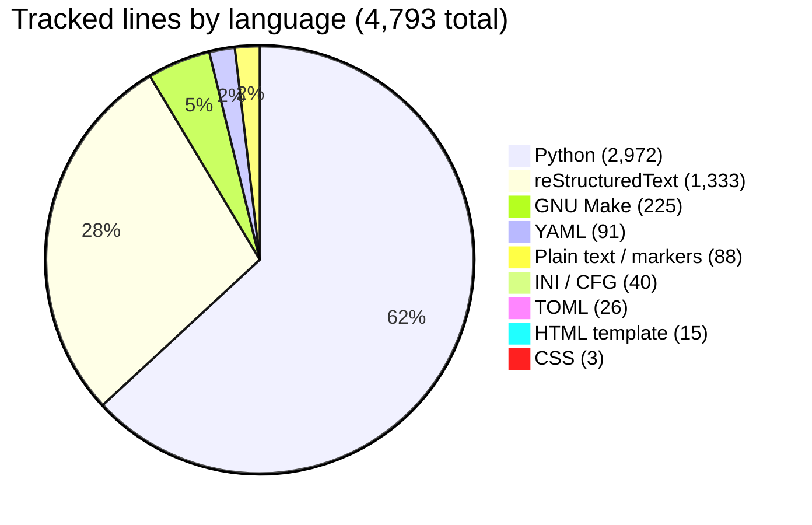
```mermaid
pie title Tracked lines by language (4,793 total)
    "Python (2,972)" : 2972
    "reStructuredText (1,333)" : 1333
    "GNU Make (225)" : 225
    "YAML (91)" : 91
    "Plain text / markers (88)" : 88
    "INI / CFG (40)" : 40
    "TOML (26)" : 26
    "HTML template (15)" : 15
    "CSS (3)" : 3
```

Within the Python total, the test module is larger than the implementation it exercises — 1,599 lines of `test_schedule.py` against 945 lines of `schedule/__init__.py`, a ratio of roughly 1.7 : 1.

### 3.1.5 Language-Level Constraints and Dependencies

| Constraint | Evidence and consequence |
|---|---|
| Runtime imports are standard library only | `schedule/__init__.py` lines 41–48 import `collections.abc.Hashable`, `datetime`, `functools`, `logging`, `random`, `re`, `time`, and `typing` — nothing else at import time |
| No compiled code | `setup.py` declares no `ext_modules`; the package is pure Python, so no toolchain, ABI, or platform wheel matrix is involved |
| Test suite requires a POSIX interpreter | `test_schedule.py` lines 29–30 set `os.environ["TZ"]` and call `time.tzset()`, which exists only on Unix — this ties the *test* suite (not the library) to Unix runners, matching the `ubuntu-latest` CI runner |
| Interpreter floor blocks modern syntax | Because 3.7 must keep working, contributions cannot use the walrus operator, PEP 604 unions, builtin generics, or `zoneinfo` |
| Documentation language is fixed | `Natural Language :: English` classifier (`setup.py` line 52) and `language = "en"` in `docs/conf.py` line 78; all reStructuredText is English-only |
| Interpreter security currency | The declared range begins at Python 3.7, which reached upstream end-of-life on 27 June 2023; 3.8 (October 2024), 3.9 (October 2025) have also passed end-of-life, and 3.10 is scheduled for October 2026. As of the current date only 3.10 through 3.14 remain in upstream security support, so four of the six matrix interpreters are outside that window and the matrix contains no 3.13 or 3.14 entry. Because the library itself imports only the standard library, the exposure is inherited from the host interpreter rather than introduced by this package |
| Vestigial linter directive | `test_schedule.py` lines 9–11 carry `# pylint: disable-msg=R0201,C0111,E0102,R0904,R0901`, but pylint appears in neither `requirements-dev.txt` nor `tox.ini` — the comment is a historical artifact, not an active tool contract |


## 3.2 Frameworks &amp; Libraries

The defining framework decision in this system is a **negative** one: the shipped package uses no application framework at all. `README.rst` advertises the library as "Very lightweight and no external dependencies", and `pyproject.toml` line 13 makes that literal with `dependencies = []`. Consequently every framework named below is either (a) a standard-library module acting as the runtime substrate, or (b) a development-time framework that never reaches a consumer's environment.

### 3.2.1 Runtime Substrate: The Python Standard Library

The eight standard-library imports at `schedule/__init__.py` lines 41–48 collectively play the role a framework would otherwise play. There are no others, and none is optional.

| Standard library module | Role in the architecture | Primary anchor |
|---|---|---|
| `datetime` | The entire time model — `datetime`, `time`, and `timedelta` are the units of scheduling; `timedelta(**{unit: interval})` turns the fluent unit name directly into arithmetic | `_schedule_next_run` line 729 |
| `functools` | `functools.partial` binds the callable with its arguments; `functools.update_wrapper` copies its metadata so `__name__` survives for logging and `__repr__` | `Job.do` lines 644–664 |
| `logging` | The sole observability channel: one named logger, DEBUG level, lazy `%` formatting | `logger = logging.getLogger("schedule")` line 50 |
| `random` | `random.randint(interval, latest)` implements the inclusive jitter range behind `to()` | line 712 |
| `re` | Three anchored regular expressions validate `at()` clock strings per unit | lines 513, 518, 524 |
| `time` | `time.sleep(delay_seconds)` spaces forced executions in `run_all()` | line 120 |
| `collections.abc.Hashable` | Runtime type guard for job tags | `Job.tag` lines 457–469 |
| `typing` | `Set`, `List`, `Optional`, `Callable`, `Union` annotations across the public surface | line 48 and throughout |

Because `pytz` is imported *inside* `Job.at()` rather than at module scope, the import graph of a consumer that never uses timezones contains only these standard-library modules.

### 3.2.2 Development-Time Frameworks and Their Declared Versions

Two dependency files describe the development toolchain, and they do not fully overlap: `requirements-dev.txt` is the human-facing "install everything" list referenced by `docs/development.rst`, while `tox.ini` declares the minimal per-environment sets that CI actually executes.

| Framework / tool | Declared version | Declared in |
|---|---|---|
| `pytest` | unpinned | `requirements-dev.txt`, `tox.ini` `[testenv] deps` |
| `pytest-cov` | unpinned | `requirements-dev.txt`, `tox.ini` `[testenv] deps` |
| `pytest-flake8` | unpinned | `requirements-dev.txt` only |
| `mypy` | unpinned | `requirements-dev.txt`, `tox.ini` `[testenv] deps` |
| `types-pytz` | unpinned | `requirements-dev.txt`, `tox.ini` `[testenv] deps` |
| `pytz` | unpinned | `requirements-dev.txt`; `tox.ini` line 21 as the conditional factor `pytz: pytz` |
| `black` | **pinned `==20.8b1`** | `requirements-dev.txt` line 7 |
| `click` | **pinned `==8.0.4`** | `requirements-dev.txt` line 8 |
| `Sphinx` | unpinned | `requirements-dev.txt` |
| `docutils` | unpinned | `requirements-dev.txt` |
| `Pygments` | unpinned | `requirements-dev.txt` |
| `setuptools` | `>= 61.0` (build requirement) | `pyproject.toml` line 2 |
| `tox`, `tox-gh-actions` | unpinned, installed at CI runtime | `.github/workflows/ci.yml` line 25 |
| `coveralls` | unpinned, installed at CI runtime | `.github/workflows/ci.yml` lines 34, 49 |
| `twine`, `wheel`, `build` | unpinned, installed at release time | `docs/development.rst` lines 61–62 |
| `alabaster` (Sphinx theme) | not declared; obtained through the Sphinx installation | `docs/conf.py` line 131 (`html_theme = "alabaster"`) |

Only two of these are version-pinned, and they are pinned as a pair. `docs/development.rst` line 33 instructs contributors: "Make sure you use version 20.8b1 of black." — `click` is black's command-line dependency, and `click==8.0.4` holds it at the last release compatible with that 2020 pre-release of black. Everything else floats, which keeps the toolchain current at the cost of build reproducibility being a function of resolution date rather than of the repository contents.

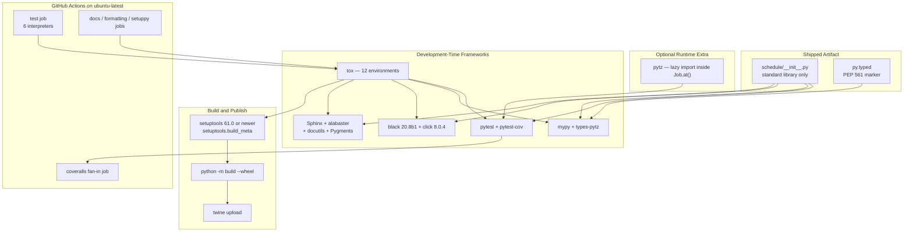
```mermaid
flowchart TB
    subgraph Shipped["Shipped Artifact"]
        Runtime["schedule/__init__.py<br/>standard library only"]
        Marker["py.typed<br/>PEP 561 marker"]
    end
    subgraph OptionalExtra["Optional Runtime Extra"]
        Pytz["pytz — lazy import inside Job.at()"]
    end
    subgraph DevFrameworks["Development-Time Frameworks"]
        Toxr["tox — 12 environments"]
        Pytestr["pytest + pytest-cov"]
        Mypyr["mypy + types-pytz"]
        Blackr["black 20.8b1 + click 8.0.4"]
        Sphinxr["Sphinx + alabaster<br/>+ docutils + Pygments"]
    end
    subgraph BuildPublish["Build and Publish"]
        Setuptoolsr["setuptools 61.0 or newer<br/>setuptools.build_meta"]
        Builder["python -m build --wheel"]
        Twiner["twine upload"]
    end
    subgraph Automation["GitHub Actions on ubuntu-latest"]
        MatrixJob["test job<br/>6 interpreters"]
        GateJobs["docs / formatting / setuppy jobs"]
        CoverFanIn["coveralls fan-in job"]
    end
    Runtime --> Pytestr
    Runtime --> Mypyr
    Runtime --> Blackr
    Runtime --> Sphinxr
    Marker --> Mypyr
    Pytz --> Pytestr
    Toxr --> Pytestr
    Toxr --> Mypyr
    Toxr --> Blackr
    Toxr --> Sphinxr
    Toxr --> Setuptoolsr
    MatrixJob --> Toxr
    GateJobs --> Toxr
    Pytestr --> CoverFanIn
    Setuptoolsr --> Builder
    Builder --> Twiner
```

### 3.2.3 Testing Framework Stack

The tests are written against the standard library's `unittest` and executed by `pytest` — a deliberate combination that keeps the test code runnable by any runner while gaining pytest's collection, verbosity, and plugin ecosystem.

| Layer | Choice | Evidence |
|---|---|---|
| Test authoring framework | `unittest` — `from unittest import mock, TestCase`; the single suite class is `SchedulerTests(TestCase)` | `test_schedule.py` lines 5, 96 |
| Test doubles | `unittest.mock.Mock`, wrapped by `make_mock_job(name=None)` which supplies `__name__` | `test_schedule.py` lines 33–36 |
| Determinism harness | POSIX `TZ` strings for Berlin, Auckland, Chatham, and UTC; `os.environ["TZ"] = TZ_BERLIN` plus `time.tzset()`; a `mock_datetime` context manager that substitutes a controlled `datetime` subclass | `test_schedule.py` lines 23–30, 39 |
| Runner and coverage | `py.test test_schedule.py schedule -v --cov schedule --cov-report term-missing` | `tox.ini` line 23 |
| Environment matrix | 12 tox environments so the suite runs with **and** without `pytz` on each interpreter | `tox.ini` line 2 |
| Optional-dependency guard | Timezone tests skip themselves when `pytz` is unavailable, which is what keeps the non-`pytz` environments green | `test_schedule.py` timezone helper and `setup_utc_offset_test` |

Note that the pytest invocation targets both `test_schedule.py` and the `schedule` package; the latter is included so coverage and doctest-bearing sources are collected. The suite is fast enough to be a routine local gate — 81 test methods complete in a fraction of a second on a current interpreter.

### 3.2.4 Static Typing and Formatting Frameworks

| Concern | Framework and invocation | Configuration |
|---|---|---|
| Static typing | `python -m mypy -p schedule --install-types --non-interactive` in every tox test environment | `setup.cfg` `[mypy] files=schedule`; stub package `types-pytz` in `[testenv] deps`; `--install-types` allows mypy to fetch missing stubs non-interactively |
| Type export to consumers | 0-byte `schedule/py.typed` shipped through `package_data` | `setup.py` line 20 |
| Code formatting | `black --check .` as a standalone tox environment and a standalone CI job | `tox.ini` lines 31–33; `.github/workflows/ci.yml` lines 67–78 |
| Formatter version discipline | `black==20.8b1` with `click==8.0.4` | `requirements-dev.txt` lines 7–8; `docs/development.rst` line 33 |
| Typing escape hatch | A single `# type: ignore` at the `pytz.timezone(tz)` assignment, required because the attribute is assigned a `pytz` object while the parameter is annotated `Optional[str]` | `schedule/__init__.py` line 502 |

The black pin is worth calling out explicitly as a maintenance liability: `20.8b1` is a 2020 *pre-release* build, whereas black has since moved to calendar versioning with an annual stable-style policy (the current stable line is in the 26.x series). Any contributor who installs an unpinned black will produce diffs that fail `black --check .`, which is precisely why the pin and the instruction in `docs/development.rst` exist.

### 3.2.5 Documentation Framework

`docs/development.rst` line 39 states the choice plainly: the documentation "is processed using Sphinx using the alabaster theme".

| Element | Configuration | Location |
|---|---|---|
| Engine | Sphinx, `source_suffix = ".rst"`, `master_doc = "index"` | `docs/conf.py` lines 50, 57 |
| Extensions | `sphinx.ext.autodoc`, `sphinx.ext.todo`, `sphinx.ext.coverage`, `sphinx.ext.viewcode` | `docs/conf.py` lines 35–41 |
| Autodoc source resolution | `sys.path.insert(0, os.path.abspath(".."))` so the local package is importable | `docs/conf.py` line 24 |
| Member ordering | `autodoc_member_order = "bysource"` | `docs/conf.py` line 370 |
| Theme | `html_theme = "alabaster"` with GitHub banner and star button for `dbader/schedule` | `docs/conf.py` lines 131–145 |
| Theme overrides | `_templates/sidebarintro.html` in the five-entry `html_sidebars["**"]` list; `_static/custom.css` | `docs/conf.py` lines 173, 194–202 |
| Version stamp | `version = "1.2.2"` and `release = "1.2.2"` — a second hard-coded copy of the release number | `docs/conf.py` lines 69–71 |
| reST toolchain | `docutils` (parser) and `Pygments` (code highlighting) as dev requirements | `requirements-dev.txt` lines 1–2 |
| Local build | `cd docs && make html`, output in `docs/_build/html` | `docs/Makefile`, `docs/development.rst` lines 44–47 |
| Enforced build | `sphinx-build -W -b html -d {envtmpdir}/doctrees . {envtmpdir}/html` — warnings are errors | `tox.ini` line 29 |
| API reference generation | `autodata`/`autofunction`/`autoclass`/`autoexception` directives consuming the 41 Sphinx docstring roles in the source module | `docs/reference.rst` |

Because `sphinx-build` runs with `-W`, the docstrings inside `schedule/__init__.py` are effectively part of the build contract: a malformed `:meth:` reference fails CI. `suppress_warnings = ["image.nonlocal_uri"]` (`docs/conf.py` line 373) is the one deliberate exemption, needed because `README.rst` embeds remote badge images.

### 3.2.6 Compatibility Requirements

| Requirement | Enforcement point |
|---|---|
| The package must import and pass its suite on Python 3.7 through 3.12 | `.github/workflows/ci.yml` matrix × `tox.ini` `[gh-actions]` mapping |
| The package must behave identically with and without `pytz` installed | `tox.ini` factor-conditional dependency `pytz: pytz` producing 12 environments |
| `pytz` must satisfy `Job.at()`'s type contract (`str` or `pytz.BaseTzInfo`) | `schedule/__init__.py` lines 501–508; `test_tz_invalid_timezone_exceptions` |
| mypy must resolve `pytz` symbols | `types-pytz` stub package in `[testenv] deps` and `requirements-dev.txt` |
| `black==20.8b1` requires `click==8.0.4` | Paired pins in `requirements-dev.txt`; verified by the `formatting` CI job |
| The build backend must support PEP 621 `[project]` metadata with `dynamic` fields | `requires = ["setuptools >= 61.0"]` in `pyproject.toml` |
| `setup.py` and `pyproject.toml` must not disagree | `dynamic = ["version","classifiers","keywords","authors"]` delegates exactly those four fields to `setup.py`; the `setuppy` CI job runs `setup.py check --strict --metadata --restructuredtext` |
| `docs/conf.py` and `setup.py` version strings must match | Manual step mandated by `docs/development.rst` line 53; no automated assertion exists |
| The documentation must build without warnings on Python 3.11 | `docs` CI job running `tox -e docs` |
| `README.rst` must be valid reStructuredText for PyPI rendering | `setup.py check --restructuredtext` in the `setuppy` CI job |

### 3.2.7 Justification for the Major Framework Choices

| Choice | Justification grounded in the repository |
|---|---|
| No runtime framework; standard library only | The product promise is "no external dependencies" (`README.rst`); an in-process scheduler embedded in arbitrary host applications must not impose transitive dependencies or version conflicts on its host |
| `unittest` for authoring, `pytest` for running | `unittest` keeps the suite dependency-free and executable by any runner (relevant because `MANIFEST.in` ships `test_schedule.py` inside the sdist); `pytest` supplies the coverage plugin and readable output used by the gate command |
| `tox` as the matrix orchestrator | It is the only mechanism in the repository capable of expressing "each interpreter, with and without the optional extra" as a single declarative envlist, and `tox-gh-actions` maps that envlist onto the CI matrix without duplicating it |
| `mypy` plus `py.typed` | The library is a typed API surface consumed by other codebases; exporting annotations is only credible if they are machine-checked, so the type gate runs alongside the tests in every environment |
| `black` with a hard pin | Formatting is enforced as a blocking CI job, so the formatter version must be deterministic or the gate becomes flaky across contributors |
| Sphinx with `-W` | Documentation is the product's differentiator; treating warnings as errors prevents silent decay of the 13 published pages and the autodoc reference |
| `setuptools` (not a modern alternative backend) | The project predates PEP 621 by a decade; keeping `setuptools` allows the incremental migration visible today, where static metadata lives in `pyproject.toml` while version/classifiers/keywords/authors remain in `setup.py` |
| `pytz` rather than `zoneinfo` | Forced by the Python 3.7 floor, since `zoneinfo` is only available from 3.9 onward |


## 3.3 Open Source Dependencies

The dependency budget of this project is unusually easy to state: **zero required runtime dependencies, one optional runtime dependency, and eleven declared development dependencies.** `pyproject.toml` line 13 reads `dependencies = []`, and `docs/installation.rst` line 17 states "Schedule has 1 optional dependency".

### 3.3.1 Runtime Dependencies

| Tier | Package | Declared version | Declaration |
|---|---|---|---|
| Required | *(none)* | — | `pyproject.toml` line 13: `dependencies = []` |
| Optional extra `timezone` | `pytz` | unpinned — no floor and no ceiling | `pyproject.toml` lines 19–20 |

`pytz` is the only third-party package that can ever be present at runtime, and it is reachable only through one code path: `Job.at(time_str, tz)` executes `import pytz` inside the method body when — and only when — a `tz` argument is supplied (`schedule/__init__.py` lines 498–508). A consumer that never passes a timezone never imports it, which is what makes an empty required-dependency list truthful rather than aspirational.

Two documentation-versus-packaging observations are worth recording because they affect how consumers actually install the extra:

- The declared extra is `timezone`, but the extras-install form `schedule[timezone]` appears **nowhere** in the repository. `docs/timezones.rst` line 13 and `docs/faq.rst` line 50 instead instruct users to run `pip install pytz` directly, and `docs/faq.rst` lines 45–50 document the resulting `ModuleNotFoundError: No module named 'pytz'` as an expected failure mode with that resolution.
- Because `pytz` carries no version constraint, timezone correctness depends on whichever `pytz` release — and therefore whichever IANA tz database snapshot — the consumer happens to have installed.

### 3.3.2 Development and Tooling Dependencies

`requirements-dev.txt` is the single declared development set, installed by contributors via `pip install -r requirements-dev.txt` (`docs/development.rst` line 12) and consumed wholesale by the `docs`, `format`, and `setuppy` tox environments.

| Package | Declared version | Purpose in this repository |
|---|---|---|
| `docutils` | unpinned | reStructuredText parsing behind Sphinx and `setup.py check --restructuredtext` |
| `Pygments` | unpinned | Syntax highlighting for the code blocks in the 13 documentation pages |
| `pytest` | unpinned | Test runner for the `unittest`-authored suite |
| `pytest-cov` | unpinned | `--cov schedule --cov-report term-missing` coverage measurement |
| `pytest-flake8` | unpinned | Style plugin used by the command in `docs/development.rst` line 22; **not** invoked by the CI-enforced command in `tox.ini` line 23 |
| `Sphinx` | unpinned | Documentation build engine |
| `black` | **`==20.8b1`** | Formatter; the version is mandated in `docs/development.rst` line 33 |
| `click` | **`==8.0.4`** | black's CLI dependency, pinned to remain compatible with `black==20.8b1` |
| `mypy` | unpinned | Static type gate over the `schedule` package |
| `pytz` | unpinned | Enables the timezone half of the test suite locally |
| `types-pytz` | unpinned | PEP 561 stub package so mypy can resolve `pytz` symbols |

Additional tooling is not declared in any manifest but is installed on demand:

| Package | Installed by | Version discipline |
|---|---|---|
| `tox`, `tox-gh-actions` | `.github/workflows/ci.yml` line 25 | unpinned, resolved fresh on every CI run |
| `coveralls` | `.github/workflows/ci.yml` lines 34 and 49 | unpinned, resolved fresh on every CI run |
| `setuptools`, `twine`, `wheel`, `build` | `docs/development.rst` lines 61–62 (`pip install --upgrade setuptools twine wheel`, then `python3 -m build --wheel`) | explicitly upgraded to latest at release time |
| `setuptools` (build backend) | `pyproject.toml` line 2 | `>= 61.0` floor, no ceiling |
| `alabaster` | transitively, through the Sphinx installation | not declared anywhere in the repository |

The minimal per-environment test set is narrower than `requirements-dev.txt`: `tox.ini` `[testenv] deps` installs only `pytest`, `pytest-cov`, `mypy`, `types-pytz`, and — for `-pytz` factors only — `pytz`.

### 3.3.3 Registries and Distribution Channels

| Registry / channel | Role | Evidence |
|---|---|---|
| PyPI | Primary registry for both publishing and consuming; distribution name `schedule` | `docs/installation.rst` lines 26–33 (`$ pip install schedule`); PyPI version badge in `README.rst` lines 11–12 |
| TestPyPI | Pre-release verification target before the production upload | `docs/development.rst` lines 63–64 (`twine upload --repository schedule-test dist/*`) |
| PyPI (for dependencies) | Source of all eleven development packages and of `pytz`; `pytz` is linked to its PyPI project page from three documentation pages | `docs/installation.rst` line 19, `docs/timezones.rst` line 9, `docs/faq.rst` line 48 |
| GitHub releases / tarball | Secondary source referenced by `download_url` | `setup.py` line 6 (`.../tarball/1.2.2`) |
| Ubuntu / Debian archives | Third-party `python3-schedule` packages, explicitly marked **OUTDATED** (version 0.3.2 from 2015 for Ubuntu 20.04 LTS and below, and Debian buster and below) | `docs/installation.rst` lines 46–66 |
| Arch User Repository | Third-party `python-schedule` (`yay -S python-schedule`) | `docs/installation.rst` lines 68–77 |
| conda-forge / Anaconda | Third-party channel maintained by the conda-forge project | `docs/installation.rst` lines 79–85 |
| Manual vendoring | Copying the single source file is documented but "highly discouraged" | `docs/installation.rst` lines 87–95 |

`docs/installation.rst` lines 41–44 disclaim all four operating-system and conda channels: they "are not maintained by the maintainers of this project" and cannot be guaranteed to be current.

### 3.3.4 Licensing Posture

| Aspect | Position | Evidence |
|---|---|---|
| Project license | MIT | `LICENSE.txt` ("Copyright (c) 2013 Daniel Bader"), `license="MIT"` in `setup.py` line 24, `license = {text = "MIT License"}` in `pyproject.toml` line 10, and the `License :: OSI Approved :: MIT License` classifier |
| Redistribution of the source file | Explicitly permitted and documented — "the schedule library consists of a single sourcefile MIT licenced" | `docs/installation.rst` line 90 |
| Inbound license obligations at runtime | None in the default install; only `pytz` can be present, and only when the timezone feature is used | `pyproject.toml` lines 13, 19–20 |
| Files shipped in the sdist | `README.rst`, `HISTORY.rst`, `LICENSE.txt`, and `test_schedule.py` | `MANIFEST.in` lines 1–5 |
| Attribution artifact | 46 named contributors, included into the published documentation via `docs/index.rst` | `AUTHORS.rst` |

Because the default install pulls nothing, a consumer's transitive license surface attributable to this package is exactly one MIT-licensed file.

### 3.3.5 Supply-Chain and Security Implications

| Implication | Basis in the repository |
|---|---|
| Default attack surface is a single file | Zero required dependencies means no transitive packages to audit, pin, or patch; the shipped artifact is `schedule/__init__.py` plus a 0-byte marker |
| The optional dependency is also the only third-party trust decision | `pytz` is unpinned in `pyproject.toml`, so consumers inherit whatever release their resolver selects; `types-pytz` matters only at development time |
| No dependency lock file exists | Neither a lock file nor hash pinning is present; `requirements-dev.txt` pins only `black` and `click`, so a development or CI environment is reproducible only to the resolution date |
| CI installs unpinned tooling from PyPI on every run | `pip install tox tox-gh-actions` and `pip3 install coveralls` in `.github/workflows/ci.yml` fetch latest releases at execution time, and `mypy --install-types` may fetch additional stub packages mid-run |
| Actions are pinned by mutable major tags | `actions/checkout@v3` and `actions/setup-python@v4` resolve to a moving target rather than a commit SHA |
| The library performs no deserialization, network, or subprocess work | Verified absence of `open()`, `pickle`, `json`, `socket`, `subprocess`, `os`/`environ` access, `eval`, and `exec` anywhere in `schedule/__init__.py`, so there is no untrusted-input parsing path other than the caller's own configuration strings |
| Randomness is not cryptographic | `random.randint` (line 712) implements schedule jitter only and offers no unpredictability guarantee |
| A stale formatter pin is a known-quantity risk | `black==20.8b1` is a 2020 pre-release; black's current stable line is calendar-versioned in the 26.x series, so the pinned build no longer receives fixes. It is a development-only dependency and therefore never reaches consumers |
| End-of-life interpreters are inside the declared support range | Python 3.7, 3.8 and 3.9 are past upstream end-of-life (June 2023, October 2024 and October 2025 respectively) and 3.10 is scheduled for October 2026, yet all four remain in the CI matrix; the package inherits, rather than causes, that exposure since it imports only the standard library |


## 3.4 Third-Party Services

The shipped library integrates with **no external service whatsoever**. Every third-party service identified below sits on the *engineering* side of the boundary — source hosting, continuous integration, coverage reporting, package distribution, and documentation publishing — and none of them is reachable from, or required by, the runtime.

### 3.4.1 Runtime External Integrations: Verified Absent

| Service category | Status in this system | Verification |
|---|---|---|
| External / third-party APIs | None | No HTTP client, socket, or RPC construct exists in `schedule/__init__.py`; a keyword scan across all 32 tracked files found no `requests`, `httpx`, `urllib3`, or `aiohttp` usage |
| Authentication / identity providers | None | No authentication or authorization concept exists anywhere in the package; no `jwt`, `oauth`, `auth0`, `passlib`, `bcrypt`, or `cryptography` reference exists in any tracked file |
| Cloud platform services | None | No `boto3`/`botocore`, AWS CLI, Azure, or Google Cloud SDK reference; no cloud credential handling |
| Message brokers / queues | None ship with the package | `docs/parallel-execution.rst` shows a caller-side `queue.Queue` worker pattern and mentions beanstalkd only as an illustration; no broker client is imported |
| APM / metrics / tracing backends | None | No Prometheus, OpenTelemetry, Sentry, Datadog, New Relic, or statsd reference; the only telemetry is `logging` at DEBUG on the `schedule` logger (`schedule/__init__.py` line 50) |
| Secret / configuration management | None | The library reads no environment variable and no configuration file; jobs are configured exclusively through Python API calls |
| Time / NTP services | None | Time comes from `datetime.datetime.now()` and, when requested, a `pytz` zone object |

### 3.4.2 Engineering and Distribution Services Actually Used

| Service | Function in this project | Integration mechanism |
|---|---|---|
| GitHub (`github.com/dbader/schedule`) | Source hosting, pull requests, issue tracker, release tags, and the `download_url` tarball | `pyproject.toml` lines 24–26; `setup.py` lines 6, 27–28; `docs/index.rst` issue-tracker link |
| GitHub Actions | The entire CI compute plane; five jobs on GitHub-hosted `ubuntu-latest` runners | `.github/workflows/ci.yml`; `actions/checkout@v3`, `actions/setup-python@v4` |
| Coveralls (`coveralls.io`) | External coverage aggregation and pull-request summary comments | `pip3 install coveralls` then `coveralls --service=github` per matrix entry, and `coveralls --finish --service=github` in the dependent `coverage push` job |
| PyPI (`pypi.org/project/schedule`) | Production package registry for publication and consumption | `twine upload --repository schedule dist/*` (`docs/development.rst` line 66); `pip install schedule` |
| TestPyPI (`test.pypi.org/project/schedule`) | Staging registry exercised before every production upload | `twine upload --repository schedule-test dist/*` (`docs/development.rst` line 64) |
| Read the Docs (`schedule.readthedocs.io`) | Public documentation hosting | Declared as the `Documentation` project URL (`pyproject.toml` line 23) and linked from the `README.rst` title. **No `.readthedocs.yaml` exists in the repository**, so the hosted build is configured outside version control |
| shields.io | Renders the PyPI version badge in `README.rst` | `https://img.shields.io/pypi/v/schedule.svg` (`README.rst` line 11) |
| GitHub workflow badge endpoint | Renders live CI status for the `Tests` workflow on `master` | `README.rst` lines 5–6 |
| Third-party package channels | Downstream redistribution outside the project's control: Ubuntu/Debian `python3-schedule`, Arch AUR `python-schedule`, conda-forge | `docs/installation.rst` lines 39–85, which disclaim maintenance of all of them |
| Twitter widget platform | Loads `platform.twitter.com/widgets.js` in the generated documentation sidebar | Inline `<script>` in `docs/_templates/sidebarintro.html` line 10 — the only client-side third-party script anywhere in the repository, present in published docs only |

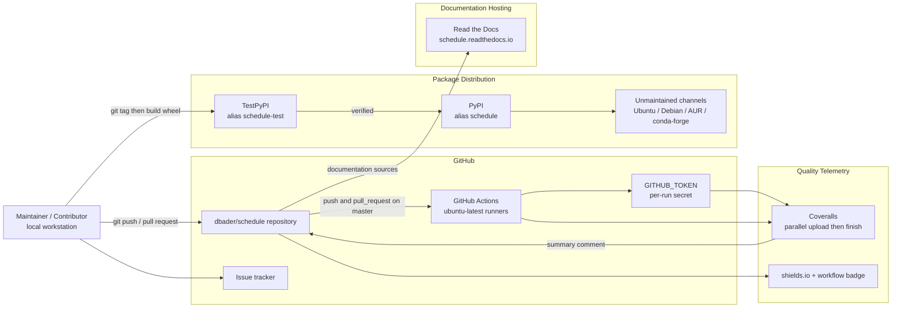
```mermaid
flowchart LR
    Maintainer["Maintainer / Contributor<br/>local workstation"]
    subgraph GitHubPlatform["GitHub"]
        Repo["dbader/schedule repository"]
        Issues["Issue tracker"]
        ActionsSvc["GitHub Actions<br/>ubuntu-latest runners"]
        TokenSvc["GITHUB_TOKEN<br/>per-run secret"]
    end
    subgraph Telemetry["Quality Telemetry"]
        CoverallsSvc["Coveralls<br/>parallel upload then finish"]
        BadgeSvc["shields.io + workflow badge"]
    end
    subgraph DistributionSvc["Package Distribution"]
        TestPyPISvc["TestPyPI<br/>alias schedule-test"]
        PyPISvc["PyPI<br/>alias schedule"]
        Downstream["Unmaintained channels<br/>Ubuntu / Debian / AUR / conda-forge"]
    end
    subgraph DocsHosting["Documentation Hosting"]
        RTD["Read the Docs<br/>schedule.readthedocs.io"]
    end
    Maintainer -->|git push / pull request| Repo
    Maintainer --> Issues
    Repo -->|push and pull_request on master| ActionsSvc
    ActionsSvc --> TokenSvc
    TokenSvc --> CoverallsSvc
    ActionsSvc --> CoverallsSvc
    CoverallsSvc -->|summary comment| Repo
    Repo --> BadgeSvc
    Maintainer -->|git tag then build wheel| TestPyPISvc
    TestPyPISvc -->|verified| PyPISvc
    PyPISvc --> Downstream
    Repo -->|documentation sources| RTD
```

### 3.4.3 Authentication and Credential Handling

There is no authentication *feature* in this system and no identity provider integration. The only credentials that appear anywhere in the repository are CI and publishing credentials, and both are held outside the tree:

| Credential | Scope and handling | Location |
|---|---|---|
| `GITHUB_TOKEN` | Injected as `${{ secrets.GITHUB_TOKEN }}` into the Coveralls steps of the `test` and `coverage push` jobs; the automatically provisioned per-run token, never a long-lived secret | `.github/workflows/ci.yml` lines 30, 52 |
| PyPI / TestPyPI upload credentials | Referenced only indirectly through the twine repository aliases `schedule` and `schedule-test`; the aliases resolve to a maintainer's local `.pypirc`, which is not present in the repository | `docs/development.rst` lines 63–66 |

No other secret, token, key, or credential reference exists in any tracked file, and no `.env` file or secret-management integration is present.

### 3.4.4 Monitoring and Observability Services

| Layer | What exists | What does not |
|---|---|---|
| Library runtime | A single `logging.getLogger("schedule")` emitting DEBUG records for run, run-all, cancel, and clear operations, documented in `docs/logging.rst`; the library installs no handler and sets no level | No metrics exporter, no tracing, no health endpoint, no error-reporting SDK |
| Engineering telemetry | Coveralls receives per-interpreter coverage with `COVERALLS_FLAG_NAME=python-<version>` and `COVERALLS_PARALLEL=true`, then a dependent job calls `coveralls --finish` so the service can combine results and post a summary; three README badges surface CI status, coverage, and the published PyPI version | No uptime monitoring, dashboarding, or alerting service — there is no deployed system to monitor |

The design consequence is that all runtime observability is delegated to the host application: because the library only emits standard `logging` records, whatever monitoring stack the host already uses receives scheduler diagnostics with no additional integration.

### 3.4.5 Cloud Services

No cloud service is used, referenced, or provisioned by this repository. There is no infrastructure-as-code, no deployment target, and no cloud account dependency; the only remote compute involved is the GitHub-hosted `ubuntu-latest` runner pool that executes `.github/workflows/ci.yml`, and the only remote storage involved is the package and documentation hosting listed in 3.4.2. This is a direct consequence of the product form factor established in the earlier sections of this specification: the artifact is a library that runs inside someone else's process, so it has no infrastructure of its own to describe.


## 3.5 Databases &amp; Storage

This system has **no database tier, no cache tier, and no storage service**. That is not an omission in the documentation — it is a published product boundary. `docs/index.rst` lists job persistence first among the reasons to choose a different library, stating that Schedule will not remember the schedule between restarts.

### 3.5.1 Primary and Secondary Databases

| Category | Status | Verification |
|---|---|---|
| Primary database | None | A keyword scan of all 32 tracked files found no reference to MongoDB/`pymongo`, SQLAlchemy, `psycopg`, MySQL, `sqlite3`, or any other driver or ORM |
| Secondary / analytical store | None | Same scan; no data-warehouse or reporting integration exists |
| Migration tooling | None | No migration directory, schema file, or DDL of any kind is present |
| Connection configuration | None | `schedule/__init__.py` reads no environment variable and parses no configuration file |

### 3.5.2 The Only State Store: An In-Memory Job Registry

All state in the system lives in one Python list for the lifetime of the host process.

| Element | Definition | Location |
|---|---|---|
| The registry | `self.jobs: List[Job] = []` on each `Scheduler` instance | `schedule/__init__.py` line 87 |
| The process-global instance | `default_scheduler = Scheduler()` | line 837 |
| The public alias | `jobs = default_scheduler.jobs` — a live reference, not a copy, carrying an inline `todo` questioning that choice | line 840 |
| Record shape | Each `Job` holds `interval`, `latest`, `unit`, `at_time`, `at_time_zone`, `start_day`, `cancel_after`, `tags`, `last_run`, `next_run`, a back-reference to its `scheduler`, and `job_func` (a `functools.partial` retaining the callable and its bound arguments) | `Job.__init__` lines 227–255 |
| Write path | `Job.do()` appends the job only after validation and first-next-run computation succeed | lines 657–663 |
| Read paths | `get_jobs(tag)` returns a *copy of the list* (the `Job` objects inside remain live); `get_next_run(tag)` returns `min(...).next_run`; `idle_seconds` derives from it | lines 122–133, 177–206 |
| Delete paths | `clear(tag)` mutates the list **in place** (`del self.jobs[:]` or slice assignment) so the module-level alias stays valid; `cancel_job()` removes one entry and silently ignores an unscheduled job | lines 135–160 |
| Isolation model | Independent `Scheduler()` instances own independent registries, each requiring its own `run_pending()` call | `docs/multiple-schedulers.rst` |

### 3.5.3 Data Persistence Strategy

The persistence strategy is *deliberately none*: state is created by API calls, mutated by scheduling arithmetic, and discarded when the process exits.

| Aspect | Behavior |
|---|---|
| Durability | Zero. There is no serialization anywhere in the module — no `pickle`, `json`, `shelve`, `dbm`, or `open()` call exists in `schedule/__init__.py` |
| Recovery model | The host application must re-register its jobs on every startup; the canonical usage pattern in `README.rst` does exactly that, in code, before entering the `run_pending()` loop |
| Retention | Bounded by process lifetime; expired `until()` jobs and self-cancelling `CancelJob` jobs are removed from the registry automatically, so it does not grow without bound |
| Consistency model | Single-threaded, in-line mutation with no locking; there is no transaction, no concurrent writer, and therefore no isolation level to describe |
| Cross-process sharing | None. `default_scheduler` is process-global mutable state shared by every component in the same interpreter, and nothing is shared across processes |

### 3.5.4 Caching Solutions

No caching layer exists, and no memoization decorator is used anywhere in the runtime module (`functools.lru_cache` is absent). Two retention behaviours are sometimes mistaken for caching and are worth distinguishing:

- **Bound-argument retention.** `job_func = functools.partial(job_func, *args, **kwargs)` keeps strong references to the callable and its arguments for the job's entire lifetime (`Job.do`, lines 644–664). This is binding, not caching, and it is why registry memory grows linearly with job count.
- **Timezone-object retention.** When `at(time_str, tz)` is given a zone, the resolved `pytz` object is stored on the job as `at_time_zone` (lines 500–503) and reused on every reschedule. This avoids repeated zone lookups per job but is not a shared cache — each job holds its own reference, and no zone data is loaded at all unless a timezone is requested.

### 3.5.5 Storage Services

There is no object store, block store, file store, or blob service. The only filesystem activity anywhere in the repository is development-time and build-time:

| Filesystem interaction | Purpose | Location |
|---|---|---|
| `codecs.open(filename, "r", "utf8")` reading `README.rst` | Supplies `long_description` for packaging metadata | `setup.py` lines 9–14, 23 |
| `sys.path.insert(0, os.path.abspath(".."))` | Makes the package importable for Sphinx autodoc | `docs/conf.py` line 24 |
| `sphinx-build` output into `_build` / `{envtmpdir}` | Documentation artifacts, git-ignored | `docs/Makefile`, `tox.ini` line 29, `.gitignore` line 44 |
| Coverage and tox working directories | `.coverage`, `.tox`, `dist`, `build`, `*.egg-info` | `.gitignore` lines 7–27 |

### 3.5.6 Implications for Consumers

Because there is no storage tier, durability is entirely the host application's responsibility. Any consumer requiring restart-surviving schedules must re-declare jobs at startup or adopt a different scheduler; any consumer requiring shared schedule state across processes must coordinate that externally, since each `Scheduler` is process-local with no leader election, locking, or shared registry. This division of responsibility is stated as a non-goal in `docs/index.rst` rather than left for consumers to discover, and it is the reason the package needs no configuration, no connection string, and no credentials.


## 3.6 Development &amp; Deployment

"Deployment" for this system means **publishing a package**, not operating a service. There is no runtime environment to provision, so the toolchain is organised around a matrix of interpreter environments, five blocking quality gates, and a manual, documented publication ritual.

### 3.6.1 Development Environment and Tools

| Concern | Tooling and command | Source |
|---|---|---|
| Dependency bootstrap | `pip install -r requirements-dev.txt` | `docs/development.rst` lines 8–12 |
| Test execution (documented) | `py.test test_schedule.py --flake8 schedule -v --cov schedule --cov-report term-missing` | `docs/development.rst` line 22 |
| Test execution (enforced) | `py.test test_schedule.py schedule -v --cov schedule --cov-report term-missing` — note the absence of `--flake8` | `tox.ini` line 23 |
| Formatting | `black .` locally; "Make sure you use version 20.8b1 of black" | `docs/development.rst` lines 26–33 |
| Type checking | `python -m mypy -p schedule --install-types --non-interactive` | `tox.ini` line 24, `setup.cfg` |
| Documentation preview | `cd docs && make html`, output in `docs/_build/html` | `docs/development.rst` lines 44–47, `docs/Makefile` |
| Multi-interpreter runs | `tox` (12 environments) | `tox.ini` |
| Editor / IDE assumptions | `.gitignore` excludes JetBrains artifacts (`.idea`, `*.iml`) and virtualenv directories (`env`, `env3`, `venv`), so local environments are developer-chosen rather than prescribed | `.gitignore` lines 38–48 |
| Version control conventions | Single `master` branch is the CI target for both pushes and pull requests; releases are annotated tags `X.Y.Z` | `.github/workflows/ci.yml` lines 3–9; `docs/development.rst` line 58 |

There is no devcontainer, no editor configuration file, no pre-commit configuration, and no `Makefile` at the repository root — the only `Makefile` is the Sphinx build driver under `docs/`.

### 3.6.2 Build System

| Element | Value | Source |
|---|---|---|
| Build backend | `setuptools.build_meta` | `pyproject.toml` line 3 |
| Build requirement | `setuptools >= 61.0` (the floor that provides PEP 621 `[project]` support) | `pyproject.toml` line 2 |
| Static metadata | `name`, `description`, `readme`, `license`, `requires-python`, `dependencies`, `maintainers`, optional-dependencies, and four project URLs | `pyproject.toml` |
| Dynamic metadata | `version`, `classifiers`, `keywords`, `authors` — deliberately delegated to `setup.py` | `pyproject.toml` line 8 |
| Version source of truth | `SCHEDULE_VERSION = "1.2.2"` | `setup.py` line 5 (duplicated as `version`/`release` in `docs/conf.py` lines 69–71) |
| Package contents | `packages=["schedule"]` plus `package_data={"schedule": ["py.typed"]}` | `setup.py` lines 19–20 |
| Source-distribution contents | `README.rst`, `HISTORY.rst`, `LICENSE.txt`, `test_schedule.py`; `__pycache__` and `*.py[co]` excluded recursively — note that `docs/` is not shipped | `MANIFEST.in` |
| Wheel construction | `python3 -m build --wheel` after `pip install --upgrade setuptools twine wheel` | `docs/development.rst` lines 61–62 |
| Compilation steps | None — the distribution is pure Python with no `ext_modules` | `setup.py` |

The hybrid metadata arrangement is the notable characteristic here: this is a decade-old setuptools project mid-migration to PEP 621, and the `dynamic` declaration is what keeps the two files from conflicting. The `setuppy` CI gate exists precisely to catch a divergence, since `python setup.py check --strict --metadata --restructuredtext` validates both the metadata completeness and the reStructuredText that PyPI will render.

### 3.6.3 Quality Gates

Five distinct gates are declared in `tox.ini` and each is wired into CI. All are blocking.

| Gate | tox environment | Command and failure condition |
|---|---|---|
| Tests + coverage | `py3{7..12}{,-pytz}` (12 envs) | `py.test test_schedule.py schedule -v --cov schedule --cov-report term-missing` — any failing test fails the build; `skip_missing_interpreters = true` prevents a missing local interpreter from erroring |
| Static typing | same 12 envs | `python -m mypy -p schedule --install-types --non-interactive` — any type error fails the build |
| Documentation | `docs` | `sphinx-build -W -b html …` — **any warning** fails the build |
| Formatting | `format` | `black --check .` — any deviation from `black==20.8b1` output fails the build |
| Packaging metadata | `setuppy` | `python setup.py check --strict --metadata --restructuredtext` — incomplete metadata or invalid reST fails the build |

The optional-dependency contract is enforced structurally rather than by assertion: `tox.ini` line 21 declares `pytz` as the factor-conditional dependency `pytz: pytz`, so each interpreter is exercised once *with* and once *without* `pytz`, and the timezone tests skip themselves when it is absent.

### 3.6.4 Continuous Integration Topology

`.github/workflows/ci.yml` defines a workflow named `Tests` triggered on pushes to `master` and pull requests targeting `master`. It contains five jobs, all on `ubuntu-latest`; Python 3.11 is the fixed utility interpreter for the four non-matrix jobs.

| Job | Trigger relationship | Work performed |
|---|---|---|
| `test` | Runs on every event; `max-parallel: 6` across `['3.7','3.8','3.9','3.10','3.11','3.12']` | `actions/checkout@v3`, `actions/setup-python@v4`, `pip install tox tox-gh-actions`, `tox`, then a Coveralls upload flagged `python-<version>` with `COVERALLS_PARALLEL=true` |
| `coveralls` (display name `coverage push`) | `needs: test` | `coveralls --finish --service=github` so the service combines the parallel results and posts the summary comment; this job performs no checkout |
| `docs` | Independent | `tox -e docs` |
| `formatting` | Independent | `tox -e format` |
| `setuppy` | Independent | `tox -e setuppy` (its step is labelled "Check docs", a cosmetic mislabel) |

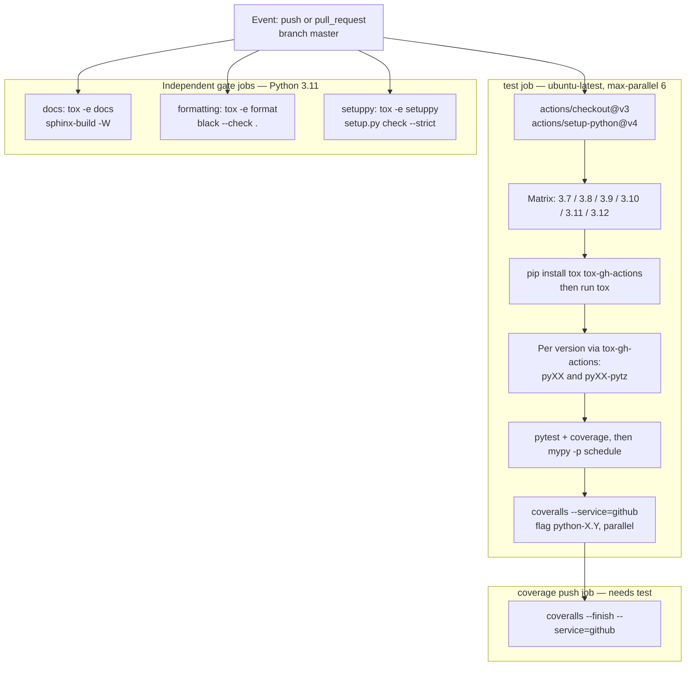
```mermaid
flowchart TB
    Trigger["Event: push or pull_request<br/>branch master"]
    subgraph TestJob["test job — ubuntu-latest, max-parallel 6"]
        Checkout["actions/checkout@v3<br/>actions/setup-python@v4"]
        MatrixNode["Matrix: 3.7 / 3.8 / 3.9 / 3.10 / 3.11 / 3.12"]
        ToxRun["pip install tox tox-gh-actions<br/>then run tox"]
        EnvPair["Per version via tox-gh-actions:<br/>pyXX and pyXX-pytz"]
        Gate1["pytest + coverage, then mypy -p schedule"]
        CovUp["coveralls --service=github<br/>flag python-X.Y, parallel"]
    end
    subgraph FanInJob["coverage push job — needs test"]
        Finish["coveralls --finish --service=github"]
    end
    subgraph GateJobs["Independent gate jobs — Python 3.11"]
        DocsGate["docs: tox -e docs<br/>sphinx-build -W"]
        FormatGate["formatting: tox -e format<br/>black --check ."]
        MetaGate["setuppy: tox -e setuppy<br/>setup.py check --strict"]
    end
    Trigger --> Checkout
    Checkout --> MatrixNode
    MatrixNode --> ToxRun
    ToxRun --> EnvPair
    EnvPair --> Gate1
    Gate1 --> CovUp
    CovUp --> Finish
    Trigger --> DocsGate
    Trigger --> FormatGate
    Trigger --> MetaGate
```

The `[gh-actions]` table in `tox.ini` is the hinge between the two configuration files: GitHub Actions supplies one interpreter per matrix entry, and `tox-gh-actions` expands that single interpreter into the pair of environments (`pyXX`, `pyXX-pytz`) declared in the envlist — so twelve environments are covered by six matrix entries without duplicating the matrix in YAML.

`HISTORY.rst` records that this platform choice was itself a migration: release 1.0.0 "Replaced Travis with Github Actions for automated testing". No Travis configuration remains in the tree.

### 3.6.5 Release and Publication Pipeline

Publication is **not automated** — there is no release, tag, or publish workflow in `.github/workflows/`. The process is a documented manual sequence in `docs/development.rst` lines 49–68, executed by a maintainer:

```bash
git tag X.Y.Z -m "Release X.Y.Z" && git push --tags
python3 -m build --wheel && twine upload --repository schedule-test dist/*
```


```mermaid
flowchart LR
    Step1["Update HISTORY.rst<br/>and AUTHORS.rst"]
    Step2["Bump version in setup.py<br/>AND docs/conf.py"]
    Step3["Merge to master<br/>CI gates must pass"]
    Step4["git tag X.Y.Z<br/>git push --tags"]
    Step5["python3 -m build --wheel"]
    Step6["twine upload<br/>repository schedule-test<br/>(TestPyPI)"]
    Step7["twine upload<br/>repository schedule<br/>(PyPI)"]
    Step8["Downstream channels<br/>Ubuntu / Debian / AUR / conda-forge"]
    Step1 --> Step2
    Step2 --> Step3
    Step3 --> Step4
    Step4 --> Step5
    Step5 --> Step6
    Step6 -->|verified| Step7
    Step7 --> Step8
```

Two properties of this pipeline are load-bearing. First, the version number exists in two files (`setup.py` line 5 and `docs/conf.py` lines 69–71) and nothing verifies that they agree, so the dual bump in step 2 is a manual invariant. Second, the project declares semantic versioning (`docs/development.rst` line 68), which is what makes the naive-local `next_run` contract documented elsewhere in this specification a breaking-change concern rather than an implementation detail.

### 3.6.6 Containerization and Infrastructure

| Capability | Status |
|---|---|
| Containerization | **Absent.** No `Dockerfile`, `.dockerignore`, or compose file exists anywhere in the repository |
| Container registry | Not applicable — no image is built or published |
| Infrastructure as code | **Absent.** No Terraform (`*.tf`), CloudFormation, Helm chart, Kubernetes manifest, or Ansible playbook exists |
| Orchestration / runtime platform | Not applicable — the artifact is a library that executes inside a consumer's process |
| Environment configuration | None — no `.env` file, no environment-variable contract, and no configuration file format |
| Alternative CI platforms | None — `.github/workflows/ci.yml` is the only automation file; no Travis, GitLab CI, CircleCI, Jenkins, or Azure Pipelines configuration is present |

This is the single largest divergence from the default technology stack proposed for greenfield projects (AWS, Docker, Terraform): none of those layers is applicable to a zero-dependency pure-Python library, and introducing them would contradict the "no extra processes needed" positioning stated in `README.rst`. The only element of that default stack actually present is GitHub Actions, plus Python itself.

### 3.6.7 CI/CD Requirements and Observed Gaps

Requirements that any change to this repository must satisfy, all mechanically enforced:

1. Green tests **and** a clean mypy run on all six interpreters, both with and without `pytz` (12 environments).
2. A warning-free Sphinx build, which transitively requires well-formed docstrings in `schedule/__init__.py` because `sphinx.ext.autodoc` consumes them.
3. Byte-identical formatting under `black==20.8b1`.
4. Valid, complete packaging metadata and PyPI-renderable reStructuredText.
5. Coverage published to Coveralls per interpreter and aggregated by the dependent job.

Gaps observable in the configuration, recorded as facts rather than recommendations:

| Gap | Evidence |
|---|---|
| Linting is documented but not enforced | `pytest-flake8` is a declared dev dependency and `docs/development.rst` line 22 passes `--flake8`, but the CI-enforced command in `tox.ini` line 23 omits it |
| No dependency pinning or lock file | Only `black` and `click` are pinned; `tox`, `tox-gh-actions`, and `coveralls` are installed unpinned at CI runtime |
| Actions referenced by mutable major tags | `actions/checkout@v3` and `actions/setup-python@v4` rather than commit SHAs |
| Publication is manual | No release/publish workflow exists; tagging, building, and both twine uploads are performed by hand |
| Documentation hosting is configured out-of-tree | `schedule.readthedocs.io` is the declared documentation URL, but no `.readthedocs.yaml` exists in the repository |
| Single-platform verification | Every job runs on `ubuntu-latest` despite the `Operating System :: OS Independent` classifier; the test suite's use of `time.tzset()` would in any case require adaptation for a Windows runner |
| No coverage threshold | Coverage is measured and reported (`--cov-report term-missing`) and uploaded, but no minimum is enforced in `tox.ini` or the workflow |
| Version duplication is unverified | `setup.py` and `docs/conf.py` both hard-code `1.2.2` with no automated consistency check |


## 3.7 References

### 3.7.1 Repository Files Examined

**Runtime package**

- `schedule/__init__.py` — established the eight standard-library imports (lines 41–48), the `logging.getLogger("schedule")` observability channel (line 50), the pre-PEP-585 typing dialect, the lazy `import pytz` site inside `Job.at()` (lines 498–508) with its `# type: ignore`, the in-memory `self.jobs` registry (line 87), the `functools.partial` binding in `do()` (lines 644–664), `random.randint` jitter (line 712), `timedelta(**{unit: interval})` arithmetic (line 729), `time.sleep` spacing in `run_all()` (line 120), the module facade and live `jobs` alias with its inline `todo` (lines 837–840), and the verified absence of threading, async, network, subprocess, filesystem, serialization, and configuration code
- `schedule/py.typed` — the 0-byte PEP 561 marker that exports inline annotations to consumers

**Tests**

- `test_schedule.py` — established the `unittest` + `unittest.mock` authoring framework, the POSIX `TZ`/`time.tzset()` determinism harness (lines 23–30), the `mock_datetime` context manager (line 39), the `make_mock_job` helper (lines 33–36), the `pytz`-absent skip behaviour, the 17 `datetime.fold` references, the 1,599-line size used in the test-to-implementation ratio, and the vestigial `# pylint: disable-msg=...` comment (lines 9–11)

**Packaging, build, and tool configuration**

- `pyproject.toml` — build backend `setuptools.build_meta`, `setuptools >= 61.0`, `requires-python = ">= 3.7"`, `dependencies = []`, the `timezone = ["pytz"]` optional extra, `dynamic` metadata delegation, maintainer, and the four project URLs
- `setup.py` — `SCHEDULE_VERSION = "1.2.2"`, `packages`, `package_data` shipping `py.typed`, MIT license field, author, download URL, keywords, the 14 trove classifiers (including `Operating System :: OS Independent` and Python 3.7–3.12), and `python_requires=">=3.7"`
- `setup.cfg` — the two-line `[mypy] files=schedule` configuration
- `MANIFEST.in` — sdist inclusion of `README.rst`, `HISTORY.rst`, `LICENSE.txt`, `test_schedule.py` and the recursive exclusions
- `requirements-dev.txt` — the 11 development dependencies and the only two pins, `black==20.8b1` and `click==8.0.4`
- `tox.ini` — the 12-environment `envlist`, `skip_missing_interpreters`, the `[gh-actions]` interpreter mapping, the `pytz: pytz` factor-conditional dependency, and the pytest/mypy/sphinx/black/setup.py-check command sets
- `.gitignore` — the local artifact and tooling expectations (`.tox`, `.coverage`, `dist`, `build`, `*.egg-info`, `docs/_build`, `venv`, `.idea`) and the absence of container/IaC/node entries

**Continuous integration**

- `.github/workflows/ci.yml` — the `Tests` workflow, push/pull-request triggers on `master`, five `ubuntu-latest` jobs, the six-interpreter matrix with `max-parallel: 6`, `actions/checkout@v3` and `actions/setup-python@v4`, `pip install tox tox-gh-actions`, the Coveralls parallel upload and `--finish` fan-in, `GITHUB_TOKEN` usage, and Python 3.11 as the utility interpreter

**Documentation**

- `README.rst` — the "no external dependencies" claim, the three status badges (GitHub Actions, Coveralls, shields.io PyPI version), the supported-version list, and `pip install schedule`
- `docs/installation.rst` — the Python 3.7–3.12 support statement, the single optional `pytz` dependency, pip as the preferred channel, the four unmaintained third-party channels with their OUTDATED warnings, and the single-source-file vendoring note
- `docs/development.rst` — dev bootstrap, the documented pytest command with `--flake8`, the black `20.8b1` instruction, the Sphinx/alabaster statement, `cd docs && make html`, and the full release ritual through TestPyPI and PyPI plus the semantic-versioning declaration
- `docs/timezones.rst` — the mandatory `pip install pytz` instruction and the accepted `tz` argument forms
- `docs/faq.rst` — the `ModuleNotFoundError: No module named 'pytz'` failure mode and its resolution
- `docs/index.rst` — the published non-goals, including the absence of job persistence
- `docs/logging.rst` — the DEBUG-level `schedule` logger contract
- `docs/parallel-execution.rst` — the serial-execution rationale and the caller-side thread/queue patterns
- `docs/multiple-schedulers.rst` — independent `Scheduler()` instances each requiring their own `run_pending()`
- `docs/reference.rst` — the autodoc directives that consume the source docstrings
- `docs/conf.py` — the four `sphinx.ext.*` extensions, `sys.path` injection, `alabaster` theme options, sidebar and static/template paths, `autodoc_member_order`, `suppress_warnings`, `language = "en"`, and the duplicated `version`/`release = "1.2.2"`
- `docs/Makefile` — the `sphinx-build` driver, `BUILDDIR = _build`, and the `html` target
- `docs/_templates/sidebarintro.html` — the alabaster sidebar override containing the GitHub/PyPI/issue links and the inline Twitter widget script
- `docs/_static/custom.css` — the single three-line stylesheet rule
- `HISTORY.rst` — the release history, including the 1.0.0 note "Replaced Travis with Github Actions for automated testing"
- `LICENSE.txt` — the MIT license text and copyright holder
- `AUTHORS.rst` — the 46 named contributors included into the published documentation

### 3.7.2 Repository Folders Examined

- `` (repository root) — established the complete 32-file tracked inventory and the absence of any Dockerfile, compose file, IaC definition, or alternative CI configuration
- `schedule/` — contains exactly two files: the single-module implementation and the PEP 561 marker
- `docs/` — the Sphinx documentation tree: 13 content pages, `conf.py`, `Makefile`, and the two asset folders
- `docs/_static/` — the single CSS asset
- `docs/_templates/` — the single Jinja2 sidebar template
- `.github/` and `.github/workflows/` — contain `ci.yml` only; no issue templates, dependabot configuration, or CODEOWNERS file

### 3.7.3 Cross-Referenced Specification Sections

- **1.2 System Overview** — the documented architectural decisions (optional-dependency isolation, naive-local datetime contract, serial execution) and the published quality-gate table, kept consistent with this section
- **1.3 Scope** — the four in-scope integration contracts, the technical-requirements table, and the explicit statement that no CLI, configuration format, authentication concept, metrics exporter, health endpoint, containerization, or deployment manifest exists
- **2.4 Implementation Considerations** — the system-wide constraints, notably that the Python 3.7 floor predates `zoneinfo` and therefore forces `pytz`, and the security-implication set reflected in 3.3.5

### 3.7.4 External Sources

- [web] Python developer guide status-of-versions page and end-of-life trackers (`devguide.python.org/versions`, `endoflife.date/python` and aggregators) — confirmed that Python 3.7 reached end-of-life on 27 June 2023, 3.8 on 7 October 2024, and 3.9 on 31 October 2025, that 3.10 is scheduled for 31 October 2026, and that only the 3.10–3.14 lines remain in upstream security support as of the current date
- [web] black documentation and release history (`black.readthedocs.io`, `github.com/psf/black`) — confirmed that black has moved to calendar versioning with an annual stable-style policy and that the current stable line is in the 26.x series, establishing `black==20.8b1` as a 2020 pre-release several style epochs behind

### 3.7.5 Verification Commands Executed

- `git ls-files` with per-file line and byte counts — produced the language distribution reported in 3.1.4 (32 files, 4,793 lines)
- Repository-wide keyword scans for container, IaC, cloud SDK, database, cache, HTTP client, authentication, broker, APM, and front-end technologies — produced the absence findings in 3.4.1, 3.5.1, and 3.6.6 (the only hit being a commented-out `pygments_style` line in `docs/conf.py`)
- `python3 -m pytest test_schedule.py -q` — confirmed the suite passes (81 tests) on a current interpreter, establishing the reproducibility baseline referenced in 3.2.3


# 4. Process Flowchart

## 4.1 System Workflows

`schedule` is an in-process library, not a deployed service. It exposes no HTTP endpoint, no CLI, no message consumer, and no database connection — the runtime module `schedule/__init__.py` imports only eight standard-library modules (lines 41–48). Consequently the "business processes" documented here are **API-level workflows executed inside the host application's own process and on the host application's own thread**, and the "systems" that participate in integration workflows are the host control loop, the optional `pytz` package, the Python `logging` subsystem, and the caller-supplied callable.

Four actors recur throughout every workflow in this section:

| Actor | Boundary | Responsibility |
|---|---|---|
| Developer / host code | Outside the library | Builds job definitions, owns the control loop and its cadence, handles exceptions |
| Module facade / `Scheduler` | Library | Creates jobs, holds the in-memory registry, selects and dispatches due jobs |
| `Job` | Library | Validates configuration, computes `next_run`, invokes the callable, signals cancellation |
| Caller-supplied callable | Outside the library | Performs the actual work; runs synchronously inside the dispatch cycle |

Section 2.3.2 contains a coarse, feature-level view of the job lifecycle. The workflows below are the detailed engineering view of that same lifecycle: they add swimlanes per actor, the exact order of every validation gate, the internals of next-run computation, and every error and recovery edge.

### 4.1.1 Core Business Processes

#### 4.1.1.1 High-Level System Workflow

The following diagram is the end-to-end user journey: a developer defines jobs, hands control to a polling loop, and the library repeatedly selects, dispatches, and reschedules work against a purely in-memory registry until the process exits.

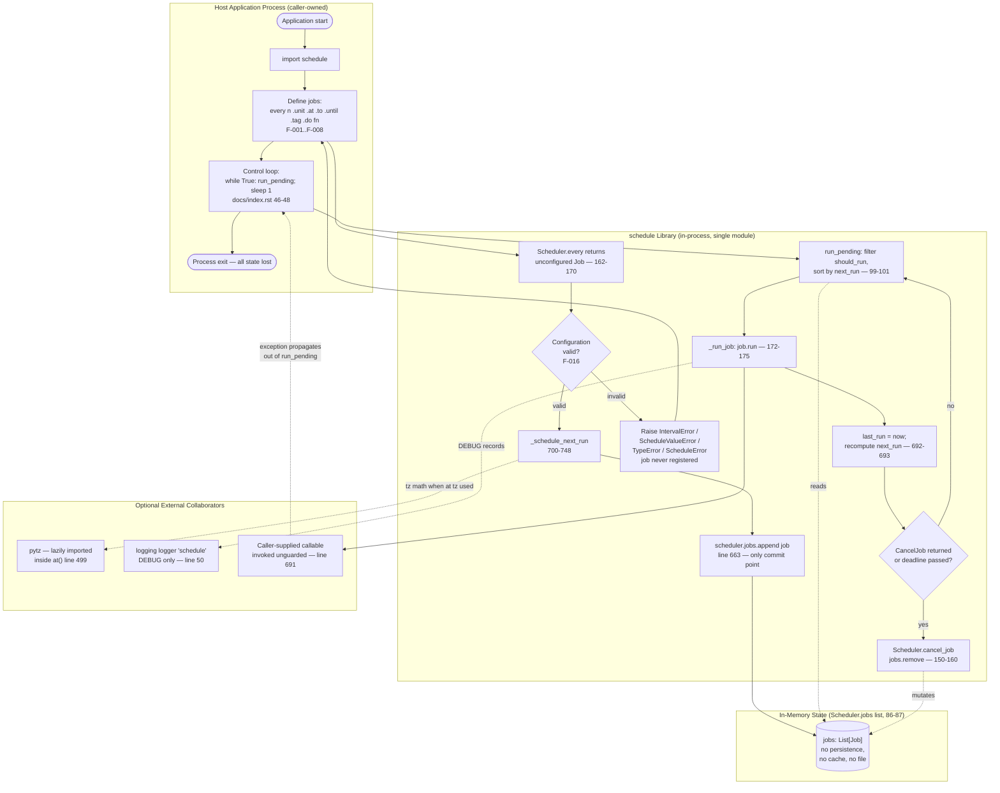
```mermaid
flowchart TD
    subgraph HostApp["Host Application Process (caller-owned)"]
        HStart([Application start]) --> HImport["import schedule"]
        HImport --> HDefine["Define jobs:<br/>every n .unit .at .to .until .tag .do fn<br/>F-001..F-008"]
        HDefine --> HLoop["Control loop:<br/>while True: run_pending; sleep 1<br/>docs/index.rst 46-48"]
        HLoop --> HExit([Process exit — all state lost])
    end
    subgraph Library["schedule Library (in-process, single module)"]
        LFactory["Scheduler.every returns<br/>unconfigured Job — 162-170"]
        LValidate{"Configuration<br/>valid?<br/>F-016"}
        LCompute["_schedule_next_run<br/>700-748"]
        LRegister["scheduler.jobs.append job<br/>line 663 — only commit point"]
        LSelect["run_pending: filter should_run,<br/>sort by next_run — 99-101"]
        LDispatch["_run_job: job.run — 172-175"]
        LReschedule["last_run = now;<br/>recompute next_run — 692-693"]
        LCancelCheck{"CancelJob returned<br/>or deadline passed?"}
        LRemove["Scheduler.cancel_job<br/>jobs.remove — 150-160"]
        LFactory --> LValidate
        LValidate -->|"invalid"| LRaise["Raise IntervalError /<br/>ScheduleValueError /<br/>TypeError / ScheduleError<br/>job never registered"]
        LValidate -->|"valid"| LCompute
        LCompute --> LRegister
        LSelect --> LDispatch
        LDispatch --> LReschedule
        LReschedule --> LCancelCheck
        LCancelCheck -->|"yes"| LRemove
        LCancelCheck -->|"no"| LSelect
    end
    subgraph Registry["In-Memory State (Scheduler.jobs list, 86-87)"]
        RJobs[("jobs: List[Job]<br/>no persistence,<br/>no cache, no file")]
    end
    subgraph External["Optional External Collaborators"]
        EPytz["pytz — lazily imported<br/>inside at() line 499"]
        ELogger["logging logger 'schedule'<br/>DEBUG only — line 50"]
        ECallable["Caller-supplied callable<br/>invoked unguarded — line 691"]
    end
    HDefine --> LFactory
    HLoop --> LSelect
    LRegister --> RJobs
    LSelect -.->|"reads"| RJobs
    LRemove -.->|"mutates"| RJobs
    LCompute -.->|"tz math when at tz used"| EPytz
    LDispatch -.->|"DEBUG records"| ELogger
    LDispatch --> ECallable
    ECallable -.->|"exception propagates<br/>out of run_pending"| HLoop
    LRaise --> HDefine
```

Three properties of this high-level flow drive everything that follows. First, the library never owns a thread — the arrow from `HLoop` into `LSelect` is a plain function call, so all execution latency is the caller's cadence. Second, the only writable state is the `jobs` list created at `schedule/__init__.py` lines 86–87; the process-exit terminal is therefore a total loss of schedule state. Third, the failure edge from the callable returns to the host loop rather than to the library, because `Job.run()` invokes `self.job_func()` at line 691 with no exception guard.

#### 4.1.1.2 Job Definition Journey (F-001 – F-008)

Definition is a fluent builder chain. Every intermediate call mutates and returns the same `Job` instance, and the chain has exactly one commit point: `scheduler.jobs.append(self)` at line 663. Any validation failure before that line leaves the registry untouched, which is the mechanism behind `test_misconfigured_job_wont_break_scheduler` (`test_schedule.py` 1591–1599).

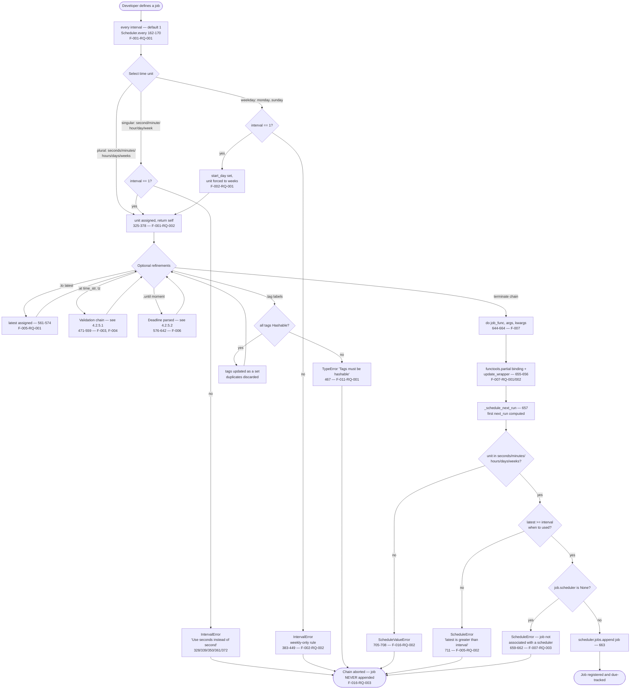
```mermaid
flowchart TD
    DevStart([Developer defines a job]) --> Every["every interval — default 1<br/>Scheduler.every 162-170<br/>F-001-RQ-001"]
    Every --> UnitChoice{"Select time unit"}
    UnitChoice -->|"plural: seconds/minutes/<br/>hours/days/weeks"| SetUnit["unit assigned, return self<br/>325-378 — F-001-RQ-002"]
    UnitChoice -->|"singular: second/minute/<br/>hour/day/week"| SingularGate{"interval == 1?"}
    SingularGate -->|"no"| ErrInterval["IntervalError<br/>'Use seconds instead of second'<br/>328/339/350/361/372"]
    SingularGate -->|"yes"| SetUnit
    UnitChoice -->|"weekday: monday..sunday"| WeekdayGate{"interval == 1?"}
    WeekdayGate -->|"no"| ErrWeekday["IntervalError<br/>weekly-only rule<br/>383-449 — F-002-RQ-002"]
    WeekdayGate -->|"yes"| SetStartDay["start_day set,<br/>unit forced to weeks<br/>F-002-RQ-001"]
    SetStartDay --> SetUnit
    SetUnit --> Refine{"Optional refinements"}
    Refine -->|".to latest"| ToStep["latest assigned — 561-574<br/>F-005-RQ-001"]
    Refine -->|".at time_str, tz"| AtStep["Validation chain — see 4.2.5.1<br/>471-559 — F-003, F-004"]
    Refine -->|".until moment"| UntilStep["Deadline parsed — see 4.2.5.2<br/>576-642 — F-006"]
    Refine -->|".tag labels"| TagStep{"all tags Hashable?"}
    TagStep -->|"no"| ErrTag["TypeError 'Tags must be hashable'<br/>467 — F-011-RQ-001"]
    TagStep -->|"yes"| TagSet["tags updated as a set<br/>duplicates discarded"]
    ToStep --> Refine
    AtStep --> Refine
    UntilStep --> Refine
    TagSet --> Refine
    Refine -->|"terminate chain"| DoCall["do job_func, args, kwargs<br/>644-664 — F-007"]
    DoCall --> Bind["functools.partial binding +<br/>update_wrapper — 655-656<br/>F-007-RQ-001/002"]
    Bind --> FirstCompute["_schedule_next_run — 657<br/>first next_run computed"]
    FirstCompute --> UnitValid{"unit in seconds/minutes/<br/>hours/days/weeks?"}
    UnitValid -->|"no"| ErrUnit["ScheduleValueError<br/>705-708 — F-016-RQ-002"]
    UnitValid -->|"yes"| LatestValid{"latest >= interval<br/>when to used?"}
    LatestValid -->|"no"| ErrLatest["ScheduleError<br/>'latest is greater than interval'<br/>711 — F-005-RQ-002"]
    LatestValid -->|"yes"| SchedulerBound{"job.scheduler is None?"}
    SchedulerBound -->|"yes"| ErrNoSched["ScheduleError — job not<br/>associated with a scheduler<br/>659-662 — F-007-RQ-003"]
    SchedulerBound -->|"no"| Append["scheduler.jobs.append job — 663"]
    Append --> Registered([Job registered and due-tracked])
    ErrInterval --> Abandoned([Chain aborted — job NEVER appended<br/>F-016-RQ-003])
    ErrWeekday --> Abandoned
    ErrTag --> Abandoned
    ErrUnit --> Abandoned
    ErrLatest --> Abandoned
    ErrNoSched --> Abandoned
```

The ordering in the diagram is load-bearing. `do()` performs binding (line 655), then computation (line 657), then the scheduler-presence check (lines 658–662), and only then registration (line 663) — so a job whose unit was never set raises `ScheduleValueError` from `_schedule_next_run` before it can ever enter the registry.

#### 4.1.1.3 Poll and Dispatch Cycle (F-009)

`Scheduler.run_pending()` is the workhorse. It is a single synchronous pass with three phases — filter, sort, dispatch — and it deliberately performs no catch-up: the docstring at lines 93–97 states that a per-minute job polled hourly runs once, not sixty times. `test_run_pending` (`test_schedule.py` 1387–1425) asserts exactly that with a call-count progression of 0 → 1 → 2 → 3 → 4 across widening time jumps, and direct execution in the checkout confirms that a one-second job left 300 seconds overdue is invoked exactly once.

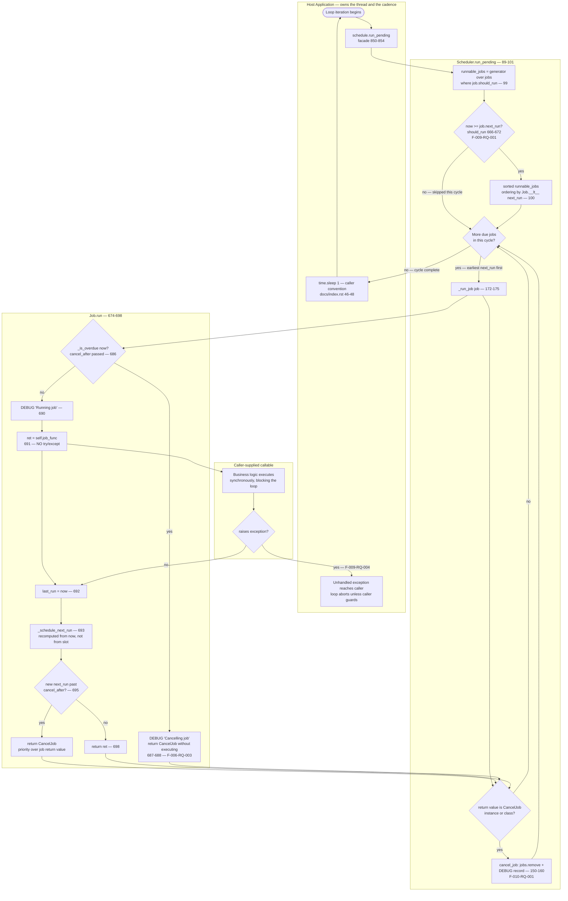
```mermaid
flowchart TD
    subgraph HostLoop["Host Application — owns the thread and the cadence"]
        TickStart([Loop iteration begins]) --> CallRun["schedule.run_pending<br/>facade 850-854"]
        SleepStep["time.sleep 1 — caller convention<br/>docs/index.rst 46-48"] --> TickStart
        Propagate["Unhandled exception reaches caller<br/>loop aborts unless caller guards"]
    end
    subgraph SchedulerLane["Scheduler.run_pending — 89-101"]
        Filter["runnable_jobs = generator over jobs<br/>where job.should_run — 99"]
        DueCheck{"now >= job.next_run?<br/>should_run 666-672<br/>F-009-RQ-001"}
        SortStep["sorted runnable_jobs<br/>ordering by Job.__lt__ next_run — 100"]
        NextJob{"More due jobs<br/>in this cycle?"}
        RunJobCall["_run_job job — 172-175"]
        Inspect{"return value is CancelJob<br/>instance or class?"}
        Remove["cancel_job: jobs.remove +<br/>DEBUG record — 150-160<br/>F-010-RQ-001"]
        Filter --> DueCheck
        DueCheck -->|"no — skipped this cycle"| NextJob
        DueCheck -->|"yes"| SortStep
        SortStep --> NextJob
        NextJob -->|"yes — earliest next_run first"| RunJobCall
        RunJobCall --> Inspect
        Inspect -->|"yes"| Remove
        Inspect -->|"no"| NextJob
        Remove --> NextJob
    end
    subgraph JobLane["Job.run — 674-698"]
        PreDeadline{"_is_overdue now?<br/>cancel_after passed — 686"}
        SkipRun["DEBUG 'Cancelling job'<br/>return CancelJob without executing<br/>687-688 — F-006-RQ-003"]
        LogRun["DEBUG 'Running job' — 690"]
        Invoke["ret = self.job_func<br/>691 — NO try/except"]
        Stamp["last_run = now — 692"]
        Recompute["_schedule_next_run — 693<br/>recomputed from now, not from slot"]
        PostDeadline{"new next_run past<br/>cancel_after? — 695"}
        ReturnCancel["return CancelJob<br/>priority over job return value"]
        ReturnValue["return ret — 698"]
        PreDeadline -->|"yes"| SkipRun
        PreDeadline -->|"no"| LogRun
        LogRun --> Invoke
        Invoke --> Stamp
        Stamp --> Recompute
        Recompute --> PostDeadline
        PostDeadline -->|"yes"| ReturnCancel
        PostDeadline -->|"no"| ReturnValue
    end
    subgraph CallableLane["Caller-supplied callable"]
        Body["Business logic executes<br/>synchronously, blocking the loop"]
        Raised{"raises exception?"}
        Body --> Raised
    end
    CallRun --> Filter
    NextJob -->|"no — cycle complete"| SleepStep
    RunJobCall --> PreDeadline
    Invoke --> Body
    Raised -->|"no"| Stamp
    Raised -->|"yes — F-009-RQ-004"| Propagate
    ReturnCancel --> Inspect
    ReturnValue --> Inspect
    SkipRun --> Inspect
```

Two dispatch behaviours were verified directly against the checkout. Ordering is by `next_run` ascending — with job A overdue by 5 seconds and job B overdue by 50 seconds, B executed first, which follows from `sorted(runnable_jobs)` at line 100 combined with `Job.__lt__` at lines 257–262. And because the callable runs inline at line 691, a job that blocks for *n* seconds delays every other job in the same cycle by *n* seconds; `docs/index.rst` line 65 states this plainly in bold: schedule does not account for the time a job takes to execute.

`Scheduler.run_all(delay_seconds=0)` (lines 103–120) is the forced-execution variant of the same cycle. It skips the `should_run` filter entirely, iterates a copy (`self.jobs[:]`, line 118) so that self-cancelling jobs cannot corrupt the iteration, and sleeps `delay_seconds` after **every** job including the last — measured at 0.40 s for two jobs with `delay_seconds=0.2`.

#### 4.1.1.4 Next-Run Computation (F-001 – F-005)

`_schedule_next_run()` runs twice per job generation: once at definition time from `do()` (line 657) and once immediately after each successful execution (line 693). It is the single point where interval arithmetic, weekday alignment, clock anchoring, jitter, and timezone correction meet.

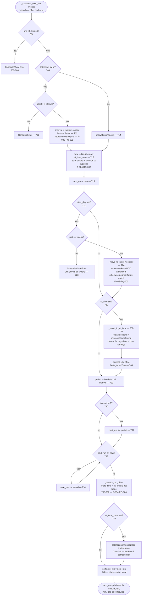
```mermaid
flowchart TD
    CStart([_schedule_next_run invoked<br/>from do or after each run]) --> UnitGate{"unit whitelisted?<br/>704"}
    UnitGate -->|"no"| CErrUnit["ScheduleValueError<br/>705-708"]
    UnitGate -->|"yes"| JitterGate{"latest set by to?<br/>709"}
    JitterGate -->|"yes"| RangeGate{"latest >= interval?"}
    RangeGate -->|"no"| CErrLatest["ScheduleError — 711"]
    RangeGate -->|"yes"| Draw["interval = random.randint<br/>interval, latest — 712<br/>redrawn every cycle — F-005-RQ-001"]
    JitterGate -->|"no"| UseFixed["interval unchanged — 714"]
    Draw --> NowStep
    UseFixed --> NowStep["now = datetime.now at_time_zone — 717<br/>zone-aware only when tz supplied<br/>F-004-RQ-003"]
    NowStep --> SeedStep["next_run = now — 719"]
    SeedStep --> WeekGate{"start_day set?<br/>721"}
    WeekGate -->|"yes"| WeekUnitGate{"unit == weeks?"}
    WeekUnitGate -->|"no"| CErrWeeks["ScheduleValueError<br/>'unit should be weeks' — 723"]
    WeekUnitGate -->|"yes"| MoveWeekday["_move_to_next_weekday — 724<br/>same weekday NOT advanced;<br/>otherwise nearest future match<br/>F-002-RQ-003"]
    WeekGate -->|"no"| AtGate
    MoveWeekday --> AtGate{"at_time set?<br/>726"}
    AtGate -->|"yes"| MoveAt["_move_to_at_time — 750-771<br/>replace second + microsecond always;<br/>minute for days/hours; hour for days"]
    MoveAt --> FixateOffset["_correct_utc_offset fixate_time=True — 769"]
    AtGate -->|"no"| PeriodStep
    FixateOffset --> PeriodStep["period = timedelta unit: interval — 729"]
    PeriodStep --> MultiGate{"interval != 1?<br/>730"}
    MultiGate -->|"yes"| AddOnce["next_run += period — 731"]
    MultiGate -->|"no"| AdvanceLoop
    AddOnce --> AdvanceLoop{"next_run <= now?<br/>733"}
    AdvanceLoop -->|"yes"| Advance["next_run += period — 734"]
    Advance --> AdvanceLoop
    AdvanceLoop -->|"no"| CorrectStep["_correct_utc_offset<br/>fixate_time = at_time is not None<br/>736-738 — F-004-RQ-004"]
    CorrectStep --> TzGate{"at_time_zone set?<br/>742"}
    TzGate -->|"yes"| ToLocal["astimezone then replace tzinfo=None<br/>744-746 — backward compatibility"]
    TzGate -->|"no"| Assign
    ToLocal --> Assign["self.next_run = next_run<br/>748 — always naive local"]
    Assign --> CEnd([next_run published for should_run,<br/>min, idle_seconds, repr])
```

Because the seed is `now` (line 717) rather than the previous scheduled slot, rescheduling is relative to completion time: a ten-second job that ran seven seconds late is next scheduled more than ten seconds after its previous target. This is the drift acknowledged in `docs/index.rst`. The randomized branch re-draws on every cycle — twenty consecutive draws of `every(5).to(10).seconds` produced all six possible values.

#### 4.1.1.5 UTC Offset and DST Correction (F-004)

`_correct_utc_offset()` (lines 773–817) is the deepest decision point in the library. It behaves as a no-op for naive jobs, as a `pytz` normalisation for interval jobs, and as a wall-clock-preserving correction for `at()`-anchored jobs — with an explicit best-effort branch for times that do not exist during a spring-forward gap.

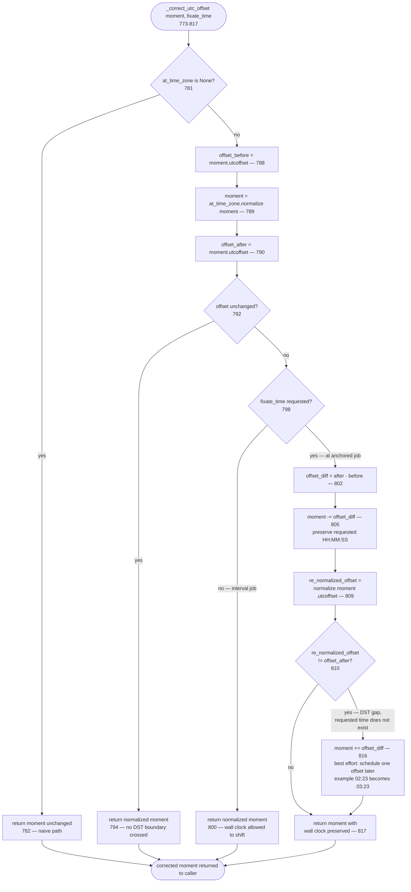
```mermaid
flowchart TD
    OStart([_correct_utc_offset moment, fixate_time<br/>773-817]) --> ZoneGate{"at_time_zone is None?<br/>781"}
    ZoneGate -->|"yes"| Passthrough["return moment unchanged<br/>782 — naive path"]
    ZoneGate -->|"no"| Before["offset_before = moment.utcoffset — 788"]
    Before --> Normalize["moment = at_time_zone.normalize moment — 789"]
    Normalize --> After["offset_after = moment.utcoffset — 790"]
    After --> SameGate{"offset unchanged?<br/>792"}
    SameGate -->|"yes"| ReturnNormal["return normalized moment<br/>794 — no DST boundary crossed"]
    SameGate -->|"no"| FixGate{"fixate_time requested?<br/>798"}
    FixGate -->|"no — interval job"| ReturnShifted["return normalized moment<br/>800 — wall clock allowed to shift"]
    FixGate -->|"yes — at anchored job"| Diff["offset_diff = after - before — 802"]
    Diff --> Restore["moment -= offset_diff — 805<br/>preserve requested HH:MM:SS"]
    Restore --> ReNorm["re_normalized_offset =<br/>normalize moment .utcoffset — 809"]
    ReNorm --> GapGate{"re_normalized_offset<br/>!= offset_after?<br/>810"}
    GapGate -->|"yes — DST gap,<br/>requested time does not exist"| BestEffort["moment += offset_diff — 816<br/>best effort: schedule one offset later<br/>example 02:23 becomes 03:23"]
    GapGate -->|"no"| ReturnFixed["return moment with<br/>wall clock preserved — 817"]
    BestEffort --> ReturnFixed
    Passthrough --> OEnd([corrected moment returned to caller])
    ReturnNormal --> OEnd
    ReturnShifted --> OEnd
    ReturnFixed --> OEnd
```

`docs/timezones.rst` documents the observable outcomes of these branches: a job at `02:30` in `Europe/Berlin` runs once at `03:30` during the spring-forward gap and then returns to `02:30`; during the autumn fold it runs only at the first `02:30`; and jobs **without** a timezone do not account for clock changes at all, so a four-hour interval can elapse in three real hours. Thirty `test_tz_*` methods plus seven `test_align_utc_offset_*` methods in `test_schedule.py` pin these behaviours, including six regression tests named after upstream issues 592, 605, and 608.

#### 4.1.1.6 Cancellation and Deadline Lifecycle (F-006, F-010)

Six distinct triggers remove a job from dispatch. Five are explicit code paths; the sixth is process exit, which is unschedulable state loss rather than an operation.

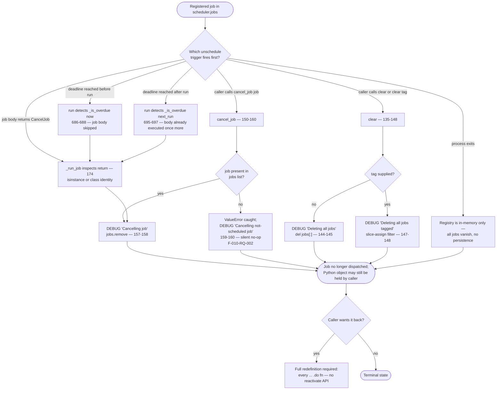
```mermaid
flowchart TD
    LStart([Registered job in scheduler.jobs]) --> Trigger{"Which unschedule<br/>trigger fires first?"}
    Trigger -->|"caller calls cancel_job job"| ExplicitPath["cancel_job — 150-160"]
    Trigger -->|"job body returns CancelJob"| SelfPath["_run_job inspects return — 174<br/>isinstance or class identity"]
    Trigger -->|"deadline reached before run"| PreDeadlinePath["run detects _is_overdue now<br/>686-688 — job body skipped"]
    Trigger -->|"deadline reached after run"| PostDeadlinePath["run detects _is_overdue next_run<br/>695-697 — body already executed once more"]
    Trigger -->|"caller calls clear or clear tag"| BulkPath["clear — 135-148"]
    Trigger -->|"process exits"| ProcessEnd["Registry is in-memory only —<br/>all jobs vanish, no persistence"]
    ExplicitPath --> Present{"job present in<br/>jobs list?"}
    Present -->|"yes"| RemoveOk["DEBUG 'Cancelling job'<br/>jobs.remove — 157-158"]
    Present -->|"no"| NoOp["ValueError caught;<br/>DEBUG 'Cancelling not-scheduled job'<br/>159-160 — silent no-op<br/>F-010-RQ-002"]
    SelfPath --> RemoveOk
    PreDeadlinePath --> SelfPath
    PostDeadlinePath --> SelfPath
    BulkPath --> BulkMode{"tag supplied?"}
    BulkMode -->|"no"| ClearAll["DEBUG 'Deleting all jobs'<br/>del jobs[:] — 144-145"]
    BulkMode -->|"yes"| ClearTag["DEBUG 'Deleting all jobs tagged'<br/>slice-assign filter — 147-148"]
    RemoveOk --> Gone([Job no longer dispatched;<br/>Python object may still be held by caller])
    NoOp --> Gone
    ClearAll --> Gone
    ClearTag --> Gone
    ProcessEnd --> Gone
    Gone --> Requeue{"Caller wants it back?"}
    Requeue -->|"yes"| Redefine["Full redefinition required:<br/>every ... .do fn — no reactivate API"]
    Requeue -->|"no"| LEnd([Terminal state])
```

`test_until_time` (`test_schedule.py` 312–390) exercises both deadline paths on the same job definition: a five-second job with a deadline of `11:35:20` created at `11:35:10` runs once at `11:35:15` and remains registered, runs a second time at `11:35:20` and is then removed because the new `next_run` exceeds the deadline, whereas jumping straight to `11:35:50` produces zero invocations and immediate removal.

#### 4.1.1.7 Tag-Based Job Management (F-011, F-012)

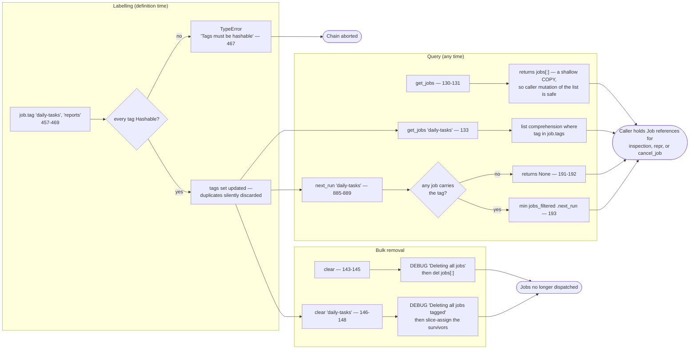
```mermaid
flowchart LR
    subgraph Label["Labelling (definition time)"]
        TagCall["job.tag 'daily-tasks', 'reports'<br/>457-469"] --> HashGate{"every tag Hashable?"}
        HashGate -->|"no"| TagErr["TypeError<br/>'Tags must be hashable' — 467"]
        HashGate -->|"yes"| TagStore["tags set updated —<br/>duplicates silently discarded"]
    end
    subgraph Query["Query (any time)"]
        GetAll["get_jobs — 130-131"] --> CopyAll["returns jobs[:] — a shallow COPY,<br/>so caller mutation of the list is safe"]
        GetTag["get_jobs 'daily-tasks' — 133"] --> FilterList["list comprehension where<br/>tag in job.tags"]
        NextTag["next_run 'daily-tasks' — 885-889"] --> FilterMin{"any job carries<br/>the tag?"}
        FilterMin -->|"no"| NoneOut["returns None — 191-192"]
        FilterMin -->|"yes"| MinOut["min jobs_filtered .next_run — 193"]
    end
    subgraph Bulk["Bulk removal"]
        ClearAllCall["clear — 143-145"] --> DelAll["DEBUG 'Deleting all jobs'<br/>then del jobs[:]"]
        ClearTagCall["clear 'daily-tasks' — 146-148"] --> DelTag["DEBUG 'Deleting all jobs tagged'<br/>then slice-assign the survivors"]
    end
    TagStore --> GetTag
    TagStore --> NextTag
    TagStore --> ClearTagCall
    CopyAll --> Outcome([Caller holds Job references for<br/>inspection, repr, or cancel_job])
    FilterList --> Outcome
    MinOut --> Outcome
    NoneOut --> Outcome
    DelAll --> Removed([Jobs no longer dispatched])
    DelTag --> Removed
    TagErr --> Aborted([Chain aborted])
```

Tags are the library's only grouping construct, and the same filter is reused by `get_next_run(tag)` at line 190 — which is why `next_run("unknown-tag")` returns `None` rather than raising.

#### 4.1.1.8 Decorator-Based Registration (F-008)

`repeat()` is a decorator factory whose `job` argument is an already-constructed `Job`. Because the argument is evaluated eagerly at decoration time, registration — and any validation failure — happens while the decorated module is being imported.

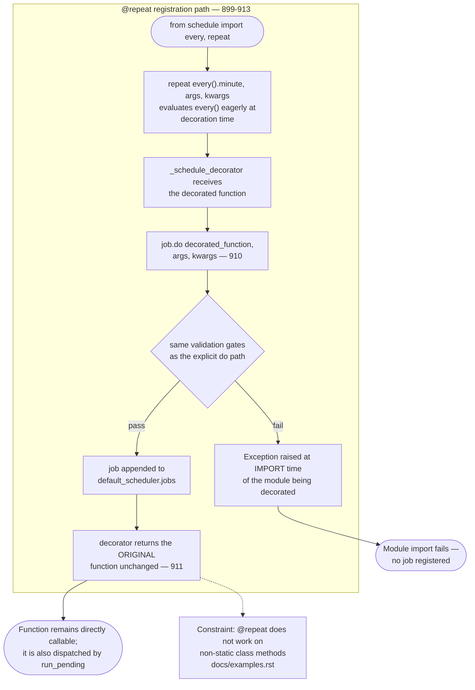
```mermaid
flowchart TD
    subgraph Decorator["@repeat registration path — 899-913"]
        RStart(["from schedule import every, repeat"]) --> RFactory["repeat every().minute, args, kwargs<br/>evaluates every() eagerly at<br/>decoration time"]
        RFactory --> RInner["_schedule_decorator receives<br/>the decorated function"]
        RInner --> RDo["job.do decorated_function,<br/>args, kwargs — 910"]
        RDo --> RGates{"same validation gates<br/>as the explicit do path"}
        RGates -->|"fail"| RRaise["Exception raised at IMPORT time<br/>of the module being decorated"]
        RGates -->|"pass"| RAppend["job appended to<br/>default_scheduler.jobs"]
        RAppend --> RReturn["decorator returns the ORIGINAL<br/>function unchanged — 911"]
    end
    RReturn --> RUsable(["Function remains directly callable;<br/>it is also dispatched by run_pending"])
    RRaise --> RFail(["Module import fails —<br/>no job registered"])
    RLimit["Constraint: @repeat does not work on<br/>non-static class methods<br/>docs/examples.rst"]
    RReturn -.-> RLimit
```

### 4.1.2 Integration Workflows

Section 2.3.3 enumerates the integration points as a table. This subsection renders each of them as a flow, and states which integration categories from the section prompt have no counterpart in this repository.

#### 4.1.2.1 Primary Integration Sequence — Host, Library, `pytz`, Logger, Callable

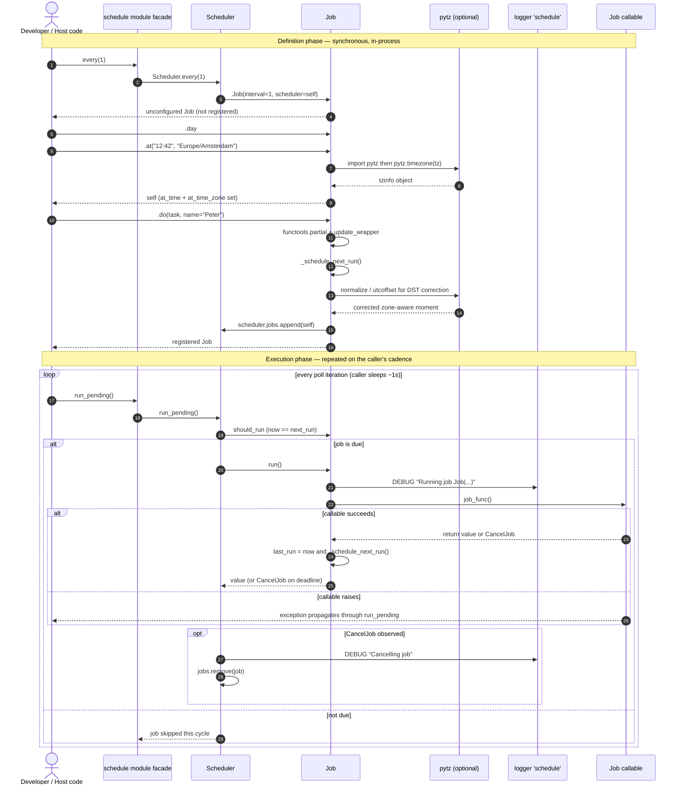
```mermaid
sequenceDiagram
    autonumber
    actor Dev as Developer / Host code
    participant Facade as schedule module facade
    participant Sched as Scheduler
    participant Job as Job
    participant Pytz as pytz (optional)
    participant Log as logger 'schedule'
    participant Fn as Job callable

    Note over Dev,Fn: Definition phase — synchronous, in-process
    Dev->>Facade: every(1)
    Facade->>Sched: Scheduler.every(1)
    Sched->>Job: Job(interval=1, scheduler=self)
    Job-->>Dev: unconfigured Job (not registered)
    Dev->>Job: .day
    Dev->>Job: .at("12:42", "Europe/Amsterdam")
    Job->>Pytz: import pytz then pytz.timezone(tz)
    Pytz-->>Job: tzinfo object
    Job-->>Dev: self (at_time + at_time_zone set)
    Dev->>Job: .do(task, name="Peter")
    Job->>Job: functools.partial + update_wrapper
    Job->>Job: _schedule_next_run()
    Job->>Pytz: normalize / utcoffset for DST correction
    Pytz-->>Job: corrected zone-aware moment
    Job->>Sched: scheduler.jobs.append(self)
    Job-->>Dev: registered Job

    Note over Dev,Fn: Execution phase — repeated on the caller's cadence
    loop every poll iteration (caller sleeps ~1s)
        Dev->>Facade: run_pending()
        Facade->>Sched: run_pending()
        Sched->>Job: should_run (now >= next_run)
        alt job is due
            Sched->>Job: run()
            Job->>Log: DEBUG "Running job Job(...)"
            Job->>Fn: job_func()
            alt callable succeeds
                Fn-->>Job: return value or CancelJob
                Job->>Job: last_run = now and _schedule_next_run()
                Job-->>Sched: value (or CancelJob on deadline)
            else callable raises
                Fn-->>Dev: exception propagates through run_pending
            end
            opt CancelJob observed
                Sched->>Log: DEBUG "Cancelling job"
                Sched->>Sched: jobs.remove(job)
            end
        else not due
            Sched-->>Facade: job skipped this cycle
        end
    end
```

The `pytz` interaction is the only third-party call in the runtime path, and it is confined to `Job.at()` and the correction helpers. The import itself is executed inside `at()` at line 499, so applications that never pass a timezone never import `pytz` — which is how `pyproject.toml` can declare `dependencies = []` while offering a `timezone = ["pytz"]` extra. When the extra is missing but a timezone is requested, the failure is a plain `ModuleNotFoundError`; `docs/faq.rst` documents `pip install pytz` as the resolution.

#### 4.1.2.2 Background Execution — Caller-Owned Thread

`docs/background-execution.rst` line 4 states that running the schedule in the background is not possible out of the box, then publishes the pattern the caller should implement. The library contributes nothing to this flow beyond `run_pending()`; the thread, the stop signal, and the cadence all belong to the host.

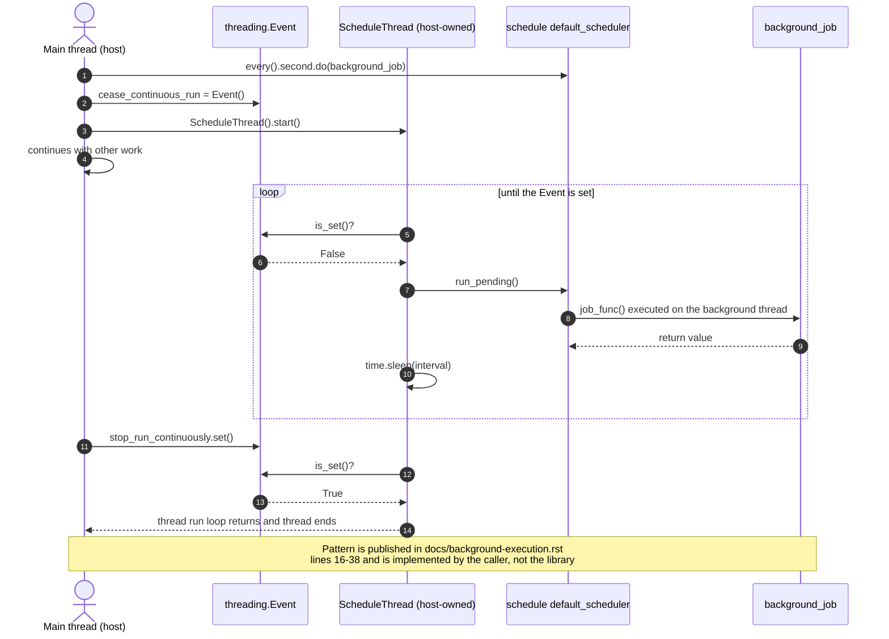
```mermaid
sequenceDiagram
    autonumber
    actor Main as Main thread (host)
    participant Ev as threading.Event
    participant Th as ScheduleThread (host-owned)
    participant Sched as schedule default_scheduler
    participant Fn as background_job

    Main->>Sched: every().second.do(background_job)
    Main->>Ev: cease_continuous_run = Event()
    Main->>Th: ScheduleThread().start()
    Main->>Main: continues with other work
    loop until the Event is set
        Th->>Ev: is_set()?
        Ev-->>Th: False
        Th->>Sched: run_pending()
        Sched->>Fn: job_func() executed on the background thread
        Fn-->>Sched: return value
        Th->>Th: time.sleep(interval)
    end
    Main->>Ev: stop_run_continuously.set()
    Th->>Ev: is_set()?
    Ev-->>Th: True
    Th-->>Main: thread run loop returns and thread ends
    Note over Main,Fn: Pattern is published in docs/background-execution.rst<br/>lines 16-38 and is implemented by the caller, not the library
```

Because the library contains no locking primitives — a grep of `schedule/__init__.py` finds no `threading`, `asyncio`, or lock construct — concurrent mutation of one `Scheduler` from several threads is unsynchronised, and the documentation offers no such pattern.

#### 4.1.2.3 Event and Queue Processing — Producer/Consumer Hand-Off

The closest thing to event processing in this repository is the queue pattern in `docs/parallel-execution.rst` lines 43–62, where the scheduled job body is `jobqueue.put` and the real work happens on a worker thread. The scheduler becomes a pure producer and its cycle time becomes independent of job duration.

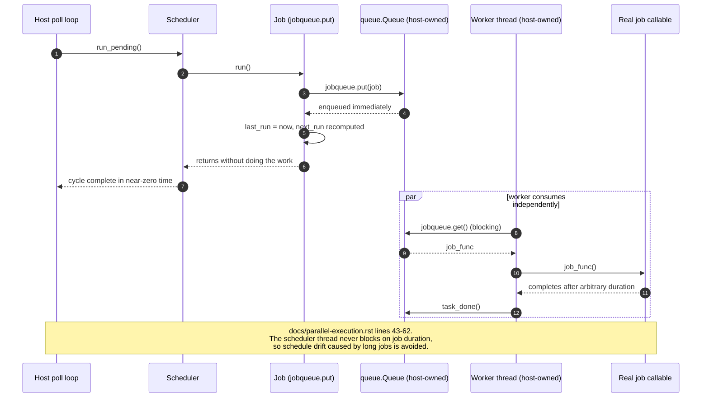
```mermaid
sequenceDiagram
    autonumber
    participant HLoop as Host poll loop
    participant Sched as Scheduler
    participant JobA as Job (jobqueue.put)
    participant Q as queue.Queue (host-owned)
    participant W as Worker thread (host-owned)
    participant Fn as Real job callable

    HLoop->>Sched: run_pending()
    Sched->>JobA: run()
    JobA->>Q: jobqueue.put(job)
    Q-->>JobA: enqueued immediately
    JobA->>JobA: last_run = now, next_run recomputed
    JobA-->>Sched: returns without doing the work
    Sched-->>HLoop: cycle complete in near-zero time
    par worker consumes independently
        W->>Q: jobqueue.get() (blocking)
        Q-->>W: job_func
        W->>Fn: job_func()
        Fn-->>W: completes after arbitrary duration
        W->>Q: task_done()
    end
    Note over HLoop,Fn: docs/parallel-execution.rst lines 43-62.<br/>The scheduler thread never blocks on job duration,<br/>so schedule drift caused by long jobs is avoided.
```

The same document also shows the lighter-weight variant `schedule.every(10).seconds.do(run_threaded, job)`, where the job body starts a fresh `threading.Thread` per occurrence, and notes that the queue model extends naturally to separate worker processes drawing from a distributed work queue.

#### 4.1.2.4 Multiple Independent Schedulers

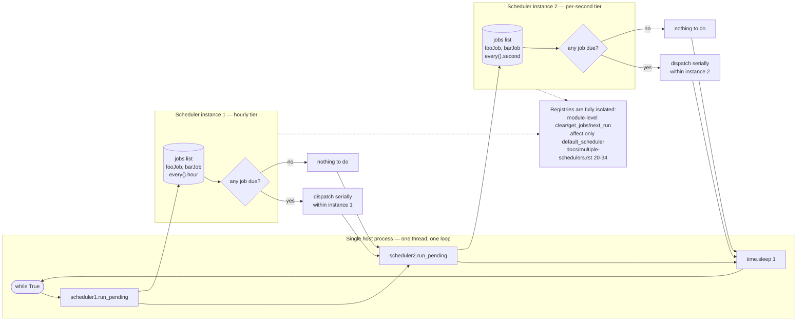
```mermaid
flowchart LR
    subgraph HostProc["Single host process — one thread, one loop"]
        LoopStart([while True]) --> S1Call["scheduler1.run_pending"]
        S1Call --> S2Call["scheduler2.run_pending"]
        S2Call --> Sleep["time.sleep 1"]
        Sleep --> LoopStart
    end
    subgraph Sched1["Scheduler instance 1 — hourly tier"]
        R1[("jobs list<br/>fooJob, barJob<br/>every().hour")]
        D1{"any job due?"}
        R1 --> D1
    end
    subgraph Sched2["Scheduler instance 2 — per-second tier"]
        R2[("jobs list<br/>fooJob, barJob<br/>every().second")]
        D2{"any job due?"}
        R2 --> D2
    end
    S1Call --> R1
    S2Call --> R2
    D1 -->|"yes"| E1["dispatch serially<br/>within instance 1"]
    D1 -->|"no"| Skip1["nothing to do"]
    D2 -->|"yes"| E2["dispatch serially<br/>within instance 2"]
    D2 -->|"no"| Skip2["nothing to do"]
    E1 --> S2Call
    Skip1 --> S2Call
    E2 --> Sleep
    Skip2 --> Sleep
    Note1["Registries are fully isolated:<br/>module-level clear/get_jobs/next_run<br/>affect only default_scheduler<br/>docs/multiple-schedulers.rst 20-34"]
    Sched1 -.-> Note1
    Sched2 -.-> Note1
```

`docs/multiple-schedulers.rst` line 32 carries the operational caveat as an inline comment in its own example: `run_pending` must be called on every scheduler. A missed call silently starves that instance's jobs, since nothing else drives them.

#### 4.1.2.5 Logging and Notification Integration (F-014)

```mermaid
sequenceDiagram
    autonumber
    actor Ops as Operator / host app
    participant Root as logging root config
    participant SL as Logger 'schedule'
    participant Sched as Scheduler
    participant Job as Job
    participant Sink as Handler / log sink

    Ops->>Root: logging.basicConfig()
    Ops->>SL: getLogger('schedule').setLevel(DEBUG)
    Note over SL,Sink: The library creates the logger at import (line 50)<br/>but never attaches a handler or sets a level
    Ops->>Sched: run_all()
    Sched->>SL: debug("Running *all* %i jobs with %is delay in between", n, delay)
    SL->>Sink: DEBUG record emitted
    Sched->>Job: _run_job(job)
    Job->>SL: debug("Running job %s", self)
    SL->>Sink: DEBUG record with Job __str__ rendering
    Job-->>Sched: return value
    Ops->>Sched: clear()
    Sched->>SL: debug("Deleting *all* jobs")
    SL->>Sink: DEBUG record emitted
    Note over Ops,Sink: Only DEBUG records exist — 8 emission sites total.<br/>There is no WARNING/ERROR path, no metric, and no alert hook,<br/>so failures are observed through the propagated exception instead.
```

The eight emission sites are lines 113–117 (`run_all` header), 144 and 147 (`clear`), 157 and 160 (`cancel_job` success and no-op), 687 and 696 (deadline cancellations), and 690 (job start). `docs/logging.rst` also publishes a `print_elapsed_time` decorator as the recommended way to obtain per-job duration telemetry, since the library measures nothing itself.

#### 4.1.2.6 Batch Processing Sequence — The Repository's Only Automated Pipeline

There is no runtime batch processor in this codebase. The only scheduled/automated batch sequence in the repository is the continuous-integration pipeline in `.github/workflows/ci.yml`, which fans out five jobs on every push and pull request against `master` and fans back in through the single `needs: test` dependency.

```mermaid
flowchart TD
    Trigger([push or pull_request<br/>targeting master]) --> Fanout{"GitHub Actions<br/>dispatches 5 jobs"}
    Fanout -->|"job: test<br/>matrix 3.7-3.12, max-parallel 6"| TestJob["checkout@v3 then setup-python@v4<br/>then pip install tox tox-gh-actions<br/>then tox"]
    TestJob --> ToxEnvs["tox-gh-actions expands each version to<br/>pyXX and pyXX-pytz — 12 environments"]
    ToxEnvs --> Pytest["py.test test_schedule.py schedule -v<br/>--cov schedule --cov-report term-missing"]
    Pytest --> PytestGate{"81 tests pass?"}
    PytestGate -->|"no"| Fail(["Workflow fails —<br/>merge blocked"])
    PytestGate -->|"yes"| Mypy["python -m mypy -p schedule<br/>--install-types --non-interactive"]
    Mypy --> MypyGate{"types clean?"}
    MypyGate -->|"no"| Fail
    MypyGate -->|"yes"| Cov["pip3 install coveralls then<br/>coveralls --service=github<br/>COVERALLS_PARALLEL=true"]
    Cov --> Finish["job: coveralls — needs: test<br/>coveralls --finish --service=github"]
    Fanout -->|"job: docs"| DocsJob["tox -e docs =<br/>sphinx-build -W -b html<br/>warnings are errors"]
    Fanout -->|"job: formatting"| FmtJob["tox -e format =<br/>black --check . (black==20.8b1)"]
    Fanout -->|"job: setuppy"| SetupJob["tox -e setuppy =<br/>setup.py check --strict<br/>--metadata --restructuredtext"]
    DocsJob --> DocsGate{"docs build clean?"}
    DocsGate -->|"no"| Fail
    DocsGate -->|"yes"| Pass
    FmtJob --> FmtGate{"formatting matches?"}
    FmtGate -->|"no"| Fail
    FmtGate -->|"yes"| Pass
    SetupJob --> SetupGate{"metadata and README valid?"}
    SetupGate -->|"no"| Fail
    SetupGate -->|"yes"| Pass
    Finish --> Pass(["All gates green —<br/>coverage summary posted"])
```

#### 4.1.2.7 Data Flow Summary and Absent Integration Categories

| Data flow | Direction | Carrier | Evidence |
|---|---|---|---|
| Job configuration | Host → library | Method arguments on the fluent chain | `schedule/__init__.py` 162–664 |
| Job registration | Library → in-memory registry | `list.append` | line 663 |
| Due-job selection | Registry → dispatcher | Generator + `sorted()` | lines 99–101 |
| Work invocation | Library → host callable | `functools.partial` call | line 691 |
| Cancellation signal | Host callable → library | `CancelJob` return value | lines 174–175 |
| Zone/DST data | `pytz` → library | `timezone()`, `normalize()`, `utcoffset()` | lines 499–508, 789–809 |
| Diagnostics | Library → `logging` | 8 `logger.debug` records | line 50 and emission sites |
| Introspection | Registry → host | `get_jobs`, `next_run`, `idle_seconds`, `repr` | lines 122–206, 264–323 |

The section prompt anticipates several integration categories that do not exist here, and their absence is verifiable rather than assumed. There is no API interaction of the network kind — no HTTP client or server, no socket, and no RPC construct appears anywhere in the module. There is no event bus, broker, or subscription mechanism; the only queue in the repository is the caller-owned `queue.Queue` in a documentation example. There is no data-flow-between-systems in the persistence sense, because no file, database, or serialization call exists in the runtime module. Section 2.3.3 records the same conclusion for the feature layer.


## 4.2 Flowchart Requirements

This subsection provides the structured metadata the section prompt requires for each workflow drawn in §4.1: explicit start and end points, the system boundary each step sits inside, every decision diamond, the user touchpoints, the error and recovery edges, and the timing characteristics. Workflows are referenced by the short identifiers below.

| ID | Workflow | Diagram location |
|---|---|---|
| WF-1 | High-level system workflow | §4.1.1.1 |
| WF-2 | Job definition journey | §4.1.1.2 |
| WF-3 | Poll and dispatch cycle | §4.1.1.3 |
| WF-4 | Next-run computation | §4.1.1.4 |
| WF-5 | UTC offset and DST correction | §4.1.1.5 |
| WF-6 | Cancellation and deadline lifecycle | §4.1.1.6 |
| WF-7 | Tag-based job management | §4.1.1.7 |
| WF-8 | Decorator-based registration | §4.1.1.8 |
| IN-1 | Primary integration sequence | §4.1.2.1 |
| IN-2 | Background execution | §4.1.2.2 |
| IN-3 | Queue producer/consumer hand-off | §4.1.2.3 |
| IN-4 | Multiple independent schedulers | §4.1.2.4 |
| IN-5 | Logging and notification | §4.1.2.5 |
| IN-6 | CI batch pipeline | §4.1.2.6 |

### 4.2.1 Start Points, End Points and System Boundaries

| Workflow | Start point | Terminal end points | Boundary crossed |
|---|---|---|---|
| WF-1 | Application start and `import schedule` | Process exit (all state lost) | Host process only — no external boundary |
| WF-2 | `Scheduler.every(interval)` (line 162) | `Registered` (append at 663) or `Abandoned` (any raise before 663) | Host code → library |
| WF-3 | Caller invokes `run_pending()` (line 850) | Cycle complete → caller sleeps; or exception escapes to caller | Library → caller callable → back to library |
| WF-4 | `_schedule_next_run()` entry (line 700) | `next_run` assigned (line 748) or a validation raise | Internal; crosses into `pytz` only when `at_time_zone` is set |
| WF-5 | `_correct_utc_offset()` entry (line 773) | Corrected moment returned (782, 794, 800, 817) | Library → `pytz` |
| WF-6 | Registered job in `scheduler.jobs` | `Gone` — dispatch stops; re-entry requires full redefinition | Host code and/or job return value → library |
| WF-7 | `tag()` at definition time | Caller holds `Job` references, or jobs removed | Host code → library |
| WF-8 | Module import evaluates `@repeat(every()...)` | Function registered and returned unchanged, or import fails | Import machinery → library |
| IN-1 | `every(1)` on the facade | Loop continues indefinitely on the caller's cadence | Host ↔ library ↔ `pytz` ↔ logging ↔ callable |
| IN-2 | `ScheduleThread().start()` in host code | `Event.set()` ends the thread's run loop | Host thread → library (unsynchronised) |
| IN-3 | `run_pending()` dispatches `jobqueue.put` | Worker completes the real work and calls `task_done()` | Library → host queue → host worker thread |
| IN-4 | `while True` over several `Scheduler` instances | Loop continues; each instance is independent | Host loop → N isolated registries |
| IN-5 | Host sets the `schedule` logger to DEBUG | Records delivered to the host's handlers | Library → `logging` → host sink |
| IN-6 | `push` or `pull_request` to `master` | All gates green, or workflow failure blocking merge | GitHub Actions → tox → pytest/mypy/Sphinx/black/setuptools → Coveralls |

The system boundary of the product itself is narrow and worth stating precisely: everything inside `schedule/__init__.py` is in scope, and the thread of control, the exception policy, the log sinks, the concurrency model, and any durability are all outside it. Section 1.3 records the same boundary at the scope level.

### 4.2.2 Decision Point Register

Every decision diamond drawn in §4.1 maps to a concrete branch in the source. The table below is the consolidated register.

| Workflow | Decision | Source and outcome |
|---|---|---|
| WF-2 | Singular unit used with `interval != 1`? | 326–372 → `IntervalError`, chain aborted |
| WF-2 | Weekday accessor with `interval != 1`? | 380–455 → `IntervalError`, chain aborted |
| WF-2 | All `tag()` arguments hashable? | 466–467 → `TypeError`, chain aborted |
| WF-2 | `job.scheduler is None` at `do()`? | 658–662 → `ScheduleError`, never registered |
| WF-3 | `now >= next_run` (`should_run`)? | 672 → job enters this cycle or is skipped entirely |
| WF-3 | More due jobs remaining in the cycle? | 100 → iterate in `next_run` order, else cycle ends |
| WF-3 | Return value is `CancelJob` (instance or class)? | 174 → `cancel_job()` or leave registered |
| WF-3 | Deadline already passed before running? | 686 → skip the body and return `CancelJob` |
| WF-3 | New `next_run` past the deadline after running? | 695 → return `CancelJob`, overriding the job's value |
| WF-4 | `unit` in the five-unit whitelist? | 704 → proceed or `ScheduleValueError` |
| WF-4 | `latest` set, and is `latest >= interval`? | 709–712 → draw `random.randint` or `ScheduleError` |
| WF-4 | `start_day` set, and is `unit == "weeks"`? | 721–723 → weekday alignment or `ScheduleValueError` |
| WF-4 | `at_time` set? | 726 → apply `_move_to_at_time` |
| WF-4 | `interval != 1`? | 730 → add one extra period before the advance loop |
| WF-4 | `next_run <= now`? | 733 → keep adding the period until strictly future |
| WF-4 | `at_time_zone` set? | 742 → convert to naive local before publishing |
| WF-5 | `at_time_zone is None`? | 781 → return unchanged |
| WF-5 | Offset changed by `normalize()`? | 792 → return, or continue to the fixate branch |
| WF-5 | `fixate_time` requested? | 798 → preserve wall clock, or accept the shift |
| WF-5 | Re-normalised offset differs (DST gap)? | 810 → shift one offset later as a best effort |
| WF-6 | Job present in the list when cancelled? | 156–160 → removal or silent no-op |
| WF-6 | `clear()` called with a tag? | 143–148 → delete all, or filter by tag |
| WF-7 | Any job carries the requested tag? | 191–193 → earliest `next_run`, or `None` |
| IN-2 | `Event.is_set()`? | Host-side loop guard in `docs/background-execution.rst` line 32 |
| IN-6 | Each gate: tests, mypy, docs, formatting, metadata | Any failure fails the workflow |

### 4.2.3 User Touchpoints, Error States and Recovery Paths

The only user interface is the Python API; there is no CLI, configuration file, admin console, or web interface anywhere in the repository. Touchpoints are therefore API calls, and the "user" is the developer or operator of the host application.

| Touchpoint | Surface | Workflow | Failure mode surfaced to the user |
|---|---|---|---|
| Define a schedule | `every` → unit → `at`/`to`/`until`/`tag` → `do` | WF-2 | `IntervalError`, `ScheduleValueError`, `TypeError`, `ScheduleError` at the call site |
| Register by decorator | `@repeat(every()...)` | WF-8 | Same exceptions, raised during module import |
| Drive the schedule | `run_pending()`, `run_all(delay_seconds)` | WF-3 | Any exception raised by the job body propagates here |
| Inspect the schedule | `get_jobs(tag)`, `next_run(tag)`, `idle_seconds()`, `repr(job)` | WF-7 | Returns `None`/empty rather than raising |
| Stop work | `cancel_job(job)`, `clear(tag)`, returning `CancelJob` | WF-6 | Cancelling an unknown job is a deliberate no-op |
| Observe behaviour | `logging.getLogger('schedule')` at DEBUG | IN-5 | Silence if the level is not lowered — the library adds no handler |

| Error state | Where it appears | Recovery path |
|---|---|---|
| Invalid configuration | WF-2, WF-4, WF-8 | Fix the chain and re-run it; the registry was never mutated, proven by `test_misconfigured_job_wont_break_scheduler` |
| Missing `pytz` | WF-5 via line 499 | `pip install pytz` per `docs/faq.rst`; only affects `at()` calls that pass a timezone |
| Unknown timezone name | `pytz.timezone()` at line 502 | Correct the IANA name; `pytz.exceptions.UnknownTimeZoneError` propagates unchanged |
| Non-existent wall-clock time (DST gap) | WF-5 line 810 | Automatic — the job is scheduled one offset later; no user action, no exception |
| Job body raises | WF-3 line 691 | Caller-side only: guard the loop, or wrap the callable with the `catch_exceptions` decorator from `docs/exception-handling.rst` |
| Deadline reached | WF-6 lines 686 and 695 | Automatic unschedule; re-arm by defining a new job with a new `until()` |
| Process restart | WF-1 terminal | Re-run the definition code — there is no persistence to restore from |

### 4.2.4 Timing and SLA Considerations

**No service-level agreement, timeout, watchdog, retry budget, or deadline for job bodies exists in this repository.** A search across all 32 tracked files for `timeout`, `sla`, `retry`, `backoff`, `watchdog`, and `circuit` returns no matches, and the only sleep in the runtime module is `time.sleep(delay_seconds)` at line 120, used solely to space out `run_all()`. What the code and documentation do establish is a set of timing *characteristics*, which the following table records exactly.

| Timing property | Value / behaviour | Evidence |
|---|---|---|
| Scheduling resolution | Whole seconds; `at()` accepts second precision, sub-second is a documented non-goal | `at()` regexes 513–527; `docs/index.rst` non-goals |
| Dispatch latency | Bounded by the caller's poll period, not by the library; the documented convention is `time.sleep(1)` | `docs/index.rst` 46–48; `README.rst` |
| Due-window semantics | `now >= next_run` — a job stays due indefinitely until it is polled | line 672 |
| Missed occurrences | Never replayed, regardless of how long the gap is | docstring 93–97; verified once-only execution after a 300 s gap |
| Serialisation cost | A job blocking for *n* seconds delays every later job in the same cycle by *n* seconds | inline call at line 691; `docs/index.rst` line 65 |
| Reschedule anchor | `now` at completion, not the intended slot — so execution time accumulates as drift | line 717; verified in the checkout |
| `run_all` spacing | `delay_seconds` is slept after every job including the last; total ≈ *n* × delay | line 120; measured 0.40 s for 2 jobs at 0.2 s |
| Exact-wait option | `idle_seconds()` returns the precise wait, negative when overdue, `None` when the registry is empty | 197–206; `test_idle_seconds` 1491 |
| Randomised spacing | `to()` re-draws uniformly in `[interval, latest]` on every reschedule | line 712; 20 draws covered all values 5–10 |
| DST gap handling | Best-effort shift of one UTC offset (for example 02:23 becomes 03:23) | 810–816; `docs/timezones.rst` |
| CI pipeline timing | No `timeout-minutes` is configured on any job; up to 6 matrix entries run in parallel | `.github/workflows/ci.yml` line 15 |
| Test suite duration | The 81-test suite completes in well under a second locally | measured `81 passed` on Python 3.12.3 |

The interaction of poll cadence, serial execution, and duration-induced drift is what a reader most often needs to reason about. The gantt below shows a two-second job and a three-second blocking job sharing one loop.

```mermaid
gantt
    title Poll cadence, dispatch latency and duration-induced drift
    dateFormat HH:mm:ss
    axisFormat %H:%M:%S
    section Host loop
    Tick 1 run_pending      :t1, 12:00:00, 1s
    Sleep 1s after tick 1   :t2, after t1, 1s
    Tick 2 run_pending      :t3, after t2, 1s
    Sleep 1s after tick 2   :t4, after t3, 1s
    Tick 3 run_pending      :t5, after t4, 1s
    section Job A every 2s
    Waits until due 12:00:02   :a0, 12:00:00, 2s
    Executes on tick 2         :a1, after a0, 1s
    Next run recomputed from now :a2, after a1, 2s
    section Job B blocking 3s
    Queued behind Job A        :b1, 12:00:03, 1s
    Blocks the loop 3s         :b2, after b1, 3s
    Next run drifts by run time :b3, after b2, 2s
```

Callers who need the tightest achievable latency without busy-waiting use the `idle_seconds()` loop published in `docs/examples.rst`, which also gives the loop a clean exit when the registry drains.

```mermaid
flowchart TD
    IStart([Host chooses the precise-wait loop<br/>docs/examples.rst]) --> Query["n = schedule.idle_seconds<br/>197-206"]
    Query --> NoneGate{"n is None?"}
    NoneGate -->|"yes — registry empty"| Break(["break — no jobs remain,<br/>loop exits cleanly"])
    NoneGate -->|"no"| SignGate{"n > 0?"}
    SignGate -->|"yes"| SleepExact["time.sleep n —<br/>wakes exactly at next_run"]
    SignGate -->|"no — n is negative,<br/>work is already overdue"| NoSleep["skip sleeping"]
    SleepExact --> Dispatch["schedule.run_pending"]
    NoSleep --> Dispatch
    Dispatch --> Requery{"jobs still registered?"}
    Requery -->|"yes"| Query
    Requery -->|"no"| Break
```

### 4.2.5 Validation Rules

All validation in this library is **fail-fast and definition-time**. There is no runtime validation of job results, no schema, and no sanitisation of the values a job returns — the only value the library interprets from a job body is the `CancelJob` sentinel.

#### 4.2.5.1 Data Validation — the `at()` Clock and Timezone Chain

`Job.at()` applies six gates in a fixed order. The order matters because an earlier gate can mask a later one: the unit gate fires before the timezone is resolved, and the timezone is resolved before the time string is even type-checked.

```mermaid
flowchart TD
    VStart([".at time_str, tz called<br/>471-559"]) --> G1{"unit in days/hours/minutes<br/>OR start_day set?<br/>493"}
    G1 -->|"no"| E1["ScheduleValueError<br/>'Invalid unit valid units are<br/>days, hours, and minutes'<br/>494-496 — F-003-RQ-001"]
    G1 -->|"yes"| G2{"tz argument supplied?<br/>498"}
    G2 -->|"yes"| Lazy["import pytz — line 499<br/>F-004-RQ-002"]
    Lazy --> G3{"tz type?"}
    G3 -->|"str"| Resolve["pytz.timezone tz — 502"]
    Resolve --> G3b{"zone known to pytz?"}
    G3b -->|"no"| E2["pytz.exceptions.<br/>UnknownTimeZoneError<br/>propagates to caller"]
    G3b -->|"yes"| StoreTz["at_time_zone assigned"]
    G3 -->|"pytz.BaseTzInfo"| StoreTz
    G3 -->|"other type"| E3["ScheduleValueError<br/>'Timezone must be string or<br/>pytz.timezone object' — 506-508"]
    G2 -->|"no"| G4
    StoreTz --> G4{"time_str is a str?<br/>510"}
    G4 -->|"no"| E4["TypeError<br/>'at should be passed a string'<br/>511 — F-003-RQ-003"]
    G4 -->|"yes"| G5{"which unit governs<br/>the format?"}
    G5 -->|"days or start_day"| R1{"matches<br/>^[0-2]d:[0-5]d optional :[0-5]d$<br/>513"}
    R1 -->|"no"| E5["ScheduleValueError — daily format<br/>is HH:MM optional :SS — 514-516"]
    R1 -->|"yes"| P1["split tokens; hour must be<br/>0..23 else ScheduleValueError<br/>544-549"]
    G5 -->|"hours"| R2{"matches<br/>^ optional MM :[0-5]d$<br/>518"}
    R2 -->|"no"| E6["ScheduleValueError — hourly format<br/>is MM optional :SS — 519-521"]
    R2 -->|"yes"| P2["hour forced to 0 — 551"]
    G5 -->|"minutes"| R3{"matches ^:[0-5]d$<br/>524"}
    R3 -->|"no"| E7["ScheduleValueError — minutely<br/>format is :SS — 525-527"]
    R3 -->|"yes"| P3["hour and minute forced to 0<br/>552-554"]
    P1 --> Build["at_time = datetime.time<br/>hour, minute, second — 558<br/>F-003-RQ-004"]
    P2 --> Build
    P3 --> Build
    Build --> VEnd([return self — chain continues])
    E1 --> VAbort([Job never registered])
    E2 --> VAbort
    E3 --> VAbort
    E4 --> VAbort
    E5 --> VAbort
    E6 --> VAbort
    E7 --> VAbort
```

| Unit | Pattern (line) | Accepted in tests | Rejected in tests |
|---|---|---|---|
| `days` / weekday | `^[0-2]\d:[0-5]\d(:[0-5]\d)?$` (513) | `"10:30"`, `"20:59"`, `"10:30:50"` | `"2:30:000001"`, `"::2"`, `".2"`, `"2"`, `":2"`, `" 2:30:00"`, `"59:59"` |
| `hours` | `^([0-5]\d)?:[0-5]\d$` (518) | `":30"`, `":10"`, `":00"`, `"30:05"`, `"10:25"`, `"00:40"` | `"2:30:00"`, `"::2"`, `".2"`, `"2"`, `" 2:30"`, `"61:00"`, `"00:61"`, `"01:61"` |
| `minutes` | `^:[0-5]\d$` (524) | `":40"`, `":10"` | `"::2"`, `".2"`, `"2"`, `"2:30:00"`, `"2:30"`, `" :30"` |
| any | non-string argument (510) | — | `at(2)` raises `TypeError` for all three units |

The accepted and rejected sets above are taken verbatim from `test_at_time` (`test_schedule.py` 268–310), `test_at_time_hour` (411–443) and `test_at_time_minute` (445–461). Note the leading-space rejections: the patterns are anchored, so whitespace is never tolerated. Beyond the regex, the day/weekday path additionally range-checks the hour against 0–23 at lines 544–549, which is what rejects `"25:00:00"` even though the pattern's `[0-2]\d` would admit it.

#### 4.2.5.2 Data Validation — the `until()` Deadline Chain

```mermaid
flowchart TD
    UStart([".until until_time called<br/>576-642"]) --> UType{"argument type?<br/>605-637"}
    UType -->|"datetime.datetime"| UD["cancel_after = value — 606"]
    UType -->|"datetime.timedelta"| UT["cancel_after = now + delta — 608"]
    UType -->|"datetime.time"| UTime["cancel_after = combine today, time<br/>610-612"]
    UType -->|"str"| UStr["_decode_datetimestr over 5 formats:<br/>Y-m-d H:M:S, Y-m-d H:M, Y-m-d,<br/>H:M:S, H:M — 614-623"]
    UType -->|"anything else"| UErrType["TypeError — until takes str,<br/>datetime, timedelta or time<br/>634-637 — F-006-RQ-002"]
    UStr --> UParsed{"any format matched?"}
    UParsed -->|"no"| UErrStr["ScheduleValueError<br/>'Invalid string format for until'<br/>625"]
    UParsed -->|"yes"| UDateOnly{"string contains a dash?<br/>626"}
    UDateOnly -->|"no — time-only input"| UToday["date replaced with today<br/>629-631"]
    UDateOnly -->|"yes"| UKeep["parsed date retained"]
    UToday --> UAssign["cancel_after assigned — 632"]
    UKeep --> UAssign
    UD --> UPast
    UT --> UPast
    UTime --> UPast
    UAssign --> UPast{"cancel_after < now?<br/>638"}
    UPast -->|"yes"| UErrPast["ScheduleValueError<br/>'Cannot schedule a job to run<br/>until a time in the past' — 639-641"]
    UPast -->|"no"| UOk([return self — deadline armed])
    UErrType --> UAbort([Job never registered])
    UErrStr --> UAbort
    UErrPast --> UAbort
```

| Input | Result | Evidence |
|---|---|---|
| `datetime(3000,1,1,20,30)` | `cancel_after` set verbatim | `test_until_time` 316–320 |
| `time(12,30)` / `time(12,30,50)` | Date set to today, seconds honoured | 322–327 |
| `timedelta(days=40,hours=5,minutes=12,seconds=42)` | `now + delta` → `2020-02-10 15:12:42` under the mocked clock | 330–332 |
| `"10:30"`, `"10:30:50"` | Time-only → today's date | 334–339 |
| `"3000-01-01 10:30"`, `"3000-01-01 10:30:50"` | Full timestamp retained | 340–345 |
| `123` | `TypeError` | 350 |
| `"123"`, `"01-01-3000"` | `ScheduleValueError` — no format matched | 351–352 |
| Past `datetime`, `timedelta(minutes=-1)`, one hour ago | `ScheduleValueError` — past deadline | 355–364 |

#### 4.2.5.3 Business Rules by Workflow Step

These are the domain rules the library enforces, expressed as rules rather than as code.

| Rule | Enforced at | Consequence if violated |
|---|---|---|
| A job must declare exactly one time unit before it can be registered | `_schedule_next_run` whitelist, line 704 | `ScheduleValueError`; `every().do(fn)` cannot register |
| Singular unit aliases are reserved for `interval == 1` | 326–372 | `IntervalError` naming the plural form to use |
| Weekday scheduling is weekly-only — "every 2 or more weeks" is unsupported | 380–455 | `IntervalError` with the explicit weekly-only message |
| A `start_day` is only meaningful with the `weeks` unit | 721–723 | `ScheduleValueError` (`unit` should be `weeks`) |
| Only day, hour and minute jobs (or weekday jobs) may be clock-anchored | 493–496 | `ScheduleValueError` listing the valid units |
| Timezones are configurable only through `at()` | `at()` signature, line 471 | No other API accepts a zone; `docs/timezones.rst` states the restriction |
| A randomised range must be non-inverted (`latest >= interval`) | 709–711 | `ScheduleError` |
| A deadline must lie in the future at definition time | 638–641 | `ScheduleValueError` |
| A deadline suppresses execution rather than truncating it — the body is skipped once the moment has passed | 686–688 | Job returns `CancelJob` without running |
| Tags must be hashable | 466–467 | `TypeError`; duplicates are collapsed by the set |
| A job must be bound to a scheduler to be registered | 658–662 | `ScheduleError` |
| Registration is the last step, so invalid jobs never reach the registry | 657–663 | Scheduler integrity preserved (`test_misconfigured_job_wont_break_scheduler`) |
| Same weekday today is not skipped when computing the next weekly run | 924–927 | A Wednesday job defined on Wednesday can still run today |
| Public datetimes are naive local values | 742–746 | Zone-aware inputs are converted back before publication |
| Missed occurrences are never replayed | 99–101 and docstring 93–97 | At most one execution per job per poll cycle |
| Cancelling an unknown job is a no-op, not an error | 156–160 | Idempotent teardown |

#### 4.2.5.4 Authorization Checkpoints

There are **no authorization checkpoints in any workflow**, and this is a structural property rather than an oversight. `schedule/__init__.py` contains no authentication, authorization, credential, token, encryption, or permission logic — a case-insensitive search of the module for `auth`, `token`, `password`, `secret`, `credential`, and `encrypt` returns nothing. The library also has no notion of a user, a principal, a role, or a tenant: the `Job` field set defined at lines 227–255 carries only scheduling data, and the closest thing to a grouping key is the free-form `tags` set.

The practical consequence for architects is that **the trust boundary is the host process**. Any code able to import the module can register a job, cancel any job, or clear the entire registry, because `default_scheduler` is a module-level singleton (line 837) and `jobs` is a direct alias to its mutable list (line 840). Where isolation between logical tenants is required, the only mechanism the repository supports is separate `Scheduler()` instances (§4.1.2.4) — and even that is an organisational convention, not an enforced permission boundary. Section 1.3 records the absence of an authentication or authorization concept at the scope level.

#### 4.2.5.5 Regulatory Compliance Checks

No workflow performs a regulatory compliance check, and no such requirement is expressed anywhere in the repository: searches for `gdpr`, `hipaa`, `pci`, and `compliance` return no matches in the runtime module. The only compliance-relevant artifact in the tree is licensing — `LICENSE.txt` is the MIT License (Copyright © 2013 Daniel Bader), declared as `license = {text = "MIT License"}` in `pyproject.toml`, `license="MIT"` in `setup.py`, and via the `License :: OSI Approved :: MIT License` classifier. `docs/installation.rst` leans on that permissiveness when it notes that the library is a single MIT-licensed source file that may be vendored manually, while discouraging the practice.

Two data-handling facts matter for downstream compliance reviews, and both are properties of the flows already documented. First, the DEBUG records emitted at lines 113–117 and 690 render the job through `Job.__str__`, which includes the bound `args` and `kwargs`; any sensitive value passed to `do()` will therefore appear in logs whenever the host lowers the `schedule` logger to DEBUG. Second, nothing is ever written outside the process — there is no file, database, network, or serialization call in the module — so the library itself creates no data-at-rest obligation. Retention, residency, and redaction are entirely properties of the host application's logging configuration and of the job bodies it schedules.


## 4.3 Technical Implementation

### 4.3.1 State Management

#### 4.3.1.1 The Complete State Model

All state in this system lives in two places: the twelve instance attributes a `Job` assigns in `__init__` (lines 227–255) and the single list a `Scheduler` creates in `__init__` (lines 86–87). There is no other store, no module-level mutable state besides `default_scheduler` and its `jobs` alias, and no derived index or secondary structure.

| `Job` attribute | Type / default | Written by | Read by |
|---|---|---|---|
| `interval` | `int`, constructor argument | `every(interval)` | period arithmetic, `repr` |
| `latest` | `Optional[int]`, `None` | `to(latest)` (line 573) | jitter draw at 712 |
| `job_func` | `Optional[functools.partial]`, `None` | `do()` (655–656) | `run()` at 691, `__str__`/`__repr__` |
| `unit` | `Optional[str]`, `None` | unit and weekday properties (325–455) | whitelist at 704, `timedelta` key at 729 |
| `at_time` | `Optional[datetime.time]`, `None` | `at()` (558) | `_move_to_at_time`, `fixate_time` flag |
| `at_time_zone` | untyped, `None` | `at(tz=...)` (502–504) | `now` construction 717, `_correct_utc_offset` |
| `last_run` | `Optional[datetime]`, `None` | `run()` after a successful call (692) | `__repr__` timestats |
| `next_run` | `Optional[datetime]`, `None` | `_schedule_next_run()` (748) | `should_run`, `__lt__`, `min()`, `idle_seconds` |
| `start_day` | `Optional[str]`, `None` | weekday properties (380–455) | weekday alignment 721–724, `at()` unit gate |
| `cancel_after` | `Optional[datetime]`, `None` | `until()` (606–632) | `_is_overdue` (819–820) |
| `tags` | `Set[Hashable]`, empty set | `tag()` (469) | `get_jobs`, `clear`, `get_next_run` |
| `scheduler` | `Optional[Scheduler]`, constructor argument | `Scheduler.every()` (169) | registration guard 658–663 |

Two observations follow directly from this model. The `Job` is **mutable throughout its life** — `next_run` and `last_run` are rewritten in place on every execution — so a caller holding a `Job` reference always observes current values, which is what makes `repr(job)` a useful diagnostic. And `next_run` is the only piece of *derived* state: everything else is either configuration supplied by the caller or a timestamp of fact.

#### 4.3.1.2 Job State Transitions

```mermaid
stateDiagram-v2
    direction TB
    [*] --> Unconfigured : Scheduler.every(interval) — 162-170
    Unconfigured --> UnitBound : plural unit property sets unit — 325-378
    Unconfigured --> WeekdayBound : monday..sunday sets start_day + weeks — 380-455
    Unconfigured --> DefinitionFailed : IntervalError on singular unit or weekday with interval != 1
    UnitBound --> UnitBound : .to(latest) / .at(...) / .until(...) / .tag(...)
    WeekdayBound --> UnitBound : returns self.weeks
    UnitBound --> DefinitionFailed : ScheduleValueError / TypeError from at() or until()
    UnitBound --> Registered : .do(func) computes next_run then appends — 655-663
    UnitBound --> DefinitionFailed : ScheduleValueError on invalid unit, ScheduleError on latest or missing scheduler
    DefinitionFailed --> [*] : object garbage-collected, never in scheduler.jobs
    Registered --> Idle : next_run in the future
    Idle --> Due : wall clock reaches next_run (should_run True — 672)
    Due --> Idle : caller has not polled yet — no catch-up queue
    Due --> DeadlineExpired : _is_overdue(now) before execution — 686
    Due --> Running : Job.run invokes job_func — 691
    Running --> Rescheduled : last_run stamped, next_run recomputed — 692-693
    Running --> Faulted : callable raised — last_run and next_run unchanged
    Faulted --> Due : still overdue, retried on the next poll with no backoff
    Rescheduled --> Idle : new next_run inside deadline
    Rescheduled --> DeadlineExpired : new next_run past cancel_after — 695
    Rescheduled --> SelfCancelled : callable returned CancelJob — 174
    DeadlineExpired --> Unscheduled : _run_job calls cancel_job
    SelfCancelled --> Unscheduled : _run_job calls cancel_job
    Idle --> Unscheduled : caller invokes cancel_job / clear / clear(tag)
    Due --> Unscheduled : caller invokes cancel_job / clear / clear(tag)
    Unscheduled --> [*] : removed from scheduler.jobs, requires full redefinition
```

The `Due → Idle` self-loop is not an idle transition, it is the missed-run contract: the wall clock can pass many scheduled instants while the job sits in `Due`, and the job still executes only once when the caller finally polls. The `Faulted → Due` edge is equally important — a job whose callable raised is left exactly as it was, with stale `last_run` and `next_run`, so it re-qualifies as due immediately and is attempted again on the next cycle without any backoff, ceiling, or dead-letter state.

#### 4.3.1.3 Scheduler Registry State Transitions

```mermaid
stateDiagram-v2
    direction LR
    [*] --> Empty : Scheduler() — jobs = [] (86-87)
    Empty --> Populated : job.do(...) appends (663)
    Populated --> Populated : further do() appends / tag() mutations
    Populated --> Populated : run_pending or run_all mutate next_run and last_run in place
    Populated --> Populated : cancel_job removes one entry (158)
    Populated --> Empty : clear() executes del jobs[:] (145)
    Populated --> Populated : clear(tag) slice-assigns the surviving jobs (148)
    Populated --> Empty : last remaining job cancelled or self-cancelled
    Empty --> Empty : cancel_job on an unknown job — ValueError swallowed (159-160)
    Empty --> [*] : process exits — registry is memory-only, nothing is written or restored
    Populated --> [*] : process exits — every pending schedule is lost
```

#### 4.3.1.4 Data Persistence Points

**There are no persistence points.** The runtime module performs no file, database, or serialization operation of any kind: it imports only `collections.abc`, `datetime`, `functools`, `logging`, `random`, `re`, `time`, and `typing` (lines 41–48), and searches of the module for `open(`, `pickle`, `json`, `sqlite`, `shelve`, `dbm`, and `os.` return nothing. `docs/index.rst` lists job persistence first among the reasons to choose a different library.

| Candidate persistence concern | Actual behaviour |
|---|---|
| Schedule durability across restarts | None — the registry is rebuilt only by re-executing the definition code |
| Job execution history | Only `last_run` on the live object; overwritten on each run, never appended to a log of runs |
| Crash recovery / journaling | None — an interrupted process leaves no artifact to replay |
| Configuration storage | None — configuration is Python code; there is no config file format |
| External state hand-off | Only what a job body chooses to do; the queue pattern in `docs/parallel-execution.rst` is the documented way to move work to durable infrastructure |

Applications that require durability must therefore treat the definition code itself as the schedule's source of truth and re-establish it at start-up — which is precisely why `@repeat` (§4.1.1.8) registering at import time is a coherent design for this library.

#### 4.3.1.5 Caching Requirements

There is no cache. No `functools.lru_cache`, memoization decorator, TTL structure, or invalidation hook appears anywhere in the module. The only value that behaves cache-like is `next_run`: it is computed once per generation and then read many times by `should_run`, `__lt__`, `min()`, `idle_seconds`, and `__repr__`. Its invalidation rule is a single line — `_schedule_next_run()` recomputes and overwrites it at line 748 — and it is invoked in exactly two places, `do()` (line 657) and `run()` (line 693). Two consequences are worth recording:

- Mutating a job's configuration after registration does **not** refresh `next_run`; the new configuration only takes effect after the next execution recomputes it, because nothing observes attribute writes.
- `Scheduler.get_next_run()` and `idle_seconds` are computed on demand from the live list (lines 177–206) rather than maintained incrementally, so they are always consistent with the registry and never stale.

#### 4.3.1.6 Transaction Boundaries

The library provides no transactions and makes no atomicity claim; the boundaries below are the *effective* units of work implied by the code, and they matter because several of them are deliberately non-atomic.

| Unit of work | Boundary and guarantee | Failure behaviour |
|---|---|---|
| Job definition (`do()`) | Effectively atomic with respect to the registry: computation at 657 precedes the append at 663 | Any raise leaves the registry unchanged — the central integrity property of §4.1.1.2 |
| Single job execution (`Job.run()`) | **Not atomic.** Invocation (691), timestamping (692) and rescheduling (693) are three separate steps | A raise after side effects have occurred leaves the work done but the schedule un-advanced, so the same occurrence is attempted again |
| Poll cycle (`run_pending()`) | Not atomic. The due set is computed first (99) and then dispatched (100–101) | An exception mid-cycle abandons the remaining due jobs for that cycle; nothing is rolled back |
| Forced run (`run_all()`) | Not atomic; iterates a snapshot copy `self.jobs[:]` (118) | Earlier jobs stay executed; later jobs are never attempted |
| Cancellation (`cancel_job()`) | Single `list.remove` inside a `try` (156–160) | `ValueError` is swallowed, making the operation idempotent |
| Bulk clear | `del self.jobs[:]` (145) or one slice assignment (148) | No partial-clear path exists in the code |
| Cross-scheduler operations | No boundary at all — each `Scheduler` is independent | A failure while polling `scheduler1` prevents `scheduler2.run_pending()` from being reached in that iteration |

Because the module contains no locking primitive of any kind, none of these boundaries is protected against concurrent mutation. The library documents no thread-safety guarantee: `docs/parallel-execution.rst` and `docs/background-execution.rst` both hand thread ownership to the caller, and `docs/index.rst` lists concurrent execution as a non-goal. Applications that mutate one `Scheduler` from several threads must serialise that access themselves.

The most operationally significant line in the table is the second one. Since the timestamp and the reschedule happen *after* the callable returns, job bodies are effectively **at-least-once within a cycle** when they fail part-way through: any externally visible side effect that completed before the exception will be repeated on the retry. Idempotent job bodies, or the `cancel_on_failure` wrapper described below, are the two mitigations the repository documents.

### 4.3.2 Error Handling

#### 4.3.2.1 Error Taxonomy and Propagation

The library defines a three-level exception hierarchy at lines 53–68 — `ScheduleError` → `ScheduleValueError` → `IntervalError` — and raises from 28 sites: twelve `IntervalError`, eleven `ScheduleValueError`, three built-in `TypeError`, and two `ScheduleError`. Every one of them fires during **definition**. At **execution** time the library raises nothing of its own; it simply does not interfere with whatever the job body raises.

```mermaid
flowchart TD
    EStart([Error surfaces somewhere<br/>in the schedule flow]) --> Phase{"Which phase?"}
    Phase -->|"Definition time<br/>builder chain"| DefClass{"Which guard fired?"}
    DefClass -->|"interval rule<br/>328-449"| IntervalErr["IntervalError<br/>subclass of ScheduleValueError"]
    DefClass -->|"format, unit, timezone type,<br/>hour range, deadline<br/>494-547, 625-641, 705-723, 942"| ValueErr["ScheduleValueError<br/>subclass of ScheduleError"]
    DefClass -->|"wrong Python type<br/>467, 511, 634"| TypeErr["TypeError<br/>built-in, not in the hierarchy"]
    DefClass -->|"latest < interval 711,<br/>no scheduler bound 659"| SchedErr["ScheduleError<br/>hierarchy root"]
    IntervalErr --> DefOutcome["Exception raised to the definition<br/>call site; job never appended;<br/>scheduler untouched — F-016-RQ-003"]
    ValueErr --> DefOutcome
    TypeErr --> DefOutcome
    SchedErr --> DefOutcome
    DefOutcome --> DefRecover["Recovery: caller fixes the chain and<br/>re-runs it. Verified by<br/>test_misconfigured_job_wont_break_scheduler"]
    Phase -->|"Execution time<br/>inside job_func"| RunFault["Exception raised by the<br/>caller-supplied callable — line 691"]
    RunFault --> NoGuard["No try/except exists around<br/>line 691 — F-009-RQ-004"]
    NoGuard --> Consequence["last_run NOT stamped;<br/>next_run NOT recomputed;<br/>job stays registered and overdue"]
    Consequence --> Bubble["Exception propagates through<br/>_run_job then run_pending/run_all<br/>to the caller's loop"]
    Bubble --> LoopFate{"Does the caller<br/>guard the loop?"}
    LoopFate -->|"no"| LoopDies["Loop terminates; remaining due jobs<br/>in this cycle are never dispatched;<br/>whole schedule stops"]
    LoopFate -->|"yes — try/except<br/>around run_pending"| LoopSurvives["Loop continues; the failed job is<br/>retried on the next poll because it<br/>is still overdue — no backoff, no cap"]
    RunFault --> Wrapped{"Is the callable wrapped in the<br/>documented catch_exceptions<br/>decorator?"}
    Wrapped -->|"yes, cancel_on_failure=False"| Swallow["Traceback printed by the wrapper;<br/>run continues normally and the job<br/>is rescheduled"]
    Wrapped -->|"yes, cancel_on_failure=True"| SelfKill["Wrapper returns schedule.CancelJob;<br/>_run_job unschedules the job<br/>docs/exception-handling.rst 13-31"]
    Wrapped -->|"no"| NoGuard
    Phase -->|"Timezone resolution"| TzFault{"pytz importable?"}
    TzFault -->|"no"| ModErr["ModuleNotFoundError from line 499;<br/>resolution documented in docs/faq.rst<br/>as pip install pytz"]
    TzFault -->|"yes, unknown zone"| ZoneErr["pytz UnknownTimeZoneError<br/>from line 502"]
    ModErr --> DefOutcome
    ZoneErr --> DefOutcome
    Phase -->|"DST boundary"| DstFault["Requested wall-clock time does not<br/>exist in the target zone"]
    DstFault --> DstFallback["Best-effort fallback: schedule one<br/>offset later — 810-816<br/>no exception raised"]
    LoopSurvives --> EEnd([Steady state resumed])
    LoopDies --> EEnd
    Swallow --> EEnd
    SelfKill --> EEnd
    DefRecover --> EEnd
    DstFallback --> EEnd
```

`docs/exception-handling.rst` line 4 states the contract that the flowchart encodes: exceptions thrown during job execution bubble up and interrupt schedule's `run_xyz` function. Direct execution in the checkout confirms the full consequence chain — a `ZeroDivisionError` raised by a job body emerged from `run_pending()`, the job remained in the registry, and its timestamps were untouched.

Only two `try` blocks exist in the entire module, and neither guards user code: line 156 wraps `list.remove` to make cancellation idempotent, and line 826 wraps `strptime` so `_decode_datetimestr` can try five formats in turn.

#### 4.3.2.2 Retry Mechanisms

**No retry mechanism exists.** There is no attempt counter, no maximum-attempts setting, no exponential or jittered backoff, no dead-letter list, and no circuit breaker; a search across all tracked files for `retry`, `retries`, `backoff`, and `circuit` returns nothing.

What does exist is an emergent re-attempt behaviour that architects must not mistake for a retry policy:

| Property | Actual behaviour |
|---|---|
| Trigger | The job stays overdue because `next_run` was never advanced past the failure |
| Delay | None — it re-qualifies as due on the very next poll, so the effective interval becomes the caller's poll period |
| Attempt limit | None — it repeats for as long as the callable keeps failing |
| Jitter | Only if `to()` was configured, and only once a run *succeeds* and reaches line 693 |
| Prerequisite | The caller must have guarded its own loop; otherwise the first failure ends the loop and there is no re-attempt at all |
| Distinguishability | The library records nothing about the failure, so a failing job is indistinguishable from a healthy one in the registry |

The `to()` helper is worth calling out explicitly: `random.randint` at line 712 exists to spread load across occurrences, as `docs/examples.rst` describes, not to back off after errors.

#### 4.3.2.3 Fallback Processes

Three fallback behaviours are implemented, all narrow and all deterministic.

| Fallback | Trigger | Behaviour |
|---|---|---|
| DST-gap displacement | Requested wall-clock time does not exist in the target zone | Schedules one UTC offset later — the docstring's example is 02:23 becoming 03:23 (lines 810–816) |
| Multi-format deadline decoding | A `until()` string does not match the first format tried | Tries all five `strptime` formats in order, returning `None` only if every one fails (822–830) |
| Idempotent cancellation | `cancel_job()` on a job that is not registered | Swallows `ValueError` and logs a DEBUG record instead of raising (159–160) |

Everything else that might be expected to have a fallback does not have one: there is no alternative timezone provider if `pytz` is absent (the `ModuleNotFoundError` simply propagates — `zoneinfo` appears nowhere in the repository), no degraded mode if a job body fails, and no secondary scheduler to take over work.

#### 4.3.2.4 Error Notification Flows

Notification is limited to Python logging at a single level, and the library never notifies anyone about a job failure — the exception itself *is* the notification, delivered by propagation to the caller.

| Event | Notification | Level and site |
|---|---|---|
| `run_all` starting | Job count and delay | DEBUG, 113–117 |
| Job about to run | `Job.__str__` rendering | DEBUG, 690 |
| Job cancelled by deadline (pre- or post-run) | `Job.__str__` rendering | DEBUG, 687 and 696 |
| Job explicitly cancelled | `Job.__str__` rendering | DEBUG, 157 |
| Cancellation of an unknown job | Distinct "not-scheduled" message | DEBUG, 160 |
| All jobs cleared / tag cleared | Two distinct messages | DEBUG, 144 and 147 |
| **Job raised an exception** | **No log record at all** | — |
| **DST fallback applied** | **No log record at all** | — |

The library creates the logger at line 50 and never attaches a handler or sets a level, so these records are invisible until the host lowers the `schedule` logger to DEBUG as shown in `docs/logging.rst`. There is no WARNING or ERROR path, no metrics counter, no tracing span, and no alerting hook anywhere in the module; §4.1.2.5 shows the wiring the host must supply, and `docs/logging.rst` publishes a `print_elapsed_time` decorator as the recommended way to add per-job timing telemetry.

#### 4.3.2.5 Recovery Procedures

| Scenario | Procedure | Mechanism |
|---|---|---|
| Job fails transiently and should keep trying | Guard the host loop with `try/except` around `run_pending()` | The job stays overdue and is attempted next cycle — no library support required |
| Job fails and should stop permanently | Wrap the callable with `catch_exceptions(cancel_on_failure=True)` so it returns `CancelJob` | `docs/exception-handling.rst` 13–31; `_run_job` unschedules at 174–175 |
| Job fails and should be logged but continue | Same decorator with `cancel_on_failure=False` — prints the traceback and returns `None` | `docs/exception-handling.rst`; the job reschedules normally |
| A whole class of jobs must be stopped | `clear(tag)` after tagging the group | 146–148; `docs/examples.rst` uses a `daily-tasks` tag |
| One known job must be stopped | `cancel_job(job)` using the reference returned by `do()` | 150–160 |
| Everything must be stopped | `clear()` | 143–145 |
| Run-once semantics | Return `schedule.CancelJob` from the job body | 174–175; `docs/examples.rst` |
| Bounded lifetime | `until(...)` at definition time | 576–642; both expiry paths in §4.1.1.6 |
| Catch up after downtime | `run_all()` — forces every job once, ignoring due state | 103–120; note this runs each job **once**, it does not replay missed occurrences |
| Recover after a process restart | Re-execute the definition code | No persistence exists to recover from |
| Deeper customisation | Subclass the scheduler | Suggested by `docs/exception-handling.rst` line 33, which links an external example |

The recurring theme across every row is that **recovery is a host-application responsibility**, expressed through the library's small vocabulary of `CancelJob`, `cancel_job`, `clear`, `until`, and `run_all`. The library's own contribution to reliability is narrower but strong: it guarantees that a job which fails validation never enters the registry, and that cancellation is always idempotent.


## 4.4 Required Diagrams

This subsection closes out the diagram requirements: it indexes every diagram in Section 4 against the required diagram types, adds the two diagrams needed to complete the set, and records the notation conventions used throughout.

### 4.4.1 Diagram Coverage Index

| Required diagram type | Diagrams provided | Location |
|---|---|---|
| High-level system workflow | WF-1 high-level system workflow with four swimlanes (host, library, in-memory state, optional collaborators) | §4.1.1.1 |
| Detailed process flows for each core feature | WF-2 definition journey (F-001–F-008); WF-3 poll and dispatch (F-009); WF-4 next-run computation (F-001–F-005); WF-5 UTC/DST correction (F-004); WF-6 cancellation and deadline (F-006, F-010); WF-7 tag management (F-011, F-012); WF-8 decorator registration (F-008); VAL-1 `at()` chain (F-003, F-004); VAL-2 `until()` chain (F-006) | §4.1.1.2 – §4.1.1.8, §4.2.5.1, §4.2.5.2 |
| Error handling flowcharts | ERR-1 error taxonomy, propagation and recovery; the error terminals inside WF-2, VAL-1 and VAL-2; the failure edge in WF-3 | §4.3.2.1, §4.1.1.2, §4.2.5.1, §4.2.5.2, §4.1.1.3 |
| Integration sequence diagrams | IN-1 primary integration sequence; IN-2 background execution; IN-3 queue producer/consumer; IN-5 logging integration; SEQ-2 deadline and cancellation signal | §4.1.2.1, §4.1.2.2, §4.1.2.3, §4.1.2.5, §4.4.2 |
| State transition diagrams | ST-1 `Job` lifecycle; ST-2 `Scheduler` registry | §4.3.1.2, §4.3.1.3 |
| Supporting flows (beyond the required set) | IN-4 multiple schedulers; IN-6 CI batch pipeline; INT-7 `idle_seconds` precise-wait loop; TIM-1 timing and drift gantt; MAP-1 feature-to-diagram map | §4.1.2.4, §4.1.2.6, §4.2.4, §4.4.3 |

Twenty-three diagrams in total. Every one was rendered with the Mermaid CLI before publication, so each is syntactically valid as written.

### 4.4.2 Deadline and Cancellation Signal Sequence (SEQ-2)

The cancellation signal deserves its own sequence because it is the only value the library interprets from a job body, and because the same `until()` configuration produces three materially different outcomes depending on when the caller polls. The timings below are the exact scenario asserted by `test_until_time` (`test_schedule.py` 366–390).

```mermaid
sequenceDiagram
    autonumber
    actor Host as Host loop
    participant Sched as Scheduler
    participant Job as Job (until 11:35:20)
    participant Fn as Job callable
    participant Log as logger 'schedule'

    Note over Host,Log: t = 11:35:15 — inside the deadline
    Host->>Sched: run_pending()
    Sched->>Job: should_run — now >= next_run
    Job-->>Sched: True
    Sched->>Job: run()
    Job->>Job: _is_overdue(now) is False
    Job->>Log: DEBUG "Running job"
    Job->>Fn: job_func()
    Fn-->>Job: return None
    Job->>Job: last_run = 11:35:15, next_run = 11:35:20
    Job-->>Sched: None — job stays registered
    Note over Host,Log: t = 11:35:20 — new next_run lands exactly on the deadline
    Host->>Sched: run_all()
    Sched->>Job: run()
    Job->>Fn: job_func() — second and final execution
    Fn-->>Job: return None
    Job->>Job: next_run recomputed to 11:35:25, beyond cancel_after
    Job->>Log: DEBUG "Cancelling job"
    Job-->>Sched: CancelJob (overrides the callable return value)
    Sched->>Log: DEBUG "Cancelling job"
    Sched->>Sched: jobs.remove(job) — registry now empty
    Note over Host,Log: Alternative branch — the clock jumps past the deadline first
    Host->>Sched: run_pending() at 11:35:50
    Sched->>Job: run()
    Job->>Job: _is_overdue(now) is True
    Job->>Log: DEBUG "Cancelling job"
    Job-->>Sched: CancelJob — callable never invoked (zero executions)
    Sched->>Sched: jobs.remove(job)
```

Two details in this sequence are easy to miss when reading the source. The post-run check at line 695 returns `CancelJob` **instead of** the value the callable returned, so a job that both produced a result and expired reports only the cancellation — the docstring at lines 679–680 states this priority explicitly. And `Scheduler._run_job` accepts either the `CancelJob` class or an instance of it (line 174), which is why the documented idiom `return schedule.CancelJob` works without instantiation.

### 4.4.3 Feature-to-Diagram Map (MAP-1)

The map below connects the seventeen features catalogued in §2.1 to the diagrams that document their runtime behaviour, so a reader arriving from the feature catalog can find the corresponding flow directly.

```mermaid
flowchart LR
    subgraph Definition["Definition-time features"]
        FA["F-001 interval<br/>F-002 weekday<br/>F-005 randomized"]
        FB["F-003 at anchoring<br/>F-004 timezone + DST"]
        FC["F-006 until deadline"]
        FD["F-007 do binding<br/>F-008 repeat decorator"]
    end
    subgraph Execution["Execution-time features"]
        FE["F-009 serial engine"]
        FF["F-010 cancellation"]
    end
    subgraph Support["Management, observability, foundations"]
        FG["F-011 tags<br/>F-012 introspection"]
        FH["F-013 str and repr<br/>F-014 DEBUG logging"]
        FI["F-015 facade and instances<br/>F-016 error hierarchy<br/>F-017 packaging and typing"]
    end
    FA --> WF2["WF-2 definition journey<br/>4.1.1.2"]
    FA --> WF4["WF-4 next-run computation<br/>4.1.1.4"]
    FB --> VAL1["VAL-1 at validation chain<br/>4.2.5.1"]
    FB --> WF5["WF-5 UTC and DST correction<br/>4.1.1.5"]
    FC --> VAL2["VAL-2 until validation chain<br/>4.2.5.2"]
    FC --> WF6["WF-6 cancellation lifecycle<br/>4.1.1.6"]
    FD --> WF2
    FD --> WF8["WF-8 decorator registration<br/>4.1.1.8"]
    FE --> WF3["WF-3 poll and dispatch<br/>4.1.1.3"]
    FE --> TIM["TIM-1 timing and drift<br/>4.2.4"]
    FF --> WF6
    FF --> ERR["ERR-1 error taxonomy<br/>4.3.2.1"]
    FG --> WF7["WF-7 tag management<br/>4.1.1.7"]
    FH --> IN5["IN-5 logging integration<br/>4.1.2.5"]
    FI --> WF1["WF-1 high-level workflow<br/>4.1.1.1"]
    FI --> IN4["IN-4 multiple schedulers<br/>4.1.2.4"]
    FI --> ERR
```

### 4.4.4 Diagram Conventions

| Convention | Meaning |
|---|---|
| Rounded terminal node | A start or end point of the workflow |
| Rectangle | A process step that mutates state or performs computation |
| Diamond | A decision point with a corresponding branch in the source |
| Cylinder | The in-memory `Scheduler.jobs` registry |
| Subgraph | A swim lane: one actor, thread, or system boundary |
| Solid arrow | Direct control flow (a call or a return) |
| Dotted arrow | A read, an emission, or an advisory relationship |
| Trailing number in a label | The line number in `schedule/__init__.py` that implements the step |
| `F-xxx` / `F-xxx-RQ-yyy` in a label | The feature or requirement identifier from §2.1, §2.2 and §2.5 |

Because every process step and decision point carries its implementing line number, each diagram doubles as a navigation index into the 945-line source file — which is the practical reason the annotations are present rather than a stylistic one.


## 4.5 References

### 4.5.1 Repository Files Examined

**Implementation**

- `schedule/__init__.py` — the sole runtime source file (945 lines) and the origin of every control-flow claim in this section: the exception hierarchy and `CancelJob` sentinel (53–76); `Scheduler` with `run_pending` (89–101), `run_all` (103–120), `get_jobs` (122–133), `clear` (135–148), `cancel_job` (150–160), `every` (162–170), `_run_job` (172–175), `get_next_run` (177–195) and `idle_seconds` (197–206); the `Job` state model (227–255), ordering (257–262), representations (264–323), unit and weekday properties (325–455), `tag` (457–469), `at` (471–559), `to` (561–574), `until` (576–642), `do` (644–664), `should_run` (666–672), `run` (674–698), `_schedule_next_run` (700–748), `_move_to_at_time` (750–771), `_correct_utc_offset` (773–817), `_is_overdue` (819–820) and `_decode_datetimestr` (822–830); the module facade and `repeat` decorator (833–913); and the weekday helpers (916–945). Also the source of the eight `logger.debug` sites, the 28 raise sites, and the two `try` blocks.
- `schedule/py.typed` — PEP 561 marker confirming the package ships type information; no runtime behaviour.

**Tests used as behavioural evidence**

- `test_schedule.py` — `test_run_pending` (1387–1425) for the missed-run contract and call-count progression; `test_run_all` (1273–1279) for forced execution; `test_cancel_job` (1503–1523) and `test_cancel_jobs` (1525–1535) for self-cancellation and the silent no-op; `test_until_time` (312–390) for the full deadline accept/reject matrix and both expiry paths; `test_idle_seconds` (1491–1501) for the `None`/seconds contract; `test_at_time` (268–310), `test_at_time_hour` (411–443) and `test_at_time_minute` (445–461) for the accepted and rejected clock formats; `test_tag_type_enforcement` (1537–1542) for hashability; `test_misconfigured_job_wont_break_scheduler` (1591–1599) for registry integrity; and the `test_tz_*` / `test_align_utc_offset_*` families for DST behaviour.

**Documentation defining the integration and error-handling contracts**

- `docs/index.rst` — the canonical `run_pending`/`sleep(1)` loop (46–48) and the non-goals that bound every claim in this section: no persistence, no sub-second precision, no concurrency, no localization, and the bolded statement that job execution time is not accounted for (53–67).
- `docs/background-execution.rst` — the "not possible out of the box" statement (4) and the caller-owned `ScheduleThread` + `threading.Event` pattern (16–38, 54) used for IN-2.
- `docs/parallel-execution.rst` — the serial-by-default rationale (6), the `run_threaded` per-occurrence thread pattern (19–27), and the `queue.Queue` producer/consumer pattern with its distributed-queue note (43–68) used for IN-3.
- `docs/multiple-schedulers.rst` — multi-instance support and the "run_pending needs to be called on every scheduler" caveat (4–34) used for IN-4.
- `docs/exception-handling.rst` — the no-catch contract (4), the `catch_exceptions(cancel_on_failure=...)` recovery decorator (13–31), and the subclassing alternative (33).
- `docs/logging.rst` — logger name and DEBUG level (4–5), host enablement (12–14), the documented sample records (29–32), and the `print_elapsed_time` timing decorator (47–74).
- `docs/timezones.rst` — timezone support restricted to `at()`, the naive-datetime rule, and the observable spring-forward / fall-back outcomes.
- `docs/examples.rst` — the `idle_seconds()` precise-wait loop, the `cancel_job`/`CancelJob` run-once flows, the five `until()` forms, the tag-based clearing example, the randomized-interval semantics, and `run_all(delay_seconds=...)`.
- `docs/faq.rst` — `pip install pytz` as the documented resolution for the missing-timezone-dependency error.
- `README.rst` — the in-process positioning and the same canonical polling loop.

**Configuration and pipeline**

- `.github/workflows/ci.yml` — the five-job pipeline modelled as IN-6: triggers (3–9), the 3.7–3.12 matrix with `max-parallel: 6` (12–17), the Coveralls parallel upload (28–35), the `needs: test` fan-in job (36–52), and the independent `docs`, `formatting` and `setuppy` gates (54–91); also the absence of any `timeout-minutes` setting.
- `tox.ini` — the 12-environment matrix and the two commands each environment runs (`py.test ... --cov schedule`, then `mypy -p schedule`), which define the pipeline's gate content.
- `pyproject.toml` — `dependencies = []` and the `timezone = ["pytz"]` extra, which together explain the lazy-import integration boundary.
- `setup.py` — release 1.2.2 and the MIT license declaration.
- `LICENSE.txt` — the MIT License text, the only compliance artifact in the repository.

**Folders**

- `schedule/` — contains only the implementation module and the typing marker.
- `docs/` — the Sphinx documentation tree that publishes every host-integration pattern and every documented behavioural contract cited above.
- `.github/workflows/` — contains `ci.yml` and nothing else; there is no deployment, release, or scheduled workflow.

### 4.5.2 Technical Specification Sections Cross-Referenced

- **2.3 Feature Relationships** — the coarse job-lifecycle flow in §2.3.2 that Section 4 deepens, and the integration-point and shared-component inventories rendered here as flows.
- **2.5 Requirements Traceability Matrix** — the authoritative source of the `F-001`…`F-017` and `F-xxx-RQ-yyy` identifiers annotated throughout the diagrams, together with their implementation line anchors and verifying tests.
- **1.3 Scope** — the system boundary and the explicit absence of a CLI, configuration format, authentication/authorization concept, metrics exporter, health endpoint, and deployment manifest, reflected in §4.2.1, §4.2.5.4 and §4.2.5.5.
- **2.1 Feature Catalog** — the feature set mapped to diagrams in §4.4.3.

### 4.5.3 Verification Performed for This Section

The following behaviours were confirmed by executing the library directly from this checkout on Python 3.12.3, and are reported in §4.1.1.3, §4.1.1.4, §4.2.4 and §4.3.2: negative `idle_seconds` for an overdue job; exactly one execution of a one-second job left 300 seconds overdue; dispatch ordered by ascending `next_run`; `run_all(delay_seconds=0.2)` taking ~0.40 s for two jobs; a `ZeroDivisionError` from a job body propagating out of `run_pending()` while leaving the job registered with unchanged timestamps; rescheduling anchored on completion time rather than the intended slot; the randomized interval re-drawing across the full `[5, 10]` range; and a timezone-anchored job publishing a naive `next_run`. Repository-wide searches were also used as negative evidence for the absence of timeout, SLA, retry, backoff, watchdog, circuit-breaker, authentication, authorization, and regulatory-compliance constructs, and for the absence of persistence, caching, and concurrency primitives in the runtime module. All 23 Mermaid diagrams in this section were rendered with the Mermaid CLI prior to publication.


# 5. System Architecture

## 5.1 High-Level Architecture

The system documented here is the Python `schedule` library at release 1.2.2 (`setup.py` line 5). Its entire runtime is one module, `schedule/__init__.py` (945 lines), accompanied by a zero-byte PEP 561 marker, `schedule/py.typed`. Every architectural statement in this section is anchored to that module, to the thirteen published documentation pages under `docs/`, to the packaging manifests, or to the executable specification in `test_schedule.py`.

### 5.1.1 System Overview

#### 5.1.1.1 Architecture Style and Rationale

The architecture style is an **in-process embedded library** — a passive component that is linked into a host application's interpreter and driven entirely by that host's control flow. The style is declared by the software itself: the module docstring of `schedule/__init__.py` (lines 5–6) describes "an in-process scheduler for periodic jobs that uses the builder pattern for configuration," and `README.rst` advertises it as an in-process scheduler requiring "No extra processes needed!"

Four properties define the style and are all directly verifiable:

- **No process of its own.** There is no daemon, service, CLI entry point, network listener, or scheduler-of-record. The module's imports are eight standard-library modules (`schedule/__init__.py` lines 41–48) and nothing else at import time.
- **No control flow of its own.** Nothing runs unless the host calls `run_pending()` or `run_all()`. The only `time.sleep` anywhere in the library is line 120, used to space forced executions inside `run_all(delay_seconds)`.
- **No state outside the process.** All state is a Python list on a `Scheduler` instance (`self.jobs: List[Job] = []`, line 87) plus the mutable attributes of each `Job`.
- **No transitive dependency burden.** `pyproject.toml` line 13 declares `dependencies = []`, and the single optional package (`pytz`) is imported lazily inside `Job.at()` at line 499, only when a caller supplies a timezone.

The rationale is stated as a scope choice rather than a technical constraint. `docs/index.rst` frames the library as "a simple solution for simple scheduling problems" and directs readers elsewhere for job persistence, sub-second precision, concurrent execution, and calendar localization. `docs/parallel-execution.rst` explains the serial-execution decision explicitly: parallelism is omitted because "it would be difficult to find a model for parallel execution that makes everyone happy." Choosing an embedded, passive style is what makes those omissions coherent — the library declines to own threads, storage, or configuration precisely so that the host, which already owns those concerns, keeps them.

Within that style, the module is organised as four thin layers rather than as a flat namespace:

| Layer | Contents | Purpose |
|---|---|---|
| Facade | `default_scheduler`, the `jobs` alias, eight delegating functions, `repeat` (lines 833–913) | Zero-ceremony entry point for the common single-scheduler case |
| Domain | `Scheduler` (79–206) and `Job` (209–830) | Registry ownership, dispatch, occurrence arithmetic, invocation |
| Contract | `ScheduleError`/`ScheduleValueError`/`IntervalError` (53–68), `CancelJob` (71–76), `logger` (50) | Shared vocabulary crossing the library/host boundary |
| Substrate | `datetime`, `functools`, `logging`, `random`, `re`, `time`, `collections.abc`, `typing`; optional `pytz` | Time model, callable binding, diagnostics, validation, jitter |

#### 5.1.1.2 Key Architectural Principles and Patterns

| Principle or pattern | Implementation | Where |
|---|---|---|
| Builder (fluent interface) | Every unit and weekday accessor is a property that mutates `self` and returns `self`, so `every(5).to(10).minutes` is one object, not a chain of immutable values | 325–455 |
| Deferred commit | `Scheduler.every()` returns an *unregistered* `Job`; only `do()` admits it to the registry | 162–170, 663 |
| Validate-then-register | `do()` binds the callable, computes the first `next_run`, checks the scheduler back-reference, and appends **last** | 655–663 |
| Fail-fast with a typed hierarchy | 28 `raise` sites, all at definition time: 12 `IntervalError`, 11 `ScheduleValueError`, 3 `TypeError`, 2 `ScheduleError` | 328–449, 467–639, 705–723, 942 |
| Registry with on-demand queries | `get_jobs`, `get_next_run`, and `idle_seconds` compute from the live list rather than maintaining indexes | 122–133, 177–206 |
| Ordered serial dispatch | Due jobs are executed in `sorted()` order, made possible by `Job.__lt__` comparing `next_run` | 99–101, 257–262 |
| Sentinel-based self-cancellation | A job body returning `CancelJob` (class or instance) is unscheduled by `_run_job` | 71–76, 172–175 |
| Facade over a process-global default | Eight one-line module functions delegate to `default_scheduler` | 837–896 |
| Optional-dependency isolation | `import pytz` inside the only method that needs it, keeping the declared dependency set empty | 498–508 |
| Backwards-compatible public contract | A timezone-aware computation is converted back to local time and stripped of `tzinfo` so `next_run` stays naive, with an inline comment stating that intent | 740–748 |
| Pass-through execution semantics | No `try`/`except` surrounds the callable invocation, so job faults are the host's to handle | 691 |

Two anti-patterns are notable by their deliberate absence: there is no dependency-injection or clock-abstraction seam (the wall clock is read directly at nine sites via `datetime.datetime.now()`, and `test_schedule.py` substitutes the `datetime` class itself to gain determinism), and there is no observer or invalidation mechanism over `Job` attributes (mutating a registered job's configuration does not refresh `next_run`, which is recomputed only at lines 657 and 693).

#### 5.1.1.3 System Boundaries

The boundary is an import boundary, not a network or process boundary. Everything inside it is the twelve importable names of one module; everything else — including the thread the dispatch loop runs on — belongs to the host.

| Concern | Inside the boundary | Outside the boundary (host-owned) |
|---|---|---|
| Job definition | Fluent API, validation, first-occurrence computation | The Python code that declares the jobs |
| Dispatch | Due-set selection, ordering, invocation, rescheduling | When and how often `run_pending()` is called |
| Concurrency | None | Threads, processes, queues, worker pools |
| Durability | None | Re-declaring jobs after any restart |
| Error policy | Raising configuration faults; unscheduling on `CancelJob` | Catching, logging, retrying, or cancelling on job failure |
| Observability | Emitting DEBUG records to one named logger | Handlers, levels, formatters, metrics, tracing |
| Configuration | None — no file format, no environment variable | Any configuration the host chooses to drive the API with |
| Timezone data | Resolving and normalizing a `pytz` zone when asked | Installing `pytz` |

#### 5.1.1.4 Major Interfaces

There are exactly four interfaces across the boundary, and all four are ordinary Python — there is no wire protocol, serialization format, or schema anywhere in the system.

| Interface | Direction | Surface |
|---|---|---|
| Configuration and control API | Host → library | `every`, `run_pending`, `run_all`, `get_jobs`, `clear`, `cancel_job`, `next_run`, `idle_seconds`, `repeat`, `Scheduler`, `Job`, `CancelJob` and the three error classes |
| Callable invocation contract | Library → host | The bound `functools.partial` is called with no arguments and no exception guard; a return value of `CancelJob` is interpreted as an unschedule request |
| Diagnostic channel | Library → host | Eight DEBUG records on the logger named `schedule` (lines 113, 144, 147, 157, 160, 687, 690, 696) |
| Type-metadata contract | Library → tooling | Inline annotations plus the `py.typed` marker shipped through `package_data` in `setup.py` line 20 |

### 5.1.2 Core Components

Six components exist inside the module. Because the output format limits tables to four columns, the component inventory is presented as two aligned tables over the same component set.

#### 5.1.2.1 Responsibilities and Dependencies

| Component | Primary responsibility | Key dependencies |
|---|---|---|
| `Scheduler` (79–206) | Own the job registry, create jobs, select the due set, dispatch it serially in next-run order, and remove cancelled jobs | `Job` (construction, `run`, `should_run`, `__lt__`), `CancelJob`, `logger`, `time.sleep`, `datetime` |
| `Job` (209–830) | Accumulate configuration fluently, compute the next occurrence, invoke the bound callable, and register itself once fully configured | `Scheduler.jobs` (single append), `functools`, `datetime`, `random`, `re`, `logger`, optional `pytz`, weekday helpers |
| Occurrence calculator (`_schedule_next_run` 700–748, `_move_to_at_time` 750–771) | Turn interval, unit, weekday, at-time, jitter, and zone into one naive-local `next_run` | `datetime.timedelta`, `random.randint`, timezone-correction unit, weekday helpers |
| Timezone-correction unit (`at` tz branch 498–508, `_correct_utc_offset` 773–817) | Resolve the requested zone, preserve wall-clock time across offset changes, and displace nonexistent local times | `pytz` (lazy), the job's `at_time_zone` attribute |
| Module facade (833–913) | Provide a process-global default scheduler, eight delegating functions, the `jobs` alias, and the `repeat` decorator factory | `Scheduler`, `Job.do` |
| Contract types (53–76) | Define the three-level error hierarchy and the `CancelJob` sentinel used to signal self-cancellation | None — plain classes with no behaviour |

#### 5.1.2.2 Integration Points and Critical Considerations

| Component | Integration points | Critical considerations |
|---|---|---|
| `Scheduler` | Host calls `run_pending`/`run_all`; per-instance registry supports the multiple-scheduler pattern in `docs/multiple-schedulers.rst` | Dispatch is synchronous on the caller's thread; an exception from any job abandons the rest of that cycle; the due filter is O(n) per poll and `min()`/`list.remove` are O(n) |
| `Job` | Binds and invokes the host callable; appends itself to `Scheduler.jobs`; renders itself into log records and reprs | Mutable throughout its life and never re-validated after registration; configuration changed post-registration takes effect only after the next recomputation |
| Occurrence calculator | Invoked from exactly two places — `do()` line 657 and `run()` line 693 | Rescheduling is relative to *now*, not to the missed slot, so job duration and poll delay both produce drift; `to()` re-draws the jitter on every reschedule |
| Timezone-correction unit | Only reachable through `at(time_str, tz)`; consumes zone data from `pytz` | Absent `pytz`, the lazy import raises `ModuleNotFoundError`, which `docs/faq.rst` addresses; DST gaps are handled by a documented best-effort shift of one offset later, silently |
| Module facade | The default entry point for host code; `@repeat` registers at import time | `jobs` is a live alias rather than a copy — the source carries an inline `todo` questioning that choice (line 840) — so `clear()` must mutate in place to keep it valid; the default scheduler is process-global mutable state |
| Contract types | `CancelJob` is returned by host callables; the error classes are caught by host code | `CancelJob` is honoured as either the class or an instance (line 174); `TypeError` is raised at three sites and is deliberately *outside* the `ScheduleError` hierarchy |

### 5.1.3 Data Flow Description

#### 5.1.3.1 Primary Flows

Three flows carry all data in the system, and each is a plain in-process Python call.

**Definition flow (host → registry).** The host calls `every(n)`, which returns an unconfigured `Job` bound to a scheduler but absent from its registry. Successive fluent calls deposit configuration onto that object: the unit properties set `unit`; weekday properties set `start_day` and force `unit` to `weeks`; `to()` sets `latest`; `at()` sets `at_time` and possibly `at_time_zone`; `until()` sets `cancel_after`; `tag()` unions into `tags`. The flow terminates in `do()`, which converts the callable and its arguments into a single `functools.partial`, copies the callable's metadata onto it with `functools.update_wrapper`, invokes the occurrence calculator to produce the first `next_run`, and only then appends the job to `scheduler.jobs`. Because the append is the final statement, any fault along the way leaves the registry byte-for-byte unchanged — the integrity property that `test_misconfigured_job_wont_break_scheduler` exercises.

**Dispatch flow (registry → callable).** The host calls `run_pending()`. The scheduler walks the registry, reading each job's `should_run` property, which compares the current wall clock against `next_run`. The survivors are sorted by `next_run` and invoked one at a time. Each invocation first consults the deadline: if the job is already past its `until` moment it returns `CancelJob` without executing. Otherwise the bound partial is called, `last_run` is stamped, and the calculator produces a fresh `next_run`; if that new moment lies beyond the deadline, `CancelJob` is returned and takes priority over whatever the callable returned. `_run_job` inspects the result and removes the job from the registry when cancellation was signalled. `run_all()` follows the same path but iterates a snapshot copy of the list and ignores due state, sleeping `delay_seconds` after each job.

**Introspection flow (registry → host).** `get_jobs(tag)` returns a *copy of the list* whose elements are still the live jobs; `get_next_run(tag)` reuses that filter and returns `min(...).next_run`; `idle_seconds` subtracts the current clock from it, yielding a negative number when a job is overdue and `None` when the registry is empty. Nothing is cached, so these values are always consistent with the registry.

#### 5.1.3.2 Integration Patterns and Protocols

The integration pattern is **synchronous in-process invocation** in both directions: the host calls library functions, and the library calls the host's callable. There is no asynchronous, queued, batched, or remote path inside the library. Three patterns layer on top, and all three are implemented by the host using code published in the documentation:

- **Polling loop.** `README.rst` and `docs/index.rst` show the canonical `while True: run_pending(); sleep(1)`. Dispatch latency is therefore bounded by the host's chosen poll period; `docs/examples.rst` shows the `idle_seconds()`-driven variant that sleeps exactly until the next occurrence and terminates when the registry drains.
- **Background thread.** `docs/background-execution.rst` states that background operation is not available out of the box and supplies a `threading.Thread` plus `threading.Event` wrapper the host owns.
- **Producer/consumer hand-off.** `docs/parallel-execution.rst` registers `run_threaded(job_func)` or `jobqueue.put` as the job body so the real work executes on a thread or a `queue.Queue` worker, and notes that the same shape extends to separate worker processes drawing from a distributed queue.

#### 5.1.3.3 Data Transformation Points

| Transformation | From | To |
|---|---|---|
| Callable binding (`do`, 655–656) | A function plus `*args`/`**kwargs` | One zero-argument `functools.partial` carrying the callable's metadata |
| Clock-string parsing (`at`, 512–558) | `"HH:MM(:SS)"`, `"(MM):SS"` or `":SS"` validated by unit-specific regexes | A `datetime.time` stored as `at_time` |
| Zone resolution (`at`, 498–508) | A zone name string or a `pytz` zone object | A `tzinfo` object stored as `at_time_zone` |
| Deadline decoding (`until`, 605–632) | `datetime`, `timedelta`, `time`, or one of five string formats | An absolute `datetime` stored as `cancel_after` |
| Unit-to-period arithmetic (729) | A unit name and an interval count | `datetime.timedelta(**{unit: interval})` |
| Jitter draw (712) | An `interval`/`latest` pair | A concrete integer interval, re-drawn on every reschedule |
| Offset correction (773–817) | A zone-aware candidate moment | A normalized moment with the wall clock preserved, or displaced one offset on a DST gap |
| Naive normalization (740–748) | A zone-aware computed moment | A naive local `datetime` assigned to `next_run` |
| Diagnostic rendering (264–323) | A `Job`'s attribute set | `Job(interval=…, unit=…, do=…)` and the human sentence used in log records |

#### 5.1.3.4 Data Stores and Caches

There is exactly one store and no cache. The store is `Scheduler.jobs`, an in-memory Python list created at line 87; `default_scheduler` (line 837) is the process-global instance and `jobs` (line 840) is a live alias to its list. Writes come only from `Job.do()`; deletions mutate the list in place (`del self.jobs[:]` at line 145, a slice assignment at line 148, `list.remove` at line 158) precisely so the module-level alias remains valid. Nothing is written to disk, a database, or a network service: `pickle`, `json`, `sqlite`, `shelve`, `open(`, and `os.` do not appear anywhere in the module, and `docs/index.rst` lists job persistence first among the reasons to choose a different library. Section 3.5 documents this store in full, including why `next_run`'s compute-once/read-many behaviour and the retention of bound arguments and per-job zone objects are binding rather than caching.

### 5.1.4 External Integration Points

#### 5.1.4.1 Runtime Integrations

At runtime the library integrates with nothing outside its own interpreter. The complete set of external touchpoints is therefore small, and two of the three are optional.

| System | Integration type | Data exchange pattern |
|---|---|---|
| Host application code | In-process import and direct function call | Bidirectional synchronous calls — host configures and polls, library invokes the host's callable |
| `pytz` (optional) | In-process lazy import at line 499, reached only through `at(tz=…)` | Request/response — zone lookup at definition time, `normalize()` on each offset correction |
| Python `logging` (host-configured) | In-process emission on the logger named `schedule` | Fire-and-forget DEBUG records; the library attaches no handler and sets no level |

| System | Protocol / format | Availability expectation |
|---|---|---|
| Host application code | Python objects and exceptions; no serialization | Same process — no failure mode independent of the host |
| `pytz` | Python API (`pytz.timezone`, `BaseTzInfo`, `normalize`) with IANA zone identifiers | Must be installed before `at(tz=…)` is called, otherwise `ModuleNotFoundError` propagates (`docs/faq.rst` prescribes `pip install pytz`) |
| Python `logging` | `logging.LogRecord` with lazy `%` formatting | Always available — part of the standard library |

Integration mechanisms that a scheduler of this kind might be expected to expose are **absent by verification, not by omission**: a case-insensitive search across all 32 tracked files finds no HTTP, RPC, message-broker, database, cache, or filesystem client, and Section 2.3 records the same conclusion. There is likewise no CLI, no configuration file format, no admin interface, and no health endpoint.

#### 5.1.4.2 Development and Distribution Integrations

The only genuinely external systems in the repository are development-time and release-time services, declared in `.github/workflows/ci.yml`, `tox.ini`, `pyproject.toml`, and `docs/development.rst`.

| System | Integration type | Data exchange pattern |
|---|---|---|
| GitHub Actions | CI orchestration on push and pull request to `master` | Event-triggered workflow run; five jobs on `ubuntu-latest` |
| Coveralls | Coverage reporting from the `test` matrix, aggregated by a `needs: test` fan-in job | Per-interpreter parallel upload then a `--finish` call, authenticated with `secrets.GITHUB_TOKEN` |
| PyPI (and TestPyPI) | Manual release publication | Wheel built with `python -m build --wheel` and uploaded with `twine`, TestPyPI first |
| Read the Docs | Published documentation target referenced from `pyproject.toml` and `README.rst` | Sphinx HTML built from `docs/` |

| System | Protocol / format | Stated service expectation |
|---|---|---|
| GitHub Actions | YAML workflow definition; `actions/checkout@v3`, `actions/setup-python@v4` | None declared — no timeout, retry, or concurrency limit beyond `max-parallel: 6` |
| Coveralls | HTTPS API via the `coveralls` client; `COVERALLS_PARALLEL` flags | None declared; a failure here does not gate correctness of the library |
| PyPI / TestPyPI | HTTPS upload via `twine`; wheel and sdist artifacts governed by `MANIFEST.in` | None declared; release is a manual, human-initiated procedure |
| Read the Docs | HTML produced by `sphinx-build -W` (warnings are errors) | None declared |

No service-level agreement, uptime target, latency budget, or availability commitment exists anywhere in the repository — a case-insensitive search of all tracked files for `SLA`, `uptime`, `availability`, `failover`, and `timeout` returns no substantive match. The `GITHUB_TOKEN` referenced at lines 30 and 52 of `.github/workflows/ci.yml` is the only credential handled anywhere in the project, and it exists solely for coverage reporting.

## 5.2 Component Details

This subsection details each component identified in 5.1.2. Technology choices are summarised only where they are architecturally significant; Section 3.2 holds the complete framework and tooling inventory.

### 5.2.1 Component Interaction Architecture

The diagram below is the detailed interaction view of the four layers introduced in 5.1.1.1. Numbered edges trace one complete round trip — definition (1–5) followed by dispatch (6–12). Note that only edge 5 writes into the registry, and that the two escape paths out of the boundary are configuration exceptions and uncaught callable exceptions.

```mermaid
flowchart TB
    subgraph HostBoundary["Host Application Process — outside the library boundary"]
        HostDefine["Definition code<br/>declares jobs at start-up or import time"]
        HostLoop["Caller-owned dispatch loop<br/>run_pending plus sleep, or idle_seconds wait"]
        HostCallable["Job callables<br/>arbitrary Python functions"]
        HostLogging["logging configuration<br/>handlers, levels, formatters"]
    end
    subgraph FacadeLayer["Facade Layer — schedule/__init__.py 833-913"]
        FacadeFns["8 delegating functions<br/>every, run_pending, run_all, get_jobs,<br/>clear, cancel_job, next_run, idle_seconds"]
        DefaultInst["default_scheduler singleton — 837"]
        JobsAlias["jobs live alias — 840"]
        RepeatFactory["repeat decorator factory — 899-913"]
    end
    subgraph DomainLayer["Domain Layer — one module, two collaborating classes"]
        SchedComp["Scheduler<br/>registry owner and serial dispatcher<br/>79-206"]
        Registry[("jobs: List[Job]<br/>in-memory registry — 87")]
        JobComp["Job<br/>fluent builder, occurrence calculator,<br/>invoker — 209-830"]
        Calculator["Occurrence calculator<br/>_schedule_next_run 700-748<br/>_move_to_at_time 750-771"]
        TzUnit["Timezone correction unit<br/>_correct_utc_offset 773-817"]
        WeekHelpers["Weekday helpers<br/>_move_to_next_weekday 916-928<br/>_weekday_index 931-945"]
    end
    subgraph ContractLayer["Contract Layer — shared vocabulary"]
        ErrTree["ScheduleError to ScheduleValueError<br/>to IntervalError — 53-68"]
        Sentinel["CancelJob sentinel — 71-76"]
        LoggerSingleton["logger = getLogger('schedule') — 50"]
    end
    subgraph SubstrateLayer["Substrate — standard library plus optional extra"]
        Stdlib["datetime, functools, random,<br/>re, time, collections.abc, typing"]
        PytzOpt["pytz — imported lazily at 499<br/>only when at(tz=...) is used"]
    end
    HostDefine -->|"1 every / repeat"| FacadeFns
    HostDefine --> RepeatFactory
    HostLoop -->|"6 poll"| FacadeFns
    FacadeFns --> DefaultInst
    JobsAlias -.->|"reads same list object"| Registry
    DefaultInst --> SchedComp
    RepeatFactory -->|"2 job.do"| JobComp
    SchedComp -->|"3 every constructs unregistered Job"| JobComp
    JobComp -->|"4 compute first occurrence"| Calculator
    Calculator --> TzUnit
    Calculator --> WeekHelpers
    JobComp -->|"5 do appends — the only write-back"| Registry
    SchedComp -->|"owns"| Registry
    SchedComp -->|"7 reads should_run and next_run"| JobComp
    SchedComp -->|"8 job.run"| JobComp
    JobComp -->|"9 invoke bound partial"| HostCallable
    JobComp -->|"10 recompute occurrence"| Calculator
    JobComp -->|"11 returns CancelJob"| Sentinel
    Sentinel -->|"12 _run_job cancels"| SchedComp
    JobComp -->|"raises on invalid configuration"| ErrTree
    ErrTree -->|"propagates to definition call site"| HostDefine
    HostCallable -->|"uncaught exception propagates"| HostLoop
    SchedComp --> LoggerSingleton
    JobComp --> LoggerSingleton
    LoggerSingleton -->|"DEBUG records"| HostLogging
    Calculator --> Stdlib
    TzUnit --> PytzOpt
    JobComp --> Stdlib
```

The dependency graph is acyclic apart from a single deliberate cycle: `Scheduler.every()` constructs a `Job` holding a back-reference to its scheduler, and `Job.do()` uses that back-reference once, to append itself. No other call from `Job` reaches into `Scheduler`, and `Scheduler` touches `Job` only through `run()`, `should_run`, and `next_run`.

### 5.2.2 Scheduler — Registry Owner and Serial Dispatcher

**Purpose and responsibilities.** `Scheduler` (lines 79–206) is described by its own docstring as a factory that creates jobs, keeps a record of scheduled jobs, and handles their execution. It therefore carries three responsibilities: job creation (`every`), registry custody (`jobs`, `get_jobs`, `clear`, `cancel_job`), and dispatch (`run_pending`, `run_all`, `_run_job`), plus two read-only projections (`next_run`, `idle_seconds`).

**Technologies.** Pure standard library: `datetime` for clock reads, `time.sleep` for `run_all` spacing, `logging` for diagnostics, and built-in list operations for the registry. No third-party code is reachable from this component.

**Key interfaces.**

| Member | Contract |
|---|---|
| `every(interval=1) -> Job` | Returns an unconfigured job bound to this scheduler; performs no registration |
| `run_pending()` | Selects jobs whose `should_run` is true and dispatches them in `sorted()` order; missed occurrences are intentionally never replayed, as its docstring states |
| `run_all(delay_seconds=0)` | Iterates a snapshot copy of the registry, forces every job once regardless of due state, and sleeps `delay_seconds` after each |
| `get_jobs(tag=None)` | Returns a copy of the list, or the subset whose `tags` contain `tag` |
| `clear(tag=None)` | Deletes all jobs in place, or slice-assigns the survivors when a tag is given |
| `cancel_job(job)` | Removes one entry; a `ValueError` for an unregistered job is swallowed and logged, making the operation idempotent |
| `get_next_run(tag=None)` / `next_run` | Earliest `next_run` across the (optionally filtered) registry, or `None` |
| `idle_seconds` | Seconds until `next_run`; negative when overdue, `None` when the registry is empty |

**Data persistence.** None. The registry exists only for the lifetime of the instance, which for `default_scheduler` is the lifetime of the interpreter. Section 3.5 documents the store and Section 4.3.1 documents its state transitions.

**Scaling considerations.** Dispatch is synchronous on the calling thread, so throughput per cycle is the sum of the job bodies' durations. The due filter is O(n) over the registry on every poll, sorting the due subset is O(k log k), and both `get_next_run` (via `min`) and `cancel_job` (via `list.remove`) are O(n). No locking exists, so a single `Scheduler` must not be mutated from multiple threads without external serialisation. The horizontal lever the repository actually supports is instance multiplication: `docs/multiple-schedulers.rst` states that multiple schedulers are supported for larger installations, each with its own registry and its own `run_pending()` call. Tag partitioning provides logical grouping within one registry without additional structures.

### 5.2.3 Job — Fluent Builder, Calculator, and Invoker

**Purpose and responsibilities.** `Job` (lines 209–830) is simultaneously the configuration builder, the schedule calculator, and the invoker. Its docstring states that a job registers itself with its scheduler "once it has been fully configured in `Job.do()`". Twelve attributes assigned in `__init__` (lines 227–255) constitute the complete data model; Section 4.3.1.1 tabulates them with their readers and writers.

**Technologies.** `functools.partial` and `update_wrapper` for callable binding; `datetime` for the time model; three anchored `re` patterns for clock-string validation; `random.randint` for jitter; `collections.abc.Hashable` as a runtime type guard for tags; `pytz` only when a timezone is requested.

**Key interfaces.**

| Interface group | Members | Behaviour |
|---|---|---|
| Unit selection | `second(s)`, `minute(s)`, `hour(s)`, `day(s)`, `week(s)` | Plural forms set `unit` and return `self`; singular forms raise `IntervalError` unless the interval is 1 |
| Weekday selection | `monday` … `sunday` | Set `start_day`, force the `weeks` unit, and raise `IntervalError` for intervals of two or more |
| Refinement | `to(latest)`, `at(time_str, tz=None)`, `until(moment)`, `tag(*tags)` | Each validates its input, mutates one attribute, and returns `self` |
| Commit | `do(job_func, *args, **kwargs)` | Binds, computes the first occurrence, then registers — and returns the job so the caller can cancel it later |
| Runtime | `should_run`, `run()` | Due test against the wall clock, and the single execution step |
| Ordering and rendering | `__lt__`, `__str__`, `__repr__` | Comparison by `next_run`; a machine-readable form and a human sentence used in DEBUG records |

**Data persistence.** None of its own; the job is a live in-memory object whose `next_run` and `last_run` are rewritten in place on every execution, which is what makes `repr(job)` a current diagnostic.

**Scaling considerations.** Each job retains strong references to its callable and every bound argument for its entire lifetime, so registry memory grows linearly with job count. Rescheduling is computed relative to *now* rather than to the intended slot, so both job duration and poll delay accumulate as drift — `docs/index.rst` states outright that the library "does not account for the time it takes for the job function to execute" and directs long-running work off the scheduler's thread. Jobs are not re-validated after registration, so attribute mutation on a live job is unsupported in practice.

### 5.2.4 Occurrence Calculator

**Purpose and responsibilities.** `_schedule_next_run` (700–748) with its helper `_move_to_at_time` (750–771) is the single place where a schedule becomes a timestamp. It validates the unit against a whitelist, draws a jitter value when `latest` is set, reads the clock (zone-aware only when a zone is present), aligns to the next matching weekday, aligns to the requested wall-clock time, adds one period built as `timedelta(**{unit: interval})`, advances while the candidate is not strictly in the future, applies offset correction, and finally converts the result to a naive local timestamp.

**Key interfaces.** Entirely internal, invoked from exactly two call sites — `do()` at line 657 and `run()` at line 693 — plus the weekday helpers `_move_to_next_weekday` and `_weekday_index` (916–945), which advance to the nearest matching weekday without moving a same-day match and reject unknown day names with `ScheduleValueError`.

**Data persistence and scaling.** It writes exactly one attribute (`next_run`, line 748) and holds no state between calls. Cost is constant per invocation except for the advance loop, which iterates once per elapsed period — relevant only for very small units combined with very long polling gaps.

**Critical consideration.** Because the calculator is invoked only at definition and immediately after a successful run, a job whose callable raises leaves `next_run` un-advanced. Section 4.3.1.6 records the consequence: the same occurrence is attempted again on the next poll, with no backoff and no attempt cap.

### 5.2.5 Timezone-Correction Unit

**Purpose and responsibilities.** Reachable only through `at(time_str, tz)`, this unit resolves the requested zone (accepting a zone-name string or a `pytz.BaseTzInfo`, and rejecting anything else with `ScheduleValueError`), then keeps the *requested wall-clock time* stable across UTC-offset changes. `_correct_utc_offset` (773–817) compares the offset before and after `normalize()`; when the offset changed and the wall clock must be fixed, it subtracts the difference and re-normalizes to detect a nonexistent local time, in which case it adds the difference back — a documented best effort that schedules the job one offset later.

**Technologies.** `pytz`, imported lazily at line 499. `docs/timezones.rst` states that timezones are available only in `.at` and that `pytz` must be installed to use them; `zoneinfo` appears nowhere in the repository because the supported floor is Python 3.7.

```mermaid
sequenceDiagram
    autonumber
    participant Calc as _schedule_next_run
    participant Move as _move_to_at_time
    participant Corr as _correct_utc_offset
    participant Zone as pytz tzinfo on the job
    Calc->>Calc: read the clock as datetime.now(at_time_zone)
    Calc->>Move: align the candidate to the requested wall clock
    Move->>Corr: correct offset with fixate_time true
    Corr->>Zone: normalize the moment
    Zone-->>Corr: normalized moment and its utc offset
    alt offset unchanged
        Corr-->>Move: moment returned as is
    else offset changed and the wall clock must be preserved
        Corr->>Corr: subtract the offset difference
        Corr->>Zone: re-normalize to detect a nonexistent local time
        Zone-->>Corr: re-normalized offset
        alt offsets agree
            Corr-->>Move: wall clock preserved across the transition
        else the requested time falls in a daylight-saving gap
            Corr->>Corr: add the offset difference back
            Corr-->>Move: best-effort shift of one offset later
        end
    end
    Move-->>Calc: aligned moment
    Calc->>Calc: add the interval period and advance while not in the future
    Calc->>Corr: correct offset with fixate_time from at_time
    Corr-->>Calc: corrected moment
    Calc->>Calc: astimezone to local then strip tzinfo for backward compatibility
    Note over Calc: next_run is always a naive local timestamp
```

**Data persistence and scaling.** The resolved zone object is stored on the job and reused on every reschedule, so no repeated zone lookup occurs; each job holds its own reference, and no zone data is loaded at all unless a timezone is requested. Section 3.5.4 classifies this as retention rather than caching.

**Critical consideration.** This is the most defect-prone component in the system and is treated as such: 37 of the 81 tests in `test_schedule.py` are timezone, DST, or UTC focused, they exercise 15 distinct IANA zones, and six are named regression tests tied to upstream issues. `HISTORY.rst` records that releases 1.2.1 and 1.2.2 were dominated by fixes in this area.

### 5.2.6 Module Facade and Default Scheduler

**Purpose and responsibilities.** Lines 833–913 provide a process-global `default_scheduler`, a live `jobs` alias, eight one-line delegating functions, and the `repeat` decorator factory. The facade exists so the common case needs no object management: `schedule.every(10).minutes.do(job)` reads as a single statement.

**Key interfaces.** `every`, `run_pending`, `run_all`, `get_jobs`, `clear`, `cancel_job`, `next_run`, `idle_seconds`, and `repeat(job, *args, **kwargs)`, whose inner decorator registers the decorated function through `job.do(...)` and returns the *original* function unchanged so the symbol remains directly callable.

**Data persistence.** None beyond the default scheduler's registry. Two architectural notes attach here: `jobs` is a live reference rather than a copy — the source carries an inline `todo` questioning that decision at line 840 — which is why `clear()` and `cancel_job()` mutate the list in place; and `@repeat` registers at import time, which is coherent for this library precisely because there is no persistence and the definition code is the schedule's only source of truth.

**Scaling considerations.** The facade is inherently single-registry and process-global. Applications needing isolated lifecycles instantiate `Scheduler` directly and bypass the facade, as `docs/multiple-schedulers.rst` demonstrates; the two styles can coexist in one process.

### 5.2.7 Contract Types

**Purpose and responsibilities.** Lines 53–76 define the vocabulary that crosses the boundary: `ScheduleError` → `ScheduleValueError` → `IntervalError`, and the `CancelJob` sentinel whose docstring reads "Can be returned from a job to unschedule itself." Both are behaviourless classes; their value is that host code can catch a whole class of configuration faults or express a lifecycle decision with a single return statement.

**Key interfaces.** `CancelJob` is honoured whether the callable returns the class itself or an instance (line 174). `TypeError` is raised at three sites (`tag`, `at`, `until`) and is deliberately *outside* the hierarchy, since those faults are Python type errors rather than scheduling-value errors.

**Persistence and scaling.** Not applicable — no state, no cost.

### 5.2.8 Typing and Packaging Surface

**Purpose and responsibilities.** `schedule/py.typed` is a zero-byte PEP 561 marker shipped through `package_data` in `setup.py` line 20, which makes the module's inline annotations authoritative for consumers' type checkers. `setup.cfg` points mypy at the package and `tox.ini` runs `mypy -p schedule` in every test environment, so the exported annotations are machine-checked rather than decorative.

**Architectural relevance.** The annotations use pre-PEP-585 `typing` constructs (`List`, `Set`, `Optional`, `Callable`, `Union`) and contain no `from __future__ import annotations`, which is consistent with the declared Python 3.7 floor in both `setup.py` and `pyproject.toml`. A single `# type: ignore` at the `pytz.timezone(tz)` assignment (line 502) marks the one place where the runtime type of `at_time_zone` diverges from the parameter annotation.

### 5.2.9 Ownership State Model

Section 4.3.1 documents the job and registry state machines in behavioural detail. The architectural view below is complementary: it tracks *ownership* — which side of the boundary holds the object, and when the registry becomes involved.

```mermaid
stateDiagram-v2
    direction TB
    state "Detached — held only by the caller" as Detached
    state "Owned — present in Scheduler.jobs" as Owned
    state Detached {
        [*] --> Unbound : Scheduler.every(n) returns a Job with scheduler back-reference
        Unbound --> Configured : unit, weekday, at, to, until, tag mutate self and return self
        Configured --> Configured : further fluent refinement
        Configured --> Committing : do(func) binds the callable and computes next_run
        Committing --> Abandoned : any guard raises before line 663
        Unbound --> Abandoned : chain never terminated in do()
        Abandoned --> [*] : garbage collected, registry never touched
    }
    Committing --> Owned : scheduler.jobs.append(self) — line 663
    state Owned {
        [*] --> Scheduled : next_run set, awaiting the caller's poll
        Scheduled --> Dispatched : caller polls and should_run is true
        Dispatched --> Scheduled : run completes and next_run advances
        Dispatched --> Terminating : deadline reached or CancelJob returned
        Scheduled --> Terminating : caller invokes cancel_job or clear
        Terminating --> [*] : removed from the registry
    }
    Owned --> Released : entry removed from Scheduler.jobs
    Released --> Detached : caller still holds the reference, may reconfigure and call do() again
    Released --> [*] : caller drops the reference
    Owned --> [*] : host process exits — the registry is memory-only
```

Two consequences of this model are architecturally significant. First, the `Detached → Abandoned` path is what guarantees registry integrity: a partially configured job is unreachable from the scheduler and is simply collected. Second, the `Released → Detached` edge means a cancelled job object is still a valid builder — the caller may reconfigure it and call `do()` again, which re-registers it as a new entry.

### 5.2.10 Key Flow Sequences

#### 5.2.10.1 Configuration and Registration

```mermaid
sequenceDiagram
    autonumber
    actor Host as Host definition code
    participant Facade as Module facade
    participant Sched as Scheduler
    participant NewJob as Job
    participant Calc as Occurrence calculator
    participant Tz as Timezone unit
    participant Reg as jobs registry
    Host->>Facade: every(10)
    Facade->>Sched: default_scheduler.every(10)
    Sched->>NewJob: construct Job(interval=10, scheduler=self)
    Sched-->>Host: unregistered Job
    Note over NewJob,Reg: the registry is still untouched
    Host->>NewJob: .minutes
    NewJob-->>Host: self with unit set
    opt clock-time anchoring
        Host->>NewJob: at("10:30", "Europe/Amsterdam")
        NewJob->>Tz: import pytz and resolve the zone
        Tz-->>NewJob: tzinfo object stored on at_time_zone
        NewJob-->>Host: self with at_time set
    end
    opt deadline
        Host->>NewJob: until("2030-01-01 18:33")
        NewJob-->>Host: self with cancel_after set
    end
    Host->>NewJob: do(task, name="Peter")
    NewJob->>NewJob: bind functools.partial and copy metadata
    NewJob->>Calc: _schedule_next_run()
    Calc->>Tz: normalize offset and fixate wall clock
    Tz-->>Calc: corrected moment
    Calc-->>NewJob: naive local next_run
    alt configuration invalid
        NewJob-->>Host: ScheduleValueError, IntervalError, TypeError or ScheduleError
        Note over Reg: no append occurs, registry integrity preserved
    else configuration valid
        NewJob->>Reg: append(self)
        NewJob-->>Host: the registered Job reference
    end
```

#### 5.2.10.2 Poll, Dispatch, and Reschedule

```mermaid
sequenceDiagram
    autonumber
    actor HostLoop as Caller-owned loop
    participant Facade as Module facade
    participant Sched as Scheduler
    participant Reg as jobs registry
    participant TargetJob as Job
    participant Calc as Occurrence calculator
    participant Log as schedule logger
    participant Callable as Host callable
    HostLoop->>Facade: run_pending()
    Facade->>Sched: default_scheduler.run_pending()
    Sched->>Reg: iterate every entry
    Reg-->>Sched: candidate jobs
    Sched->>TargetJob: read should_run
    TargetJob-->>Sched: now is greater than or equal to next_run
    Sched->>Sched: sort the due set by next_run
    loop for each due job in next-run order
        Sched->>TargetJob: run()
        alt already past the until deadline
            TargetJob->>Log: DEBUG cancelling job
            TargetJob-->>Sched: CancelJob without invoking the callable
        else within the deadline
            TargetJob->>Log: DEBUG running job
            TargetJob->>Callable: invoke the bound partial
            alt callable raises
                Callable-->>HostLoop: exception propagates through run_pending
                Note over TargetJob,Reg: last_run and next_run stay unchanged and the job remains registered
            else callable returns
                Callable-->>TargetJob: return value
                TargetJob->>TargetJob: stamp last_run
                TargetJob->>Calc: _schedule_next_run()
                Calc-->>TargetJob: new naive local next_run
                TargetJob-->>Sched: return value or CancelJob
            end
        end
        opt CancelJob signalled
            Sched->>Log: DEBUG cancelling job
            Sched->>Reg: remove the entry
        end
    end
    Sched-->>HostLoop: cycle complete
    HostLoop->>Facade: idle_seconds()
    Facade-->>HostLoop: seconds until the next occurrence or None
```

Three architectural facts are visible in this sequence. The deadline is checked *before* the callable is invoked, so an expired job never executes. The timestamp and the reschedule happen *after* the callable returns, which is why a failure mid-body leaves the schedule un-advanced. And cancellation is decided by the dispatcher, not by the job — `_run_job` inspects the return value and performs the removal.

### 5.2.11 Component Scaling Summary

| Component | Vertical characteristic | Horizontal lever |
|---|---|---|
| `Scheduler` | O(n) due filter per poll, O(k log k) ordering, serial execution on the caller's thread | Multiple `Scheduler` instances, each polled independently |
| `Job` | Constant-time per operation; linear memory in bound arguments | Tag partitioning for grouped governance; `to()` jitter to spread occurrences |
| Occurrence calculator | Constant per call plus one advance iteration per elapsed period | None required |
| Timezone unit | Two to three `normalize()` calls per reschedule for zone-aware jobs only | None required |
| Module facade | Single process-global registry | Bypass the facade and instantiate `Scheduler` directly |
| Host integration | Dispatch latency bounded by the poll period; job duration blocks the cycle | Host threads or a `queue.Queue` worker, extending to separate worker processes |

## 5.3 Technical Decisions

The repository contains no formal decision log; `HISTORY.rst` records outcomes and `docs/` records rationale, but no ADR directory exists. The records below are therefore reconstructed from source comments, docstrings, documentation statements, and manifest declarations, and each cites the artifact that evidences it. Where alternatives are named, they are named because the repository either discusses them or is structurally constrained away from them — not as speculation.

### 5.3.1 Architecture Style Decision and Tradeoffs

The style decision — an in-process embedded library driven by the host's control flow — is the root from which almost every other decision follows.

| Alternative | Why it was not taken | Evidence |
|---|---|---|
| External scheduler process (cron-like daemon) | The stated goal is an in-language alternative to externalized cron scheduling: "No extra processes needed!" | `README.rst`; module docstring lines 5–6 |
| Library that owns its own thread | Background operation is explicitly not provided; the host creates the thread | `docs/background-execution.rst` line 4 |
| Concurrent executor (thread pool or async loop) | Rejected on the grounds that no parallel model would satisfy everyone; concurrency is listed as a non-goal | `docs/parallel-execution.rst` line 6; `docs/index.rst` |
| Framework with pluggable stores and executors | Out of scope: the library is "designed to be a simple solution for simple scheduling problems" | `docs/index.rst` |

| Tradeoff accepted | Benefit obtained | Cost incurred |
|---|---|---|
| Passive, caller-driven dispatch | Zero threads, zero processes, trivially embeddable, no lifecycle to manage | Dispatch latency is the host's poll period; nothing runs if the host stops polling |
| Serial execution | Deterministic order, no locking, no reentrancy hazards | A slow job delays every later job in the same cycle |
| Single module, no plugin seams | Auditable in one file; `docs/installation.rst` notes the library "consists of a single sourcefile MIT licenced" | No extension points other than subclassing, which `docs/exception-handling.rst` suggests for deeper customisation |
| No configuration surface | No config file, no environment variable, no credentials to manage | Everything must be expressed in Python code, and re-expressed after every restart |

The decision tree below reproduces the selection logic the documentation implies, and terminates only in options the repository actually provides.

```mermaid
flowchart TD
    Q1{"Does the workload need a<br/>schedule that survives a<br/>process restart?"} -->|"yes"| OutPersist["Out of scope — docs/index.rst lists<br/>job persistence first among the reasons<br/>to choose another library"]
    Q1 -->|"no"| Q2{"Does it need sub-second<br/>timing precision?"}
    Q2 -->|"yes"| OutPrecision["Out of scope — exact timing is a<br/>published non-goal, and dispatch latency<br/>is bounded by the caller's poll period"]
    Q2 -->|"no"| Q3{"Must several jobs execute<br/>concurrently inside the<br/>scheduler?"}
    Q3 -->|"yes"| HostThreads["Host-owned concurrency:<br/>register run_threaded or jobqueue.put<br/>so the job body only hands work off<br/>docs/parallel-execution.rst"]
    Q3 -->|"no"| Q4{"Must the dispatch loop run<br/>without blocking the main thread?"}
    Q4 -->|"yes"| HostThread["Host-owned ScheduleThread plus<br/>threading.Event wrapper around<br/>run_pending — docs/background-execution.rst"]
    Q4 -->|"no"| Q5{"Are there separately<br/>governed groups of jobs?"}
    Q5 -->|"yes, isolated lifecycles"| MultiSched["Instantiate multiple Scheduler objects,<br/>poll each one — docs/multiple-schedulers.rst"]
    Q5 -->|"yes, same lifecycle"| Tagging["Single registry with tag partitioning:<br/>tag, get_jobs(tag), clear(tag), next_run(tag)"]
    Q5 -->|"no"| Q6{"Is a timezone or DST-correct<br/>wall-clock anchor required?"}
    Q6 -->|"yes"| PytzPath["Install the optional pytz extra and pass<br/>tz to at() — the only timezone entry point"]
    Q6 -->|"no"| DefaultPath["Module facade over the default_scheduler<br/>with naive local time"]
    HostThreads --> DefaultPath
    HostThread --> DefaultPath
    MultiSched --> DefaultPath
    Tagging --> DefaultPath
    PytzPath --> DefaultPath
    DefaultPath --> Loop{"How should the caller<br/>drive the loop?"}
    Loop -->|"simplicity"| FixedSleep["Fixed cadence: run_pending then sleep(1)<br/>as shown in README.rst"]
    Loop -->|"fewer wake-ups and<br/>lower latency"| IdleSleep["Precise wait: sleep for idle_seconds()<br/>and exit when it returns None"]
```

### 5.3.2 Configuration Model: Fluent Builder with Deferred Commit

The module docstring names the pattern: configuration uses the builder pattern. Two aspects are decisions rather than style.

**Mutable builder rather than immutable value chain.** Each accessor mutates `self` and returns `self`, so the whole chain is one object. The benefit is that `do()` returns the *same* object the caller can later pass to `cancel_job()`, and that `repr(job)` reflects live state. The cost is that a chain can be left half-configured; that cost is neutralised by the next decision.

**Registration deferred to `do()`.** The registry append is the final statement of `do()` (line 663), after binding, after the first occurrence is computed, and after the scheduler back-reference is verified. Any fault therefore leaves the registry untouched. `test_misconfigured_job_wont_break_scheduler` encodes this as a requirement: a fresh scheduler with two abandoned chains still polls cleanly. `HISTORY.rst` shows this was a deliberate hardening — release 0.5.0 records keeping partially scheduled jobs from breaking the scheduler.

| Decision | Alternative rejected | Consequence |
|---|---|---|
| Fluent property accessors, including singular aliases | Method calls with parameters, e.g. `every(unit="minutes", n=10)` | Reads as prose; requires twelve `IntervalError` guards so `every(2).minute` cannot mean something ambiguous |
| Register on commit | Register on creation | Partial configuration is impossible to observe from the registry, at the price of `every()` returning an object that is not yet scheduled |
| Weekday accessors force the weekly unit | Free combination of weekday and arbitrary interval | `every().monday` is unambiguous; intervals of two or more weeks with a weekday are rejected rather than silently reinterpreted |

### 5.3.3 Communication Pattern Choices

| Communication need | Pattern chosen | Rationale evidenced in the repository |
|---|---|---|
| Host configures the schedule | Direct synchronous method calls on a fluent object | The API is the product's differentiator; `README.rst` calls it "a simple to use API for scheduling jobs" |
| Host triggers execution | Explicit polling — `run_pending()` / `run_all()` | Keeps the library passive so it owns no thread; the loop is shown in `README.rst` and every relevant docs page |
| Library invokes work | Direct call of a pre-bound `functools.partial` | Arguments are captured once at definition time; `update_wrapper` preserves `__name__` so log records and reprs stay readable |
| Job signals its own end of life | Return-value sentinel `CancelJob` | Requires no new API surface and works from any callable, including decorated wrappers |
| Library reports activity | One-way DEBUG log records | Zero coupling to any observability stack; the host decides whether the records are visible |
| Library reports faults | Exceptions, raised at definition time and passed through at execution time | Uses Python's native mechanism rather than error codes or callbacks |
| Cross-thread or cross-process work distribution | Not provided; documented host-side patterns | `docs/parallel-execution.rst` supplies the thread and `queue.Queue` recipes and notes the model extends to separate worker processes |

Notably absent, and verified absent across all 32 tracked files: callbacks or hooks for job success/failure, an event bus, a subscription API, and any inter-process or network protocol. The only "message" the library ever produces is a `logging.LogRecord`.

### 5.3.4 Data Storage and Dependency Decisions

**Storage.** The decision is to hold state in one in-memory list and persist nothing. `docs/index.rst` lists job persistence first among the reasons to choose a different library, making this a published product boundary rather than an implementation gap. Section 3.5 documents the store in full; Section 4.3.1.4 confirms there are no persistence points. The architectural consequences are that the definition code *is* the schedule's source of truth, that `@repeat` registering at import time is a coherent design, and that a restart is indistinguishable from a fresh start.

**Dependencies.** The zero-dependency guarantee is not merely declared, it is structurally enforced and mechanically verified: `pyproject.toml` line 13 declares `dependencies = []`; the only third-party import in the module is `import pytz` inside `Job.at()` at line 499; `pyproject.toml` offers `timezone = ["pytz"]` as an extra; and `tox.ini` runs every supported interpreter both with and without `pytz` (twelve environments) so the without-extra path cannot silently break. `pytz` rather than the standard-library `zoneinfo` is forced by the declared Python 3.7 floor — `zoneinfo` arrived in 3.9, and the string `zoneinfo` appears nowhere in the repository.

```mermaid
flowchart TD
    Start{"A dependency is proposed<br/>for the shipped package"} --> Need{"Is it required for the<br/>core scheduling contract?"}
    Need -->|"yes"| StdCheck{"Can the standard library<br/>satisfy it?"}
    StdCheck -->|"yes"| UseStd["Use the standard library —<br/>datetime, functools, logging,<br/>random, re, time, collections.abc, typing"]
    StdCheck -->|"no"| Conflict["Rejected: a required dependency would<br/>break the 'no external dependencies'<br/>promise for every embedding host"]
    Need -->|"no, only for an opt-in feature"| Floor{"Is a standard-library option<br/>available on the supported floor,<br/>Python 3.7?"}
    Floor -->|"yes"| UseStdOpt["Use the standard library"]
    Floor -->|"no — zoneinfo needs 3.9"| Extra["Declare an optional extra and import it<br/>lazily inside the only method that uses it"]
    Extra --> Guard{"Is the without-extra path<br/>proven to stay green?"}
    Guard -->|"yes — tox runs every interpreter<br/>with and without pytz"| Accept["Accepted: dependencies stays empty<br/>while timezone = ['pytz'] is offered"]
    Guard -->|"no"| Reject["Rejected: the zero-dependency guarantee<br/>would become unverifiable"]
```

### 5.3.5 Caching Strategy

**There is no caching layer, and its absence is a decision consistent with the storage position.** No memoization decorator, TTL structure, or invalidation hook exists in the module; `functools.lru_cache` is not used. Two behaviours that resemble caching are, on inspection, retention:

| Behaviour | Why it is not a cache | Where |
|---|---|---|
| Bound arguments retained on the job | `functools.partial` holds the callable and its arguments for the job's lifetime because they define the work, not to avoid recomputation | `Job.do` 655–656 |
| Resolved `pytz` zone retained on the job | Each job holds its own zone reference; there is no shared store, no eviction, and no zone data is loaded unless requested | `Job.at` 500–504 |
| `next_run` computed once and read many times | It is derived state with a one-line invalidation rule — recomputed at line 748 from exactly two call sites — not a cache with a lookup key | 657, 693, 748 |

The consequence worth recording is that `next_run` has no observer: mutating a registered job's configuration does not refresh it, and the change only takes effect after the next recomputation. Conversely, `get_next_run()` and `idle_seconds` are computed on demand from the live registry, so they can never be stale.

### 5.3.6 Security Mechanism Selection

The library implements **no security mechanism, and requires none**, because it crosses no trust boundary. This is a verified position: a case-insensitive search of all 32 tracked files finds no authentication, authorization, credential, password, RBAC, TLS, certificate, or encryption reference. The `permission` match is MIT licence text, and the `auth` matches are author metadata.

| Security concern | Status in this system | Verification |
|---|---|---|
| Authentication / authorization | Not applicable — the library exposes no remote or multi-tenant surface; every caller already holds in-process execution rights | No `auth`, `token`, `credential`, or `permission` logic exists in `schedule/__init__.py` |
| Transport security | Not applicable — no network I/O | No `socket`, `ssl`, `requests`, or `urllib` reference in the module |
| Secret handling | Only `secrets.GITHUB_TOKEN`, used by the two Coveralls steps | `.github/workflows/ci.yml` lines 30 and 52 |
| Code execution surface | The library calls only the callable the host supplied; there is no `eval`, `exec`, `subprocess`, or deserialization path | Verified absent from the module |
| Untrusted input handling | Inputs are Python values from the host's own code, validated fail-fast before use | 28 raise sites, all at definition time |
| Supply-chain surface | Zero required dependencies; the sole optional package is imported lazily, so a host that never uses timezones has no third-party code in its import graph | `pyproject.toml` line 13; line 499 |
| Cryptographic quality of randomness | `random.randint` is used for load jitter only and is not a cryptographic generator | Line 712; `docs/examples.rst` describes `to()` as load spreading |
| Log data sensitivity | DEBUG records embed the job's rendering, which includes bound argument values | 113–117, 690; `__str__` 264–276 |

The last two rows are the actionable ones for an adopting team: `to()` must not be relied upon for unpredictability, and enabling DEBUG on the `schedule` logger will surface job arguments in the host's log stream.

### 5.3.7 Architecture Decision Records

```mermaid
flowchart LR
    subgraph Drivers["Forces recorded in the repository"]
        DrvEmbed["Must embed in arbitrary<br/>host applications"]
        DrvHuman["Readability is the<br/>product differentiator"]
        DrvCompat["Downstream code depends on<br/>existing naive-local semantics"]
        DrvFloor["Supported interpreter floor<br/>is Python 3.7"]
        DrvSimple["Stated scope is simple<br/>solutions to simple problems"]
    end
    subgraph Records["Architecture decision records"]
        A1["ADR-001<br/>In-process embedded library"]
        A2["ADR-002<br/>Fluent builder configuration"]
        A3["ADR-003<br/>Validate then register"]
        A4["ADR-004<br/>Serial caller-driven dispatch"]
        A5["ADR-005<br/>In-memory registry only"]
        A6["ADR-006<br/>Naive local next_run contract"]
        A7["ADR-007<br/>Optional pytz via lazy import"]
        A8["ADR-008<br/>Typed error hierarchy plus<br/>CancelJob sentinel"]
        A9["ADR-009<br/>DEBUG-only logging, no handlers"]
        A10["ADR-010<br/>Single-module package<br/>with exported types"]
    end
    subgraph Outcomes["Architectural consequences"]
        OutNoDep["Zero required runtime dependencies"]
        OutIntegrity["Partial configuration can never<br/>corrupt the registry"]
        OutHostOwned["Concurrency, durability, error policy<br/>and observability are host-owned"]
        OutNoSLA["No timing guarantee, no retry,<br/>no persistence, no SLA"]
        OutCompat["Backwards-compatible public surface<br/>across 23 releases"]
    end
    DrvEmbed --> A1
    DrvEmbed --> A7
    DrvHuman --> A2
    DrvHuman --> A8
    DrvCompat --> A6
    DrvFloor --> A7
    DrvSimple --> A4
    DrvSimple --> A5
    DrvSimple --> A9
    A1 --> OutNoDep
    A1 --> OutHostOwned
    A2 --> A3
    A3 --> OutIntegrity
    A4 --> OutHostOwned
    A4 --> OutNoSLA
    A5 --> OutNoSLA
    A5 --> OutHostOwned
    A6 --> OutCompat
    A7 --> OutNoDep
    A8 --> OutIntegrity
    A9 --> OutHostOwned
    A10 --> OutNoDep
    A10 --> OutCompat
```

#### 5.3.7.1 ADR-001 — In-Process Embedded Library

| Field | Content |
|---|---|
| Context | Periodic work must run inside an existing Python application without provisioning cron entries or a scheduler service |
| Decision | Ship a passive library with no process, thread, listener, or configuration surface of its own |
| Evidence | Module docstring lines 5–6; `README.rst` "No extra processes needed!"; stdlib-only imports at lines 41–48 |
| Consequences | Trivial embedding and zero operational footprint; the host owns the loop, the threads, and every restart concern |

#### 5.3.7.2 ADR-002 — Fluent Builder for Configuration

| Field | Content |
|---|---|
| Context | Schedules are read far more often than written, and the target audience is human readers of the calling code |
| Decision | Use a mutable builder whose unit and weekday accessors are properties returning `self` |
| Evidence | Module docstring names the builder pattern; accessors at lines 325–455 |
| Consequences | Declarations read as prose and the returned object doubles as the cancellation handle; twelve `IntervalError` guards are required to keep singular and plural forms unambiguous |

#### 5.3.7.3 ADR-003 — Validate, Compute, Then Register

| Field | Content |
|---|---|
| Context | A mutable builder can be abandoned half-configured, and a scheduler must not be corrupted by that |
| Decision | Make the registry append the final statement of `do()`, after binding, computation, and the scheduler check |
| Evidence | Lines 655–663; `test_misconfigured_job_wont_break_scheduler`; `HISTORY.rst` 0.5.0 |
| Consequences | Registry integrity is guaranteed; the cost is that `every()` returns an object which is not yet scheduled, which callers must understand |

#### 5.3.7.4 ADR-004 — Serial, Caller-Driven Dispatch

| Field | Content |
|---|---|
| Context | Any built-in concurrency model imposes a policy on every host |
| Decision | Execute due jobs one at a time, in `next_run` order, on the caller's thread; never replay missed occurrences |
| Evidence | `run_pending` 89–101 and its docstring; `Job.__lt__` 257–262; `docs/parallel-execution.rst` line 6 |
| Consequences | No locking, no reentrancy, deterministic order; a slow job delays the rest of the cycle, and the host must move long work off the dispatch thread |

#### 5.3.7.5 ADR-005 — In-Memory Registry, No Persistence

| Field | Content |
|---|---|
| Context | Durability would require a storage format, a configuration surface, and a migration story |
| Decision | Keep all state in `Scheduler.jobs` and persist nothing |
| Evidence | Line 87; `docs/index.rst` non-goals; no serialization or file API in the module |
| Consequences | No configuration, no credentials, no schema; every restart requires re-declaration, and cross-process schedule sharing is impossible |

#### 5.3.7.6 ADR-006 — Naive Local `next_run` as the Public Contract

| Field | Content |
|---|---|
| Context | Timezone support was added in 1.2.0, long after `next_run` semantics were established |
| Decision | Compute in the requested zone, then convert to local time and strip `tzinfo` so `next_run` and `last_run` remain naive |
| Evidence | Verbatim comment and conversion at lines 740–746; `docs/timezones.rst` |
| Consequences | Existing consumers are unaffected by the feature; callers cannot read the originating zone back off a job, and zone-unaware jobs remain DST-agnostic |

#### 5.3.7.7 ADR-007 — Optional `pytz` Through a Lazy Import

| Field | Content |
|---|---|
| Context | Correct DST handling needs a zone database, but the product promises no external dependencies, and the 3.7 floor predates `zoneinfo` |
| Decision | Import `pytz` inside `Job.at()` only when a `tz` argument is supplied, and expose it as the `timezone` extra |
| Evidence | Line 499; `pyproject.toml` lines 13 and 19–20; `tox.ini` factor-conditional `pytz: pytz` |
| Consequences | The declared dependency set stays empty and both paths are CI-verified; the failure mode moves to call time as a `ModuleNotFoundError`, which `docs/faq.rst` documents |

#### 5.3.7.8 ADR-008 — Typed Error Hierarchy plus a Return-Value Sentinel

| Field | Content |
|---|---|
| Context | Configuration mistakes and lifecycle decisions are different kinds of event and should not share a mechanism |
| Decision | Raise a three-level hierarchy for configuration faults; express self-cancellation as a `CancelJob` return value honoured as class or instance |
| Evidence | Lines 53–76; line 174; `HISTORY.rst` 0.6.0 introduced the hierarchy, 0.2.0 introduced `CancelJob` |
| Consequences | Hosts can catch a whole family of configuration errors and express run-once semantics with one return; `TypeError` sits outside the hierarchy and must be caught separately |

#### 5.3.7.9 ADR-009 — DEBUG-Only Logging with No Handler Configuration

| Field | Content |
|---|---|
| Context | A library that configures logging interferes with its host |
| Decision | Create one logger named `schedule`, emit only DEBUG records with lazy `%` formatting, and attach nothing |
| Evidence | Line 50 and the eight emission sites; `docs/logging.rst` |
| Consequences | Silent by default and fully host-controlled; there is no WARNING/ERROR path, and job failures and DST fallbacks are not logged at all |

#### 5.3.7.10 ADR-010 — Single-Module Package with Exported Type Information

| Field | Content |
|---|---|
| Context | The library must be auditable, vendorable, and safely consumable by typed codebases |
| Decision | Keep the whole runtime in `schedule/__init__.py` and ship a `py.typed` marker validated by `mypy -p schedule` in every environment |
| Evidence | 945-line module; `setup.py` line 20; `setup.cfg`; `tox.ini`; `docs/installation.rst` |
| Consequences | The implementation can be read or even copied in one file and consumers get checked annotations; there are no plugin seams, so extension means subclassing |

### 5.3.8 Assumptions Underlying These Decisions

Each assumption below is stated somewhere in the repository, and each one is load-bearing — if it is false for a given adopter, a different scheduler is the correct choice.

- The host application is long-running and will call `run_pending()` regularly; nothing happens otherwise.
- Losing the schedule on restart is acceptable, because the definition code can always re-create it.
- Job bodies are short relative to their interval, or the host has moved them off the dispatch thread.
- Approximate timing is sufficient: `docs/index.rst` states that job execution time is not accounted for and lists exact timing as a non-goal.
- Job bodies are idempotent or failure-tolerant, since a fault leaves `next_run` un-advanced and the occurrence is re-attempted with no backoff.
- The host owns error policy, thread management, and log routing.
- Only a single interpreter observes any given registry; there is no locking, leader election, or cross-process coordination.
- If timezone anchoring is used, `pytz` is installed and the zone identifier is valid at the moment `at()` is called.

## 5.4 Cross-Cutting Concerns

Every cross-cutting concern in this system resolves the same way: the library contributes a minimal, dependency-free primitive and the host application supplies the policy. This subsection records what the library provides, what it deliberately does not, and where the responsibility therefore lies. Section 4.3.2 covers the behavioural detail of error handling; the treatment here is architectural, organised by ownership.

### 5.4.1 Monitoring and Observability Approach

The library's entire observability contribution is one named logger. There is no metrics registry, no counter, no gauge, no health endpoint, and no exporter of any kind — a case-insensitive search of all 32 tracked files finds no reference to metrics, Prometheus, OpenTelemetry, StatsD, Sentry, or any health-check concept.

| Observability capability | Provided by the library | Host responsibility |
|---|---|---|
| Activity logging | Eight DEBUG records covering run, run-all, cancel, and clear | Attach handlers and lower the `schedule` logger to DEBUG |
| Job duration measurement | None — job execution time is not measured or recorded | Wrap the callable; `docs/logging.rst` publishes a `print_elapsed_time` decorator for exactly this |
| Failure counting or alerting | None — a failing job produces no record and is indistinguishable from a healthy one in the registry | Wrap the callable or guard the loop, then emit whatever the host's stack requires |
| Schedule state inspection | `get_jobs(tag)`, `next_run(tag)`, `idle_seconds()`, `__str__`, `__repr__` | Poll or render these values into the host's telemetry |
| Liveness signal | None | Derive one from the host's own loop |

The three introspection primitives are worth treating as the observability API. `idle_seconds()` is the most informative: it returns the seconds until the next occurrence, a **negative** value when a job is overdue, and `None` when the registry is empty. A negative value is therefore the only signal the system offers that dispatch is falling behind, and `__repr__` renders each job as a human sentence including its last and next run — with `[never]` for a job that has not yet executed.

### 5.4.2 Logging and Tracing Strategy

| Property | Value | Evidence |
|---|---|---|
| Logger | A single module-level `logging.getLogger("schedule")` | Line 50 |
| Levels used | DEBUG only; no INFO, WARNING, ERROR, or CRITICAL path exists | Eight `logger.debug` sites at 113, 144, 147, 157, 160, 687, 690, 696 |
| Handlers and levels | None configured by the library, so records are invisible until the host opts in | `docs/logging.rst` shows the `basicConfig` plus `setLevel(DEBUG)` wiring |
| Formatting | Lazy `%`-style arguments, so message rendering costs nothing when DEBUG is disabled | All eight call sites |
| Message content | Job count and delay for `run_all`; the job's `__str__` rendering for run, cancel, and clear operations | 113–117, 690, 687, 696, 157, 160 |
| Events *not* logged | Job exceptions, DST-gap displacement, job registration, reschedule outcomes | Verified by enumerating all eight sites |
| Distributed tracing | Not present — no span, context propagation, or correlation identifier anywhere | No tracing library reference in any tracked file |
| Correlation handle | The job object itself; tags provide the only grouping dimension | `tag()` 457–469 |

Two architectural consequences follow. First, because the library never configures handlers, it cannot interfere with a host's logging setup — which is what allows it to be embedded in applications with strict logging policies. Second, because job failures are not logged, the exception *is* the notification: an adopter that swallows exceptions in its loop without logging them will have no record of the failure from any source.

### 5.4.3 Error Handling Patterns

The architecture uses two distinct error-handling patterns, separated by lifecycle phase.

**Fail-fast at the configuration boundary.** All 28 `raise` sites fire during definition, before or during `do()`, and none of them can leave a partially configured job in the registry. The pattern's guarantee is total: a validation fault costs the caller an exception and costs the system nothing.

**Transparent pass-through at the execution boundary.** The invocation at line 691 has no `try`/`except` around it. `docs/exception-handling.rst` states the contract directly: exceptions thrown during job execution bubble up and interrupt the `run_xyz` function. The library adds no retry, no backoff, no attempt cap, no dead-letter path, and no circuit breaker — verified by the absence of `retry`, `retries`, `backoff`, and `circuit` from every tracked file. Only two `try` blocks exist in the module, and neither guards user code: one makes `cancel_job()` idempotent, the other lets deadline parsing try five formats in turn.

```mermaid
flowchart TD
    Origin([A fault occurs somewhere in the system]) --> Owner{"Which side of the boundary<br/>owns the fault?"}
    Owner -->|"Library — configuration<br/>is malformed"| LibGuard["A guard raises before the job is<br/>appended: IntervalError, ScheduleValueError,<br/>TypeError or ScheduleError"]
    LibGuard --> LibEffect["Registry untouched, no partial state,<br/>nothing logged"]
    LibEffect --> LibHand["Exception surfaces at the caller's<br/>definition call site"]
    LibHand --> HostFix["Host responsibility: correct the chain<br/>and re-declare the job"]
    Owner -->|"Optional dependency —<br/>timezone requested"| TzGuard{"Is pytz importable and<br/>is the zone known?"}
    TzGuard -->|"not importable"| TzMissing["ModuleNotFoundError from the lazy import"]
    TzGuard -->|"unknown zone"| TzUnknown["pytz UnknownTimeZoneError"]
    TzGuard -->|"wrong argument type"| TzType["ScheduleValueError for a value that is<br/>neither a string nor a pytz zone"]
    TzMissing --> LibHand
    TzUnknown --> LibHand
    TzType --> LibHand
    Owner -->|"Environment — requested wall<br/>clock does not exist"| DstGap["Daylight-saving gap detected during<br/>offset correction"]
    DstGap --> DstFix["Best-effort displacement of one offset<br/>later, no exception and no log record"]
    DstFix --> Steady([Steady state resumed])
    Owner -->|"Host callable —<br/>the job body fails"| JobFault["Exception raised inside the bound partial"]
    JobFault --> NoGuard["The library holds no try or except around<br/>the invocation, so nothing is caught,<br/>counted, logged or retried"]
    NoGuard --> Frozen["last_run and next_run are not advanced<br/>and the job stays registered and overdue"]
    Frozen --> Escape["Exception propagates out of run_pending<br/>or run_all to the caller"]
    Escape --> Policy{"Which host-side policy<br/>is in place?"}
    Policy -->|"none"| LoopDies["Dispatch loop terminates and the rest of<br/>the due set for that cycle is skipped"]
    Policy -->|"guarded loop"| LoopLives["Loop continues, the job re-qualifies on the<br/>next poll with no backoff and no attempt cap"]
    Policy -->|"catch_exceptions wrapper,<br/>continue on failure"| Wrapped["Traceback printed by the wrapper and the<br/>job reschedules normally"]
    Policy -->|"catch_exceptions wrapper,<br/>cancel on failure"| SelfKill["Wrapper returns CancelJob and the<br/>dispatcher unschedules the job"]
    Policy -->|"deadline or tag governance"| Bounded["until() expiry or clear(tag) removes the<br/>job without host code inspecting the fault"]
    LoopDies --> HostFix2["Host responsibility: restart the process and<br/>re-declare every job, nothing is recovered"]
    LoopLives --> Steady
    Wrapped --> Steady
    SelfKill --> Steady
    Bounded --> Steady
    HostFix --> Steady
    HostFix2 --> Steady
```

| Fault class | Library behaviour | Recommended host pattern |
|---|---|---|
| Invalid configuration | Raise before registration; registry unchanged | Fix the declaration — there is nothing to clean up |
| Missing `pytz` or unknown zone | Propagate `ModuleNotFoundError` or `UnknownTimeZoneError` from `at()` | Install the extra and validate zone identifiers at start-up, as `docs/faq.rst` advises |
| Nonexistent local time at a DST gap | Displace by one offset, silently | Accept the documented displacement, or anchor in UTC |
| Job body raises | Nothing is caught; the schedule is not advanced; the exception escapes the loop | Guard the loop, or wrap the callable with the `catch_exceptions` decorator from `docs/exception-handling.rst` |
| A job must stop after failing | Not automatic | Return `CancelJob` from the wrapper, or use `until()` / `clear(tag)` |
| Cancelling an unregistered job | Swallowed and logged at DEBUG — idempotent by design | No handling needed |

The critical architectural nuance is that the invocation, the timestamp, and the reschedule are three separate statements (691, 692, 693). A fault after a side effect has occurred leaves the work done but the schedule un-advanced, so the same occurrence is attempted again on the next poll. Section 4.3.1.6 records this as at-least-once-within-a-cycle behaviour; idempotent job bodies are the mitigation.

### 5.4.4 Authentication and Authorization Framework

**No authentication or authorization framework exists, and none is architecturally required.** The library crosses no trust boundary: it exposes no network interface, no CLI, no multi-tenant surface, and no privileged operation. Any caller able to invoke `schedule.every()` already holds the right to execute arbitrary code in that interpreter, so an access-control layer inside the library would guard nothing.

| Aspect | Finding |
|---|---|
| Identity model | None — jobs have no owner, principal, or subject; `tags` are arbitrary hashables used for grouping only |
| Access control | None — every module function operates on the process-global `default_scheduler` without any check |
| Privilege boundary | The Python process boundary, owned entirely by the host |
| Verification | No `authentication`, `authorization`, `credential`, `password`, `rbac`, `token`, `tls`, or `encrypt` logic exists in any tracked file; the sole `secrets.GITHUB_TOKEN` reference is CI-only |
| Host responsibility | Any authorization over *who may define or cancel jobs* must be enforced by the host before it calls the API; any credentials a job body needs are the host's to supply and protect |

One derived caution belongs here rather than under security: DEBUG records embed the job's rendering, which includes bound argument values. A host that enables DEBUG on the `schedule` logger and passes sensitive arguments to `do()` will emit those values into its log stream.

### 5.4.5 Performance Characteristics and Service Levels

**No service-level agreement, latency budget, throughput target, or uptime commitment exists anywhere in the repository.** This is verified rather than assumed: a case-insensitive search across all tracked files finds no SLA, uptime, availability, timeout, or watchdog statement, and `docs/index.rst` publishes the opposite — exact timing is a non-goal and "Schedule does not account for the time it takes for the job function to execute."

The characteristics below are the observable ones, each traceable to code or to a documented statement.

| Characteristic | Behaviour | Determined by |
|---|---|---|
| Dispatch latency | A job runs no earlier than `next_run` and no later than `next_run` plus one poll period plus the time taken by earlier jobs in the same cycle | Host poll cadence; the documented convention is `sleep(1)` |
| Timing precision | Whole-second granularity at best; sub-second precision is a published non-goal | `at()` accepts seconds; `docs/index.rst` |
| Missed occurrences | Never replayed — a per-minute job polled hourly runs once, not sixty times | `run_pending` docstring 93–97 |
| Schedule drift | Rescheduling is relative to *now*, so job duration and poll delay accumulate | `_schedule_next_run` reads the clock at line 717 |
| Per-poll cost | O(n) due filter over the registry plus O(k log k) ordering of the k due jobs | Lines 99–100 |
| Introspection cost | O(n) for `get_next_run` via `min()`; O(n) for `cancel_job` via `list.remove` | Lines 193, 158 |
| Memory profile | Linear in job count; each job retains its callable and all bound arguments | `functools.partial` at line 655 |
| Concurrency | None inside the library; one job at a time on the caller's thread | No threading primitive exists in the module |
| Forced-run cost | `run_all(delay_seconds=n)` sleeps after **every** job, including the last, so total added time is job count × delay | Line 120 |
| Clock source | `datetime.datetime.now()` read directly at nine sites; there is no injected clock or monotonic source | Lines 206, 608, 611, 628, 638, 672, 686, 692, 717 |

Three levers exist for improving the timing profile, all host-side: drive the loop from `idle_seconds()` instead of a fixed sleep to remove polling slack; move long-running bodies onto host threads or a `queue.Queue` worker as `docs/parallel-execution.rst` demonstrates, which `docs/index.rst` states is required "to guarantee a stable execution schedule"; and apply `to()` jitter to spread simultaneous occurrences across a window.

The only performance-adjacent quality gates in the repository are correctness gates rather than budgets: `.github/workflows/ci.yml` runs five jobs on every push and pull request to `master`, and `tox.ini` expands to twelve environments covering six interpreters with and without `pytz`. The 81-method suite completes in well under a second on a current interpreter, which is why it functions as a routine local gate.

### 5.4.6 Disaster Recovery and Continuity

There is no disaster-recovery mechanism, and there is nothing to recover: no backup, restore, replication, failover, snapshot, or journal exists — verified by the absence of `backup`, `restore`, `disaster`, `failover`, and `replica` from every tracked file. The registry is memory-only, so process termination is total schedule loss by design. `docs/index.rst` places job persistence first among the reasons to select a different library, which makes this a stated boundary rather than a gap.

| Scenario | System behaviour | Continuity procedure |
|---|---|---|
| Process restart, planned or unplanned | The registry is gone; nothing is replayed, and no occurrence missed during downtime is made up | Re-execute the definition code at start-up — the code is the schedule's source of truth |
| Host loop terminated by an unhandled job exception | Jobs remain registered in memory but nothing dispatches; the failing job's `next_run` is stale | Guard the loop, or wrap callables so failures cannot escape |
| A job must be forced after downtime | `run_all()` executes every job exactly once regardless of due state, then reschedules them normally | Use `run_all()` as a catch-up trigger, understanding that it does not replay individual missed occurrences |
| A whole class of jobs must be quarantined | `clear(tag)` removes them; `cancel_job(job)` removes one | Tag groups at definition time so they can be governed later |
| Runaway or obsolete job | `until()` bounds its lifetime at definition time; returning `CancelJob` ends it from inside | Prefer bounded jobs for anything time-limited |
| Corrupted or mis-specified schedule | Configuration faults cannot enter the registry, so no corrupt state is reachable | Correct the declaration and re-run it |
| Multiple processes for redundancy | Not supported — each process holds an independent registry with no coordination, locking, or leader election | The host must arrange external coordination if duplicate execution is unacceptable |

The continuity model that follows is a **stateless-redeclaration model**: durability is achieved by making the definition code deterministic and idempotent, not by persisting state. This is also why `@repeat`, which registers at import time, is architecturally coherent here — importing the module re-establishes the schedule as a side effect of loading the application.

### 5.4.7 Responsibility Matrix

| Concern | Library provides | Host must provide |
|---|---|---|
| Scheduling arithmetic and DST correctness | Complete implementation, exercised by 37 timezone-focused tests across 15 zones | Valid zone identifiers and the `pytz` extra when timezones are used |
| Execution | Serial dispatch of the due set in `next_run` order | The loop, its cadence, and its thread |
| Concurrency | Nothing | Threads, queues, or worker processes |
| Durability | Nothing | Re-declaration on start-up |
| Error policy | Fail-fast configuration validation and idempotent cancellation | Catching, logging, retrying, and cancelling on failure |
| Observability | Eight DEBUG records on one logger | Handlers, levels, duration measurement, metrics, alerting |
| Security | No trust boundary to defend | Authorization over API access and protection of anything a job body touches |
| Capacity management | `to()` jitter and `run_all(delay_seconds)` spacing | Sizing, back-pressure, and moving long work off the dispatch thread |

## 5.5 References

### 5.5.1 Repository Files Examined

- `schedule/__init__.py` - The complete runtime (945 lines). Established the architecture style statement and lineage in the module docstring, the stdlib-only import set (41–48), the `schedule` logger (50), the error hierarchy (53–68), the `CancelJob` sentinel (71–76), the `Scheduler` component (79–206), the `Job` component (209–830) with its twelve-attribute data model (227–255), the occurrence calculator (700–771), the timezone-correction unit (498–508, 717, 773–817), the backward-compatibility conversion comment (740–746), the module facade and `repeat` factory (833–913), the private weekday helpers (916–945), and — via AST call-graph extraction — every collaboration edge used in the component-interaction diagram.
- `schedule/py.typed` - Zero-byte PEP 561 marker establishing the exported type-metadata contract.
- `test_schedule.py` - The executable specification (1,599 lines, 81 test methods). Established the registry-integrity guarantee (`test_misconfigured_job_wont_break_scheduler`), the missed-run contract (`test_run_pending`), deadline and cancellation semantics, and the 37 timezone/DST tests across 15 IANA zones cited as evidence of investment in the timezone unit.
- `pyproject.toml` - Established `dependencies = []`, the `timezone = ["pytz"]` extra, `requires-python >= 3.7`, the setuptools build backend, and the documentation/repository/issues URLs used in the external-integration tables.
- `setup.py` - Established release 1.2.2, the package layout, and the `package_data` entry that ships `py.typed`.
- `setup.cfg` - Established the mypy target over the `schedule` package.
- `tox.ini` - Established the twelve-environment matrix (six interpreters with and without `pytz`) that verifies the zero-dependency guarantee, plus the test, mypy, docs, format, and packaging gate commands.
- `MANIFEST.in` - Established sdist contents relevant to the distribution integration table.
- `requirements-dev.txt` - Referenced for the development toolchain named in the decision records.
- `.github/workflows/ci.yml` - Established the five CI jobs, the interpreter matrix, the `needs: test` Coveralls fan-in, and the only credential in the project (`secrets.GITHUB_TOKEN`, lines 30 and 52).
- `README.rst` - Established the in-process positioning ("No extra processes needed!"), the zero-dependency claim, and the canonical `run_pending()` plus `sleep(1)` loop.
- `HISTORY.rst` - Established the release lineage used in the ADRs: `CancelJob` in 0.2.0, partial-job hardening in 0.5.0, the error hierarchy in 0.6.0, timezone support and `py.typed` in 1.2.0, and the timezone fixes dominating 1.2.1 and 1.2.2.
- `LICENSE.txt` - Established that the only `permission` reference in the repository is MIT licence text.
- `docs/index.rst` - Established the four published non-goals (persistence, exact timing, concurrency, localization), the statement that job execution time is not accounted for, and the instruction to move long-running jobs off the scheduler's thread.
- `docs/parallel-execution.rst` - Established the serial-execution rationale verbatim and the two host-owned concurrency patterns, including the extension to separate worker processes.
- `docs/background-execution.rst` - Established that background operation is not available out of the box and that the thread is host-owned.
- `docs/multiple-schedulers.rst` - Established multiple independent `Scheduler` instances as the supported horizontal lever.
- `docs/exception-handling.rst` - Established the pass-through execution contract and the `catch_exceptions` recovery decorator with its cancel-on-failure variant.
- `docs/logging.rst` - Established the DEBUG-only logging contract, the host wiring, and the `print_elapsed_time` decorator as the documented route to per-job duration telemetry.
- `docs/timezones.rst` - Established that timezones are available only through `.at`, that `pytz` is required for them, and that all internal datetimes are naive.
- `docs/examples.rst` - Established the `idle_seconds()`-driven loop, the `until()` call forms, tag-based governance, and `run_all(delay_seconds)` usage.
- `docs/faq.rst` - Established the documented resolution for a missing `pytz` at `at()` call time.
- `docs/installation.rst` - Established the Python version support statement, the single optional dependency, and the single-source-file vendoring note cited in the tradeoff table.
- `docs/development.rst` - Established the release procedure (wheel build, TestPyPI then PyPI) referenced in the distribution integration table.
- `docs/reference.rst` - Established the published API surface enumerated in the interface tables.

### 5.5.2 Repository Folders Examined

- `schedule/` - Contained the entire runtime: exactly two files, `__init__.py` and `py.typed`.
- `docs/` - Contained the thirteen substantive reStructuredText pages, `conf.py`, `Makefile`, and the `_static` / `_templates` asset folders that supplied all documented contracts, rationale statements, and host-side integration patterns.
- `.github/workflows/` - Contained `ci.yml` as the only CI definition in the repository.

### 5.5.3 Technical Specification Cross-References

- `1.2 System Overview` - Provided the established architecture framing, the component inventory, and the existing component diagram that 5.2.1 extends into a layered, numbered interaction view.
- `2.3 Feature Relationships` - Provided the published integration-points, shared-components, and common-services tables, and the confirmation that no HTTP, RPC, CLI, broker, database, or filesystem integration points exist.
- `3.2 Frameworks & Libraries` - Provided the complete framework and tooling inventory that 5.2 references rather than restates.
- `3.5 Databases & Storage` - Provided the authoritative storage position, including the retention-versus-caching distinction reused in 5.3.5.
- `4.3 Technical Implementation` - Provided the behavioural state model, transaction boundaries, and error taxonomy that 5.2.9 and 5.4.3 complement with ownership-centric and responsibility-centric views.

### 5.5.4 Verification Performed for This Section

- **Structural extraction.** An AST-based call-graph analysis of `schedule/__init__.py` produced the authoritative component collaboration edges, confirming the dependency graph is acyclic apart from the single `scheduler.jobs.append(self)` write-back inside `Job.do()`.
- **Absence verification.** Twenty-six targeted searches of the runtime module returned zero matches for threading, asyncio, socket, subprocess, sqlite, shelve, pickle, json, yaml, `open(`, `os.`, environ, requests, urllib, hashlib, hmac, secrets, ssl, `lru_cache`, cache, Lock, Queue, signal, atexit, and multiprocessing.
- **Repository-wide negative evidence.** Case-insensitive searches across all 32 tracked files returned zero matches for retry, retries, backoff, circuit breaker, timeout, watchdog, authentication, authorization, credential, password, rbac, tls, certificate, encrypt, uptime, availability, failover, replica, backup, restore, disaster, health check, metrics, prometheus, tracing, opentelemetry, span, and sentry — the basis for every "absent by design" statement in 5.3.6, 5.4.4, 5.4.5, and 5.4.6.
- **Census verification.** Confirmed 28 `raise` sites, 8 `logger.debug` sites with no other log level, exactly 2 `try`/`except` blocks (neither around user code), a single `time.sleep` at line 120, and 9 direct `datetime.datetime.now()` clock reads.
- **Diagram validation.** All nine Mermaid diagrams in 5.2, 5.3, and 5.4 were rendered to SVG with mermaid-cli before publication.

# 6. SYSTEM COMPONENTS DESIGN

## 6.1 Core Services Architecture

### 6.1.1 Applicability Assessment

**Core Services Architecture is not applicable for this system.**

The subject of this specification is the Python `schedule` library at release 1.2.2 (`setup.py` line 5). It is not a service, a system of services, or a distributed application. It is a single importable Python package whose entire runtime is `schedule/__init__.py` — 945 lines — accompanied by the zero-byte PEP 561 marker `schedule/py.typed`. The distributable artifact contains no daemon, no executable, no network listener, and no process of its own; it becomes active only when a host application the library does not own imports it and calls into it. Section 5.1.1.1 records the architecture style as an *in-process embedded library*, and Section 5.3.7.1 records that style as ADR-001.

Because there is exactly one runtime component and no process or network boundary anywhere in the repository, the concerns this section exists to document — service boundaries between independently deployable units, inter-service communication, service discovery, load balancing across replicas, circuit breaking between callers and providers, auto-scaling, failover, and cross-node data redundancy — have **no implementation locus in this codebase**. Documenting them as though they existed would misrepresent the system.

This sub-section establishes that determination with verifiable evidence. Sub-sections 6.1.2 through 6.1.4 then do the constructive work that remains genuinely informative: they document the **in-process component model** that plays the structural role services would play, and they record, for each distributed-systems concern named in the section scope, (a) what mechanism — if any — exists inside the library, (b) the artifact that proves the absence of the rest, and (c) the host-side composition that this repository's own documentation prescribes in its place. Where a concern is fully covered by an earlier section, this section cross-references rather than restates it.

#### 6.1.1.1 Determination Criteria and Findings

Each criterion below is a structural precondition for a core-services architecture. Every one of them fails, and each failure is verified against a named artifact rather than inferred.

| Precondition for service architecture | Verification performed | Finding |
|---|---|---|
| Two or more independently deployable units | `git ls-files` enumerates 32 tracked files; one package directory, `schedule/`, with a single module | **Fails** — one deployable unit, importable only |
| An executable or service entry point | `setup.py` declares `packages`, `package_data`, `classifiers`, `python_requires`; it declares no `entry_points`, `console_scripts`, or `scripts` | **Fails** — the wheel installs an import target, never a runnable process |
| A network or IPC surface | Symbol search of `schedule/__init__.py` for `socket`, `http`, `urllib`, `requests`, `grpc`, `asyncio`, `async def`, `subprocess`, `multiprocessing` | **Fails** — zero code matches; the only textual hits are three reference URLs in the module docstring (lines 36–38) |
| Out-of-process state shared between units | The sole store is `self.jobs: List[Job] = []` (line 87); no `open(`, `pickle`, `json`, database or cache client appears in the module | **Fails** — state is process-local memory, documented in Section 5.1.3.4 |
| Deployment or orchestration descriptors | Filesystem search for `Dockerfile*`, `docker-compose*`, `*.yaml`, `*.yml`, `*.tf`, `Procfile`, `*.service`, `Chart.yaml`, nginx/Envoy/Consul configuration | **Fails** — the only YAML in the repository is `.github/workflows/ci.yml`, a CI definition |
| Resilience or discovery infrastructure in the dependency set | `pyproject.toml` declares `dependencies = []`; case-insensitive search for `tenacity`, `backoff`, `circuitbreaker`, `pybreaker`, `retrying`, `consul`, `etcd`, `eureka`, `zookeeper`, `haproxy`, `kubernetes`, `prometheus`, `opentelemetry` | **Fails** — no match in any tracked file; the single optional package is `pytz` |

The zero-dependency position is not merely declared, it is structurally enforced: the only third-party import in the module is `import pytz` **inside** `Job.at()` at line 499, reached only when a caller supplies a timezone, and `pyproject.toml` exposes it as the optional extra `timezone = ["pytz"]`. `tox.ini` expands to twelve environments — every supported interpreter both with and without `pytz` — so the without-extra import graph is proven to contain no third-party code at all.

#### 6.1.1.2 Unit of Deployment and Runtime Topology

The unit of deployment is a wheel installed with `pip install schedule` (`docs/index.rst`, `docs/installation.rst`). Its runtime topology has exactly one node, and that node belongs to the adopter.

| Topology attribute | Value in this system | Evidence |
|---|---|---|
| Processes contributed by the library | Zero — `README.rst` advertises "No extra processes needed!" | `README.rst`; module docstring lines 5–6 |
| Threads contributed by the library | Zero — no threading primitive exists in the module | Import block, lines 41–48 |
| Control flow ownership | The host: nothing executes unless the host calls `run_pending()` or `run_all()` | `Scheduler.run_pending` lines 89–101 |
| Interpreter range | CPython 3.7 through 3.12 | `python_requires=">=3.7"`; CI matrix in `.github/workflows/ci.yml` line 17 |
| Concurrency inside the boundary | None — one job at a time on the caller's thread | Section 5.3.7.4 (ADR-004) |
| Coordination between processes | None — each process holds an independent registry with no locking or leader election | Section 5.4.6; Section 5.3.8 |

```mermaid
flowchart LR
    subgraph RefModel["Reference topology a Core Services Architecture would describe"]
        direction TB
        GW["Ingress / API gateway"]
        SvcA["Service A<br/>own process and port"]
        SvcB["Service B<br/>own process and port"]
        Reg["Service registry<br/>for discovery"]
        Bus["Broker or RPC fabric"]
        Store[("Replicated datastore")]
        GW --> SvcA
        GW --> SvcB
        SvcA <--> Bus
        SvcB <--> Bus
        SvcA -.->|"register and resolve"| Reg
        SvcB -.->|"register and resolve"| Reg
        SvcA --> Store
        SvcB --> Store
    end
    subgraph Actual["Actual topology verified across all 32 tracked files"]
        direction TB
        HostProc["Host application process<br/>owned entirely by the adopter"]
        Interp["One CPython interpreter<br/>3.7 to 3.12"]
        Lib["import schedule<br/>schedule/__init__.py, 945 lines"]
        SchedObj["Scheduler instance<br/>jobs: List of Job, in memory only"]
        Callable["Host callable invoked in line<br/>as a bound functools.partial"]
        HostProc --> Interp
        Interp --> Lib
        Lib --> SchedObj
        SchedObj --> Callable
    end
    GW -.->|"no artifact in this repository<br/>implements any element on the left"| HostProc
```

**Diagram 6.1.1-A — Reference service topology contrasted with the verified single-process topology.** Every element in the left-hand group is absent from the repository; the right-hand group is the complete runtime picture, and its outermost two layers are supplied by the adopter, not by this codebase.

#### 6.1.1.3 Why the Design Excludes Distributed Concerns

The exclusions are deliberate, published product boundaries rather than gaps awaiting implementation. Four statements in the repository's own documentation establish this.

| Published position | Statement in the repository | Consequence for this section |
|---|---|---|
| Scope is intentionally narrow | `docs/index.rst` frames the library as "a simple solution for simple scheduling problems" and lists four capabilities for which readers should look elsewhere: job persistence, sub-second precision, concurrent execution, and localization | Persistence, concurrency and precision — the substrate of scaling and failover — are out of scope by design |
| Concurrency is a rejected feature, not a missing one | `docs/parallel-execution.rst` line 6: "By default, schedule executes all jobs serially. The reasoning behind this is that it would be difficult to find a model for parallel execution that makes everyone happy." | There is no executor to scale, pool, or balance inside the library |
| Background operation is host-owned | `docs/background-execution.rst` line 4: "Out of the box it is not possible to run the schedule in the background." | The library owns no lifecycle that could be supervised, restarted, or failed over |
| Distribution is explicitly external | `docs/parallel-execution.rst` line 68 notes that the queue-based model "also makes sense for a distributed application where the workers are separate processes that receive jobs from a distributed work queue," naming beanstalkd as an example | Horizontal work distribution is delegated to infrastructure outside the library; beanstalkd is a suggestion, not a dependency — it appears in no manifest |

The corollary matters for adopters: this library is a component **within** a service, not a service itself. Any core-services architecture in a system that uses `schedule` is the surrounding application's architecture. The library contributes a timing primitive to one process of that architecture and deliberately declines to participate in the rest.

#### 6.1.1.4 What Plays the Role of Services

To keep this section useful rather than merely negative, the remainder documents the in-process structures that occupy the architectural positions services would occupy. The mapping below is the organising principle for sub-sections 6.1.2 through 6.1.4; it is an analogy for orientation, not a claim that these are services.

| Position in a service architecture | In-process counterpart in this system | Documented in |
|---|---|---|
| Independently deployable service | Not present; the closest unit of isolation is a `Scheduler` **instance**, each owning a private registry | 6.1.2.1 |
| Inter-service RPC or messaging | Direct synchronous Python calls in both directions, plus a `CancelJob` return-value sentinel | 6.1.2.2 |
| Service registry and discovery | The in-memory `jobs` list with tag-based filtering — a linear scan, not an index | 6.1.2.3 |
| Load balancer | Deterministic next-run ordering, `to()` jitter, and `run_all(delay_seconds)` spacing; no replica distribution exists | 6.1.2.4 |
| Circuit breaker | Absent from the library; approximated host-side by returning `CancelJob` from a guard wrapper — a permanent trip with no reset | 6.1.2.5 |
| Retry, backoff, fallback | No explicit mechanism; an implicit re-attempt on the next poll arises from where `Job.run()` fails | 6.1.2.6 |
| Horizontal replica scaling | Not supported by the library; host-side threads, worker queues, or multiple `Scheduler` instances | 6.1.3 |
| Failover, redundancy, disaster recovery | None; continuity is achieved by re-declaring the schedule at start-up | 6.1.4 |


### 6.1.2 In-Process Component Architecture

Because no services exist (6.1.1), the structural analysis that a "service components" analysis would perform is performed here against the in-process components of `schedule/__init__.py`. Section 5.1.2 provides the authoritative component inventory and Section 5.1.3 the authoritative data-flow description; this sub-section examines the same components specifically through the lens of the six concerns named in the section scope — boundaries, communication, discovery, load balancing, circuit breaking, and retry/fallback — and records for each what exists, what is verifiably absent, and what the host must supply.

#### 6.1.2.1 Component Boundaries and Responsibilities

The only boundary in the system is an **import boundary** (Section 5.1.1.3). Inside it, responsibilities are separated along a registry/specification split rather than along deployment lines.

| Component | Responsibility owned | Boundary characteristics |
|---|---|---|
| `Scheduler` (lines 79–206) | Owns the job registry; creates jobs; selects the due set; dispatches serially in next-run order; removes cancelled jobs | Instantiable — each instance is a private, uncoordinated registry; the strongest isolation unit in the system |
| `Job` (lines 209–830) | Accumulates its own configuration fluently; computes its next occurrence; invokes the bound callable; registers itself once complete | Holds a back-reference to its owning `Scheduler` (line 255) and appends itself exactly once (line 663); mutable for its whole life |
| Module facade (lines 833–913) | Provides `default_scheduler`, the live `jobs` alias, eight one-line delegating functions, and the `repeat` decorator factory | Process-global mutable state; unrelated components sharing an interpreter share this one registry |
| Contract types (lines 53–76) | Define the `ScheduleError` → `ScheduleValueError` → `IntervalError` hierarchy and the `CancelJob` sentinel | Pure vocabulary crossing the boundary in both directions; no behaviour |

Two boundary properties are architecturally load-bearing and are the closest analogues of service-level isolation guarantees:

- **Deferred admission.** `Scheduler.every()` returns a `Job` that is *not* in the registry; only `do()` appends it, and only as its final statement after binding, first-occurrence computation, and the scheduler back-reference check (lines 655–663). A fault anywhere in the chain therefore leaves the registry byte-for-byte unchanged. `test_misconfigured_job_wont_break_scheduler` (`test_schedule.py` lines 1591–1599) encodes this as a requirement: a scheduler with two abandoned definition chains still polls cleanly.
- **Instance-level partitioning.** `docs/multiple-schedulers.rst` states that "for larger installations it might be desirable to have multiple schedulers" and that this is supported. Independent `Scheduler()` objects give fully separate registries — but the host must call `run_pending()` on **every** one of them (`docs/multiple-schedulers.rst` lines 31–35), and there is no coordination, shared clock, or cross-instance visibility. Partitioning buys isolation of *state*, never of *execution*.

The absence of finer isolation is equally definite: there is no worker abstraction, no executor interface, no plugin seam, and no sandbox around the invoked callable. The callable runs synchronously with the full privileges of the host process, which Section 2.4.4 records as the system's real trust boundary.

#### 6.1.2.2 Communication Patterns

All communication is synchronous, in-process, and expressed in plain Python objects. There is no wire protocol, serialization format, schema, broker, or callback registry anywhere in the module — Section 5.3.3 records the same finding, and notes that the only "message" the library ever produces is a `logging.LogRecord`.

| Channel | Direction and mechanism | Contract |
|---|---|---|
| Configuration and control | Host → library; direct method calls on a fluent, mutable `Job` plus the eight facade functions | Fail-fast: 28 raise sites, all at definition time, all before registration |
| Execution trigger | Host → library; explicit polling via `run_pending()` or `run_all(delay_seconds)` | Nothing runs otherwise; missed occurrences are never replayed (docstring, lines 93–97) |
| Work invocation | Library → host; a zero-argument `functools.partial` called at line 691 | No exception guard, no timeout, no isolation, no return-value inspection except the sentinel |
| Lifecycle signal | Host callable → library; `return CancelJob` | Honoured as either the class or an instance (line 174), then unscheduled via `cancel_job` |
| Diagnostics | Library → host; eight `logger.debug` records on the logger named `schedule` | Fire-and-forget, lazily `%`-formatted, no handler attached by the library |
| Fault reporting | Bidirectional; Python exceptions | Configuration faults raised by the library; execution faults passed through untouched |

```mermaid
sequenceDiagram
    autonumber
    participant Host as Host loop (adopter-owned)
    participant Facade as Module facade
    participant Sched as Scheduler
    participant JobObj as Job
    participant Work as Host callable
    Note over Host,Work: Definition phase — registration is deferred to do()
    Host->>Facade: every(10).minutes
    Facade->>Sched: every(interval)
    Sched-->>JobObj: construct unregistered Job
    Host->>JobObj: .tag("group").until(deadline).do(fn, args)
    JobObj->>JobObj: bind functools.partial, compute first next_run
    JobObj->>Sched: append self to jobs (line 663)
    Note over Host,Work: Dispatch phase — one poll of the host loop
    Host->>Facade: run_pending()
    Facade->>Sched: run_pending()
    Sched->>JobObj: read should_run for every job (O of n)
    Sched->>Sched: sort the due subset by next_run
    loop for each due job, serially
        Sched->>JobObj: run()
        alt deadline from until() already passed
            JobObj-->>Sched: CancelJob without executing
        else job is runnable
            JobObj->>Work: invoke bound partial
            alt callable returns normally
                Work-->>JobObj: return value
                JobObj->>JobObj: stamp last_run, recompute next_run
                JobObj-->>Sched: value, or CancelJob if next_run is past the deadline
            else callable raises
                Work--)Sched: exception propagates, last_run and next_run unchanged
                Sched--)Host: exception escapes run_pending, remaining due jobs skipped
            end
        end
        opt CancelJob was signalled
            Sched->>Sched: cancel_job removes the job from the registry
        end
    end
    Host->>Host: sleep for a fixed period, or for idle_seconds()
```

**Diagram 6.1.2-A — Component interaction sequence for one definition and one dispatch cycle.** The two dashed-arrow steps show the fail-fast execution path verified empirically: an exception from a job body escapes `run_pending()` and the remaining due jobs in that cycle are skipped.

#### 6.1.2.3 Discovery Mechanisms

No service discovery exists, and none is needed: there is nothing to locate across a network. The functional analogue is **registry lookup within one process**, and it is deliberately primitive.

| Discovery concern | Mechanism in this system | Cost and limits |
|---|---|---|
| Registration | `Job.do()` appends to `Scheduler.jobs` as its last statement (line 663) | O(1); a job is invisible until fully configured |
| Enumeration | `Scheduler.get_jobs()` returns a copy of the list whose elements are the live `Job` objects (lines 122–133) | O(n); callers can mutate scheduled jobs through the returned handles |
| Selection by identity | `tag(*tags)` unions hashable tags into `Job.tags`; `get_jobs(tag)` filters by set membership | Linear scan, not an index (Section 2.4.3, F-011); unhashable tags raise `TypeError` (lines 466–467) |
| Temporal lookup | `get_next_run(tag)` returns `min(...).next_run`; `idle_seconds` subtracts the wall clock from it | O(n) per call; both return `None` when the registry is empty or no tag matches |
| Deregistration | `cancel_job(job)` removes one job; `clear(tag)` removes a group; `CancelJob` self-removes | `list.remove` is O(n); `clear()` mutates in place so the module-level `jobs` alias stays valid |

There is no health checking, heartbeat, TTL, lease, or liveness concept attached to a registry entry: a registered job is assumed present and correct until something removes it. A failing job is, as Section 5.4.1 records, indistinguishable in the registry from a healthy one.

#### 6.1.2.4 Load Distribution Strategy

There is no load balancer and nothing to balance across — one thread executes one job at a time. What the library does provide are three deterministic controls over *when* work lands, which together form the whole of its load-distribution capability.

| Control | Mechanism | Effect |
|---|---|---|
| Deterministic ordering | `sorted(runnable_jobs)` in `run_pending` (line 100), ordered by `Job.__lt__` on `next_run` (lines 257–262) | Within a cycle the most overdue job runs first; ordering is total and reproducible |
| Forced-run spacing | `run_all(delay_seconds)` sleeps `delay_seconds` after each job, including the last (lines 118–120) | The docstring's stated purpose is to "distribute system load generated by the jobs more evenly over time"; total added time is job count × delay |
| Interval jitter | `to(latest)` sets an inclusive upper bound; `random.randint(interval, latest)` is drawn inside `_schedule_next_run` (line 712) | Re-drawn on **every** reschedule, so identical schedules in separate processes de-synchronise over time (Section 2.4.3, F-005) |

Everything beyond this is host-side and comes from the repository's own recipes rather than from library code. `docs/parallel-execution.rst` supplies two, and the second is the only pattern in the repository that resembles bounded resource allocation:

- **Unbounded fan-out** — register `run_threaded(job_func)`, which starts a new `threading.Thread` per firing (lines 19–27). Simple, with no ceiling on concurrent threads.
- **Bounded worker pool** — "If you want tighter control on the number of threads use a shared jobqueue and one or more worker threads": register `jobqueue.put` as the job body so firing *enqueues* rather than executes, and let a fixed set of worker threads drain the `queue.Queue` (lines 34–66). Concurrency is then capped by worker count, and the queue absorbs bursts.

Note that `random.randint` is not a cryptographic generator and `to()` must not be relied on for unpredictability (Section 5.3.6).

#### 6.1.2.5 Circuit Breaker Patterns

**No circuit breaker exists in the library.** This is verified rather than assumed: no breaker library appears in any manifest (6.1.1.1), the module contains no failure counter, threshold, state machine, half-open probe, or reset timer, and Section 5.4.3 records that the library adds "no retry, no backoff, no attempt cap, no dead-letter path, and no circuit breaker." Only two `try` blocks exist in the entire module and neither guards user code: one makes `cancel_job()` idempotent (lines 156–160), the other tries five deadline formats in turn (lines 825–830).

What the repository does provide is a host-composable **trip-and-remove** pattern, published in `docs/exception-handling.rst` (lines 13–31). A decorator wraps the job body, catches everything, prints the traceback, and — when constructed with `cancel_on_failure=True` — returns `schedule.CancelJob`, which the dispatcher honours by removing the job from the registry. Verified behaviour: with such a guard in place, the registry drops to zero entries after the first failure.

| Breaker property | Behaviour of the documented pattern | Gap versus a conventional breaker |
|---|---|---|
| Trip condition | The first uncaught exception in the wrapped body | No failure threshold, error-rate window, or slow-call detector |
| Open state | The job is deleted from the registry, so it can never fire again | Not a state — it is destruction; nothing tracks that a breaker is "open" |
| Half-open / reset | None; recovery requires re-declaring the job | No probe, no cool-down, no automatic close |
| Fallback on trip | Only whatever the wrapper itself does, typically printing a traceback | No alternate provider, cached value, or degraded response |

Two library features give coarser, time- and group-scoped equivalents of the same idea: `until()` (lines 576–642) installs a definition-time fuse that removes the job once its deadline passes, and `clear(tag)` (lines 135–148) sheds an entire tagged group in one call. Both are governance controls rather than failure-reactive ones — they fire on time or on operator action, never on an error signal.

#### 6.1.2.6 Retry and Fallback Mechanisms

The library implements no retry policy, no backoff, no attempt cap, and no fallback provider. It nevertheless exhibits a specific, consequential **implicit re-attempt** behaviour that adopters must understand, and which arises purely from statement ordering inside `Job.run()`.

The invocation, the timestamp, and the reschedule are three separate statements — lines 691, 692 and 693. When the callable raises, the exception propagates out of line 691, so `last_run` is never stamped and `next_run` is never advanced. The job therefore remains registered, remains overdue, and re-qualifies on the very next poll. Direct verification against this checkout: a job whose body raises unconditionally is attempted once per poll — three attempts across three polls — with `last_run` still `None` and `next_run` never advanced, while the failing job stays in the registry.

| Retry dimension | Actual behaviour | Implication for adopters |
|---|---|---|
| Trigger | Implicit; the un-advanced `next_run` leaves the job due | Not configurable and not opt-out; it is a side effect of failure |
| Cadence | Once per host poll — every second under the documented `sleep(1)` loop | A persistently failing job becomes a hot loop at the poll frequency |
| Backoff and cap | None; no exponential delay, jitter, or maximum attempts | Unbounded until the host intervenes |
| Idempotency requirement | A fault after a side effect leaves the work done but the schedule un-advanced | The same occurrence is retried, so job bodies must be idempotent (Sections 4.3.1.6 and 5.4.3) |

Only one genuine fallback chain exists anywhere in the module, and it is a parsing convenience rather than a runtime resilience feature: `_decode_datetimestr` (lines 822–830) attempts five `strptime` formats in order and returns `None` if all fail, after which `until()` raises `ScheduleValueError`. There is no fallback for a failed job — no alternate callable, no cached result, no dead-letter destination, and no compensating action.

The retry, backoff and fallback policy is therefore entirely the host's to write, using the three composition points the library exposes: wrapping the callable (`docs/exception-handling.rst`), guarding the dispatch loop, or returning `CancelJob` to stop re-attempts altogether. Section 5.4.3 diagrams the full set of host-side policy outcomes.


### 6.1.3 Scalability Design

The library has no scaling machinery of its own: no executor, no pool, no queue, no partition manager, and no elasticity controller. Its scalability design is therefore best stated as a division of labour — the library scales *registry size* trivially and *throughput* not at all, and every throughput lever lives in the host. Section 2.4.3 records the per-feature performance characteristics and Section 5.4.5 the observable service-level behaviour; this sub-section covers the scaling and capacity dimensions named in the section scope.

#### 6.1.3.1 Vertical and Horizontal Scaling Approach

| Scaling dimension | What the library supports | Where the ceiling sits |
|---|---|---|
| Registry size (vertical, data) | Unbounded in principle; cost per poll is linear in job count | Host memory; each job retains its callable and all bound arguments (line 655) |
| Throughput per registry (vertical, compute) | None — one job at a time on the caller's thread | Aggregate job duration; a slow job delays every later job in the same cycle (Section 2.4.3, F-009) |
| Concurrency (vertical, compute) | None inside the library; no threading primitive exists in the module | Host-supplied threads or worker queues (`docs/parallel-execution.rst`) |
| Registry partitioning (horizontal, logical) | Multiple `Scheduler()` instances, each with a private registry | The host must poll every instance; partitioning "add[s] no parallelism" (Section 2.4.3, F-015) |
| Multi-process replication (horizontal, physical) | Not supported — no locking, leader election, or shared state | Each process would execute the full schedule independently (Section 5.4.6) |

The horizontal row deserves emphasis because it is the row most likely to be misread. Running two host processes that both declare the same jobs does not distribute the work — it **duplicates** it. Each process holds an independent in-memory registry with no coordination of any kind (Section 5.3.8), so every occurrence fires once per process. Where duplicate execution is unacceptable, the host must arrange external coordination; where genuine work distribution is required, `docs/parallel-execution.rst` line 68 directs the reader to a distributed work queue consumed by separate worker processes — infrastructure that is deliberately outside this repository.

```mermaid
flowchart TB
    subgraph Tier0["Baseline — single loop, no scaling (library default)"]
        direction TB
        L0Loop["Host loop: run_pending() then sleep(1)"]
        L0Sched["Scheduler with jobs list"]
        L0Exec["Job bodies execute in line, serially"]
        L0Loop --> L0Sched --> L0Exec
        L0Note["Throughput ceiling = aggregate job duration<br/>on this one thread"]
        L0Exec --> L0Note
    end
    subgraph Tier1["Lever 1 — offload work, host-owned threads"]
        direction TB
        L1Loop["Host loop: run_pending() then sleep(1)"]
        L1Sched["Scheduler dispatches run_threaded"]
        L1Fan["One threading.Thread started per firing"]
        L1Work["Job bodies run off the dispatch thread"]
        L1Loop --> L1Sched --> L1Fan --> L1Work
        L1Note["Dispatch thread stays responsive;<br/>concurrency is unbounded"]
        L1Work --> L1Note
    end
    subgraph Tier2["Lever 2 — bounded worker pool, host-owned"]
        direction TB
        L2Loop["Host loop: run_pending() then sleep(1)"]
        L2Sched["Scheduler dispatches jobqueue.put"]
        L2Q[["queue.Queue absorbs bursts"]]
        L2W["Fixed set of worker threads drains the queue"]
        L2Loop --> L2Sched --> L2Q --> L2W
        L2Note["Concurrency capped by worker count;<br/>the only resource-capping pattern in the repository"]
        L2W --> L2Note
    end
    subgraph Tier3["Lever 3 — registry partitioning, still one thread"]
        direction TB
        L3Loop["Host loop polls each scheduler in turn"]
        L3A["Scheduler A, private registry"]
        L3B["Scheduler B, private registry"]
        L3Loop --> L3A
        L3Loop --> L3B
        L3Note["Isolates state and lifecycles;<br/>adds no parallelism"]
        L3A --> L3Note
        L3B --> L3Note
    end
    subgraph Tier4["Beyond the boundary — not implemented here"]
        direction TB
        L4Ext[["External distributed work queue<br/>(docs/parallel-execution.rst line 68)"]]
        L4W1["Worker process 1"]
        L4W2["Worker process N"]
        L4Ext --> L4W1
        L4Ext --> L4W2
        L4Note["No artifact in this repository implements,<br/>configures, or depends on this tier"]
        L4W1 --> L4Note
        L4W2 --> L4Note
    end
    L0Note -.->|"job bodies too slow<br/>for the dispatch thread"| L1Loop
    L1Note -.->|"thread count must be bounded"| L2Loop
    L2Note -.->|"groups need separate lifecycles"| L3Loop
    L3Note -.->|"work must leave the process"| L4Ext
```

**Diagram 6.1.3-A — Scalability architecture: the baseline dispatch model and the four escalation tiers.** Only Tier 0 is library code. Tiers 1–3 are recipes published in `docs/parallel-execution.rst` and `docs/multiple-schedulers.rst` that the host implements; Tier 4 is explicitly outside the repository.

#### 6.1.3.2 Auto-Scaling Triggers and Rules

**No auto-scaling exists, and no trigger, rule, threshold, metric, or controller is defined anywhere in the repository.** This is verified: there is no metrics registry, counter, gauge, or exporter (Section 5.4.1), no orchestration descriptor of any kind (6.1.1.1), and no configuration surface through which a scaling rule could be expressed (Section 5.1.1.3). Elasticity, if required, is the host's to implement outside the library.

Two library values are nevertheless the only signals a host-side controller could act on, and both are pull-only:

| Signal | Meaning | Suitability as a scaling trigger |
|---|---|---|
| `idle_seconds()` returning a negative value | The next occurrence is already in the past — dispatch is falling behind | The only backlog indicator the system offers (Section 5.4.1); coarse, since it reports lateness, not queue depth |
| `len(get_jobs(tag))` | Current registry population, optionally per group | Reflects declared work, not load — a large registry of hourly jobs implies almost no load |

Because job duration is never measured or recorded (Section 5.4.1), a host that needs utilisation data must produce it itself; `docs/logging.rst` publishes a `print_elapsed_time` decorator that measures and logs per-job duration, which is the repository's own suggested starting point.

#### 6.1.3.3 Resource Allocation Strategy

Resource allocation is implicit and, apart from one pattern, uncapped.

| Resource | Allocation model | Bound |
|---|---|---|
| CPU | One thread — the host's calling thread — for both polling and execution | Nothing throttles a job body; there is no timeout anywhere in the module |
| Memory | One `Job` object per registered job, retaining the callable and every bound argument through `functools.partial` | Linear in job count; measured at roughly 1.1 KB per job for a no-argument body on CPython 3.12 |
| Threads | Zero allocated by the library | Whatever the host's chosen recipe allocates — unbounded for thread-per-firing, capped by worker count for the queue pattern |
| Timezone data | One `pytz` zone object referenced per job that requested one (lines 500–504) | No shared cache and no eviction; no zone database loads unless a timezone is requested |
| File handles, sockets, connections | None — the module performs no I/O | Not applicable |

The single deliberate capping mechanism in the repository is the shared `queue.Queue` plus fixed worker set from `docs/parallel-execution.rst` (lines 34–66), introduced there precisely for "tighter control on the number of threads". Adopters requiring back-pressure should note that the queue is unbounded in that recipe as written; a bounded queue is a host-side substitution.

#### 6.1.3.4 Performance Optimisation Techniques

Every optimisation actually present in the codebase is a cost-avoidance measure rather than a throughput multiplier.

| Technique | Implementation | Benefit |
|---|---|---|
| Filter before sorting | `run_pending` sorts only the due subset, not the registry (lines 99–100) | O(n) scan plus O(k log k) ordering, where k is usually far smaller than n |
| Lazy log formatting | All eight `logger.debug` calls pass `%`-style arguments rather than pre-formatted strings | Message rendering costs nothing when no handler accepts DEBUG |
| Lazy optional import | `import pytz` inside `Job.at()` (line 499) | Hosts that never use timezones load no third-party code and no zone database |
| Compute-once derived state | `next_run` is recomputed from exactly two call sites, lines 657 and 693 | Poll-time work is a comparison, not a recomputation (Section 5.3.5) |
| Precise sleeping | `idle_seconds()` lets the host sleep exactly until the next occurrence and exit when it returns `None` (`docs/examples.rst` lines 247–271) | Removes polling slack and wasted wake-ups; the first of the three levers named in Section 5.4.5 |
| Occurrence jitter | `to()` re-draws the interval on each reschedule (line 712) | Spreads simultaneous occurrences and de-synchronises identical schedules across processes |
| Forced-run spacing | `run_all(delay_seconds)` (lines 118–120) | Prevents a thundering herd when every job is forced at once |

The dominant optimisation, however, is architectural and host-side: moving long-running bodies off the dispatch thread. `docs/index.rst` lines 65–67 state that the library "does not account for the time it takes for the job function to execute" and that offloading long jobs is required "to guarantee a stable execution schedule."

#### 6.1.3.5 Capacity Planning Guidelines

No capacity model, benchmark, throughput target, or SLA is published anywhere in this repository — Section 5.4.5 and Section 2.4.3 both record that finding, and the only timing reference point either offers is the 81-method test suite completing in 0.12 s on Python 3.12. The guidance below is therefore derived from the algorithms plus measurements taken directly against this checkout; the figures are indicative of one interpreter on one machine, not a commitment.

Measured on CPython 3.12.3, median of 200 polls, with no job due (so the cost is purely the registry scan):

| Registered jobs | `run_pending()` scan, median | `idle_seconds` evaluation, median |
|---|---|---|
| 10 | 4.2 µs | 3.0 µs |
| 100 | 36.2 µs | 18.3 µs |
| 1,000 | 362.5 µs | 171.9 µs |
| 10,000 | 3,664.2 µs | 1,782.2 µs |

Both curves are strictly linear at roughly 0.36 µs and 0.18 µs per registered job respectively, exactly as the O(n) filter at lines 99–100 and the `min()` scan at line 193 predict. The practical conclusion is that **registry size is almost never the constraint**: a 1,000-job registry polled every second consumes on the order of 0.4 ms of CPU per second for scanning. Capacity planning should therefore be driven by job bodies.

| Planning question | Basis for the answer | Rule of thumb from the evidence |
|---|---|---|
| Will the registry fit? | Linear memory, ~1.1 KB per trivial job plus the size of bound arguments | Thousands of jobs are inexpensive; large bound payloads dominate long before job count does |
| Will polling keep up? | Linear scan at sub-microsecond per job | Negligible below roughly 10,000 jobs at a one-second cadence |
| Will the schedule stay on time? | Serial execution; job duration is not accounted for | The sum of all job durations in any cycle must be comfortably shorter than the shortest interval, or long bodies must be offloaded |
| How late can a job be? | `next_run` plus one poll period plus the duration of earlier jobs in the same cycle (Section 5.4.5) | Reduce the poll period, or drive the loop from `idle_seconds()`, to shrink the first term |
| What happens under sustained overload? | Missed occurrences are never replayed (docstring, lines 93–97) | Occurrences are silently dropped rather than queued; a negative `idle_seconds()` is the only warning |
| What is the cost of forcing everything? | `run_all(delay_seconds)` sleeps after every job, including the last | Total added time is job count × delay; size the delay against the maintenance window |
| Does the timezone path cost more? | Up to two `normalize()` calls and two offset comparisons per reschedule (lines 773–817) | The most expensive scheduling path (Section 2.4.3, F-004); still negligible against real job bodies |


### 6.1.4 Resilience Patterns

The library's resilience posture can be stated in one sentence: **it guarantees that bad configuration can never corrupt the registry, and it guarantees nothing about the execution of job bodies.** Everything protective sits on the definition side of the boundary; on the execution side the library is deliberately transparent, passing faults through to the host untouched. Section 5.4.3 documents the resulting error-handling architecture and Section 5.4.6 the continuity model; this sub-section catalogues the resilience patterns themselves — which are implemented, which are absent, and which the host must compose — and maps the blast radius of each failure mode.

#### 6.1.4.1 Fault Tolerance Mechanisms

The mechanisms below are the complete set of fault-tolerance features implemented in `schedule/__init__.py`. Each is verifiable at the cited lines.

| Mechanism | Fault it tolerates | Implementation |
|---|---|---|
| Validate-then-register | An abandoned or malformed definition chain corrupting the registry | The registry append is the final statement of `do()` (lines 655–663); asserted by `test_misconfigured_job_wont_break_scheduler` |
| Fail-fast validation | Invalid units, singular/plural misuse, weekday misuse, bad clock strings, past deadlines, unhashable tags | 28 raise sites, all at definition time, across lines 328–449, 467–639, 705–723 and 942 |
| Idempotent cancellation | Cancelling a job that is not registered | `list.remove` wrapped in `try`/`except ValueError` with a DEBUG record (lines 156–160); asserted by `test_cancel_job` |
| Dual sentinel recognition | A job returning the `CancelJob` class instead of an instance, or vice versa | `isinstance(ret, CancelJob) or ret is CancelJob` (line 174) |
| Deadline fuse | A job outliving its intended window, in either direction | `until()` is checked *before* execution and again *after* rescheduling, with cancellation taking priority over the return value (lines 686–698) |
| Tolerant introspection | Querying an empty registry or an unmatched tag | `get_next_run` and `idle_seconds` return `None` rather than raising (lines 188–192, 204–205) |
| Defensive rendering | A job with no `job_func`, or a callable without `__name__` | Fallbacks in `__str__` and `__repr__` (lines 265–268, 290–300) |
| Clock-change correction | A wall-clock anchor that shifts or does not exist under DST | `_correct_utc_offset` normalises the offset and, on a DST gap, displaces by one offset — silently and by design (lines 773–817) |
| Parse fallback chain | An acceptable but unanticipated deadline string format | Five `strptime` formats attempted in order (lines 822–830) |

Classifying the conventional resilience patterns against this implementation gives the following picture. "Host-composed" means the repository publishes a recipe but ships no code.

| Resilience pattern | Status in this system | Basis |
|---|---|---|
| Fail-fast validation | **Implemented** | 28 definition-time raise sites; no partial state reachable |
| Idempotent operations | **Implemented** for cancellation; **required** of job bodies | Lines 156–160; the re-attempt semantics of 6.1.2.6 make idempotency an adopter obligation |
| Timeout | **Absent** | No timeout, alarm, or watchdog exists; the callable at line 691 may run indefinitely |
| Bulkhead / isolation | **Absent** | One thread, one registry, no partition of execution; a slow job delays all later jobs in the cycle |
| Circuit breaker | **Host-composed** | `catch_exceptions(cancel_on_failure=True)` returns `CancelJob`; a permanent trip with no reset (6.1.2.5) |
| Retry with backoff | **Absent**; an unconfigurable next-poll re-attempt occurs instead | Statement ordering at lines 691–693 (6.1.2.6) |
| Fallback / graceful substitute | **Absent** for job execution | No alternate callable, cached result, or dead-letter path |
| Health check / liveness | **Absent** | No endpoint, heartbeat, or probe; Section 5.4.1 records that a failing job is indistinguishable from a healthy one |
| Supervision / auto-restart | **Absent** | The library owns no lifecycle to supervise (`docs/background-execution.rst` line 4) |
| Load shedding | **Implicit** | Missed occurrences are dropped rather than queued (docstring, lines 93–97) |

#### 6.1.4.2 Failure Modes and Blast Radius

| Failure mode | Immediate effect | Blast radius |
|---|---|---|
| Job body raises | Exception escapes `run_pending()`; `last_run` and `next_run` are not advanced | The remaining due jobs in that cycle are skipped; the job stays registered and re-qualifies on the next poll |
| Host loop terminates on that exception | No further dispatch occurs, though jobs remain in memory | Every job in that registry stops silently — the widest in-process radius |
| Job body blocks or runs long | The dispatch thread is occupied | Every later job in the cycle is delayed; drift accumulates because rescheduling is relative to *now* |
| `pytz` absent when `at(tz=…)` is called | `ModuleNotFoundError` from the lazy import at line 499 | Definition-time only; the registry is unaffected (`docs/faq.rst` prescribes `pip install pytz`) |
| Requested wall-clock time falls in a DST gap | Best-effort displacement of one offset later | That job's next occurrence only; nothing is raised and nothing is logged |
| Process exits, planned or not | The registry ceases to exist | Total schedule loss; nothing is replayed on restart (Section 5.4.6) |
| Two host processes declare the same schedule | Both dispatch independently | Every occurrence executes once per process — duplication, not distribution |
| A registered `Job` is mutated by host code | `next_run` is not refreshed; there is no observer | That job's timing until its next recomputation (Section 5.3.5) |

```mermaid
flowchart LR
    Fault([Fault originates]) --> Class{"Which class<br/>of fault?"}
    Class -->|"malformed definition"| ToLib["Configuration fault"]
    Class -->|"job body fails"| ToExec["Execution fault"]
    Class -->|"clock or zone anomaly"| ToEnv["Environment fault"]
    Class -->|"process ends"| ToProc["Lifecycle fault"]
    subgraph LibLayer["Layer 1 — contained by the library"]
        direction TB
        C1["Guard raises before the registry append<br/>lines 655 to 663"]
        C2["until() fuse cancels the job before or<br/>after execution, lines 686 to 698"]
        C3["cancel_job tolerates unknown jobs<br/>lines 156 to 160"]
        C4["Offset correction absorbs DST shifts and<br/>displaces gap times, lines 773 to 817"]
        C1 --> Held["Registry integrity preserved,<br/>steady state resumed"]
        C2 --> Held
        C3 --> Held
        C4 --> Held
    end
    subgraph HostLayer["Layer 2 — contained only if the host composes it"]
        direction TB
        H1["Wrap the callable: catch_exceptions,<br/>docs/exception-handling.rst"]
        H2["Return CancelJob to trip permanently"]
        H3["Guard the dispatch loop so it survives"]
        H4["Offload the body to a thread or worker queue,<br/>docs/parallel-execution.rst"]
        H1 --> Contained["Fault absorbed, loop survives"]
        H2 --> Contained
        H3 --> Contained
        H4 --> Contained
    end
    subgraph Uncontained["Layer 3 — uncontained by design"]
        direction TB
        U1["Exception escapes run_pending and the<br/>rest of the due set is skipped"]
        U2["No timeout, so a blocking body stalls dispatch<br/>indefinitely"]
        U3["Registry is memory only, so process exit is<br/>total schedule loss"]
        U1 --> Recover["Recovery requires host action:<br/>re-declare the schedule at start-up"]
        U2 --> Recover
        U3 --> Recover
    end
    ToLib --> C1
    ToEnv --> C4
    ToExec --> H1
    ToExec -.->|"no host guard in place"| U1
    ToProc --> U3
```

**Diagram 6.1.4-A — Resilience pattern implementation: the three containment layers and which fault class each one stops.** Layer 1 is library code; Layer 2 exists only if the adopter implements the published recipes; Layer 3 is uncontained by design and recovers only through host action.

#### 6.1.4.3 Disaster Recovery Procedures

There is no disaster-recovery mechanism in this repository, and no runbook, backup script, snapshot format, journal, or restore path exists — Section 5.4.6 records the verified absence of `backup`, `restore`, `disaster`, `failover` and `replica` across every tracked file, and `docs/index.rst` lists job persistence first among the reasons to choose a different library. The continuity model is **stateless re-declaration**: the definition code, held in version control, is the schedule's only durable representation, and re-executing it at start-up is the entire recovery procedure.

Expressed in conventional recovery terms, and derived strictly from observed behaviour rather than any stated commitment:

| Recovery dimension | Value implied by the implementation |
|---|---|
| Recovery point | No state is persisted, so nothing in-flight survives; occurrences missed during downtime are never replayed |
| Recovery time | Host process start-up plus the time to re-execute the definition code — registration is O(1) per job |
| Recovery mechanism | Import the module and re-run the definitions; `@repeat` (lines 899–913) makes this a side effect of import |
| Catch-up option | `run_all()` forces every job exactly once regardless of due state and reschedules them normally, which triggers work but does **not** replay individual missed occurrences |
| Verification of recovery | `get_jobs()`, `next_run()` and `idle_seconds()` confirm the registry was rebuilt as intended |

Two properties make this model safer than it first appears. Registration is deterministic, so a restart produces exactly the schedule the code describes; and because configuration faults cannot enter the registry, no corrupt state is reachable to recover *from* (Section 5.4.6).

#### 6.1.4.4 Data Redundancy Approach

There is no redundancy, because there is exactly one copy of the runtime state and no facility for a second.

| Aspect | Finding |
|---|---|
| Store count | One — `Scheduler.jobs`, an in-memory list created at line 87; `default_scheduler` (line 837) is the process-global instance |
| Replication | None; no second reader, writer, follower, or shadow registry exists anywhere in the module |
| Copy semantics | `get_jobs()` returns a copy of the *list*, but its elements are the live `Job` objects — a shallow copy, not a snapshot |
| Live alias hazard | Module-level `jobs` (line 840) aliases the scheduler's list; deletions therefore mutate in place (lines 145, 148) to keep the alias valid, and the source carries an inline `todo` questioning the choice |
| Durable copy of intent | The definition code in version control — the only representation that survives a restart |

The practical guidance that follows is to treat the declaration code as the artifact requiring redundancy and review, since no runtime copy of the schedule exists to protect.

#### 6.1.4.5 Failover Configuration

**No failover configuration exists, and the architecture cannot support one without external help.** There is no leader election, no lock, no lease, no shared registry, and no cross-process coordination of any kind (Sections 5.3.8 and 5.4.6). The consequences are specific:

| Failover approach | Outcome in this system |
|---|---|
| Active/active — two processes running the same declarations | Both dispatch every occurrence; work is duplicated, not shared or failed over |
| Active/passive — a standby process holding the same declarations | Achievable only if the host arranges external coordination; the library offers no lock, heartbeat, or liveness signal to arbitrate with |
| In-process supervision — a watchdog restarting dispatch | The host must implement it; `docs/background-execution.rst` supplies only a thread wrapper and a `threading.Event` stop signal, not supervision |
| Instance-level redundancy inside one process | Not meaningful — multiple `Scheduler` instances partition state but share the one thread and die with the process |

Where duplicate execution is unacceptable and redundancy is required, the coordination must live outside the library — which is precisely the situation `docs/parallel-execution.rst` line 68 addresses by pointing at a distributed work queue consumed by separate worker processes.

#### 6.1.4.6 Service Degradation Policies

The library has no automatic degradation policy — no threshold, no priority class, and no shed-load rule. It does, however, expose a coherent set of primitives from which a host can express degradation, plus one implicit behaviour that already is a form of load shedding.

| Degradation control | Scope and trigger | Mechanism |
|---|---|---|
| Silent occurrence dropping | Automatic and unconditional whenever polling falls behind | Missed occurrences are never replayed; a job polled hourly runs once, not sixty times (docstring, lines 93–97) |
| Group shedding | Operator- or host-initiated, per tag | `clear(tag)` removes a tagged group in one call; `docs/examples.rst` describes this as preventing every job in the group "from running again" |
| Single-job shedding | Host-initiated, per job handle | `cancel_job(job)`, tolerant of an already-removed job |
| Self-termination | Decided inside the job body | `return CancelJob`, honoured as class or instance |
| Time-boxed operation | Fixed at definition time | `until()` cancels the job once its deadline passes, checked on both sides of execution |
| Load spreading under forced runs | Host-initiated during maintenance or catch-up | `run_all(delay_seconds)` spaces every execution |
| De-synchronisation | Configured per job | `to()` jitter re-drawn on each reschedule, spreading coincident occurrences |
| Cooperative shutdown | Host-initiated | The `threading.Event` returned by the `run_continuously()` recipe stops the dispatch thread between polls (`docs/background-execution.rst` lines 27–38, 54) |

Two properties of this set should be recorded explicitly for adopters. First, degradation is always **subtractive** — every control removes or delays work, and none reduces fidelity while continuing to serve, because there is no partial-service concept in the library. Second, silent dropping means degradation is unobservable by default: the only signal that dispatch is falling behind is a negative return from `idle_seconds()` (Section 5.4.1), and nothing logs a missed occurrence.


### 6.1.5 References

#### 6.1.5.1 Repository Files Examined

- `schedule/__init__.py` — the entire runtime (945 lines); established the component model (`Scheduler` 79–206, `Job` 209–830, module facade 833–913, contract types 53–76), the stdlib-only import block (41–48) and the lazy `import pytz` (499), serial dispatch and the no-missed-jobs contract (89–101), `run_all` load spacing (103–120), tag-based registry lookup (122–148), idempotent `cancel_job` (150–160), `CancelJob` dual recognition (172–175), `get_next_run`/`idle_seconds` (177–206), `Job.__lt__` ordering (257–262), `to()` jitter (561–574, 712), `until()` deadline fuse (576–642), validate-then-register in `do()` (644–664), the invoke/stamp/reschedule statement ordering in `run()` (674–698), DST offset correction (773–817), and the `jobs` live alias with its inline `todo` (840)
- `schedule/py.typed` — zero-byte PEP 561 marker; confirmed the artifact is a typed import target rather than an executable
- `test_schedule.py` — 81 test methods; supplied `test_cancel_job` (1503–1523), `test_cancel_jobs` (1525–1535), `test_tag_type_enforcement` (1537–1543) and `test_misconfigured_job_wont_break_scheduler` (1591–1599) as the executable evidence for cancellation, tag typing and registry integrity
- `pyproject.toml` — established `dependencies = []`, the optional `timezone = ["pytz"]` extra, and `requires-python = ">= 3.7"`
- `setup.py` — established release 1.2.2, `packages=["schedule"]`, `package_data` shipping `py.typed`, the 3.7–3.12 classifiers, and the **absence** of `entry_points`/`console_scripts`
- `setup.cfg` — established that mypy is configured over the `schedule` package
- `requirements-dev.txt` — established that the only extra tooling is test, docs, formatting and typing related; no runtime resilience or discovery library
- `tox.ini` — established the twelve-environment matrix `py3{7,8,9,10,11,12}{,-pytz}`, the pytest/coverage and `mypy -p schedule` commands, and the `docs`, `format` and `setuppy` gates
- `.github/workflows/ci.yml` — established the six-interpreter CI matrix with `max-parallel: 6`, Coveralls aggregation, and that it is the only YAML/infrastructure descriptor in the repository
- `README.rst` — established the in-process positioning and the "No extra processes needed!" claim
- `MANIFEST.in`, `HISTORY.rst`, `AUTHORS.rst`, `LICENSE.txt` — reviewed while enumerating the 32 tracked files; confirmed no service, deployment or operational artifact is present

#### 6.1.5.2 Documentation Sources Examined

- `docs/index.rst` — established the canonical `while True: run_pending(); sleep(1)` host loop, the four published non-goals (persistence, sub-second precision, concurrent execution, localization), and the requirement to offload long-running jobs (lines 65–67)
- `docs/parallel-execution.rst` — established serial-by-default execution and its rationale (line 6), the thread-per-firing recipe (8–32), the bounded `queue.Queue` worker-pool recipe (34–66), and the explicit delegation of distribution to an external work queue (line 68)
- `docs/background-execution.rst` — established that background operation is not available out of the box (line 4) and supplied the `run_continuously()` / `threading.Event` cooperative-shutdown recipe (16–38, 54)
- `docs/multiple-schedulers.rst` — established multi-instance registry partitioning and the requirement to poll every scheduler (lines 4–6, 31–35)
- `docs/exception-handling.rst` — established the fail-fast execution contract (line 4) and the `catch_exceptions(cancel_on_failure=…)` trip-and-remove pattern (13–31)
- `docs/logging.rst` — established the `schedule` DEBUG logger contract and the `print_elapsed_time` duration-measurement decorator
- `docs/examples.rst` — established the `idle_seconds()` precise-sleep loop (247–271), `run_all(delay_seconds=10)` spacing (274–296), tag-scoped retrieval and cancellation, run-once via `CancelJob`, and `until()` deadline semantics
- `docs/timezones.rst` — established naive-local storage, the DST-unaware behaviour of timezone-less jobs, and the documented gap and fold outcomes
- `docs/faq.rst` — established the `pytz` requirement for `at(tz=…)` and confirmed no capacity, throughput or SLA figure is published
- `docs/installation.rst` — established the `pip install schedule` distribution path
- `docs/` — the documentation folder as a whole; contained the thirteen `.rst` guides plus Sphinx configuration, and yielded every host-side composition pattern cited in 6.1.2–6.1.4

#### 6.1.5.3 Technical Specification Sections Cross-Referenced

- Section 1.2 System Overview and Section 2.4 Implementation Considerations — per-feature performance and scalability constraints (F-004, F-005, F-009, F-011, F-012, F-015), the absence of any published benchmark or SLA, and the 81-test/0.12 s reference point
- Section 4.3 Technical Implementation — the at-least-once-within-a-cycle execution semantics referenced in 6.1.2.6
- Section 5.1 High-Level Architecture — the in-process embedded library style, the import boundary, the six-component inventory, the three data flows, and the single-store finding
- Section 5.3 Technical Decisions — ADR-001 (embedded library), ADR-004 (serial caller-driven dispatch), ADR-005 (in-memory registry), ADR-007 (lazy `pytz`), ADR-008 (typed errors plus `CancelJob`), ADR-009 (DEBUG-only logging), the communication-pattern table, and the single-interpreter assumption
- Section 5.4 Cross-Cutting Concerns — the error-handling architecture, the explicit absence of retry/backoff/breaker/dead-letter, the observable performance characteristics, the disaster-recovery position, and the library-versus-host responsibility matrix

#### 6.1.5.4 Verification Performed Directly Against the Checkout

- `git ls-files` — enumerated the complete 32-file tracked inventory that bounds every absence claim in 6.1.1
- Recursive `find` for `.blitzyignore` — confirmed no path exclusions apply to this repository
- Filesystem search for `Dockerfile*`, `docker-compose*`, `*.yaml`, `*.yml`, `*.tf`, `Procfile`, `*.service`, `Chart.yaml`, nginx/Envoy/Consul configuration — returned only `.github/workflows/ci.yml`
- Symbol search of `schedule/__init__.py` for network, IPC, concurrency and serialization constructs — returned no code matches, only three docstring URLs
- Case-insensitive repository search for `tenacity`, `backoff`, `circuitbreaker`, `pybreaker`, `retrying`, `consul`, `etcd`, `eureka`, `zookeeper`, `haproxy`, `kubernetes`, `prometheus`, `opentelemetry` — no matches
- Execution of the library on CPython 3.12.3 — confirmed that a raising job body propagates out of `run_pending()`, that the remaining due jobs in that cycle are skipped, that the failing job stays registered with `last_run` unset and `next_run` un-advanced and is re-attempted once per poll, that a `CancelJob`-returning guard empties the registry, and that the module exposes neither `__version__` nor `__all__`
- Timing and memory measurement on CPython 3.12.3 — produced the linear registry-scan figures and the ~1.1 KB-per-job memory figure quoted in 6.1.3.5, explicitly labelled indicative rather than a published benchmark

No external or web sources were required for this section; every claim is grounded in the repository or in an earlier section of this specification.


## 6.2 Database Design

### 6.2.1 Applicability Assessment

**Database Design is not applicable to this system.**

The subject of this specification is the Python `schedule` library at release 1.2.2 (`setup.py`). Its entire runtime is one module — `schedule/__init__.py`, 945 lines — shipped alongside the zero-byte PEP 561 marker `schedule/py.typed`. The library declares no database, embeds no engine, links no driver, defines no schema, and performs no filesystem or serialization operation of any kind. All state it manages lives in a single Python list for the lifetime of the host process, and that list is discarded when the process exits.

This determination is not an inference from the small size of the codebase. It was established by exhaustive scans across all 32 tracked files, enumerated with `git ls-files`, and each scan is recorded below with the pattern it applied and the result it returned. Section 3.5 reaches the same conclusion from the technology-stack perspective; this sub-section supplies the structural verification, and sub-sections 6.2.2 through 6.2.7 then do the constructive work that remains genuinely useful — documenting the in-memory job registry that occupies the position a database would occupy, and recording for every concern named in this section's scope (entity relationships, indexing, partitioning, replication, backup, migration, retention, privacy, audit, access control, query optimization, connection pooling, read/write splitting, batch processing) either the mechanism that plays that role in-process or the artifact that proves its absence.

#### 6.2.1.1 Determination Criteria and Findings

Each row below is a structural precondition for a database design. Every one of them fails, and every failure is verified against an executed scan rather than assumed.

| Precondition for a database design | Verification performed | Finding |
|---|---|---|
| A database engine, embedded or remote | Keyword scan of all 32 tracked files for `sqlite3`, `psycopg`, `pymongo`, `sqlalchemy`, `mysql`, `mariadb`, `asyncpg`, `peewee`, `tortoise`, `motor`, `cassandra`, `dynamodb`, `elasticsearch`, `neo4j`, `influx`, `clickhouse`, `duckdb`, `create_engine`, `declarative_base` | **Fails** — zero matches repository-wide |
| A cache, key-value, or object store | Same scan extended with `redis`, `memcache`, `boto3` | **Fails** — zero matches; no cache tier and no blob service |
| A schema, DDL, or data file | File-extension census of tracked files, plus a grep for `CREATE TABLE`, `ALTER TABLE`, `INSERT INTO`, `PRIMARY KEY`, `FOREIGN KEY` | **Fails** — no `.sql`, `.db`, `.sqlite`, `.json`, or `.csv` file exists; the word "schema" appears nowhere in the repository |
| Migration or schema-versioning tooling | Grep for `alembic`, `flyway`, `liquibase`, `knex`, `prisma`, `typeorm`, `migrate`, `migration` | **Fails** — zero matches; no migration directory exists |
| File-based persistence or serialization | Grep of `schedule/__init__.py` for `open(`, `pickle`, `json`, `shelve`, `dbm`, `marshal`, `csv`, `tempfile`, `pathlib`, `os.`, `write(`, `read(` | **Fails** — zero matches; the module's complete import set is eight standard-library modules (lines 41–48) plus a function-local `import pytz` (line 499) |
| Connection configuration or credentials | Grep of the runtime module for `environ`, `getenv`, `dsn`, `connect`, `url`, `uri`, `password`, `secret`, `token`, `credential` | **Fails** — no environment variable is read and no connection string exists; the only two hits are false positives where the word "hourly" substring-matches "url" (lines 478, 520) |
| A data-tier deployment descriptor | Filesystem search for `docker-compose*`, `Dockerfile*`, `*.tf`, `Chart.yaml`, `.env*`, `*.yaml` | **Fails** — the only YAML in the repository is `.github/workflows/ci.yml`, a CI definition |
| Any indexed data-layer file or folder | Semantic searches for persistent data models and object-relational mappings, for migration/schema/storage-layer folders, and for cache or state-store implementations | **Fails** — all three searches returned empty result sets |

For completeness, the repository contains exactly three filesystem interactions in total, none of them in the runtime module and none of them persistence: `setup.py` line 13 opens `README.rst` to populate packaging metadata, `docs/conf.py` line 24 manipulates `sys.path` for Sphinx autodoc, and `test_schedule.py` sets the `TZ` environment variable (lines 29, 80–92) to make local-time assertions deterministic.

#### 6.2.1.2 The Absence Is a Published Product Boundary

The lack of a data tier is a deliberate, documented product decision rather than an unimplemented feature. A scan of every tracked file for the terms `persist`, `database`, `storage`, and `durab` returns exactly **one** match in the entire repository — `docs/index.rst` line 59 — and it appears under the heading "When **not** to use Schedule", where the documentation states plainly that the library is not a one-size-fits-all solution and is designed for simple scheduling problems. Job persistence, described there as remembering the schedule between restarts, is listed **first** among the four capabilities for which readers are told to look elsewhere; the other three are sub-second precision, concurrent execution, and localization.

Two consequences follow, and both are architecturally load-bearing:

- The library needs **no configuration surface at all** — no connection string, no credentials, no pool sizing, no retention setting — which is why `pyproject.toml` declares `dependencies = []` and the module reads no environment variable.
- Durability is contractually the **host application's** responsibility. The canonical usage pattern in `README.rst` and `docs/index.rst` re-declares every job in code before entering the polling loop, so the declaration source itself is the schedule's only durable representation. Sub-section 6.2.6 develops this boundary.

#### 6.2.1.3 What Plays the Role of a Database

To keep this section constructive rather than merely negative, the remainder analyses the in-memory job registry through a database-design lens. The mapping below is the organising principle for sub-sections 6.2.2 through 6.2.6; it is an analogy for orientation, not a claim that any of these structures is a database.

| Database concern | Counterpart in this system | Documented in |
|---|---|---|
| Persistent store | `Scheduler.jobs`, a `List[Job]` created in memory at lines 86–87 | 6.2.2.1 |
| Table and record | One `Job` instance per scheduled job, with twelve attributes assigned in `__init__` (lines 227–255) | 6.2.2.2 |
| Entity relationships | Object references: registry-to-job containment, job-to-scheduler back-reference, job-to-partial binding, job-to-tag set, job-to-timezone | 6.2.2.3 |
| Constraints | 28 validation raise sites plus one assertion, all enforced at definition time | 6.2.2.4 |
| Indexes | None; an ordering key (`Job.__lt__`) and per-record tag sets are the only access aids | 6.2.2.5 |
| Partitioning | Multiple independent `Scheduler()` instances, partitioned and polled by the host | 6.2.2.6 |
| Replication | None; exactly one copy of the state exists, with no follower, journal, or shadow registry | 6.2.2.7 |
| Backup and restore | None; the declaration code in version control is the only recoverable artifact | 6.2.2.8 |
| Schema migration and versioning | None; the record shape evolves through semantically versioned API releases recorded in `HISTORY.rst` | 6.2.3.1, 6.2.3.2 |
| Archival and retention | Process lifetime only, with automatic eviction of expired and self-cancelling jobs | 6.2.3.3, 6.2.4.1 |
| Read and write mechanisms | Six methods on `Scheduler` plus one on `Job`; all are direct list operations | 6.2.3.4 |
| Caching | None; `next_run` is a compute-once derived value with a single invalidation site | 6.2.3.5, 6.2.5.2 |
| Query optimization | Filter-before-sort in `run_pending`; linear scans elsewhere | 6.2.5.1 |
| Connection pooling, read/write splitting | Not applicable — there are no connections, no replicas, and no protocol boundary | 6.2.5.3, 6.2.5.4 |
| Batch processing | `run_all(delay_seconds)` forced sweeps and bulk `clear(tag)` deletion | 6.2.5.5 |
| Audit trail | Eight `logger.debug` records; `last_run` is overwritten rather than appended | 6.2.4.4 |
| Access control | Python module and attribute scope only; no authentication or authorization concept exists | 6.2.4.5 |


### 6.2.2 Schema Design of the In-Memory State Model

No schema exists in the database sense — there is no DDL, no catalog, and no declarative model. What exists is an implicit record structure fixed by the twelve attribute assignments in `Job.__init__` (lines 227–255) and a single container declared in `Scheduler.__init__` (lines 86–87). This sub-section documents that structure as the system's *de facto* schema, and records for each conventional schema concern either the mechanism that plays its role or the verified absence of one. Section 4.3.1.1 documents the same attributes from a state-management perspective, including which code writes and reads each one; the treatment here is storage-oriented and does not repeat it.

#### 6.2.2.1 The Single Store

| Store property | Value | Evidence |
|---|---|---|
| Declaration | `self.jobs: List[Job] = []` | `Scheduler.__init__`, lines 86–87 |
| Stated purpose | Scheduler objects are factories that "keep record of scheduled jobs and handle their execution" | Class docstring, lines 80–84 |
| Number of stores | One per `Scheduler` instance; no secondary structure, index, or derived collection exists anywhere in the module | Verified across all 945 lines |
| Process-global instance | `default_scheduler = Scheduler()` | Line 837 |
| Public alias | `jobs = default_scheduler.jobs` — a live reference to the same list object, carrying an inline `todo` questioning whether it should be a copy | Line 840 |
| Medium and lifetime | Interpreter heap; created on instantiation, destroyed with the process | No serialization exists (6.2.1.1) |

The live alias at line 840 has a direct structural consequence that shapes several methods: because external code may hold the same list object, every deletion path mutates the list **in place** — `del self.jobs[:]` (line 145) and slice assignment (line 148) — rather than rebinding it. Verified empirically on CPython 3.12.3: `schedule.jobs is schedule.default_scheduler.jobs` returns `True`, and after `schedule.clear()` the alias is still the same list object with length zero.

#### 6.2.2.2 Record Structure and Data Types

Each row of the store is one mutable `Job` object. There is no fixed-width layout, no null bitmap, and no type enforcement beyond the annotations, which exist for `mypy` (configured over the package in `setup.cfg`) and are erased at runtime.

| Attribute | Stored type | Nullable / default | Role in the record |
|---|---|---|---|
| `interval` | `int` | Non-null; constructor argument | Quantity of time units between occurrences |
| `latest` | `Optional[int]` | `None` | Inclusive upper bound for a randomized interval |
| `job_func` | `Optional[functools.partial]` | `None` until `do()` | The bound callable together with its retained arguments |
| `unit` | `Optional[str]` | `None` | Time unit: `seconds`, `minutes`, `hours`, `days`, or `weeks` |
| `at_time` | `Optional[datetime.time]` | `None` | Wall-clock anchor within the unit |
| `at_time_zone` | Unannotated — the only field without a type | `None` | Retained `pytz` zone object; relevant only when `at_time` is set |
| `last_run` | `Optional[datetime.datetime]` | `None` | Timestamp of the most recent execution, naive local |
| `next_run` | `Optional[datetime.datetime]` | `None` until computed | The only derived field; sole ordering and due-ness key |
| `start_day` | `Optional[str]` | `None` | Lowercase weekday name; relevant only when `unit == "weeks"` |
| `cancel_after` | `Optional[datetime.datetime]` | `None` | Deadline after which the record is evicted |
| `tags` | `Set[Hashable]` | Empty set | Denormalized group labels stored inside the record |
| `scheduler` | `Optional[Scheduler]` | Constructor argument | Back-reference to the owning registry |

Three properties of this record shape are worth recording explicitly:

- **All timestamps are naive local values.** `_schedule_next_run` computes with a timezone-aware `now` when `at_time_zone` is set (line 717) but converts the result back to naive local time before storing it (lines 740–747), a conversion the source comments attribute to backward compatibility. `docs/timezones.rst` states the same contract from the user's perspective.
- **The record is mutable for its whole life.** `next_run` and `last_run` are rewritten in place on every execution, so any holder of a `Job` reference always observes current values.
- **Record size is dominated by bound arguments.** `do()` retains the callable and every positional and keyword argument in a `functools.partial` (line 655) for the record's entire lifetime. Measured on CPython 3.12.3, a job whose body is a no-argument lambda occupies roughly 1.1 KB; anything captured through `do()` adds to that figure and is never released until the record is evicted.

#### 6.2.2.3 Entity Relationships

Relationships are ordinary Python object references, resolved by pointer rather than by key lookup. There are no join keys, no association tables, and no cascade rules.

```mermaid
erDiagram
    SCHEDULER ||--o{ JOB : "registry holds zero or more"
    JOB ||--|| BOUND_CALLABLE : "binds exactly one at do()"
    JOB }o--o{ TAG : "labelled by, stored in-record"
    JOB }o--o| TIMEZONE : "retains one zone when at(tz) used"
    SCHEDULER {
        list jobs "the only store, line 87"
    }
    JOB {
        int interval "non-null"
        int latest "randomized upper bound"
        str unit "seconds to weeks"
        str start_day "weekday name, weeks only"
        time at_time "wall-clock anchor"
        datetime next_run "derived, ordering key"
        datetime last_run "overwritten each run"
        datetime cancel_after "eviction deadline"
        set tags "denormalized labels"
        partial job_func "bound callable"
        tzinfo at_time_zone "unannotated field"
        Scheduler scheduler "back-reference, line 255"
    }
    BOUND_CALLABLE {
        callable func "host-supplied"
        tuple args "retained for record lifetime"
        dict keywords "retained for record lifetime"
    }
    TAG {
        Hashable value "must be hashable, line 467"
    }
    TIMEZONE {
        str zone_name "resolved by pytz.timezone"
    }
```

**Diagram 6.2.2-A — Entity-relationship model of the in-memory registry.** Only `SCHEDULER` and `JOB` are stored entities. `BOUND_CALLABLE` is the `functools.partial` created at line 655; `TAG` and `TIMEZONE` are values held inside the job record, not rows in any collection.

| Relationship | Cardinality and direction | Implementation |
|---|---|---|
| Registry containment | One `Scheduler` to zero-or-more `Job` | `list.append` in `do()` (line 663); ordinary list membership thereafter |
| Owner back-reference | Each `Job` to at most one `Scheduler` | Assigned in the constructor (line 255) from `Scheduler.every()` (line 169); mandatory before registration |
| Callable binding | One `Job` to exactly one `functools.partial` | Created and wrapped at lines 655–656; invoked at line 691 |
| Tag labelling | Many `Job` to many tag values, denormalized per record | `self.tags.update(tags)` (line 468); set semantics collapse duplicates, verified empirically |
| Timezone retention | Each `Job` to at most one `pytz` object | Written only at lines 502 and 504; re-read on every reschedule |

Two absences matter for anyone modelling this system. There is **no tag entity and no inverted index** — a tag exists only inside the records that carry it, so group lookup is a scan of the registry (6.2.2.5). And the containment relationship is **not integrity-checked in both directions**: the back-reference is validated before insertion (line 658), but nothing prevents host code from appending to `scheduler.jobs` directly or from mutating a registered job, and no observer refreshes `next_run` when it does (Section 5.3.5).

#### 6.2.2.4 Constraint Catalog

Constraints are expressed as imperative guards rather than declarations, and they are concentrated almost entirely at **definition time** — 28 `raise` sites plus one assertion, all in `schedule/__init__.py`. The effect is equivalent to validating a row before insertion: `do()` computes the first occurrence and checks the owner reference *before* appending (lines 655–663), so a rejected definition never reaches the store.

| Constraint class | Rule enforced | Enforcement site and error |
|---|---|---|
| Unit domain (write) | Singular selectors (`second`, `minute`, `hour`, `day`, `week`) require `interval == 1` | `IntervalError` at lines 328, 339, 350, 361, 372 |
| Unit domain (weekday) | `monday`…`sunday` require `interval == 1` | `IntervalError` at lines 383, 394, 405, 416, 427, 438, 449 |
| Unit domain (schedule) | `unit` must be one of `seconds`, `minutes`, `hours`, `days`, `weeks` | `ScheduleValueError` at line 705 |
| Unit dependency | `start_day` requires `unit == "weeks"` | `ScheduleValueError` at line 723 |
| Weekday name domain | Day name must be a lowercase `monday`…`sunday` | `ScheduleValueError` at line 942 (`_weekday_index`) |
| Range invariant | `latest >= interval` before drawing `random.randint(interval, latest)` | `ScheduleError` at line 711 |
| Anchor precondition | `at()` requires `unit` in `days`/`hours`/`minutes`, or a `start_day` | `ScheduleValueError` at line 494 |
| Format pattern (daily) | `^[0-2]\d:[0-5]\d(:[0-5]\d)?$` | Checked at line 513; `ScheduleValueError` at 514 |
| Format pattern (hourly) | `^([0-5]\d)?:[0-5]\d$` | Checked at line 518; `ScheduleValueError` at 519 |
| Format pattern (minutely) | `^:[0-5]\d$` | Checked at line 524; `ScheduleValueError` at 525 |
| Value range | Hour component must be 0–23 | `ScheduleValueError` at line 547 |
| Type constraint | `at()` accepts only `str`; timezone accepts only `str` or `pytz.BaseTzInfo` | `TypeError` at line 511; `ScheduleValueError` at line 506 |
| Type constraint | `until()` accepts `datetime`, `timedelta`, `time`, or one of five string formats | `ScheduleValueError` at 625, `TypeError` at 634 |
| Temporal constraint | `cancel_after` must not be in the past at write time | `ScheduleValueError` at lines 638–639 |
| Type constraint | Every tag must be hashable | `TypeError` at line 467 |
| Referential integrity | A record cannot be inserted without an owning `Scheduler` | `ScheduleError` at lines 658–662 |
| Not-null invariant | Every registered record must have a computed `next_run` | `assert` at line 671, relied upon by `should_run` |

The three regular expressions at lines 513, 518 and 524 are the only pattern constraints in the entire codebase. The `until()` deadline check is the only temporal constraint. Enforcement at **read** time is limited to the deadline test in `_is_overdue` (line 820), which drives eviction rather than rejection.

Equally important is what the store does *not* constrain:

| Conventional constraint | Status in this system |
|---|---|
| Primary key / uniqueness | **Absent.** `Job` defines neither `__eq__` nor `__hash__`, so records are distinguished only by object identity. Calling `do()` twice on the same job object inserts it twice — verified: registry length 2, both entries the identical object |
| Foreign-key cascade | **Absent.** Deleting a record does not touch anything it references; a snapshot taken by `get_jobs()` still holds an evicted job — verified |
| Check constraint on the payload | **Absent.** `job_func` is accepted as any callable; nothing validates its signature, duration, or return type beyond the `CancelJob` sentinel test at line 174 |
| Not-null on `tags` / `last_run` | **Not applicable.** Both are legitimately empty until used |
| Unique index on tags | **Absent.** Set semantics enforce uniqueness only *within* one record |

#### 6.2.2.5 Indexing Strategy

**There is no index.** No secondary structure, hash map, sorted container, or inverted index exists anywhere in the module; every lookup walks the list. Two mechanisms serve the purpose an index would serve, and both are computed on demand.

| Access aid | Mechanism | Cost |
|---|---|---|
| Ordering key on `next_run` | `Job.__lt__` compares `self.next_run < other.next_run` (lines 257–262) | Enables `sorted()` in `run_pending` (line 100) and `min()` in `get_next_run` (line 193); O(n) for `min`, O(k log k) for the due subset |
| Tag membership | `tag in job.tags` against a per-record `set` (line 133) | O(1) per record, but the registry itself is scanned — O(n) overall |
| Due-ness predicate | `should_run` compares the wall clock to `next_run` (line 672) | O(1) per record; O(n) per poll across the registry |

Measured against this checkout on CPython 3.12.3 with 1,000 registered jobs (median of five batches of 200 calls): `get_jobs()` — a slice copy with no predicate — costs 2.3 µs; `get_jobs("bulk")` matching every record costs 26.4 µs; `get_jobs("nope")` matching none costs 21.5 µs. The near-identical hit and miss figures confirm that cost is driven by the scan, not by selectivity: there is nothing an index could short-circuit. Section 6.1.3.5 reports the corresponding poll-scan and `idle_seconds` curves, both strictly linear.

The ordering key carries one operational constraint worth noting: because `__lt__` dereferences `next_run` on both operands, a registry containing a record with `next_run = None` cannot be sorted — verified to raise `TypeError`. This is precisely why insertion is deferred until after `_schedule_next_run()` has run (line 657), making the not-null invariant of 6.2.2.4 a prerequisite for the index rather than an incidental check.

#### 6.2.2.6 Partitioning Approach

There is no data partitioning in the storage sense — no sharding key, no range or hash distribution, no partition catalog. The only partitioning primitive is **instance-level separation**: each `Scheduler()` owns a private list, so a host can distribute records across several registries. `docs/multiple-schedulers.rst` documents this explicitly, stating that multiple schedulers may be desirable for larger installations and that it is supported.

| Partitioning aspect | Behaviour | Evidence |
|---|---|---|
| Partition unit | One `Scheduler` instance = one independent registry | Lines 86–87; verified that two instances hold distinct list objects |
| Partition key | None — the host decides which registry receives a job when it calls `every()` on that instance | `Scheduler.every()`, lines 162–170 |
| Cross-partition query | None; `get_jobs`, `get_next_run` and `idle_seconds` each read one registry only | Lines 122–206 |
| Coordination between partitions | None — no shared clock, lock, or visibility | `docs/multiple-schedulers.rst` requires the host to call `run_pending()` on every scheduler |
| Rebalancing or migration | None; a record cannot be moved between registries — its `scheduler` back-reference is set at construction | Line 255 |
| Benefit obtained | Isolation of state and lifecycle only; no parallelism is gained | Section 6.1.3.1 |

The `default_scheduler` at line 837 is the implicit single partition used by the module-level facade. Because `jobs` (line 840) aliases its list, every component sharing an interpreter and using the facade functions shares one partition — a property adopters should weigh when a library and its host both schedule work.

#### 6.2.2.7 Replication Configuration

**No replication exists and none can be configured.** The module contains no follower, journal, change stream, write-ahead log, snapshot mechanism, or second reader of the registry; there is no primary/replica concept because there is no second copy of the data. Section 6.1.4.4 records the same finding as a redundancy assessment, and Section 6.1.4.5 records why failover cannot be arranged inside the library.

```mermaid
flowchart TB
    subgraph Conventional["Conventional replication architecture — no element here is implemented, configured, or depended upon by this repository"]
        direction LR
        Primary[("Primary store<br/>accepts writes")]
        Journal["Write-ahead log<br/>or change stream"]
        Replica1[("Read replica 1")]
        ReplicaN[("Read replica N")]
        Vault["Snapshot / backup vault"]
        Primary --> Journal
        Journal --> Replica1
        Journal --> ReplicaN
        Primary --> Vault
    end
    subgraph Verified["Verified topology — one registry per interpreter, zero replication"]
        direction TB
        Source["Declaration code in version control<br/>the only durable representation"]
        ProcA["Host process A<br/>independent interpreter"]
        ProcB["Host process B<br/>independent interpreter"]
        RegA1["Scheduler registry<br/>jobs list in memory"]
        RegA2["Second Scheduler instance<br/>separate partition, same process"]
        RegB1["Scheduler registry<br/>independent copy, no link to A"]
        Outcome{{"Every occurrence fires once per process:<br/>duplication, not replication"}}
        Source -->|"re-executed at each start-up"| ProcA
        Source -->|"re-executed at each start-up"| ProcB
        ProcA --> RegA1
        ProcA --> RegA2
        ProcB --> RegB1
        RegA1 --> Outcome
        RegB1 --> Outcome
    end
    Primary -.->|"no driver, journal, follower, lock,<br/>lease, or leader election exists"| ProcA
```

**Diagram 6.2.2-B — Replication architecture: the conventional model contrasted with the verified single-copy topology.** The left group is documented only to record what is absent. In the right group, the two processes are wholly independent: running the same declarations in both duplicates execution rather than replicating state.

| Replication concern | Finding |
|---|---|
| Replica count | Zero. One list object per `Scheduler`, created at line 87 |
| Replication mode | None — no synchronous, asynchronous, or logical replication path exists |
| Copy semantics inside the process | `get_jobs()` returns a copy of the *list* whose elements are the live records (line 131) — a shallow copy, not a snapshot; verified |
| Conflict resolution | Not applicable; no second writer exists. There is also no lock, so concurrent host threads mutating one registry are unprotected (Section 4.3.1.6) |
| Cross-process consistency | Not applicable and not achievable in-library; each process holds an uncoordinated registry |
| Failover / promotion | None; see Section 6.1.4.5 |

#### 6.2.2.8 Backup Architecture

**No backup architecture exists.** There is no dump, export, snapshot, archive, or restore path in the codebase; the repository-wide scans in 6.2.1.1 found no serialization primitive of any kind in the runtime module, and Section 6.1.4.3 records the verified absence of `backup`, `restore`, `disaster`, `failover` and `replica` across every tracked file.

| Backup dimension | Actual position |
|---|---|
| What is backed up | Nothing at runtime. The **declaration code** — the `every(...).do(...)` chains and `@repeat` decorations in the host application — is the only durable representation of the schedule, and version control is its backing store |
| Backup mechanism | Not applicable; no state can be exported because no serializer exists |
| Restore procedure | Re-execute the declaration code at start-up. `README.rst` and `docs/index.rst` show exactly this pattern before entering the polling loop; `@repeat` (lines 899–913) makes registration a side effect of import |
| Recovery point | Nothing in flight survives; occurrences missed while the process was down are never replayed, because `run_pending()` does not run missed jobs (docstring, lines 93–97) |
| Recovery time | Process start-up plus re-registration, which is O(1) per record |
| Verification of a restore | `get_jobs()`, `next_run()` and `idle_seconds()` confirm the registry was rebuilt as intended |

The one property that makes this model tolerable is determinism: because every constraint in 6.2.2.4 is enforced *before* insertion, re-running the declaration code produces exactly the registry the code describes, and no partially valid record can ever have existed to recover from.


### 6.2.3 Data Management

Data management for this system means managing objects in a list for the duration of a process. There is no migration engine, no archival tier, and no cache. What follows documents the mechanisms that do exist — the record-shape evolution history, the complete inventory of storage and retrieval operations, and the one compute-once derived value that is sometimes mistaken for a cache.

#### 6.2.3.1 Migration Procedures

**No data migration procedure exists, and none is possible.** There is no schema catalog to alter, no migration directory, no versioned change script, and no stored data to transform — the repository-wide scan for `alembic`, `flyway`, `liquibase`, `knex`, `prisma`, `typeorm`, `migrate` and `migration` returns zero matches (6.2.1.1). Because the registry is rebuilt from declaration code on every start-up (6.2.2.8), a change to the record shape takes effect the moment the new library version is imported; there is never an old copy of the data left behind to convert.

What does require managed evolution is the **record shape itself**, and the repository's history shows that it has been managed additively. Every release that extended the record added an optional attribute defaulting to `None` or to an empty set, so declaration code written against an earlier version continues to produce valid records.

| Release | Change to the record shape | Attribute affected |
|---|---|---|
| 0.2.0 (2013-11-09) | Cancellation introduced via `cancel_job()` and the `CancelJob` return value | Added the eviction paths, no new field |
| 0.4.0 (2016-11-28) | Ability to tag jobs and cancel by tag; fixed `run_all()` when more than one job deletes itself in one iteration | Added `tags`; motivated the snapshot copy at line 118 |
| 0.5.0 (2017-11-16) | Random intervals added; partially scheduled jobs kept from breaking the scheduler (#125) | Added `latest`; established validate-then-register |
| 0.6.0 (2019-01-20) | `at()` accepts one-second precision (#267); proper exception hierarchy (#271) | Extended `at_time` to seconds |
| 1.1.0 (2021-04-09) | `.until()` deadlines (#195), `@repeat` (#148), tag-filtered retrieval (#419), type annotations (#427) | Added `cancel_after`; annotated the whole record |
| 1.2.0 (2023-04-10) | Timezone support for `.at()` (#517), next run by tag (#463), `py.typed` (#521) | Added `at_time_zone` |
| 1.2.1 / 1.2.2 (2023-11-01, 2024-05-25) | Cross-timezone and DST correctness fixes (#583, #601, #602, #604, #623) | No shape change — altered how `next_run` is computed |

The practical migration procedure for an adopter is therefore an ordinary dependency upgrade followed by a process restart, since re-declaration is the only way records are ever created. The one migration-like hazard is behavioural rather than structural: releases 1.2.1 and 1.2.2 changed the *computed value* of `next_run` for timezone-anchored jobs, so an upgrade can shift firing times without any change to the declaration code.

#### 6.2.3.2 Versioning Strategy

| Versioning aspect | Mechanism | Evidence |
|---|---|---|
| Scheme | Semantic versioning | `docs/development.rst` line 68 states the project follows semantic versioning |
| Authoritative version literal | `SCHEDULE_VERSION = "1.2.2"`, consumed by `version=` and the download URL | `setup.py` lines 5, 6, 21 |
| Second version literal | `version` and `release` both `"1.2.2"` for Sphinx | `docs/conf.py` lines 69, 71 |
| Release procedure | Update `HISTORY.rst` and `AUTHORS.rst`, bump the version in both files, tag `X.Y.Z`, build a wheel, upload to TestPyPI then PyPI | `docs/development.rst` lines 49–68 |
| Runtime introspection | None — the module exposes no `__version__` attribute and no `__all__` | Verified against the checkout |
| Record-level versioning | None — no schema-version column, revision counter, or `updated_at` field exists on a `Job` | `Job.__init__`, lines 227–255 |
| Dynamic metadata | `pyproject.toml` declares `version` dynamic, so `setup.py` is the single build-time source | `pyproject.toml` |

Two consequences follow. Because the version literal is duplicated in `setup.py` and `docs/conf.py`, keeping them synchronised is a manual release step that the documentation calls out explicitly. And because no version is embedded in a record and nothing is persisted, there is no possibility of a version mismatch between stored data and running code — the class of problem that schema versioning exists to solve cannot arise here.

#### 6.2.3.3 Archival Policies

**There is no archive.** No cold store, no history table, no retention tier, and no export path exist. Records leave the registry by deletion only, and nothing is written anywhere when they do.

| Archival concern | Actual behaviour | Site |
|---|---|---|
| Historical record of executions | None. `last_run` is **overwritten** on each run rather than appended to any log of runs | Line 692 |
| Retention of evicted records | None. Once removed from the list, a record is unreachable and garbage-collected unless the caller still holds a reference | Lines 145, 148, 158 |
| Automatic eviction on expiry | A job whose deadline has passed is removed instead of archived — `CancelJob` is returned before execution, or after rescheduling if the new occurrence exceeds the deadline | Lines 686–688, 695–697, 174–175 |
| Automatic eviction on self-cancellation | A job body returning `CancelJob` (class or instance) is removed by the dispatcher | Line 174 |
| Bulk purge | `clear()` empties the registry; `clear(tag)` purges a group | Lines 143–148 |
| Growth bound | The registry does not grow without bound: expired and self-cancelling records are removed automatically | Verified paths above |

The absence of an execution history has one architectural implication worth stating plainly: **the system retains no evidence that a job ever ran** beyond the single mutable `last_run` timestamp on the live record. Any requirement for run history must be satisfied outside the library, which is why `docs/logging.rst` publishes a `print_elapsed_time` decorator as the suggested starting point for per-job telemetry.

#### 6.2.3.4 Storage and Retrieval Mechanisms

The complete data-access surface is six methods on `Scheduler` plus one on `Job`. Every one is a direct operation on the underlying list; there is no query language, no cursor, no transaction, and no prepared statement.

| Operation | Mechanism and site | Complexity |
|---|---|---|
| Insert | `Job.do()` appends as its final statement, after binding the callable and computing the first occurrence (lines 655–663) | O(1) amortized |
| Read all | `get_jobs()` returns `self.jobs[:]` — a new list holding the live records (line 131) | O(n) copy |
| Read by group | `get_jobs(tag)` filters on set membership (line 133) | O(n) scan |
| Read minimum | `get_next_run(tag)` returns `min(...).next_run`, or `None` for an empty registry or unmatched tag (lines 188–193) | O(n) |
| Read derived | `idle_seconds` subtracts the wall clock from `next_run`, or returns `None` (lines 204–206) | O(n) via `next_run` |
| Read due subset | `run_pending()` filters on `should_run`, then sorts only the due records (lines 99–100) | O(n) filter + O(k log k) sort |
| Update | Mutation in place during execution: `last_run` stamped, `next_run` recomputed (lines 692–693); `tag()` unions labels (line 468) | O(1) per record |
| Delete one | `cancel_job(job)` calls `list.remove` inside a `try`, swallowing `ValueError` (lines 156–160) | O(n), idempotent |
| Delete all / group | `del self.jobs[:]` or one slice assignment (lines 145, 148) | O(1) / O(n), in place |

```mermaid
flowchart TB
    subgraph Definition["Definition — host declares the schedule"]
        direction TB
        DStart["Host calls every(interval)<br/>lines 162-170"]
        DBuild["Fluent configuration mutates the record:<br/>unit, start_day, at_time, at_time_zone,<br/>latest, cancel_after, tags"]
        DGuard{{"All definition-time constraints satisfied?<br/>28 raise sites, 6.2.2.4"}}
        DReject["Exception raised to the caller;<br/>record never reaches the store"]
        DBind["do() binds functools.partial<br/>and computes first next_run — 655-657"]
        DStart --> DBuild --> DGuard
        DGuard -->|"no"| DReject
        DGuard -->|"yes"| DBind
    end
    subgraph Store["The store — one in-memory list per Scheduler"]
        direction TB
        Insert["append self to scheduler.jobs — line 663"]
        Registry[("jobs: List of Job<br/>line 87, heap only")]
        Alias["Module alias jobs — line 840<br/>live reference, not a copy"]
        Insert --> Registry
        Registry --- Alias
    end
    subgraph Retrieval["Retrieval — all reads are list scans"]
        direction TB
        RAll["get_jobs() — slice copy, live elements"]
        RTag["get_jobs(tag) — O(n) membership scan"]
        RMin["get_next_run(tag) — min() over next_run"]
        RIdle["idle_seconds — derived from next_run"]
        RDue["run_pending() — filter should_run, sort the due subset"]
    end
    subgraph Mutation["Mutation and eviction"]
        direction TB
        MRun["Job.run(): invoke bound callable — 691"]
        MStamp["Overwrite last_run, recompute next_run — 692-693"]
        MEvict{{"CancelJob returned, or deadline passed?"}}
        MRemove["cancel_job removes the record — 158"]
        MStay["Record stays registered with new next_run"]
        MRun --> MStamp --> MEvict
        MEvict -->|"yes"| MRemove
        MEvict -->|"no"| MStay
    end
    DBind --> Insert
    Registry --> RAll
    Registry --> RTag
    Registry --> RMin
    Registry --> RIdle
    Registry --> RDue
    RDue --> MRun
    MStay --> Registry
    MRemove --> Registry
    Exit["Process exits"] -.-> Gone["Registry ceases to exist;<br/>nothing is written, nothing is restored"]
    Registry -.-> Exit
    Gone -.->|"recovery = re-execute the declaration code"| DStart
```

**Diagram 6.2.3-A — Data flow through the in-memory store: declaration, insertion, retrieval, mutation, eviction, and loss at process exit.** The dashed path at the bottom is the entire durability story — there is no write to any medium, so recovery means re-running the definition code.

Two retrieval semantics deserve emphasis because they are easy to misread as isolation guarantees. `get_jobs()` copies the **list**, not the records: callers receive live handles and can mutate scheduled jobs through them, and a snapshot taken before a `clear()` still references the evicted records — both verified empirically. And `get_next_run()` / `idle_seconds` are computed on demand from the live list rather than maintained incrementally, so they can never be stale (Section 4.3.1.5).

#### 6.2.3.5 Caching Policies

**There is no cache and no caching policy.** No `functools.lru_cache`, memoization decorator, TTL structure, eviction rule, or invalidation hook appears anywhere in the module, and no cache server appears in any manifest (6.2.1.1). Section 4.3.1.5 documents the one value that behaves cache-like — `next_run`, computed once per generation at line 748 and then read many times by `should_run`, `__lt__`, `min()`, `idle_seconds` and `__repr__`, with exactly two invalidation sites (`do()` at line 657 and `run()` at line 693).

Two retention behaviours are commonly mistaken for caching and should be classified precisely:

| Behaviour | What it actually is | Consequence |
|---|---|---|
| `job_func = functools.partial(job_func, *args, **kwargs)` (line 655) | **Argument binding**, not caching. Strong references to the callable and every bound argument are held for the record's whole life | Registry memory grows linearly with job count and with the size of captured payloads (6.2.2.2); nothing evicts these references before the record is deleted |
| `at_time_zone` retention (lines 502–504) | **Per-record reference retention**, not a shared cache. Each job holds its own zone object and re-reads it on every reschedule | Avoids repeated zone resolution for that job; there is no shared pool, no eviction, and no zone data is loaded at all unless a timezone is requested |

The only genuine caching decision in the codebase is therefore a decision *not* to cache the two derived reads: `get_next_run()` and `idle_seconds` recompute from the live list on every call rather than maintaining a cached minimum. The trade is explicit — O(n) per call in exchange for a value that is always consistent with the registry and an implementation with no invalidation surface to get wrong.


### 6.2.4 Compliance Considerations

A case-insensitive scan of every tracked file for `gdpr`, `hipaa`, `pci`, `privacy`, `encrypt`, `redact`, `mask`, `pii`, `consent` and `audit` returns **zero matches**. The repository contains no data-protection policy, no encryption or masking helper, no consent concept, and no audit facility; the only compliance-relevant artifact is `LICENSE.txt`, the MIT License, copyright 2013 Daniel Bader, mirrored in `setup.py`, `pyproject.toml` and the PyPI classifiers.

This does not mean compliance is irrelevant to adopters — it means every control is inherited from the host process. The sub-sections below state, for each control area named in this section's scope, exactly what the library does and where the responsibility transfers.

#### 6.2.4.1 Data Retention Rules

| Retention question | Rule enforced by the implementation |
|---|---|
| How long is a record kept? | For the lifetime of the host process, or until it is deleted — whichever comes first. Nothing survives process exit because nothing is written (6.2.1.1) |
| Is retention configurable? | No. There is no TTL setting, no maximum age, no size cap, and no configuration surface of any kind — the module reads no environment variable and parses no configuration file |
| Is there an automatic expiry mechanism? | Yes, but only per record and only when the declaration requested it: `until()` writes `cancel_after` (lines 606–632), and `_is_overdue` (line 820) drives removal before execution (lines 686–688) or after rescheduling (lines 695–697) |
| Can a record delete itself? | Yes — returning `CancelJob` from the job body causes the dispatcher to remove it (line 174) |
| Is execution history retained? | No. `last_run` is overwritten on each run (line 692); there is no run log, no version history, and no soft-delete or tombstone |
| Is deletion recoverable? | No. Removal from the list is immediate and unlogged beyond one DEBUG record; the object is garbage-collected once no reference remains |
| Who can shorten retention? | Any code in the same interpreter, via `cancel_job(job)`, `clear(tag)` or `clear()` (lines 135–160) |

The net position is a retention model with exactly two settings — *until the process ends* and *until the declared deadline* — and no third option. Adopters with a mandated retention period for scheduling metadata must therefore implement it outside the library, because the library holds nothing after exit and offers no hook to hold anything longer.

#### 6.2.4.2 Backup and Fault Tolerance Policies

There is no backup policy, no restore procedure, and no fault-tolerance policy for the store. Section 6.2.2.8 documents the absence of a backup architecture; Section 6.1.4.3 records the verified absence of `backup`, `restore`, `disaster`, `failover` and `replica` across every tracked file; Section 5.4.6 documents the stateless-redeclaration continuity model. The relevant compliance statement is therefore a statement of guarantees, and it is deliberately narrow.

| Guarantee | Status | Basis |
|---|---|---|
| A rejected definition cannot corrupt the store | **Guaranteed** | The append is the final statement of `do()` (lines 655–663); asserted by `test_misconfigured_job_wont_break_scheduler` (`test_schedule.py` lines 1591–1599) |
| Deleting an unknown record cannot fail | **Guaranteed** | `ValueError` swallowed in `cancel_job` (lines 156–160); asserted by `test_cancel_job` |
| A sweep is safe against concurrent eviction | **Guaranteed for `run_all`** | It iterates the snapshot `self.jobs[:]` (line 118) — the fix recorded for release 0.4.0, where more than one self-deleting job in one iteration was a defect |
| The store survives a job failure | **Guaranteed** | A raising callable leaves the record in place with `last_run` and `next_run` untouched (Section 4.3.2.1) |
| The store survives process restart | **Not guaranteed — impossible** | No serialization exists; total loss by design |
| Writes are atomic under concurrency | **Not guaranteed** | No lock exists anywhere in the module; concurrent host threads mutating one registry are unprotected (Section 4.3.1.6) |
| Occurrences missed during an outage are replayed | **Not guaranteed — explicitly refused** | `run_pending()` does not run missed jobs (docstring, lines 93–97) |

#### 6.2.4.3 Privacy Controls

The library stores no personal data of its own: the twelve attributes of a record are intervals, units, weekday names, clock times, timezone references and timestamps (6.2.2.2). Personal or otherwise sensitive data can nevertheless enter the store through exactly one door — the arguments a caller binds through `do(job_func, *args, **kwargs)`, which the `functools.partial` at line 655 retains for the record's entire lifetime.

That matters because of a single, easily overlooked interaction: **bound arguments are rendered into log output.** `Job.__str__` (lines 264–276) interpolates `job_func.args` (line 274) and `job_func.keywords` (line 275) into its message, and `Job.__repr__` (lines 278–323) renders each argument through `repr()` (lines 296–298). Five of the module's eight `logger.debug` calls pass a job through `%s` or `str(...)` — lines 157, 160, 687, 690 and 696 — so every bound argument appears in the log record. `docs/logging.rst` shows this in its own sample output, where the rendered message includes the `args` and `kwargs` of the job.

| Privacy control | Status in this system |
|---|---|
| Data minimisation | Effectively enforced for library-owned fields — the record holds only scheduling metadata; whatever the caller binds is the caller's choice |
| Encryption at rest | Not applicable — nothing is at rest; no data ever leaves memory |
| Encryption in transit | Not applicable — the module performs no network or IPC operation |
| Masking / redaction | **Absent.** No masking helper exists, and `__str__`/`__repr__` cannot be configured to suppress arguments |
| Log exposure of bound arguments | **Present and unmitigated in-library.** Mitigation is host-side: keep the `schedule` logger above DEBUG, or bind identifiers rather than sensitive values |
| Right-to-erasure equivalent | Deletion is immediate and complete (`cancel_job`, `clear`), but only for the live record — anything the job body wrote elsewhere is outside the library's reach |
| Data residency / cross-border transfer | Not applicable — no data leaves the process except through log records the host routes |

The controls that do exist are therefore structural rather than feature-based: because the library never persists, never transmits, and never spawns a process, the residual privacy surface is exactly two items — what the adopter binds into a job, and where the adopter routes the `schedule` logger.

#### 6.2.4.4 Audit Mechanisms

**There is no audit mechanism in the compliance sense.** No audit table, append-only journal, tamper-evident record, or change-data-capture stream exists. The closest available signal is the DEBUG log, and its properties disqualify it as an audit trail while still making it useful for diagnostics.

| Event affecting the store | Record emitted | Site |
|---|---|---|
| Forced sweep begins | Job count and delay | Line 113 |
| Entire registry cleared | Fixed message | Line 144 |
| Tagged group cleared | Message including the tag value | Line 147 |
| Record deleted | Message including the full rendered record | Line 157 |
| Deletion of an unregistered record attempted | Distinct "not-scheduled" message | Line 160 |
| Record about to execute | Full rendered record | Line 690 |
| Record evicted on deadline (pre- or post-run) | Full rendered record | Lines 687, 696 |
| **Record inserted** | **None** — `do()` emits no log record | Lines 644–664 |
| **Record mutated** (`last_run`, `next_run` rewritten) | **None** | Lines 692–693 |
| **Job body raised an exception** | **None** | Line 691 |

| Audit property | Assessment |
|---|---|
| Completeness | Incomplete — insertion, mutation and failure are silent, so the log cannot reconstruct the registry's history |
| Availability by default | Off. The library creates the logger at line 50 and never attaches a handler or sets a level; records are invisible until the host lowers the `schedule` logger to DEBUG (`docs/logging.rst`) |
| Integrity | None — ordinary log records with no signing, sequencing, or tamper evidence |
| Durability | None from the library; whatever the host's handler configuration provides |
| Attribution | None — no actor, principal, or call-site identity is recorded, because there is no identity concept |
| Timestamping | Not added by the library; supplied by the host's log formatter |

#### 6.2.4.5 Access Controls

**No access control exists at the data layer, and none can be configured.** There is no authentication, authorization, role, permission, or credential concept anywhere in the repository — consistent with the absence of any connection or credential handling (6.2.1.1). Access is governed entirely by Python scope, which in practice means anything running in the interpreter has full read and write access to every registry.

| Access-control dimension | Actual position | Evidence |
|---|---|---|
| Authentication / authorization | None; no caller identity exists | No auth code in any of the 32 tracked files |
| Reachability of the default store | Any imported code can reach it through `schedule.default_scheduler` or the `schedule.jobs` alias | Lines 837, 840 |
| Read/write separation | None. `get_jobs()` returns **live** record handles (line 131), so read access confers mutation access to those records | Verified: returned elements are the same objects as in the registry |
| Field-level encapsulation | None; all twelve record attributes are public, with no private naming or property guard | `Job.__init__`, lines 227–255 |
| Isolation between consumers | Only by convention — a component may create its own `Scheduler()` instead of using the shared default (6.2.2.6) | `docs/multiple-schedulers.rst` |
| Privilege of the executed payload | The bound callable runs synchronously with the full privileges of the host process; there is no sandbox, timeout, or capability restriction | Line 691; Section 6.1.2.1 |
| Effective trust boundary | The host process itself — anything able to import the module is fully trusted | Section 2.4.4 |

The practical guidance for adopters is therefore an isolation strategy rather than a permission strategy: components that must not interfere with one another should own separate `Scheduler` instances and avoid the module-level facade, since the facade's registry is shared process-global mutable state whose live alias at line 840 carries an inline `todo` acknowledging the exposure.


### 6.2.5 Performance Optimization

Every optimization present in the data path is a cost-avoidance measure applied to list operations. There is no query planner to influence, no statistics to maintain, no buffer pool to size, and no connection to reuse. The figures quoted below were measured directly against this checkout on CPython 3.12.3 and are indicative of one interpreter on one machine; no benchmark, throughput target, or SLA is published anywhere in the repository (Sections 5.4.5 and 2.4.3).

#### 6.2.5.1 Query Optimization Patterns

Three optimization patterns exist in the read path, and all three are structural rather than configurable.

| Pattern | Implementation | Benefit |
|---|---|---|
| Filter before sorting | `run_pending()` builds a generator of due records, then sorts only that subset (lines 99–100) | O(n) predicate scan plus O(k log k) ordering, where k — the due count — is normally far smaller than n |
| Compute once, read many | `next_run` is written from exactly two call sites, `do()` (line 657) and `run()` (line 693), and read by `should_run`, `__lt__`, `min()`, `idle_seconds` and `__repr__` | Poll-time work is a datetime comparison, not a recomputation of the schedule |
| Short-circuit on emptiness | `get_next_run` returns `None` immediately when the registry is empty and again when a tag matches nothing (lines 188–192) | Avoids `min()` over an empty sequence and makes the empty case O(1) |

Measured read costs, and the write costs they must be weighed against:

| Operation at 1,000 records | Measured cost | Note |
|---|---|---|
| `get_jobs()` — full read | 2.3 µs | Slice copy only; no predicate evaluated |
| `get_jobs(tag)` — matching all | 26.4 µs | Linear scan with O(1) set membership per record |
| `get_jobs(tag)` — matching none | 21.5 µs | Near-identical to the hit case: cost is the scan, not selectivity |
| `run_pending()` with nothing due | 362.5 µs | The pure predicate scan; see Section 6.1.3.5 for the full curve |
| Insertion via `do()` | 3.78 µs per record | Bind, wrap, compute the first occurrence, append |
| Insertion with a timezone anchor | 23.84 µs per record | Roughly 6× the plain path — zone resolution plus UTC-offset correction (lines 773–817) make this the most expensive write |

The optimization ceiling is therefore set by the absence of an index (6.2.2.5): every group lookup and every minimum lookup is a full pass, and no amount of tuning changes that because there is nothing to tune. The practical consequence is benign at realistic scales — a 1,000-record registry polled once per second spends on the order of 0.4 ms per second scanning — and Section 6.1.3.5 records the conclusion that registry size is almost never the constraint. Where a host needs frequent tag-scoped lookups over a large registry, the effective optimization is architectural: partition into separate `Scheduler` instances (6.2.2.6) so each scan covers fewer records.

#### 6.2.5.2 Caching Strategy

The caching strategy is a deliberate decision **not** to cache. Section 6.2.3.5 documents the absence of any cache structure and classifies the two retention behaviours that resemble one; Section 4.3.1.5 documents the `next_run` compute-once semantics and its single invalidation point. The trade-off, stated in optimization terms:

| Candidate cache | Decision and rationale |
|---|---|
| Cached minimum `next_run` on the `Scheduler` | Not implemented. `get_next_run()` rescans on every call (line 193), which costs O(n) but can never be stale and requires no invalidation on insert, delete, or reschedule |
| Cached due set between polls | Not implemented. Each `run_pending()` re-evaluates `should_run` for every record, so a mutation between polls is always observed |
| Memoized occurrence arithmetic | Not implemented. `_schedule_next_run` recomputes from `datetime.now()` each time; no `functools.lru_cache` appears anywhere in the module |
| Shared timezone-object pool | Not implemented. Each record holds its own zone reference (lines 502–504); no zone data loads at all unless a timezone is requested |

The one caching-adjacent behaviour with a real cost profile is argument retention: the `functools.partial` created at line 655 pins the callable and every bound argument for the record's lifetime, which is why measured memory is roughly 1.1 KB for a trivial job and grows with the payload an adopter captures (6.2.2.2).

#### 6.2.5.3 Connection Pooling

**Connection pooling is not applicable.** There are no connections to pool: the module opens no socket, no file handle, and no database session, and it imports no client library — its complete import set is eight standard-library modules plus a function-local `pytz` (6.2.1.1). Consequently there is no pool size, no acquisition timeout, no idle eviction, no health probe, and no leak to detect.

For completeness, the closest analogue anywhere in the repository is a *thread* pool rather than a connection pool, and it is a host-side recipe rather than library code: `docs/parallel-execution.rst` describes registering `jobqueue.put` as the job body so that firing enqueues work onto a shared `queue.Queue` drained by a fixed set of worker threads, which the documentation introduces as the way to get tighter control over the number of threads. Section 6.1.3.3 records this as the only deliberate resource-capping pattern the repository publishes.

#### 6.2.5.4 Read/Write Splitting

**Read/write splitting is not applicable.** There is exactly one copy of the data and no replica to route reads to (6.2.2.7), so there is no primary/secondary distinction, no replication lag to reason about, and no routing policy to configure.

Two implementation details nevertheless separate readers from writers in a way that is worth recording, because they are the reason concurrent iteration and mutation do not corrupt the list:

| Mechanism | Effect | Site |
|---|---|---|
| Snapshot copy before a forced sweep | `run_all` iterates `self.jobs[:]`, so records evicted during the sweep cannot disturb the iteration — the defect fixed in release 0.4.0, where more than one self-deleting job in a single iteration misbehaved | Line 118 |
| Copy-on-read for enumeration | `get_jobs()` returns a new list, so a caller iterating results is unaffected by concurrent insertion or deletion of *list entries* — though the record objects themselves remain live and mutable | Line 131 |

Neither is a concurrency guarantee. The module contains no lock of any kind, so two host threads mutating one registry are unprotected (Section 4.3.1.6), and the copies above protect the *list structure* during a sweep rather than the *record contents*.

#### 6.2.5.5 Batch Processing Approach

Three batch operations exist, and one of them has a cost profile that materially favours the batch form over the per-record equivalent.

| Batch operation | Mechanism | Measured or structural cost |
|---|---|---|
| Forced sweep of every record | `run_all(delay_seconds=0)` runs every record regardless of due state, iterating a snapshot copy | O(n) dispatch plus the aggregate duration of every job body |
| Load-spread sweep | `run_all(delay_seconds=d)` sleeps `d` after each job to "distribute system load generated by the jobs more evenly over time" (docstring, lines 107–109) | Verified: with three records and `d = 0.05 s` the sweep took 0.150 s — the sleep executes after **every** job **including the last**, so total added time is job count × d |
| Bulk deletion | `clear()` performs one `del self.jobs[:]`; `clear(tag)` performs one slice assignment | Measured over 2,000 records: `clear()` = 473 µs versus 3.48 ms for a `cancel_job()` loop — roughly 7× cheaper, because each `cancel_job` does an O(n) `list.remove` (line 158), making the loop quadratic |
| Bulk registration | Repeated `do()` calls; there is no batch-insert API | Measured at 3.78 µs per record (23.84 µs with a timezone anchor), linear in count |

Two behaviours must not be mistaken for batch semantics. `run_all()` executes each record **once** and reschedules it normally — it is a forced sweep, not a replay of missed occurrences, which `run_pending()` explicitly never performs (docstring, lines 93–97). And no batch operation is transactional: a sweep that raises part-way leaves earlier records executed and later ones untouched (Section 4.3.1.6), and there is no rollback because nothing is journalled.

The optimization guidance that follows from the measurements is narrow but concrete: prefer `clear(tag)` over a cancellation loop when shedding a group, size `delay_seconds` against the maintenance window rather than the job count alone, and remember that timezone-anchored records cost roughly six times as much to create and to reschedule as plain interval records.


### 6.2.6 Host-Side Persistence Responsibilities

Because the library owns no data tier, every persistence concern crosses the import boundary to the adopter. This sub-section records where that transfer happens and what the repository itself prescribes on the other side. Nothing here describes unimplemented library features — each row is either an observable library behaviour or a pattern published in this repository's own documentation.

#### 6.2.6.1 Responsibility Boundary

| Persistence concern | Provided by the library | Owned by the host application |
|---|---|---|
| Holding the active schedule | The in-memory registry for the life of the process (lines 86–87) | Nothing — this is the one thing the library does own |
| Making the schedule durable | Nothing; no serializer exists | Keeping the declaration code in version control and re-executing it at start-up |
| Restoring after restart | Nothing to restore from | Re-running the declarations, or relying on `@repeat` (lines 899–913) to register at import time |
| Recording that a job ran | A single overwritten `last_run` field (line 692) and one DEBUG record (line 690) | Any run history, metrics, or audit trail — `docs/logging.rst` publishes a `print_elapsed_time` decorator as a starting point |
| Storing the job's own output | Nothing; the return value is inspected only for the `CancelJob` sentinel (line 174) | Whatever the job body writes to the host's own stores |
| Preventing duplicate execution across processes | Nothing; no lock, lease, or leader election exists | External coordination, since two processes running the same declarations each fire every occurrence (6.2.2.7) |
| Retention beyond process exit | Nothing | Any mandated retention of scheduling metadata (6.2.4.1) |
| Protecting sensitive values | Nothing; bound arguments are rendered into DEBUG records (6.2.4.3) | Logger level and handler routing, or binding identifiers instead of sensitive payloads |

#### 6.2.6.2 The Re-Declaration Pattern

The documented recovery model is re-declaration, and the repository demonstrates it in its own canonical example: `README.rst` and `docs/index.rst` both register every job in code and only then enter the polling loop of `run_pending()` followed by `time.sleep(1)`. Two properties make this dependable rather than fragile, and both are consequences of decisions documented earlier in this section:

- **Determinism.** Every constraint is enforced before insertion (6.2.2.4), so re-running the declarations reproduces exactly the registry the code describes, and no partially valid record can ever have existed.
- **Idempotence at start-up.** A fresh process begins with an empty registry (line 87), so re-declaration cannot duplicate records within that process — the duplication hazard is *across* processes, not across restarts.

The `@repeat` decorator makes the pattern structural rather than procedural: because it calls `job.do(...)` at decoration time and returns the original function unchanged (lines 899–913), importing the module that declares the jobs *is* the registration step. Adopters should note the corollary — import order becomes schedule-definition order, and a module imported twice under different names would register twice.

#### 6.2.6.3 Documented Hand-Off to Durable Infrastructure

Where work must survive the process, the repository's own guidance is to move the *work* out rather than to persist the *schedule*. `docs/parallel-execution.rst` shows the mechanism: register `jobqueue.put` as the job body (lines 55–59) so that a firing enqueues a work item onto a shared `queue.Queue` drained by worker threads, and line 68 extends the same model to a distributed application whose workers are separate processes consuming from a distributed work queue — naming beanstalkd with the beanstalkc library as the author's own preference.

Two boundaries must be stated precisely here. First, that queue is **in-memory** as written (`queue.Queue`), so the recipe as published moves work off the dispatch thread without making it durable; a durable broker is an adopter substitution. Second, beanstalkd and beanstalkc are **suggestions in prose only** — neither appears in `pyproject.toml`, `setup.py`, or `requirements-dev.txt`, and the zero-dependency position of the distribution is unaffected.

#### 6.2.6.4 What an Adopter Must Supply for Durable Schedules

The following is the complete set of gaps an adopter must close if restart-surviving schedules are required. It is derived from the verified absences catalogued in 6.2.1 through 6.2.5, and each item names the library behaviour that creates the gap.

| Required capability | Gap in the library | Library behaviour that creates it |
|---|---|---|
| Persisted schedule definitions | No serializer, no store, no format | No file, database, or serialization call exists in the module |
| Replay of occurrences missed while down | Missed occurrences are never replayed | `run_pending()` intentionally does not run missed jobs (lines 93–97); `run_all()` forces each job once but replays nothing |
| Single-firing guarantee across replicas | No coordination primitive | No lock, lease, or leader election; each registry is process-local |
| Durable execution history | `last_run` is overwritten in place | Line 692; no run log is appended anywhere |
| Change auditing of the schedule itself | Insertion and mutation emit no records | `do()` logs nothing; `last_run`/`next_run` rewrites log nothing (6.2.4.4) |
| Access restriction on the registry | Any code in the interpreter has full access | Process-global `default_scheduler` and the live `jobs` alias (lines 837, 840) |

The library's own documentation reaches the same conclusion from the opposite direction: `docs/index.rst` lists job persistence first among the reasons to choose a different library. Adopters whose requirements include any row above are, by the project's own guidance, either composing these capabilities themselves around a deliberately minimal timing primitive or selecting a different scheduler.


### 6.2.7 References

#### 6.2.7.1 Repository Files Examined

- `schedule/__init__.py` — the entire runtime (945 lines) and the source of every structural claim in this section: the stdlib-only import block (41–48) and the function-local `import pytz` (499) that prove no driver or client is linked; the single store `self.jobs: List[Job] = []` (86–87) and the `Scheduler` docstring describing it as the record of scheduled jobs (80–84); the eight `logger.debug` sites (113, 144, 147, 157, 160, 687, 690, 696); read paths `get_jobs` (122–133), `get_next_run` (177–193) and `idle_seconds` (197–206); delete paths `clear` (135–148), `cancel_job` (150–160) and the `CancelJob` eviction test (172–175); the twelve-attribute record shape (227–255); the ordering key `__lt__` (257–262); `__str__` interpolating bound `args`/`keywords` (264–276) and `__repr__` rendering them through `repr()` (278–323); the constraint sites (328–449, 467, 493–547, 606–641, 658–662, 671, 705–723, 942) including the three format regexes (513, 518, 524); the single insertion point in `do()` (644–664, appending at 663); the invoke/stamp/reschedule ordering in `run()` (674–698); occurrence computation with the naive-local conversion (700–748) and UTC-offset correction (773–817); the deadline predicate `_is_overdue` (820); and the module facade with `default_scheduler` (837), the live `jobs` alias and its inline `todo` (840), and `repeat` (899–913)
- `schedule/py.typed` — zero-byte PEP 561 marker; confirmed the package ships type information rather than any data or schema artifact
- `schedule/` — the package folder; established that the implementation is exactly two files, with no `models/`, `db/`, `migrations/`, or data directory
- `test_schedule.py` — supplied the executable evidence for registry integrity (`test_misconfigured_job_wont_break_scheduler`, 1591–1599) and tolerant deletion (`test_cancel_job`), and accounted for the only environment-variable use in the repository (`TZ` at 29, 80–92)
- `setup.py` — established release 1.2.2 (5), the derived download URL (6) and `version=` (21), and the sole build-time file read `codecs.open` of `README.rst` (13)
- `pyproject.toml` — established `dependencies = []`, the dynamic version declaration, and the optional `timezone = ["pytz"]` extra as the only third-party package anywhere in the distribution
- `setup.cfg` — established that the type annotations on the record are enforced by `mypy` over the `schedule` package
- `requirements-dev.txt` — confirmed the development tool set contains no database, cache, or migration dependency
- `.github/workflows/ci.yml` — confirmed that the only YAML in the repository is a CI definition, not a data-tier deployment descriptor
- `HISTORY.rst` — supplied the record-shape evolution history: cancellation in 0.2.0, `tags` and the `run_all` snapshot fix in 0.4.0, `latest` and validate-then-register in 0.5.0, one-second `at()` precision and the exception hierarchy in 0.6.0, `cancel_after`/`@repeat`/tag filtering/type annotations in 1.1.0, `at_time_zone` and `py.typed` in 1.2.0, and the timezone-computation fixes in 1.2.1 and 1.2.2
- `README.rst` — established the canonical declare-then-poll usage pattern that constitutes the re-declaration recovery model
- `LICENSE.txt` — the MIT License, copyright 2013 Daniel Bader; the only compliance-relevant artifact in the repository

#### 6.2.7.2 Documentation Sources Examined

- `docs/index.rst` — the decisive evidence for 6.2.1: the "When **not** to use Schedule" section (53–62) listing job persistence first among the four capabilities for which readers should look elsewhere, and the canonical `run_pending()` / `sleep(1)` loop (46–48)
- `docs/development.rst` — established the semantic-versioning commitment (68) and the release procedure including the two version literals that must be bumped together (49–58)
- `docs/conf.py` — established the second version literal (`version` and `release`, 69 and 71) and the `sys.path` manipulation (24) that is one of only three filesystem interactions in the repository
- `docs/logging.rst` — established the `schedule` DEBUG logger contract, the sample output confirming that `args` and `kwargs` are rendered into log records, and the `print_elapsed_time` decorator as the repository's suggested per-job telemetry
- `docs/parallel-execution.rst` — supplied the `jobqueue.put` hand-off pattern (34–66) and the statement extending it to separate worker processes consuming a distributed work queue (68), including the beanstalkd/beanstalkc mention that appears in no manifest
- `docs/multiple-schedulers.rst` — established instance-level partitioning as a supported, host-polled arrangement with no coordination between registries
- `docs/timezones.rst` — corroborated that all datetimes inside the library are stored naive, so `next_run` and `last_run` are local-time values
- `docs/` — the documentation folder as a whole; contained the thirteen reStructuredText guides plus Sphinx configuration and confirmed that no schema, ERD, or data-model documentation exists

#### 6.2.7.3 Technical Specification Sections Cross-Referenced

- Section 2.4 Implementation Considerations — the absence of any published benchmark or SLA, the per-feature scalability notes, and the trust-boundary finding cited in 6.2.4.5
- Section 3.5 Databases and Storage — the technology-stack determination that there is no database, cache, or storage tier; 6.2.1 supplies the structural verification of the same conclusion
- Section 4.3 Technical Implementation — 4.3.1.1 for the write/read paths of each record attribute, 4.3.1.5 for the `next_run` compute-once semantics and its single invalidation point, 4.3.1.6 for the effective transaction boundaries and the absence of locking, and 4.3.2.1 for the behaviour of the store when a job body raises
- Section 5.3 Technical Decisions — 5.3.5 for the consequence that mutating a registered record does not refresh its computed occurrence
- Section 5.4 Cross-Cutting Concerns — 5.4.5 for the observable performance position and 5.4.6 for the stateless-redeclaration continuity model
- Section 6.1 Core Services Architecture — 6.1.2.1 for the unsandboxed payload privilege, 6.1.3.3 for the only deliberate resource-capping pattern, 6.1.3.5 for the linear poll-scan and memory curves quoted in 6.2.2.5 and 6.2.5.1, 6.1.4.3 for the verified absence of backup/restore/failover artifacts, 6.1.4.4 for the data-redundancy assessment, and 6.1.4.5 for why failover cannot be arranged in-library

#### 6.2.7.4 Verification Performed Directly Against the Checkout

- `git ls-files` — enumerated the complete 32-file tracked inventory that bounds every absence claim in this section
- Recursive `find` for `.blitzyignore` — confirmed no path exclusions apply to this repository
- Keyword scans over all tracked files for database engines, ORMs, cache and object-store clients, migration and DDL tooling, and compliance terminology (`gdpr`, `hipaa`, `pci`, `privacy`, `encrypt`, `redact`, `mask`, `pii`, `consent`, `audit`) — all returned zero matches, with a positive control confirming the scan pipeline
- Scan of `schedule/__init__.py` for serialization and filesystem primitives, and for configuration, connection-string and credential reads — zero genuine matches; the two apparent hits are the word "hourly" substring-matching "url" at lines 478 and 520
- File-extension census and filesystem search for `*.sql`, `*.db`, `*.sqlite`, `*.json`, `*.csv`, `*.pkl`, `docker-compose*`, `Dockerfile*`, `*.tf`, `Chart.yaml`, `.env*` — none exist
- Semantic searches for persistent data models and object-relational mappings, for migration/schema/storage-layer folders, and for cache or state-store implementations — all three returned empty result sets
- Execution against the checkout on CPython 3.12.3 — confirmed the live alias identity of `schedule.jobs`, deferred registration until `do()`, shallow-copy semantics of `get_jobs()`, in-place `clear()` preserving the alias, independence of separate `Scheduler` registries, the owner back-reference, tag-set collapsing and the hashability `TypeError`, `None` returns on an empty registry, the absence of `__eq__`/`__hash__` and the resulting duplicate-insertion and identity-based-removal behaviour, and the `TypeError` raised when sorting a registry containing an uncomputed `next_run`
- Timing and memory measurement on CPython 3.12.3 — produced the tag-scan figures at 1,000 records (2.3 / 26.4 / 21.5 µs), the insertion costs (3.78 µs plain and 23.84 µs timezone-anchored), the bulk-versus-loop deletion comparison over 2,000 records (473 µs versus 3.48 ms), and the verification that `run_all(delay_seconds)` sleeps once per job including the last; all figures are explicitly indicative of this environment and are not published benchmarks

No external or web sources were required for this section; every claim is grounded in the repository or in an earlier section of this specification.


## 6.3 Integration Architecture

### 6.3.1 Applicability Assessment

**Integration Architecture is not applicable for this system.**

The subject of this specification is the Python `schedule` library at release 1.2.2 (`setup.py` line 5). It is a single importable module — `schedule/__init__.py`, 945 lines — shipped with the zero-byte PEP 561 marker `schedule/py.typed`. It exposes no network endpoint, consumes no remote API, speaks no wire protocol, connects to no message broker, sits behind no gateway, and holds no contract with any external service at runtime. Its entire integration surface is a **Python import boundary**: a host application the library does not own imports it, calls its functions, and receives synchronous calls back into its own callables in the same thread of the same process.

The determination is not inferred from the small size of the codebase. It was established by exhaustive scans across all 32 tracked files, and each scan is recorded below with the patterns applied and the result returned. Section 3.4 reaches the same conclusion from the technology-stack perspective — recording that the shipped library integrates with no external service whatsoever — and Section 6.1 records the structural reason: there is one runtime component and no process or network boundary anywhere in the repository.

This sub-section establishes that determination with verifiable evidence. Sub-sections 6.3.2 through 6.3.5 then perform the work that remains genuinely informative for an adopter, because a library that is *embedded into* other systems still has an integration story — it simply is not a network one. They document (a) the in-process API that is the actual integration contract and what each conventional API-design concern maps to within it, (b) the message-passing semantics of the dispatch loop and the one sentinel value that crosses the boundary in-band, (c) the single optional third-party package and the build-time service contracts that do exist, and (d) sequence diagrams for the key flows across the boundary. Where a concern is already covered by an earlier section, this section cross-references rather than restates it.

#### 6.3.1.1 Determination Criteria and Findings

Each row below is a structural precondition for an integration architecture. Every one of them fails, and each failure is verified against an executed scan rather than assumed.

| Precondition for integration architecture | Verification performed | Finding |
|---|---|---|
| A network or IPC protocol implementation | Word-boundary scan of all tracked files for `socket`, `urllib`, `requests`, `aiohttp`, `httpx`, `ssl`, `grpc`, `xmlrpc`, `smtplib`, `ftplib`, `paramiko`, `websocket` | **Fails** — zero matches. The eight `http` hits are documentation hyperlinks and a copyright URL (`LICENSE.txt` line 3; `docs/_templates/sidebarintro.html` lines 3–5, 10; `docs/index.rst` line 96; `docs/development.rst` line 39; `docs/faq.rst` line 78) |
| A served API surface | Scan for `fastapi`, `django`, `flask`, `wsgi`, `asgi`, `starlette`, `openapi`, `swagger`, `endpoint`, `graphql`, word-boundary `REST` | **Fails** — zero code matches. The single `flask` hit is a commented-out Pygments style at `docs/conf.py` line 114 |
| A message broker, queue, or stream client | Scan for `kafka`, `pika`, `rabbit`, `amqp`, `celery`, `redis`, `sqs`, `sns`, `boto3`, `nats`, `mqtt`, `zmq`, `pubsub`, `kinesis` | **Fails** — zero matches repository-wide |
| Authentication, authorization, or rate limiting | Scan for `oauth`, `jwt`, `api_key`, `apikey`, word-boundary `token`, `authenticate`, `authorization`, `rbac`, `ratelimit`, `throttle`, `cors`, `tls`, `certificate` | **Fails** — zero matches. `auth` and `permission` hits are author metadata and MIT licence text |
| A gateway, proxy, or ingress configuration | Scan for `gateway`, `nginx`, `kong`, `ingress`, `webhook`; filesystem search for deployment descriptors | **Fails** — zero matches; the only YAML in the repository is `.github/workflows/ci.yml`, a CI definition |
| Asynchronous or concurrent transport machinery | Scan for `asyncio`, `async`, `await`, `subprocess`, `multiprocessing` | **Fails** — zero matches. `threading` and `queue` appear **only** in documentation recipes (`docs/background-execution.rst` lines 10, 27, 29; `docs/parallel-execution.rst` lines 12, 20, 41, 53, 61) |
| A third-party client dependency | `pyproject.toml` declares `dependencies = []`; `setup.py` declares no `install_requires` | **Fails** — one optional package, `pytz`, exposed as the extra `timezone` and imported lazily at `schedule/__init__.py` line 499 |
| Any external I/O at all | Scan of the runtime module for `open(`, file writes, serialization, and environment reads | **Fails** — the only `open(` in the repository is `setup.py` line 13, reading `README.rst` for packaging metadata at build time |

The complete import set of the runtime module is the decisive artifact: eight standard-library imports at lines 41–48 (`collections.abc.Hashable`, `datetime`, `functools`, `logging`, `random`, `re`, `time`, `typing`) and a single function-local `import pytz` at line 499. There is nothing in that graph capable of reaching another system.

#### 6.3.1.2 The Boundary That Exists Instead

What the library has in place of an integration architecture is one import boundary and two planes that never meet: a runtime plane containing only the adopter's process, and an engineering plane containing the build-time services enumerated in Section 3.4.2.

```mermaid
flowchart TB
    subgraph RuntimePlane["Runtime plane - one OS process, owned entirely by the adopter"]
        direction TB
        HostCode["Host application code<br/>declares jobs and owns the loop"]
        ImportB{{"import schedule<br/>the only integration boundary"}}
        Lib["schedule/__init__.py<br/>stdlib-only imports, lines 41 to 48"]
        Callable["Host callable invoked in line as a<br/>bound functools.partial, line 691"]
        PytzOpt["pytz zone object<br/>in-process import at line 499,<br/>only when at with a timezone is used"]
        LogRec["logging.LogRecord on the logger named schedule<br/>8 DEBUG sites, no handler attached"]
        HostCode --> ImportB
        ImportB --> Lib
        Lib -->|"synchronous call back into host code"| Callable
        Lib -.->|"deferred optional import"| PytzOpt
        Lib -.->|"fire and forget diagnostics"| LogRec
    end
    subgraph AbsentSurfaces["Integration surfaces verified absent across all 32 tracked files"]
        direction TB
        NoNet["No socket, HTTP, RPC or IPC endpoint"]
        NoBroker["No broker, queue or stream client"]
        NoGateway["No gateway, proxy or ingress descriptor"]
        NoAuthZ["No authentication, authorization or rate limiting"]
        NoStore["No database, cache or file persistence"]
    end
    subgraph EngineeringPlane["Engineering plane - build time only, unreachable from the runtime"]
        direction TB
        GitHubSvc["GitHub: source, issues, Actions runners"]
        CoverallsSvc["Coveralls: coverage aggregation"]
        RegistrySvc["PyPI and TestPyPI: wheel distribution"]
        DocsSvc["Read the Docs: documentation hosting"]
        Wheel["Installed wheel in the adopter environment"]
        GitHubSvc --> CoverallsSvc
        GitHubSvc --> DocsSvc
        GitHubSvc -->|"tag, build, twine upload"| RegistrySvc
        RegistrySvc -->|"pip install schedule"| Wheel
    end
    Wheel -.->|"becomes importable; no runtime link to any service above"| ImportB
```

**Diagram 6.3.1-A — Integration boundary: the runtime plane, the verified-absent surfaces, and the build-time engineering plane.** Only the runtime plane exists while the library is executing. The engineering plane participates once, at install time, by delivering a wheel; the dashed link is the sole connection between the two planes, and it is not a runtime integration.

| Boundary property | Value in this system | Evidence |
|---|---|---|
| Boundary type | Python import plus direct method calls; no serialization, marshalling, or transport | Import set at lines 41–48; call at line 691 |
| Inbound entry points | Nine module-level functions (lines 843–892), the `repeat` decorator factory (line 899), and the `Scheduler`/`Job` classes | Module facade; `docs/reference.rst` |
| Outbound calls made by the library | Exactly one — the bound `functools.partial` created in `do()` (line 655) and invoked in `run()` (line 691) | `Job.run`, lines 674–698 |
| Data representation crossing the boundary | Live Python objects; no schema, envelope, or wire format anywhere in the module | Section 5.3.3 records the same finding |
| Processes or ports contributed | Zero — `README.rst` advertises "No extra processes needed!" | `README.rst`; module docstring lines 5–6 |
| Trust boundary | The host process itself; the invoked callable runs unsandboxed with full host privileges | Section 2.4.4; Section 6.1.2.1 |

#### 6.3.1.3 The Absence Is a Published Product Boundary

The lack of external integration is a deliberate, documented product position rather than an unimplemented roadmap item. Four statements in the repository establish this, and each has a direct consequence for the scope of this section.

| Published position | Statement in the repository | Consequence for integration architecture |
|---|---|---|
| The library is in-process by definition | `docs/index.rst` line 17 and `README.rst` line 17: "In-process scheduler for periodic jobs. No extra processes needed!" | There is no process boundary to integrate across, so no protocol is required |
| Zero dependencies is a feature | `README.rst` line 18 and the module docstring line 16: "Very lightweight and no external dependencies" | Integrating a client library would contradict the stated product property |
| Background operation is host-owned | `docs/background-execution.rst` line 4: "Out of the box it is not possible to run the schedule in the background." | The library owns no lifecycle, so it cannot originate or receive traffic on its own |
| Distribution of work is explicitly external | `docs/parallel-execution.rst` line 68 recommends a distributed work queue consumed by separate worker processes, naming beanstalkd with the beanstalkc library | The only broker-shaped integration the project endorses is one the **adopter** builds; neither package appears in any manifest |

The `docs/index.rst` section headed "When **not** to use Schedule" reinforces the same boundary from the capability side, directing readers elsewhere for job persistence, sub-second precision, concurrent execution, and localization. A library that declines persistence and concurrency has, by construction, nothing to synchronise with an external system.

#### 6.3.1.4 What Plays the Role of an Integration

To keep this section constructive rather than merely negative, the remainder analyses the in-process boundary through an integration lens. The mapping below is the organising principle for sub-sections 6.3.2 through 6.3.5; it is an analogy for orientation, not a claim that any of these mechanisms is a remote integration.

| Conventional integration concern | Counterpart in this system | Documented in |
|---|---|---|
| Protocol specification | The fluent builder grammar plus a nine-function delegation facade, invoked as direct Python calls | 6.3.2.1 |
| Interface definition artifact | Type annotations shipped under PEP 561 (`schedule/py.typed`) and reST docstrings rendered by autodoc | 6.3.2.2 |
| Authentication | None; there is no caller identity concept anywhere in the repository | 6.3.2.3 |
| Authorization | Python module and attribute scope only; the process-global registry is reachable by any imported code | 6.3.2.3 |
| Rate limiting and throttling | No request-rate control exists; interval configuration, `to()` jitter, and `run_all(delay_seconds)` spacing are the only pacing levers | 6.3.2.4 |
| API versioning | Semantic versioning of the released package, plus one in-code legacy-output contract at line 741 | 6.3.2.5 |
| Documentation standards | Sphinx with autodoc over the module, gated in CI by `sphinx-build -W` | 6.3.2.6 |
| Event processing | Time-triggered polling driven by the host; no event bus, subscription, or callback registry | 6.3.3.1 |
| Message queue architecture | None in the library; a host-side `queue.Queue` producer/consumer recipe is published | 6.3.3.2 |
| Stream processing | None; no continuous data flow of any kind exists | 6.3.3.3 |
| Batch processing flow | `run_all(delay_seconds)` forced sweeps and bulk `clear(tag)` shedding | 6.3.3.4 |
| Integration error handling | Exceptions propagate untouched to the host; `CancelJob` is the only in-band control signal | 6.3.3.5 |
| Third-party integration pattern | One optional package, `pytz`, consumed through a deferred in-function import | 6.3.4.1 |
| Legacy system interface | No legacy system; the library instead preserves a legacy *output format* and a Python 3.7 floor | 6.3.4.2 |
| API gateway configuration | Not applicable; no descriptor, proxy, or ingress artifact exists | 6.3.4.3 |
| External service contract | Build-time only: GitHub, GitHub Actions, Coveralls, PyPI, TestPyPI, Read the Docs | 6.3.4.4 |


### 6.3.2 API Design

There is no network API in this system: no route table, no request handler, no serializer, no status codes, and no transport. The "API" of `schedule` is a **library API** — a set of Python callables invoked in-process — and it is the only contract the project publishes to the outside world. This sub-section documents that contract as the integration interface it actually is, and records for each conventional API-design concern either the mechanism that plays its role or the verified absence of one.

#### 6.3.2.1 Protocol Specification

The protocol is direct synchronous Python method invocation. It has four phases, and the phase order is enforced by the code rather than by documentation: an unconfigured `Job` cannot be registered, and an unregistered `Job` cannot be dispatched.

| Phase | Operation and site | Protocol semantics |
|---|---|---|
| 1. Factory | `Scheduler.every(interval=1)` returns a new `Job` (lines 162–170); the facade `every()` delegates to `default_scheduler` (line 843) | The returned object is **not** in the registry; nothing is committed |
| 2. Configuration | Fluent unit and weekday properties (lines 325–455), `tag()` (line 457), `at()` (line 471), `to()` (line 560), `until()` (line 575) — each returns `self` or a unit property | Chainable in any order the grammar permits; every guard raises before mutation is observable |
| 3. Commit | `Job.do(job_func, *args, **kwargs)` binds the callable, computes the first occurrence, verifies the owner reference, then appends to `scheduler.jobs` (lines 644–664) | The append at line 663 is the commit point; a fault anywhere earlier leaves the registry unchanged |
| 4. Dispatch | `Scheduler.run_pending()` (lines 89–101) or `run_all(delay_seconds)` (lines 103–120), invoked by the host | Synchronous, serial, ordered by `next_run`; the library never self-triggers |

The grammar of phase 2 is the distinctive part of the interface — the project describes it as "the builder pattern for configuration" in the module docstring (lines 6–7) and markets it as "Job scheduling for humans."

```python
schedule.every(10).minutes.do(job)                      # interval form
schedule.every().day.at("10:30", "Europe/Amsterdam").do(job)   # anchored form
```

The following table specifies the complete public entry-point surface. All nine facade functions are one-line delegations to the process-global `default_scheduler` created at line 837.

| Entry point | Signature | Contract |
|---|---|---|
| `every` | `every(interval: int = 1) -> Job` | Returns an unregistered `Job`; facade at line 843, method at line 162 |
| `run_pending` | `run_pending() -> None` | Runs the due subset in `next_run` order; **never** replays missed occurrences (docstring lines 93–97); facade line 850 |
| `run_all` | `run_all(delay_seconds: int = 0) -> None` | Runs every job regardless of due state over a snapshot copy, sleeping `delay_seconds` after each; facade line 857 |
| `get_jobs` | `get_jobs(tag: Optional[Hashable] = None) -> List[Job]` | Copy of the list, elements are live records; O(n) tag scan; facade line 864 |
| `clear` | `clear(tag: Optional[Hashable] = None) -> None` | Bulk deregistration, in place to preserve the `jobs` alias; facade line 871 |
| `cancel_job` | `cancel_job(job: Job) -> None` | Idempotent removal; swallows `ValueError` for unknown jobs; facade line 878 |
| `next_run` | `next_run(tag=None) -> Optional[datetime]` | Earliest occurrence or `None`; facade line 885 over `get_next_run` (line 177) |
| `idle_seconds` | `idle_seconds() -> Optional[float]` | Seconds until the next occurrence, negative when overdue, `None` when empty; facade line 892 |
| `repeat` | `repeat(job, *args, **kwargs)` | Decorator factory; registers the decorated function and returns it unchanged (lines 899–913) |
| `Scheduler`, `Job` | Classes | Direct instantiation for multi-registry hosts (`docs/multiple-schedulers.rst`) |
| `ScheduleError`, `ScheduleValueError`, `IntervalError` | Exception classes | The fault vocabulary crossing the boundary (lines 53–68) |
| `CancelJob` | Marker class | The only in-band control message a host callable can send back (lines 71–76) |
| `default_scheduler`, `jobs` | Module data | The shared registry instance and a **live alias** to its list (lines 837, 840) |

```mermaid
flowchart TB
    subgraph HostLayer["Host application - owns the thread, the cadence and the callables"]
        direction TB
        Decl["Declaration code:<br/>every(...).do(fn) or the repeat decorator"]
        Loop["Driver loop: run_pending() then sleep,<br/>or sleep for idle_seconds()"]
        Body["Job callables supplied by the host"]
    end
    subgraph FacadeLayer["Module facade - process-global convenience surface, lines 837 to 913"]
        direction TB
        DefSched["default_scheduler singleton, line 837"]
        JobsAlias["jobs live alias, line 840"]
        NineFns["every, run_pending, run_all, get_jobs, clear,<br/>cancel_job, next_run, idle_seconds, repeat"]
        NineFns --> DefSched
        DefSched --- JobsAlias
    end
    subgraph RegistryLayer["Scheduler - registry and dispatcher, lines 79 to 206"]
        direction TB
        Registry[("jobs: List of Job<br/>in-memory only, line 87")]
        Select["run_pending: filter should_run,<br/>sort the due subset, lines 99 to 100"]
        Sweep["run_all: snapshot copy plus<br/>delay_seconds spacing, lines 118 to 120"]
        Lookup["get_jobs, get_next_run, idle_seconds<br/>linear scans, lines 122 to 206"]
        Registry --> Select
        Registry --> Sweep
        Registry --> Lookup
    end
    subgraph JobLayer["Job - fluent builder and executor, lines 209 to 830"]
        direction TB
        Grammar["Configuration grammar: units, weekdays,<br/>tag, at, to, until"]
        Commit["do(): bind partial, compute next_run,<br/>append to registry, lines 655 to 663"]
        Exec["run(): deadline check, invoke, stamp,<br/>reschedule, lines 674 to 698"]
        Grammar --> Commit
        Commit --> Exec
    end
    subgraph ContractLayer["Contract vocabulary - no wire format, no schema"]
        direction TB
        Errors["ScheduleError, ScheduleValueError,<br/>IntervalError - 28 definition-time raise sites"]
        Sentinel["CancelJob - in-band unschedule signal"]
        Types["py.typed plus inline annotations - PEP 561"]
    end
    Decl --> NineFns
    Loop --> NineFns
    NineFns --> Grammar
    DefSched --> Registry
    Select --> Exec
    Sweep --> Exec
    Exec -->|"invoke bound partial, line 691"| Body
    Body -.->|"return CancelJob"| Sentinel
    Grammar -.->|"invalid configuration"| Errors
    Types -.->|"checked by mypy in the adopter build"| Decl
```

**Diagram 6.3.2-A — API architecture: the four in-process layers of the published interface and the contract vocabulary that crosses between them.** Every arrow is an ordinary Python call or return; nothing on this diagram is serialized, queued, or transported.

Protocol properties that an integrator must plan around, all verified in the implementation:

| Protocol property | Behaviour | Site |
|---|---|---|
| Synchronicity | Fully synchronous; `run_pending()` returns only after every due job has finished | Lines 99–101 |
| Concurrency model | One job at a time on the caller's thread; no locking anywhere in the module | Section 6.1.2.1 |
| Timeouts | None — the invoked callable may run indefinitely | Line 691 |
| Idempotency and correlation | No request identity, correlation ID, or deduplication concept; `Job` defines neither `__eq__` nor `__hash__` | Section 6.2.2.4 |
| Back-pressure | None; missed occurrences are silently dropped rather than queued | Docstring lines 93–97 |
| Content negotiation | Not applicable; arguments are live Python objects retained in a `functools.partial` | Line 655 |

#### 6.3.2.2 Interface Definition and Contract Artifacts

There is no OpenAPI document, IDL, protobuf schema, or JSON Schema in the repository — none is possible without a wire format. The equivalent machine-readable contract is Python typing, published under PEP 561.

| Contract artifact | What it specifies | Enforcement |
|---|---|---|
| `schedule/py.typed` | A zero-byte marker declaring that the package ships inline type information for downstream type checkers | Shipped via `package_data={"schedule": ["py.typed"]}` in `setup.py`; added in release 1.2.0 per `HISTORY.rst` |
| Inline annotations | Parameter and return types on the facade functions, `Scheduler` methods, and the twelve `Job` attributes (lines 227–255) | `setup.cfg` sets `[mypy] files=schedule`; `tox.ini` runs `python -m mypy -p schedule` in every environment |
| reST docstrings | Per-method `:param:` and `:return:` field lists — for example `Scheduler.every` (lines 163–168) and `Job.until` (lines 578–603) | Rendered into the published reference by autodoc (6.3.2.6) |
| `HISTORY.rst` | The versioned ledger of contract changes, per release, with issue numbers | Included verbatim into the documentation by `docs/changelog.rst` |

Two absences are worth recording because integrators frequently probe for them: the module defines **no `__all__`**, so the public surface is established by documentation and convention rather than declaration, and it exposes **no `__version__` attribute**, so a host cannot interrogate the installed contract version at runtime (Section 6.2.3.2). The `at_time_zone` attribute is also the one record field carrying no annotation (line 239).

#### 6.3.2.3 Authentication and Authorization

**No authentication method and no authorization framework exist, and neither can be configured.** This is not a gap to be closed: with no protocol boundary there is no caller to authenticate and no request to authorize. The repository-wide scans in 6.3.1.1 returned zero matches for every credential, identity, and permission construct, and Section 3.4.3 records that the only credentials anywhere in the project are CI and publishing credentials held outside the tree.

| Access-control dimension | Actual position | Basis |
|---|---|---|
| Caller identity | None; no principal, session, or context object is passed to or produced by any entry point | Signatures at lines 843–913 |
| Access to the shared registry | Any code in the interpreter can reach `schedule.default_scheduler` or mutate the live `schedule.jobs` alias | Lines 837, 840 |
| Read/write separation | None; `get_jobs()` returns live `Job` handles, so read access confers mutation access | Line 131; Section 6.2.4.5 |
| Privilege of the executed payload | The bound callable runs synchronously with the full privileges of the host process; no sandbox, capability restriction, or timeout | Line 691; Section 6.1.2.1 |
| Isolation between consumers | By convention only — a component may own a private `Scheduler()` instead of using the facade | `docs/multiple-schedulers.rst` |
| Effective trust boundary | The host process; anything able to import the module is fully trusted | Section 2.4.4 |

The practical guidance for integrators is therefore an isolation strategy rather than a permission strategy: a library that schedules its own work inside someone else's application should instantiate its own `Scheduler` rather than share the process-global default, because the default registry is shared mutable state whose alias at line 840 carries an inline `todo` acknowledging the exposure.

#### 6.3.2.4 Rate Limiting Strategy

**No rate limiting exists.** There is no quota, token bucket, leaky bucket, sliding window, concurrency cap, or `429`-equivalent rejection anywhere in the module — the scans in 6.3.1.1 found no `ratelimit` or `throttle` reference in any tracked file. Nothing calls into the library at a rate the library must defend against: the host controls the call rate by construction, since `run_pending()` executes only when the host invokes it.

What the library provides instead is **pacing** — three deterministic controls over when work lands, which are the closest analogues to a throttling policy and are the whole of the capability.

| Pacing control | Mechanism | Effect on load |
|---|---|---|
| Interval declaration | `every(interval)` plus a unit, converted to `datetime.timedelta(**{unit: interval})` during rescheduling (line 730) | Sets the nominal firing rate per job; the only rate the library "enforces" |
| Randomized interval | `to(latest)` bounds an inclusive range; `random.randint(interval, latest)` is re-drawn on **every** reschedule (line 712) | De-synchronises coincident jobs and identical schedules in separate processes; `random` is not cryptographic (Section 5.3.6) |
| Forced-sweep spacing | `run_all(delay_seconds)` sleeps after each job, including the last (lines 118–120) | Docstring purpose is to "distribute system load generated by the jobs more evenly over time"; total added time is job count × delay |

Two adjacent behaviours complete the picture and must not be mistaken for throttling. Serial execution imposes an implicit ceiling — one job at a time, so aggregate throughput is bounded by aggregate job duration rather than by any policy (Section 6.1.3.1). And overload handling is **load shedding, not queuing**: when polling falls behind, missed occurrences are dropped silently and never replayed, with a negative return from `idle_seconds()` the only available signal (Section 6.1.4.6).

#### 6.3.2.5 Versioning Approach

Versioning is applied to the released package, not to any endpoint or payload — there is no URI version segment, no `Accept` header negotiation, and no per-message schema version, because there is no message.

| Versioning aspect | Mechanism | Evidence |
|---|---|---|
| Scheme | Semantic versioning | `docs/development.rst` line 68 states the project follows semantic versioning |
| Current release | 1.2.2 | `SCHEDULE_VERSION = "1.2.2"` in `setup.py` line 5, mirrored in `docs/conf.py` |
| Change ledger | `HISTORY.rst`, per release, with issue references; surfaced in the docs via `docs/changelog.rst` | 1.2.0 added timezone support in `.at()` and `py.typed`; 1.1.0 added `@repeat`, `.until()` and tag-filtered retrieval |
| Compatibility posture | Extensions have been additive: each release that grew the interface added optional parameters or new methods rather than changing existing signatures — `HISTORY.rst` line 131 records release 0.2.0 introducing features "in a backwards compatible way" | `Job.__init__` defaults every added field to `None` or an empty set (lines 227–255) |
| Deprecation machinery | **None** — the module never imports `warnings` and emits no `DeprecationWarning`; removals are announced in `HISTORY.rst` only | Verified: no `warnings` reference in any tracked file |
| Interpreter compatibility floor | `python_requires=">=3.7"`, with 3.7–3.12 classifiers and a matching CI matrix | `setup.py`; `.github/workflows/ci.yml` line 17 |
| Runtime introspection | Not available; no `__version__` attribute exists | Section 6.2.3.2 |

One in-code compatibility contract deserves specific mention because it is the only place the library trades correctness of representation for interface stability. `_schedule_next_run` performs its arithmetic in the requested timezone but converts the result back to a **naive local** datetime before storing it, with the source comment at lines 740–741 stating that this keeps the API "consistent with older versions" and "backwards compatible". `docs/timezones.rst` publishes the same contract to users: all datetimes inside the library are stored naive, so `next_run` and `last_run` are always local-time values. Integrators reading those attributes are consuming a deliberately legacy-shaped output.

The corresponding risk is behavioural rather than structural: releases 1.2.1 and 1.2.2 changed the *computed value* of `next_run` for timezone-anchored jobs while leaving every signature intact, so a patch-level upgrade can shift firing times without any change to the calling code.

#### 6.3.2.6 Documentation Standards

The interface documentation is generated from the code, published as a Sphinx site, and gated in continuous integration, which makes it the closest equivalent this project has to a maintained API specification.

| Standard | Implementation | Enforcement |
|---|---|---|
| Source format | reStructuredText; `source_suffix = ".rst"` with `master_doc = "index"` | `docs/conf.py` lines 50, 57 |
| Generator and theme | Sphinx with `sphinx.ext.autodoc`, `sphinx.ext.todo`, `sphinx.ext.coverage`, `sphinx.ext.viewcode`; alabaster theme; `autodoc_member_order` set to source order | `docs/conf.py` lines 35–36; `docs/development.rst` |
| Reference generation | `docs/reference.rst` declares `.. module:: schedule`, `autodata` for `default_scheduler` and `jobs`, `autofunction` for all eight delegating functions, `autoclass` with `:members:` and `:undoc-members:` for `Scheduler` and `Job`, and `autoexception` for `CancelJob` | Docstrings are therefore the single source of truth for the published reference |
| Docstring convention | reST field lists — `:param:` and `:return:` — on public methods | Rendered directly into the reference page |
| Build gate | `tox -e docs` runs `sphinx-build -W -b html`, promoting **warnings to errors**; a dedicated `docs` job runs it on every push and pull request | `tox.ini`; `.github/workflows/ci.yml` |
| Packaging-metadata gate | `tox -e setuppy` runs `python setup.py check --strict --metadata --restructuredtext`, validating the reST that becomes the PyPI long description | `tox.ini`; `setuppy` job in CI |
| Narrative coverage | Eleven task-oriented guides plus a changelog in the `index.rst` toctree: installation, examples, background execution, parallel execution, timezones, exception handling, logging, multiple schedulers, FAQ, reference, development | `docs/index.rst` |
| Published location | `schedule.readthedocs.io`, declared as the `Documentation` project URL | `pyproject.toml`; `README.rst` |

Two properties make this standard notable for integrators. Because the reference is entirely autodoc-driven, a signature change that is not reflected in its docstring produces documentation that silently disagrees with the code — the `-W` flag catches malformed markup, not stale prose. And because `docs/reference.rst` enables `:undoc-members:`, every public member of `Scheduler` and `Job` appears in the published reference whether or not it carries a docstring, which makes the rendered page an accurate enumeration of the interface surface even where prose is missing.


### 6.3.3 Message Processing

No message-processing infrastructure exists in this system. There is no broker, no queue client, no topic, no subscription, no envelope format, and no acknowledgement protocol — the scans in 6.3.1.1 returned zero matches for every broker and stream client, and Section 5.3.3 records that the only "message" the library ever produces is a `logging.LogRecord`. What this sub-section documents instead is the **dispatch semantics** of the polling loop, because those semantics occupy the position message processing would occupy: they determine when work is triggered, what value may flow back, what happens to work that cannot be delivered on time, and how faults travel across the import boundary.

#### 6.3.3.1 Event Processing Patterns

The library is **time-triggered, not event-driven**. Nothing is published, nothing is subscribed, and no callback registry exists other than the job registry itself. The only "event" is a comparison between the wall clock and a precomputed timestamp, performed by `should_run` (line 672) once per job per poll, and that comparison happens only because the host chose to call into the library at that moment.

| Event-processing concern | Mechanism in this system | Verified position |
|---|---|---|
| Event source | The host's own loop; `run_pending()` and `run_all()` are the only triggers | The library never self-triggers; `docs/background-execution.rst` line 4 states background operation is unavailable out of the box |
| Event detection | `datetime.datetime.now() >= self.next_run` evaluated per job (line 672) | Polling, not notification; there is no timer, signal handler, or `select` loop |
| Event ordering | The due subset is sorted by `next_run` via `Job.__lt__` (lines 257–262) before dispatch | Deterministic and total within a cycle; the most overdue job runs first |
| Subscription model | None; a job is registered once by `do()` (line 663) and has no topic, filter, or predicate other than its own schedule | Tag sets support grouped *lookup*, not routing |
| Fan-out | None in the library — one registration produces one invocation per occurrence | Host-side fan-out recipes are documented in `docs/parallel-execution.rst` |
| Delivery guarantee | At most once per poll cycle, and only if the host polls; occurrences missed while not polling are dropped, never replayed | Docstring lines 93–97; reiterated in the `run_continuously()` docstring in `docs/background-execution.rst` |
| Registration timing | Optionally at **import** time — `@repeat(every().hour)` calls `job.do(...)` at decoration and returns the original function unchanged (lines 899–913) | Makes import order the schedule-definition order |

Exactly three message-shaped values cross the boundary in this system, and enumerating them completely is more useful than any taxonomy:

| Message | Direction and payload | Handling |
|---|---|---|
| Invocation | Library → host; a zero-argument call of the `functools.partial` bound in `do()` (line 655), carrying the arguments captured at declaration time | Invoked at line 691; no timeout, guard, or isolation |
| `CancelJob` sentinel | Host callable → library; the class **or** an instance, returned from the job body | `isinstance(ret, CancelJob) or ret is CancelJob` (line 174) then `cancel_job` removes the record |
| Diagnostic record | Library → host logging subsystem; eight `logger.debug` calls on the logger named `schedule` (lines 113, 144, 147, 157, 160, 687, 690, 696) | Fire-and-forget, lazily `%`-formatted, no handler attached by the library (`docs/logging.rst`) |

Every other return value from a job body is passed through untouched: `Job.run()` returns it to `Scheduler._run_job`, which inspects it only for the sentinel and then discards it (lines 172–175). There is no result channel, no reply queue, and no place a job's output is stored.

#### 6.3.3.2 Message Queue Architecture

**No message queue exists in the library.** The job registry is superficially queue-like and is occasionally described that way — `HISTORY.rst` line 139 refers to "the job queue" when recording a 0.1.11 bug fix — but it lacks every property that defines a queue, and the differences are operationally significant.

| Queue property | Registry behaviour | Consequence |
|---|---|---|
| Ordering discipline | Not FIFO by arrival; ordering is recomputed per cycle from `next_run` (line 100) | Insertion order is irrelevant; a newly added overdue job runs before an older one |
| Consumption semantics | Records are **not** consumed by execution — a job is rescheduled in place (line 693) and remains registered | The registry is a set of standing declarations, not a backlog of work items |
| Acknowledgement, visibility, redelivery | None; no ack, nack, lease, visibility timeout, or in-flight state exists | Failure leaves the record due, which produces an implicit next-poll re-attempt (Section 6.1.2.6) |
| Durability | None; the list lives on the interpreter heap and dies with the process (Section 6.2.2.1) | Nothing survives a restart; recovery is re-declaration |
| Dead-letter destination | None | A permanently failing job either repeats or must be removed by the host |
| Back-pressure | None; overload results in silently dropped occurrences rather than queue growth | A negative `idle_seconds()` is the only backlog indicator |

The repository does publish a genuine in-process queue architecture, but as a **host-side composition recipe** rather than library code. `docs/parallel-execution.rst` lines 34–66 register `jobqueue.put` as the job body so that a firing *enqueues* a work item instead of executing it, and a fixed set of worker threads drains a `queue.Queue`; the documentation introduces it as the way to get tighter control over the number of threads. Line 68 extends the same model to separate worker processes consuming a distributed work queue, naming beanstalkd with the beanstalkc Python library as the author's own preference. Two boundaries must be stated precisely: the published queue is `queue.Queue`, which is in-memory and unbounded as written, so the recipe moves work off the dispatch thread without making it durable; and beanstalkd and beanstalkc appear in prose only — neither is present in `pyproject.toml`, `setup.py`, or `requirements-dev.txt`, so the zero-dependency position of the distribution is unaffected.

```mermaid
flowchart LR
    subgraph TriggerSrc["Trigger source - no event bus, only the host clock"]
        direction TB
        HostTick["Host loop calls run_pending()<br/>or run_all(delay_seconds)"]
        ClockCmp["should_run compares now with next_run<br/>line 672"]
        HostTick --> ClockCmp
    end
    subgraph InLinePath["Default path - in-line serial dispatch, no queue involved"]
        direction TB
        DueSet["Due subset filtered then sorted, lines 99 to 100"]
        RunOne["Job.run invokes the bound partial, line 691"]
        RetCheck{{"Return value inspected only for the<br/>CancelJob sentinel, line 174"}}
        Remove["cancel_job removes the record, line 158"]
        Keep["Record kept with a recomputed next_run, line 693"]
        DueSet --> RunOne
        RunOne --> RetCheck
        RetCheck -->|"CancelJob class or instance"| Remove
        RetCheck -->|"any other value, discarded"| Keep
    end
    subgraph HostQueuePath["Host-composed path - docs/parallel-execution.rst lines 34 to 66"]
        direction TB
        Producer["Registered body is jobqueue.put,<br/>so firing enqueues a work item"]
        QNode[["queue.Queue - in memory, unbounded as published"]]
        WorkerNode["Worker threads: get, call, task_done"]
        Producer --> QNode
        QNode --> WorkerNode
    end
    subgraph DiagPath["Diagnostic channel - the only messages the library emits"]
        direction TB
        LogRecs["8 logger.debug records on logger schedule<br/>lines 113, 144, 147, 157, 160, 687, 690, 696"]
        HostHandler["Host-owned handler; nothing is emitted until<br/>the host lowers the level to DEBUG"]
        LogRecs --> HostHandler
    end
    ClockCmp --> DueSet
    RunOne -.->|"when the declared body is jobqueue.put"| Producer
    RunOne -.-> LogRecs
    Remove -.-> LogRecs
```

**Diagram 6.3.3-A — Message flow: clock-triggered in-line dispatch, the optional host-composed queue hand-off, and the diagnostic channel.** Only the two left-hand groups and the diagnostic channel are library behaviour; the queue group is a documented recipe the adopter implements with the standard library.

#### 6.3.3.3 Stream Processing Design

**Stream processing is not applicable.** There is no continuous data flow in this system: no stream, topic, partition, offset, watermark, window, or checkpoint concept exists, and no stream-processing dependency appears in any manifest. The library moves no data at all — it moves *control*, by calling a function the host supplied, and the only value returned is inspected for a single sentinel and discarded (line 174).

For completeness, two properties preclude a streaming interpretation even at the conceptual level. Occurrences are not a replayable log: there is no offset to rewind to and missed occurrences are never regenerated (docstring lines 93–97). And there is no state store for windowed computation — the only state is the registry itself, which holds declarations rather than data (Section 6.2.2.1).

#### 6.3.3.4 Batch Processing Flows

Three batch-shaped flows exist. All are synchronous, all operate on the in-memory registry, and none is transactional.

| Batch flow | Mechanism | Semantics and cost |
|---|---|---|
| Forced sweep of every job | `run_all(delay_seconds=0)` iterates the snapshot `self.jobs[:]` and runs each record regardless of due state (lines 118–120) | Each job executes **once** and is rescheduled normally; this is a forced sweep, not a replay of missed occurrences |
| Load-spread sweep | `run_all(delay_seconds=d)` sleeps `d` after every job, including the last | Docstring purpose is to distribute generated load more evenly; total added time is job count × delay (Section 6.2.5.5) |
| Bulk deregistration | `clear()` performs one `del self.jobs[:]`; `clear(tag)` performs one slice assignment (lines 143–148) | Roughly seven times cheaper than a `cancel_job()` loop, which is quadratic because each removal is an O(n) `list.remove` (Section 6.2.5.5) |
| Bulk registration | Repeated `do()` calls; there is no batch-insert entry point | Linear in count; timezone-anchored records cost roughly six times as much to create (Section 6.2.5.1) |

`docs/logging.rst` demonstrates the sweep flow end to end: `schedule.run_all()` followed by `schedule.clear()`, producing the DEBUG records "Running *all* 1 jobs with 0s delay in between", "Running job Job(...)", and "Deleting *all* jobs". Two properties bound the batch model. A sweep is not atomic — if a job body raises part-way through, earlier records have executed and later ones have not, and there is no rollback because nothing is journalled (Section 6.2.5.5). And `run_all` is the only catch-up-adjacent facility in the system: it triggers work, but it cannot reconstruct individual occurrences that were missed while the process was down (Section 6.2.6.4).

#### 6.3.3.5 Error Handling Strategy

The error-handling strategy across the boundary is deliberately asymmetric: **the library validates aggressively on the way in and does not intervene at all on the way out.** `docs/exception-handling.rst` line 4 states the contract without qualification — Schedule does not catch exceptions raised during job execution, so any such exception bubbles up and interrupts the `run_xyz` function. Section 5.4.3 documents the resulting error-handling architecture and Section 6.1.4.1 catalogues the fault-tolerance mechanisms; what follows is the boundary-crossing view.

| Fault class | Where it is raised | Boundary behaviour |
|---|---|---|
| Configuration fault | Definition time, in the fluent grammar — 28 raise sites producing `ScheduleValueError`, `IntervalError`, `ScheduleError`, or `TypeError` | Contained: the record never reaches the registry, because the append is the final statement of `do()` (lines 655–663) |
| Missing optional dependency | Definition time, at the lazy `import pytz` (line 499) when `at(tz=…)` is used without pytz installed | `ModuleNotFoundError` reaches the caller; the registry is unaffected; `docs/faq.rst` prescribes `pip install pytz` |
| Execution fault | Inside the host's own callable, invoked at line 691 | **Uncontained by design**: propagates out of `run_pending()`, so `last_run` and `next_run` are not advanced and the remaining due jobs in that cycle are skipped |
| Deadline expiry | `_is_overdue` checks before execution and again after rescheduling (lines 686–688, 695–697) | Converted into the `CancelJob` sentinel, which takes priority over the job's own return value |
| Environment anomaly | DST gap or fold handling inside `_correct_utc_offset` (lines 773–817) | Absorbed silently — the occurrence is displaced by one offset with nothing raised and nothing logged |

There are only two `try` blocks in the entire module and neither guards host code: one makes `cancel_job()` idempotent by swallowing `ValueError` (lines 156–160), and the other tries five `strptime` formats in turn when parsing an `until()` deadline (lines 822–830). No retry, backoff, attempt cap, dead-letter path, or circuit breaker exists anywhere in the library (Sections 6.1.2.5 and 6.1.2.6).

```mermaid
flowchart TB
    FaultSrc([Fault occurs during a poll cycle]) --> Where{"Which side of the<br/>import boundary?"}
    Where -->|"library validation"| LibSide["Configuration or dependency fault"]
    Where -->|"host callable"| HostSide["Execution fault inside the job body"]
    subgraph LibContained["Contained by the library - registry integrity preserved"]
        direction TB
        Raise["Typed exception raised to the caller<br/>before the registry append"]
        Intact["Registry unchanged; other jobs unaffected"]
        Raise --> Intact
    end
    subgraph HostIntercept["Interception points the host may compose - all outside the library"]
        direction TB
        Wrap["Wrap the callable: catch_exceptions decorator,<br/>docs/exception-handling.rst lines 13 to 31"]
        Signal["Return schedule.CancelJob to unschedule permanently"]
        GuardLoop["Guard the driver loop so it survives the exception"]
        Offload["Offload the body to a thread or worker queue,<br/>docs/parallel-execution.rst"]
        Wrap --> Signal
    end
    subgraph Uncaught["Uncontained by design when no guard is present"]
        direction TB
        Escape["Exception escapes run_pending()"]
        Skip["Remaining due jobs in this cycle are skipped"]
        Stale["last_run and next_run unchanged, so the job<br/>stays due and is re-attempted next poll"]
        Escape --> Skip
        Skip --> Stale
    end
    LibSide --> Raise
    HostSide --> Wrap
    HostSide --> GuardLoop
    HostSide --> Offload
    HostSide -.->|"no host guard in place"| Escape
    Signal -.->|"dispatcher removes the record, line 174"| Intact
```

**Diagram 6.3.3-B — Error handling across the integration boundary: what the library contains, what the host may intercept, and what is uncontained by design.**

The documented mitigation is a host-side decorator, and it is the one place where error handling and the message protocol meet: `docs/exception-handling.rst` lines 13–31 publish `catch_exceptions(cancel_on_failure=False)`, which wraps the job body with `functools.wraps`, catches everything, prints `traceback.format_exc()`, and — when constructed with `cancel_on_failure=True` — returns `schedule.CancelJob`, converting a fault into the library's own unschedule signal. The same page offers subclassing the scheduler as an alternative, linking an external community gist. Because the only in-band signal available is "remove me", host-composed error policy is necessarily binary: absorb the fault and let the schedule continue, or terminate the job permanently. There is no severity, no backoff, and no partial-degradation option in the protocol.


### 6.3.4 External Systems

At runtime the library integrates with exactly one external artifact — the optional `pytz` package — and with no external *system* at all. Every other external party in this project sits on the engineering side of the boundary: source hosting, continuous integration, coverage reporting, package distribution, and documentation publishing, all enumerated authoritatively in Section 3.4.2. This sub-section documents those relationships as integration contracts: what is consumed, in which direction, on what trigger, and what happens when the counterparty is absent.

#### 6.3.4.1 Third-Party Integration Pattern: The `pytz` Optional Extra

The single third-party integration in the runtime is an in-process library call, and the pattern used is a **deferred, gated import** — the strictest form of optional dependency available in Python packaging.

| Contract element | Specification | Evidence |
|---|---|---|
| Declaration | Optional extra `timezone = ["pytz"]`; the required dependency list is empty | `pyproject.toml` `[project.optional-dependencies]`; `dependencies = []` |
| Version constraint | **None** — the requirement is unpinned and unbounded | `pyproject.toml`; no constraint appears in `setup.py` either |
| Import site | `import pytz` inside `Job.at()`, executed only when the `tz` parameter is not `None` | `schedule/__init__.py` line 499 |
| Accepted input types | A `str` resolved through `pytz.timezone(tz)`, or an existing `pytz.BaseTzInfo` instance; anything else raises `ScheduleValueError` | Lines 500–507 |
| Consumed surface | `pytz.timezone()`, the `pytz.BaseTzInfo` type for the isinstance check, and `<zone>.normalize()` used twice inside `_correct_utc_offset` | Lines 501, 503, 789, 809 |
| Retention | The resolved zone object is stored on the record as `at_time_zone` and re-read on every reschedule | Lines 502, 504; Section 6.2.3.5 |
| Failure mode when absent | `ModuleNotFoundError` raised at definition time; the registry is untouched | `docs/faq.rst` documents the error and prescribes `pip install pytz` |
| Type-checking support | `types-pytz` is installed for development and CI type-checking only | `requirements-dev.txt`; `tox.ini` `[testenv] deps` |

Optionality is not merely declared — it is proven three ways. `tox.ini` expands to twelve environments, `py3{7,8,9,10,11,12}{,-pytz}`, so the entire suite runs on every supported interpreter **without** pytz installed. `test_schedule.py` guards every timezone test behind `try: import pytz / except ModuleNotFoundError: self.skipTest("pytz unavailable")` — the helper `make_tz_mock_job` at lines 99–105 is the canonical instance, and the pattern recurs throughout the timezone coverage. And `docs/installation.rst` states the boundary to users directly: Schedule has one optional dependency, required only when `.at()` is used with a timezone.

```mermaid
flowchart TB
    Declare["Host declares a job:<br/>every().day.at(time_str, tz)"] --> TzGiven{"Was a tz argument<br/>supplied?"}
    TzGiven -->|"no - the default path"| PurePath["No third-party code is imported at all;<br/>naive local arithmetic only"]
    TzGiven -->|"yes"| LazyImp["import pytz executed at line 499"]
    LazyImp --> Installed{"Is pytz installed in the<br/>host environment?"}
    Installed -->|"no"| Fail["ModuleNotFoundError raised to the caller;<br/>registry unchanged, docs/faq.rst"]
    Installed -->|"yes"| Kind{"str or pytz.BaseTzInfo?"}
    Kind -->|"str"| Resolve["pytz.timezone(tz) resolves a zone object"]
    Kind -->|"BaseTzInfo"| Adopt["Object adopted as supplied"]
    Kind -->|"neither"| Reject["ScheduleValueError: timezone must be a string<br/>or a pytz timezone object, line 506"]
    Resolve --> Store["Zone stored on the record as at_time_zone"]
    Adopt --> Store
    Store --> Reschedule["Every reschedule calls zone.normalize()<br/>and corrects the UTC offset, lines 773 to 817"]
    Reschedule --> Naive["Result converted back to naive local time<br/>for backward compatibility, lines 740 to 741"]
    PurePath --> Naive
    subgraph SupplyChain["Install-time supply of the artifacts - the only other external involvement"]
        direction TB
        PyPINode["PyPI: pip install schedule<br/>and optionally pip install pytz"]
        Distro["Third-party channels not maintained by the project:<br/>Ubuntu and Debian python3-schedule, Arch AUR, conda-forge"]
        Manual["Manual vendoring of the single source file,<br/>explicitly discouraged in docs/installation.rst"]
        PyPINode --> Env["Importable schedule package in the host environment"]
        Distro --> Env
        Manual --> Env
    end
    Env -.->|"prerequisite for any of the above flow"| Declare
```

**Diagram 6.3.4-A — External integration flow: the gated `pytz` resolution path and the install-time supply channels.** The left branch of the first decision is the default for every timezone-free job and touches no third-party code whatsoever.

The unpinned requirement is the one integration risk worth flagging for adopters, and it is an observation about the manifest rather than a defect: because `pyproject.toml` names `pytz` with no version bound, the resolved version is whatever the adopter's environment provides, and the library depends on `pytz`-specific behaviour — the `normalize()` method and the `BaseTzInfo` type — that has no counterpart in the standard-library `zoneinfo` module. `HISTORY.rst` records that this coupling is recent and actively maintained: timezone support in `.at()` arrived in release 1.2.0, and releases 1.2.1 and 1.2.2 were both driven by cross-timezone and DST correctness fixes.

#### 6.3.4.2 Legacy System Interfaces

**There is no legacy system interface.** No mainframe adapter, file-drop directory, fixed-width parser, SOAP client, screen-scraper, or database-link shim exists — consistent with the complete absence of I/O established in 6.3.1.1. Nothing in the repository connects to a predecessor system, and there is no bridging or strangler pattern in the codebase.

Four legacy-*compatibility* obligations do exist, and they are the meaningful content of this concern for an integrator, because each one constrains what the library may change.

| Legacy obligation | What is preserved | Evidence |
|---|---|---|
| Naive-local timestamp output | `next_run` and `last_run` are converted back to naive local time even when the job was declared in another timezone, explicitly to stay "consistent with older versions" and "backwards compatible" | `schedule/__init__.py` lines 740–747; `docs/timezones.rst` publishes the same contract |
| Old-interpreter support | `python_requires=">=3.7"` with 3.7 classifiers and a 3.7 CI leg, five years after 3.7's release | `setup.py`; `.github/workflows/ci.yml` line 17; `docs/installation.rst` directs users of earlier Pythons to the History file |
| Additive-only interface growth | Every capability added since 0.2.0 arrived as a new optional field or method rather than a signature change; `HISTORY.rst` line 131 records features introduced "in a backwards compatible way" | `Job.__init__` defaults all later-added fields to `None` or an empty set |
| Outdated downstream redistributions | Ubuntu and Debian packages are flagged **OUTDATED** at version 0.3.2 (2015) in the project's own installation guide, and are explicitly not maintained by the project | `docs/installation.rst` |

Two consequences follow for anyone integrating against an older deployment. A host running a distribution-packaged 0.3.2 has none of `until()`, `@repeat`, tag-filtered retrieval, timezone support, or the shipped type information — all of which arrived in 1.1.0 or 1.2.0 per `HISTORY.rst` — so feature detection, not version assumption, is the safe approach. And the manual-vendoring path documented in `docs/installation.rst` (copy the single source file into a local package) creates a permanent fork that receives no updates; the guide labels it "highly discouraged" for exactly that reason.

#### 6.3.4.3 API Gateway Configuration

**API gateway configuration is not applicable.** There is no gateway, reverse proxy, ingress controller, service mesh sidecar, or edge routing artifact in this repository, and there is nothing for one to front: the library serves no port and exposes no endpoint (6.3.1.1). Scans for `gateway`, `nginx`, `kong`, `ingress`, and `webhook` return zero matches across all 32 tracked files, and Section 6.1.1.1 records that the filesystem search for deployment and orchestration descriptors — `Dockerfile*`, `docker-compose*`, `*.tf`, `Procfile`, `*.service`, `Chart.yaml`, and proxy configuration — returned only `.github/workflows/ci.yml`.

The functional concerns a gateway normally owns are, in this system, either absent or relocated, and stating where is more useful than restating the absence:

| Gateway responsibility | Position in this system |
|---|---|
| Request routing | Not applicable; dispatch is a sorted in-memory scan, not a route match (lines 99–100) |
| Authentication and authorization at the edge | Absent entirely; the trust boundary is the host process (6.3.2.3) |
| Rate limiting and quotas | Absent; only interval, jitter, and sweep-delay pacing exist (6.3.2.4) |
| TLS termination | Not applicable; no transport exists |
| Request and response transformation | Not applicable; arguments are live Python objects bound at declaration time (line 655) |
| Observability at the edge | Reduced to eight DEBUG log records the host must opt into (`docs/logging.rst`) |

#### 6.3.4.4 External Service Contracts

Every external service contract in this project is exercised at build, publish, or documentation time. None is reachable from the installed library, and none is required for it to function. Section 3.4.2 is the authoritative inventory; the table below re-frames the same services as contracts, recording the trigger and the consequence of failure for each.

| Service contract | Direction and trigger | Consequence of counterparty failure |
|---|---|---|
| GitHub — source, issues, release tags | Outbound from maintainers; on push, pull request, and tag | Development halts; installed versions are unaffected. `setup.py` also derives `download_url` from the GitHub tarball path for release 1.2.2 |
| GitHub Actions — CI compute | Inbound to the repository; on push to `master` and pull requests targeting `master` | No verification of a change; five jobs — `test`, `coveralls`, `docs`, `formatting`, `setuppy` — provide the entire quality gate |
| `actions/checkout@v3`, `actions/setup-python@v4` | Consumed by every CI job at step level | Workflow failure; both are pinned to a major version only |
| PyPI installs inside CI | Outbound from runners: `pip install tox tox-gh-actions`, then `pip3 install coveralls` | CI cannot bootstrap; these are the only network calls the workflow makes besides the Coveralls upload |
| Coveralls — coverage aggregation | Outbound upload per matrix entry with `COVERALLS_PARALLEL=true` and `COVERALLS_FLAG_NAME=python-<version>`, then a dependent job runs `coveralls --finish --service=github` | Coverage reporting and the README badge degrade; authentication uses only the per-run `GITHUB_TOKEN` |
| TestPyPI — staging registry | Outbound, manual: `twine upload --repository schedule-test dist/*` | Release verification is skipped; the step precedes production upload in `docs/development.rst` |
| PyPI — production registry | Outbound, manual: `twine upload --repository schedule dist/*` | New releases cannot be published; `pip install schedule` continues to serve existing versions |
| Read the Docs — documentation hosting | Inbound build from the repository; declared as the `Documentation` project URL | Published documentation goes stale. **No `.readthedocs.yaml` exists in the repository**, so the hosted build is configured outside version control (Section 3.4.2) |
| Badge endpoints — shields.io and the Actions workflow badge | Inbound image requests when `README.rst` or `docs/index.rst` is rendered | Cosmetic only |
| Downstream redistribution channels | Outside the project's control: Ubuntu, Debian, Arch AUR, conda-forge | Users receive stale versions; `docs/installation.rst` disclaims maintenance of all of them |

Two contract properties are worth stating explicitly because they bound the project's exposure. Release publication is **entirely manual** — `.github/workflows/` contains only `ci.yml`, with no publish or release workflow, so the `twine` procedure in `docs/development.rst` is executed by a maintainer against credentials resolved from a local `.pypirc` that is not in the repository (Section 3.4.3). And no external service is a *runtime* dependency of any kind: an adopter's process runs identically whether or not GitHub, Coveralls, PyPI, or Read the Docs is reachable, because nothing in the installed wheel contacts them.

#### 6.3.4.5 Complete External Dependency Inventory

The following is the complete set of external packages and services this repository depends on, at every lifecycle stage. It is derived from `pyproject.toml`, `setup.py`, `requirements-dev.txt`, `tox.ini`, and `.github/workflows/ci.yml`.

| Dependency | Scope and version constraint | Role |
|---|---|---|
| `pytz` | Optional runtime extra `timezone`; unpinned | The only third-party code the library can import; required for `at(tz=…)` |
| `setuptools` | Build backend; `>= 61.0` | Wheel and sdist construction via `setuptools.build_meta` |
| `build`, `wheel`, `twine` | Release tooling; unpinned | Wheel construction and upload to TestPyPI then PyPI (`docs/development.rst`) |
| `pytest`, `pytest-cov` | Test tooling; unpinned | Test execution and coverage measurement in every tox environment |
| `mypy`, `types-pytz` | Type-checking; unpinned | `python -m mypy -p schedule` gate over the annotated interface |
| `black==20.8b1`, `click==8.0.4` | Formatting; **pinned** | `tox -e format` runs `black --check .`; `docs/development.rst` instructs contributors to use exactly 20.8b1 |
| `Sphinx`, `docutils`, `Pygments` | Documentation; unpinned | `sphinx-build -W` HTML build and reST validation |
| `pytest-flake8` | Lint tooling listed in `requirements-dev.txt`; unpinned | Referenced by the `docs/development.rst` test command; not invoked by the `tox` test environment |
| `tox`, `tox-gh-actions` | CI orchestration; unpinned | Expands the twelve-environment matrix and maps it to the GitHub Actions Python versions |
| `coveralls` | CI reporting; unpinned | Uploads per-interpreter coverage and finalises the parallel build |
| GitHub, GitHub Actions, Coveralls, PyPI, TestPyPI, Read the Docs | External services; build and publish time only | Contracts detailed in 6.3.4.4 and Section 3.4.2 |
| `beanstalkd`, `beanstalkc` | **Not dependencies** — named in prose in `docs/parallel-execution.rst` line 68 as an author preference for distributed workers | Appear in no manifest; listed here so their status is unambiguous |

The runtime dependency graph is therefore one node wide and optional: with no extras installed, the import graph of `schedule` contains nothing but the Python standard library, which is the property `README.rst` line 18 and the module docstring line 16 both advertise.


### 6.3.5 Integration Sequence Diagrams for Key Flows

Four flows carry everything that crosses a boundary in this system. The first is the only runtime flow that involves third-party code; the second and third are the embedding patterns the repository itself publishes for hosts that cannot block their main thread; the fourth is the build-time supply chain that delivers the artifact. Section 6.1.2.2 diagrams the generic definition-and-dispatch interaction; the flows below are deliberately the integration-specific ones it does not cover.

| Flow | Boundary crossed | Diagram |
|---|---|---|
| Timezone-anchored declaration and first dispatch | Library → optional `pytz`, at definition time and on every reschedule | 6.3.5-A |
| Background-thread embedding with cooperative shutdown | Host thread → library, repeatedly, off the main thread | 6.3.5-B |
| Queue hand-off to worker threads | Library → host queue → host workers | 6.3.5-C |
| Build, publish, and install supply chain | Maintainer → GitHub, Coveralls, PyPI → adopter | 6.3.5-D |

#### 6.3.5.1 Timezone-Anchored Declaration and First Dispatch

This is the only flow in which the library touches code it does not own, and it shows why the dependency is genuinely optional: the third-party call happens once at declaration and then only inside the offset-correction path.

```mermaid
sequenceDiagram
    autonumber
    participant Host as Host application
    participant Job as Job builder
    participant Pytz as pytz module
    participant Sched as Scheduler registry
    participant Body as Host callable
    Note over Host,Body: Definition phase - the only inbound use of a third-party package
    Host->>Job: every().day.at("10:30", "America/New_York")
    Job->>Job: validate unit is days, hours or minutes - line 494
    Job->>Pytz: import pytz - deferred, line 499
    alt pytz is not installed
        Pytz--)Host: ModuleNotFoundError, registry untouched
    else pytz is available
        Job->>Pytz: timezone("America/New_York")
        Pytz-->>Job: zone object stored as at_time_zone
        Job->>Job: regex-validate the clock string, line 513
        Host->>Job: do(fn)
        Job->>Job: bind functools.partial - line 655
        Job->>Pytz: normalize during offset correction - lines 789 and 809
        Pytz-->>Job: corrected aware datetime
        Job->>Job: convert back to naive local for compatibility - lines 740 to 747
        Job->>Sched: append self to jobs - line 663
    end
    Note over Host,Body: Dispatch phase - no third-party call on the hot path unless rescheduling corrects an offset
    Host->>Sched: run_pending()
    Sched->>Job: should_run compares naive local now with next_run
    Sched->>Job: run()
    Job->>Body: invoke bound partial - line 691
    Body-->>Job: return value
    Job->>Pytz: normalize while recomputing next_run
    Pytz-->>Job: corrected occurrence
    Job-->>Sched: value, or CancelJob if the until deadline is exceeded
```

**Diagram 6.3.5-A — Timezone-anchored declaration and first dispatch, showing the gated `pytz` interaction.** A job declared without a timezone never reaches the `pytz` participant at all: `at_time_zone` stays `None` and `_correct_utc_offset` returns immediately (line 776).

#### 6.3.5.2 Background-Thread Embedding with Cooperative Shutdown

`docs/background-execution.rst` publishes this recipe because the library owns no lifecycle of its own. The thread, the interval, and the stop signal are all host-supplied; the library sees ordinary `run_pending()` calls.

```mermaid
sequenceDiagram
    autonumber
    participant Main as Host main thread
    participant Runner as run_continuously helper
    participant Thread as ScheduleThread
    participant Sched as schedule default scheduler
    participant Body as Job callable
    Main->>Sched: every().second.do(background_job)
    Main->>Runner: run_continuously(interval=1)
    Runner->>Runner: create threading.Event as the stop flag
    Runner->>Thread: start the thread subclass
    Runner-->>Main: return the Event so the host can stop it
    loop until the Event is set
        Thread->>Sched: run_pending()
        Sched->>Body: invoke each due job serially
        Body-->>Sched: return value or CancelJob
        Thread->>Thread: time.sleep(interval)
    end
    Main->>Main: continue unrelated work on the main thread
    Main->>Runner: stop_run_continuously.set()
    Note over Thread,Sched: The flag is checked between polls, so shutdown waits for the current cycle
    Thread--)Runner: loop exits after the in-flight cycle completes
```

**Diagram 6.3.5-B — Background embedding: host-owned thread, host-owned stop signal, unchanged library protocol.** The recipe's own docstring repeats the delivery contract — it is intended behaviour that continuous running does not replay missed jobs, so a one-hour poll interval on a one-minute job produces one execution per interval, not sixty.

#### 6.3.5.3 Queue Hand-Off to Worker Threads

This is the repository's answer to serial execution, and structurally it is a producer/consumer integration built entirely from the standard library. The scheduler's registered "job" is the queue's `put` method, so a firing produces a work item instead of doing work.

```mermaid
sequenceDiagram
    autonumber
    participant Driver as Host driver loop
    participant Sched as Scheduler
    participant Queue as queue.Queue instance
    participant Worker as Worker thread
    participant Body as Real job function
    Note over Driver,Body: Registration binds jobqueue.put with the real function as its argument
    Driver->>Sched: every(10).seconds.do(jobqueue.put, job)
    loop every poll of the host loop
        Driver->>Sched: run_pending()
        Sched->>Queue: put(job) - returns immediately
        Note over Sched: Dispatch thread is released after an O(1) enqueue
    end
    par worker drains independently
        Worker->>Queue: get() blocks until an item is available
        Queue-->>Worker: job function
        Worker->>Body: call the function
        Body-->>Worker: return value is discarded by the worker
        Worker->>Queue: task_done()
    end
    Note over Queue,Worker: Concurrency is capped by worker count - the queue as published is in-memory and unbounded
```

**Diagram 6.3.5-C — Queue hand-off message flow.** Two protocol consequences follow from this pattern and should be planned for: the `CancelJob` sentinel can no longer reach the scheduler, because the value the scheduler observes is the return of `queue.put` rather than of the real function; and an exception raised inside the worker never touches `run_pending()`, so the fail-fast propagation described in 6.3.3.5 no longer protects or interrupts the dispatch loop.

#### 6.3.5.4 Build, Publish, and Install Supply Chain

This is the only flow in the project that traverses real network boundaries. Every participant except the maintainer and the adopter is an external service, and all of them are absent from the runtime.

```mermaid
sequenceDiagram
    autonumber
    participant Dev as Maintainer
    participant GH as GitHub repository
    participant CI as GitHub Actions runners
    participant Cov as Coveralls
    participant Reg as TestPyPI then PyPI
    participant User as Adopter environment
    Dev->>GH: push or open a pull request against master
    GH->>CI: trigger the Tests workflow
    CI->>CI: checkout@v3 then setup-python@v4 across 3.7 to 3.12
    CI->>CI: pip install tox tox-gh-actions then run tox
    Note over CI: tox expands twelve environments - each interpreter with and without pytz
    CI->>Cov: upload coverage per interpreter with COVERALLS_PARALLEL
    CI->>CI: parallel jobs docs, formatting and setuppy run the quality gates
    CI->>Cov: dependent job runs coveralls --finish
    Cov-->>GH: combined summary comment and badge status
    Dev->>GH: update HISTORY.rst, bump the version in setup.py and docs/conf.py
    Dev->>GH: git tag X.Y.Z then git push --tags
    Dev->>Dev: python -m build --wheel
    Dev->>Reg: twine upload to the schedule-test alias for verification
    Dev->>Reg: twine upload to the schedule alias for production
    User->>Reg: pip install schedule
    Reg-->>User: wheel containing the module and py.typed
    opt timezone support is required
        User->>Reg: pip install pytz
    end
    Note over User: From this point the adopter process contacts none of the participants above
```

**Diagram 6.3.5-D — Build, publish, and install supply chain.** The publish steps are manual: `.github/workflows/` contains only `ci.yml`, so no automation performs the tagging, building, or uploading described in `docs/development.rst`.

### 6.3.6 References

#### 6.3.6.1 Repository Files Examined

- `schedule/__init__.py` — the entire runtime (945 lines) and the source of every integration claim in this section: the module docstring positioning the library as an in-process scheduler using the builder pattern (lines 1–39, with the zero-dependency feature claim at line 16); the eight standard-library imports (lines 41–48) and the single deferred `import pytz` (line 499) that together define the dependency graph; the named logger created at line 50; the contract vocabulary `ScheduleError`, `ScheduleValueError`, `IntervalError` and `CancelJob` (lines 53–76); `Scheduler.run_pending` with the no-missed-jobs docstring and filter-then-sort dispatch (lines 89–101); `run_all` snapshot iteration and `delay_seconds` spacing (lines 103–120); `get_jobs`, `clear` and the idempotent `cancel_job` (lines 122–160); the `every()` factory (lines 162–170); `_run_job` dual sentinel recognition (lines 172–175); `get_next_run` and `idle_seconds` (lines 177–206); the twelve-attribute record with the unannotated `at_time_zone` (lines 227–255); the `__lt__` ordering key (lines 257–262); `__str__` and `__repr__` rendering bound arguments (lines 264–323); the fluent grammar and its `IntervalError` guards (lines 325–455); `tag()` hashability enforcement (lines 457–470); `at()` with timezone resolution, type rejection and the three format regexes (lines 471–559); `to()` randomized bounds (lines 560–573); `until()` deadline parsing (lines 575–642); `do()` as the commit point that binds a `functools.partial`, wraps it, computes the first occurrence and appends to the registry (lines 644–664); `should_run` (lines 666–672); `run()` with pre- and post-execution deadline checks and the un-advanced timestamps on failure (lines 674–698); `_schedule_next_run` including the `latest` draw and the naive-local backward-compatibility conversion with its source comment (lines 700–748); `_correct_utc_offset` and its two `normalize()` calls (lines 773–817); `_is_overdue` (lines 818–820); `_decode_datetimestr` as the only fallback chain (lines 822–830); and the module facade with `default_scheduler` (line 837), the live `jobs` alias (line 840), the nine delegating functions (lines 843–897) and the `repeat` decorator factory (lines 899–913)
- `schedule/py.typed` — zero-byte PEP 561 marker; established that the published interface contract is machine-readable type information rather than an IDL or schema
- `schedule/` — the package folder; confirmed the implementation is exactly two files with no client, adapter, transport, or protocol module
- `test_schedule.py` — established that `pytz` is genuinely optional through the `try: import pytz / except ModuleNotFoundError: self.skipTest("pytz unavailable")` guard, canonically at lines 99–105 and repeated across the timezone coverage (20 `pytz` references in total)
- `pyproject.toml` — established `dependencies = []`, the sole optional extra `timezone = ["pytz"]` with **no version constraint**, `requires-python = ">= 3.7"`, the `setuptools >= 61.0` build backend, and the four project URLs including the Read the Docs documentation target
- `setup.py` — established release 1.2.2 (line 5), the GitHub tarball `download_url` (line 6), `package_data` shipping `py.typed`, the 3.7–3.12 classifiers, `python_requires=">=3.7"`, the absence of any `install_requires`, and the only `open(` call in the repository (line 13, reading `README.rst` at build time)
- `setup.cfg` — established `[mypy] files=schedule`, the enforcement point for the annotated interface contract
- `requirements-dev.txt` — established the development tool set and the pinned `black==20.8b1` / `click==8.0.4` entries, and confirmed no client, broker, or gateway library appears anywhere in it
- `tox.ini` — established the twelve-environment matrix `py3{7,8,9,10,11,12}{,-pytz}` that proves pytz optionality, the conditional `pytz: pytz` dependency, the `mypy -p schedule` gate, and the `docs` (`sphinx-build -W`), `format` (`black --check`) and `setuppy` (`setup.py check --strict --metadata --restructuredtext`) environments
- `.github/workflows/ci.yml` — established the complete build-time external integration set: `push`/`pull_request` triggers on `master`, the six-interpreter matrix with `max-parallel: 6`, `actions/checkout@v3` and `actions/setup-python@v4`, the `pip install tox tox-gh-actions` bootstrap, the parallel Coveralls upload with `COVERALLS_PARALLEL` and `COVERALLS_FLAG_NAME`, the dependent `coveralls --finish` job, and the `docs`, `formatting` and `setuppy` gate jobs; also established that this is the **only** workflow in the repository, so publishing is manual
- `MANIFEST.in` — established the sdist contents (`README.rst`, `HISTORY.rst`, `LICENSE.txt`, `test_schedule.py`) and confirmed no configuration, schema, or descriptor file is distributed
- `README.rst` — established the in-process positioning and "no external dependencies" claim (lines 17–18), the canonical declare-then-poll usage pattern, and the external badge and link surface (Read the Docs at lines 1 and 59, the Actions badge at lines 5–6, Coveralls at lines 8–9, the shields.io PyPI badge at lines 11–12)
- `HISTORY.rst` — established the contract-change ledger used in 6.3.2.5 and 6.3.4.2: timezone support in `.at()` and the `py.typed` marker in 1.2.0, `@repeat`/`.until()`/tag-filtered retrieval/type annotations in 1.1.0, cross-timezone fixes in 1.2.1 and 1.2.2, the removal of the legacy `mock` test dependency in 1.2.2, the "backwards compatible way" statement at line 131, and the "job queue" phrasing at line 139
- `LICENSE.txt` — the MIT License; line 3 accounted for one of the eight `http` textual matches
- `.gitignore` — reviewed while enumerating tracked files; conventional Python ignore list with no integration relevance

#### 6.3.6.2 Documentation Sources Examined

- `docs/index.rst` — established the in-process/no-extra-processes positioning (line 17), the canonical `run_pending()` and `sleep(1)` loop, the timezone-anchored and second-offset examples, the "When **not** to use Schedule" non-goals, the toctree that defines the documentation set, and the three external badges
- `docs/installation.rst` — established the single-optional-dependency statement, the Python 3.7–3.12 support range, the pip/apt/AUR/conda-forge channels with the project's disclaimer of the ones it does not maintain, the **OUTDATED** 0.3.2 flag on the Ubuntu and Debian packages, and the discouraged manual-vendoring path
- `docs/timezones.rst` — established the user-facing timezone contract: pytz must be installed, a string or a pytz object is accepted, all datetimes are stored naive so `next_run` and `last_run` are local, timezone-less jobs ignore clock changes, and the documented DST gap and fold outcomes
- `docs/exception-handling.rst` — established the fail-fast execution contract at line 4 and the `catch_exceptions(cancel_on_failure=…)` decorator that converts a fault into the `CancelJob` sentinel (lines 13–31), plus the subclassing alternative linking an external gist
- `docs/parallel-execution.rst` — established serial-by-default execution and its rationale (line 6), the thread-per-firing recipe (lines 8–32), the `jobqueue.put` producer with worker-thread consumers (lines 34–66), and the distributed-work-queue extension naming beanstalkd and beanstalkc (line 68)
- `docs/background-execution.rst` — established that background operation is unavailable out of the box (line 4) and supplied the `run_continuously()` / `threading.Event` cooperative-shutdown flow diagrammed in 6.3.5-B, including its restatement of the no-missed-jobs contract
- `docs/multiple-schedulers.rst` — established that multiple `Scheduler()` instances are supported for isolation and that the host must call `run_pending()` on each one
- `docs/logging.rst` — established the diagnostic contract: records go to the logger named `schedule` at DEBUG, the host must enable them, the sample output for `run_all()` and `clear()`, and the `print_elapsed_time` decorator as the suggested instrumentation seam
- `docs/examples.rst` — established the run-once-via-`CancelJob` pattern, the `idle_seconds()` adaptive-sleep loop with its negative-value and `None` semantics (lines 247–271), and the `run_all(delay_seconds=10)` spacing example (lines 274–296)
- `docs/faq.rst` — established the documented failure modes at the integration boundary: `ModuleNotFoundError: No module named 'pytz'` when a timezone is used without pytz, module shadowing by a local `schedule.py`, and interpreter/virtualenv mismatches
- `docs/reference.rst` — established that the published API reference is entirely autodoc-generated, enumerating the `module`, `autodata`, `autofunction`, `autoclass` with `:members:`/`:undoc-members:`, and `autoexception` directives that define the documented surface
- `docs/development.rst` — established the documentation toolchain (reStructuredText, Sphinx, alabaster, `make html`), the `black` 20.8b1 requirement, the semantic-versioning commitment (line 68), and the manual release procedure: update `HISTORY.rst`/`AUTHORS.rst`, bump the version in `setup.py` and `docs/conf.py`, tag, `python -m build --wheel`, then `twine upload` to the `schedule-test` and `schedule` aliases
- `docs/conf.py` — established the Sphinx configuration cited in 6.3.2.6: the four enabled extensions beginning at line 35, `source_suffix = ".rst"` (line 50), `master_doc = "index"` (line 57), `todo_include_todos` (line 123), `suppress_warnings` (line 373), and the commented-out `flask` Pygments style at line 114 that accounted for the only `flask` match in the repository
- `docs/Makefile` — established the local documentation build targets, including `linkcheck`, and accounted for the `pickle`/`json` textual matches as Sphinx builder names rather than serialization code
- `docs/_templates/sidebarintro.html` — established the external links embedded in the generated documentation and the `platform.twitter.com/widgets.js` widget script at line 10, the only client-side third-party script in the repository
- `docs/changelog.rst` — established that the published changelog is a single `.. include:: ../HISTORY.rst` directive
- `docs/` and `docs/_static/` — the documentation folders; confirmed the fifteen reStructuredText guides plus Sphinx configuration and a single stylesheet asset, and that no protocol, schema, or interface-definition document exists

#### 6.3.6.3 Technical Specification Sections Cross-Referenced

- Section 2.4 Implementation Considerations — 2.4.4 for the trust-boundary finding cited in 6.3.1.2 and 6.3.2.3
- Section 3.4 Third-Party Services — the authoritative external-service inventory reframed as contracts in 6.3.4.4, the credential handling summarised in 6.3.4.4, and the finding that no `.readthedocs.yaml` exists in the repository
- Section 5.3 Technical Decisions — 5.3.3 for the communication-pattern finding that the only message the library produces is a `logging.LogRecord`, and 5.3.6 for the non-cryptographic nature of the `to()` jitter source
- Section 5.4 Cross-Cutting Concerns — 5.4.3 for the error-handling architecture that 6.3.3.5 views from the boundary
- Section 6.1 Core Services Architecture — 6.1.1.1 for the deployment-descriptor and resilience-library scans reused in 6.3.4.3; 6.1.2.1 for the unsandboxed payload privilege; 6.1.2.2 for the generic definition-and-dispatch sequence that 6.3.5 deliberately complements; 6.1.2.5 and 6.1.2.6 for the absence of a circuit breaker and the implicit next-poll re-attempt; 6.1.3.1 for the serial-throughput ceiling; 6.1.4.1 for the fault-tolerance catalogue; 6.1.4.6 for silent occurrence dropping as the only load-shedding behaviour
- Section 6.2 Database Design — 6.2.2.1 for the single in-memory store and its live alias; 6.2.2.4 for the absence of record identity; 6.2.3.2 for the versioning literals and the absence of `__version__`; 6.2.3.5 for the classification of argument binding and zone retention as non-caching; 6.2.4.5 for the access-control position; 6.2.5.1 and 6.2.5.5 for the measured read, insertion, sweep, and bulk-deletion costs cited in 6.3.3.4; 6.2.6.4 for the capabilities an adopter must supply for durable schedules

#### 6.3.6.4 Verification Performed Directly Against the Checkout

- Recursive `find` for `.blitzyignore` across the filesystem — confirmed no path exclusions apply to this repository
- Full file inventory of the checkout excluding `.git`, `__pycache__` and `.pytest_cache` — enumerated the 32 tracked files that bound every absence claim in 6.3.1, and confirmed the git head as `82a43db` ("Release 1.2.2")
- Enumeration of every `import` statement in `schedule/__init__.py` — produced the definitive dependency graph: eight standard-library imports at lines 41–48 plus the function-local `import pytz` at line 499
- Word-boundary scans of all tracked files for network and protocol constructs (`socket`, `urllib`, `requests`, `aiohttp`, `httpx`, `ssl`, `grpc`, `xmlrpc`, `smtplib`, `ftplib`, `paramiko`, `websocket`, `asyncio`, `async`, `await`) — zero matches; the eight `http` hits were individually inspected and are all documentation hyperlinks or a copyright URL
- Scans for broker, queue and stream clients (`kafka`, `pika`, `rabbit`, `amqp`, `celery`, `redis`, `sqs`, `sns`, `boto3`, `nats`, `mqtt`, `zmq`, `pubsub`, `kinesis`) — zero matches
- Scans for served-API and gateway constructs (`fastapi`, `django`, `flask`, `wsgi`, `asgi`, `starlette`, `openapi`, `swagger`, `endpoint`, `graphql`, `REST`, `gateway`, `nginx`, `kong`, `ingress`, `webhook`) — zero code matches; the single `flask` hit is a commented-out Pygments style
- Scans for authentication, authorization and rate-limiting constructs (`oauth`, `jwt`, `token`, `api_key`, `authenticate`, `authorization`, `rbac`, `ratelimit`, `throttle`, `cors`, `tls`, `certificate`) — zero matches; every `auth` and `permission` hit was inspected and is author metadata or MIT licence text
- Scans for `subprocess`, `multiprocessing`, `threading` and `queue` — the first two absent entirely; the latter two confined to `docs/background-execution.rst` and `docs/parallel-execution.rst`, confirming that all concurrency and queueing is host-composed rather than shipped
- Scan for filesystem and serialization primitives — confirmed the only `open(` in the repository is the build-time read at `setup.py` line 13, and that `pickle`/`json` matches are Sphinx builder names in `docs/Makefile`
- Scan for deprecation machinery (`warnings`, `DeprecationWarning`, `deprecat`) — confirmed the library contains none; the only match is a historical `DeprecationWarning` fix recorded in `HISTORY.rst`
- Enumeration of all `logger.` call sites — confirmed the eight DEBUG emission points at lines 113, 144, 147, 157, 160, 687, 690 and 696, and the absence of any other emission channel
- Enumeration of all module-level `def`/`class` statements — confirmed the public entry-point line numbers quoted in 6.3.2.1 (`every` 843, `run_pending` 850, `run_all` 857, `get_jobs` 864, `clear` 871, `cancel_job` 878, `next_run` 885, `idle_seconds` 892, `repeat` 899) and the two private helpers at lines 916 and 931

No external or web sources were required for this section; every claim is grounded in the repository or in an earlier section of this specification.


## 6.4 Security Architecture

### 6.4.1 Applicability Assessment and Trust Model

**Detailed Security Architecture is not applicable for this system.**

The subject of this specification is the Python `schedule` library at release 1.2.2 (`setup.py` line 5). Its entire runtime is one importable module — `schedule/__init__.py`, 945 lines — accompanied by the zero-byte PEP 561 marker `schedule/py.typed`. That module has no principal to authenticate, no owned resource to authorize, no data at rest to encrypt, no data in transit to protect, and no secret of its own to manage. A security architecture in the conventional sense — an authentication framework, an authorization model, and a data-protection scheme — would have nothing to act upon.

This determination is not inferred from the small size of the codebase. It rests on exhaustive scans of the module and of all 32 tracked files, each recorded below with the patterns applied and the result returned. Section 5.4.4 reaches the same conclusion from the cross-cutting perspective, recording that no authentication or authorization framework exists and that none is architecturally required; Section 6.3.2.3 reaches it from the integration perspective, recording that neither can even be configured because there is no protocol boundary at which to apply them.

What follows therefore does two things. Sub-sections 6.4.2 through 6.4.4 walk each concern the section prompt enumerates — identity, multi-factor authentication, sessions, tokens, password policy, role-based access control, permissions, resource authorization, policy enforcement, audit logging, encryption, key management, masking, secure communication, and compliance — and record for each either the mechanism that occupies its position or the verified absence of one, together with the host-side obligation that absence creates. Sub-section 6.4.5 then documents the standard security practices the project *does* follow, as an evidenced control matrix with an honest register of gaps. The intent is that an adopter embedding this library into a security-sensitive application can read this section and know exactly which controls they inherit (very few) and which they must supply (nearly all).

#### 6.4.1.1 Determination Criteria and Findings

Each row below is a structural precondition for a dedicated security architecture. Every one of them fails, and each failure is tied to an executed verification rather than an assumption.

| Precondition | Verification performed | Finding |
|---|---|---|
| A principal to authenticate | Scan of `schedule/__init__.py` for `password`, `passwd`, `login`, `session`, `cookie`, `getpass`, `token`, `jwt`, `oauth`, `auth` | **Fails** — zero occurrences of every pattern. No user, account, subject, session, or credential construct exists |
| A protected resource with an owner | Inspection of the complete `Job` record, lines 227–255 | **Fails** — the twelve attributes carry no owner, principal, tenant, or ACL field; `tags` (line 253) is an unconstrained `Set[Hashable]` |
| A privilege boundary the library can enforce | Inspection of every entry point (lines 843–913) and of the invocation site | **Fails** — one OS process, one thread; the payload is invoked at line 691 with the full privileges of the host interpreter |
| Data at rest to protect | Scan for `open(`, `pickle`, `marshal`, `shelve`, `sqlite`, `json`, `yaml`, `tempfile`, `shutil`, `Path(` | **Fails** — zero occurrences. Section 6.3.1.1 records that the only `open(` in the repository is `setup.py` line 13, reading `README.rst` at build time |
| Data in transit to protect | Scan for `socket`, `urllib`, `requests`, `ssl`, `http` (word form) | **Fails** — zero code occurrences. The three `http` hits are the reference URLs in the module docstring, lines 36–38 |
| A secret the software manages | Scan for `environ`, `getenv`, `secrets`, `hashlib`, `hmac`, `crypt`, `base64`, `cert` | **Fails** — zero occurrences. The two `cert` hits are the word "certain" in docstrings at lines 166 and 213 |
| Dynamic code or data interpretation | Scan for `eval(`, `exec(`, `compile(`, `__import__`, `subprocess`, `os.`, `sys.`, `input(`, `globals()`, `locals()`, `setattr`, `format_map` | **Fails** — zero occurrences of every pattern |
| Regulated data processing | Inspection of every public signature and of the `Job` record | **Fails** — the library accepts an interval, a unit, a clock string, an optional timezone, a deadline, hashable tags, and a callable with its arguments; it derives, stores, and transmits no personal, health, or payment data of its own |

Two audits complete the determination. First, the module's import graph is decisive: eight standard-library imports at lines 41–48 (`collections.abc.Hashable`, `datetime`, `functools`, `logging`, `random`, `re`, `time`, `typing`) plus a single function-local `import pytz` at line 499. Nothing in that graph is capable of cryptography, network access, credential handling, or privilege manipulation. Second, every repository-wide textual match for `auth` or `permission` was inspected individually and every one is licence prose or authorship metadata — `LICENSE.txt` lines 5, 12 and 18; `docs/conf.py` lines 62, 282, 329, 330, 340 and 347; `setup.py` lines 25–26; `pyproject.toml` line 8; `docs/index.rst` line 109; `docs/development.rst` line 52. This corroborates the identical audit recorded in Section 6.3.1.1.

#### 6.4.1.2 Trust Model and Security Zones

The library occupies a single security zone that it does not own. Everything of security consequence — the process boundary, the OS user, the file system, the network, the logging sinks, and the credentials any job body needs — belongs to the host application. The library's only privileged act is to call a function the host itself supplied, and the right to make that call is a right the host already possessed.

The critical property of this model is that **the library adds no privilege and creates no new trust boundary**. A caller able to reach `schedule.every()` is, by definition, already executing arbitrary Python inside the host interpreter. An access-control layer placed inside the library would therefore guard nothing that is not already reachable by simpler means — the same reasoning Section 5.4.4 records.

```mermaid
flowchart TB
    subgraph ZoneExternal["Zone 0 - External, build time only, unreachable from the runtime"]
        direction TB
        SrcHost["GitHub: source, pull requests, Actions runners"]
        CovSvc["Coveralls: coverage aggregation via per-run GITHUB_TOKEN"]
        Registry["PyPI and TestPyPI: manual twine upload of the wheel"]
        DocSite["Read the Docs: generated documentation site"]
        SrcHost --> CovSvc
        SrcHost --> DocSite
        SrcHost -->|"maintainer tags, builds and uploads"| Registry
    end
    subgraph ZoneHost["Zone 1 - Host trust zone, one OS process owned entirely by the adopter"]
        direction TB
        HostBoundary["Host application: owns the OS user, file system,<br/>network, config, secrets and logging sinks"]
        Declare["Declaration code calls every, at, until, tag, do"]
        Driver["Driver loop calls run_pending or run_all"]
        LogSink["Host logging handlers; nothing is emitted until the<br/>host lowers the schedule logger to DEBUG"]
        Secrets["Any credential a job body needs is resolved,<br/>held and rotated by the host"]
        HostBoundary --> Declare
        HostBoundary --> Driver
        HostBoundary --> Secrets
    end
    subgraph ZoneLib["Zone 1a - Library sub-zone, same process, no added privilege"]
        direction TB
        Facade["Module facade: default_scheduler line 837 and the<br/>live jobs alias line 840, both process global"]
        Guards["28 definition-time guards raise before the<br/>registry append at line 663"]
        RegistryMem[("jobs list on the interpreter heap,<br/>line 87 - no persistence anywhere")]
        Dispatch["run_pending filters then sorts the due subset,<br/>lines 99 to 100"]
        Facade --> Guards
        Guards --> RegistryMem
        RegistryMem --> Dispatch
    end
    subgraph ZonePayload["Zone 1b - Payload sub-zone, host code executed unsandboxed"]
        direction TB
        Partial["functools.partial bound at line 655 retaining every<br/>positional and keyword argument"]
        Invoke["Invocation at line 691: no sandbox, no timeout,<br/>no privilege drop, no try or except"]
        Sentinel["Only CancelJob crosses back as a control signal,<br/>recognised at line 174"]
        Partial --> Invoke
        Invoke --> Sentinel
    end
    subgraph ZoneAbsent["Verified absent across all 32 tracked files"]
        direction TB
        NoIdentity["No identity, session, token or password construct"]
        NoAuthz["No role, permission, ACL or policy engine"]
        NoCrypto["No cipher, hash, HMAC, key store or certificate"]
        NoTransport["No socket, TLS, protocol or serialization"]
        NoRest["No file, database or cache persistence"]
    end
    Registry -.->|"pip install schedule delivers the wheel once"| Facade
    Declare --> Facade
    Driver --> Dispatch
    Dispatch --> Partial
    Facade -.->|"8 DEBUG records rendering bound arguments"| LogSink
    Secrets -.->|"passed as job arguments, then rendered by __str__"| Partial
```

The zone model yields five properties that bound the whole security discussion, each verifiable in the code:

| Property | Consequence |
|---|---|
| One process, one zone | There is no inter-zone channel to authenticate, encrypt, or rate-limit; Section 6.3.1.2 records that the sole boundary is a Python `import` |
| No privilege gradient | The payload at line 691 runs at exactly the privilege of the caller that declared it, so `do()` is not an escalation vector |
| Process-global shared state | `default_scheduler` (line 837) and the live `jobs` alias (line 840) are reachable and mutable by any code in the interpreter; the alias carries an inline `todo` acknowledging the exposure |
| Zero persistence | The registry lives only on the heap (line 87); process exit is total schedule loss by design, so there is no data-at-rest surface — see Section 5.4.6 |
| Host-owned observability | The library configures no logging handler, so its records — including bound argument values — reach only the sinks the host has configured |

#### 6.4.1.3 Threat Model and Residual Risks

Because the library is embedded rather than deployed, its threat model is a list of ways an adopter can be harmed *through* it, not ways an attacker can reach it directly. There is no remote attacker in this model: no listener exists to connect to. The five residual risks below are the complete set observable in the repository, each with the concrete evidence that establishes it and the mitigation the repository itself supports.

| Residual risk | Evidence in the repository | Mitigation available today |
|---|---|---|
| Sensitive job arguments disclosed through DEBUG logs | `Job.__str__` interpolates `job_func.args` and `job_func.keywords` (lines 274–275); `logger.debug("Running job %s", self)` at line 690 emits it; `docs/logging.rst` line 30 shows `args=` and `kwargs=` in the sample record | Keep the `schedule` logger above DEBUG in production, or bind an indirection — a lookup key or a closure — instead of the secret itself |
| Availability loss from an unguarded job exception | No `try`/`except` surrounds line 691; `docs/exception-handling.rst` line 4 states exceptions "bubble up and interrupt schedule's run_xyz function" | Wrap the callable with the published `catch_exceptions` decorator, or guard the host driver loop |
| Cross-component interference through the global registry | Any imported code can call `schedule.clear()` — one `del self.jobs[:]` at line 145 removes every job registered by every component | Own a private `Scheduler()` instance rather than the module facade, as `docs/multiple-schedulers.rst` describes |
| Unbounded execution time in the dispatch thread | Line 691 has no timeout and dispatch is serial (lines 99–101), so one slow body delays every other job | Move long-running work onto a host thread or a `queue.Queue` worker, the pattern `docs/parallel-execution.rst` publishes |
| Stale or forked copies of the library | `docs/installation.rst` flags the Ubuntu and Debian packages as **OUTDATED** at 0.3.2 (2015) and labels manual single-file vendoring "highly discouraged" | Install from PyPI at a current version so that correctness and safety fixes are actually received |

Two clarifications keep this list honest. Arbitrary-callable execution is **not** counted as a vulnerability: it is the library's entire purpose, and the caller who supplies the callable already holds the right to run it. And no vulnerability history is claimed or denied here — `HISTORY.rst` records 23 releases of functional and timezone-correctness fixes, and contains no security advisory, while the repository publishes no `SECURITY.md` through which one could be reported (Section 6.4.5.6).


### 6.4.2 Authentication Framework

**No authentication framework exists in this system, and none can be configured.** The library has no concept of a caller: not one of its entry points accepts, produces, or consults an identity, principal, session, context object, or credential. Verification is exhaustive rather than illustrative — scans of `schedule/__init__.py` for `password`, `passwd`, `login`, `session`, `cookie`, `getpass`, `token`, `jwt`, `oauth`, `auth`, `hashlib`, `hmac`, `secrets` and `crypt` return zero occurrences of every pattern, and the repository-wide `auth` matches are licence prose and authorship metadata only (6.4.1.1).

This sub-section records, for each authentication concern the specification requires, the position that actually holds in the system and the obligation that position places on the host application.

#### 6.4.2.1 Identity Management

There is no identity model. The `Job` record defined at lines 227–255 has twelve attributes — `interval`, `latest`, `job_func`, `unit`, `at_time`, `at_time_zone`, `last_run`, `next_run`, `start_day`, `cancel_after`, `tags`, and `scheduler` — and not one of them identifies a creator, owner, tenant, or subject. Section 6.2.2.4 records the related finding that the record carries no identity of its own at all: `Job` defines neither `__eq__` nor `__hash__`, so records are distinguished only by object reference.

| Identity concern | Position in this system | Evidence |
|---|---|---|
| User or service accounts | None; the library never represents an actor | No identity field in `Job.__init__`, lines 227–255 |
| Directory or identity provider integration | None; no LDAP, SAML, OIDC, or directory client exists | Import set is stdlib-only, lines 41–48 |
| Registration and provisioning | Not applicable; `do()` registers a *job*, not a subject (line 663) | `Job.do`, lines 644–664 |
| Identity propagation into the payload | None; the bound `functools.partial` receives only the arguments captured at declaration time | Line 655 |
| The nearest analogue | `tags`, an unconstrained `Set[Hashable]` used for grouping (line 253); it is a label, never an identity | `tag()`, lines 457–469 |

The host obligation is unambiguous: any notion of *who* is allowed to declare, inspect, or cancel a job must be established and enforced by the host before it calls into the library. Nothing inside the library can distinguish one caller from another.

#### 6.4.2.2 Multi-Factor Authentication

Multi-factor authentication is not applicable and cannot be meaningfully discussed at the library level: with no first factor there is no second. No TOTP, HOTP, WebAuthn, push-approval, SMS, or recovery-code mechanism exists in any tracked file, and no dependency capable of providing one appears in `pyproject.toml`, `setup.py`, or `requirements-dev.txt`.

The one place multi-factor authentication is genuinely relevant to this project is the maintainer-side supply chain rather than the runtime. `docs/development.rst` lines 49–68 document a fully manual publication procedure — `git tag`, `git push --tags`, `python3 -m build --wheel`, then `twine upload` to the `schedule-test` alias and afterwards to the `schedule` alias. The registry credentials used by those uploads are resolved from a maintainer-local configuration that is not in the repository, so whether they are protected by a second factor is a property of the maintainers' registry accounts and is not observable from this codebase. No claim is made here in either direction.

#### 6.4.2.3 Session Management

There is no session concept, and the architecture forecloses one. Sessions require a stateful association between an authenticated principal and a series of requests; this system has neither principals nor requests. Every entry point is a direct, stateless Python call whose only context is the arguments passed to it.

| Session concern | Position in this system |
|---|---|
| Session establishment, renewal, or termination | None; the nine facade functions (lines 843–897) hold no per-caller state |
| Idle or absolute timeout | None; there is no session to expire. The nearest lifecycle control is `until()`, which bounds a **job's** lifetime, not a caller's (lines 576–642) |
| Session store, cookie, or handle | None; no serialization, no store, and nothing persisted — the registry is heap-only (line 87) |
| Concurrent-session control | Not applicable; execution is serial on the caller's thread and the library holds no locks |
| Fixation, hijacking, or replay exposure | Not reachable; there is no handle to fixate, steal, or replay |

The only long-lived state in the system is the job registry itself, and its lifetime is exactly the lifetime of the host process. Section 5.4.6 records the resulting continuity model: process termination is total schedule loss by design, and recovery is re-declaration rather than restoration.

#### 6.4.2.4 Token Handling

The library issues, validates, stores, and refreshes no tokens of any kind. Two findings need to be stated precisely, because a superficial search of the repository turns up the word "token" exactly once and it is easy to misread.

| Token-related item | What it actually is | Location |
|---|---|---|
| `secrets.GITHUB_TOKEN` | The GitHub-provided, per-run continuous-integration token, passed as the `GITHUB_TOKEN` environment variable to the Coveralls uploader. It exists only inside the CI runner and is never present in a released artifact | `.github/workflows/ci.yml` lines 30 and 52 |
| `CancelJob` | An in-band **control marker**, not a security token. It carries no identity, no claims, no expiry, and no signature; `_run_job` accepts either the class or an instance of it | `schedule/__init__.py` lines 71–76 and 174 |
| Bearer, API, refresh, or CSRF tokens | Absent entirely; no issuance, verification, revocation, rotation, or introspection code exists in the module | Verified by the scans in 6.4.1.1 |

Because `CancelJob` is the only value the library interprets on the way back from a payload, an adopter should note the associated integrity property: `_run_job` at line 174 tests `isinstance(ret, CancelJob) or ret is CancelJob`, so **any** job body that happens to return that marker unschedules itself. This is a deliberate cooperative signal, and it is also the reason the queue hand-off pattern in Section 6.3.5.3 loses cancellation — the value the scheduler observes there is the return of `queue.put`, not of the real function.

If a job body needs a credential — an API key, a bearer token, a database password — that credential is entirely the host's to resolve, hold, and rotate. Two implementation notes follow directly from the code and materially affect exposure. Arguments passed to `do()` are captured once at declaration and retained for the lifetime of the job inside the `functools.partial` created at line 655, so a value bound there lives as long as the registration does and is never re-read; and that same partial's `args` and `keywords` are rendered into the job's string form (lines 274–275), which is what makes DEBUG logging a disclosure path (6.4.4.3). Passing a callable or a lookup key that resolves the secret at execution time avoids both effects.

#### 6.4.2.5 Password Policies

No password policy exists because no password, passphrase, PIN, or secret-answer value is ever accepted, generated, compared, stored, or transmitted by the library. There is consequently no complexity rule, no length floor, no rotation interval, no history check, no lockout threshold, and no hashing or key-derivation function — the module imports neither `hashlib` nor `hmac` nor `crypt`, and defines no comparison of secret material.

One adjacent property is worth recording because it is easy to assume otherwise. The library uses `random.randint(self.interval, self.latest)` to draw a fresh interval on every reschedule when `to()` has been configured (`_schedule_next_run`, lines 709–712). `random` is the standard library's pseudo-random generator, not `secrets`, and it is therefore **not cryptographically secure** — the same finding Section 5.3.6 records. This is entirely appropriate for its actual purpose, which is de-synchronising coincident jobs to spread load (6.3.2.4), but the resulting firing times must never be treated as unpredictable to an adversary, and the value must never be used as a nonce, salt, or secret.

#### 6.4.2.6 Authentication Flow

The flow below is the authentication flow of this system in its entirety: every decision resolves to "no check exists at this point, and the host is the only party that could have made one." It is included because knowing precisely where a check *could* have been made is what tells an adopter where to put their own.

```mermaid
flowchart TD
    Start([Some component in the host process<br/>wants a periodic job]) --> HostGate{"Has the host performed<br/>any identity check of its own<br/>before this point?"}
    HostGate -->|"No - the common case"| NoCheck["Unauthenticated caller proceeds;<br/>the library cannot detect this"]
    HostGate -->|"Yes - host enforced"| HostOK["Caller already authorised by host policy;<br/>no identity is passed onward"]
    NoCheck --> Import["import schedule - the only boundary<br/>crossed, Section 6.3.1.2"]
    HostOK --> Import
    Import --> Facade{"Which surface is used?"}
    Facade -->|"module facade"| Global["Process global default_scheduler line 837;<br/>no credential parameter exists on any of<br/>the nine functions, lines 843 to 897"]
    Facade -->|"private instance"| Private["Own Scheduler instance;<br/>isolation by convention only,<br/>docs multiple-schedulers"]
    Global --> Build["Fluent configuration: units, weekdays,<br/>at, to, until, tag"]
    Private --> Build
    Build --> Validate{"Do the 28 definition-time<br/>guards accept the values?"}
    Validate -->|"No"| Reject["IntervalError, ScheduleValueError,<br/>TypeError or ScheduleError raised<br/>before the registry append"]
    Reject --> Unchanged([Registry unchanged; this is input<br/>validation, never authentication])
    Validate -->|"Yes"| Commit["do binds functools.partial line 655<br/>and appends to jobs line 663"]
    Commit --> Note["No identity is recorded on the job;<br/>the record has no owner field, lines 227 to 255"]
    Note --> Poll["Host driver loop calls run_pending"]
    Poll --> Due{"Is now greater than or<br/>equal to next_run? line 672"}
    Due -->|"No"| Skip([Job left registered and untouched])
    Due -->|"Yes"| Exec["Invocation at line 691 with full host<br/>privileges; no sandbox and no timeout"]
    Exec --> Cred{"Does the payload itself<br/>need a credential?"}
    Cred -->|"No"| Done([Return value discarded unless<br/>it is the CancelJob marker, line 174])
    Cred -->|"Yes - host supplied"| HostCred["Host resolves it: bound at declaration<br/>and retained in the partial, or looked up<br/>at execution time"]
    HostCred --> Expose{"Is the schedule logger<br/>set to DEBUG?"}
    Expose -->|"Yes"| Leak["Bound args and kwargs rendered into the<br/>log record, lines 274 to 275 and 690"]
    Expose -->|"No - default"| Quiet["Nothing emitted; the library attaches<br/>no handler of its own"]
    Leak --> Done
    Quiet --> Done
```

The three points at which a real authentication control could be inserted are all outside the library, and all three belong to the host: at the `HostGate` decision, by gating who may execute declaration code at all; at the `Cred` decision, by resolving payload credentials from a secret manager at execution time rather than binding them at declaration; and at the `Expose` decision, by keeping the `schedule` logger above DEBUG so that argument values are never rendered. Section 5.4.7 states the same division in its responsibility matrix: the library has no trust boundary to defend, and the host must provide authorization over API access together with protection of anything a job body touches.


### 6.4.3 Authorization System

**No authorization system exists in this system, and none is architecturally required.** Every public entry point performs its work unconditionally: there is no role, no permission, no capability, no access-control list, no policy document, and no decision point anywhere in `schedule/__init__.py`. Scans for `role`, `permission`, `acl`, `rbac`, `authorization`, `throttle`, and `ratelimit` return zero occurrences in the module, and Section 6.3.1.1 records the same result across all 32 tracked files.

The architectural justification is the one Section 5.4.4 records and 6.4.1.2 develops: the library sits wholly inside a single trust zone that it does not own. Any caller able to reach `schedule.every()` is already executing arbitrary Python in the host interpreter, so a permission check inside the library would guard a door that stands open beside it. The correct strategy for an adopter is therefore **isolation, not permission** — the guidance Section 6.3.2.3 gives.

#### 6.4.3.1 Role-Based Access Control

There is no role-based access control, and there is no subject to which a role could attach. The table below records what occupies each RBAC position.

| RBAC element | Position in this system | Evidence |
|---|---|---|
| Subject | Absent; no principal is ever represented or passed | No identity parameter on any signature, lines 843–913 |
| Role or group | Absent; no role registry, hierarchy, or assignment exists | Verified by scan — zero `role`, `rbac`, `group` matches in the module |
| Permission | Absent; no operation is gated by a right | All 28 `raise` sites are value or type guards, never access denials |
| Object | The `Job` record and the `Scheduler.jobs` list, both freely reachable | Lines 87, 227–255, 837, 840 |
| Nearest analogue | `tags` — an unconstrained `Set[Hashable]` supporting grouped lookup and grouped deletion | `tag()` lines 457–469; `get_jobs(tag)` lines 122–133; `clear(tag)` lines 135–148 |

Tags must not be mistaken for roles or for a tenancy boundary, and the reason is structural rather than stylistic. `tag()` enforces exactly one rule — `if not all(isinstance(tag, Hashable) for tag in tags): raise TypeError("Tags must be hashable")` at lines 466–467 — and nothing else. Any code may apply any tag to any job, may enumerate every tag by reading `job.tags`, and may delete an entire tag group with a single `clear(tag)` call. `test_tag_type_enforcement` (`test_schedule.py` line 1537) documents the whole of the contract: `{}` and `[]` are rejected as unhashable, while `tag(0, "a", True)` is accepted and yields three tags. A label that any party can read, write, and act upon confers no authority.

#### 6.4.3.2 Permission Management

There is no permission model to manage: no grant, revoke, inheritance, delegation, scope, or capability construct exists. What the repository provides instead is a set of **lifecycle constraints** that a declaring component may place on its *own* jobs at definition time. These are self-imposed limits, not permissions — nothing prevents other code from removing them by cancelling or clearing the job.

| Constraint | Mechanism | Security-relevant effect |
|---|---|---|
| Bounded lifetime | `until()` accepts a `datetime`, `timedelta`, `time`, or one of five string formats, rejects a past deadline, and stores `cancel_after` (lines 576–642) | `run()` checks the deadline before executing and again after rescheduling (lines 686, 695), so an expired job is removed without running |
| Self-termination | Returning the `CancelJob` marker from the payload | `_run_job` recognises class or instance at line 174 and removes the record — the only in-band control signal in the system |
| Group revocation | `clear(tag)` slice-assigns the survivors (line 148); `cancel_job(job)` removes one record and is idempotent (lines 156–160) | Enables bulk quarantine of a job class, but is available to *any* code in the process |
| Interval floor and jitter | `every(interval)` with a unit, optionally `to(latest)` drawing `random.randint` per reschedule (lines 709–712) | Paces work; `random` is not cryptographic, so firing times are not adversarially unpredictable |

Two absences bound this picture. There is no read-only view of the registry: `get_jobs()` returns `self.jobs[:]` at line 131 — a copy of the *list* whose elements are the live `Job` objects — so a caller that can read the registry can also mutate every record in it, the finding Sections 6.2.4.5 and 6.3.2.3 record. And there is no privilege attenuation at execution: the payload is invoked at line 691 with no sandbox, no capability restriction, and no timeout.

#### 6.4.3.3 Resource Authorization

The only resource the library owns is the in-memory job registry created at line 87, and access to it is governed by Python scope alone. Two access paths exist and both are unguarded.

| Access path | Reachability | Consequence |
|---|---|---|
| `schedule.default_scheduler` | The process-global `Scheduler` instantiated at line 837; reachable by any code that imports the module | Full control of every job any component registered through the facade |
| `schedule.jobs` | A **live alias** to that scheduler's list, bound at line 840 and carrying an inline `todo` questioning whether it should be a copy | Direct mutation of the registry without going through any method |
| A private `Scheduler()` instance | Reachable only through the reference the owning component holds | The only isolation mechanism the design offers, documented in `docs/multiple-schedulers.rst` |
| Individual `Job` objects | Returned live by `get_jobs()` (line 131) and reachable through the alias | Every attribute — including `next_run`, `cancel_after`, `tags`, and `job_func` — is a plain public attribute with no accessor guard |

The blast radius of the shared path deserves an explicit statement, because it is the single most consequential authorization property in the system: `clear()` with no argument executes one `del self.jobs[:]` at line 145 and silently removes **every job registered by every component in the process**. It emits one DEBUG record, "Deleting *all* jobs" (line 144), and returns `None`. A library or plug-in that calls `schedule.clear()` to tidy up after itself will therefore de-schedule its host's work. The mitigation is the isolation strategy above: components that schedule their own work inside someone else's application should own a private `Scheduler()` and never touch the facade.

#### 6.4.3.4 Policy Enforcement Points

The library contains **no policy enforcement point** in the security sense — no location where a request is evaluated against a rule about *who* may do *what*. It does, however, contain a dense and well-tested set of **validation** enforcement points, and distinguishing the two precisely is the useful content of this concern.

| Enforcement point | Kind of check | Effect on failure |
|---|---|---|
| Fluent grammar guards — unit properties (325–378), weekday properties (380–455), `at()` (493–527), `until()` (633–641), `tag()` (466), `_schedule_next_run()` (704–712), `_weekday_index()` (943) | Value, type, and invariant validation | Raises before the registry append at line 663; the record never enters the registry |
| `Job.do()` owner check, lines 658–662 | Structural integrity — a job must have a scheduler | `ScheduleError`; nothing is registered |
| `Job.run()` deadline checks, lines 686 and 695 | Temporal policy on the job's own lifetime | Converted to the `CancelJob` marker; the payload is not executed in the pre-check case |
| `Scheduler._run_job()`, line 174 | Return-value inspection for the cancellation marker | Record removed via the idempotent `cancel_job` |
| Access to `default_scheduler`, `jobs`, or any `Job` attribute | **No check of any kind** | The operation simply succeeds |

The guard population is exact and worth quantifying, because it is the strongest verifiable control the codebase contains. The module holds 28 `raise` statements — 12 `IntervalError`, 11 `ScheduleValueError`, 3 `TypeError`, and 2 `ScheduleError` — and every one of them fires during definition, before or inside `do()`, which is why Section 5.4.3 characterises the pattern as "fail-fast at the configuration boundary" with a total guarantee: a validation fault costs the caller an exception and costs the system nothing. The behaviour is executably specified: `test_schedule.py` contains 70 `assertRaises` assertions across its 81 test methods — 36 for `ScheduleValueError`, 16 for `IntervalError`, 6 for `TypeError`, 2 for `ScheduleError`, and 1 for a `pytz` unknown-zone error — and the suite runs green in well under a second.

```mermaid
flowchart TD
    Request([Any code in the host process invokes<br/>a schedule operation]) --> Which{"Which operation?"}
    Which -->|"declare: every, at, until, tag, do"| DeclPath["Definition path"]
    Which -->|"inspect: get_jobs, next_run, idle_seconds"| ReadPath["Read path"]
    Which -->|"mutate: cancel_job, clear, direct attribute write"| WritePath["Mutation path"]
    Which -->|"dispatch: run_pending, run_all"| RunPath["Dispatch path"]
    DeclPath --> IdentityQ{"Is the caller's identity<br/>consulted at any point?"}
    IdentityQ -->|"No - there is no identity concept"| ValGuards{"Do the 28 definition-time<br/>guards accept the values?"}
    ValGuards -->|"No"| Denied["Typed exception raised:<br/>IntervalError, ScheduleValueError,<br/>TypeError or ScheduleError"]
    Denied --> Intact([Registry unchanged - this is validation,<br/>not an access denial])
    ValGuards -->|"Yes"| Appended["Appended to jobs at line 663<br/>with no owner recorded"]
    ReadPath --> ReadCheck{"Is any permission<br/>evaluated?"}
    ReadCheck -->|"No"| LiveHandles["get_jobs returns a copied list of LIVE Job<br/>objects, line 131 - read confers mutation"]
    WritePath --> WriteCheck{"Is any permission<br/>evaluated?"}
    WriteCheck -->|"No"| Blast{"Which mutation?"}
    Blast -->|"cancel_job(job)"| OneGone["One record removed; unknown job is a<br/>silent no-op, lines 156 to 160"]
    Blast -->|"clear(tag)"| GroupGone["Whole tag group removed by slice<br/>assignment, line 148"]
    Blast -->|"clear()"| AllGone["EVERY job of EVERY component removed by<br/>one del jobs slice, line 145"]
    RunPath --> Ordered["Due subset filtered then sorted by<br/>next_run, lines 99 to 100"]
    Ordered --> Deadline{"Is the until deadline<br/>already passed? line 686"}
    Deadline -->|"Yes"| CancelPre["CancelJob returned WITHOUT executing<br/>the payload, line 688"]
    Deadline -->|"No"| Invoke["Payload invoked at line 691 at full host<br/>privilege - no sandbox, no timeout"]
    Invoke --> Marker{"Did the payload return<br/>the CancelJob marker?"}
    Marker -->|"Yes"| Unsched["Record removed by the idempotent<br/>cancel_job, line 174"]
    Marker -->|"No"| Rescheduled["next_run recomputed, line 693;<br/>return value discarded"]
    Appended --> Ordered
    LiveHandles --> Intact
    OneGone --> Intact
    GroupGone --> Intact
    AllGone --> Isolation["Mitigation: own a private Scheduler<br/>instead of the module facade"]
    CancelPre --> Unsched
```

#### 6.4.3.5 Audit Logging

**There is no audit log.** The library emits eight DEBUG records and nothing else, and those records are diagnostic rather than evidentiary: they carry no actor, no outcome, no correlation identifier, and no tamper resistance, and they are invisible unless the host explicitly lowers the `schedule` logger to DEBUG. Sections 5.4.1 and 5.4.2 document the observability contract in full; the table below assesses those same records specifically as audit evidence.

| Audit property | Position in this system | Evidence |
|---|---|---|
| Sink and level | One logger, `logging.getLogger("schedule")`, DEBUG only — no INFO, WARNING, ERROR, or CRITICAL path exists | Line 50; the eight `logger.debug` sites at 113, 144, 147, 157, 160, 687, 690, 696 |
| Actor attribution | None — no record identifies who performed the operation, because no identity exists | All eight call sites |
| Events recorded | Forced sweep with job count and delay (113); bulk and tagged deletion (144, 147); cancellation, including of an unregistered job (157, 160); job run and deadline-driven cancellation (687, 690, 696) | Enumerated exhaustively |
| Events **not** recorded | Job registration, payload exceptions, reschedule outcomes, DST-gap displacement, tag mutation, and every read operation | Section 5.4.2 records the same list |
| Integrity and retention | None — no signing, sequencing, append-only guarantee, rotation, or retention policy; the library attaches no handler at all | `docs/logging.rst` shows the host wiring the level and handler |
| Correlation | The job object itself is the only handle; `tags` are the only grouping dimension | Section 5.4.2 |

Three consequences follow for anyone who needs auditable scheduling. The most security-significant omission is that **registration is not logged**: a job appended at line 663 leaves no trace whatsoever, so an audit trail cannot be reconstructed from library output alone. The second is that a payload failure produces no record from any source — Section 5.4.2 puts it directly, the exception *is* the notification — so a host that swallows exceptions without logging them loses the event entirely. The third is that audit records are opt-in by construction: because the library configures no handler, an adopter who has not enabled DEBUG on the `schedule` logger receives nothing, which is simultaneously the reason the library cannot interfere with a strict host logging policy and the reason it cannot satisfy an audit requirement on its own.

The host obligation is therefore to instrument at the seam rather than to rely on library output. `docs/logging.rst` lines 37–74 publish the sanctioned pattern — a `functools.wraps`-based decorator such as `print_elapsed_time` wrapped around the job function — which is the only place a host can record who declared a job, whether it succeeded, and how long it took. Enabling DEBUG on the `schedule` logger to obtain an activity trail carries the disclosure consequence documented in 6.4.4.3 and must be weighed against it.


### 6.4.4 Data Protection

The library holds no data of its own worth protecting and moves no data anywhere. Its complete data footprint is the in-memory job registry created at line 87, whose records contain an interval, a unit, an optional clock time and timezone object, two naive timestamps, an optional weekday, an optional deadline, a set of hashable tags, a scheduler reference, and a `functools.partial` wrapping the host's callable with the arguments the host bound to it. Nothing is written to disk, nothing is serialised, and nothing leaves the process — Section 6.2.2.1 records the single in-memory store, and Section 5.4.6 records that process termination is total loss by design.

Consequently there is no data-at-rest surface and no data-in-transit surface. The one genuine data-protection concern in the whole system is **the host's own data passing through the library as job arguments**, and specifically the disclosure path those arguments have into log records. That concern is documented in full at 6.4.4.3 and is the part of this sub-section an adopter should read most carefully.

#### 6.4.4.1 Encryption Standards

**No encryption is implemented, and none is required by the architecture.** The module imports no cryptographic facility whatsoever: scans for `hashlib`, `hmac`, `secrets`, `ssl`, `crypt`, `base64`, `encrypt`, `decrypt`, and `cert` return zero occurrences, and no cryptographic package appears as a required or optional dependency in `pyproject.toml` (`dependencies = []`, one extra `timezone = ["pytz"]`), in `setup.py`, or in `requirements-dev.txt`.

| Encryption concern | Position in this system | Reason |
|---|---|---|
| Data at rest | Not applicable — nothing is persisted | The registry is a heap-resident list (line 87); `docs/index.rst` lists job persistence first among reasons to choose a different library |
| Data in transit | Not applicable — there is no transport | No socket, protocol, or serialisation code exists (6.4.1.1) |
| Data in use | Not applied — job records and bound arguments are ordinary Python objects in process memory | Line 655 retains arguments in a `functools.partial` for the lifetime of the job |
| Hashing or integrity checking | Absent — the library computes no digest and verifies no checksum | No `hashlib` or `hmac` import |
| Randomness quality | `random.randint` for `to()` jitter only; **not** cryptographically secure | Lines 709–712; Section 5.3.6 records the same finding |

The host obligation is that all encryption relevant to the workload lives on the host side of the boundary. If a job body reads a database, calls an HTTPS API, or writes a file, the transport security, the at-rest encryption, and the algorithm choices are the host's entirely; the library neither assists nor interferes.

#### 6.4.4.2 Key Management

There is no key management because there are no keys. The library reads no environment variable (no `os`, `environ`, or `getenv` reference exists anywhere in the module), opens no configuration file, contacts no secret store, and defines no key, certificate, keystore, or credential structure. The repository contains no `.env` file, no `Dockerfile`, and no deployment descriptor of any kind — the only YAML in the tree is `.github/workflows/ci.yml`.

The complete inventory of secret-adjacent material in the project sits outside the library, and stating it exhaustively is more useful than a policy that would have no subject:

| Secret material | Where it lives | Handling |
|---|---|---|
| `secrets.GITHUB_TOKEN` | `.github/workflows/ci.yml` lines 30 and 52 | Platform-provided and scoped to a single workflow run; passed as an environment variable to the Coveralls uploader. It is the only secret referenced anywhere in the repository |
| Package-registry credentials | Not in the repository — resolved from a maintainer-local configuration during the manual `twine upload` steps | `docs/development.rst` lines 49–68; Section 3.4.3 records that CI and publishing credentials are held outside the tree |
| Anything a job body needs | Supplied, held, and rotated by the host application | The library provides no store, no injection mechanism, and no lifecycle hook |
| Keys inside the library | None exist | Verified by the scans in 6.4.1.1 |

One implementation detail materially affects an adopter's key-rotation design and follows directly from the code. Arguments passed to `do()` are captured **once** at declaration and retained inside the `functools.partial` created at line 655 for the entire life of the registration; they are never re-read. A credential bound as a job argument therefore becomes effectively immutable for that job — rotating it requires cancelling and re-declaring the job. Passing a zero-argument callable or a lookup key that resolves the secret at execution time avoids this coupling and, as 6.4.4.3 explains, avoids the disclosure path as well.

#### 6.4.4.3 Data Masking Rules

**No masking, redaction, allow-listing, or truncation of any kind is implemented, and this is the one data-protection finding in the system with real operational consequence.**

The mechanism is short enough to state precisely. `Job.__str__` renders the job by interpolating `self.job_func.args` and `self.job_func.keywords` directly (lines 274–275). `Job.__repr__` does the same in human-readable form, building `args = [repr(x) ... ]` and `kwargs = ["%s=%s" % (k, repr(v)) ... ]` at lines 296–297. Four of the module's eight log statements render a job through one of those methods — `logger.debug("Running job %s", self)` at line 690, the two deadline-cancellation records at lines 687 and 696, and `logger.debug('Cancelling job "%s"', str(job))` at lines 157 and 160. `docs/logging.rst` line 30 publishes the resulting record shape in the project's own documentation: `DEBUG:schedule:Running job Job(interval=1, unit=seconds, do=job, args=(), kwargs={})`. With non-empty arguments, those values appear verbatim.

| Masking concern | Position in this system | Evidence |
|---|---|---|
| Argument redaction in log output | None; every bound positional and keyword value is rendered in full | Lines 274–275, 296–297, 690 |
| Sensitive-field marking or allow-list | None; no field is designated sensitive and no configuration hook exists | No masking code in the module |
| Length limiting or truncation | None; a large or deeply nested argument is rendered in full | Lines 296–298 |
| Exposure gate | The log level — the library emits **nothing** above DEBUG and attaches no handler | Line 50; the eight `logger.debug` sites |
| Return-value exposure | None; a payload's return value is inspected only for the `CancelJob` marker and then discarded, never logged | Lines 172–175 |

The control that follows is simple, effective, and entirely host-side. Because the library has no INFO, WARNING, ERROR, or CRITICAL path at all, **leaving the `schedule` logger at its default level suppresses every argument disclosure in the system.** Disclosure is opt-in: it requires an adopter to deliberately lower that logger to DEBUG, as `docs/logging.rst` lines 12–14 instruct. Section 5.4.4 raises this same caution and explicitly defers its full treatment to this section.

| Recommended practice | Rationale |
|---|---|
| Keep the `schedule` logger above DEBUG in production | Removes the only disclosure path in the library; no library functionality is lost, since all records are diagnostic |
| Bind an indirection rather than a secret — a lookup key, an identifier, or a zero-argument closure | The rendered form then contains a non-sensitive value; the secret is resolved inside the payload where it is never interpolated |
| If DEBUG is required, scope it narrowly and treat the sink as sensitive | The `schedule` logger can be enabled and filtered independently of the root logger, so exposure can be bounded in time and destination |
| Instrument with a job wrapper instead of relying on library records | `docs/logging.rst` lines 37–74 publish the `functools.wraps`-based decorator pattern, which lets the host log exactly the fields it deems safe |

#### 6.4.4.4 Secure Communication

**The installed library performs no communication, so there is no channel to secure.** It opens no socket, negotiates no TLS session, resolves no hostname, and constructs no URL. The only textual `http` matches in the module are the three reference URLs in its docstring at lines 36–38. Section 6.3.1.1 records the same result across all 32 tracked files and notes that the eight repository-wide `http` hits are documentation hyperlinks and a copyright URL.

Three communication surfaces do exist in the project, and all three sit outside the installed artifact. Recording them precisely — with their scope — is the substance of this concern.

| Surface | Transport posture | Scope |
|---|---|---|
| CI network calls | `pip install tox tox-gh-actions` and `pip3 install coveralls` fetch from PyPI over its HTTPS endpoints; the Coveralls upload authenticates with the per-run `GITHUB_TOKEN` | Build time only, inside the GitHub Actions runner (`.github/workflows/ci.yml`) |
| Release upload | `twine upload` to the `schedule-test` then `schedule` repository aliases | Manual, maintainer workstation (`docs/development.rst` lines 61–66) |
| Generated documentation site | `docs/_templates/sidebarintro.html` injects `platform.twitter.com/widgets.js` at runtime, selecting its scheme with a `/^http:/` test on the page location, and three of its sidebar links use the `http://` scheme | Documentation site only — **not** shipped in the wheel |

The scope qualifier on the third row is important and verifiable. `MANIFEST.in` includes only `README.rst`, `HISTORY.rst`, `LICENSE.txt`, and `test_schedule.py`, and `setup.py` packages only `["schedule"]` with `package_data={"schedule": ["py.typed"]}`. The Sphinx templates under `docs/` are therefore never distributed, and the third-party script — which carries no Subresource Integrity attribute because the tag is constructed by inline JavaScript — affects only readers of the published documentation, never an adopter's runtime. Section 6.3.6.2 identifies it as the only client-side third-party script in the repository.

#### 6.4.4.5 Compliance Controls

The only compliance artifact in the repository is its licence. `LICENSE.txt` carries the MIT License, "Copyright (c) 2013 Daniel Bader", granting use, copy, modification, merger, publication, distribution, sublicensing, and sale subject to retaining the copyright and permission notice, and providing the software "AS IS", WITHOUT WARRANTY OF ANY KIND, with all liability disclaimed. `pyproject.toml` declares `license = {text = "MIT License"}`, `setup.py` declares `license="MIT"` and the `License :: OSI Approved :: MIT License` classifier, and `MANIFEST.in` ensures `LICENSE.txt` ships in the source distribution. `docs/installation.rst` restates the licence when describing the discouraged manual-vendoring path.

No regulatory framework applies to the library itself, and the reason is a property of the code rather than an assertion of convenience: it accepts no personal, health, or payment data, derives none, stores none, and transmits none.

| Compliance dimension | Position in this system | Basis |
|---|---|---|
| Software licence | MIT, with an explicit no-warranty and no-liability disclaimer | `LICENSE.txt`; `pyproject.toml`; `setup.py` classifier |
| Personal-data processing | None — the library never receives a data subject's information as its own input | Complete `Job` record, lines 227–255 |
| Data residency and cross-border transfer | Not applicable — no data leaves the process | No transport exists (6.4.4.4) |
| Retention and erasure | Not applicable — nothing is retained beyond process lifetime; `clear()` and `cancel_job()` remove records immediately | Lines 145, 148, 158 |
| Audit-evidence capability | Not provided — DEBUG diagnostics only, with no actor, integrity, or retention guarantees | 6.4.3.5 |
| Vulnerability-disclosure policy | None published — no `SECURITY.md` exists in the repository | Verified absent (6.4.5.6) |
| Third-party licence obligations | One optional dependency, `pytz`, unpinned; no bundled or vendored third-party code | `pyproject.toml`; Section 6.3.4.1 |
| Attribution obligation on adopters | Retain the copyright and permission notice — the only condition MIT imposes | `LICENSE.txt` lines 12–13 |

Where an adopter is itself subject to a regulatory regime — GDPR, HIPAA, PCI DSS, SOC 2, or similar — three obligations flow from this architecture, and each maps to a control the adopter must own because the library cannot. Argument disclosure must be prevented or accepted knowingly, because DEBUG records render bound values in cleartext (6.4.4.3). Audit evidence must be produced at the job-wrapper seam, because registration is never logged and payload failures are never logged (6.4.3.5). And execution isolation must be arranged by the host if a job body handles regulated data, because the payload runs unsandboxed at full process privilege (6.4.1.2). Section 5.4.5 records the complementary point that no service-level agreement, availability commitment, or timing guarantee exists anywhere in the repository — so any control that depends on a job actually having run at a given moment must be verified by the host, not assumed from the schedule.


### 6.4.5 Standard Security Practices Applied

Because no dedicated security architecture applies, the project's security posture rests entirely on standard software-engineering practices. This sub-section documents the ones actually present in the repository, each tied to the artifact that enforces it, followed by a consolidated control matrix and an honest register of the controls that are absent. Nothing here is aspirational: every row is an observed configuration or an executed verification.

#### 6.4.5.1 Defensive Input Validation

The library validates every value it accepts at the definition boundary and rejects malformed input with a typed exception before any state changes. This is the most substantial security-relevant practice in the codebase, and its density is measurable: 28 `raise` statements in `schedule/__init__.py` — 12 `IntervalError`, 11 `ScheduleValueError`, 3 `TypeError`, and 2 `ScheduleError` — all firing during definition, before or inside `do()`, so a rejected configuration can never reach the registry.

| Validation practice | Implementation | Location |
|---|---|---|
| Allow-list of units | `at()` accepts only `days`, `hours`, `minutes`, or a set `start_day`; `_schedule_next_run()` accepts only `seconds`, `minutes`, `hours`, `days`, `weeks` | Lines 493–496; 704–708 |
| Anchored, bounded regex validation | Three fully anchored patterns with bounded character classes — `^[0-2]\d:[0-5]\d(:[0-5]\d)?$` for daily, `^([0-5]\d)?:[0-5]\d$` for hourly, `^:[0-5]\d$` for minutely — plus an explicit 0–23 hour range check | Lines 513, 518, 524 |
| Strict type dispatch | `at()` rejects a non-string time; `until()` accepts only `datetime`, `timedelta`, `time`, or `str` and raises `TypeError` otherwise; the timezone must be a `str` or a `pytz.BaseTzInfo` | Lines 510–511; 633–637; 501–508 |
| Fixed format allow-list for deadlines | `_decode_datetimestr` tries exactly five `strptime` formats and returns `None` on total failure, which becomes a `ScheduleValueError` | Lines 613–624; 822–830 |
| Closed weekday allow-list | `_weekday_index()` compares against a seven-element tuple and raises with the valid set in the message | Lines 931–945 |
| Invariant enforcement | Past deadlines rejected; `latest >= interval` required; singular units and weekday selectors rejected when `interval != 1`; tags must be `Hashable` | Lines 638–641; 709–712; 325–455; 466–467 |

Two properties of this design are worth calling out. Because all three time patterns are anchored at both ends and composed only of bounded, non-nested character classes, they cannot backtrack pathologically — there is no regular-expression denial-of-service exposure in the validation path. And the negative paths are executably specified rather than merely present: `test_schedule.py` contains 70 `assertRaises` assertions across its 81 test methods (36 `ScheduleValueError`, 16 `IntervalError`, 6 `TypeError`, 2 `ScheduleError`, 1 `pytz` unknown-zone), so the majority of the suite's assertion budget verifies that bad input is refused. The suite runs green in well under a second, which is why it functions as a routine local gate as well as a CI one.

#### 6.4.5.2 Minimal Attack Surface and Supply-Chain Hygiene

The project's strongest structural security property is what it refuses to depend on. The installed wheel contains one module and one zero-byte marker, and with no extras installed its import graph contains nothing but the Python standard library.

| Practice | Implementation | Evidence |
|---|---|---|
| Zero required runtime dependencies | `dependencies = []`; no `install_requires` in `setup.py` | `pyproject.toml`; `setup.py` |
| Single optional dependency, lazily imported | `timezone = ["pytz"]`; `import pytz` executes inside `at()` only when a timezone is requested | `pyproject.toml`; line 499 |
| Optionality proven, not asserted | `tox.ini` expands to twelve environments, `py3{7,8,9,10,11,12}{,-pytz}`, so the whole suite runs on every supported interpreter **without** pytz; timezone tests self-skip when it is unavailable | `tox.ini`; `test_schedule.py` lines 99–105 |
| No dynamic code or data interpretation | No `eval`, `exec`, `compile`, `__import__`, `pickle`, `marshal`, `shelve`, `yaml`, or `json` anywhere in the module | Verified by scan (6.4.1.1) |
| No ambient environment or filesystem access | No `os`, `sys`, `environ`, `getenv`, `open(`, `tempfile`, or `shutil` reference in the module | Verified by scan (6.4.1.1) |
| No process or network capability | No `subprocess`, `multiprocessing`, `signal`, `socket`, `urllib`, or `requests` reference | Verified by scan (6.4.1.1) |
| Distribution hygiene | `MANIFEST.in` includes only `README.rst`, `HISTORY.rst`, `LICENSE.txt`, and `test_schedule.py`, and recursively excludes `__pycache__` and `*.py[co]` so no compiled artifact is ever shipped | `MANIFEST.in` |
| Reproducible, standard build | `setuptools >= 61.0` with the `setuptools.build_meta` backend; no custom build hooks or compiled extensions | `pyproject.toml` |
| Channel guidance to adopters | PyPI is the recommended channel; OS packages are disclaimed as unmaintained and flagged **OUTDATED** at 0.3.2 (2015) for Ubuntu and Debian; manual single-file vendoring is "highly discouraged" because it forgoes updates | `docs/installation.rst` |

One pinning observation belongs here rather than in the gap register because it is a deliberate trade-off in a library manifest: the `pytz` extra carries **no version bound**, so the resolved version is whatever the adopter's environment provides. Section 6.3.4.1 records the coupling this creates — the library uses `pytz`-specific behaviour (`normalize()` and the `BaseTzInfo` type) with no `zoneinfo` counterpart — and `HISTORY.rst` shows the coupling is actively maintained, with releases 1.2.1 and 1.2.2 both driven by cross-timezone and DST correctness fixes.

#### 6.4.5.3 Verification Gates and Pipeline Posture

Every change to `master` passes through five continuous-integration jobs, and each job enforces a gate defined declaratively in `tox.ini`. These are correctness gates rather than security scanners, but they are the mechanism by which the project's small attack surface stays small.

| Gate | Command enforced | Enforcement point |
|---|---|---|
| Test and coverage | `py.test test_schedule.py schedule -v --cov schedule --cov-report term-missing` across twelve tox environments | `test` job, matrix 3.7–3.12 with `max-parallel: 6` |
| Static type checking | `python -m mypy -p schedule --install-types --non-interactive`, scoped by `setup.cfg` `[mypy] files=schedule` | Every tox environment, so it runs on all six interpreters |
| Documentation build | `sphinx-build -W -b html`, promoting warnings to errors | `docs` job |
| Formatting | `black --check .`, with `black==20.8b1` pinned in `requirements-dev.txt` | `formatting` job |
| Packaging metadata | `python setup.py check --strict --metadata --restructuredtext` | `setuppy` job |
| Typed-interface export | `schedule/py.typed` shipped via `package_data`, so adopters' own type checkers verify their usage | PEP 561 marker |

The pipeline's own secret posture is minimal by construction, which is a genuine strength: the **only** secret referenced anywhere in the repository is the platform-provided `${{ secrets.GITHUB_TOKEN }}`, at `.github/workflows/ci.yml` lines 30 and 52, and it is used solely to authenticate the Coveralls upload. No organisation secret, registry token, cloud credential, or signing key appears in any workflow, and the workflow triggers are narrow — `push` to `master` and `pull_request` targeting `master`, with no `schedule`, `release`, or `workflow_dispatch` trigger. The repository contains no `.env` file, no `Dockerfile`, and no deployment descriptor, so there is no configuration surface in which a secret could be committed by accident; `.gitignore` correspondingly lists only build, coverage, virtual-environment, and IDE artifacts.

#### 6.4.5.4 Secure-Usage Guidance for Adopters

Because nearly every control is host-side, the practical security value of this section is the checklist below. Each item is grounded in an observed behaviour of the library rather than in general advice.

| Adopter practice | Why the code requires it |
|---|---|
| Keep the `schedule` logger above DEBUG in production | It is the only disclosure path in the library; the library emits nothing above DEBUG, so this removes the exposure entirely (6.4.4.3) |
| Never bind a secret as a job argument; bind a lookup key or a closure | Arguments are captured once at line 655, retained for the life of the job, and rendered by `__str__` at lines 274–275 |
| Own a private `Scheduler()` when embedding in someone else's application | `schedule.clear()` executes one `del self.jobs[:]` at line 145 and removes every job in the process (6.4.3.3) |
| Wrap job bodies so exceptions cannot escape, or guard the driver loop | Line 691 has no `try`/`except`; `docs/exception-handling.rst` line 4 states exceptions interrupt the `run_xyz` function |
| Move long-running or untrusted work onto a host thread or queue worker | Dispatch is serial with no timeout (lines 99–101, 691); `docs/parallel-execution.rst` publishes both patterns |
| Make job bodies idempotent | The invocation, the timestamp, and the reschedule are three separate statements (691–693), so a fault after a side effect leaves the occurrence re-attemptable — Section 5.4.3 records this as at-least-once-within-a-cycle behaviour |
| Bound job lifetimes with `until()` and group them with tags at declaration time | These are the only levers available later for expiry and bulk quarantine (lines 576–642, 148) |
| Install from PyPI at a current version; do not vendor the single source file | `docs/installation.rst` flags distribution packages as outdated and discourages manual copying, which forgoes all future fixes |
| Do not treat `to()` jitter as unpredictable | It draws from `random.randint` (lines 709–712), which is not cryptographically secure |
| Avoid running under `python -O` if the `should_run` invariant matters | `should_run` relies on `assert self.next_run is not None` at line 671, which optimisation removes |

#### 6.4.5.5 Consolidated Security Control Matrix

The matrix below is the summary view of the entire section: for each security domain, what the library provides, and where the control actually lives.

| Security domain | Control in the library | Control owner |
|---|---|---|
| Identity and authentication | None — no principal construct exists | Host application (6.4.2.1) |
| Multi-factor authentication | Not applicable — no first factor | Host application; maintainer registry accounts for publishing (6.4.2.2) |
| Session management | None — every call is stateless | Not applicable (6.4.2.3) |
| Token handling | None — `CancelJob` is a control marker, not a token | Host application (6.4.2.4) |
| Password policy | None — no secret material is ever handled | Host application (6.4.2.5) |
| Role-based access control | None — tags are labels, not roles | Host application (6.4.3.1) |
| Permission management | Self-imposed lifecycle limits only: `until()`, `CancelJob`, `clear(tag)` | Declaring component (6.4.3.2) |
| Resource authorization | None — the registry is process-global and freely mutable | Host, via private `Scheduler` isolation (6.4.3.3) |
| Policy enforcement | 28 definition-time validation guards; no access decisions | Library for validation, host for access (6.4.3.4) |
| Audit logging | Eight DEBUG diagnostics with no actor, integrity, or retention | Host, via a job-wrapper seam (6.4.3.5) |
| Encryption at rest and in transit | None — nothing is persisted and nothing is transported | Host application (6.4.4.1) |
| Key management | None — no key, environment read, or config file | Host application (6.4.4.2) |
| Data masking | None — bound arguments are rendered in full | Host: log level and argument indirection (6.4.4.3) |
| Secure communication | Not applicable to the installed artifact | Host; CI and docs site for the project's own surfaces (6.4.4.4) |
| Input validation | 28 guards, three anchored regexes, four allow-lists, 70 negative-path assertions | **Library** — the one domain it owns outright (6.4.5.1) |
| Dependency minimisation | Zero required dependencies; one lazily imported optional extra | **Library** (6.4.5.2) |
| Build and artifact hygiene | Standard `setuptools` backend; compiled artifacts excluded from the sdist | **Library** (6.4.5.2) |
| Verification gates | Five CI jobs over twelve tox environments: tests, coverage, mypy, docs, formatting, packaging | **Library** (6.4.5.3) |
| Compliance | MIT licence with warranty and liability disclaimers | Adopter for its own regime (6.4.4.5) |
| Availability and service levels | None — no SLA, timeout, retry, or circuit breaker exists | Host application (Section 5.4.5) |

#### 6.4.5.6 Gap Register

The controls below are absent from the repository. Each was verified individually rather than inferred, and each is recorded with its practical consequence so an adopter can decide whether it matters at their risk tolerance. Several are entirely reasonable omissions for a zero-dependency, single-module library; they are listed for completeness rather than as defects.

| Absent control | Verified state | Consequence |
|---|---|---|
| Vulnerability-disclosure policy | No `SECURITY.md` at the repository root or under `.github/` | There is no documented private channel for reporting a security issue; `docs/index.rst` and `docs/faq.rst` direct all reports to the public issue tracker |
| Automated dependency updates | No `.github/dependabot.yml`, `.yaml`, or `renovate.json` | Development-tool versions and the pinned `black==20.8b1` / `click==8.0.4` entries are advanced manually |
| Static analysis or dependency scanning in CI | Scan of `.github/workflows/ci.yml` for `codeql`, `bandit`, `snyk`, `trivy`, `semgrep`, `safety`, `pip-audit` returned no matches | No automated security scanning runs on any change; `pytest-flake8` appears in `requirements-dev.txt` and in the `docs/development.rst` local command but is not invoked by the tox test environment |
| Commit-SHA pinning of CI actions | `actions/checkout@v3` and `actions/setup-python@v4` are referenced by floating major tag at lines 19, 21, 44, 57, 59, 70, 72, 83, 85 | A compromised or altered tag would be consumed automatically on the next run |
| Least-privilege workflow token | No `permissions:` key anywhere in `.github/workflows/ci.yml` | The workflow runs with the repository-default `GITHUB_TOKEN` scope rather than an explicitly narrowed one; the token is also passed to `coveralls`, installed unpinned at runtime via `pip3 install coveralls` |
| Release signing, provenance, or SBOM | No `sigstore`, `attest`, `provenance`, `sbom`, or `gpg` reference in any workflow; `.github/workflows/` contains only `ci.yml` | Publication is manual from a maintainer workstation (`docs/development.rst` lines 61–66), so artifacts carry no build attestation an adopter could verify |
| Mandatory review ownership | No `CODEOWNERS` file at the root or under `.github/` | Review assignment is not enforced by configuration |
| Pre-commit hooks and contribution policy | No `.pre-commit-config.yaml`, `CONTRIBUTING.md`, or `CODE_OF_CONDUCT.md` | Gates apply only after a change reaches CI; `docs/development.rst` carries the contributor instructions instead |
| Dependency lock file | No `requirements.txt`, `poetry.lock`, or `Pipfile`; the `pytz` extra is unpinned and unbounded | Neither the development toolchain nor the optional runtime extra resolves to a fixed, auditable set |
| Argument redaction | No masking, allow-list, or truncation in `__str__`, `__repr__`, or any log site | Enabling DEBUG on the `schedule` logger discloses every bound argument value in cleartext (6.4.4.3) |
| Execution isolation or timeout | No sandbox, resource limit, or timeout around the invocation at line 691 | A job body can consume unbounded time and holds full host privilege; isolation must be arranged by the host |
| Documentation-site subresource integrity | `docs/_templates/sidebarintro.html` injects `platform.twitter.com/widgets.js` with no `integrity` attribute and an `http:` scheme fallback | Affects readers of the published documentation only — the template is not shipped in the wheel (6.4.4.4) |


### 6.4.6 References

#### 6.4.6.1 Repository Files Examined

- `schedule/__init__.py` — the entire runtime and the source of every security claim in this section: the module docstring and its three reference URLs, the only `http` matches in the file (lines 36–38); the complete import graph of eight standard-library modules (lines 41–48) plus the single deferred `import pytz` (line 499) that together establish the absence of any cryptographic, network, filesystem, or process capability; the single named logger created at line 50; the exception hierarchy `ScheduleError` → `ScheduleValueError` → `IntervalError` (lines 53–68) and the `CancelJob` control marker (lines 71–76); `Scheduler.jobs` as the sole in-memory store (line 87); `run_pending` filter-then-sort dispatch (lines 99–101); `run_all` snapshot iteration, its job-count DEBUG record, and its blocking `time.sleep` (lines 113–120); `get_jobs` returning a copied list of live `Job` handles (line 131); `clear()` executing one `del self.jobs[:]` and `clear(tag)` slice-assigning survivors, with their two DEBUG records (lines 143–148); the idempotent `cancel_job` that swallows `ValueError` and logs the job's string form twice (lines 156–160); the `every()` factory returning an unregistered job (lines 162–170); `_run_job` recognising the `CancelJob` class or an instance (lines 172–175); the twelve-attribute `Job` record with no owner, principal, or ACL field and the `tags: Set[Hashable]` default (lines 227–255); `__str__` interpolating `job_func.args` and `job_func.keywords` (lines 274–275) and `__repr__` rendering both through `repr()` (lines 296–298), the mechanism behind the argument-disclosure finding; the singular-unit and weekday `IntervalError` guards (lines 325–455); `tag()` enforcing hashability only (lines 466–469); `at()` with its unit allow-list, lazy `pytz` import, timezone type check, non-string rejection, and three anchored regexes with the 0–23 hour range check (lines 493–557); `to()` randomised bounds (lines 561–574); `until()` strict type dispatch, five-format string allow-list, and past-deadline rejection (lines 596–642); `do()` binding a `functools.partial`, verifying the scheduler reference, and committing at the registry append (lines 655–663); `should_run` and its `assert` invariant (lines 666–672); `run()` with its pre- and post-execution deadline checks, the un-guarded invocation at line 691, and the three separate invoke/stamp/reschedule statements (lines 686–698); `_schedule_next_run` unit allow-list, the `latest >= interval` invariant, and the `random.randint` draw (lines 704–712); `_correct_utc_offset` and `_decode_datetimestr` (lines 773–830); the process-global `default_scheduler` (line 837) and the live `jobs` alias with its inline `todo` (line 840); the nine delegating facade functions and the `repeat` decorator factory (lines 843–913); and `_weekday_index` with its closed seven-element allow-list (lines 931–945). Also established the exact guard population: 28 `raise` statements comprising 12 `IntervalError`, 11 `ScheduleValueError`, 3 `TypeError`, and 2 `ScheduleError`, and the two `cert` matches being the word "certain" at lines 166 and 213
- `schedule/py.typed` — zero-byte PEP 561 marker; established that the exported interface contract is machine-readable type information, verified in CI by `mypy` and re-verified in adopters' own builds
- `schedule/` — the package folder; confirmed the runtime is exactly two files, with no crypto, transport, credential, policy, or configuration module of any kind
- `test_schedule.py` — established that the rejection behaviour is executably specified: 70 `assertRaises` assertions across 81 test methods, comprising 36 `ScheduleValueError`, 16 `IntervalError`, 6 `TypeError`, 2 `ScheduleError`, and 1 `pytz` unknown-zone assertion; `test_tag_type_enforcement` at line 1537 established the complete tag contract (unhashables rejected, `tag(0, "a", True)` yielding three tags); the `skipTest` guard pattern at lines 99–105 established that pytz optionality is genuinely exercised
- `pyproject.toml` — established `dependencies = []`, the single unpinned optional extra `timezone = ["pytz"]`, `requires-python = ">= 3.7"`, `license = {text = "MIT License"}`, and the `setuptools >= 61.0` / `setuptools.build_meta` build configuration
- `setup.py` — established release 1.2.2 at line 5, the MIT licence declaration and `License :: OSI Approved :: MIT License` classifier, `packages=["schedule"]` with `package_data={"schedule": ["py.typed"]}`, `python_requires=">=3.7"`, the absence of any `install_requires`, and the author metadata at lines 25–26 that accounts for two of the repository-wide `auth` textual matches
- `setup.cfg` — established `[mypy] files=schedule`, the scope of the static type-checking gate
- `MANIFEST.in` — established the source-distribution contents (`README.rst`, `HISTORY.rst`, `LICENSE.txt`, `test_schedule.py`) and the `recursive-exclude` rules for `__pycache__` and `*.py[co]`; decisive in confirming that the Sphinx templates, including the third-party script in the sidebar, are never shipped to adopters
- `requirements-dev.txt` — established the eleven development-only entries, the two pinned versions `black==20.8b1` and `click==8.0.4`, the presence of `pytest-flake8` that the tox test environment does not invoke, and the absence of any security-scanning tool
- `tox.ini` — established the twelve-environment matrix `py3{7,8,9,10,11,12}{,-pytz}` proving pytz optionality, the per-environment `pytest` with coverage and `python -m mypy -p schedule` gates, and the `docs` (`sphinx-build -W`), `format` (`black --check .`), and `setuppy` (`setup.py check --strict --metadata --restructuredtext`) gates
- `.github/workflows/ci.yml` — the only workflow in the repository (91 lines); established the narrow `push`/`pull_request` triggers on `master`, the five jobs (`test`, `coveralls`, `docs`, `formatting`, `setuppy`), the 3.7–3.12 matrix with `max-parallel: 6`, the floating major-tag action references at lines 19, 21, 44, 57, 59, 70, 72, 83 and 85, the sole secret `${{ secrets.GITHUB_TOKEN }}` at lines 30 and 52, the unpinned runtime `pip3 install coveralls`, the **absence of any `permissions:` key**, and the absence of every SAST, dependency-scanning, signing, provenance, and SBOM step
- `LICENSE.txt` — the MIT License, "Copyright (c) 2013 Daniel Bader"; established the sole compliance artifact, the attribution condition at lines 12–13, the "AS IS" warranty disclaimer, the liability disclaimer, and the licence prose at lines 5, 12 and 18 that accounts for the remaining repository-wide `auth`/`permission` textual matches
- `.gitignore` — established that only build, coverage, virtual-environment, and IDE artifacts are excluded, and that no credential or key patterns are listed, consistent with a project that holds no secrets
- `HISTORY.rst` — established that the 23-release changelog records functional and timezone-correctness fixes with no security advisory, and that the `pytz` coupling is recent and actively maintained through releases 1.2.1 and 1.2.2
- Verified-absent files, each checked individually: `SECURITY.md`, `SECURITY.rst`, `.github/SECURITY.md`, `CODEOWNERS`, `.github/CODEOWNERS`, `.github/dependabot.yml`, `.github/dependabot.yaml`, `renovate.json`, `.pre-commit-config.yaml`, `CONTRIBUTING.md`, `CODE_OF_CONDUCT.md`, `bandit.yaml`, `.bandit`, `requirements.txt`, `poetry.lock`, `Pipfile`, `Dockerfile`, `docker-compose.yml`, and `.env` — the basis for the gap register in 6.4.5.6

#### 6.4.6.2 Documentation Sources Examined

- `docs/logging.rst` — established the diagnostic contract that underpins the masking analysis: records go to the logger named `schedule` at DEBUG only (line 4), the host must opt in by lowering the level (lines 12–14), the published sample record at line 30 shows `args=` and `kwargs=` rendered into the output, and the `print_elapsed_time` decorator at lines 37–74 is the sanctioned host-side instrumentation seam
- `docs/exception-handling.rst` — established the availability contract at line 4, that exceptions raised during job execution bubble up and interrupt the `run_xyz` function, and the `catch_exceptions(cancel_on_failure=…)` mitigation at lines 13–31 that converts a fault into the `CancelJob` marker
- `docs/parallel-execution.rst` — established serial-by-default execution and its rationale (line 6) and the two host-composed isolation patterns: a `threading.Thread` per firing (lines 8–27) and a `queue.Queue` with worker threads
- `docs/background-execution.rst` — established that background operation is unavailable out of the box (line 4) and that the scheduling loop's lifecycle, including its cooperative `threading.Event` shutdown, is entirely host-owned
- `docs/index.rst` — established the in-process, zero-dependency positioning (lines 14–20) and the "When **not** to use Schedule" non-goals beginning at line 51, of which the absence of job persistence is the basis for the finding that no data-at-rest surface exists; also established that issue reporting is directed to the public tracker
- `docs/installation.rst` — established the supply-chain guidance for adopters: PyPI as the recommended channel, the single optional `pytz` dependency required only for `at()` with a timezone, the **OUTDATED** 0.3.2 flag on the Ubuntu and Debian packages, the disclaimer of channels the project does not maintain, and the "highly discouraged" manual single-file vendoring path
- `docs/development.rst` — established the manual release procedure (lines 49–68): update `HISTORY.rst`/`AUTHORS.rst`, bump the version in `setup.py` and `docs/conf.py`, `git tag` and `git push --tags`, `python3 -m build --wheel`, then `twine upload` to the `schedule-test` and `schedule` aliases; also the `black` 20.8b1 requirement, the local `--flake8` test command at line 22, and the semantic-versioning commitment at line 68
- `docs/timezones.rst` — established that all datetimes inside the library are stored naive, so `next_run` and `last_run` carry no zone information, and that pytz must be installed for any timezone-anchored job
- `docs/faq.rst` — established the documented failure modes at the boundary, including the `ModuleNotFoundError` for a missing `pytz` and module shadowing by a local `schedule.py`, and that unanswered questions are directed to the public issue tracker
- `docs/_templates/sidebarintro.html` — established the only client-side third-party script in the repository: an inline `<script>` that injects `platform.twitter.com/widgets.js` with a `/^http:/` scheme test and no Subresource Integrity attribute, together with three `http://`-scheme sidebar links; scoped to the generated documentation site only
- `docs/conf.py` — established the Sphinx configuration surrounding that template (`html_theme = "alabaster"` at line 131, `html_static_path` at line 173, `html_sidebars` at line 194) and the `author` metadata at lines 62, 282, 329, 330, 340 and 347 that accounts for the remaining repository-wide `auth` matches
- `docs/` — the documentation folder; confirmed that none of its seventeen files is a security policy, threat model, disclosure procedure, or compliance document

#### 6.4.6.3 Technical Specification Sections Cross-Referenced

- Section 5.3 Technical Decisions — 5.3.6 for the finding that the `to()` jitter source is not cryptographic
- Section 5.4 Cross-Cutting Concerns — 5.4.1 and 5.4.2 for the observability contract, the eight DEBUG emission sites, and the enumeration of events that are not logged; 5.4.3 for the fail-fast configuration boundary, the transparent execution pass-through, and the at-least-once-within-a-cycle consequence of the separate invoke/stamp/reschedule statements; 5.4.4 for the corroborating determination that no authentication or authorization framework exists or is required, and for the deferred argument-disclosure caution this section develops in full; 5.4.5 for the verified absence of any SLA, availability commitment, or timing guarantee; 5.4.6 for the memory-only registry and the stateless-redeclaration continuity model; 5.4.7 for the responsibility matrix whose Security row this section expands
- Section 6.2 Database Design — 6.2.2.1 for the single in-memory store; 6.2.2.4 for the absence of record identity, `__eq__`, and `__hash__`; 6.2.4.5 for the access-control position that read access confers mutation access
- Section 6.3 Integration Architecture — 6.3.1.1 for the exhaustive repository-wide scans reused here, including the confirmation that every `auth` and `permission` match is licence prose or author metadata and that the only `open(` in the repository is the build-time read at `setup.py` line 13; 6.3.1.2 for the import boundary and the trust-boundary statement; 6.3.2.3 for the isolation-not-permission guidance and the live-handle finding; 6.3.2.4 for the absence of rate limiting and the load-shedding behaviour; 6.3.4.1 for the unpinned, lazily imported `pytz` contract and the `pytz`-specific coupling; 6.3.4.2 for the permanent-fork consequence of manual vendoring; 6.3.4.4 for the build-time external service contracts, the Coveralls token usage, and the fully manual publication path; 6.3.5.3 for the loss of the `CancelJob` signal under the queue hand-off pattern; 6.3.6.2 for the identification of the documentation sidebar script as the only client-side third-party script

#### 6.4.6.4 Verification Performed Directly Against the Checkout

- Recursive `find` for `.blitzyignore` across the filesystem — confirmed no path exclusions apply to this repository
- Full file inventory excluding `.git`, `.pytest_cache`, and `__pycache__` — enumerated the 32 tracked files that bound every absence claim in this section, and confirmed the git head as `82a43db` ("Release 1.2.2")
- Pattern-by-pattern scan of `schedule/__init__.py` across more than fifty security-sensitive constructs — `eval(`, `exec(`, `compile(`, `__import__`, `subprocess`, `os.`, `import os`, `sys.`, `socket`, `urllib`, `requests`, `pickle`, `marshal`, `shelve`, `yaml`, `json`, `sqlite`, `open(`, `Path(`, `tempfile`, `shutil`, `input(`, `getpass`, `hashlib`, `hmac`, `secrets`, `ssl`, `crypt`, `base64`, `token`, `password`, `passwd`, `auth`, `login`, `session`, `cookie`, `jwt`, `oauth`, `permission`, `role`, `acl`, `encrypt`, `decrypt`, `threading`, `Thread`, `Lock`, `asyncio`, `multiprocessing`, `signal`, `environ`, `getenv`, `setattr`, `globals()`, `locals()`, and `format_map` — every one returned zero occurrences; the only near-matches were `http` (three docstring URLs at lines 36–38) and `cert` (the word "certain" at lines 166 and 213), both inspected individually
- Enumeration of every `import` statement in the runtime module — produced the definitive capability graph: eight standard-library imports at lines 41–48 plus the function-local `import pytz` at line 499
- Enumeration of every `logger.` call site — confirmed exactly eight DEBUG emissions at lines 113, 144, 147, 157, 160, 687, 690 and 696, with no INFO, WARNING, ERROR, or CRITICAL path, and identified the four that render a job's string form
- Enumeration of every `raise` statement and its exception type — established the 28-guard population (12 `IntervalError`, 11 `ScheduleValueError`, 3 `TypeError`, 2 `ScheduleError`) cited throughout 6.4.3.4 and 6.4.5.1
- Enumeration of every `assertRaises` assertion in `test_schedule.py` by exception type — established the 70-assertion negative-path budget cited in 6.4.5.1
- Repository-wide case-insensitive scan for `auth` and `permission` with context — every hit inspected and classified as MIT licence prose or authorship metadata, corroborating Section 6.3.1.1
- Scan of `.github/workflows/ci.yml` for `codeql`, `bandit`, `snyk`, `trivy`, `semgrep`, `safety`, `pip-audit`, `sigstore`, `attest`, `provenance`, `sbom`, `gpg`, and `sign` — no matches; separate scans confirmed the `secrets.` references at lines 30 and 52, the nine `uses:` action references, and the absence of any `permissions:` key
- Individual existence checks for nineteen security-relevant files — the basis for every "verified absent" claim in 6.4.5.6
- Execution of the test suite — `python3 -m pytest test_schedule.py -q` returned "81 passed in 0.12s", confirming that the validation guards and their negative-path assertions are all currently green

No external or web sources were required for this section; every claim is grounded in the repository or in an earlier section of this specification.


## 6.5 Monitoring and Observability

### 6.5.1 Applicability Assessment and Monitoring Approach

**Detailed Monitoring Architecture is not applicable for this system.**

The subject of this specification is the Python `schedule` library at release 1.2.2 (`setup.py` line 5). Its entire runtime is one importable module — `schedule/__init__.py`, 945 lines — accompanied by the zero-byte PEP 561 marker `schedule/py.typed`. The distributable artifact contains no daemon, no executable, no network listener, and no process or thread of its own; `README.rst` advertises exactly that with "No extra processes needed!". A monitoring architecture describes how a *running system* is instrumented, scraped, shipped, alerted on, and displayed. This repository ships no running system, so there is nothing for such an architecture to attach to: no metric registry to expose, no endpoint to probe, no agent to co-locate, no log destination to configure, and no service whose availability could be measured.

The determination is stronger than "no monitoring stack is configured". The system does not even have the basic health check that would normally be the minimum: there is no HTTP surface, no socket, and no liveness primitive anywhere in the codebase. What the repository does provide, and what this section therefore documents, is a deliberately minimal **observability contribution** — one opt-in logger, three pull-only introspection primitives, and a transparent exception path — plus two published host-side instrumentation patterns and a five-job continuous-integration pipeline that acts as the project's own quality monitor. Section 5.4.1 reaches the same conclusion from the cross-cutting perspective, recording that the library's entire observability contribution is one named logger; Section 6.1.4.1 records health check and liveness as **absent** among the resilience patterns.

Sub-sections 6.5.2 through 6.5.4 walk every area the section scope enumerates — metrics collection, log aggregation, distributed tracing, alert management, dashboard design, health checks, performance metrics, business metrics, SLA monitoring, capacity tracking, alert routing, escalation, runbooks, post-mortems, and improvement tracking — and record for each either the mechanism that occupies its position or the verified absence of one, together with the obligation that absence transfers to the adopting application. The intent is that an engineer embedding this library into a monitored service can read this section and know exactly which signals they inherit (very few, and all pull-based) and which they must generate themselves (everything else).

#### 6.5.1.1 Determination Criteria and Findings

Each row below is a structural precondition for a monitoring architecture. Every one of them fails, and each failure is tied to an executed verification rather than an assumption. The scans cover all 32 tracked files reported by `git ls-files`.

| Precondition for a monitoring architecture | Verification performed | Finding |
|---|---|---|
| A long-running process to observe | Inspection of the module's import block (lines 41–48) and of every entry point (lines 843–913) | **Fails** — zero threads and zero processes are created; nothing runs unless the host calls `run_pending()` or `run_all()` |
| A metrics client, registry, or exporter | Case-insensitive repository scan for `prometheus`, `statsd`, `opentelemetry`, `otel`, `datadog`, `newrelic`, `graphite`, `influx`, `telegraf` | **Fails** — zero matches in any tracked file |
| A telemetry or error-reporting SDK | Repository scan for `sentry`, `jaeger`, `zipkin`, `cloudwatch`, `stackdriver`, `splunk`, `loki`, `elastic`, `logstash`, `fluentd`, `fluent-bit` | **Fails** — zero matches in any tracked file |
| A health, readiness, or liveness surface | Repository scan for `health`, `healthz`, `readiness`, `liveness`, `/ping`, `heartbeat`, `uptime`, plus `flask`, `fastapi`, `django`, `wsgi`, `asgi`, `uvicorn`, `gunicorn`, `http.server`, `socket.`, `urllib`, `requests.` | **Fails** — the single textual match in the whole repository is a commented-out pygments style at `docs/conf.py` line 114 |
| An alert rule, receiver, or notification channel | Repository scan for `alert`, `alertmanager`, `pagerduty`, `opsgenie`, `victorops`, `slack`, `webhook`, `smtplib`, `smtp`, `twilio`, `notify` | **Fails** — the bare word `alert` returns **no match anywhere**; the only `notify` hit is a comment about Coveralls at `.github/workflows/ci.yml` line 37 |
| A dashboard or visualisation definition | Repository scan for `grafana`, `kibana`, `dashboard`, and for any `*.json` panel or datasource descriptor | **Fails** — no dashboard artifact of any kind exists; the only YAML in the tree is `.github/workflows/ci.yml` |
| An orchestration probe or agent sidecar | Filesystem search for `Dockerfile*`, `docker-compose*`, Kubernetes manifests, `*.service`, `Procfile`, `*.tf` | **Fails** — none exist, so no `livenessProbe`, `readinessProbe`, or agent injection point exists either |
| A monitoring dependency in any manifest | `pyproject.toml` declares `dependencies = []`; `setup.py` declares no `install_requires`; `requirements-dev.txt` lists eleven test, docs, formatting, and typing entries only | **Fails** — the single optional package in the whole project is `pytz`, declared as the `timezone` extra |
| A synthetic or scheduled monitor | Inspection of `.github/workflows/ci.yml` triggers (lines 3–9) | **Fails** — the only triggers are `push` to `master` and `pull_request` targeting `master`; there is no `schedule`, `cron`, or `workflow_dispatch` trigger |
| A published service level to monitor against | Repository scan for SLA, uptime, availability, timeout, and watchdog statements | **Fails** — none exist; Section 5.4.5 records the same verified absence, and `docs/index.rst` publishes the opposite by listing exact timing as a non-goal |

Two audits complete the determination. The module's import graph is decisive: eight standard-library imports at lines 41–48 (`collections.abc.Hashable`, `datetime`, `functools`, `logging`, `random`, `re`, `time`, `typing`) plus one function-local `import pytz` at line 499. Exactly one of those — `logging` — is an instrumentation facility, and it is the standard library's, configured entirely by the host. Separately, every `logger.` call site in the module was enumerated: there are precisely eight, all at DEBUG level, at lines 113, 144, 147, 157, 160, 687, 690, and 696, with no INFO, WARNING, ERROR, or CRITICAL path in existence. Sections 5.4.2 and 6.4.3.5 record the identical enumeration.

#### 6.5.1.2 Basic Monitoring Practices Followed Instead

Because no monitoring architecture applies, the project's observability posture rests on the seven practices below. Each is an observed configuration or an executed verification, not a recommendation.

| Practice actually followed | Mechanism | Defined in |
|---|---|---|
| A single named, opt-in diagnostic logger | `logging.getLogger("schedule")` created once at import; eight DEBUG records; no handler, level, or formatter is set by the library, so it is silent until the host opts in | `schedule/__init__.py` lines 50, 113–696; `docs/logging.rst` |
| Lazy log formatting | Every record passes `%`-style arguments rather than a pre-rendered string, so message construction costs nothing when DEBUG is not enabled | All eight `logger.debug` call sites |
| Pull-based state introspection | `get_jobs(tag)`, `next_run(tag)`, and `idle_seconds()` let a host read registry population, the next occurrence, and current lateness on demand | Lines 122–133, 177–195, 197–206; `docs/reference.rst` |
| Human-readable job rendering | `Job.__repr__` renders each job as a sentence including its last and next run, with `[never]` for a job that has not executed | Lines 278–323 |
| Published duration-instrumentation pattern | The `print_elapsed_time` decorator wraps a job body, timing it with `time.time()` and logging start and elapsed seconds — the project's sanctioned way to measure job duration | `docs/logging.rst`, "Customize logging" |
| Published failure-instrumentation pattern | The `catch_exceptions(cancel_on_failure=…)` decorator catches everything, prints `traceback.format_exc()`, and optionally returns `schedule.CancelJob` | `docs/exception-handling.rst` |
| Continuous verification of the library itself | Five CI jobs on every push and pull request to `master`, expanding to twelve tox environments across six interpreters, with coverage published to Coveralls and three status badges rendered in the README and documentation index | `.github/workflows/ci.yml`; `tox.ini`; `README.rst` |

Three properties of this posture are worth stating precisely, because they determine what any host-side monitoring can and cannot see. All three were verified by execution against this checkout on CPython 3.12.3.

- **Silence by default.** In a fresh interpreter, `logging.getLogger("schedule").handlers` is an empty list and `propagate` retains its default `True`; with a host at default level, `isEnabledFor(logging.DEBUG)` returns `False`. The library therefore cannot interfere with a host's logging policy, and equally cannot contribute anything until the host lowers that logger to DEBUG as `docs/logging.rst` instructs.
- **Volume proportional to executions, not polls.** A `run_pending()` poll with nothing due emits **zero** records; a poll with one due job emits **exactly one** record, `Running job Job(interval=1, unit=seconds, do=…, args=(), kwargs={})`. A one-second poll loop is therefore free of log volume while idle — which is also why the log stream carries no evidence that polling is happening at all.
- **Failure is invisible in the library's own output.** A job body that raises produces only the pre-execution `Running job …` record and nothing further: the exception escapes `run_pending()` to the caller, `last_run` remains `None`, the job stays registered, and `idle_seconds()` becomes non-positive. In the library's log stream a failed run is indistinguishable from a successful one — the observation Section 5.4.1 records as a failing job being indistinguishable from a healthy one in the registry.

#### 6.5.1.3 Monitoring Responsibility Split

Every monitoring capability in the scope of this section resolves the same way as the other cross-cutting concerns recorded in Section 5.4: the library contributes a minimal, dependency-free primitive and the host application supplies the pipeline and the policy.

| Monitoring capability | Contributed by the library | Owned by the host application |
|---|---|---|
| Metrics collection | Nothing — no counter, gauge, histogram, or registry exists | Deriving metrics from the introspection primitives and from a job wrapper |
| Log aggregation | Eight DEBUG records on one propagating logger | Handlers, levels, formatting, shipping, retention, and indexing |
| Distributed tracing | Nothing — no span, context propagation, or correlation identifier | Any span creation around the job body |
| Alert management | Nothing — no rule, threshold, or notification path | Every threshold, receiver, and route |
| Dashboard design | `__repr__` renderings and three pull-based values | Every panel, query, and layout |
| Health checks | Nothing — no endpoint, probe, or heartbeat | Deriving liveness and readiness predicates from the host loop and `idle_seconds()` |
| Performance measurement | Nothing — job duration is never measured or recorded | Timing the callable, as `docs/logging.rst` demonstrates |
| SLA definition and tracking | Nothing — no commitment of any kind is published | Defining, measuring, and reporting any commitment it makes to its own users |
| Incident response | A typed error taxonomy plus a transparent exception path | Detection, routing, escalation, runbooks, and post-mortems |

#### 6.5.1.4 Monitoring Architecture Diagram

The diagram below is the complete monitoring picture for this system. Only the innermost group is library code. The middle group exists only if the adopter implements the patterns the repository publishes; the right-hand group is a host concern that no artifact in this repository implements, configures, or depends upon; and the lower group is the repository's own quality-monitoring plane, which observes the *project* rather than any runtime.

```mermaid
flowchart LR
    subgraph LibPlane["Library emission surface — schedule/__init__.py, the only instrumentation this repository ships"]
        direction TB
        LoggerObj["logging.getLogger('schedule') created once at line 50<br/>no handler, no level, no formatter set by the library"]
        Rec1["run_all sweep record: job count and delay, lines 113 to 117"]
        Rec2["clear records: all jobs, or one tag group, lines 144 and 147"]
        Rec3["cancel records: registered and not-scheduled, lines 157 and 160"]
        Rec4["run and deadline-cancel records, lines 687, 690 and 696"]
        Intro["Pull-only introspection: get_jobs(tag), next_run(tag),<br/>idle_seconds(), Job.__repr__"]
        ExcPath["Transparent exception path: no try or except around<br/>the invocation at line 691"]
        Rec1 --> LoggerObj
        Rec2 --> LoggerObj
        Rec3 --> LoggerObj
        Rec4 --> LoggerObj
    end
    subgraph HostPlane["Host collection layer — opt-in, built from patterns published in docs/"]
        direction TB
        Wiring["Handler plus setLevel(DEBUG) on the 'schedule' logger<br/>docs/logging.rst"]
        Elapsed["print_elapsed_time decorator around the job body<br/>the only source of job duration"]
        Guard["catch_exceptions decorator or a guarded driver loop<br/>docs/exception-handling.rst"]
        Poller["Host code polling the three introspection values<br/>and rendering them as its own gauges"]
    end
    subgraph StackPlane["Host monitoring stack — outside this repository"]
        direction TB
        LogSink[("Log aggregation and search")]
        MetricSink[("Metric store and dashboards")]
        AlertSink["Alert rules, routing and paging"]
        LogSink --> AlertSink
        MetricSink --> AlertSink
    end
    subgraph CIPlane["Repository quality plane — observes the project, not a runtime"]
        direction TB
        Trigger["Trigger: push to master, or pull request targeting master<br/>no cron and no synthetic monitor"]
        Jobs5["Five CI jobs: test matrix 3.7 to 3.12, coverage push,<br/>docs, formatting, setuppy"]
        Tox["Twelve tox environments: pytest with coverage,<br/>mypy, sphinx-build -W, black --check, setup.py check"]
        Cov["Coveralls parallel upload then finish,<br/>summary comment on the pull request"]
        Badges["Three badges in README.rst and docs/index.rst:<br/>Tests workflow, Coveralls, PyPI version"]
        Trigger --> Jobs5 --> Tox
        Jobs5 --> Cov --> Badges
        Jobs5 --> Badges
    end
    LoggerObj -->|"records propagate only if the host<br/>attached a handler and lowered the level"| Wiring
    Intro -->|"read on demand by host code"| Poller
    ExcPath -->|"exception escapes run_pending"| Guard
    Wiring --> LogSink
    Elapsed --> LogSink
    Elapsed -.->|"host converts timings into metrics"| MetricSink
    Guard -.->|"host converts failures into counters"| MetricSink
    Poller -.->|"host publishes lag, population and staleness"| MetricSink
    Badges -.->|"maintainer-facing status only;<br/>no runtime signal flows from here"| AlertSink
```

**Diagram 6.5.1-A — Monitoring architecture: the library's emission surface, the opt-in host collection layer, the host stack that no repository artifact implements, and the repository's own CI quality plane.** Every solid edge inside the left-hand group is code in `schedule/__init__.py`; every dashed edge crosses into territory the adopter owns.


### 6.5.2 Monitoring Infrastructure

No monitoring infrastructure exists in this repository. This sub-section documents each infrastructure concern in the section scope by recording what occupies its position, the verification that establishes the absence of the rest, and the seam through which an adopting application can supply the missing capability. Everything labelled *host-side* is a pattern the repository publishes in `docs/` or a derivation from library state — none of it is code shipped in the wheel.

#### 6.5.2.1 Metrics Collection

**There is no metrics collection.** The module defines no counter, gauge, histogram, summary, timer, or registry; it imports no metrics client; and it exposes no scrape endpoint or push target. Section 5.4.1 records the same finding, and the manifest audit in 6.5.1.1 confirms that no metrics dependency exists in `pyproject.toml`, `setup.py`, or `requirements-dev.txt`.

What exists instead is a small set of **pull-only state readings** from which a host can derive metrics itself. The three documented primitives — `get_jobs`, `next_run`, and `idle_seconds`, all listed as public interfaces in `docs/reference.rst` — plus the per-`Job` timestamp fields are the entire raw material. The definitions below are exact: each names the library expression that produces the value and the unit it carries.

| Derivable metric | Library expression | Unit and semantics |
|---|---|---|
| Scheduler lag | `schedule.idle_seconds()` | Seconds until the next occurrence; **negative** means that many seconds overdue; `None` means the registry is empty |
| Registry population | `len(schedule.get_jobs())` | Count of registered jobs; reflects declared work, not load |
| Population by group | `len(schedule.get_jobs(tag))` | Count within one tag; `tags` is the only grouping dimension the library offers |
| Next occurrence timestamp | `schedule.next_run()` or `next_run(tag)` | Naive local `datetime`, or `None` when nothing is scheduled |
| Per-job staleness | `datetime.now() - job.last_run` | Time since that job last completed; `job.last_run` is `None` until the first successful run |
| Per-job lateness | `datetime.now() - job.next_run` | Positive while the job is overdue; the per-job counterpart of scheduler lag |
| Never-run indicator | `job.last_run is None` | Boolean; renders as `[never]` in `Job.__repr__` |
| Deadline remaining | `job.cancel_after - datetime.now()` | Populated only for jobs configured with `until()`; otherwise `cancel_after` is `None` |

Three properties of this derivation are load-bearing for anyone building a collector, and all three follow directly from the implementation rather than from convention.

- **Every reading is O(n) and taken at call time.** `get_next_run` performs a `min()` over the filtered registry (line 193) and `idle_seconds` subtracts the wall clock from it (line 206); `get_jobs` copies the list (line 131). Nothing is cached, and no value is pushed. Section 6.1.3.5 records measured medians for these scans on CPython 3.12.3 — roughly 0.18 µs per registered job for an `idle_seconds` evaluation — which makes a one-second collection interval inexpensive up to very large registries.
- **Duration is never available from the library.** No code path measures how long a job body takes; the invocation at line 691 is bracketed only by the `last_run` assignment that follows it. Job duration therefore cannot be derived from library state at all — it must be measured inside a wrapper. `docs/logging.rst` publishes exactly that wrapper: a `functools.wraps`-based decorator, `print_elapsed_time`, that records `time.time()` before the call and logs the elapsed seconds after it. This is the single sanctioned instrumentation seam in the project, and Section 6.1.3.2 identifies it as the starting point for utilisation data.
- **Success and failure counts are not derivable from state.** Because a raising job leaves `last_run` unchanged (verified by execution: `last_run` remains `None` after a failing run), an un-advanced `last_run` is *evidence* of failure but is indistinguishable from a job that has simply never become due. Counting outcomes requires the wrapper to do it; the registry cannot.

| Metric a host must generate itself | Required seam | Why library state is insufficient |
|---|---|---|
| Job execution duration | Wrapper around the job body (`print_elapsed_time` pattern) | Nothing times the invocation at line 691 |
| Job success and failure counts | Wrapper, or a guarded driver loop | No outcome is recorded; failure leaves no trace in the registry or the log |
| Executions per interval | Wrapper, or counting `Running job` records | The library keeps no run counter; only the latest `last_run` survives |
| Poll rate and loop health | Host driver loop | The loop is host code; an idle poll emits no record at all |
| Queue depth or backlog size | Not derivable | Missed occurrences are dropped, never queued (`run_pending` docstring, lines 93–97) |

#### 6.5.2.2 Log Aggregation

**There is no log aggregation, and the library ships no logging configuration whatsoever.** It creates one logger — `logging.getLogger("schedule")` at line 50 — and never attaches a handler, sets a level, installs a formatter, or touches `propagate`. Verified in a fresh interpreter: `handlers` is an empty list and `propagate` is `True`, so records travel to whatever the host has configured on ancestor loggers, and only if the host has lowered the level to DEBUG as `docs/logging.rst` instructs. Section 5.4.2 documents the same contract.

The complete emission catalogue is eight records. Enumerating it exhaustively is what allows an adopter to write parsing or filtering rules with confidence, because this list cannot grow at runtime.

| Log event | Site | Message template |
|---|---|---|
| Forced sweep started | Line 113 | `Running *all* %i jobs with %is delay in between` |
| All jobs deleted | Line 144 | `Deleting *all* jobs` |
| Tagged group deleted | Line 147 | `Deleting all jobs tagged "%s"` |
| Registered job cancelled | Line 157 | `Cancelling job "%s"` |
| Unregistered job cancelled | Line 160 | `Cancelling not-scheduled job "%s"` |
| Deadline already passed, job not run | Line 687 | `Cancelling job %s` |
| Job about to be invoked | Line 690 | `Running job %s` |
| Deadline passed after run | Line 696 | `Cancelling job %s` |

The aggregation-relevant properties of that stream are as follows. Each is a direct consequence of the code, and several are unusual enough that a log pipeline designed for a service would make wrong assumptions about them.

| Property | Value in this system | Consequence for aggregation |
|---|---|---|
| Logger name and level | `schedule`, DEBUG only — no INFO, WARNING, ERROR, or CRITICAL path exists | The whole stream can be enabled, filtered, or suppressed with one logger-name rule |
| Structure | Plain `%`-formatted text; no JSON, no `extra` fields, no structured keys | Fields must be recovered by parsing the `Job(...)` rendering, not by reading attributes |
| Rendering source | Five of the eight records interpolate a job through `Job.__str__` or `Job.__repr__` | Bound argument values appear verbatim — the disclosure path documented in Section 6.4.4.3 |
| Volume model | Proportional to executions and cancellations, not to polls: an idle `run_pending()` poll emits **zero** records; one due job emits **exactly one** | Log volume is a proxy for work performed, never for scheduler liveness |
| Correlation identifier | None; there is no request id, run id, or sequence number | Correlation must be added by the host, typically in a wrapper |
| Timestamps | Supplied by the host's formatter; the library embeds none in the message body | Ordering and latency analysis depend entirely on host formatter configuration |
| Cost when disabled | Lazy `%` arguments at all eight sites, so no message is rendered when DEBUG is off | Instrumentation can be left permanently in place with negligible cost |

Equally important is what never appears in the stream. Section 5.4.2 enumerates the omissions and Section 6.4.3.5 assesses them as audit evidence; restated for a log pipeline, the events below produce **no record at all**, so no aggregation rule can detect them:

| Unlogged event | Where it happens | Detection alternative |
|---|---|---|
| Job registration | `do()` appends at line 663 | Log it in the declaration code |
| Job failure | The unguarded invocation at line 691 | Wrap the body, or log in the guarded driver loop |
| Successful completion and its outcome | After line 691; only `last_run` is stamped | Wrap the body — the `Running job` record is emitted *before* execution, so its presence proves an attempt, never a success |
| Reschedule result | `_schedule_next_run()` at line 693 | Read `job.next_run` after the poll |
| Missed occurrences | Nothing detects them; they are silently dropped | Watch for non-positive `idle_seconds()` |
| DST-gap displacement | `_correct_utc_offset` (lines 773–817) adjusts silently | Compare `next_run` against expectation |

#### 6.5.2.3 Distributed Tracing

**Distributed tracing is not present and is not applicable to the installed artifact.** There is no span, no trace context, no propagation header, no sampler, and no correlation identifier anywhere in the module; the tracing-SDK scan in 6.5.1.1 returns zero matches for OpenTelemetry, Jaeger, Zipkin, and every commercial APM agent. Section 5.4.2 records the identical finding.

The architectural reason is that tracing describes a request crossing boundaries, and this system has exactly one boundary — a Python `import` — with no request concept on either side of it. There is no inbound call to continue a trace from, no outbound call to inject context into, and no asynchronous hand-off inside the library where a context could be lost or restored. Execution is a direct synchronous call: `self.job_func()` at line 691, on the caller's own thread.

| Tracing element | Position in this system | Host-side placement if tracing is required |
|---|---|---|
| Trace and span creation | Absent | Around the job body, in the same wrapper used for duration |
| Context propagation | Absent; no header, carrier, or context variable | Inside the job body, when it makes outbound calls |
| Correlation handle | The `Job` object itself; `tags` are the only grouping dimension | Attach the job's identity and tags as span attributes |
| Causal parent | None — a scheduled occurrence has no caller to attribute it to | Treat each occurrence as a new root span |
| Sampling control | Absent | Host tracer configuration |

One consequence deserves explicit mention for adopters who do run a tracing stack. Because the library is a *root* of work rather than a participant in someone else's trace, a scheduled job is naturally a new trace root; and because the queue hand-off pattern in `docs/parallel-execution.rst` registers `jobqueue.put` as the job body, any span started around that body measures the enqueue, not the work — the same displacement Section 6.3.5.3 records for the `CancelJob` signal.

#### 6.5.2.4 Alert Management

**No alert management exists in this repository.** This is among the most definite findings in the section: a case-insensitive search for the bare word `alert` across all 32 tracked files returns **no match anywhere**, and searches for `alertmanager`, `pagerduty`, `opsgenie`, `victorops`, `slack`, `webhook`, `smtplib`, `smtp`, and `twilio` are likewise empty. There is no rule file, no threshold constant, no severity taxonomy, no receiver, no silencing or inhibition mechanism, and no escalation configuration.

Only two automated notification channels exist in the whole project, and both concern the *repository* rather than any running system:

| Channel | Trigger | Destination |
|---|---|---|
| GitHub Actions workflow outcome | Any of the five jobs in the `Tests` workflow failing on a push to `master` or a pull request targeting it | GitHub's own build-status notifications and the badge in `README.rst` |
| Coveralls summary comment | The `coverage push` job running `coveralls --finish --service=github` after the matrix completes | A summary comment on the pull request, per the workflow comment at `.github/workflows/ci.yml` lines 37–38 |

For a host application that embeds the library, alerting must be constructed from the signals catalogued in 6.5.2.1 and 6.5.2.2. The matrix below is an **alert threshold matrix of candidate conditions**: every condition is expressed in terms of a value the library actually exposes, and every threshold is a host-defined parameter because the repository publishes none. The anchor value used in the guidance column is the one-second poll cadence that `README.rst` and `docs/index.rst` establish as the documented driver-loop convention.

| Candidate alert condition | Signal expression | Threshold to be set by the host |
|---|---|---|
| Dispatch falling behind | `idle_seconds()` returns a negative value | Magnitude beyond a few poll periods; sustained for more than one collection interval |
| Dispatch stalled or loop dead | `idle_seconds()` stays negative and no `Running job` record appears | Any persistence beyond the shortest configured job interval |
| Schedule unexpectedly empty | `idle_seconds()` returns `None`, or `len(get_jobs()) == 0` | Non-zero expectation for the deployment; an immediate condition, not a rate |
| Job never executed | `job.last_run is None` after its first interval has elapsed | One interval plus one poll period |
| Job stale | `datetime.now() - job.last_run` exceeds its configured interval | A multiple of the interval chosen by the host |
| Population drift | `len(get_jobs(tag))` differs from the declared count | Exact-match expectation per tag group |
| Job failing | Wrapper-emitted failure count rises, or an exception escapes the loop | Any occurrence, or a rate over a host-chosen window |
| Job body too slow | Wrapper-emitted duration approaches the job's interval | A fraction of the interval, since duration is not accounted for by the scheduler |

Two structural caveats bound every row above, and both are properties of the library rather than of the collector. First, all conditions are **pull-evaluated**: nothing in the library pushes, so an alert can only fire as fast as the host polls. Second, the two most operationally important failure modes — a job body raising and an occurrence being missed — emit no library signal at all, so their detection depends entirely on host instrumentation existing at the wrapper or the loop.

#### 6.5.2.5 Dashboard Design

**No dashboard definition exists in this repository** — no Grafana or Kibana JSON, no panel or datasource descriptor, and no visualisation configuration of any kind. What the project does maintain is a three-badge status strip, rendered identically at the top of `README.rst` and `docs/index.rst`, which functions as the project's own dashboard for maintainers and prospective adopters.

| Badge | Source | What it displays |
|---|---|---|
| Tests | `github.com/dbader/schedule/workflows/Tests/badge.svg`, targeting the `Tests` workflow filtered to `branch:master` | Pass or fail state of the five-job CI workflow on `master` |
| Coverage | `coveralls.io/repos/dbader/schedule/badge.svg?branch=master`, targeting `coveralls.io/r/dbader/schedule` | Aggregated line coverage from the parallel matrix uploads |
| Version | `img.shields.io/pypi/v/schedule.svg`, targeting the PyPI project page | Currently published release |

For an adopting application, the useful dashboard is one built from the derivable metrics in 6.5.2.1. The layout below is a reference arrangement of exactly those values — every panel is annotated with the library expression that feeds it, and no panel depends on data the library does not expose.

```mermaid
flowchart TB
    subgraph RowA["Row 1 — Scheduler health, from pull-based library state"]
        direction LR
        PanelLag["Scheduler lag<br/>single stat, seconds<br/>source: idle_seconds()<br/>negative equals overdue"]
        PanelNext["Next occurrence<br/>timestamp<br/>source: next_run()<br/>None equals empty registry"]
        PanelPop["Registry population<br/>single stat, count<br/>source: len(get_jobs())"]
    end
    subgraph RowB["Row 2 — Per-group and per-job state, derived from Job fields"]
        direction LR
        PanelTags["Population by tag<br/>bar chart<br/>source: len(get_jobs(tag)) per group"]
        PanelStale["Job staleness<br/>table sorted descending<br/>source: now minus job.last_run<br/>'never' when last_run is None"]
        PanelDue["Jobs currently overdue<br/>table<br/>source: now minus job.next_run, filtered positive"]
    end
    subgraph RowC["Row 3 — Execution outcomes, available ONLY from host instrumentation"]
        direction LR
        PanelDur["Job duration<br/>histogram or heatmap<br/>source: print_elapsed_time wrapper<br/>not derivable from library state"]
        PanelFail["Failure count and rate<br/>time series<br/>source: catch_exceptions wrapper or guarded loop"]
        PanelRuns["Executions per interval<br/>time series<br/>source: wrapper counter, or parsed 'Running job' records"]
    end
    subgraph RowD["Row 4 — Log stream, one logger name, DEBUG only"]
        direction LR
        PanelLog["Live tail filtered to logger 'schedule'<br/>eight known record shapes"]
        PanelCancel["Cancellation events<br/>records from lines 157, 160, 687 and 696"]
        PanelClear["Registry deletions<br/>records from lines 144 and 147"]
    end
    subgraph RowE["Row 5 — Project quality, maintainer facing, no runtime signal"]
        direction LR
        PanelCI["Tests workflow badge<br/>five jobs on push and pull request to master"]
        PanelCov["Coveralls badge<br/>parallel matrix upload then finish"]
        PanelVer["PyPI version badge<br/>installed release versus published release"]
    end
    PanelLag -->|"lag sustained negative<br/>escalate to outcome panels"| PanelDur
    PanelStale -->|"stale job identified<br/>inspect its failures"| PanelFail
    PanelDue -->|"overdue job identified<br/>confirm attempts in the log"| PanelLog
```

**Diagram 6.5.2-B — Reference dashboard layout for an adopting application.** Rows 1 and 2 are populated entirely from library state; Row 3 is impossible without a host wrapper; Row 4 requires the host to have lowered the `schedule` logger to DEBUG; Row 5 observes the project rather than the runtime.


### 6.5.3 Observability Patterns

The patterns in this sub-section are documented as *derivations* rather than as features, because the library implements none of them. Each one records the observable state or documented behaviour that occupies its position, the arithmetic that turns that state into a signal, and the limit beyond which the signal cannot be trusted.

#### 6.5.3.1 Health Checks

**No health check exists in any form.** There is no HTTP endpoint, no probe, no heartbeat, no TTL, no lease, and no liveness or readiness concept attached to a scheduler or to a registry entry — Section 6.1.2.3 records the registry finding and Section 6.1.4.1 classifies health check and liveness as absent among the resilience patterns. The scan in 6.5.1.1 confirms that the repository contains no HTTP server, no socket, and no network client through which a check could be served.

Health must therefore be *inferred*, and the inference has a specific and important weakness: the library cannot distinguish a healthy idle scheduler from a dead driver loop, because the two produce identical library state. Nothing in `schedule/__init__.py` records that polling occurred; only executions leave evidence. The predicates below are the complete set that library state supports.

| Health predicate | Expression over library state | What it proves and does not prove |
|---|---|---|
| Registry is populated | `len(schedule.get_jobs()) > 0` | Proves jobs were declared; proves nothing about dispatch |
| Something is scheduled | `schedule.idle_seconds() is not None` | Equivalent to a non-empty registry; `None` means nothing is scheduled |
| Dispatch is keeping up | `schedule.idle_seconds() >= 0` | Proves no occurrence is currently past due; a negative value quantifies exactly how many seconds late dispatch is |
| A specific job is alive | `job.last_run is not None` and recent relative to its interval | Proves a *completed* run; `None` renders as `[never]` in `Job.__repr__` |
| A job is progressing | `job.last_run` advances between two observations | The only positive proof of successful execution available from state |
| Loop liveness | **Not derivable from library state** | Requires host evidence: a wrapper heartbeat, a log line from the loop, or the thread object |

The loop-liveness gap is worth developing because the repository's own background-execution recipe interacts with it. `docs/background-execution.rst` states plainly that "Out of the box it is not possible to run the schedule in the background" and supplies a `run_continuously(interval=1)` function that starts a `ScheduleThread` whose body is `while not cease_continuous_run.is_set(): schedule.run_pending(); time.sleep(interval)`. Two operational details of that recipe as written affect health checking directly: it returns only the `threading.Event` used to stop the thread, not the thread object, so a host that wants an `is_alive()` liveness signal must retain the thread itself; and the thread is created without `daemon=True`, so process exit waits for the event to be set.

The consequence for an adopter is that a meaningful liveness check has to be emitted by host code — most naturally by the same wrapper used for duration and failure instrumentation, or by a counter incremented in the driver loop. A readiness check, by contrast, *is* well served by library state: `len(get_jobs())` matching the declared count, together with a non-`None` `next_run()`, is a complete and cheap readiness assertion, and Section 6.1.4.3 records exactly this trio as the way to verify that a restart rebuilt the schedule as intended.

#### 6.5.3.2 Performance Metrics

The library measures no performance metric. It does, however, have precisely characterised timing behaviour, and Section 5.4.5 records the observable characteristics in full. The table below restates them as *metric definitions* — what the quantity is, and where an observer can obtain it.

| Performance metric | Definition in this system | Where it can be obtained |
|---|---|---|
| Dispatch latency | Time from `next_run` until the callable is actually invoked; equals up to one poll period plus the duration of earlier jobs in the same cycle | Host: compare wrapper entry time against `job.next_run` |
| Current lateness | Seconds by which the next occurrence is already overdue | `idle_seconds()`, negative branch — verified to read exactly `-42.0` for a job 42 s late |
| Job duration | Wall-clock time consumed by the job body | Host wrapper only; the `print_elapsed_time` pattern in `docs/logging.rst` |
| Cycle duration | Sum of all job durations executed in one `run_pending()` call | Host: timestamp around the `run_pending()` call |
| Poll period | Interval between successive `run_pending()` calls; the documented convention is `sleep(1)` | Host driver loop |
| Timing precision | Whole-second granularity at best; sub-second precision is a published non-goal in `docs/index.rst` | Property of the design, not a measurable |
| Schedule drift | Accumulated displacement caused by rescheduling relative to *now* rather than to the previous target | Host: compare successive `next_run` values against the nominal cadence |
| Registry scan cost | O(n) due-filter plus O(k log k) ordering of the k due jobs, per poll | Measured figures recorded in Section 6.1.3.5 |

Four constraints qualify any performance monitoring built on these values, and each is grounded in the implementation rather than in general practice.

- **Job execution time is explicitly unaccounted for.** `docs/index.rst` states in bold that "Schedule does not account for the time it takes for the job function to execute" and that long-running jobs must be moved off the scheduler's main thread to guarantee a stable schedule. A latency dashboard that assumes fixed-cadence firing will therefore mis-read normal behaviour as drift.
- **Rescheduling is relative to the clock read at reschedule time.** `_schedule_next_run` reads `datetime.datetime.now(self.at_time_zone)` at line 717, so each occurrence's target is computed from when the previous one finished, and duration plus poll delay accumulate.
- **All timing uses the wall clock.** Section 5.4.5 records nine `datetime.datetime.now()` read sites and the absence of any injected or monotonic clock. A system-clock adjustment therefore moves `idle_seconds()` and every `next_run` comparison; derived latency metrics inherit that sensitivity.
- **Serial dispatch couples jobs.** `run_pending` executes the due set one job at a time on the caller's thread (lines 99–101), so one slow body inflates the measured latency of every later job in the same cycle. `docs/parallel-execution.rst` publishes the thread-per-firing and bounded-queue remedies.

#### 6.5.3.3 Business Metrics

**The library contains no business metric, and no business concept through which one could be defined.** It has no domain model, no work-item notion, no success or failure outcome, no throughput counter, and no revenue-, user-, or transaction-oriented value of any kind. Its complete input surface is an interval, a unit, an optional clock time and timezone, a deadline, a set of hashable tags, and a callable with its bound arguments; its complete output surface is the invocation of that callable and eight diagnostic log records.

Business meaning therefore lives entirely inside the job body, which is host code. The library nevertheless contributes two labelling handles that a host can use as metric dimensions, and it is worth being precise about their limits.

| Available dimension | Mechanism | Limitations as a metric label |
|---|---|---|
| Job identity | `job_func.__name__` is preserved by `functools.update_wrapper` at line 656 and rendered by `__str__`; falls back to `repr()` when no `__name__` exists | A lambda or a `functools.partial` renders as a repr, which makes an unstable label |
| Tag group | `tag(*tags)` unions any hashable values into `Job.tags`; `get_jobs(tag)` filters by membership | Free-form and unvalidated beyond hashability; any code may add or read tags, and they carry no semantics of their own |
| Business outcome | **Not available** — the return value is inspected only for the `CancelJob` marker (line 174) and then discarded | The scheduler never observes what the work produced |

The practical pattern the repository supports is to tag jobs by business grouping at declaration time — `docs/examples.rst` demonstrates exactly this with tags such as `daily-tasks`, `hourly-tasks`, `friend`, and `customer` — and to emit the business metrics themselves from inside the job body, using the same wrapper seam that produces duration and failure counts. Section 6.5.2.1 records why the alternative does not work: no execution outcome is retained anywhere in library state.

#### 6.5.3.4 SLA Monitoring

**No service-level agreement, objective, indicator, error budget, latency target, throughput target, or availability commitment exists anywhere in this repository.** This is verified rather than assumed, and Section 5.4.5 records the same result from a repository-wide search for SLA, uptime, availability, timeout, and watchdog statements. `docs/index.rst` publishes the opposite position: exact timing is listed among the reasons to choose a different library.

Consequently there is nothing to monitor *against* at the library level. The documented behaviour below is the closest thing to a set of guarantees the system offers, and it is stated here as the envelope within which any adopter-defined objective must sit. Every row is a documented or code-verified behaviour, not a commitment.

| Behavioural guarantee | What the system actually guarantees | Source |
|---|---|---|
| Earliest execution | A job is never invoked before its `next_run` | `should_run` compares `now >= next_run` (line 672) |
| Latest execution | Bounded only by the poll period plus the duration of earlier jobs in the cycle; no upper bound is published | `run_pending` lines 99–101; Section 5.4.5 |
| Missed occurrences | Never replayed — a per-minute job polled hourly runs once, not sixty times | `run_pending` docstring, lines 93–97 |
| Ordering within a cycle | The due set executes in ascending `next_run` order, deterministically | `sorted(runnable_jobs)` with `Job.__lt__` (lines 100, 257–262) |
| Deadline honouring | A job past its `until()` deadline is not executed, and cancellation takes priority over its return value | `run()` lines 686–698 |
| Delivery semantics | At-least-once within a cycle — a fault after a side effect leaves the occurrence re-attemptable | Statement ordering at lines 691–693; Sections 4.3.1.6 and 5.4.3 |
| Durability | None — the registry is memory-only and process exit is total schedule loss | Line 87; Section 5.4.6 |
| Precision | Whole-second granularity; sub-second precision is a published non-goal | `docs/index.rst` |

Four published non-goals bound any objective an adopter might wish to set, and they are stated as product boundaries in `docs/index.rst`: no job persistence across restarts, no sub-second precision, no concurrent execution, and no localisation. An availability objective expressed over the *scheduler* is therefore not measurable from the library at all — the host process owns availability — while an objective expressed over a *job* is measurable only through host instrumentation.

| Objective an adopter might define | Measurable from library state? | Required instrumentation |
|---|---|---|
| "Job runs within N seconds of its due time" | Partially — lateness is visible via `idle_seconds()` and `now - job.next_run` | Wrapper entry timestamp for the actual invocation instant |
| "Job succeeds on X% of occurrences" | No — no outcome is recorded | Wrapper counting successes and failures |
| "Job completes within N seconds" | No — duration is never measured | `print_elapsed_time`-style wrapper |
| "Scheduler is available X% of the time" | No — nothing records that polling occurred | Host loop heartbeat and process supervision |
| "No occurrence is skipped" | No — misses are silently dropped and never counted | Host comparison of expected against observed run counts |

#### 6.5.3.5 Capacity Tracking

The library tracks no capacity metric, defines no limit, and enforces no back-pressure. There is no queue to measure depth on: when polling falls behind, occurrences are dropped rather than accumulated, which Section 6.1.4.6 characterises as implicit load shedding that is unobservable by default.

Capacity nevertheless has a well-defined and, per Section 6.1.3.5, measured profile. The signals below are the ones a host can track, with the source of each figure identified.

| Capacity signal | Expression or figure | Interpretation |
|---|---|---|
| Registry population | `len(get_jobs())`, optionally per tag | The scaling input for every per-poll cost below |
| Per-poll scan cost | Approximately 0.36 µs per registered job, measured on CPython 3.12.3 | Recorded in Section 6.1.3.5; a 1,000-job registry costs on the order of 0.4 ms per poll |
| Introspection cost | Approximately 0.18 µs per registered job for an `idle_seconds` evaluation | Recorded in Section 6.1.3.5; sets the practical floor on collection frequency |
| Memory footprint | Roughly 1.1 KB per trivial job, plus the size of every bound argument | Recorded in Section 6.1.3.5; arguments retained in the `functools.partial` at line 655 dominate at scale |
| Saturation indicator | Aggregate duration of the jobs executed in one cycle, compared against the shortest configured interval | Host-measured; the true capacity limit, because dispatch is serial and duration is unaccounted for |
| Backlog indicator | Negative `idle_seconds()`, sustained | The only warning the system offers that capacity has been exceeded |
| Forced-run cost | `run_all(delay_seconds)` sleeps after every job including the last, so added time is job count × delay | Lines 118–120; relevant when sizing a maintenance window |

Two conclusions follow from those figures and are worth stating for anyone planning capacity, both consistent with Section 6.1.3.5. Registry size is almost never the constraint — the scan is linear and sub-microsecond per job — so capacity tracking should be driven by **job bodies**, whose aggregate duration in any cycle must remain comfortably shorter than the shortest configured interval. And because overload manifests as silently dropped occurrences rather than as a growing queue, the only automatic evidence of exceeded capacity is a persistently negative `idle_seconds()`; a host that needs to know *which* occurrences were lost must count expected against observed executions itself.


### 6.5.4 Incident Response

No operational incident-response apparatus exists in this repository, and for a library with no runtime of its own none could: there is no service to page about, no on-call rotation, and no environment in which an incident could be declared. Verified absences include any alerting or paging configuration (the bare word `alert` matches nowhere in the 32 tracked files), any `SECURITY.md` or `CODEOWNERS` file, and any `CONTRIBUTING.md` or issue template — Section 6.4.5.6 records the same gap register.

What the project does operate is a **defect-response process**, and it is unusually well evidenced: a public intake channel with documented triage-before-escalation guidance, a diagnostic catalogue in the documentation, a convention of encoding every fixed defect as an issue-numbered regression test, and a changelog that doubles as the improvement register. This sub-section documents that process, and — because adopters must run the operational half themselves — records the detection-to-response path that the library's signals support.

#### 6.5.4.1 Alert Routing

There is no alert routing: no receiver, no route, no severity taxonomy, no silencing or inhibition rule, and no notification integration of any kind. The two channels that exist route *build* outcomes rather than runtime conditions, and both terminate at the repository rather than at a responder.

| Existing route | Emitted when | Terminates at |
|---|---|---|
| `Tests` workflow status | Any of the five CI jobs fails on a push to `master` or a pull request targeting it | GitHub's build notifications and the badge in `README.rst` and `docs/index.rst` |
| Coveralls summary | `coveralls --finish --service=github` completes after the six-leg matrix upload | A summary comment on the pull request (`.github/workflows/ci.yml` lines 37–38) |
| User-reported defect | An adopter encounters incorrect behaviour | The public issue tracker at `github.com/dbader/schedule/issues`, declared as the `Issues` URL in `pyproject.toml` |

For an adopting application, every runtime route must be built host-side from the signals catalogued in 6.5.2.1 and the threshold matrix in 6.5.2.4. The flow below traces each detectable condition from its origin to the response the repository actually supports, and marks the two paths that produce no library signal at all.

```mermaid
flowchart TD
    Origin([A condition arises in a host process<br/>that has embedded the library]) --> Kind{"What kind of<br/>condition is it?"}
    Kind -->|"Declaration is malformed"| ConfigFault["One of 28 definition-time guards raises:<br/>IntervalError, ScheduleValueError,<br/>TypeError or ScheduleError"]
    Kind -->|"Job body raises"| ExecFault["Exception escapes run_pending;<br/>last_run and next_run are NOT advanced"]
    Kind -->|"Dispatch is falling behind"| LagFault["idle_seconds() returns a negative value,<br/>quantifying seconds late"]
    Kind -->|"Occurrence was missed"| MissFault["Silently dropped and never replayed;<br/>run_pending docstring lines 93 to 97"]
    Kind -->|"Registry is unexpectedly empty"| EmptyFault["idle_seconds() returns None and<br/>get_jobs() is empty"]
    Kind -->|"Library defect suspected"| BugFault["Behaviour contradicts the documentation"]
    ConfigFault --> FailFast["Fails at start-up, before the registry append<br/>at line 663 — nothing is registered"]
    FailFast --> FixDecl["Response: correct the declaration.<br/>Nothing to clean up, per Section 5.4.3"]
    ExecFault --> Instrumented{"Has the host wrapped the body<br/>or guarded the loop?"}
    Instrumented -->|"No"| Silent["NO library signal: only the pre-execution<br/>'Running job' record was emitted"]
    Silent --> LoopRisk["Driver loop terminates unless the host<br/>guards it; remaining due jobs are skipped"]
    LoopRisk --> Runbook["Response: apply the runbook in 6.5.4.3<br/>then add a wrapper or a loop guard"]
    Instrumented -->|"Yes"| Captured["Wrapper prints the traceback and may return<br/>CancelJob, per docs/exception-handling.rst"]
    Captured --> HostRoute["Host converts it into a counter or an alert<br/>and routes it through its own stack"]
    LagFault --> Poll["Detected only as fast as the host polls;<br/>nothing is pushed"]
    Poll --> Triage{"Is the lag sustained beyond<br/>a host-defined threshold?"}
    Triage -->|"No"| Transient["Transient: absorbed by the poll period<br/>and by earlier jobs in the cycle"]
    Triage -->|"Yes"| Saturated["Capacity exceeded or the loop has stalled;<br/>see 6.5.3.5"]
    Saturated --> Offload["Response: offload long bodies per<br/>docs/parallel-execution.rst, or shorten the poll"]
    MissFault --> NoSignal["NO library signal: nothing counts or logs a miss"]
    NoSignal --> HostCount["Response: host compares expected against<br/>observed executions itself"]
    EmptyFault --> Redeclare["Response: re-execute the declaration code;<br/>the registry is memory only, per Section 5.4.6"]
    BugFault --> Search["Documented triage: check the FAQ, then search<br/>the issue tracker to avoid duplicates"]
    Search --> Escalate["Escalation: file an issue with a detailed<br/>description, per docs/index.rst"]
    Escalate --> Loop6544["Enters the defect-response loop in 6.5.4.4"]
```

**Diagram 6.5.4-A — Alert flow: every detectable condition from origin to the response the repository supports.** The two nodes labelled "NO library signal" mark the conditions for which the library emits nothing — a failing job body and a missed occurrence — and are the reason host instrumentation is mandatory for any real alerting.

#### 6.5.4.2 Escalation Procedures

The project defines no operational escalation: there is no on-call schedule, no severity-to-responder mapping, no acknowledgement or hand-off protocol, and no response-time expectation anywhere in the repository. There is also no private reporting channel — Section 6.4.5.6 records the absence of `SECURITY.md` — so every report, including a security report, would arrive on the public tracker.

What is documented, consistently across four files, is a **triage-before-escalation** path for adopters. It is worth recording exactly, because it is the project's only stated procedure of this kind.

| Step | Documented action | Source |
|---|---|---|
| 1. Consult the diagnostic catalogue | "Problems? Check out :doc:`faq`." | `docs/installation.rst` |
| 2. Self-diagnose against known symptoms | The FAQ resolves module-shadowing, install-path, and missing-`pytz` symptoms with concrete commands | `docs/faq.rst` |
| 3. Search externally before escalating | "Still having problems? Use Google and StackOverflow before submitting an issue." | `docs/faq.rst` |
| 4. Search the tracker for duplicates | "Please also use the search feature in the issue tracker beforehand to avoid creating duplicates." | `docs/index.rst` |
| 5. File a detailed issue | "If you encounter any problems, please file an issue along with a detailed description." | `docs/index.rst`; `pyproject.toml` `Issues` URL |

For the operational half — an incident inside a host application — escalation is the host's to define. The severity classification below is derived from the blast radius each failure mode actually has, as established in Section 6.1.4.2, and is offered as the mapping a host can attach its own responders to. No severity label in this table appears in the repository; the *behaviours* do.

| Failure mode | Observed blast radius | Escalation implication for the host |
|---|---|---|
| Driver loop terminated by an unguarded exception | Every job in that registry stops silently — the widest in-process radius | Highest urgency; nothing dispatches and no signal is emitted |
| Job body failing repeatedly | That job never advances and re-qualifies on every poll, becoming a hot loop | Urgent; requires a wrapper or `CancelJob` to stop the re-attempt cycle |
| Long-running body blocking dispatch | Every later job in the cycle is delayed and drift accumulates | Urgent when a delayed job is time-critical; remedy is offloading |
| Sustained negative `idle_seconds()` | Occurrences are being silently dropped | Investigate capacity before the next business-critical occurrence |
| Registry empty after a restart | Schedule was not re-declared; nothing will ever run | Immediate re-declaration; the registry is not persisted |
| Definition-time validation failure | Contained entirely; the registry is untouched | Start-up defect, not an incident |

#### 6.5.4.3 Runbooks

No runbook file exists in the repository, but `docs/faq.rst` functions as one for the boundary conditions an adopter actually hits, and the module's error messages are precise enough to be used as runbook keys. The two tables below consolidate both into diagnostic form. Every symptom string and remedy is quoted from, or directly verifiable in, the cited source.

**Environment and integration symptoms** — the documented catalogue, with the checks the FAQ prescribes:

| Symptom | Documented cause | Prescribed remedy |
|---|---|---|
| `AttributeError: 'module' object has no attribute 'every'` | A local `schedule.py` in the project shadows the installed package | Remove or rename the shadowing file (`docs/faq.rst`) |
| `ModuleNotFoundError: No module named 'schedule'` | Not installed, installed for a different interpreter, or the wrong virtualenv or IDE interpreter is active | Verify with `pip3 list \| grep schedule` or `dpkg -l \| grep python3-schedule`; install with `pip3`; run outside the IDE to isolate interpreter configuration (`docs/faq.rst`) |
| `ModuleNotFoundError: No module named 'pytz'` | A timezone was passed to `.at()` without the optional dependency installed | `pip install pytz` (`docs/faq.rst`; `docs/installation.rst` records `pytz` as the single optional dependency) |
| Jobs execute serially when parallelism was expected | "By default, schedule executes all jobs serially" | Adopt the thread-per-firing or bounded-queue pattern (`docs/parallel-execution.rst`) |
| The scheduler blocks the main thread | Background operation is "not possible" out of the box | Use the `run_continuously()` thread recipe (`docs/background-execution.rst`) |
| Jobs on one scheduler never run | `run_pending()` must be called on **every** scheduler instance | Poll each instance in the driver loop (`docs/multiple-schedulers.rst`) |
| Behaviour matches a years-old release | Distribution packages are unmaintained; Ubuntu and Debian are flagged **OUTDATED!** at 0.3.2 (2015) | Install from PyPI; manual single-file copying is "highly discouraged" (`docs/installation.rst`) |

**Runtime and configuration symptoms** — keyed on library state and on the exception messages raised by the 28 definition-time guards:

| Symptom or message | Diagnosis | Remedy |
|---|---|---|
| Exception escapes `run_pending()` | The job body raised; the library holds no `try`/`except` around the invocation at line 691 | Wrap the body with the `catch_exceptions` decorator, or guard the driver loop (`docs/exception-handling.rst`) |
| `idle_seconds()` negative and unchanging; no `Running job` record | The driver loop is not polling, or a body is blocking it | Confirm loop liveness with host instrumentation; offload long bodies |
| `idle_seconds()` returns `None` | The registry is empty — nothing is scheduled | Re-execute the declaration code |
| `job.last_run` stays `None` past the first interval | The job has never completed; a raising body leaves `last_run` unset | Inspect the wrapper output; the `Running job` record proves an attempt, never a success |
| A job stopped running with no error | Its `until()` deadline passed, its body returned `CancelJob`, or `clear()`/`cancel_job()` removed it | Check for the DEBUG cancellation records at lines 687, 696, 157 or 160 |
| Every job disappeared at once | Some code called `clear()` with no argument, executing one `del self.jobs[:]` at line 145 | Own a private `Scheduler()` instead of the module facade (Section 6.4.3.3) |
| `IntervalError: Use seconds instead of second` | A singular unit property was used while `interval != 1` | Use the plural property, or set the interval to 1 |
| `ScheduleValueError: Invalid unit (valid units are ...)` | `do()` was reached without a valid unit set | Complete the fluent chain with a supported unit |
| `ScheduleValueError: Invalid start day (valid start days are ...)` | A weekday name outside the lowercase seven-element set | Use the documented weekday property |
| `TypeError: Tags must be hashable` | An unhashable tag such as `{}` or `[]` was passed to `tag()` | Pass hashable values only |
| `ScheduleValueError: Invalid string format for until()` | The deadline string matched none of the five accepted `strptime` formats | Use a supported format, or pass a `datetime`, `timedelta`, or `time` |
| `ScheduleError: Unable to a add job to schedule...` | `do()` was called on a `Job` constructed without a scheduler | Create jobs through `every()` on a scheduler instance |

#### 6.5.4.4 Post-Mortem Processes

There is no post-mortem template, incident review document, or blameless-retrospective procedure in the repository. There is, however, a consistently applied and fully traceable **defect-response loop**, and its artifacts are durable enough to serve the same purpose. The loop has four stages, each evidenced in the repository.

| Stage | Artifact produced | Evidence |
|---|---|---|
| 1. Report and triage | A numbered issue on the public tracker, filed after the FAQ and duplicate search | `docs/index.rst`; `docs/faq.rst`; `pyproject.toml` `Issues` URL |
| 2. Encode the defect as a test | A regression test named or annotated with the issue number | `test_schedule.py`: `test_tz_daily_issue_592` (line 721), `test_tz_daily_issue_605` (line 814), `test_tz_daily_issue_608_pre_dst` (857), `_post_dst` (871), `_mid_dst` (885), `_before_dst_end` (901); inline comments "Testing issue #598" (703) and "Testing issue #603" (737) |
| 3. Verify across the supported surface | A green five-job workflow over twelve tox environments, with coverage published | `.github/workflows/ci.yml`; `tox.ini`; verified locally as "81 passed in 0.12s" |
| 4. Record the outcome publicly | A changelog line citing the issue number and crediting the contributor | `HISTORY.rst`; `AUTHORS.rst`; republished on the documentation site because `docs/changelog.rst` is a single `.. include:: ../HISTORY.rst` |

Two properties make this loop function as an incident record. The regression tests are **permanent, executable statements of the defect** — the six issue-named timezone tests remain in the suite and run on every interpreter in the matrix, so a recurrence is detected mechanically rather than by memory. And the changelog is explicit about behavioural consequence: the `1.0.0` entry introduces its list with the warning that, depending on configuration, the bugfixes that follow might change the library's behaviour, then enumerates them with issue references such as "idle_seconds crashes when no jobs are scheduled. See #401" and "Long-running jobs skip a day when they finish in the next day #404". That is a public statement of impact and remediation for each defect.

#### 6.5.4.5 Improvement Tracking

`HISTORY.rst` is the project's improvement register, and it is dense enough to be read as one. It contains 23 dated release entries, the most recent being `1.2.2 (2024-05-25)`, and 31 issue or pull-request references in `#NNN` form. Entries are grouped by release, credit contributors by GitHub handle, and are mirrored into the documentation site through `docs/changelog.rst`.

| Improvement-tracking mechanism | Implementation | Evidence |
|---|---|---|
| Change register | 23 dated release entries with issue references and contributor credit | `HISTORY.rst` |
| Versioning discipline | "This project follows semantic versioning"; the version is bumped in `setup.py` and `docs/conf.py`, then tagged `X.Y.Z` | `docs/development.rst`; `setup.py` line 5; `docs/conf.py` |
| Contributor acknowledgement | A maintained roster naming each contributor | `AUTHORS.rst` |
| Regression protection | Issue-numbered tests retained permanently in the 81-method suite | `test_schedule.py` |
| Gate expansion | Interpreter support tracked as an explicit change; the matrix and tox envlist grow with it | "Add support for python 3.12 (#606)" in `HISTORY.rst`; matrix at `.github/workflows/ci.yml` line 17 |
| Dependency reduction | Removal of obsolete test dependencies recorded as an improvement | "Remove dependency on old mock (#622)" in `HISTORY.rst` |

The register also shows that observability itself has been treated as a tracked improvement rather than an afterthought: the `1.1.0` entry records "Improved logging. See #193." and "Improved error messages. See #280, #439.", which is the provenance of the DEBUG record set catalogued in 6.5.2.2 and of the error strings used as runbook keys in 6.5.4.3. Sustained correctness work is likewise visible and recent — `1.2.1` and `1.2.2` are both driven by timezone and DST fixes ("Fix bugs in cross-timezone scheduling (#601, #602, #604, #623)"), matched one-for-one by the issue-named regression tests listed above.

Two limitations of this improvement loop should be recorded plainly, because they bound what an adopter can expect. There is no automated dependency-update or vulnerability-scanning input to the register — Section 6.4.5.6 verifies the absence of Dependabot, Renovate, and every SAST or dependency scanner from the workflow — so improvements enter only through human reports and maintainer work. And because the pipeline has no scheduled trigger, nothing re-verifies a released version against a changing ecosystem until the next push or pull request to `master`.


### 6.5.5 References

#### 6.5.5.1 Repository Files Examined

- `schedule/__init__.py` — the entire runtime and the source of every instrumentation claim in this section: the eight standard-library imports at lines 41–48, of which `logging` is the only instrumentation facility, plus the function-local `import pytz` at line 499; the single module logger `logging.getLogger("schedule")` created at line 50; all eight `logger.debug` emission sites with their exact message templates — the `run_all` sweep record (113–117), the bulk and tagged deletion records (144, 147), the registered and not-scheduled cancellation records (157, 160), and the run and deadline-cancellation records (687, 690, 696) — and the verified absence of any INFO, WARNING, ERROR, or CRITICAL path; `Scheduler.jobs` as the sole in-memory store (line 87); the `run_pending` filter-then-sort dispatch and its "does not run missed jobs" contract (89–101); `run_all(delay_seconds)` spacing (103–120); `get_jobs(tag)` returning a copied list of live handles (122–133); `clear` and its two records (135–148); the idempotent `cancel_job` (150–160); `_run_job` and the `CancelJob` recognition at line 174; `get_next_run`, the `next_run` property, and `idle_seconds` as the three pull-only introspection primitives (177–206); the twelve-field `Job` record including `last_run`, `next_run`, `cancel_after`, and `tags` (227–255); `Job.__str__` (264–276) and `Job.__repr__` with its `[never]` rendering of an unexecuted job (278–323); the `IntervalError` and `ScheduleValueError` guard population used as runbook keys (325–455, 493–557, 596–642, 704–723, 942); `tag()` hashability enforcement (466–467); `do()` binding the partial with `functools.update_wrapper` and appending at line 663 without logging; `should_run` (666–672); `run()` with its pre- and post-execution deadline checks and the unguarded invocation at 691 followed by the `last_run` stamp at 692 and the reschedule at 693; `_schedule_next_run` reading the clock at line 717; `_correct_utc_offset` silent DST-gap displacement (773–817); and the module facade exposing `get_jobs`, `next_run`, and `idle_seconds` (843–897)
- `schedule/py.typed` — zero-byte PEP 561 marker; confirmed the artifact is a typed import target rather than a runnable process with a monitorable lifecycle
- `test_schedule.py` — established that the log stream is **not** asserted anywhere in the suite (zero references to `logging`, `logger`, `caplog`, or `assertLogs`), and supplied the issue-numbered regression-test convention that underpins 6.5.4.4: `test_tz_daily_issue_592` (721), `test_tz_daily_issue_605` (814), `test_tz_daily_issue_608_pre_dst` (857), `_post_dst` (871), `_mid_dst` (885), `_before_dst_end` (901), plus the inline "Testing issue #598" (703) and "Testing issue #603" (737) annotations; also the 81-method / 70-`assertRaises` scale of the suite
- `.github/workflows/ci.yml` — the only workflow and the only YAML in the repository: the narrow `push`/`pull_request` triggers on `master` with **no** `schedule`, `cron`, or `workflow_dispatch` trigger (lines 3–9); the `test` job with its 3.7–3.12 matrix and `max-parallel: 6` (12–17); the Coveralls upload with `COVERALLS_FLAG_NAME=python-<version>` and `COVERALLS_PARALLEL=true` (28–35); the `coverage push` job running `coveralls --finish --service=github` and the comment at lines 37–38 explaining that this produces the pull-request summary; and the `docs`, `formatting`, and `setuppy` gate jobs (54–91)
- `tox.ini` — established the twelve-environment matrix `py3{7,8,9,10,11,12}{,-pytz}`, the coverage command `py.test test_schedule.py schedule -v --cov schedule --cov-report term-missing`, the `python -m mypy -p schedule` type gate in every environment, and the `docs` (`sphinx-build -W`), `format` (`black --check .`), and `setuppy` (`setup.py check --strict`) gates that constitute the project's quality-monitoring plane
- `pyproject.toml` — established `dependencies = []`, the single optional `timezone = ["pytz"]` extra, and therefore the absence of any metrics, tracing, or log-shipping dependency; also the `Issues` and `Changelog` project URLs cited as the defect intake and improvement register
- `setup.py` — established release 1.2.2 at line 5, `packages=["schedule"]` with `package_data` shipping `py.typed`, the 3.7–3.12 classifiers, and the absence of any `install_requires` or `entry_points`
- `setup.cfg` — established `[mypy] files=schedule`, the scope of the static type gate
- `requirements-dev.txt` — established that the eleven development entries are test, docs, formatting, and typing tooling only, with no monitoring, alerting, or scanning package
- `README.rst` — established the "No extra processes needed!" in-process positioning, the zero-dependency claim, the documented `while True: run_pending(); sleep(1)` driver-loop convention that anchors the poll-period reasoning, and the three status badges (Tests workflow, Coveralls, PyPI version) that form the project's status strip
- `HISTORY.rst` — established the improvement register: 23 dated releases through `1.2.2 (2024-05-25)`, 31 `#NNN` issue references, the `1.1.0` entries "Improved logging. See #193." and "Improved error messages. See #280, #439.", the `1.2.2` cross-timezone fix list (#601, #602, #604, #623), the Python 3.12 support entry (#606), the old-`mock` dependency removal (#622), and the `1.0.0` behaviour-change warning with "idle_seconds crashes when no jobs are scheduled. See #401" and "Long-running jobs skip a day when they finish in the next day #404"
- `AUTHORS.rst` — established the contributor-credit practice that accompanies each changelog entry
- `MANIFEST.in`, `.gitignore`, `LICENSE.txt` — reviewed while enumerating the 32 tracked files; confirmed that no monitoring, alerting, dashboard, or operational-runbook artifact is present anywhere in the distribution or the working tree

#### 6.5.5.2 Documentation Sources Examined

- `docs/logging.rst` — the primary source for 6.5.2.2: records go to the logger named `schedule` at DEBUG level, the host must opt in with `logging.basicConfig()` plus `setLevel(logging.DEBUG)`, and the published sample output fixes the exact record shapes (`Running *all* 1 jobs with 0s delay in between`, `Running job Job(interval=1, unit=seconds, do=job, args=(), kwargs={})`, `Deleting *all* jobs`); the "Customize logging" section publishes the `print_elapsed_time` decorator, the project's only sanctioned duration-instrumentation seam
- `docs/exception-handling.rst` — established the failure-observability contract ("Schedule doesn't catch exceptions that happen during job execution… any exceptions thrown during job execution will bubble up and interrupt schedule's run_xyz function") and the `catch_exceptions(cancel_on_failure=…)` wrapper that prints `traceback.format_exc()` and optionally returns `schedule.CancelJob`
- `docs/examples.rst` — established the `idle_seconds()` semantics used throughout this section: negative when the next occurrence is in the past, `None` when nothing is scheduled, together with the precise-sleep loop; also `get_jobs()` inventory retrieval, tag-filtered retrieval with the `daily-tasks`/`hourly-tasks`/`friend`/`customer` examples cited as business-dimension evidence, run-once via `CancelJob`, `until()` deadline semantics, and `run_all(delay_seconds=10)`
- `docs/index.rst` — established the four published non-goals that bound any service objective (no persistence, no sub-second precision, no concurrent execution, no localisation), the bold statement that the library "does not account for the time it takes for the job function to execute", the same three status badges, and the "Issues" escalation instruction to file a detailed issue after searching for duplicates
- `docs/reference.rst` — established that `get_jobs`, `next_run`, and `idle_seconds` are first-class documented public interfaces rather than incidental attributes
- `docs/faq.rst` — the de-facto runbook for 6.5.4.3: the `AttributeError: 'module' object has no attribute 'every'` shadowing symptom, the `ModuleNotFoundError: No module named 'schedule'` diagnosis path with `pip3 list | grep schedule` and `dpkg -l | grep python3-schedule`, the `ModuleNotFoundError: No module named 'pytz'` timezone-extra symptom, and the documented triage step "Use Google and StackOverflow before submitting an issue"
- `docs/background-execution.rst` — established that background operation is not available out of the box and supplied the `run_continuously(interval=1)` recipe whose two health-check-relevant properties are documented in 6.5.3.1: it returns only the `threading.Event`, not the thread, and the thread is created without `daemon=True`
- `docs/parallel-execution.rst` — established serial-by-default dispatch, the log-framed symptom report that opens the page, and the thread-per-firing and shared-`queue.Queue` remedies referenced as the response to sustained lag
- `docs/multiple-schedulers.rst` — established that `run_pending()` must be called on every scheduler instance, the cause of the "jobs on one scheduler never run" runbook entry
- `docs/installation.rst` — established the triage pointer "Problems? Check out :doc:`faq`.", `pytz` as the single optional dependency, the unmaintained status of third-party packages, the **OUTDATED!** 0.3.2 (2015) flags on the Ubuntu and Debian packages, and the "highly discouraged" manual single-file copy path
- `docs/changelog.rst` — a single `.. include:: ../HISTORY.rst`, establishing that the published changelog and the improvement register are the same artifact
- `docs/conf.py` — established the Sphinx configuration at version 1.2.2 and provided the only textual match in the repository for the health-check scan, a commented-out pygments style at line 114
- `docs/development.rst` — established the engineering-observability practices: the coverage command with `--cov-report term-missing`, `black` pinned at 20.8b1, the Sphinx build path, the tag-and-`twine` release procedure, and the semantic-versioning commitment

#### 6.5.5.3 Technical Specification Sections Cross-Referenced

- Section 4.3 Technical Implementation — 4.3.1.6 for the at-least-once-within-a-cycle delivery semantics cited in the SLA envelope
- Section 5.4 Cross-Cutting Concerns — 5.4.1 for the corroborating determination that the library's entire observability contribution is one named logger, for the capability/responsibility split, and for the negative-`idle_seconds()` backlog signal; 5.4.2 for the authoritative enumeration of the eight DEBUG sites, the lazy-formatting property, the not-logged event list, and the finding that distributed tracing is not present; 5.4.3 for the fail-fast configuration boundary and the transparent execution pass-through; 5.4.5 for the verified absence of any SLA, latency budget, throughput target, or uptime commitment, and for the dispatch-latency composition and clock-source findings; 5.4.6 for the memory-only registry and the stateless-redeclaration recovery model; 5.4.7 for the responsibility-matrix row assigning handlers, levels, duration measurement, metrics, and alerting to the host
- Section 6.1 Core Services Architecture — 6.1.2.3 for the absence of health checking, heartbeat, TTL, and lease semantics on registry entries; 6.1.3.2 for the identification of negative `idle_seconds()` and `len(get_jobs(tag))` as the only host-actionable signals and for the absence of any metric a scaling controller could consume; 6.1.3.5 for the measured per-poll scan and introspection costs and the per-job memory figure quoted in 6.5.3.5; 6.1.4.1 for the classification of health check, liveness, and supervision as absent; 6.1.4.2 for the failure-mode blast radii used in the escalation mapping; 6.1.4.6 for silent occurrence dropping as unobservable implicit load shedding
- Section 6.3 Integration Architecture — 6.3.5.3 for the loss of the `CancelJob` signal under the queue hand-off pattern, the same displacement that makes a span around that body measure the enqueue rather than the work
- Section 6.4 Security Architecture — 6.4.3.5 for the assessment of the eight DEBUG records as non-evidentiary (no actor, no outcome, no correlation identifier, no retention) and for the finding that registration is never logged; 6.4.4.3 for the argument-disclosure consequence of enabling DEBUG; 6.4.5.3 for the CI gate inventory; 6.4.5.6 for the verified absence of `SECURITY.md`, `CODEOWNERS`, Dependabot, Renovate, and every SAST or dependency scanner

#### 6.5.5.4 Verification Performed Directly Against the Checkout

- Recursive `find` for `.blitzyignore` across the checkout — zero matches; no path exclusions apply to this repository
- `git ls-files` — enumerated the 32 tracked files that bound every absence claim in this section; `git log` confirmed the head commit as `82a43db` ("Release 1.2.2")
- Case-insensitive repository-wide scans for the monitoring, telemetry, and alerting ecosystems — `prometheus`, `statsd`, `opentelemetry`, `otel`, `datadog`, `dd-trace`, `newrelic`, `sentry`, `elastic`, `logstash`, `fluentd`, `fluent-bit`, `graphite`, `grafana`, `jaeger`, `zipkin`, `cloudwatch`, `stackdriver`, `splunk`, `loki`, `influx`, `telegraf`, `nagios`, `zabbix` — returned **zero matches**
- Case-insensitive repository-wide scan for health and transport constructs — `health`, `healthz`, `readiness`, `liveness`, `/ping`, `heartbeat`, `uptime`, `flask`, `fastapi`, `django`, `http.server`, `socketserver`, `wsgi`, `asgi`, `uvicorn`, `gunicorn`, `requests.`, `urllib`, `socket.` — returned exactly one hit, the commented-out pygments line at `docs/conf.py` line 114
- Case-insensitive repository-wide scan for alerting and paging constructs — `alert`, `alertmanager`, `pagerduty`, `opsgenie`, `victorops`, `slack`, `webhook`, `smtplib`, `smtp`, `twilio`, `notify`, `escalat`, `oncall`, `runbook`, `postmortem` — returned only the Coveralls comment at `.github/workflows/ci.yml` line 37; the bare word `alert` matched **nowhere**
- Filesystem search for `Dockerfile*`, `docker-compose*`, `*.yaml`, `*.yml`, `*.service`, `Procfile`, `*.tf` — returned only `.github/workflows/ci.yml`, confirming that no orchestration probe or agent injection point exists
- Enumeration of every `logging`/`logger` reference in `schedule/__init__.py` — confirmed the import at line 44, the logger construction at line 50, and exactly eight `logger.debug` sites (113, 144, 147, 157, 160, 687, 690, 696) with no other level in use
- Enumeration of every `raise` site and exception class in the module — produced the 28-guard population and the exact message strings used as runbook keys in 6.5.4.3
- Grep of `test_schedule.py` for `logging`, `logger`, `caplog`, and `assertLogs` — zero matches, establishing that the log output is not covered by any test
- Execution of the test suite on CPython 3.12.3 — `python -m pytest test_schedule.py -q` returned "81 passed in 0.12s"
- Runtime verification of the logging contract — with a capturing handler attached and the level lowered to DEBUG, the library reproduced the documented record text exactly; in a fresh interpreter `logging.getLogger("schedule").handlers` was an empty list, `propagate` was `True`, and `isEnabledFor(logging.DEBUG)` was `False` at the host default level
- Runtime verification of the introspection primitives — `repr(job)` rendered "Every 1 second do job() (last run: [never], next run: …)"; `idle_seconds()` returned 0.999959 for a single one-second job and `None` after `clear()`; `len(get_jobs())` reported the registry population
- Runtime verification of the lag signal — forcing a job's `next_run` 42 seconds into the past made `idle_seconds()` return exactly `-42.0`, establishing that the negative branch is a quantitative seconds-late measurement
- Runtime verification of the log-volume model — a `run_pending()` poll with nothing due emitted **zero** records; a poll with one due job emitted **exactly one** record, the pre-execution `Running job Job(...)` line
- Runtime verification of failure observability — a job body raising `RuntimeError` emitted only that same pre-execution record, propagated the exception out of `run_pending()`, left `last_run` as `None`, left the job registered, and drove `idle_seconds()` non-positive, confirming that a failed run is indistinguishable from a successful one in the library's own output

No external or web sources were required for this section; every claim is grounded in the repository or in an earlier section of this specification.


## 6.6 Testing Strategy

### 6.6.1 Testing Scope and Applicability

**Detailed Testing Strategy is not applicable for this system** in the multi-tier sense that term normally implies — there is no integration tier, no end-to-end tier, no UI automation, no cross-browser matrix, and no performance-test harness in this repository, and none can exist without inventing components the project does not have.

The subject of this specification is the Python `schedule` library at release 1.2.2 (`setup.py`). Its entire runtime is one importable module, `schedule/__init__.py` (945 lines), shipped with the zero-byte PEP 561 marker `schedule/py.typed`. It serves no port, opens no socket or file, connects to no database, renders no user interface, and declares zero required runtime dependencies (`pyproject.toml`, `dependencies = []`). Section 6.2 records that Database Design is not applicable to this system, and Section 6.3 records that Integration Architecture is not applicable, its only boundary being a Python `import`. A test strategy can only exercise the boundaries a system actually has, and this system has exactly one: a function call.

What the repository does contain is an unusually thorough **single-tier unit test suite** — `test_schedule.py`, 1,599 lines, 81 test methods, a 1.69 : 1 test-to-implementation line ratio — executed across a **12-environment interpreter and optional-dependency matrix** (`tox.ini`) by **five CI jobs** (`.github/workflows/ci.yml`). That suite is the acceptance criteria of record for all 50 requirements catalogued in Section 2.5. Accordingly, this section documents the basic unit testing approach that is actually used, in full detail (6.6.2), records what stands in for the higher tiers and states precisely which of them are absent and why (6.6.3), documents the automation that drives them (6.6.4), the metrics and gates that constrain them (6.6.5), and the environment and resources they require (6.6.6).

#### 6.6.1.1 Determination Criteria and Findings

Each row below is a structural precondition for one of the test tiers named in this section's scope. Every one fails, and each finding is grounded in a verification performed against the checkout rather than assumed from the codebase's size.

| Precondition for a higher test tier | Verification performed | Finding |
|---|---|---|
| Two or more deployable components to integrate | Full inventory of the 32 git-tracked files; `schedule/` contains exactly `__init__.py` and `py.typed` | **Fails** — one runtime component, no process or service boundary (Section 6.3) |
| An HTTP/RPC surface to drive API tests against | Scans for web frameworks, servers, routers, and endpoint declarations (Section 6.3.1.1) | **Fails** — zero matches; there is no request/response to assert on |
| A database or persistent store to seed and assert against | Scans for engines, ORMs, drivers, DDL, and migration tooling (Section 6.2.1.1) | **Fails** — zero matches; all state is one in-memory list |
| An external service to stub, record, or contract-test | `pyproject.toml` declares no required dependency; one optional extra, `pytz`, imported in-process | **Fails** — no network egress exists to intercept; nothing to mock at a protocol level |
| A user interface to automate | Filesystem census for templates, components, assets, and browser drivers | **Fails** — the only HTML in the repository is the Sphinx sidebar template `docs/_templates/sidebarintro.html` |
| A performance target or published SLA to verify | Repository-wide search for benchmark harnesses (`pytest-benchmark`, `locust`, `k6`, JMeter) and for any stated throughput or latency figure | **Fails** — no harness and no published target exist; Section 2.4 records the same absence |
| A provisioned test environment to manage | Filesystem search for `Dockerfile*`, `docker-compose*`, `*.tf`, `Chart.yaml`, `.env*`, and test-container libraries | **Fails** — the only YAML in the repository is `.github/workflows/ci.yml` |
| A security-scanning or dependency-audit gate | Scans for `bandit`, `safety`, `pip-audit`, CodeQL, Trivy, and Dependabot configuration | **Fails** — no scanner, no `.github/dependabot.yml`; `.github/` contains only `workflows/ci.yml` |

The absence of these tiers is a direct consequence of published product boundaries rather than an unfinished plan. `docs/index.rst` tells readers to look elsewhere if they need job persistence, sub-second precision, concurrent execution, or localization, and `README.rst` advertises an in-process scheduler with "no external dependencies". A system with no persistence, no concurrency, and no dependencies has no integration seams to test.

#### 6.6.1.2 What Plays the Role of Each Absent Tier

The following mapping is the organising principle for the remainder of this section. It is an orientation aid, not a claim that any mechanism listed on the right is equivalent to the tier on the left.

| Conventional test tier | Counterpart in this system | Documented in |
|---|---|---|
| Unit testing | `test_schedule.py` — 81 `unittest` methods against the public API plus four private helpers | 6.6.2 |
| Integration testing | The 12-environment `tox` matrix: six interpreters × with/without `pytz`, each also type-checked | 6.6.3.1 |
| Contract testing | `mypy -p schedule` over the annotated, PEP 561-published interface, in every environment | 6.6.3.2 |
| Environment/compatibility testing | `skip_missing_interpreters` matrix plus the `setup.py check --strict` packaging gate | 6.6.3.1, 6.6.3.3 |
| External service mocking | Not required — a conditional `import pytz` guard that **skips** rather than stubs | 6.6.3.4 |
| End-to-end testing | Multi-step frozen-clock scenarios that drive declare → poll → execute → reschedule → cancel in-process | 6.6.3.5 |
| UI / cross-browser testing | Not applicable; the only rendered artifact is documentation, gated by `sphinx-build -W` | 6.6.3.6 |
| Performance testing | Not present; no harness and no threshold exists anywhere in the repository | 6.6.3.7 |
| Security testing | Not present as tooling; the attack surface documented in Section 6.4 has no automated verification | 6.6.3.8 |
| Test automation platform | GitHub Actions workflow "Tests" — five jobs on `push` and `pull_request` to `master` | 6.6.4 |
| Quality gates | Test/coverage, type, documentation, formatting, and packaging-metadata gates | 6.6.5.4 |

#### 6.6.1.3 Complete Testing Asset Inventory

Every testing-related artifact in the repository is listed below; there are no others. The inventory is the factual base for all claims in this section.

| Asset | Role | Size / scope |
|---|---|---|
| `test_schedule.py` | The entire test suite; docstring reads `"""Unit tests for schedule.py"""` | 1,599 lines, 81 test methods, one `TestCase` class |
| `tox.ini` | Environment matrix and per-environment command set | 38 lines, 12 test environments plus 3 utility environments |
| `.github/workflows/ci.yml` | Automation: triggers, matrix, coverage publication | 91 lines, 5 jobs, the only workflow in the repository |
| `requirements-dev.txt` | Developer tool set for the documented local workflow | 11 entries, unpinned except `black==20.8b1` and `click==8.0.4` |
| `setup.cfg` | The entire static-analysis configuration: `[mypy] files=schedule` | 2 lines |
| `docs/development.rst` | The published contributor testing and formatting procedure | 68 lines |
| `MANIFEST.in` | Ships `test_schedule.py` inside the sdist so redistributors can run it | 8 lines |
| `.gitignore` | Declares `.coverage`, `.tox`, `.cache` as local-only artifacts | 48 lines |

Four absences complete the inventory and shape everything that follows: there is **no `tests/` package** (the suite is a single root-level module), **no `conftest.py`**, **no `pytest.ini` or `[tool.pytest.ini_options]`**, and **no coverage configuration** (`.coveragerc` or `[tool.coverage]`) anywhere in the repository. The suite therefore runs entirely on framework defaults, with all configuration expressed as command-line flags in `tox.ini`.


### 6.6.2 Unit Testing Approach

Unit testing is the whole of the verification strategy for this system, and the suite is engineered around one dominant problem: the behaviour under test is a function of the wall clock and the local timezone, neither of which a test may depend on. Every structural decision in `test_schedule.py` — the module-level timezone pin, the hand-written clock context manager, the mock job factory, the conditional-skip helpers — exists to make time deterministic. This sub-section documents that design.

#### 6.6.2.1 Testing Frameworks and Tools

The suite is written against the standard library and *executed* by `pytest`; it is not written in pytest idiom. `test_schedule.py` imports `from unittest import mock, TestCase` (line 5), defines a single `TestCase` subclass, and uses `unittest` assertion methods alongside bare `assert` statements, which means it runs unchanged under either runner — verified: `python -m unittest test_schedule` reports `OK` and `python -m pytest test_schedule.py -q` reports `81 passed`.

| Tool | Version constraint | Role in the strategy |
|---|---|---|
| `unittest` (stdlib) | Bundled with the interpreter | Test class structure (`TestCase`), `setUp` isolation, `assertRaises`, `skipTest` |
| `unittest.mock` (stdlib) | Bundled with the interpreter | The single test-double mechanism; `mock.Mock()` job callables |
| `pytest` | Unpinned (`requirements-dev.txt`, `tox.ini`) | The runner invoked by `tox`: `py.test test_schedule.py schedule -v` |
| `pytest-cov` | Unpinned | Coverage measurement and the `term-missing` report |
| `mypy` + `types-pytz` | Unpinned | Static verification of the package in every environment |
| `pytz` | Unpinned optional extra | Real timezone data for the 41 timezone-dependent tests |
| `tox` + `tox-gh-actions` | Unpinned | Environment matrix construction and CI mapping (6.6.4) |
| `coveralls` | Unpinned, CI only | Coverage aggregation across the matrix |

Two tooling facts are worth recording because they are deliberate. The project **removed its dependency on the third-party `mock` backport** in release 1.2.2 (`HISTORY.rst`, "Remove dependency on old mock (#622)"), completing the move to `unittest.mock` and leaving the suite with no test-framework dependency beyond the runner itself. And `pytest-flake8` remains listed in `requirements-dev.txt` and is still referenced by the command published in `docs/development.rst`, but `tox.ini` no longer passes `--flake8` — so lint-by-pytest is available to contributors yet is not part of the enforced pipeline (6.6.5.4).

#### 6.6.2.2 Test Organization Structure

The organisation is deliberately flat. There is no `tests/` package, no per-feature module, and no `conftest.py`; the suite is one root-level file containing one test class.

| Structural element | Location | Purpose |
|---|---|---|
| Module docstring and imports | Lines 1–20 | Declares the suite as unit tests; imports the public API surface |
| POSIX `TZ` constants | Lines 23–26 | `TZ_BERLIN`, `TZ_AUCKLAND`, `TZ_CHATHAM`, `TZ_UTC` |
| Global determinism pin | Lines 28–30 | `os.environ["TZ"] = TZ_BERLIN` then `time.tzset()` |
| `make_mock_job(name=None)` | Lines 33–36 | Module-level mock callable factory |
| `class mock_datetime` | Lines 39–93 | Clock-freezing context manager |
| `class SchedulerTests(TestCase)` | Line 96 onward | All 81 tests, plus `setUp` and three arrange helpers |

Within the single class, tests are grouped by proximity rather than by nested classes, and the ordering follows the library's own API surface — units, then anchoring, then deadlines, then next-run arithmetic, then the large timezone block, then execution, representation, introspection, cancellation, and finally robustness. The measured distribution shows where the project concentrates its effort:

| Test category | Tests | Test lines |
|---|---|---|
| Timezone, DST, and UTC-offset behaviour | 38 | 603 |
| Execution and the `@repeat` decorator | 9 | 136 |
| `next_run` arithmetic across boundaries | 8 | 86 |
| Tags, cancellation, and clearing | 6 | 96 |
| `str`/`repr` contracts | 5 | 57 |
| Interval units and randomized ranges | 4 | 142 |
| `at()` parsing and validation | 4 | 113 |
| Private helpers and robustness | 4 | 27 |
| Introspection APIs (`next_run`, `idle_seconds`) | 2 | 21 |
| `until()` deadlines | 1 | 77 |

Forty-seven percent of the suite (38 of 81 tests, 603 of 1,599 lines) targets timezone and DST correctness — the area `HISTORY.rst` shows to be the source of the most defects, with releases 1.2.1 and 1.2.2 driven entirely by cross-timezone fixes. Mean test size is 16.8 lines and the median is 12, with two deliberate outliers: `test_time_units` (line 108, 113 lines) which sweeps the whole unit grammar including every invalid combination, and `test_tz_minutes_year_round` (line 936, 108 lines) which walks a full year of 20-minute occurrences across two hemispheres.

Three shared arrange helpers exist inside the class, and one naming rule keeps them out of collection:

- `make_tz_mock_job(name=None)` (lines 100–106) — skips the test when `pytz` is unavailable, then delegates to `make_mock_job`.
- `setup_utc_offset_test()` (lines 1162–1173) — same skip guard, then builds a Berlin-anchored job and returns it with a `pytz` zone object for the seven white-box `_correct_utc_offset` tests.
- `tst_next_run_time_hour_end(tz, offsetMinutes)` (line 538) and `tst_next_run_time_minute_end(tz)` (line 576) — parameterized bodies deliberately prefixed `tst_` rather than `test_` so the runner does not collect them; each is called from three thin `test_*` methods that supply `None`, `"Europe/London"`, and `"Asia/Kathmandu"`. This is the suite's only parameterization mechanism — `pytest.mark.parametrize` and `subTest` are not used anywhere.

#### 6.6.2.3 Mocking Strategy

The strategy has exactly two doubles and one deliberate non-double. Nothing else is faked, because nothing else exists to fake: the library has no collaborators (Section 6.3).

**1. The job callable is a `Mock`.** `make_mock_job` returns a `mock.Mock()` with `__name__` assigned, because `Job.__str__` and `Job.__repr__` read that attribute. This single construction site is reused at 42 call sites — there is exactly one `mock.Mock()` literal in the entire 1,599-line file, and `mock.patch` is never used.

```python
def make_mock_job(name=None):
    job = mock.Mock(); job.__name__ = name or "job"
    return job
```

Verification through this double is behavioural: 21 assertions read `call_count` to prove a job fired the expected number of times, and three use `assert_called_once_with` to prove that arguments bound at declaration time reach the callable unchanged.

**2. The clock is monkey-patched by a context manager.** `mock_datetime` (lines 39–93) is a purpose-built context manager, not a library fixture. On entry it defines an inner `MockDate(datetime.datetime)` subclass whose `today()` and `now(tz=None)` classmethods return a fixed instant — honouring `fold` for DST-ambiguity tests and applying `astimezone(tz)` when the library asks for an aware value — then rebinds `datetime.datetime` to it and, optionally, repins the process `TZ`. On exit it restores both.

```python
with mock_datetime(2010, 1, 6, 12, 15):
    assert every().minute.do(make_mock_job()).next_run.minute == 16
```

This is used 81 times and is the reason the suite can assert exact timestamps. Because the manager restores `datetime.datetime` and `TZ` in `__exit__`, its effects never leak between tests — confirmed empirically by running the suite with randomized method order (6.6.4.6).

**3. The optional dependency is skipped, not stubbed.** Where a test needs real timezone data, the suite does not substitute a fake `pytz`; it declines to run:

```python
try: import pytz
except ModuleNotFoundError: self.skipTest("pytz unavailable")
```

This is the correct choice given the intent — the `-pytz`/non-`pytz` split of the `tox` matrix exists precisely to prove that the library behaves correctly *with the real package* and imports cleanly *without any substitute*. A stub would defeat both halves. Measured effect: with `pytz` importable the suite reports `81 passed`; with the import blocked it reports `40 passed, 41 skipped`.

#### 6.6.2.4 Code Coverage Requirements

Coverage is **measured and published on every CI run but is not enforced by any threshold**. `tox.ini` line 23 runs `py.test … --cov schedule --cov-report term-missing`; there is no `--cov-fail-under` flag, no `.coveragerc`, and no `[tool.coverage]` section anywhere in the repository, so a coverage regression cannot fail the build. The target is a project norm rather than a machine rule, expressed in three places: `README.rst` claims "Excellent test coverage", `HISTORY.rst` records "Increased test coverage to 100%" for release 0.1.9, and the Coveralls badge publishes the current figure for `master`.

Measured against this checkout (Python 3.12.3, `pytz` installed, line coverage via the standard-library `trace` module because `coverage.py` is not present in the measurement environment):

| Configuration | Lines covered in `schedule/__init__.py` | Result |
|---|---|---|
| With `pytz` (the `-pytz` tox environments) | 434 of 438 executable lines | **99.1%** |
| Without `pytz` (the plain `py3XX` environments) | 413 of 438 executable lines | **94.3%** — 41 tests skip |
| Test scope of the gate | `--cov schedule` only | `test_schedule.py` itself is not measured |
| Type-check scope | `mypy -p schedule` (`setup.cfg`: `files=schedule`) | The test module is not type-checked |

The four unexecuted lines are all defensive branches unreachable through the public API, which is the most useful coverage statement this section can make:

| Uncovered line | Code | Why it cannot be reached |
|---|---|---|
| 659–660 | `raise ScheduleError("… not associated with an scheduler")` in `Job.do()` | `every()` always binds a scheduler; matches the inspection-only requirement F-007-RQ-003 in Section 2.5 |
| 755 | `return moment` guard for `at_time is None` in `_move_to_at_time()` | The only caller invokes it after checking that `at_time` is set |
| 800 | `return moment` guard for `not fixate_time` in `_correct_utc_offset()` | Not exercised by any live call path in the current suite |

Section 2.5 reaches a consistent conclusion from the requirements side: 46 of 50 requirements have at least one automated test, and the four that do not are verified by inspection — the `at()` unit guard, the no-scheduler branch, exception propagation from an unguarded job body, and log emission.

#### 6.6.2.5 Test Naming Conventions

Names are descriptive, lower-snake-case, and follow a `test_<subject>[_<qualifier>][_<condition>]` shape. Four consistent conventions are observable across all 81 methods:

| Convention | Pattern | Examples |
|---|---|---|
| Subject-first grouping | `test_<api or concept>_…` | `test_at_time_hour`, `test_next_run_time_day_end`, `test_run_pending` |
| Hierarchical qualifiers | `test_tz_<cadence>_<condition>` | `test_tz_daily_dst_skip_hour`, `test_tz_weekly_large_interval_backward` |
| Issue-numbered regressions | `test_tz_daily_issue_<number>` | `test_tz_daily_issue_592`, `_issue_605`, `_issue_608_pre_dst`, `_post_dst`, `_mid_dst`, `_before_dst_end` |
| Non-collected helpers | `tst_` prefix instead of `test_` | `tst_next_run_time_hour_end`, `tst_next_run_time_minute_end` |

The issue-numbered convention is the strategy's regression ledger: six methods permanently pin defects reported upstream as #592, #605, and #608, so a reintroduction is caught by a test whose name identifies the original report. Docstrings are used sparingly and only where the *contract* needs restating rather than the mechanics — `test_run_pending` carries a nine-line docstring reiterating that missed jobs are intentionally never replayed, and `test_misconfigured_job_wont_break_scheduler` explains that an interrupted definition chain must not corrupt the scheduler permanently. Two spelling slips are preserved for stability (`test_weekday_at_todady`, `test_next_run_time_minute_end_katmhandu`).

#### 6.6.2.6 Test Data Management

There is **no test data infrastructure** — no fixture files, no factories beyond the two mock helpers, no builders, no snapshots or golden files, no database seeding, no random seeds, and no external data of any kind. All inputs are literals declared inline at the point of use. The complete taxonomy of test data is four kinds:

| Data kind | Representation | Managed by |
|---|---|---|
| Frozen instants | Positional literals: `mock_datetime(2023, 3, 26, 1, 30)` | The context manager; restored on exit |
| Process-local timezone | POSIX `TZ` strings pinned at module import and optionally per-block | Lines 23–30; `mock_datetime(..., zone=TZ_CHATHAM)` |
| Job-facing timezones | IANA name strings passed to `.at()`, or `pytz.timezone(...)` objects | Resolved by the library; 15 distinct zones exercised |
| Executable payloads | `mock.Mock` instances, lambdas, and `functools.partial` objects | `make_mock_job`, `make_tz_mock_job` |

State isolation is a single line: `setUp` calls `schedule.clear()` (lines 97–98), emptying the process-global `default_scheduler` before every test. Tests that need a private registry construct one explicitly — `test_misconfigured_job_wont_break_scheduler` instantiates `schedule.Scheduler()` — and `test_tz_minutes_year_round` calls `schedule.clear()` again mid-test before building its long-horizon job. There is no teardown at all, because there is nothing to tear down: no files are written, no connections opened, and no processes started.

The distinguishing practice in this suite is that **expected values are documented as prose alongside the assertion**. Each timezone test states the intended local and remote wall-clock times in comments before asserting them, which is what makes a 108-line, year-long DST walk auditable:

```python
# Current Berlin time: 01:30 (NOT during daylight saving)

#### Expected to run: 02:30 - this time doesn't exist ... Next run: 03:30

job = every().day.at("02:30", "Europe/Berlin").do(mock_job)
```

```mermaid
flowchart TB
    subgraph Sources["Test data sources - all literal, all in-file"]
        direction TB
        TZConst["POSIX TZ constants<br/>lines 23 to 26"]
        Instants["Frozen instant literals<br/>year, month, day, hour, minute, second, fold"]
        ZoneNames["IANA zone name strings<br/>15 distinct zones"]
        Payloads["mock.Mock callables, lambdas,<br/>functools.partial objects"]
    end
    subgraph Harness["Determinism harness"]
        direction TB
        GlobalPin["Module import: TZ set to Berlin<br/>then time.tzset - lines 28 to 30"]
        Enter["mock_datetime __enter__:<br/>bind datetime.datetime to MockDate,<br/>optionally repin TZ - lines 56 to 87"]
        Factory["make_mock_job assigns __name__<br/>so str and repr can render the job"]
        Guard{{"Does this test need real zone data?"}}
        SkipPath["skipTest pytz unavailable<br/>lines 100 to 106 and 1162 to 1173"]
        GlobalPin --> Enter
        Guard -->|"yes and pytz missing"| SkipPath
    end
    subgraph Exercise["Exercise - library under test"]
        direction TB
        Declare["every(...).at(...).do(mock_job)<br/>computes next_run at declaration"]
        Poll["run_pending, run_all, or direct job.run()"]
        Reschedule["next_run recomputed from the frozen clock"]
        Declare --> Poll --> Reschedule
    end
    subgraph Verify["Verification"]
        direction TB
        Timestamps["332 bare assert statements on<br/>next_run day, hour, minute, second"]
        Behaviour["21 call_count checks and 3<br/>assert_called_once_with argument checks"]
        Faults["70 assertRaises plus 7 assertRaisesRegex<br/>pinning exact error text"]
    end
    subgraph Reset["Isolation and reset"]
        direction TB
        Exit["mock_datetime __exit__ restores<br/>datetime.datetime and TZ - lines 89 to 93"]
        SetUp["setUp calls schedule.clear before<br/>every test - lines 97 to 98"]
        NoTeardown["No teardown: no files, sockets,<br/>processes, or database state exist"]
        Exit --> SetUp --> NoTeardown
    end
    TZConst --> GlobalPin
    Instants --> Enter
    ZoneNames --> Guard
    Payloads --> Factory
    Enter --> Declare
    Factory --> Declare
    Guard -->|"no, or pytz present"| Declare
    Reschedule --> Timestamps
    Poll --> Behaviour
    Declare --> Faults
    Timestamps --> Exit
    Behaviour --> Exit
    Faults --> Exit
```

**Diagram 6.6.2-A — Test data flow: literal inputs, the determinism harness that pins the clock and timezone, the exercised library paths, the verification idioms, and the reset that restores global state.** No arrow on this diagram crosses a process, file, or network boundary.


### 6.6.3 Integration, End-to-End, and Specialized Testing

This sub-section records, tier by tier, either the mechanism that occupies the tier's position in this project or the verified evidence that the tier does not exist. Nothing here describes work the repository does not perform.

#### 6.6.3.1 Service Integration Test Approach — The Environment Matrix

There are no services to integrate, so the axis along which this project integrates is the **runtime environment**. `tox.ini` line 2 declares `envlist = py3{7,8,9,10,11,12}{,-pytz}`, which expands to twelve environments — each supported interpreter, once with the optional dependency installed and once without. Every environment runs the identical command pair (`tox.ini` lines 22–24):

```ini
py.test test_schedule.py schedule -v --cov schedule --cov-report term-missing
python -m mypy -p schedule --install-types --non-interactive
```

| Matrix dimension | Values | What it verifies |
|---|---|---|
| Interpreter | 3.7, 3.8, 3.9, 3.10, 3.11, 3.12 | The `python_requires=">=3.7"` promise in `setup.py` and the classifier list |
| Optional dependency | `pytz` absent / `pytz` present | Both halves of the contract in Section 6.3.4.1 |
| Verification per environment | Suite + coverage, then type check | Behaviour and interface conformance under that exact combination |
| Missing interpreters | `skip_missing_interpreters = true` | A developer with fewer interpreters installed still gets a useful local run |

The two halves of the dependency axis test different things, and both are necessary. The six plain `py3XX` environments prove the **zero-required-dependency** claim: the module must import and 40 of 81 tests must pass with no third-party package present at all — measured result, `40 passed, 41 skipped`. The six `-pytz` environments prove **correct interoperation with the real package**, exercising `pytz.timezone()`, the `BaseTzInfo` isinstance check, and the two `normalize()` calls inside `_correct_utc_offset` — and they are what raises measured coverage from 94.3% to 99.1%. `tox.ini` line 21 expresses the split with a single conditional dependency factor, `pytz: pytz`.

One detail of the pytest invocation is worth recording accurately: the command names two targets, `test_schedule.py` **and** `schedule`. The second is a vestigial collection target left from the era when `--flake8` linted the package through pytest; it collects no tests today, because `schedule/` contains no test module. `docs/development.rst` line 22 still publishes the older `--flake8` form of the command.

#### 6.6.3.2 API Testing Strategy — The Type Contract Gate

**There is no API test tier in the network sense.** Section 6.3 establishes that no HTTP, RPC, or IPC surface exists; there is no request to send, no status code to assert, and no payload to validate. The library's API is a set of Python callables, and it is verified two ways:

| Verification of the API | Mechanism | Enforcement point |
|---|---|---|
| Behavioural conformance | The 81 unit tests import the public names (`every`, `repeat`, the three exception classes) and drive the fluent grammar exactly as a consumer would | `test_schedule.py` lines 13–20 |
| Interface/type conformance | `mypy -p schedule` with scope fixed by `setup.cfg` (`[mypy] files=schedule`), run in all twelve environments with `types-pytz` available | `tox.ini` line 24 |
| Published-surface conformance | `docs/reference.rst` autodoc with `:undoc-members:`, built under `sphinx-build -W`, so a malformed or unresolvable reference fails CI | `tox -e docs` |
| Packaging-surface conformance | `python setup.py check --strict --metadata --restructuredtext` validates distribution metadata and the reST that becomes the PyPI description | `tox -e setuppy` |

The type gate is the closest analogue this project has to contract testing, and its scope has one important boundary: it covers the **package only**. `test_schedule.py` is neither type-checked nor linted by CI, so the tests themselves carry no static guarantees. Section 6.3.2.2 documents the same artifacts from the interface-definition perspective.

#### 6.6.3.3 Database Integration Testing

**Not applicable.** Section 6.2 establishes that no database, cache, object store, ORM, driver, schema, or migration tooling exists anywhere in the repository, and that all state is a single in-memory `List[Job]`. There is consequently no schema to migrate in a test, no transaction to roll back, no seed data to load, and no connection to pool. The state-reset requirement that a database test suite would satisfy with transactional rollback is satisfied here by one line — `setUp` calling `schedule.clear()`.

The registry-integrity properties a data-layer test suite would normally own are asserted directly by unit tests, which Section 6.2.4.2 records as guarantees: `test_misconfigured_job_wont_break_scheduler` (line 1591) proves a rejected definition cannot corrupt the registry, and `test_cancel_job` (line 1503) proves that removing an unknown job is a safe no-op.

#### 6.6.3.4 External Service Mocking

**Not applicable, and deliberately so.** There is no external service to mock: the library makes no network call, spawns no process, and reads no file (Section 6.3.1.1). The suite contains **zero uses of `mock.patch`** and no HTTP recorder, stub server, or contract broker.

The one external artifact that exists — the optional `pytz` package — is handled by **conditional skipping rather than substitution**, via the `skipTest("pytz unavailable")` guards at lines 100–106 and 1162–1173. This is a strategy decision rather than an omission: the purpose of the matrix is to verify real behaviour with the real package and clean importability without it, and a stub would falsify both. The only "doubles" in the suite are the `mock.Mock` job callables the host application would supply (6.6.2.3), which are inputs to the system rather than replacements for collaborators.

#### 6.6.3.5 End-to-End Test Scenarios

**There is no separate E2E tier** — no deployed instance, no driver, no fixture environment. What plays its role is a set of **multi-step, in-process scenario tests** that drive the library's full lifecycle (declare → poll → execute → reschedule → expire/cancel) by advancing a frozen clock across successive `mock_datetime` blocks while reusing the same `Job` object. These are the highest-level behaviours the system can have, because the system's outermost boundary is a function call.

| Scenario | Test method (line) | Lifecycle stages exercised |
|---|---|---|
| Poll cycle runs only due jobs and never replays missed ones | `test_run_pending` (1387) | Declare four cadences, advance the clock, assert `call_count` progression 0→1→2→3→4 |
| Forced sweep of every job regardless of due state | `test_run_all` (1273) | Declare three jobs, one sweep, assert three invocations |
| Deadline expiry unschedules the job | `test_until_time` (312) | Declare with `until()`, run to the boundary, assert registry length reaches zero |
| Job unschedules itself from inside its own body | `test_cancel_job` (1503) | Return `CancelJob`, sweep, assert removal |
| Hourly anchor survives repeated reschedules in three zones | `tst_next_run_time_hour_end` (538) | Three chained clock blocks with `job.run()` between each |
| DST gap displaces one occurrence, then normal service resumes | `test_tz_daily_dst_skip_hour` (647) | 02:30 anchor across the Berlin spring-forward gap, then the following day |
| Year-long cadence across two hemispheres with two DST transitions | `test_tz_minutes_year_round` (936) | 20-minute occurrences, Newfoundland ⇄ Chatham, `fold` control |
| Registration by import-time decoration | `test_run_all_with_decorator` (1281) | `@repeat(...)` declares, sweep executes, arguments verified |
| Interrupted definition chain cannot break the scheduler | `test_misconfigured_job_wont_break_scheduler` (1591) | Two partial chains on a private `Scheduler`, then `run_pending()` |

Test data setup and teardown for these scenarios is entirely in-memory and is fully described by 6.6.2.6: `setUp` clears the shared registry, the context manager restores the clock and timezone on exit, and nothing else requires cleanup. Notably, the host-side embedding recipes the project publishes — the background thread in `docs/background-execution.rst` and the queue hand-off in `docs/parallel-execution.rst` — have **no automated tests**, because they are documentation for the adopter rather than library code (Section 6.3.5).

#### 6.6.3.6 UI Automation and Cross-Browser Testing

**Not applicable.** The system has no user interface. There is no view layer, template engine, component, stylesheet bundle, browser driver, or headless-browser dependency; the only HTML file in the repository is the Sphinx sidebar template `docs/_templates/sidebarintro.html`, and the only stylesheet is `docs/_static/custom.css`. There is therefore no browser matrix, no viewport strategy, no accessibility suite, and no visual-regression baseline.

The only rendered artifact the project produces is its documentation site, and it *is* verified — by build rather than by browser. `tox -e docs` runs `sphinx-build -W -b html`, which promotes every Sphinx warning to an error, and a dedicated `docs` CI job runs it on every push and pull request. `docs/Makefile` additionally provides a `linkcheck` target, but no CI job invokes it.

#### 6.6.3.7 Performance Testing Requirements

**No performance tests exist and no performance thresholds are defined.** There is no benchmark harness in any manifest (`pytest-benchmark`, `locust`, `k6`, JMeter, `timeit`-based suites are all absent), no load profile, no soak or stress scenario, and no published latency, throughput, or resource target anywhere in the repository — Section 2.4 and Section 5.4.5 record the same absence from the requirements and cross-cutting perspectives.

Two properties of the system explain why this is coherent rather than negligent. First, the library's own cost is negligible relative to what it schedules: the entire 81-test suite completes in **0.12 seconds**, roughly 1.5 ms per test, because no test performs I/O. Second, the dominant performance factor is the *host's* job body, which the library invokes synchronously and does not time — `docs/index.rst` states plainly that Schedule does not account for the time a job takes to execute, and directs users with long-running jobs to move them off the scheduler's thread. A performance test of the library would therefore measure list-scan arithmetic; the indicative measurements that do exist in this specification were produced ad hoc for documentation purposes and are recorded in Sections 6.1.3.5, 6.2.2.5, and 6.2.5, each explicitly labelled as environment-specific rather than as a published benchmark.

Should performance verification ever be required, the observable cost drivers this specification has already established are the registry scan per poll, the roughly six-fold cost of creating or rescheduling a timezone-anchored job versus a plain one, and the quadratic behaviour of a `cancel_job()` loop compared with a single `clear(tag)`.

#### 6.6.3.8 Security Testing Requirements

**No security testing exists in this repository, and no security tooling is configured.** Verified absences: no SAST scanner (`bandit`, `semgrep`), no dependency auditor (`safety`, `pip-audit`), no CodeQL or Trivy workflow, no `.github/dependabot.yml`, no secret-scanning configuration, no fuzz harness, and no `SECURITY.md`. `.github/` contains exactly one file, `workflows/ci.yml`.

Some of this follows structurally from the architecture, and some of it is a genuine gap worth stating plainly. The following table separates the two, using only attack-surface facts established elsewhere in this specification.

| Security concern | Testability in this system | Current verification |
|---|---|---|
| Authentication / authorization | Nothing to test — no identity, credential, permission, or session concept exists anywhere (Sections 6.2.4.5, 6.3.2.3) | Not applicable |
| Injection via network input | Nothing to test — no network, file, or deserialization input path exists (Sections 6.2.1.1, 6.3.1.1) | Not applicable |
| Transport security | Nothing to test — no transport | Not applicable |
| Input validation of declarations | Testable and **well covered** — 28 definition-time guards; 70 `assertRaises` plus 7 `assertRaisesRegex` assertions pin both the failure and its exact message | Unit tests (6.6.2) |
| Unsandboxed payload execution | Structural: the bound callable runs synchronously with full host privileges and no timeout (Section 6.1.2.1) | Documented, not tested — the property is intrinsic to the design |
| Sensitive data in log output | Testable but **not tested**: `Job.__str__`/`__repr__` interpolate bound arguments, and five DEBUG records render a job (Section 6.2.4.3) | `test_to_string`/`test_to_repr` assert the rendering format, not redaction — no redaction exists |
| Non-cryptographic randomness | `to()` jitter uses `random.randint`, which is not cryptographic (Section 5.3.6) | `test_time_range` asserts range and variety only, which is the correct scope for a scheduling jitter |
| Supply-chain integrity of dependencies | A real gap: `pytz` is declared with **no version bound**, and every development tool except `black`/`click` is unpinned; the CI actions are pinned only to a major version (`@v3`, `@v4`) | No audit, lockfile, or hash pinning exists |
| Supply-chain integrity of releases | Publication is manual `twine upload` by a maintainer (Section 6.3.4.4); there is no signing or attestation step | No automated verification |

The two rows that constitute actionable security-testing requirements for this codebase are therefore dependency auditing and pinning, neither of which is currently automated. Everything else on the list is either structurally untestable or already covered by the input-validation assertions in the unit suite.


### 6.6.4 Test Automation

Automation is provided by a single GitHub Actions workflow named **Tests** (`.github/workflows/ci.yml`, 91 lines) which delegates all execution to `tox`. This is the entire automation surface of the project: `.github/` contains no other workflow, no reusable action, no composite step, and no publish pipeline.

#### 6.6.4.1 CI/CD Integration

Five jobs run on `ubuntu-latest`. Four are single-purpose gates; one is a matrix.

| Job (`ci.yml` lines) | Runner setup | Command executed |
|---|---|---|
| `test` (12–35) | Python 3.7–3.12 matrix; `pip install tox tox-gh-actions` | `tox`, then a Coveralls upload step |
| `coveralls` — display name "coverage push" (36–52) | Python 3.11; `needs: test` | `coveralls --finish --service=github` |
| `docs` (54–65) | Python 3.11; `pip install tox` | `tox -e docs` → `sphinx-build -W -b html` |
| `formatting` (67–78) | Python 3.11; `pip install tox` | `tox -e format` → `black --check .` |
| `setuppy` (80–91) | Python 3.11; `pip install tox` | `tox -e setuppy` → `setup.py check --strict --metadata --restructuredtext` |

Every job pins its actions to a major version only: `actions/checkout@v3` and `actions/setup-python@v4`. The `tox-gh-actions` plugin is what makes the delegation work — `tox.ini` lines 6–13 map each CI interpreter to its two environments (`3.12: py312, py312-pytz`), so one `tox` invocation inside a single matrix leg runs that interpreter's suite twice: once with `pytz` and once without. Six matrix legs therefore execute all twelve `tox` environments, and each environment runs the suite plus `mypy`.

Three observations about the automation that follow directly from the file: the `coveralls` job does **not** check out the repository (it only finalises the upstream build); the `setuppy` job's step is labelled "Check docs", a copy-paste artifact that does not affect behaviour; and no job declares a `permissions:` block, a `timeout-minutes`, or a `concurrency` group.

#### 6.6.4.2 Automated Test Triggers

| Trigger | Configuration | Scope |
|---|---|---|
| Push | `on: push: branches: [master]` | Full workflow, all five jobs |
| Pull request | `on: pull_request: branches: [master]` | Full workflow, all five jobs |
| Scheduled / nightly | **None** — no `schedule:` key exists | — |
| Manual dispatch | **None** — no `workflow_dispatch:` key exists | — |
| Tag or release | **None** — publication is manual (Section 6.3.4.4) | — |
| Path or file filters | **None** — a documentation-only change runs the full matrix | — |

The practical consequence is that verification is tied entirely to the `master` branch: work on a topic branch is verified when a pull request targeting `master` is opened, and never on a nightly cadence. Because there is no path filter, every change — including a typo fix in `HISTORY.rst` — runs six interpreters, twelve environments, and four gate jobs.

Locally, three documented entry points exist: `tox` (the full matrix, limited by `skip_missing_interpreters`), the command published in `docs/development.rst` line 22 (`py.test test_schedule.py --flake8 schedule -v --cov schedule --cov-report term-missing`), and — verified working — `python -m unittest test_schedule`. There is no pre-commit hook, no `Makefile` test target at the repository root, and no `tox -e py` shortcut.

#### 6.6.4.3 Parallel Test Execution

Parallelism exists at exactly one level — the CI matrix — and nowhere below it.

| Level | Configuration | Degree |
|---|---|---|
| CI jobs | Independent jobs with no `needs` except `coveralls` | `test`, `docs`, `formatting`, `setuppy` run concurrently |
| Interpreter matrix | `strategy: max-parallel: 6` (line 15) | All six versions run at once |
| `tox` environments within a leg | Sequential (`tox` default, no `-p` flag) | The two environments for a version run one after the other |
| Test methods | Sequential — `pytest-xdist` is not a dependency and `-n` is never passed | One process, one thread |
| Coverage aggregation | `COVERALLS_PARALLEL: true` with `COVERALLS_FLAG_NAME: python-${{ matrix.python-version }}` | Six independent uploads, then one `--finish` |

Intra-suite parallelism would deliver nothing here and would actively harm correctness: the suite completes in 0.12 seconds, and its determinism depends on mutating two pieces of **process-global** state — the `TZ` environment variable and the `datetime.datetime` binding — which cannot be shared safely across concurrent workers in one interpreter. The single-process model is therefore a correctness requirement, not a limitation.

#### 6.6.4.4 Test Reporting Requirements

| Report | Producer | Destination |
|---|---|---|
| Per-test results | `py.test … -v` | GitHub Actions job log (verbose, one line per test) |
| Coverage summary with uncovered lines | `--cov schedule --cov-report term-missing` | Same job log, per environment |
| Aggregated coverage across interpreters | `coveralls --service=github` per leg, then `coveralls --finish` | Coveralls: combined report, PR summary comment, badge |
| Type-check findings | `mypy -p schedule` | Job log; non-zero exit fails the environment |
| Documentation build findings | `sphinx-build -W` | Job log; any warning fails the job |
| Formatting findings | `black --check .` | Job log; lists non-conforming files |
| Public status | Workflow badge and Coveralls badge | `README.rst` lines 5–12 |

Three reporting artifacts that many pipelines produce are **absent here**: there is no JUnit/XML report (`--junitxml` is never passed), no `actions/upload-artifact` step, and no HTML coverage report or published coverage history inside the repository — `.gitignore` treats `.coverage` and `.tox` as local-only. Consequently the CI job log plus the Coveralls project page constitute the complete record of a run, and authentication for the upload uses only the per-run `GITHUB_TOKEN`.

#### 6.6.4.5 Failed Test Handling

Failure semantics are strict, fast, and entirely conventional — with one ordering detail worth knowing.

| Failure | Immediate effect | Downstream effect |
|---|---|---|
| Any test fails or errors | `pytest` exits non-zero, so the `tox` environment fails | The matrix leg fails; `needs: test` prevents `coveralls` from finalising |
| A `mypy` finding | The environment fails at command 2 | Same as above. Because commands run in order, `mypy` executes **only after** the suite passes in that environment |
| One matrix leg fails | GitHub's default `fail-fast: true` applies (`fail-fast` is not overridden) | Remaining in-flight legs are cancelled — the fastest signal, but a partial matrix picture |
| Coveralls upload fails | The step fails and the leg is marked failed | Reporting degrades; no retry is configured |
| `docs`, `formatting`, or `setuppy` fails | That gate job fails independently | Does not cancel the `test` matrix; each gate is an independent verdict |
| A test regression reaches `master` | No automatic revert or issue creation exists | Handled socially: the failing status and the Coveralls comment are the notification channel |

There is **no retry or rerun machinery anywhere**: `pytest-rerunfailures` is not a dependency, `--reruns` is never passed, `continue-on-error` is never set, and no step retries a network install. A transient PyPI or Coveralls failure therefore fails the run and must be re-triggered manually, which is the trade the project accepts in exchange for an unambiguous signal.

#### 6.6.4.6 Flaky Test Management

The project's approach to flakiness is **prevention by construction rather than detection by retry**, and the repository contains evidence of both the hazard and the fix. `HISTORY.rst` records for release 1.2.0: "Fix `test_until_time` failure when run early. See #563." — a genuine time-dependent flake in the `until()` deadline test, resolved by correcting the test rather than by tolerating the failure. `HISTORY.rst` also records an earlier investment in the same direction: "Refactored unit tests to mock `datetime` in a cleaner way", which is the ancestry of today's `mock_datetime` manager.

Four controls keep the suite deterministic, and each was verified directly against this checkout:

| Control | Mechanism | Verification performed |
|---|---|---|
| Clock determinism | `mock_datetime` freezes `datetime.datetime` for 81 blocks, with `fold` control for ambiguous instants | 5 consecutive runs: `81 passed` every time, 0.11–0.12 s |
| Host-timezone immunity | Module-level `os.environ["TZ"] = TZ_BERLIN` + `time.tzset()` before any test runs | `TZ=Pacific/Kiritimati python -m pytest test_schedule.py -q` → `81 passed` |
| Order independence | `setUp` calls `schedule.clear()`; the context manager restores `datetime.datetime` and `TZ` on exit | Randomized method order (seeds 1, 7, 42) → 81 tests, 0 failures, 0 errors each time |
| Environment tolerance | `skipTest("pytz unavailable")` guards convert a missing optional dependency into skips instead of errors | Blocked `pytz` import → `40 passed, 41 skipped`, no failures |

No flake-detection tooling exists — there is no `pytest-randomly`, no repeated-run job, no quarantine marker, and no historical flake dashboard. Two residual risks remain visible in the code and should be stated: tests that do **not** enter a `mock_datetime` block read the real clock (for example `test_until_time`, the very test that flaked in #563, and `test_idle_seconds`), and the timezone tests depend on the IANA data shipped by whatever unpinned `pytz` version the environment resolves, so a future zone-rule change is a theoretical source of drift.

```mermaid
flowchart TB
    subgraph Triggers["Trigger layer - ci.yml lines 3 to 9"]
        direction TB
        Push["push to master"]
        PR["pull_request targeting master"]
        NoCron["No schedule, dispatch, tag,<br/>or path filter exists"]
    end
    subgraph MatrixJob["Job: test - six legs, max-parallel 6"]
        direction TB
        Checkout["actions/checkout@v3 then setup-python@v4"]
        Bootstrap["pip install tox tox-gh-actions"]
        ToxRun["tox - mapped by the gh-actions section<br/>to pyXX and pyXX-pytz"]
        EnvA["Environment pyXX: no pytz installed"]
        EnvB["Environment pyXX-pytz: pytz installed"]
        Checkout --> Bootstrap --> ToxRun
        ToxRun --> EnvA
        ToxRun --> EnvB
    end
    subgraph PerEnv["Per-environment command pair - tox.ini lines 22 to 24"]
        direction TB
        Step1["py.test test_schedule.py schedule -v<br/>--cov schedule --cov-report term-missing"]
        Gate1{{"All collected tests passed?"}}
        Step2["python -m mypy -p schedule<br/>--install-types --non-interactive"]
        Gate2{{"Type check clean?"}}
        EnvPass["Environment passes"]
        EnvFail["Environment fails - non-zero exit"]
        Step1 --> Gate1
        Gate1 -->|"no"| EnvFail
        Gate1 -->|"yes"| Step2
        Step2 --> Gate2
        Gate2 -->|"no"| EnvFail
        Gate2 -->|"yes"| EnvPass
    end
    subgraph Gates["Independent gate jobs - Python 3.11 each"]
        direction TB
        DocsGate["tox -e docs: sphinx-build -W<br/>warnings are errors"]
        FormatGate["tox -e format: black --check ."]
        PkgGate["tox -e setuppy: setup.py check --strict<br/>--metadata --restructuredtext"]
    end
    subgraph Reporting["Reporting and finalisation"]
        direction TB
        Upload["coveralls --service=github per leg<br/>COVERALLS_PARALLEL, flag python-VERSION"]
        Finish["Job coveralls: needs test,<br/>coveralls --finish --service=github"]
        Badges["README badges: Tests workflow status<br/>and Coveralls percentage"]
        Upload --> Finish --> Badges
    end
    Push --> Checkout
    PR --> Checkout
    EnvA --> Step1
    EnvB --> Step1
    EnvPass --> Upload
    EnvFail -->|"fail-fast default cancels sibling legs"| Stop["Workflow fails; coveralls --finish is skipped"]
    Push --> DocsGate
    Push --> FormatGate
    Push --> PkgGate
    DocsGate -.->|"independent verdict"| Badges
    FormatGate -.->|"independent verdict"| Badges
    PkgGate -.->|"independent verdict"| Badges
```

**Diagram 6.6.4-A — Test execution flow: trigger, the six-leg matrix that expands to twelve environments, the ordered per-environment command pair with its two gates, the three independent gate jobs, and coverage finalisation.** Every path shown is executed by the repository's single workflow; nothing on this diagram is aspirational.


### 6.6.5 Quality Metrics and Quality Gates

This sub-section distinguishes rigorously between metrics the repository **enforces** and metrics it merely **publishes**. The distinction matters: only two of the five CI gates concern test outcomes, and coverage is not among them.

#### 6.6.5.1 Code Coverage Targets

| Coverage dimension | Value | Status |
|---|---|---|
| Enforced threshold | None — no `--cov-fail-under`, `.coveragerc`, or `[tool.coverage]` exists | **Not gated** |
| Stated aspiration | "Excellent test coverage" (`README.rst`); "Increased test coverage to 100%" (`HISTORY.rst`, release 0.1.9) | Project norm |
| Published figure | Coveralls badge for `master`, combined across six interpreters | Reported |
| Measured, `pytz` present | 434 of 438 executable lines in `schedule/__init__.py` = **99.1%** | Verified in this environment |
| Measured, `pytz` absent | 413 of 438 = **94.3%** (41 tests skip) | Verified in this environment |
| Measurement scope | `--cov schedule` — the package only | `test_schedule.py` is excluded |

The four uncovered lines and their unreachability are itemised in 6.6.2.4. The operative conclusion for a maintainer is that coverage in this project is a **review signal, not a build gate**: a change that removed tests would still pass CI provided the remaining tests passed, and the regression would surface only in the Coveralls comment on the pull request.

#### 6.6.5.2 Test Success Rate Requirements

The requirement is absolute and binary: **every collected test must pass in every one of the twelve `tox` environments.** There is no tolerated-failure budget, no `xfail` marker anywhere in the suite, no `continue-on-error`, and no rerun allowance (6.6.4.5).

| Metric | Requirement | Measured against this checkout |
|---|---|---|
| Pass rate, `pytz` installed | 100% of 81 tests | `81 passed in 0.12s` — 5 consecutive identical runs |
| Pass rate, `pytz` absent | 100% of collected tests | `40 passed, 41 skipped in 0.10s` — zero failures |
| Order-independence | No test may depend on execution order | Randomized order, seeds 1/7/42 → 81 passed each |
| Host-environment independence | Result must not vary with the machine's timezone | `TZ=Pacific/Kiritimati` → `81 passed` |
| Type-check findings | Zero, in every environment | Gate configured in `tox.ini`; `mypy` not installed in this measurement sandbox |

Skips are treated as success by design, and the semantics are precise: a skip means "this assertion requires the optional dependency, which this environment deliberately lacks", not "this assertion is unreliable". Because the matrix always contains a paired `-pytz` environment for the same interpreter, every skipped test is guaranteed to have been executed elsewhere in the same CI run.

#### 6.6.5.3 Performance Test Thresholds

**No performance thresholds are defined anywhere in this repository** — no latency budget, no throughput floor, no memory ceiling, no timeout on any test or job, and no benchmark harness to measure against (6.6.3.7). The only performance figure with a defensible basis is the cost of the verification pipeline itself, recorded here because 6.6.6 depends on it:

| Observed figure | Value | Basis |
|---|---|---|
| Whole-suite wall time | 0.11–0.12 s | Five runs, Python 3.12.3, `pytz` installed |
| Mean cost per test | ≈1.5 ms | 81 tests in 0.12 s; no test performs I/O |
| Longest single test | `test_tz_minutes_year_round` (108 lines, a full simulated year) | Still sub-second — the clock is frozen, never slept on |
| Slowest CI activity | Environment construction (`pip install` of `pytest`, `pytest-cov`, `mypy`, `types-pytz`, optionally `pytz`) per `tox` environment | Dominates the run; the suite itself is negligible |

The absence of a job `timeout-minutes` is worth flagging as a consequence: a hung `pip` resolution or a pathological test would run until GitHub's default job limit rather than failing fast.

#### 6.6.5.4 Quality Gates

Five gates guard `master`, expressed entirely as `tox` environments invoked by CI jobs. Each has a distinct blocking scope.

| Gate | Mechanism | Blocking scope |
|---|---|---|
| Test suite | `py.test test_schedule.py schedule -v --cov schedule --cov-report term-missing` | Each of the 12 environments independently; a single failure fails the leg |
| Static types | `python -m mypy -p schedule --install-types --non-interactive` | Same 12 environments; runs only after the suite passes in that environment |
| Documentation build | `sphinx-build -W -b html` via `tox -e docs` | One job; **any Sphinx warning** fails it |
| Code formatting | `black --check .` via `tox -e format` | One job; covers the whole tree including `test_schedule.py`; `black` pinned to `20.8b1` with `click==8.0.4` |
| Packaging metadata | `setup.py check --strict --metadata --restructuredtext` via `tox -e setuppy` | One job; validates required metadata and the reST that becomes the PyPI description |

What is deliberately **not** gated is equally important, because it defines the real quality perimeter:

| Concern | Gate status | Evidence |
|---|---|---|
| Coverage percentage | Not gated | No `--cov-fail-under` or coverage config exists |
| Linting (`flake8`) | Not gated | `pytest-flake8` is a dev requirement and appears in `docs/development.rst` line 22, but `tox.ini` no longer passes `--flake8` |
| Type-checking of the test module | Not gated | `setup.cfg` limits `mypy` to `files=schedule` |
| Dependency vulnerabilities or licences | Not gated | No auditor, no lockfile, no Dependabot config (6.6.3.8) |
| Documentation link validity | Not gated | `docs/Makefile` provides `linkcheck`; no CI job runs it |
| Branch protection / required reviews | Not visible in-repository | Repository settings are outside the tree |

Two release-time gates exist outside CI and are executed manually per `docs/development.rst`: verification through a TestPyPI upload before the production upload, and the requirement to bump the version literal in **both** `setup.py` and `docs/conf.py`. Section 6.3.4.4 records that no workflow automates either step.

#### 6.6.5.5 Documentation Requirements

Documentation is the only non-test artifact with a hard CI gate, which makes its requirements part of the quality model rather than a courtesy.

| Requirement | Where it binds | Enforcement |
|---|---|---|
| Public API members carry reST docstrings with `:param:`/`:return:` field lists | `schedule/__init__.py` | `docs/reference.rst` autodoc renders them; `-W` catches malformed markup |
| Every public member appears in the reference | `docs/reference.rst` uses `:members:` and `:undoc-members:` | Automatic — undocumented members are still listed |
| Documentation must build warning-free | `docs/` | `tox -e docs`, `sphinx-build -W`, dedicated CI job |
| `README.rst` must be valid reST | Repository root | `tox -e setuppy`, `setup.py check --restructuredtext` |
| Behavioural contracts are documented, then asserted | `docs/*.rst` ↔ `test_schedule.py` | Convention: `test_run_pending`'s docstring restates the no-missed-jobs contract that `docs/index.rst` publishes |
| Timezone/DST expectations are stated as comments beside each assertion | `test_schedule.py` | Convention (6.6.2.6); the comments are the specification for each case |
| `HISTORY.rst` and `AUTHORS.rst` updated at release; version bumped in two files | Release procedure | Manual, per `docs/development.rst` |

Section 2.5.4 records the corollary that makes this section coherent: because `docs/` is built with warnings-as-errors on every push, its published behaviour claims are maintained deliberately and can be treated as contracts — and the test suite is therefore the acceptance criteria of record for those contracts.

#### 6.6.5.6 Verification Traceability Metrics

The following metrics summarise verification completeness as a testing-strategy view of the matrix in Section 2.5. They are reproduced here because they are the only requirement-level quality figures the project can produce.

| Metric | Value |
|---|---|
| Requirements catalogued (Section 2.5) | 50, across 17 features |
| Requirements with at least one automated test | 46 (92%) |
| Requirements verified by inspection/documentation only | 4 — `at()` unit guard, the no-scheduler branch of `do()`, exception propagation from a job body, log emission |
| Test methods available as verification assets | 81, all passing |
| Issue-numbered regression tests | 6 (upstream #592, #605, #608 ×4) |
| Distinct IANA timezones exercised | 15 |
| Environments enforcing the matrix | 12 `tox` environments driven by 5 CI jobs |
| Test-to-implementation line ratio | 1,599 : 945 = 1.69 : 1 |

The two views corroborate each other precisely: the requirement F-007-RQ-003 that Section 2.5 marks "verified by inspection" is exactly the branch at `schedule/__init__.py` lines 659–660 that this section measured as uncovered. Two of the remaining three inspection-only requirements are likewise structural — exception propagation is observable only by *not* handling it, and log emission is verified by reading `docs/logging.rst`'s sample output rather than by asserting on log records, since the suite installs no log handler or `assertLogs` capture.


### 6.6.6 Test Environment and Resource Requirements

There is no provisioned test environment in the infrastructure sense — no container image, no compose file, no seeded database, no service dependency, and no environment-specific configuration. A test environment here is a Python virtual environment created by `tox`, and everything the suite needs is inside it.

#### 6.6.6.1 Test Environment Architecture

| Layer | Composition | Provisioned by |
|---|---|---|
| Compute | GitHub-hosted `ubuntu-latest` runners; five jobs, six matrix legs | GitHub Actions (`ci.yml`) |
| Interpreter | One of Python 3.7–3.12 per leg; Python 3.11 for each gate job | `actions/setup-python@v4` |
| Orchestrator | `tox` + `tox-gh-actions`, installed with `pip` | Workflow step, line 25 |
| Isolated environments | Twelve `tox` virtualenvs (`py3XX`, `py3XX-pytz`) plus `docs`, `format`, `setuppy` | `tox.ini` |
| System under test | The working tree, installed into each environment as a package | `tox` default sdist install |
| Process topology | One interpreter process per environment; no server, port, socket, or sidecar | — |

No environment-management code exists at all: no fixture provisions or tears down anything, no `docker-compose up` precedes a run, and no cleanup step follows one. The only mutable external state any test touches is the `TZ` environment variable of its own process, which the `mock_datetime` manager restores on exit.

| Environment | Installed dependencies | Purpose |
|---|---|---|
| `py37` … `py312` | `pytest`, `pytest-cov`, `mypy`, `types-pytz` | Prove the zero-required-dependency contract on each interpreter |
| `py37-pytz` … `py312-pytz` | The same, plus `pytz` | Exercise real timezone/DST behaviour; source of the 99.1% coverage figure |
| `docs` | `-rrequirements-dev.txt` | `sphinx-build -W` into a throwaway `{envtmpdir}` |
| `format` | `-rrequirements-dev.txt` | `black --check .` |
| `setuppy` | `-rrequirements-dev.txt` | `setup.py check --strict --metadata --restructuredtext` |

#### 6.6.6.2 Platform and Locale Requirements

The suite imposes one requirement that the library itself does not: **a Unix-like platform with POSIX timezone support.** `test_schedule.py` line 30 calls `time.tzset()` — a function the Python standard library provides on Unix only — and the suite drives it with POSIX `TZ` strings such as `"<+1245>-12:45<+1345>,M9.5.0/2:45,M4.1.0/3:45"` (line 25), whose interpretation is a C-library facility.

| Requirement | Value | Consequence |
|---|---|---|
| Operating system for testing | Unix-like (all five CI jobs run `ubuntu-latest`; there is no Windows or macOS leg) | The suite as written is Unix-oriented, although `setup.py` classifies the library "Operating System :: OS Independent" |
| Process timezone | Pinned to `CET-1CEST,M3.5.0,M10.5.0/3` at import, overridden per block where needed | Removes any dependency on the runner's ambient timezone — verified with `TZ=Pacific/Kiritimati` |
| Timezone database | Whatever the resolved, unpinned `pytz` provides in `-pytz` environments | IANA rule changes are a theoretical source of drift (6.6.4.6) |
| Locale, filesystem, ports | No requirement — nothing is formatted per locale, written to disk, or bound to a port | No sandbox or permission setup needed |

#### 6.6.6.3 Resource Requirements for Test Execution

Measured against this checkout (Python 3.12.3, `pytz` installed, single Linux x86_64 container):

| Resource | Measured requirement | Note |
|---|---|---|
| CPU | Single core sufficient; 0.94 s user + 0.09 s system for the whole process | No parallel workers; concurrency is precluded by design (6.6.4.3) |
| Peak memory | ≈65 MiB peak RSS for the entire `pytest` process | Dominated by interpreter and plugin import, not by test data |
| Wall time | 0.12 s reported test phase; ≈1.0 s including interpreter start-up and collection | Per environment; the CI cost is dominated by `pip install` |
| Disk | 264 KiB working tree (excluding `.git`); artifacts are `.coverage`, `.tox`, `.pytest_cache` | All git-ignored; nothing is published from the tree |
| Network | Not required by the tests; required to build every environment | `pip install` of the test tooling, plus `mypy --install-types` and the Coveralls upload in CI |
| Credentials | Only `secrets.GITHUB_TOKEN`, used by the two Coveralls steps | No other secret appears in `ci.yml` |
| External services | None during test execution | Coveralls participates only after the suite completes |

The practical significance is that this verification pipeline is essentially free to run: the twelve-environment matrix exists because interpreter coverage is cheap, not because the suite is expensive.

#### 6.6.6.4 Developer and Redistributor Environments

`docs/development.rst` defines the local workflow: install `requirements-dev.txt`, run the published `py.test` command, format with `black` — with the explicit instruction to use version `20.8b1` — and build the docs with `cd docs && make html`. Two properties make local execution forgiving: `tox.ini` sets `skip_missing_interpreters = true`, so a developer with only one Python version still gets a clean run over the environments they can build; and the timezone pin means a developer in any timezone sees the same results as CI.

`MANIFEST.in` includes `test_schedule.py` in the source distribution. This is a deliberate choice with a testing consequence: downstream packagers — the Debian, Ubuntu, Arch, and conda-forge channels enumerated in `docs/installation.rst`, none of which the project maintains — can execute the full suite against the exact sources they ship, without cloning the repository. Because the suite depends on nothing but `pytest` (or `unittest`) and optionally `pytz`, that is a single command in a packaging build.

```mermaid
flowchart TB
    subgraph Sources["Inputs to a verification run"]
        direction TB
        Tree["Working tree: schedule/ package,<br/>test_schedule.py, tox.ini"]
        Sdist["Source distribution including<br/>test_schedule.py via MANIFEST.in"]
        DevReqs["requirements-dev.txt for the<br/>docs, format and setuppy environments"]
    end
    subgraph CIRunner["CI runner - ubuntu-latest, one per job"]
        direction TB
        Py["Interpreter installed by setup-python@v4:<br/>3.7 to 3.12 in the matrix, 3.11 for gate jobs"]
        ToxCore["tox plus tox-gh-actions from PyPI"]
        Py --> ToxCore
    end
    subgraph Envs["Isolated tox environments - one virtualenv each"]
        direction TB
        Plain["py3XX: pytest, pytest-cov, mypy, types-pytz<br/>no pytz - proves zero-dependency import"]
        WithTz["py3XX-pytz: the same plus pytz<br/>exercises real IANA and DST rules"]
        Utility["docs, format, setuppy:<br/>full requirements-dev.txt"]
    end
    subgraph ProcState["Per-process state the suite controls"]
        direction TB
        TzPin["TZ pinned to Berlin at import,<br/>time.tzset() - Unix only"]
        Clock["datetime.datetime rebound to MockDate<br/>inside each mock_datetime block"]
        Registry["Process-global default_scheduler registry,<br/>emptied by setUp before every test"]
        TzPin --> Clock --> Registry
    end
    subgraph Outputs["Outputs of a run"]
        direction TB
        LogOut["Verbose per-test results and<br/>term-missing coverage in the job log"]
        LocalArt[".coverage, .tox, .pytest_cache<br/>all git-ignored, never committed"]
        CovSvc["Coveralls: per-interpreter parallel upload<br/>then a single finish call"]
    end
    Tree --> Py
    Sdist -.->|"downstream packagers run the same suite"| Envs
    DevReqs --> Utility
    ToxCore --> Plain
    ToxCore --> WithTz
    ToxCore --> Utility
    Plain --> TzPin
    WithTz --> TzPin
    Registry --> LogOut
    Utility --> LogOut
    LogOut --> LocalArt
    LogOut --> CovSvc
    NoInfra{{"No container, compose file, database,<br/>broker, port, or seeded fixture is involved"}}
    Envs -.-> NoInfra
```

**Diagram 6.6.6-A — Test environment architecture: inputs, the runner, the isolated `tox` environments, the process-global state the suite pins, and the outputs.** The only participant outside the runner is Coveralls, and it is contacted after the suite has already finished.


### 6.6.7 References

#### 6.6.7.1 Repository Files Examined

- `test_schedule.py` — the entire test suite (1,599 lines) and the source of every claim in 6.6.2, 6.6.3.5 and 6.6.4.6: the `"""Unit tests for schedule.py"""` docstring and stdlib-only imports including `from unittest import mock, TestCase` (lines 1–7); the legacy pylint-disable comment (9–11); the public-API import list (13–20); the four POSIX `TZ` constants (23–26) and the module-level `os.environ["TZ"]` pin with `time.tzset()` (28–30); `make_mock_job` as the single `mock.Mock()` construction site (33–36); the `mock_datetime` context manager with its `MockDate` subclass, `fold` handling, `TZ` repinning and full restoration (39–93); `SchedulerTests.setUp` calling `schedule.clear()` (96–98); the `make_tz_mock_job` pytz skip guard (100–106); the shared `tst_`-prefixed parameterized bodies (538–556, 576–597); the `setup_utc_offset_test` arrange helper with its own skip guard (1162–1173); and the 81 `test_*` methods, including `test_time_units` (108), `test_at_time` (268), `test_until_time` (312, the test whose flakiness was fixed as #563), `test_next_run_time` (463), the 30-method `test_tz_*` block (598–1155) with the six issue-numbered regressions (721, 814, 857, 871, 885, 901) and the year-long `test_tz_minutes_year_round` (936), the seven `test_align_utc_offset_*` white-box tests (1156–1241), `test_run_all` (1273), the `@repeat` tests (1281–1318), the `str`/`repr` tests (1325–1386), `test_run_pending` with its no-missed-jobs docstring (1387), `test_cancel_job` (1503), and `test_misconfigured_job_wont_break_scheduler` (1591–1599)
- `tox.ini` — established the twelve-environment matrix `py3{7,8,9,10,11,12}{,-pytz}` (line 2), `skip_missing_interpreters` (3), the `[gh-actions]` interpreter mapping (6–13), the conditional `pytz: pytz` dependency factor (21), the ordered command pair `py.test … --cov schedule --cov-report term-missing` then `python -m mypy -p schedule --install-types --non-interactive` (22–24), and the three utility environments `docs` (`sphinx-build -W`), `format` (`black --check .`) and `setuppy` (`setup.py check --strict --metadata --restructuredtext`) (26–38); also established the **absence** of any `--cov-fail-under` threshold
- `.github/workflows/ci.yml` — established the complete automation surface described in 6.6.4: the workflow name "Tests", the `push`/`pull_request` triggers restricted to `master` (3–9), the `test` job with `max-parallel: 6` over Python 3.7–3.12 and its Coveralls upload using `COVERALLS_PARALLEL` and `COVERALLS_FLAG_NAME` (12–35), the dependent `coveralls` "coverage push" job running `coveralls --finish` without a checkout (36–52), and the `docs`, `formatting` and `setuppy` gate jobs on Python 3.11 (54–91); also established the absence of a `permissions` block, `timeout-minutes`, `fail-fast` override, artifact upload, JUnit reporting, path filters, cron schedule, and any publish workflow
- `requirements-dev.txt` — established the eleven-entry developer tool set (`docutils`, `Pygments`, `pytest`, `pytest-cov`, `pytest-flake8`, `Sphinx`, `black==20.8b1`, `click==8.0.4`, `mypy`, `pytz`, `types-pytz`), the two pinned entries, and the vestigial `pytest-flake8` that no CI command invokes
- `setup.cfg` — the entire static-analysis configuration, `[mypy] files=schedule`, establishing that the type gate covers the package and not the test module
- `pyproject.toml` — established `dependencies = []`, `requires-python = ">= 3.7"`, and the sole optional extra `timezone = ["pytz"]` with no version bound; also established that no `[tool.pytest.ini_options]` or `[tool.coverage]` configuration exists
- `setup.py` — established release 1.2.2, `python_requires=">=3.7"`, the 3.7–3.12 classifiers that the CI matrix mirrors exactly, the `Operating System :: OS Independent` classifier cited in 6.6.6.2, and `package_data` shipping `py.typed`
- `MANIFEST.in` — established that `test_schedule.py` is included in the source distribution, enabling downstream packagers to run the suite against shipped sources
- `.gitignore` — established that `.coverage`, `.tox`, `.cache` and `nosetests.xml` are local-only artifacts, so no coverage report or test result is ever committed
- `schedule/__init__.py` — the system under test (945 lines); consulted specifically for the three lines measured as uncovered — the `ScheduleError` raise in `Job.do()` (659–660), the `at_time is None` guard in `_move_to_at_time` (755), and the `not fixate_time` guard in `_correct_utc_offset` (800)
- `schedule/py.typed` — the zero-byte PEP 561 marker that makes the annotations verified by `mypy` part of the published contract
- `HISTORY.rst` — established the test-strategy provenance cited in 6.6.2.1, 6.6.4.6 and 6.6.5.1: "Remove dependency on old mock (#622)" in 1.2.2 (line 11), "Fix `test_until_time` failure when run early. See #563." in 1.2.0 (29), "Replaced Travis with Github Actions for automated testing" and "Improved tests" in 1.0.0 (62, 64), "Refactored unit tests to mock `datetime` in a cleaner way" (134), and "Increased test coverage to 100%" in 0.1.9 (152)
- `README.rst` — established the published quality signals: the GitHub Actions "Tests" badge, the Coveralls badge for `master`, the PyPI badge (lines 5–12), the "Excellent test coverage" claim, and the tested-interpreter list

#### 6.6.7.2 Documentation Sources Examined

- `docs/development.rst` — the published contributor procedure: install `requirements-dev.txt` (line 12), the test command still carrying `--flake8` (22), the `black` 20.8b1 instruction (26–33), the Sphinx build steps (35–47), and the manual release procedure requiring version bumps in both `setup.py` and `docs/conf.py` plus a TestPyPI upload before production (49–68)
- `docs/index.rst` — established the product boundaries that make the higher test tiers inapplicable ("When **not** to use Schedule": persistence, sub-second precision, concurrency, localization) and the statement that job execution time is not accounted for, cited in 6.6.3.7
- `docs/installation.rst` — established the supported interpreter range and the single-optional-dependency contract, and enumerated the unmaintained downstream redistribution channels referenced in 6.6.6.4
- `docs/reference.rst` — established that the published API reference is entirely autodoc-driven with `:members:`/`:undoc-members:`, the basis for the documentation requirements in 6.6.5.5
- `docs/logging.rst` — established that log emission is verified by documented sample output rather than by assertion, cited in 6.6.5.6
- `docs/background-execution.rst`, `docs/parallel-execution.rst` — established that the host-side embedding and queue hand-off recipes are documentation rather than library code, and therefore carry no automated tests (6.6.3.5)
- `docs/Makefile` — established the availability of a `linkcheck` target that no CI job invokes (6.6.5.4)
- `docs/_templates/sidebarintro.html`, `docs/_static/custom.css` — the only HTML and CSS in the repository, establishing the absence of any UI to automate (6.6.3.6)
- `docs/` — the documentation folder as a whole; confirmed that no test plan, test-case specification, or QA procedure document exists anywhere in the project

#### 6.6.7.3 Technical Specification Sections Cross-Referenced

- Section 2.4 Implementation Considerations — the absence of any published performance target or SLA, reused in 6.6.3.7
- Section 2.5 Requirements Traceability Matrix — the authoritative requirement-to-test mapping reused in 6.6.2.4 and 6.6.5.6: 50 requirements, 46 with automated tests, and the four inspection-only requirements F-003-RQ-001, F-007-RQ-003, F-009-RQ-004 and F-014-RQ-001; also 2.5.4's finding that the test suite is the acceptance criteria of record
- Section 5.3 Technical Decisions — 5.3.6 for the non-cryptographic nature of the `to()` jitter source, cited in the security-testing table
- Section 5.4 Cross-Cutting Concerns — 5.4.5 for the observable performance position that 6.6.3.7 relies on
- Section 6.1 Core Services Architecture — 6.1.2.1 for the unsandboxed payload privilege and 6.1.3.5 for the indicative poll-scan measurements referenced in 6.6.3.7
- Section 6.2 Database Design — 6.2.1.1 for the verified absence of any data tier, 6.2.4.2 for the registry-integrity guarantees asserted by unit tests, 6.2.4.3 for the rendering of bound arguments into log records, 6.2.4.5 for the access-control position, and 6.2.2.5/6.2.5 for the indicative cost figures
- Section 6.3 Integration Architecture — 6.3.1.1 for the scans proving no network, broker, gateway or auth surface exists; 6.3.2.2 and 6.3.2.6 for the type-contract and documentation-gate artifacts viewed from the interface perspective; 6.3.4.1 for the `pytz` optional-dependency contract; 6.3.4.4 for the build-time service contracts and the manual release path; 6.3.5 for the host-side recipes that carry no tests
- Section 6.4 Security Architecture — the security posture whose testability is assessed in 6.6.3.8

#### 6.6.7.4 Verification Performed Directly Against the Checkout

- Recursive `find` for `.blitzyignore` across the filesystem — confirmed no path exclusions apply
- `git ls-files` plus a full non-`.git` filesystem census — established the 32-file tracked inventory and confirmed the absence of a `tests/` package, `conftest.py`, `pytest.ini`, `.coveragerc`, `.flake8`, `docker-compose*`, `Dockerfile*`, browser drivers, load-test harnesses, and security-scanner configuration
- `python3 -m pytest test_schedule.py -q` executed five times — `81 passed` in 0.11–0.12 s on every run (Python 3.12.3, pytest 9.1.1, pytz 2026.3.post1)
- `python3 -m unittest test_schedule -q` — `OK`, confirming the suite is runner-agnostic; `grep` confirmed there is no `if __name__ == "__main__"` block
- Line-coverage measurement of `schedule/__init__.py` using the standard-library `trace` module (coverage.py is not installed in the measurement environment) — 434 of 438 executable lines with `pytz` present (**99.1%**) and 413 of 438 with the `pytz` import blocked (**94.3%**); the four unexecuted lines were individually inspected and identified as 659–660, 755 and 800
- Emulation of the non-`pytz` tox environments via a `sys.meta_path` import blocker — `40 passed, 41 skipped`, confirming that 41 of the 81 tests are pytz-conditional and that none fails in the absence of the optional dependency
- Randomized test-order execution (`unittest.TestLoader.sortTestMethodsUsing` replaced with a random comparator, seeds 1, 7 and 42) — 81 tests, 0 failures, 0 errors, 0 skips each time, substantiating the order-independence claim in 6.6.4.6
- `TZ=Pacific/Kiritimati python3 -m pytest test_schedule.py -q` — `81 passed`, substantiating host-timezone immunity
- AST analysis of `test_schedule.py` — produced the exact test count (81), the per-category distribution and line totals in 6.6.2.2, the mean (16.8) and median (12) test sizes, and the largest-test ranking
- Idiom counts by `grep` — 332 bare `assert` statements, 70 `assertRaises`, 7 `assertRaisesRegex`, 21 `call_count` checks, 3 `assert_called_once_with`, 3 `assertEqual`, 81 `with mock_datetime` blocks, 42 `make_mock_job` and 31 `make_tz_mock_job` call sites, exactly one `mock.Mock()` literal, and zero `mock.patch` uses
- Resource measurement via `resource.getrusage(RUSAGE_CHILDREN)` — ≈65 MiB peak RSS, 0.94 s user and 0.09 s system CPU for the whole `pytest` process; `du` reported a 264 KiB working tree excluding `.git`
- Confirmation that `time.tzset` is available on the measurement platform (Linux x86_64), supporting the Unix-oriented platform requirement recorded in 6.6.6.2

No external or web sources were required for this section; every claim is grounded in the repository, in a measurement performed against the checkout, or in an earlier section of this specification.


# 7. User Interface Design

## 7.1 User Interface Assessment

**No user interface required.**

The system documented by this specification is the Python `schedule` library at release 1.2.2 (`setup.py` line 5). It is an in-process, import-only library whose entire shipped artifact is two files — `schedule/__init__.py` (945 lines) and the zero-byte PEP 561 marker `schedule/py.typed`. It renders nothing, serves nothing, and prompts for nothing. There is no screen, view, route, template, stylesheet, widget, form, terminal interface, or command-line entry point anywhere in the distributed package, and consequently none of the conventional user-interface concerns — screen inventories, UI schemas, interaction models, or visual design systems — has any subject matter in this repository.

### 7.1.1 Determination

Every structural precondition for a user interface was tested against the checkout and every one of them fails. The determination is therefore established by verification rather than inferred from the small size of the codebase.

| Precondition for a user interface | Verification performed | Finding |
|---|---|---|
| A UI, web, or template framework dependency | `pyproject.toml` declares `dependencies = []`; `setup.py` declares no `install_requires`; `requirements-dev.txt` and `tox.ini` list only pytest, pytest-cov, pytest-flake8, mypy, types-pytz, pytz, black, click, Sphinx, docutils, and Pygments | **Fails** — the only optional runtime package is `pytz`, imported lazily inside `Job.at()` at line 499 |
| Markup, styling, or script assets in the product | Extension histogram over the complete 32-file tracked inventory: 16 `.rst`, 4 `.py`, 2 `.txt`, and one each of `.yml`, `.typed`, `.toml`, `.ini`, `.in`, `.html`, `.css`, `.cfg`, plus `Makefile` | **Fails** — zero JavaScript/TypeScript files; the single `.html` and single `.css` are both under `docs/` (see 7.1.3), never inside `schedule/` |
| A view, page, route, or component directory | `schedule/` contains exactly one first-order child, `schedule/__init__.py`, plus the `py.typed` marker shipped through `package_data` | **Fails** — no `templates/`, `static/`, `assets/`, `views/`, `pages/`, `components/`, or `ui/` folder exists in the package |
| A launchable executable or GUI script | `setup.py` declares no `entry_points`, `console_scripts`, or `gui_scripts`; `pyproject.toml` declares no `[project.scripts]` or `[project.gui-scripts]` | **Fails** — the distribution is import-only; nothing can be launched by a user |
| A runnable module or interactive prompt | Scan of `schedule/` for `__main__`, `sys.argv`, `argparse`, `input(`, and direct `sys.stdout`/`sys.stderr` writes | **Fails** — none present; the sole `print(` in the module is inside the docstring example at line 25, and it belongs to the *reader's* job function |
| A terminal/TUI or desktop/mobile toolkit | Repository-wide case-insensitive sweep for `curses`, `textual`, `prompt_toolkit`, `blessed`, `urwid`, `npyscreen`, `rich`, `tkinter`, `PyQt`, `PySide`, `wxPython`, `kivy`, `electron`, `flet`, `nicegui`, `pywebview` | **Fails** — zero matches across all tracked files |
| A served UI or dashboard runtime | Sweep for `flask`, `django`, `fastapi`, `starlette`, `bottle`, `pyramid`, `tornado`, `aiohttp`, `uvicorn`, `gunicorn`, `wsgi`, `asgi`, `streamlit`, `dash`, `gradio`, `panel`, `bokeh`, `plotly`, `jinja2`, `mako`, `chameleon` | **Fails** — two false positives only, both in `docs/conf.py`: the commented-out `flask_theme_support` Pygments style at line 114 and the word "dashes" in the SmartyPants comment |
| A frontend build or browser test pipeline | Sweep for `react`, `vue`, `angular`, `svelte`, `tailwind`, `bootstrap`, `jquery`, `webpack`, `vite`, `rollup`, `babel`, `eslint`, `selenium`, `playwright`, `cypress`, `puppeteer`; review of `.github/workflows/ci.yml` and `tox.ini` | **Fails** — zero matches; CI runs only `test`, `coveralls`, `docs`, `formatting`, and `setuppy`, with no Node/npm setup, bundling step, browser matrix, or visual-regression/accessibility stage |
| Presentation or transport code in the runtime | Scan of `schedule/` and `test_schedule.py` for `render`, `template`, `html`, `css`, `javascript`, `browser`, `socket`, `http.server`, `urllib`, `requests`, `localhost`, `bind(`, `listen(`, `port=` | **Fails** — zero matches in either file |

The import set of the runtime module is the decisive artifact: eight standard-library imports at `schedule/__init__.py` lines 41–48 (`collections.abc.Hashable`, `datetime`, `functools`, `logging`, `random`, `re`, `time`, `typing`) and one function-local `import pytz` at line 499. Nothing in that graph is capable of drawing, serving, or reading a user interface.

### 7.1.2 Consistency With the Rest of This Specification

The determination is not local to this section — four previously written sections reach it independently from their own vantage points, and none contradicts it.

| Section | Corroborating finding |
|---|---|
| 1.2 System Overview | §1.2.1.3 records that "There is no server, daemon, CLI entry point, or network listener anywhere in the package," and that every integration surface lies inside the host application |
| 1.3 Scope | §1.3.1.2 states the audience is Python developers embedding the scheduler and that "there is no end-user interface of any kind in the repository"; the boundary table places "HTTP, RPC, CLI, message brokers" outside the system, leaving "Python function/property calls only" inside; §1.3.2.1 enumerates "no CLI, no configuration file format, no admin or web interface" among the excluded artifacts |
| 3.2 Frameworks & Libraries | Opens by recording that "the shipped package uses no application framework at all," and classifies the repository's only HTML and CSS files as Sphinx **theme overrides** rather than product assets |
| 5.1 High-Level Architecture | Describes the style as an "in-process embedded library," a passive component driven by the host; its four-layer model — Facade, Domain, Contract, Substrate — contains **no presentation layer**, and §5.1.1.4 enumerates exactly four boundary interfaces, none of them presentational |

### 7.1.3 Documentation-Site Artifacts Are Not a Product User Interface

Two files in the repository contain markup and styling, and both belong to the project's *documentation website* rather than to the software product. They are recorded here explicitly so that a reader searching for `.html` or `.css` does not mistake them for a screen.

| Artifact | What it actually is | Why it is not product UI |
|---|---|---|
| `docs/_templates/sidebarintro.html` (~14 lines) | A static sidebar fragment for the Sphinx **alabaster** theme, listed in `docs/conf.py` alongside four theme-supplied templates (`about.html`, `globaltoc.html`, `relations.html`, `searchbox.html`) in `html_sidebars["**"]` | Contains only outbound links (GitHub repository, PyPI page, issue tracker, and author links) plus one third-party Twitter follow-button script. No form, no input, no state, no data binding, and no call into the library |
| `docs/_static/custom.css` (3 lines) | A single alabaster override supplied through `html_static_path = ["_static"]`, adjusting table-of-contents spacing with `.toctree-l1 { padding-bottom: 4px; }` | This one declaration is the entire styling surface of the repository; it styles a generated documentation page, not an application |

Three packaging facts settle the classification:

1. **The assets are not distributed.** `MANIFEST.in` includes only `README.rst`, `HISTORY.rst`, `LICENSE.txt`, and `test_schedule.py`; there is no `recursive-include` for `docs/`, `static/`, or `templates/`. An installed copy of the library contains neither file.
2. **The output is generated, never committed.** `.gitignore` excludes `docs/_build`, and `tox.ini` builds documentation into a temporary directory with `sphinx-build -W -b html -d {envtmpdir}/doctrees . {envtmpdir}/html`. The published site is hosted externally at the `Documentation` URL declared in `pyproject.toml`.
3. **The theme itself is external.** `docs/conf.py` sets `html_theme = "alabaster"`, a theme obtained through the Sphinx installation rather than vendored into the repository, so even the bulk of the documentation's presentation is not authored here.

The documentation set is thirteen reStructuredText pages totalling 1,029 lines, navigated by the `toctree` directives in `docs/index.rst`; its API reference page, `docs/reference.rst`, is generated entirely from source docstrings via `.. module:: schedule` with `autodata`, `autofunction`, `autoclass`, and `autoexception` directives. That the project's only "pages" are auto-generated API reference pages is itself confirmation that the product's interface is an API, not a graphical one.

### 7.1.4 Where a User Interface Would Sit Relative to This System

Because the library is embedded, any user interface belongs to the adopting application, one tier above the boundary this repository defines. The diagram below places the three tiers that exist in and around the checkout and shows that the presentation tier is empty by design.

```mermaid
flowchart TB
    subgraph AdopterTier["Adopter-owned tier - any user interface would live here, outside this repository"]
        direction TB
        AnyUI["Optional UI built by the adopter:<br/>web, desktop, terminal, or none at all"]
        HostApp["Host application code:<br/>declares jobs and owns the driver loop"]
        AnyUI -.->|"no such component exists in this repository"| HostApp
    end
    subgraph LibraryTier["schedule 1.2.2 - the documented system, two shipped files, no presentation layer"]
        direction TB
        Facade["Module facade: every, run_pending, run_all, get_jobs,<br/>clear, cancel_job, next_run, idle_seconds, repeat"]
        Domain["Domain objects: Scheduler registry and Job fluent builder"]
        Diag["Diagnostics: logger named schedule,<br/>8 DEBUG records, no handler attached"]
        Facade --> Domain
        Domain --> Diag
    end
    subgraph AuthorTier["Author-time documentation site - docs/, excluded from the wheel by MANIFEST.in"]
        direction TB
        SphinxBuild["Sphinx build gated by sphinx-build -W"]
        ThemeFiles["alabaster theme overrides:<br/>_templates/sidebarintro.html and _static/custom.css"]
        Published["Generated HTML published on Read the Docs"]
        SphinxBuild --> ThemeFiles
        ThemeFiles --> Published
    end
    HostApp -->|"import schedule, then fluent method calls"| Facade
    Domain -->|"synchronous call back into the host callable"| HostApp
    SphinxBuild -.->|"autodoc reads docstrings only, never renders product state"| Facade
```

**Diagram 7.1-A — Tier placement.** The middle tier is the system under specification and has no presentation layer. The upper tier is where a user interface would be built, and it is owned entirely by the adopter. The lower tier produces HTML, but only as documentation about the library, and it is never part of the installed artifact.


## 7.2 Interaction Surfaces in Place of a User Interface

Since no user interface exists, this sub-section records what actually occupies the interaction position, so that the assessment above is useful rather than merely negative. Three surfaces carry every interaction a person can have with this system, and all three are addressed to a *developer* writing Python, not to an end user operating a screen.

### 7.2.1 The Programmatic Configuration Surface

The library's "front end" is a fluent builder grammar in `schedule/__init__.py`. What a graphical scheduler would express through form fields and pickers, this system expresses as a readable method chain evaluated by the Python interpreter. The module docstring at lines 6–7 names the mechanism explicitly as the builder pattern, and `README.rst` markets its readability as the product's differentiator.

```python
schedule.every().wednesday.at("13:15").do(job)      # weekday + clock anchor
schedule.every(5).to(10).minutes.do(job, name="Peter")   # jitter + bound argument
```

| Surface element | Vocabulary | Location in `schedule/__init__.py` |
|---|---|---|
| Entry point | `every(interval=1)` returning an unregistered `Job`, delegating to `default_scheduler` | Facade line 843; method line 162 |
| Interval selection | `second`/`seconds`, `minute`/`minutes`, `hour`/`hours`, `day`/`days`, `week`/`weeks` — singular forms valid only when the interval is 1 | Properties at lines 326–376 |
| Weekday selection | `monday` through `sunday`, restricted to a one-week interval | Properties at lines 381–447 |
| Modifiers | `at(time_str, tz=None)`, `to(latest)`, `until(...)`, `tag(*tags)` | Lines 471, 561, 576, 457 |
| Commit action | `do(job_func, *args, **kwargs)` — binds the callable, computes the first occurrence, and registers the job | Line 644 |
| Declarative registration | `repeat(job, *args, **kwargs)` decorator factory, registering at import time and returning the function unchanged | Line 899 |
| Control and query operations | `run_pending`, `run_all`, `get_jobs`, `clear`, `cancel_job`, `next_run`, `idle_seconds` | Facade lines 850–892; `Scheduler` lines 89–206 |

The immediate consequence for this section is that "user interactions" in this system are **source-code expressions**, not events. There is no click, keypress, focus change, submit, drag, or navigation event anywhere in the repository, because there is no event source. Validation feedback likewise has no visual channel: misconfiguration surfaces as a raised exception from the typed hierarchy `ScheduleError` → `ScheduleValueError` → `IntervalError` (lines 53–68), with messages written for a developer reading a traceback — for example, the guard on a singular unit accessor raises `IntervalError("Use seconds instead of second")`.

### 7.2.2 The Textual Output Surface

The library emits human-readable text through exactly two channels, both of which serve debugging and diagnostics rather than presentation.

| Channel | Behavior | Evidence |
|---|---|---|
| Named logger | A single `logging.getLogger("schedule")` instance emits DEBUG-level records at eight sites; the library attaches no handler and sets no level, so nothing appears unless the host opts in | `schedule/__init__.py` line 50 and lines 113, 144, 147, 157, 160, 687, 690, 696; `docs/logging.rst` |
| Object renderings | `Job.__str__` produces the compact form `Job(interval=…, unit=…, do=…, args=…, kwargs=…)`; `Job.__repr__` produces a human sentence of the shape `Every 5 to 10 minutes do job() (last run: …, next run: [never])`, with an `at`-time variant and `[never]` substituted for unset timestamps | Lines 264–323 |

`docs/logging.rst` documents this contract and makes the ownership boundary explicit: it shows the host enabling the channel with `logging.basicConfig()` and `setLevel(logging.DEBUG)`, and its "Customize logging" recipe hands responsibility for any richer presentation to the integrator through a host-authored `print_elapsed_time` decorator. In other words, the closest thing to a "view model" in this codebase is `Job.__repr__`, and even that exists for REPL and log inspection rather than for display to a user.

### 7.2.3 The Tooling and Editor Affordance Surface

The one place where the project invests in something resembling a designed experience is the developer's editor. That investment is machine-readable type information rather than visual design.

| Element | Purpose | Enforcement |
|---|---|---|
| `schedule/py.typed` | Zero-byte PEP 561 marker declaring that the package ships inline type information, so downstream type checkers and editors can resolve the fluent chain | Shipped via `package_data={"schedule": ["py.typed"]}` in `setup.py` |
| Inline annotations | `Set`, `List`, `Optional`, `Callable`, and `Union` imported at line 48 and applied across the public surface, giving autocomplete and inline validation over the builder grammar | `setup.cfg` sets `[mypy] files=schedule`; `tox.ini` runs `python -m mypy -p schedule` in every environment |
| Autodoc reference | `docs/reference.rst` renders the same surface into browsable API pages, gated by `sphinx-build -W` | `tox.ini` `[testenv:docs]`; the `docs` job in `.github/workflows/ci.yml` |

### 7.2.4 Applicability of Each User-Interface Topic

For completeness and traceability, each topic that a User Interface Design section would normally cover is recorded below against the reason it has no subject matter here. No entry is speculative; each cites the artifact that establishes the absence.

| Topic | Status | Basis |
|---|---|---|
| Core UI technologies | Not applicable | No UI, web, template, or styling technology is declared or imported anywhere; `pyproject.toml` declares `dependencies = []` and the runtime imports are the eight standard-library modules at lines 41–48 plus optional `pytz` |
| UI use cases | Not applicable | The fourteen supported workflows catalogued in `docs/examples.rst` are all API call sequences performed by developer code; none involves a person operating an interface |
| UI / backend interaction boundaries | Not applicable | There is no UI tier and no backend tier. The single boundary is a Python import boundary crossed by direct in-process calls, documented in 5.1.1.3 and 6.3.1.2; no HTTP, RPC, or serialization exists in the repository |
| UI schemas | Not applicable | No view model, DTO, form schema, JSON Schema, OpenAPI document, or IDL exists. Data crossing the boundary is live Python objects — the `functools.partial` bound in `do()` at line 655 — and the machine-readable contract is type annotations plus `py.typed` |
| Screens required | Not applicable | Zero screens, views, routes, or pages exist. The complete 32-file tracked inventory contains one `.html` file and one `.css` file, both Sphinx theme overrides under `docs/` (see 7.1.3), and the `schedule/` package contains no template or asset of any kind |
| User interactions | Not applicable | No event source exists. Interaction is expressed as fluent method chains in the host's source code (7.2.1); the only outbound signal from a job body back into the library is the `CancelJob` sentinel at lines 71–76 |
| Visual design considerations | Not applicable | No design tokens, palette, typography scale, spacing system, layout grid, responsive breakpoints, iconography, theming, or accessibility affordance exists. The repository's entire styling surface is the three-line `docs/_static/custom.css` |
| Accessibility and internationalization of a UI | Not applicable | No UI to make accessible; there is also no localization layer of any kind — `setup.py` carries the `Natural Language :: English` classifier and the documentation is English-only reStructuredText |

### 7.2.5 Conditions That Would Make This Section Applicable

This assessment is tied to observable artifacts, so it should be revisited only if one of them changes. The appearance of any of the following in the repository would introduce a genuine user interface and require this section to be rewritten with real content:

- A `console_scripts` or `gui_scripts` entry in `setup.py`, or a `[project.scripts]` / `[project.gui-scripts]` table in `pyproject.toml`, creating a launchable command.
- A `__main__` module or an `if __name__ == "__main__"` block inside `schedule/`, creating a runnable interface.
- A UI, web, TUI, or template-engine package added to `dependencies` in `pyproject.toml` or to `install_requires` in `setup.py`.
- A template, static-asset, view, or component directory added inside the `schedule/` package, together with the `MANIFEST.in` or `package_data` directives needed to distribute it.
- A frontend toolchain manifest (for example `package.json`) or a CI stage in `.github/workflows/ci.yml` that installs Node, bundles assets, or drives a browser.

Until then, the applicable statement for this section remains: **No user interface required.**


## 7.3 References

### 7.3.1 Repository Files Examined

- `schedule/__init__.py` — the entire runtime (945 lines) and the primary basis for the determination: the module docstring positioning the library as an in-process scheduler using the builder pattern, with its programmatic-only usage example and the sole in-docstring `print(` at line 25; the eight standard-library imports at lines 41–48 and the single deferred `import pytz` at line 499, establishing that no presentation or transport capability exists; the named logger at line 50; the error hierarchy and `CancelJob` sentinel at lines 53–76; `Scheduler` members at lines 86–206; `Job.__str__` and `Job.__repr__` textual renderings at lines 264–323; the fluent unit and weekday properties at lines 326–447; the modifiers `tag` (457), `at` (471), `to` (561), `until` (576) and the commit action `do` (644); and the module facade functions `every` (843), `run_pending` (850), `run_all` (857), `get_jobs` (864), `clear` (871), `cancel_job` (878), `next_run` (885), `idle_seconds` (892) and `repeat` (899). Confirmed the absence of `__main__`, `sys.argv`, `argparse`, `input(`, stdout/stderr writes, and any render/template/HTTP construct
- `schedule/py.typed` — zero-byte PEP 561 marker; established that the only "designed experience" the project ships is machine-readable type information for editors and type checkers
- `schedule/` — the package folder; confirmed exactly one first-order child and therefore no `templates/`, `static/`, `assets/`, `views/`, `pages/`, `components/`, or `ui/` directory in the distributed package
- `setup.py` — established release 1.2.2 (line 5), `packages=["schedule"]`, `package_data={"schedule": ["py.typed"]}`, the `Intended Audience :: Developers` and `Natural Language :: English` classifiers, and — decisively for this section — the complete absence of `entry_points`, `console_scripts`, `gui_scripts`, and `install_requires`
- `pyproject.toml` — established `dependencies = []`, the single optional extra `timezone = ["pytz"]`, the absence of any `[project.scripts]` or `[project.gui-scripts]` table, and the external `Documentation` URL where the generated documentation site is published
- `MANIFEST.in` — established that the distribution ships only `README.rst`, `HISTORY.rst`, `LICENSE.txt`, and `test_schedule.py`, with no `recursive-include` for `docs/`, `templates/`, or `static/`; this is what proves the repository's only HTML and CSS files are not part of the product
- `setup.cfg` — established `[mypy] files=schedule`, the enforcement point for the annotated developer-facing surface
- `requirements-dev.txt` — established the complete development toolchain (docutils, Pygments, pytest, pytest-cov, pytest-flake8, Sphinx, `black==20.8b1`, `click==8.0.4`, mypy, pytz, types-pytz) and confirmed that the one CLI-building library present, `click`, is pinned solely as black's dependency rather than used by the product
- `tox.ini` — established the twelve-environment test matrix, the `mypy -p schedule` type gate, the `black --check .` formatting gate, and the `[testenv:docs]` command `sphinx-build -W -b html -d {envtmpdir}/doctrees . {envtmpdir}/html`, confirming that the only HTML produced anywhere is documentation built to a temporary directory
- `.github/workflows/ci.yml` — established the five CI jobs (`test`, `coveralls`, `docs`, `formatting`, `setuppy`) and the absence of any Node/npm setup, asset-bundling step, browser matrix, or visual-regression/accessibility stage
- `.gitignore` — established that `docs/_build` is excluded, confirming the documentation HTML is generated output rather than a committed interface
- `README.rst` — established the product positioning ("Python job scheduling for humans", "In-process scheduler for periodic jobs. No extra processes needed!", "Very lightweight and no external dependencies") and the purely programmatic usage example that is the project's own description of how a user interacts with it
- `test_schedule.py` — scanned for presentation and transport constructs (render, template, html, css, javascript, browser, socket, urllib, requests, localhost, bind, listen, port) with zero matches, confirming the test suite exercises no interface layer

### 7.3.2 Documentation Files Examined

- `docs/conf.py` — established the Sphinx configuration that classifies the repository's markup and styling as documentation-theme assets: `html_theme = "alabaster"` (line 131), `html_theme_options` with the GitHub banner and star button, `templates_path = ["_templates"]`, `html_static_path = ["_static"]` (line 173), and the `html_sidebars["**"]` list of five templates (lines 194–202) of which only `sidebarintro.html` is repo-local; also the source of the two false-positive keyword matches — the commented-out `flask_theme_support` Pygments style at line 114 and the SmartyPants "dashes" comment near line 187
- `docs/_templates/sidebarintro.html` — read in full (~14 lines); established that the repository's only HTML file is a static sidebar fragment of outbound links plus a Twitter follow-button script, with no form, input, state, data binding, or call into the library
- `docs/_static/custom.css` — read in full (3 lines); established that the repository's entire styling surface is the single rule `.toctree-l1 { padding-bottom: 4px; }`
- `docs/index.rst` — established the documentation landing page structure, its `toctree` navigation over the eleven topic pages plus changelog, and the programmatic pip-install-and-call example that is the published entry experience
- `docs/reference.rst` — established that the published API reference is generated entirely from source docstrings via `.. module:: schedule` with `autodata`, `autofunction`, `autoclass`, and `autoexception` directives, confirming the product's interface is an API surface rather than a set of screens
- `docs/logging.rst` — established the diagnostic contract (records go to the logger named `schedule` at DEBUG, the host must enable them), the sample output lines, and the "Customize logging" recipe that assigns any richer presentation of job activity to the integrator
- `docs/Makefile` — established the standard Sphinx build harness (`sphinx-build`, `BUILDDIR = _build`) and its HTML/epub/help builder targets, all of which produce documentation rather than product UI
- `docs/` and `docs/_static/`, `docs/_templates/` — the documentation folders; confirmed thirteen reStructuredText pages totalling 1,029 lines (`index` 109, `examples` 296, `installation` 95, `timezones` 78, `faq` 78, `logging` 74, `development` 68, `parallel-execution` 68, `background-execution` 56, `multiple-schedulers` 35, `exception-handling` 33, `reference` 38, `changelog` 1) and exactly one template and one stylesheet between them
- `docs/examples.rst` — referenced for the workflow catalogue cited in 7.2.4 as evidence that all published use cases are API call sequences rather than interface interactions

### 7.3.3 Technical Specification Sections Cross-Referenced

- Section 1.2 System Overview — §1.2.1.3 for the finding that no server, daemon, CLI entry point, or network listener exists in the package, and for the enumeration of host-side integration surfaces
- Section 1.3 Scope — §1.3.1.2 for the explicit statement that there is no end-user interface of any kind in the repository and for the boundary table placing CLI and HTTP outside the system; §1.3.2.1 for the exclusion of any CLI, configuration format, or admin/web interface
- Section 3.2 Frameworks & Libraries — for the finding that the shipped package uses no application framework at all, and for the independent classification of `_templates/sidebarintro.html` and `_static/custom.css` as Sphinx theme overrides
- Section 5.1 High-Level Architecture — §5.1.1.1 for the in-process embedded-library style and its four-layer model containing no presentation layer; §5.1.1.3 for the import-boundary definition; §5.1.1.4 for the four non-presentational boundary interfaces; §5.1.4.1 for the confirmation that no CLI, configuration file format, admin interface, or health endpoint exists
- Section 6.3 Integration Architecture — §6.3.1.1 for the independently executed scan confirming zero served-API framework matches and identifying the commented-out Pygments style as the only `flask` hit; §6.3.1.2 for the boundary properties reused in 7.2.4; §6.3.6.2 for the note that the Twitter widget script in `sidebarintro.html` is the only client-side third-party script in the repository

### 7.3.4 Verification Performed Directly Against the Checkout

- Recursive search of the filesystem for `.blitzyignore` — confirmed no such file exists, so no path exclusions applied to this investigation
- Complete tracked-file inventory and extension histogram — enumerated all 32 files and established that exactly one `.html` and one `.css` file exist, both under `docs/`, and that no JavaScript or TypeScript file exists anywhere
- Repository-wide case-insensitive sweep of roughly fifty-five UI, web, TUI, CLI, desktop, mobile, template-engine, frontend-build, and browser-automation markers — returned only the two documented false positives in `docs/conf.py`
- Targeted scan of `schedule/` and `test_schedule.py` for presentation and transport constructs — returned zero matches
- Targeted scan of `schedule/` for interactive I/O and executable-module markers (`__main__`, `sys.argv`, `argparse`, `input(`, `print(`, `sys.stdout`, `sys.stderr`) — returned only the docstring example at line 25
- Enumeration of all top-level `class` and `def` statements in `schedule/__init__.py` and of all indented `def`/`@property` members of `Scheduler` and `Job` — produced the line-anchored inventory of the programmatic surface cited in 7.2.1, and confirmed that no view, render, route, handler, or serialize function exists

No external or web sources were required for this section; every claim is grounded in the repository or in an earlier section of this specification.


# 8. Infrastructure

## 8.1 Deployment Environment

**Detailed Infrastructure Architecture is not applicable for this system.**

`schedule` is a single-module, pure-Python library that is imported into a host application's process. It is not a service, and nothing in the repository provisions, configures, or operates a runtime environment. The determination is supported by exhaustive negative evidence: the tracked tree contains exactly **32 files totalling 166,428 bytes** (`git ls-files`), and a glob search across those tracked files returns *no* match for any of the following artifact classes:

| Artifact class searched | Patterns | Result |
|---|---|---|
| Containers | `Dockerfile`, `docker-compose*` | None |
| Infrastructure as Code | `*.tf`, `*.tfvars`, CloudFormation/Pulumi/Ansible files | None |
| Orchestration | `Chart.yaml`, `kustomization*`, `*.nomad` | None |
| Process supervision | `Procfile`, `*.service` (systemd) | None |
| Alternate CI/CD systems | `.travis*`, `.gitlab-ci*`, `Jenkinsfile`, `azure-pipelines*`, `cloudbuild*`, `appveyor*`, `.circleci` | None |
| Runtime/secret configuration | `*.env*`, `*.lock`, `*.sh`, `*.bat`, `*.ps1` | None |

The only YAML file in the repository is `.github/workflows/ci.yml`; the only `Makefile` is `docs/Makefile`; the only configuration files are `tox.ini`, `setup.cfg`, and `pyproject.toml`. The library source itself (`schedule/__init__.py`) imports only the standard library — `collections.abc`, `datetime`, `functools`, `logging`, `random`, `re`, `time`, `typing` (lines 41–48) — and contains zero references to sockets, subprocesses, file I/O, serialization, environment variables, or HTTP clients. Section 3.6 of this specification reaches the same conclusion from the build-system perspective: "deployment" here means **publishing a package**, not operating a service.

What therefore *does* exist, and what the remainder of Section 8 documents, is a two-part infrastructure surface:

1. **A build, verification, and distribution plane** — GitHub-hosted Actions runners, tox-managed ephemeral interpreters, setuptools artifact generation, and publication to TestPyPI/PyPI with documentation hosting on Read the Docs.
2. **A set of host-environment requirements and sizing characteristics** the library imposes on whatever process a consumer embeds it into.

### 8.1.1 Target Environment Assessment

#### 8.1.1.1 Environment Classification

Three distinct environments participate in the lifecycle of this project. Only the middle one is cloud-hosted, and it is consumed as multi-tenant SaaS rather than provisioned infrastructure.

| Environment | Type | Ownership |
|---|---|---|
| Maintainer workstation (development, artifact build, publication) | Unmanaged local machine | Individual maintainer |
| Build & verification plane (`ubuntu-latest` Actions runners) | Public-cloud SaaS, ephemeral | GitHub (provider-managed) |
| Distribution plane (PyPI, TestPyPI, Read the Docs, Coveralls) | Public-cloud SaaS | Third parties (see §3.4) |
| Consumer host process (the actual runtime of the library) | Undetermined — on-premises, cloud, container, or edge | Downstream consumer |

The repository makes **no on-premises/cloud/hybrid/multi-cloud election for runtime**, because it never runs as an independent workload. The `Operating System :: OS Independent` classifier (`setup.py` line 43) and the universal `py3-none-any` wheel tag deliberately leave the runtime environment unconstrained: one artifact is valid for every operating system and CPU architecture running a supported CPython. The single environmental constraint the project does assert is the interpreter floor, declared twice and consistently — `python_requires=">=3.7"` (`setup.py` line 54) and `requires-python = ">= 3.7"` (`pyproject.toml` line 12).

#### 8.1.1.2 Geographic Distribution Requirements

No geographic distribution requirement is expressed anywhere in the repository. There is no region configuration, no CDN definition, no replication topology, and no residency statement. The `ubuntu-latest` jobs in `.github/workflows/ci.yml` specify no runner region or label beyond the default GitHub-hosted pool, and global reach of the released artifact is entirely a property of PyPI's and Read the Docs' own infrastructure, which this project consumes but does not configure.

The one geography-adjacent concern the code *does* address is temporal rather than spatial: `Job.at()` accepts an IANA timezone string and performs a lazy `import pytz` at `schedule/__init__.py` line 499, converting the requested local wall-clock time into the host's own timezone. That capability lets a single scheduler instance serve jobs expressed in remote regions' local time without any infrastructure distribution, and it is the reason `pytz` exists as the sole optional dependency (`pyproject.toml` lines 19–20, `Requires-Dist: pytz; extra == "timezone"` in the built metadata) and as a dedicated `-pytz` tox factor (`tox.ini` line 21).

#### 8.1.1.3 Resource Requirements

Resource requirements are documented in three tiers: the build plane, the installation footprint, and the embedded runtime. All artifact sizes and runtime figures below were measured directly from a clean `git archive HEAD` export of the repository built with `setuptools 83.0.0` / `wheel 0.42.0` on CPython 3.12.3.

| Resource dimension | Build plane (per CI job) | Consumer runtime |
|---|---|---|
| Compute | Standard GitHub-hosted `ubuntu-latest` runner; no `runs-on` override, no larger-runner request | Fraction of one core; ~4.2 µs per `run_pending()` poll at 10 jobs, ~388 µs at 1,000 jobs |
| Memory | Provider default; workload is interpreter + pytest/mypy/tox, no compilation | ≈0.85–1.1 KB heap per registered trivial job, linear; well under 1 MB for 1,000 jobs |
| Storage | Ephemeral workspace; `.tox/` virtualenvs recreated per run (no cache configured) | 124 KB installed (12 files) after `pip install`; **zero** runtime disk usage — no persistence layer |
| Network | Egress to PyPI for `tox`, `tox-gh-actions`, `coveralls`, and per-env test deps; egress to Coveralls for upload | **Zero** — no sockets, no HTTP client, no outbound calls in the library |

Artifact and repository sizes, which bound storage requirements everywhere in the pipeline:

| Artifact | Size | Notes |
|---|---|---|
| `schedule-1.2.2-py3-none-any.whl` | 12,319 bytes | `Root-Is-Purelib: true`, `Tag: py3-none-any`; carries `schedule/__init__.py`, `py.typed`, and `licenses/{LICENSE.txt, AUTHORS.rst}` |
| `schedule-1.2.2.tar.gz` (sdist) | 26,455 bytes | Adds `README.rst`, `HISTORY.rst`, `MANIFEST.in`, `setup.py`, `setup.cfg`, `pyproject.toml`, `test_schedule.py` |
| Installed on-disk footprint | 124 KB / 12 files | Measured via `pip install --target` of the wheel |
| Tracked repository (working tree) | 264 KB excluding `.git` | 32 files; `schedule/__init__.py` is 31,983 bytes, `py.typed` is empty |

#### 8.1.1.4 Resource Sizing Guidelines

Because the scheduler is a single in-process list scan, sizing is driven entirely by job count and poll interval rather than by request rate. The following guidance is extrapolated from the measurements above and from the canonical host loop documented in `docs/index.rst` (`while True: schedule.run_pending(); time.sleep(1)`).

| Registered jobs | Added heap (approx.) | Poll cost per second (approx.) |
|---|---|---|
| 10 | ~10 KB | ~4 µs |
| 100 | ~85 KB | ~40 µs |
| 1,000 | ~850 KB | ~390 µs |
| 10,000 | ~8.3 MB | ~4 ms |

Additional sizing rules that follow from observed behaviour:

- **Add the workload, not the scheduler.** The scheduler's own cost is negligible; the sizing driver is the job function bodies, which execute **serially on the calling thread** (`docs/parallel-execution.rst`). A single long job delays every other job on the same `Scheduler`.
- **Import cost is one-off.** Cold `import schedule` measured 10.79 ms, and `pytz` is *not* loaded unless a timezone-aware `.at()` is used — verified by `pytz` being absent from `sys.modules` after a plain import.
- **Partition with multiple `Scheduler()` instances** rather than by scaling hardware; `docs/multiple-schedulers.rst` presents this as the supported pattern "for larger installations", with `run_pending()` called on each instance in the host loop.
- **Provision no storage or network quota** for the library itself; `docs/index.rst` states plainly that job state does not survive a restart, so any durability budget belongs to the host application.

#### 8.1.1.5 Compliance and Regulatory Requirements

No regulatory framework is referenced anywhere in the 32 tracked files — there is no `SECURITY.md`, no compliance policy, no data-protection statement, and no audit configuration. The compliance obligations that *are* mechanically enforced are limited to licensing and packaging-metadata correctness:

| Obligation | Mechanism | Evidence |
|---|---|---|
| MIT license must accompany every artifact | `MANIFEST.in` includes `LICENSE.txt`; the wheel embeds `dist-info/licenses/{LICENSE.txt, AUTHORS.rst}` | `MANIFEST.in` line 3; built wheel contents |
| License must be declared in machine-readable metadata | `license="MIT"` and the `License :: OSI Approved :: MIT License` classifier | `setup.py` lines 24, 41; `pyproject.toml` line 10 |
| Long description must be valid reStructuredText for PyPI rendering | `python setup.py check --strict --metadata --restructuredtext` as a blocking CI gate | `tox.ini` line 38; `ci.yml` lines 80–91 |
| Declared Python support must match tested support | Classifiers 3.7–3.12 mirror the CI matrix and the tox envlist | `setup.py` lines 46–51; `ci.yml` line 17; `tox.ini` line 2 |
| Typed-package declaration (PEP 561) | `py.typed` marker shipped via `package_data` | `setup.py` line 20 |

Two data-protection observations follow from the code rather than from policy: the library never opens a file, never opens a socket, and never serializes state, so it neither stores nor transmits any data of its own; and the only information it emits is DEBUG-level text on the `schedule` logger, whose content is derived from job metadata (see §6.5). Consequently the library introduces no data-residency or data-processing surface for a consumer's compliance programme.

#### 8.1.1.6 Infrastructure Architecture

```mermaid
flowchart LR
    subgraph Dev["Maintainer Workstation (unmanaged)"]
        WS["Local clone<br/>venv + tox: 12 test envs"]
        TW["build + twine<br/>credentials in ~/.pypirc"]
    end
    subgraph SCM["GitHub - Source of Record (SaaS)"]
        REPO["dbader/schedule<br/>master, release-X.Y.Z, 27 tags"]
        ISS["Issues and Pull Requests"]
    end
    subgraph CIP["GitHub Actions - Verification Plane (ephemeral)"]
        RUN["ubuntu-latest runner pool<br/>9 jobs per push or PR"]
        TOXE["tox virtualenvs<br/>py37..py312 with/without pytz"]
        GATE["Gates: pytest+mypy, sphinx -W,<br/>black --check, setup.py check"]
    end
    subgraph DIST["Distribution Plane (SaaS)"]
        TPY["TestPyPI<br/>staging upload"]
        PYPI["PyPI<br/>wheel 12 KB + sdist 26 KB"]
        RTD["Read the Docs<br/>schedule.readthedocs.io"]
        COV["Coveralls<br/>parallel coverage merge"]
    end
    subgraph HOST["Consumer Host Process (consumer-owned)"]
        APP["Application process<br/>while True: run_pending(); sleep(1)"]
        LOG["stdlib logging tree<br/>logger name 'schedule'"]
    end
    WS -->|git push / PR| REPO
    REPO --> ISS
    REPO -->|push or PR on master| RUN
    RUN --> TOXE
    TOXE --> GATE
    RUN -->|coveralls --service=github| COV
    REPO -->|webhook, config outside VCS| RTD
    WS -->|python -m build --wheel| TW
    TW -->|twine upload -r schedule-test| TPY
    TW -->|twine upload -r schedule| PYPI
    PYPI -->|pip install schedule| APP
    APP --> LOG
```

### 8.1.2 Environment Management

#### 8.1.2.1 Infrastructure as Code Approach

There is no Infrastructure as Code in the conventional sense: no Terraform, CloudFormation, Pulumi, Ansible, or Helm artifact exists in the tree. What the repository does maintain is a set of **declarative environment definitions** that provision *ephemeral interpreter environments* rather than infrastructure, and these are the closest functional analogue:

| Declarative file | What it provisions | Key declarations |
|---|---|---|
| `tox.ini` | 12 isolated virtualenvs plus 3 utility envs | `envlist = py3{7,8,9,10,11,12}{,-pytz}` (line 2); `skip_missing_interpreters = true` (line 3); per-env deps `pytest`, `pytest-cov`, `mypy`, `types-pytz`, conditional `pytz: pytz` (lines 16–21) |
| `.github/workflows/ci.yml` | The runner fleet and job graph | `runs-on: ubuntu-latest`; `max-parallel: 6`; matrix of six Python versions (lines 13–17) |
| `pyproject.toml` | The build environment | `requires = ["setuptools >= 61.0"]`, `build-backend = "setuptools.build_meta"` (PEP 517/518, lines 1–3) |
| `setup.py` / `setup.cfg` | Artifact composition and type-check scope | `packages`, `package_data` (lines 19–20); `[mypy] files=schedule` |

The `tox.ini` `[gh-actions]` block (lines 6–13) is the binding between the two planes: it maps each runner's Python version onto **two** tox environments (`py3X` and `py3X-pytz`), so the six-leg CI matrix actually materialises twelve independently provisioned virtualenvs per push — the with-`pytz` and without-`pytz` dependency states are both exercised for every supported interpreter. `skip_missing_interpreters = true` makes the same file usable on a developer machine that has only one interpreter installed, without editing it.

Two consequences of this approach are worth recording. First, environments are **re-provisioned from scratch on every run**: no `actions/cache` step and no `cache:` input to `setup-python` appears anywhere in the workflow, so each job re-resolves and re-downloads its dependencies. Second, because there is no lock file anywhere in the tree, environment provisioning is *not* bit-reproducible — `pip install tox tox-gh-actions`, `pip3 install coveralls`, and the unpinned `pytest`/`mypy` entries in `tox.ini` resolve to whatever is current on PyPI at run time. The only pinned tool versions in the entire repository are `black==20.8b1` and `click==8.0.4` in `requirements-dev.txt`.

#### 8.1.2.2 Configuration Management Strategy

The library has **no runtime configuration surface at all**. It reads no environment variable, no configuration file, and no command-line argument; behaviour is expressed exclusively through the Python API (`every(...).seconds.do(...)`, `Scheduler()`, `.at()`, `.tag()`). This is verified by the absence of `os.`, `open(`, `json`, and `configparser` usage in `schedule/__init__.py`. The one externally influenced behaviour is logging verbosity, which the host controls through the standard `logging` hierarchy for the logger named `schedule` (`schedule/__init__.py` line 50, documented in `docs/logging.rst`).

Configuration in the build and publication planes is managed as follows:

| Configuration domain | Where it lives | Management model |
|---|---|---|
| Test/lint/docs environments | `tox.ini`, `requirements-dev.txt`, `setup.cfg` | Version-controlled, edited by hand |
| Pipeline definition and job matrix | `.github/workflows/ci.yml` | Version-controlled, edited by hand per Python release |
| Release version string | `setup.py` line 5 and `docs/conf.py` lines 69/71 | Manual two-place bump, mandated by `docs/development.rst` line 53 |
| Registry credentials and docs hosting | Maintainer `~/.pypirc` (twine aliases `schedule`, `schedule-test`); Read the Docs project settings | **Outside version control**; the only in-repo secret reference is `${{ secrets.GITHUB_TOKEN }}` at `ci.yml` lines 30 and 52 |

The absence of a `.readthedocs.yaml` file means the documentation build environment is configured entirely in the Read the Docs web interface. `docs/conf.py` line 40 preserves the fossil evidence of that coupling — `# 'sphinx.ext.githubpages',  # This breaks the ReadTheDocs build` — confirming Read the Docs is the intended host even though no in-repo file declares it.

#### 8.1.2.3 Environment Promotion Strategy

Promotion happens along two axes simultaneously: a **branch/ref axis** in GitHub and an **artifact axis** across registries. There are no long-lived dev/staging/prod *server* environments to promote between, because there is no running system; the staging analogue is TestPyPI and the production analogue is PyPI.

| Stage | Environment | Promotion trigger and gate |
|---|---|---|
| Local development | Developer virtualenv (`pip install -r requirements-dev.txt`) | Developer discretion; `tox` and `black .` run locally |
| Continuous verification | Ephemeral `ubuntu-latest` runners | Automatic on `push` or `pull_request` targeting `master` (`ci.yml` lines 3–9); all five jobs must pass |
| Release candidate | `release-X.Y.Z` branch merged to `master` | Human review of the release PR (evidenced by `origin/release-1.2.2`, whose tree is byte-identical to `master`) |
| Staging distribution | TestPyPI (`test.pypi.org/project/schedule`) | Manual `twine upload --repository schedule-test dist/*` (`docs/development.rst` line 64) |
| Production distribution | PyPI (`pypi.org/project/schedule`) | Manual `twine upload --repository schedule dist/*` (line 66) after the maintainer is satisfied with the staging upload |

```mermaid
flowchart TD
    FEAT["Contributor fork / feature branch"] --> PR["Pull request -> master"]
    PR --> CI{"5 CI jobs pass?<br/>tests+mypy, docs, format, setup.py"}
    CI -->|no| FIX["Fix and re-push<br/>(no promotion)"]
    FIX --> PR
    CI -->|yes| MERGE["Merge to master<br/>(push re-runs full CI)"]
    MERGE --> RELB["release-X.Y.Z branch:<br/>HISTORY.rst, AUTHORS.rst,<br/>version bump in 2 files"]
    RELB --> RPR["Release PR -> master"]
    RPR --> TAG["git tag X.Y.Z -m 'Release X.Y.Z'<br/>git push --tags"]
    TAG --> BUILD["Local: python -m build --wheel"]
    BUILD --> STAGE["TestPyPI upload<br/>(staging verification)"]
    STAGE --> PROD["PyPI upload<br/>(production, immutable)"]
    PROD --> RTDB["Read the Docs rebuild<br/>(webhook)"]
    PROD --> DOWN["Downstream re-packagers:<br/>conda-forge, AUR, Debian/Ubuntu"]
```

Note two structural properties of this flow. The tag push is **not** a promotion trigger for any automation — `ci.yml` declares only `push` and `pull_request` on `master`, with no `tags:` filter, no `release:` event, and no `workflow_dispatch` — so tagging is a labelling act, not a deployment. And no GitHub deployment `environment:` is declared in the workflow, so there are no environment protection rules, required reviewers, or wait timers gating any promotion step; the gate between staging and production is entirely the maintainer's judgement.

#### 8.1.2.4 Backup and Disaster Recovery

There is no infrastructure to restore, so recovery planning reduces to preserving four assets: the source history, the released artifacts, the documentation, and the publication credentials.

| Asset | Backup mechanism observed | Recovery characteristics |
|---|---|---|
| Source history | Git's distributed model — GitHub is the primary, plus every clone; 398 commits and 27 tags (`0.1.1`…`1.2.2`) | Any complete clone can restore the repository; tag set defines every reproducible release point |
| Released artifacts | PyPI retains all published versions; each release is immutable once uploaded | **Roll-forward only** — a bad release cannot be overwritten, it must be superseded by a new version (`docs/development.rst` semantic-versioning note) |
| Build reproducibility | Artifacts are *not* retained by CI (no `upload-artifact` step anywhere) | Rebuild from a tag with `python -m build --wheel`; byte-identical rebuild is not guaranteed because build/test tooling is unpinned |
| Documentation | Rebuilt from `docs/*.rst` by Read the Docs; validated in CI by `sphinx-build -W` | Fully recoverable from source, **except** the RTD project configuration, which exists only in the RTD account |
| Credentials | `GITHUB_TOKEN` is auto-provisioned per run; PyPI/TestPyPI credentials live only in a maintainer's `~/.pypirc` | Single-holder credential is the principal continuity risk; no organisation-level secret store is referenced |

Disaster-recovery observations that follow directly from this evidence:

- **RPO/RTO are effectively bounded by Git and PyPI durability**, both of which are provider responsibilities; the project defines no objectives of its own.
- **The library's own state is intentionally non-durable.** `docs/index.rst` lists "job persistence across restarts" among the cases where Schedule is the wrong tool, and `docs/background-execution.rst` notes the documented background pattern also does not replay missed jobs. Any consumer needing recovery of *schedule state* must implement it outside the library.
- **Single-region, single-platform verification.** Every job runs on `ubuntu-latest`, so a GitHub Actions outage or an Ubuntu image regression halts all verification simultaneously; there is no secondary CI provider since Travis CI was removed in commit `82b45a6` (2020-12-04).

#### 8.1.2.5 Maintenance Procedures

| Procedure | Trigger | Actions required |
|---|---|---|
| Add support for a new Python release | Upstream CPython release | Edit the matrix in `ci.yml` line 17, the `envlist` and `[gh-actions]` map in `tox.ini`, and the classifier list in `setup.py`; precedent: commit `1173f28` "Add support for 3.12 (#606)" |
| Drop an end-of-life Python | Interpreter EOL / runner image removal | Reverse of the above plus a `python_requires` bump; precedent: `a171f1f` "Support python 3.10 and 3.11, drop python 3.6 (#575)" |
| Refresh pinned developer tooling | `black==20.8b1` / `click==8.0.4` drift | Update `requirements-dev.txt` and re-run `tox -e format`; the pin is load-bearing because `black`'s formatting changes between versions |
| Refresh action versions | Upstream action majors advance | Bump `actions/checkout@v3` and `actions/setup-python@v4` in `ci.yml`; both currently trail the upstream major (v7 as of August 2026) |
| Cut a release | Maintainer decision | Follow `docs/development.rst` lines 49–68 verbatim; see §8.5.2 |
| Rebuild documentation | Docs change merged | Read the Docs rebuilds on webhook; `tox -e docs` reproduces the build locally into `{envtmpdir}/html` |


## 8.2 Cloud Services

**No cloud infrastructure is provisioned for, or required by, the running system.** The library executes inside the consumer's own process and consumes no cloud resource: `schedule/__init__.py` imports only the standard library, opens no socket, and issues no outbound request. Section 3.4.5 of this specification records the same boundary — no cloud service is used, referenced, or provisioned by this repository, and the only remote compute involved is the GitHub-hosted runner pool.

Cloud services are nonetheless material to this section for one reason: the project's **entire build, verification, and distribution plane is consumed as third-party SaaS**. That plane is documented here as the cloud footprint that actually exists. Section 3.4 owns the service inventory and credential handling; this sub-section addresses the infrastructure concerns — provider justification, availability, cost, and security posture.

### 8.2.1 Provider Selection and Justification

No provider selection document exists in the repository, so justification is inferred from what the configuration demonstrably optimises for: zero operational cost, zero infrastructure to maintain, and native integration with the source host.

| Provider | Role in the pipeline | Justification evidenced by configuration |
|---|---|---|
| GitHub | Source of record, code review, issue tracking, release tags, CI compute | Already the canonical home of the project (`url` and `download_url` in `setup.py` lines 27–28; `[project.urls]` in `pyproject.toml` lines 22–26); Actions requires no separate account, and `${{ secrets.GITHUB_TOKEN }}` is minted automatically per run, so no credential provisioning is needed |
| PyPI (with TestPyPI) | Production and staging package registries | `pip install schedule` is the documented preferred installation path (`docs/installation.rst` lines 26–33); named twine aliases `schedule` and `schedule-test` give a two-step production/staging path with no infrastructure |
| Read the Docs | Documentation hosting for `schedule.readthedocs.io` | Builds the in-repo Sphinx project directly from a Git webhook; the `docs/conf.py` line 40 comment about `sphinx.ext.githubpages` breaking the RTD build confirms the deliberate choice of RTD over GitHub Pages |
| Coveralls | Coverage aggregation across the six-leg matrix | Natively supports parallel builds via `COVERALLS_PARALLEL` + `--finish`, which is exactly what a per-interpreter matrix produces; authenticates with the already-available `GITHUB_TOKEN` |
| shields.io | PyPI version badge image in `README.rst` line 11 | Anonymous, unauthenticated image endpoint; no account or configuration |

The consistent thread is that every selected service is **free for public open-source repositories and requires no infrastructure ownership**. The repository is public: its badges, `download_url`, and documentation URLs all reference publicly reachable `github.com`, `pypi.python.org`, and `readthedocs.io` endpoints (`README.rst` lines 1–13).

### 8.2.2 Core Services and Versions

| Service | Interface / client used | Version pinning observed |
|---|---|---|
| GitHub Actions runners | `runs-on: ubuntu-latest` (all five jobs) | Floating image label — no pinned image version, and no `container:` or `services:` block (verified absent), so jobs execute directly on the runner VM |
| `actions/checkout` | Repository clone step (`ci.yml` lines 19, 57, 70, 83) | `@v3` — mutable major tag; upstream current major is v7 (v7.0.1, July 2026) |
| `actions/setup-python` | Interpreter provisioning (`ci.yml` lines 21, 44, 59, 72, 85) | `@v4` — mutable major tag; upstream current major is v7 |
| Python interpreters | Provisioned by `setup-python` from the Actions tool cache | `'3.7'`–`'3.12'` (`ci.yml` line 17), minor-version granularity; patch level chosen by the runner image |
| `tox` + `tox-gh-actions` | `pip install tox tox-gh-actions` (`ci.yml` line 25) | **Unpinned** — latest at run time |
| `coveralls` client | `pip3 install coveralls`, `coveralls --service=github`, `coveralls --finish --service=github` | **Unpinned** — latest at run time |
| `twine` / `build` | `pip install --upgrade setuptools twine wheel`, `python3 -m build --wheel` (`docs/development.rst` lines 61–62) | **Unpinned, and explicitly upgraded** before every release |
| Sphinx (Read the Docs) | `sphinx-build -W -b html` via `tox -e docs` locally/CI; RTD builds independently | `Sphinx` unpinned in `requirements-dev.txt`; `black==20.8b1` and `click==8.0.4` are the only pins in the file |

### 8.2.3 High Availability Design

The project implements **no high-availability design of its own**; availability is inherited from each provider and is single-threaded through them. The material failure modes, all derivable from the configuration, are:

| Dependency | Failure impact | Mitigation present in the repository |
|---|---|---|
| GitHub Actions | All verification stops; every gate is unavailable simultaneously because all five jobs use one provider and one image label | None — Travis CI was removed in commit `82b45a6` (2020-12-04), leaving no secondary CI provider |
| PyPI / `files.pythonhosted.org` | Both CI environment provisioning and consumer installation fail, because no lock file, wheelhouse, or dependency cache exists and every job re-resolves from the network | None |
| Coveralls | The upload step is an ordinary `run` step with no `continue-on-error` (verified absent), so a Coveralls outage fails the `test` job and therefore blocks the merge signal | None |
| Read the Docs | Published documentation becomes unavailable; the source remains buildable locally with `tox -e docs` | Docs are validated in CI but not archived or mirrored |
| Maintainer workstation | Publication cannot proceed at all, because building and uploading are entirely local (`docs/development.rst` lines 49–68) | None — the credential and the procedure live with one person |

The one availability property the design does provide is **artifact durability by immutability**: once a version is uploaded to PyPI it cannot be replaced, so consumers pinning `schedule==1.2.2` are unaffected by any subsequent repository or pipeline outage.

### 8.2.4 Cost Optimization Strategy and Estimates

Cost optimisation is achieved structurally rather than by tuning: the project runs no servers, stores no artifacts in CI, and uses only free tiers of public-repository SaaS. GitHub's documentation states that Actions usage is free for standard GitHub-hosted runners in public repositories, and GitHub's December 2025 pricing update reaffirmed that standard hosted-runner usage on public repositories remains free.

| Cost line | Consumption basis observed | Estimated recurring cost |
|---|---|---|
| Repository hosting, issues, code review | Public repository, 32 tracked files, 264 KB working tree | $0 |
| CI compute | 9 runner jobs per push or pull request to `master` (6 matrix legs + `docs` + `formatting` + `setuppy`), plus 1 dependent `coverage push` job | $0 — standard `ubuntu-latest` runners, public repository |
| CI artifact and cache storage | 0 bytes — no `upload-artifact` and no `actions/cache` step exists | $0 |
| Package registry storage/bandwidth | ≈39 KB per release (12,319-byte wheel + 26,455-byte sdist); 27 tagged versions historically | $0 |
| Coverage aggregation (Coveralls) | 6 parallel uploads + 1 finish call per run | No paid-plan configuration exists in the repository; billing is not determinable from the tree |
| Documentation hosting (Read the Docs) | One webhook-triggered Sphinx build per push | Configured outside version control; not determinable from the tree |
| Badge rendering (shields.io) | Anonymous image requests from README/docs viewers | $0 |

Because the repository records no job durations, the following table models **cost sensitivity** — the changes that would convert this $0 posture into a billable one — rather than reporting observed spend.

| Hypothetical change | Cost consequence |
|---|---|
| Make the repository private | The 9 jobs per event begin drawing on the account's monthly minute quota, with overage billed |
| Move any job to a larger runner | Larger runners are billed per minute even for public repositories |
| Add artifact upload or dependency caching | Consumes Actions storage/cache allowances that are currently zero |
| Add a scheduled (cron) workflow | Multiplies run volume beyond the current commit-driven trigger set |

Two efficiency observations follow from the measured build inputs. First, per-job wall time is dominated by **network-bound dependency installation**, not by test execution: each of the twelve tox environments installs `pytest`, `pytest-cov`, `mypy`, `types-pytz` (plus `pytz` for the `-pytz` factor) from scratch, while the test suite itself completes in a fraction of a second (see §6.6). Enabling `setup-python`'s built-in pip cache — available in the newer major versions the workflow has not adopted — is the single highest-leverage runtime reduction available, and it would cost nothing on a public repository. Second, the six-leg matrix declares `max-parallel: 6` (`ci.yml` line 15), which deliberately caps simultaneous runner usage; no `fail-fast` override is declared, so GitHub's default matrix behaviour applies.

### 8.2.5 Security and Compliance Considerations

| Concern | Observed posture | Evidence |
|---|---|---|
| Credentials in the CI plane | Exactly one secret reference exists: `${{ secrets.GITHUB_TOKEN }}`, the auto-provisioned per-run token, used only for Coveralls attribution | `ci.yml` lines 30, 52 |
| Least privilege | No `permissions:` block is declared at workflow or job level, so jobs receive the repository default token scope rather than a narrowed one | `permissions` absent from `ci.yml` |
| Third-party action integrity | Actions are referenced by mutable major tag (`@v3`, `@v4`), not by commit SHA, so upstream changes to those tags take effect without a repository commit — GitHub's June 2026 checkout changelog explicitly notes that floating major tags automatically pick up upstream changes | `ci.yml` lines 19, 21 |
| Dependency integrity | No lock file, hash pinning, or `--require-hashes`; `tox`, `tox-gh-actions`, and `coveralls` are installed unpinned on every run | `ci.yml` lines 25, 34, 49 |
| Automated vulnerability detection | No Dependabot configuration, no CodeQL workflow, no SAST or dependency-scanning step anywhere in the tree | verified absent |
| Untrusted-code exposure | Triggers are limited to `push` and `pull_request` on `master`; the higher-risk `pull_request_target` and `workflow_run` triggers are not used, so fork pull requests never execute with repository secrets | `ci.yml` lines 3–9 |
| Publication authentication | Registry credentials are resolved by twine from a maintainer's local `~/.pypirc` via the `schedule` / `schedule-test` aliases; no PyPI API token, OIDC trusted-publisher configuration, or secret manager reference exists in the repository | `docs/development.rst` lines 64, 66 |
| Runtime attack surface | The shipped package is a single pure-Python module with zero required dependencies and no I/O, so it contributes no transitive dependency surface to a consumer | `pyproject.toml` line 13 (`dependencies = []`); wheel contents |

The compliance surface is limited to license and metadata correctness, which the `setuppy` gate enforces mechanically (`python setup.py check --strict --metadata --restructuredtext`); this is detailed in §8.1.1.5 and §8.6.5.

### 8.2.6 Network Architecture

All network activity is **egress-only and HTTPS-only**, and it exists solely in the build and publication planes. Nothing in this system listens on a port: the runner jobs expose no service, and the library itself has no network code at all, which means a consumer can run it in a fully air-gapped process once the wheel is installed.

```mermaid
flowchart LR
    subgraph GHCP["GitHub Control Plane"]
        API["Actions scheduler + git clone<br/>actions/checkout@v3"]
        SEC["GITHUB_TOKEN<br/>minted per run"]
    end
    subgraph RUNNET["Ephemeral Runner - ubuntu-latest (egress only)"]
        JOB["Job workspace<br/>no inbound port exposed"]
        VENV["tox virtualenvs<br/>created per environment"]
    end
    subgraph EXT["External HTTPS Endpoints (TCP 443)"]
        PYPIN["pypi.org / files.pythonhosted.org<br/>tox, tox-gh-actions, pytest, mypy, types-pytz, pytz, coveralls"]
        COVN["coveralls.io<br/>parallel upload + finish"]
    end
    subgraph PUB["Publication Path (maintainer workstation)"]
        TWN["twine over HTTPS<br/>test.pypi.org then pypi.org"]
    end
    subgraph CONS["Consumer Runtime"]
        PROC["Host process importing schedule"]
        NONET["Zero network dependency:<br/>no socket, no HTTP client, offline capable"]
    end
    API -->|provision and clone| JOB
    SEC -->|environment variable| JOB
    JOB --> VENV
    VENV -->|outbound 443| PYPIN
    JOB -->|outbound 443| COVN
    TWN -->|outbound 443| PYPIN
    PYPIN -->|pip install schedule| PROC
    PROC --- NONET
```


## 8.3 Containerization

**Containerization is not applicable to this system.** The repository contains no container artifacts and makes no reference to container technology of any kind. A case-insensitive content search across all 32 tracked files for `docker`, `container`, `kubernetes`, `k8s`, `helm`, `podman`, and OCI image terminology returns **zero matches** — there is no `Dockerfile`, no `docker-compose.yml`, no `.dockerignore`, and no image registry reference. The CI workflow likewise declares neither a `container:` nor a `services:` block, so even the build jobs execute directly on the runner virtual machine rather than inside a job container.

The reason is structural rather than incidental. There is nothing to containerize: the deliverable is a **12,319-byte pure-Python wheel** (`Root-Is-Purelib: true`, `Tag: py3-none-any`) with zero required runtime dependencies, and the software is a library imported into a host process rather than a process of its own. An image would add megabytes of base layer around 32 KB of source without providing any isolation, packaging, or distribution benefit that the wheel does not already provide.

### 8.3.1 Isolation Model Used In Place of Containers

Where a containerized project would rely on images for reproducibility and isolation, this project relies on two layers of ephemerality that together fulfil the same requirement:

| Layer | Isolation provided | Configuration |
|---|---|---|
| GitHub-hosted runner VM | A fresh, clean `ubuntu-latest` machine per job; nothing persists between runs (no cache, no artifact retention) | `runs-on: ubuntu-latest` on all five jobs in `.github/workflows/ci.yml` |
| `actions/setup-python` | Interpreter selection per matrix leg, decoupled from the image's system Python | `python-version: ${{ matrix.python-version }}` (`ci.yml` lines 21–23) |
| tox virtualenv | One dependency set per environment; the 6-leg matrix expands to 12 environments through the `[gh-actions]` map, isolating the with-`pytz` and without-`pytz` dependency states | `tox.ini` lines 2, 6–13, 16–21 |
| Utility tox environments | `docs`, `format`, and `setuppy` each build their own virtualenv from `requirements-dev.txt`, so documentation and formatting tooling never contaminates the test environments | `tox.ini` lines 26–38 |

The consequence relevant to infrastructure planning is that **environment definition lives in `tox.ini`, not in an image**, and that definition is portable: the same file provisions a developer's local environments (`skip_missing_interpreters = true` tolerates missing interpreters) and the CI environments, without a container runtime being installed anywhere.

### 8.3.2 Implications for Consumers Who Do Containerize

Although the project ships no image, its packaging choices materially simplify containerization by downstream consumers, and those properties are worth recording because they are the repository's only container-relevant contract:

- **No build toolchain is required in the consumer image.** The wheel is pure Python with no compiled extension, so `pip install schedule` needs no compiler, no `build-essential`, and no platform-specific wheel selection — a slim or minimal base image suffices.
- **The layer cost is negligible.** The measured on-disk footprint after installation is **124 KB across 12 files**, and the package adds no transitive dependencies (`dependencies = []` in `pyproject.toml` line 13).
- **The optional dependency is opt-in at image build time.** `pytz` is required only for timezone-aware `.at()` calls and is declared as the `timezone` extra (`Requires-Dist: pytz; extra == "timezone"`), so an image that does not use that feature installs nothing extra.
- **In-process operation means no sidecar and no extra container.** The README states the design goal directly — an in-process scheduler for periodic jobs, "No extra processes needed!" (`README.rst` line 17) — so a containerized consumer schedules work inside its existing application container.
- **Scheduler state does not survive container replacement.** Job state is held in an in-memory list, so a rolling image update or pod restart resets all schedules and does not replay missed runs (`docs/index.rst`, `docs/background-execution.rst`).

### 8.3.3 Container Concerns Explicitly Not Applicable

| Concern from the standard checklist | Status and reason |
|---|---|
| Container platform selection | Not applicable — no container runtime is used by the project |
| Base image strategy | Not applicable — no image is built; the `ubuntu-latest` runner label is the only image reference, and it is provider-managed |
| Image versioning approach | Not applicable — artifact versioning is package versioning (semantic versions `0.1.1`…`1.2.2`, tag per release) |
| Build optimization techniques | Applied at the environment level instead: parallel matrix legs (`max-parallel: 6`), single-command test+type-check per environment, no compilation step. No layer caching applies; conversely, no dependency caching is configured either |
| Image security scanning | Not applicable — no image exists to scan. No dependency or code scanner (Dependabot, CodeQL, SAST) is configured for the source either; see §8.6.4 |


## 8.4 Orchestration

**Orchestration is not applicable to this system.** There are no services to orchestrate. The repository ships one importable package containing a single module, with no server process, no daemon, no worker, no entry point script (`setup.py` declares no `console_scripts`), and no process-supervision artifact. The negative search in §8.1 confirms the absence of every orchestration artifact class — no `Chart.yaml`, no `kustomization*`, no `*.nomad`, no Kubernetes manifest, and no reference to any orchestration platform in any of the 32 tracked files.

Orchestration is also unnecessary by design. `schedule` is itself a *scheduler*, but an in-process one: the consumer drives it from its own control flow, canonically with the loop published in `docs/index.rst` and `README.rst` — `while True: schedule.run_pending(); time.sleep(1)`. Timekeeping, job selection, and invocation all happen on the calling thread inside the consumer's process, so there is no cluster, no scheduler daemon, and no work distribution layer to configure.

### 8.4.1 In-Process Execution Model and Its Boundaries

The library's own documentation defines the boundaries where a consumer would need to supply the capabilities an orchestrator normally provides:

| Capability | Library behaviour | Documented consumer pattern |
|---|---|---|
| Concurrency | Jobs run **serially** on the caller's thread; one slow job delays all others on the same `Scheduler` | Wrap individual jobs in `threading.Thread`, or feed a `queue.Queue` consumed by worker threads (`docs/parallel-execution.rst`); an external work queue such as beanstalkd is suggested for distributed applications |
| Background operation | Not supported out of the box — "Out of the box it is not possible to run the schedule in the background" | A consumer-created `ScheduleThread` plus a `threading.Event` stop signal (`run_continuously(interval=1)` in `docs/background-execution.rst`); this pattern does not replay missed jobs |
| Workload partitioning | Multiple independent `Scheduler()` instances are supported | `docs/multiple-schedulers.rst` presents this "for larger installations", requiring `run_pending()` to be called on each instance in the host loop |
| Durability | None — job state is an in-memory list, lost on process exit | Out of scope for the library; `docs/index.rst` lists persistence among the reasons to choose a different tool |
| Precise timing | Resolution is bounded by the host's polling interval | Out of scope; sub-second exact timing is listed as a non-goal |

### 8.4.2 Horizontal Scaling Caveat

One infrastructure consequence deserves explicit emphasis because it is the most likely deployment error for a consumer running this library in an orchestrated platform. The scheduler holds its jobs in a plain in-memory list and contains **no cross-process coordination whatsoever** — a content search of `schedule/__init__.py` finds no locking primitive, no `multiprocessing`, no distributed lease, and no external state store. Therefore:

- Running **N replicas** of a host application that registers the same jobs results in **N executions** of every job at every due time. The library provides no leader election or de-duplication to prevent this.
- Consequently, a consumer that must run redundant replicas has to elect a single scheduling owner outside the library (for example, by scheduling only in a designated singleton replica), or move the work into an external queue as `docs/parallel-execution.rst` suggests.
- Conversely, this makes vertical placement trivial: because the scheduler's own cost is ≈0.85–1.1 KB of heap per job and microseconds of CPU per poll (§8.1.1.3), no resource-allocation policy, request budget, or autoscaling profile is needed for the scheduler component itself.

### 8.4.3 Orchestration Concerns Explicitly Not Applicable

| Concern from the standard checklist | Status and reason |
|---|---|
| Orchestration platform selection | Not applicable — no deployable service exists |
| Cluster architecture | Not applicable — no cluster; the "runtime topology" is a single thread inside a consumer process |
| Service deployment strategy | Not applicable — the analogous concern is package release strategy, documented in §8.5.2 |
| Auto-scaling configuration | Not applicable — scaling is the consumer's concern; the library exposes no replica, worker, or pool abstraction. The nearest in-repo scaling control is `max-parallel: 6` on the CI matrix, which governs build fan-out rather than runtime scaling |
| Resource allocation policies | Not applicable at the system level; sizing guidance for embedding the library is provided in §8.1.1.4 |


## 8.5 CI/CD Pipeline

The project operates a **continuous-integration pipeline that is fully automated and a continuous-delivery pipeline that is entirely manual**. One workflow file, `.github/workflows/ci.yml` (91 lines, named `Tests`), constitutes the whole automated surface; publication is a documented human procedure in `docs/development.rst` lines 49–68. Section 3.6 documents the job topology and the gate commands; this sub-section documents the pipeline as infrastructure — its triggers, capacity, dependency supply, artifact handling, promotion mechanics, and rollback characteristics.

### 8.5.1 Build Pipeline

#### 8.5.1.1 Source Control Triggers

| Trigger | Scope | Consequence |
|---|---|---|
| `push` | `branches: [master]` (`ci.yml` lines 4–6) | Every merge to the trunk re-runs the full nine-job fan-out |
| `pull_request` | `branches: [master]` (`ci.yml` lines 7–9) | Contributor changes are verified before merge; fork PRs run with the read-only default token and never receive publication credentials |
| *(absent)* `tags` / `release` | Not declared | **Tag pushes trigger nothing** — publication cannot be CI-driven |
| *(absent)* `schedule` / cron | Not declared | No periodic regression detection; a released version is not re-verified against a moving ecosystem until the next commit touches `master` |
| *(absent)* `workflow_dispatch` | Not declared | No operator-initiated run; the pipeline cannot be re-triggered on demand without pushing a commit |

No `concurrency:` group is declared, so consecutive pushes to `master` do not cancel one another's in-flight runs, and no `timeout-minutes` is set at workflow or job level, so jobs inherit the platform default rather than a project-defined ceiling.

#### 8.5.1.2 Build Environment Requirements and Capacity

Every job requests the same environment: a standard GitHub-hosted `ubuntu-latest` runner with no `container:`, no `services:`, and no `defaults`/`working-directory` override. Interpreters are supplied by `actions/setup-python@v4` rather than by the image's system Python.

| Job | Runner shape | Interpreter(s) |
|---|---|---|
| `test` | `ubuntu-latest`, matrix of 6 legs, `max-parallel: 6` | `'3.7'`, `'3.8'`, `'3.9'`, `'3.10'`, `'3.11'`, `'3.12'` (`ci.yml` line 17) |
| `coveralls` (display name *coverage push*) | `ubuntu-latest`, `needs: test`; **no checkout step** | 3.11 |
| `docs` | `ubuntu-latest` | 3.11 |
| `formatting` | `ubuntu-latest` | 3.11 |
| `setuppy` | `ubuntu-latest` | 3.11 |

Capacity characteristics that follow from this configuration:

- **Nine concurrent runner jobs per event.** The six matrix legs plus `docs`, `formatting`, and `setuppy` are mutually independent; only `coveralls` waits, on `needs: test`.
- **Twelve provisioned virtualenvs per event.** `tox-gh-actions` maps each runner Python onto two tox environments through `[gh-actions]` (`tox.ini` lines 6–13), so `py3X` and `py3X-pytz` both run on every leg — the with-`pytz` and without-`pytz` dependency states are exercised for all six interpreters.
- **Single-platform verification.** All jobs are Linux, although the package declares `Operating System :: OS Independent`; Windows and macOS behaviour is therefore unverified by the pipeline.
- **No warm state.** With no `actions/cache` step and no `cache:` input, every job re-downloads and re-builds its environments from the network on every run.

#### 8.5.1.3 Dependency Management

Dependency supply happens in three distinct layers, each resolved at run time:

| Layer | Declared where | Pinning |
|---|---|---|
| Pipeline bootstrap | `pip install tox tox-gh-actions` (`ci.yml` line 25); `pip install tox` in the three gate jobs | Unpinned |
| Test environment | `tox.ini` lines 16–21: `pytest`, `pytest-cov`, `mypy`, `types-pytz`, and `pytz` only for the `-pytz` factor | Unpinned |
| Utility environments | `deps = -rrequirements-dev.txt` for `docs`, `format`, `setuppy` (`tox.ini` lines 28, 32, 36) | Only `black==20.8b1` and `click==8.0.4` are pinned |
| Telemetry client | `pip3 install coveralls` inside the `test` and `coveralls` jobs | Unpinned |

The package under test declares **zero required runtime dependencies** (`pyproject.toml` line 13) and exactly one optional dependency (`timezone = ["pytz"]`, lines 19–20), which is why the dependency-management burden falls entirely on tooling rather than on the product. There is no lock file, no hash pinning, and no dependency-update automation anywhere in the tree, so the effective dependency set of a build is determined by PyPI's state at the moment the job runs. The pinned `black==20.8b1` is load-bearing precisely because `black`'s output changes between versions, and `docs/development.rst` line 33 instructs contributors accordingly.

#### 8.5.1.4 Artifact Generation and Storage

The CI pipeline **produces no retained artifacts at all**: there is no `upload-artifact` step, no release asset creation, and no registry push, so Actions storage consumption is zero and nothing built in CI is downloadable afterwards. Artifacts exist in only two places:

| Artifact | Produced by | Stored where |
|---|---|---|
| `schedule-X.Y.Z-py3-none-any.whl` (12,319 bytes at 1.2.2) | `python3 -m build --wheel` on the maintainer's machine (`docs/development.rst` line 62) | Local `dist/`, then TestPyPI, then PyPI |
| `schedule-X.Y.Z.tar.gz` sdist (26,455 bytes at 1.2.2) | `setuptools` sdist build; **not** produced by the documented `--wheel`-only command | PyPI, when built |
| HTML documentation | `sphinx-build -W -b html` into `{envtmpdir}/html` in CI; `docs/_build/html` locally | Discarded in CI; published copy is rebuilt independently by Read the Docs |
| Coverage report | `pytest --cov schedule --cov-report term-missing` per environment | Uploaded to Coveralls; `.coverage` is git-ignored (`.gitignore` line 26) |

Two observations matter for release engineering. First, because the documented build command is `python3 -m build --wheel`, the procedure as written produces a wheel only; the subsequent `twine upload ... dist/*` publishes whatever `dist/` contains, so an sdist reaches PyPI only if it is built by a separate step or left over from a previous build. Second, since CI retains nothing, the artifact that reaches PyPI is **never the artifact that CI verified** — it is an independently built copy from the maintainer's workstation. `MANIFEST.in` governs the sdist contents (`README.rst`, `HISTORY.rst`, `LICENSE.txt`, `test_schedule.py` plus the package), which is why `docs/`, `tox.ini`, and `.github/` are absent from the source distribution and downstream re-packagers cannot reproduce the full gate set from the sdist alone.

#### 8.5.1.5 Quality Gates

Five gates run per event, all blocking: each is an ordinary workflow step with no `continue-on-error`, so any failure fails its job and marks the run red.

| Gate | Command executed | Blocking scope |
|---|---|---|
| Behavioural tests + coverage | `py.test test_schedule.py schedule -v --cov schedule --cov-report term-missing` (`tox.ini` line 23) | All 12 tox environments across 6 interpreters |
| Static typing | `python -m mypy -p schedule --install-types --non-interactive` (`tox.ini` line 24); scope fixed by `setup.cfg` `[mypy] files=schedule` | Same 12 environments |
| Documentation build | `sphinx-build -W -b html` (`tox.ini` line 29) — `-W` promotes every Sphinx warning to an error | `docs/` on Python 3.11 |
| Formatting | `black --check .` (`tox.ini` line 33) | Whole repository on Python 3.11 |
| Packaging metadata | `python setup.py check --strict --metadata --restructuredtext` (`tox.ini` line 38) | Distribution metadata and README rendering |
| Coverage aggregation | `coveralls --service=github` per leg, then `coveralls --finish --service=github` in the dependent job | Reporting gate — publishes the merged figure but enforces **no minimum threshold** |

Two gate-coverage gaps are visible in the configuration. Linting is documented but not enforced: `docs/development.rst` line 22 passes `--flake8` and `pytest-flake8` is present in `requirements-dev.txt`, yet the tox test command (`tox.ini` line 23) omits the flag, so CI never runs flake8. And the `setuppy` job's step is labelled "Check docs" (`ci.yml` line 90) although it runs `tox -e setuppy` — a cosmetic mislabel that makes the run summary ambiguous when reading failures.

### 8.5.2 Deployment Pipeline

#### 8.5.2.1 Deployment Strategy

Blue-green, canary, and rolling strategies are all **inapplicable**, because nothing is deployed to a fleet — a version is *published* to an index and consumers adopt it by installing it. The strategy actually implemented is **immutable versioned publication with a staging-registry pre-flight**:

| Property | Implementation |
|---|---|
| Unit of release | An immutable semantic version (`docs/development.rst` line 68: the project follows semantic versioning); 27 tags exist from `0.1.1` to `1.2.2` |
| Pre-production stage | TestPyPI upload via the `schedule-test` twine alias (line 64) before the production upload (line 66) |
| Production stage | PyPI upload via the `schedule` twine alias; once accepted, the version cannot be replaced |
| Progressive exposure | Effectively consumer-driven: unpinned consumers pick up the new version on their next install, pinned consumers adopt deliberately. The project controls no traffic split and performs no staged rollout |
| Downstream propagation | Independent and lagging — conda-forge, Arch AUR, Debian, and Ubuntu re-package on their own schedules; `docs/installation.rst` explicitly warns these are not maintained by the project and flags the Debian/Ubuntu packages as **OUTDATED** at version 0.3.2 (2015) |

#### 8.5.2.2 Deployment Workflow

```mermaid
flowchart TD
    START["Maintainer decides to release"] --> HIST["Update HISTORY.rst<br/>and AUTHORS.rst"]
    HIST --> BUMP["Bump version in setup.py line 5<br/>and docs/conf.py lines 69, 71"]
    BUMP --> RELPR["release-X.Y.Z branch<br/>-> pull request -> master"]
    RELPR --> CIG{"CI: all 5 jobs green?"}
    CIG -->|no| FIXR["Correct on the release branch"]
    FIXR --> RELPR
    CIG -->|yes| MERGED["Merge to master<br/>(push re-runs full CI)"]
    MERGED --> TAGS["git tag X.Y.Z -m 'Release X.Y.Z'<br/>git push --tags"]
    TAGS --> NOCI["No automation reacts:<br/>ci.yml declares no tags/release trigger"]
    NOCI --> TOOLS["pip install --upgrade<br/>setuptools twine wheel"]
    TOOLS --> BLD["python3 -m build --wheel<br/>-> dist/ artifact built locally"]
    BLD --> STAGEUP["twine upload -r schedule-test dist/*<br/>TestPyPI"]
    STAGEUP --> CHECK{"Maintainer satisfied<br/>with staging upload?"}
    CHECK -->|no| STOP["Abandon: nothing promoted;<br/>version number is consumed"]
    CHECK -->|yes| PRODUP["twine upload -r schedule dist/*<br/>PyPI - immutable"]
    PRODUP --> POST["Post-publish effects:<br/>shields.io version badge updates,<br/>Read the Docs rebuild,<br/>downstream feedstocks follow"]
```

#### 8.5.2.3 Environment Promotion Workflow

Promotion is a four-step ratchet, of which only the first step is automated:

| Step | From → To | Gate |
|---|---|---|
| 1 | Contributor branch → `master` | Automated: five CI jobs must pass on the pull request |
| 2 | `master` → `release-X.Y.Z` → tagged commit | Human: release PR review, changelog and version-bump correctness; evidenced by `origin/release-1.2.2` being byte-identical to `master` |
| 3 | Tagged commit → TestPyPI | Human: local build succeeds and `twine` accepts the upload |
| 4 | TestPyPI → PyPI | Human: maintainer inspection of the staged upload |

No GitHub deployment `environment:` is declared anywhere in the workflow, so there are no protection rules, required reviewers, or wait timers enforcing these transitions; steps 2–4 rest entirely on maintainer discipline. The only credential involved in publication is resolved by twine from a maintainer's local `~/.pypirc`, so the pipeline holds no registry secret and the ability to publish is bound to one workstation.

#### 8.5.2.4 Rollback Procedures

**There is no rollback path for a published version, and none is documented.** PyPI accepts a given version exactly once, so the recovery model is strictly roll-forward:

| Scenario | Available response |
|---|---|
| Defect found before the PyPI upload | Abandon the release; fix, re-tag a new version. The consumed version number is not reused |
| Defect found after the PyPI upload | Publish a corrective patch release (the pattern visible in the tag history, e.g. `1.2.1` following `1.2.0` and `1.2.2` following `1.2.1`) and record it in `HISTORY.rst` |
| Consumer-side rollback | Pin the previous version (`pip install schedule==X.Y.Z`); every historical version remains installable |
| Repository-side revert | Standard Git revert on `master`; the tag on the defective commit remains, since tags are never deleted in the observed history (27 monotonic version tags) |

Two implications for release risk. First, because CI never verifies the tagged/published artifact (no tag trigger, no artifact retention), a build-time mistake on the workstation would not be caught by the pipeline. Second, because the repository documents no yank or deprecation procedure, mitigation of a bad release depends on publishing a successor quickly and on consumers upgrading.

#### 8.5.2.5 Post-Deployment Validation

| Validation | Nature | Coverage |
|---|---|---|
| TestPyPI upload | Pre-publication: confirms metadata is accepted and the artifact is well-formed for an index | Manual, no automated install-and-import smoke test is documented |
| PyPI metadata rendering | Guaranteed ahead of time by the `setuppy` gate (`check --strict --metadata --restructuredtext`) | Automated, but at commit time rather than publish time |
| Version badge | `img.shields.io/pypi/v/schedule` in `README.rst` line 11 reflects the newly published version | Passive, visual |
| Documentation | Read the Docs rebuild triggered by the repository webhook; the CI `docs` job validates buildability but publishes nothing | Automated build, manual observation |
| Downstream availability | conda-forge feedstock and AUR pick up the release independently (`docs/installation.rst` lines 68–85) | Outside project control |
| Post-release regression watch | **None** — there is no scheduled workflow, so a released version is not re-tested against newer interpreters or dependency versions until the next commit lands on `master` | Gap |

#### 8.5.2.6 Release Management Process

| Aspect | Observed practice |
|---|---|
| Versioning policy | Semantic versioning (`docs/development.rst` line 68); tags are bare version strings without a `v` prefix (`0.1.1` … `1.2.2`) |
| Version single-sourcing | None — the string is duplicated in `setup.py` line 5 and `docs/conf.py` lines 69/71 and must be bumped in both by hand; `HISTORY.rst` carries the dated changelog heading |
| Change log discipline | `HISTORY.rst` is updated per release with PR references (e.g. the 1.2.2 entry cites #601, #602, #604, #606, #622, #623); `AUTHORS.rst` is updated in the same step |
| Branching | Release work occurs on a `release-X.Y.Z` branch, merged to `master` via PR, then tagged; `origin/release-1.2.2` still exists |
| Cadence | Irregular and maintainer-driven: 1.0.0 (2021-01-30), 1.1.0 (2021-04-10), 1.2.0 (2023-04-10), 1.2.1 (2023-10-01 tag; `HISTORY.rst` records 2023-11-01), 1.2.2 (2024-05-25) |
| Release authority | Single maintainer with the registry credential; `pyproject.toml` lines 15–17 name the current maintainer |
| Traceability | HEAD commit `82a43db` is titled "Release 1.2.2 (#625)", matching the pattern of prior release PRs (#600, #576, #455, #418) |


## 8.6 Infrastructure Monitoring

There is no running infrastructure to monitor. Section 6.5 establishes that a detailed monitoring architecture is not applicable to the library itself — no metrics client, tracer, alerting rule, dashboard, or health endpoint exists anywhere in the repository, and the sole emission surface is the standard-library logger named `schedule`. This sub-section therefore documents monitoring at the **infrastructure level**: what is observable about the build and distribution plane, what quantitative signals the project actually collects and stores, and what a consumer can observe about the library once embedded.

### 8.6.1 Resource Monitoring Approach

| Signal | Source | Availability |
|---|---|---|
| CI job success/failure per event | GitHub Actions run history; surfaced publicly by the `Tests` workflow badge (`README.rst` lines 5–6) | Automatic, retained by GitHub |
| CI job duration and queue time | Actions run summary UI only | Observable but **not exported, not asserted** — no `timeout-minutes` is declared anywhere in `.github/workflows/ci.yml`, so there is no configured upper bound to breach |
| Runner CPU/memory/disk consumption | Provider-managed `ubuntu-latest` VM | Not collected; the workflow installs no resource-measurement step |
| Actions storage and cache usage | N/A | Structurally zero — no `upload-artifact` and no `actions/cache` step exists, so there is nothing to meter |
| Documentation build health | CI `docs` job (`sphinx-build -W`, warnings fatal) plus the independent Read the Docs build | Automatic in CI; the Read the Docs build status is visible only in the RTD dashboard, which is configured outside version control |
| Consumer-side scheduler state | Library API — `len(schedule.get_jobs())`, `schedule.idle_seconds()`, `job.next_run`, `job.last_run` (see §6.5) | Pull-only; the host application must sample and export these itself |
| Consumer-side execution trace | 8 DEBUG-level records on the `schedule` logger (`schedule/__init__.py` line 50 and the sites catalogued in §6.5) | Opt-in through the host's logging configuration (`docs/logging.rst`) |

The practical monitoring posture is therefore **event-driven and human-observed**: a maintainer or contributor learns of a problem from a red run, a red badge, or a Coveralls comment on a pull request. There is no alerting configuration in the repository — the word "alert" does not appear in any of the 32 tracked files.

### 8.6.2 Performance Metrics Collection

**Coverage is the only quantitative metric the project collects and stores externally.** Its collection path is fully specified in the workflow:

| Stage | Mechanism | Configuration |
|---|---|---|
| Measurement | `pytest --cov schedule --cov-report term-missing` inside each tox environment | `tox.ini` line 23 |
| Per-leg upload | `coveralls --service=github` with `COVERALLS_FLAG_NAME: python-${{ matrix.python-version }}` and `COVERALLS_PARALLEL: true` | `ci.yml` lines 28–35 |
| Aggregation | Dependent `coverage push` job runs `coveralls --finish --service=github` after `needs: test` | `ci.yml` lines 36–52 |
| Publication | Coveralls badge and PR summary comment | `README.rst` lines 8–9; workflow comment at `ci.yml` lines 37–38 |

Notably, **no coverage threshold is enforced**: the figure is measured, merged, and displayed, but no `--cov-fail-under` or equivalent gate exists, so coverage can regress without failing a build. Runtime performance is not measured at all by the repository: `test_schedule.py` contains 81 test functions but no benchmark, `timeit`, `perf_counter`, or `tracemalloc` assertion, so no performance regression would be detected by CI.

The performance baselines quoted elsewhere in this section were therefore produced by direct measurement rather than by a repository facility, and the procedure is recorded here so the baselines can be re-established after any change:

| Baseline | Method | Reference value (CPython 3.12.3) |
|---|---|---|
| Import cost | Time a cold `import schedule` in a fresh interpreter | 10.79 ms; `pytz` absent from `sys.modules` afterwards |
| Heap per job | `tracemalloc` snapshot difference after registering N trivial jobs | ≈0.85–1.1 KB per job, linear at 100 / 1,000 / 10,000 jobs |
| Poll cost | Time `run_pending()` iterations with all jobs idle | ~4.2 µs at 10 jobs; ~388 µs at 1,000 jobs |
| Suite duration | Run the unit suite | 81 tests complete in a fraction of a second (see §6.6) |

### 8.6.3 Cost Monitoring and Optimization

There is nothing to bill and therefore nothing to meter: as established in §8.2.4, every service in the pipeline is consumed on a public-repository free tier, no artifact or cache storage is used, and no observability vendor is engaged. Cost monitoring reduces to watching the small set of configuration changes that would end that posture.

| Watch-point | Where it would appear | Why it matters |
|---|---|---|
| Repository visibility | GitHub repository settings (not in VCS) | Standard-runner minutes are free only for public repositories; going private makes all 9 jobs per event billable against a quota |
| `runs-on` label | `.github/workflows/ci.yml` | Larger runners are billed per minute even for public repositories |
| Number of workflows / triggers | `.github/workflows/` | Adding a `schedule:` (cron) trigger multiplies run volume beyond the current commit-driven events |
| Artifact or cache steps | `.github/workflows/ci.yml` | Introducing `upload-artifact` or `actions/cache` starts consuming storage allowances that are currently zero |

One avoidable-waste pattern is permitted by the current configuration: because no `concurrency:` group is declared, rapid successive pushes to `master` leave earlier runs executing rather than cancelling them, so up to nine runner jobs per superseded push continue to completion. The corresponding optimisation opportunities — a concurrency group to cancel superseded runs and pip caching via `setup-python` to cut network-bound install time — are free on a public repository and reduce elapsed feedback time rather than spend.

### 8.6.4 Security Monitoring

| Control | Status | Evidence |
|---|---|---|
| Dependency-update automation | **Absent** — no Dependabot configuration is tracked | No `dependabot.yml` in the tree |
| Static/code scanning | **Absent** — no CodeQL workflow, SAST, or dependency scanner step | Only one workflow exists, and it runs tests, docs, formatting, and metadata checks |
| Vulnerability-disclosure policy / ownership | **Absent** — no `SECURITY.md`, no `CODEOWNERS` | Confirmed by file listing; consistent with §6.4 |
| Secret exposure surface | **Minimal** — one secret reference in the whole repository: `${{ secrets.GITHUB_TOKEN }}` (`ci.yml` lines 30, 52), an auto-provisioned per-run token used only for Coveralls attribution | No `.env`, no secret manager, no registry token in VCS |
| Privileged-trigger exposure | **Low** — only `push` and `pull_request` on `master`; the high-risk `pull_request_target` and `workflow_run` triggers are unused, so fork code never runs with repository secrets | `ci.yml` lines 3–9 |
| Third-party action provenance | Only first-party GitHub actions are used (`actions/checkout`, `actions/setup-python`), but both are referenced by **mutable major tag** rather than commit SHA | `ci.yml` lines 19, 21, 57, 59, 70, 72, 83, 85 |
| Runtime dependency surface | **Zero required dependencies** shipped to consumers, so the package contributes no transitive CVE surface; `pytz` is opt-in via the `timezone` extra | `pyproject.toml` lines 13, 19–20 |

Because no automation watches the supply chain, two currency checks must be performed by hand, and both are currently overdue in the observed configuration:

- **Action currency.** `actions/checkout@v3` and `actions/setup-python@v4` both trail the upstream current major (v7 for each, as of August 2026). Mutable tags mean upstream behavioural and security changes take effect without a repository commit — GitHub's June 2026 changelog for `actions/checkout` states explicitly that workflows pinned to a floating major tag automatically pick up the change, whereas SHA-pinned workflows do not.
- **Interpreter currency.** The matrix floor is Python 3.7, which reached end of life on 2023-06-27 and no longer receives upstream security fixes; the ceiling is 3.12. GitHub's `actions/python-versions` project provides builds only for versions that have not reached end of life and gives roughly six months' notice before removing a version from its manifest, so the 3.7 leg is exposed to eventual provisioning failure independent of any repository change.

### 8.6.5 Compliance Auditing

Auditing is split between gates that run automatically on every event and checks that no automation performs.

| Audited property | Automated gate | Enforcement point |
|---|---|---|
| Distribution metadata and README validity | `python setup.py check --strict --metadata --restructuredtext` | `tox.ini` line 38 via the `setuppy` job |
| Code style conformance | `black --check .` (repository-wide) | `tox.ini` line 33 via the `formatting` job |
| Public type contract | `python -m mypy -p schedule --install-types --non-interactive`, scoped by `setup.cfg` `[mypy] files=schedule` | `tox.ini` line 24 in all 12 test environments |
| Documentation integrity | `sphinx-build -W` (warnings fatal) | `tox.ini` line 29 via the `docs` job |
| License shipped with artifacts | `MANIFEST.in` inclusion; wheel embeds `dist-info/licenses/{LICENSE.txt, AUTHORS.rst}` | Verified in the built artifact |

Checks with **no automation**, which therefore constitute the manual audit checklist for every release:

| Manual audit | Why it is manual | Locations that must agree |
|---|---|---|
| Version consistency | The version string is duplicated, with no cross-check | `setup.py` line 5; `docs/conf.py` lines 69, 71; `HISTORY.rst` heading |
| Declared vs tested Python support | Three independent lists, no generator or assertion | `setup.py` lines 46–51 (classifiers); `ci.yml` line 17 (matrix); `tox.ini` lines 2, 6–13 (envlist and gh-actions map) |
| Lint conformance | `pytest-flake8` and the `--flake8` flag appear in `requirements-dev.txt` and `docs/development.rst` line 22, but the CI test command omits the flag | Documented workflow vs `tox.ini` line 23 |
| Cross-platform claim | The `Operating System :: OS Independent` classifier is never exercised off Linux | `setup.py` line 43 vs all-`ubuntu-latest` jobs |
| Contributor attribution | `AUTHORS.rst` is updated by hand as part of the release procedure | `docs/development.rst` line 52 |

The available audit trail is entirely Git- and platform-native: 398 commits, 27 monotonic version tags, release commits titled with their PR number (`82a43db` "Release 1.2.2 (#625)" and predecessors #600, #576, #455, #418), dated `HISTORY.rst` entries citing individual PRs, and GitHub-retained Actions run logs. Log retention is a GitHub account setting and is not declared in the repository.

### 8.6.6 Recommended Monitoring Checks and Cadence

The following consolidates the observable signals into a maintenance schedule grounded in the mechanisms that already exist; it introduces no tooling the project does not have.

| Check | Cadence | Mechanism available today |
|---|---|---|
| Pipeline health (all five jobs green on `master`) | Every push/PR | Workflow badge and Actions run list |
| Coverage trend across the six interpreter legs | Every push/PR | Coveralls merged report and PR comment (no threshold enforced) |
| Documentation buildability | Every push/PR | `docs` job with `sphinx-build -W`; Read the Docs build status in the RTD dashboard |
| Action and tooling currency | Quarterly, manual | Compare `ci.yml` pins against upstream majors; refresh `black`/`click` pins in `requirements-dev.txt` |
| Interpreter matrix currency | On each CPython release and each EOL | Edit `ci.yml` line 17, `tox.ini` lines 2 and 6–13, and `setup.py` classifiers together |
| Published-artifact correctness | Per release | TestPyPI staging upload, then PyPI; version badge and Read the Docs rebuild as post-publish confirmation |
| Downstream channel drift | Periodic, manual | `docs/installation.rst` already records that Debian/Ubuntu packages lag at 0.3.2 (2015); conda-forge and AUR track independently |
| Consumer-side capacity | Continuous, in the host | Sample `len(get_jobs())` and `idle_seconds()`; compare against the sizing baselines in §8.1.1.4 |


## 8.7 References

### 8.7.1 Repository Files Examined

- `.github/workflows/ci.yml` - The sole workflow (91 lines); established the trigger set (`push`/`pull_request` on `master` only), the five-job graph, `runs-on: ubuntu-latest`, the six-version matrix with `max-parallel: 6`, the `actions/checkout@v3` and `actions/setup-python@v4` pins, the Coveralls parallel-upload/finish pattern, the single `GITHUB_TOKEN` secret reference, and the verified absence of `permissions`, `concurrency`, `timeout-minutes`, caching, artifact upload, `container:`, `services:`, `continue-on-error`, and `environment:`.
- `tox.ini` - The declarative environment definition; established `envlist = py3{7,8,9,10,11,12}{,-pytz}`, `skip_missing_interpreters`, the `[gh-actions]` interpreter-to-environment map that expands six matrix legs into twelve virtualenvs, the per-environment dependency set, and the exact commands behind the test, `docs`, `format`, and `setuppy` gates.
- `setup.py` - Established `SCHEDULE_VERSION = "1.2.2"`, `download_url`, `packages`/`package_data` (the `py.typed` marker), the `license="MIT"` declaration, the classifier list including `Operating System :: OS Independent` and Python 3.7–3.12, and `python_requires=">=3.7"`.
- `pyproject.toml` - Established the PEP 517/518 build environment (`setuptools >= 61.0`, `setuptools.build_meta`), `requires-python = ">= 3.7"`, `dependencies = []`, the `timezone = ["pytz"]` extra, the maintainer entry, and the project URLs (Read the Docs, repository, issues, changelog).
- `setup.cfg` - Established the mypy scope (`files=schedule`).
- `MANIFEST.in` - Established sdist composition and therefore why `docs/`, `tox.ini`, and `.github/` are absent from the source distribution.
- `requirements-dev.txt` - Established the utility-environment dependency set and the only two version pins in the repository (`black==20.8b1`, `click==8.0.4`).
- `.gitignore` - Established build-artifact hygiene (`dist`, `build`, `*.egg-info`, `.tox`, `.coverage`, `docs/_build`).
- `schedule/__init__.py` - Established the stdlib-only import set (lines 41–48), the lazy `import pytz` inside `Job.at()` (line 499), the `logging.getLogger("schedule")` emission surface (line 50), and the absence of sockets, subprocesses, file I/O, serialization, environment-variable reads, and any cross-process coordination primitive.
- `schedule/py.typed` - Established the PEP 561 typed-package marker shipped via `package_data`.
- `test_schedule.py` - Established that the suite contains 81 test functions and no benchmark, `timeit`, `perf_counter`, or `tracemalloc` assertion, i.e. no performance regression gate.
- `README.rst` - Established the badge set (GitHub Actions `Tests`, Coveralls, shields.io PyPI version), the public project URLs, the `pip install schedule` entry point, and the "in-process scheduler … no extra processes needed" design claim.
- `HISTORY.rst` - Established the dated changelog convention and the 1.2.2 (2024-05-25) release contents with PR references.
- `LICENSE.txt` / `AUTHORS.rst` - Established the MIT license text and attribution file that are embedded into the wheel's `dist-info/licenses/`.
- `docs/development.rst` - Established the entire manual release procedure (lines 49–68): changelog/authors update, two-file version bump, tag-and-push, `pip install --upgrade setuptools twine wheel`, `python3 -m build --wheel`, TestPyPI then PyPI uploads via named twine aliases, and the semantic-versioning statement; also the local dev, test, formatting, and docs-build commands.
- `docs/installation.rst` - Established every distribution channel (pip preferred; Ubuntu, Debian, Arch AUR, conda-forge, manual vendoring), the "not maintained by the maintainers of this project" disclaimer, the OUTDATED 0.3.2 (2015) status of the Debian/Ubuntu packages, the supported Python list, and the single optional dependency.
- `docs/conf.py` - Established the Sphinx toolchain and theme, the duplicated version/release strings (lines 69, 71), and the Read the Docs coupling evidenced by the commented-out `sphinx.ext.githubpages` extension (line 40).
- `docs/Makefile` - Established the local documentation build entry point and `_build` output directory.
- `docs/index.rst` - Established the canonical host loop, the badge set, and the "when not to use Schedule" boundaries (no persistence, no sub-second precision, no concurrency, no localization).
- `docs/background-execution.rst` - Established that background operation is not built in and documented the consumer-supplied `ScheduleThread` + `threading.Event` pattern.
- `docs/parallel-execution.rst` - Established serial job execution by default and the thread/queue workarounds.
- `docs/multiple-schedulers.rst` - Established multiple `Scheduler()` instances as the supported partitioning pattern for larger installations.
- `docs/logging.rst` - Established that the library logs to the `schedule` logger at DEBUG level and the customization pattern for per-job timing.
- `docs/_templates/sidebarintro.html` / `docs/_static/custom.css` - Established the documentation sidebar links and the minimal custom styling.
- `docs/` - The complete Sphinx source tree (14 `.rst` files plus `conf.py`, `Makefile`, `_static/`, `_templates/`) that Read the Docs builds and that the CI `docs` job validates.
- `schedule/` - The distributable package payload: one 31,983-byte module plus an empty `py.typed` marker.
- `.github/workflows/` - Contains exactly one workflow file; confirmed no publish, release, scanning, or scheduled workflow exists.

### 8.7.2 Repository-Derived Verifications

- `git ls-files` glob search across all 32 tracked files - Established the absence of `Dockerfile`, `docker-compose*`, `*.tf`/`*.tfvars`, `Chart.yaml`, `kustomization*`, `*.nomad`, `Procfile`, `*.service`, `.travis*`, `.gitlab-ci*`, `Jenkinsfile`, `azure-pipelines*`, `cloudbuild*`, `appveyor*`, `.circleci`, `.readthedocs*`, `*.env*`, `*.lock`, `*.sh`, `*.bat`, and `*.ps1`.
- `git grep` content search across all tracked files - Established zero occurrences of `docker`, `container`, `kubernetes`, `k8s`, `helm`, `podman`, or OCI image terminology, and the absence of `SECURITY.md`, `CODEOWNERS`, and Dependabot configuration.
- Git metadata (`git log`, `git tag`, `git branch -r`, `git diff`) - Established 398 commits, 27 version tags (`0.1.1`…`1.2.2`), HEAD `82a43db` "Release 1.2.2 (#625)" dated 2024-05-25, the release-branch convention (`origin/release-1.2.2` byte-identical to `master`), the release cadence dates, and the CI evolution history (Travis removal in `82b45a6`, job split in `0bab53e`, interpreter matrix changes in `6ecb0ba`, `a171f1f`, `1173f28`).
- Artifact build from a clean `git archive HEAD` export - Established the 12,319-byte `py3-none-any` wheel (`Root-Is-Purelib: true`), its embedded license files, the `Metadata-Version: 2.4` field set including `Requires-Python: >=3.7` and `Requires-Dist: pytz; extra == "timezone"`, the 26,455-byte sdist contents, and the 124 KB / 12-file installed footprint.
- Direct runtime measurement (CPython 3.12.3) - Established the 10.79 ms cold import with `pytz` unloaded, ≈0.85–1.1 KB heap per registered job measured at 100/1,000/10,000 jobs, and ~4.2 µs / ~388 µs `run_pending()` poll cost at 10 / 1,000 idle jobs.

### 8.7.3 Cross-Referenced Specification Sections

- **3.4 Third-Party Services** - Supplied the authoritative external-service inventory, the credential-handling model (`GITHUB_TOKEN` plus maintainer `~/.pypirc`), and the boundary statement that no cloud service is used or provisioned by the repository.
- **3.6 Development & Deployment** - Supplied the build-system and tooling detail, the five quality-gate commands, the CI topology and release-pipeline diagrams, and the observed-gaps register that §8.5 and §8.6 build upon rather than repeat.
- **6.4 Security Architecture** - Supplied the verified absence of security policy, ownership, and scanning artifacts referenced in §8.6.4.
- **6.5 Monitoring and Observability** - Supplied the runtime observability catalogue (single logger, eight DEBUG sites, derivable metrics, capacity figures) that §8.6 references instead of restating.
- **6.6 Testing Strategy** - Supplied the test-suite execution characteristics referenced in §8.6.2.

### 8.7.4 External Sources

- [web] GitHub Docs — *Billing and usage* / *GitHub Actions billing* - Confirmed that Actions usage is free for standard GitHub-hosted runners in public repositories and that larger runners are always billed; basis for the $0 cost estimate and the cost-sensitivity table in §8.2.4.
- [web] GitHub Changelog — *Coming soon: simpler pricing … for GitHub Actions* (December 2025) - Confirmed that standard hosted-runner usage on public repositories remains free and that hosted-runner prices decreased on 2026-01-01.
- [web] `actions/checkout` releases and GitHub Changelog — *Safer pull_request_target defaults for GitHub Actions checkout* (2026-06-18) - Confirmed that the current major is v7 (v7.0.1, July 2026) against the repository's `@v3` pin, and that workflows pinned to a floating major tag automatically inherit upstream changes.
- [web] `actions/setup-python` repository documentation - Confirmed that the current major is v7 against the repository's `@v4` pin, and that newer majors provide the pip dependency caching the workflow does not use.
- [web] `actions/python-versions` repository documentation - Confirmed that runner Python builds are provided only for versions that have not reached end of life, with roughly six months' notice before a version is removed from the manifest; basis for the Python 3.7 provisioning risk noted in §8.6.4.
- [web] Python 3.7 end-of-life date (2023-06-27) - Basis for the interpreter-currency finding in §8.6.4.


# 9. Appendices

## 9.1 Additional Technical Information

This appendix records technical material that is verifiable in the repository but that earlier sections cite only as a count, a summary, or a passing reference. Nothing here restates architecture, workflows, testing strategy, or pipeline topology already documented in Sections 1 through 8; every item is an enumeration or a detail those sections deliberately compress. All facts are drawn from the named files in the checkout of release 1.2.2 (`HEAD` = commit `82a43db`, "Release 1.2.2 (#625)", branch `master`).

### 9.1.1 Complete Release Ledger

Section 1.2.3.3 records "23 released versions (0.1.0 → 1.2.2)" as a single indicator. The full ledger from `HISTORY.rst` is reproduced below, because it is the only place in the project where behavioural change is recorded chronologically and because the appendix items that follow (API renames, interpreter support, issue references) are all derived from it.

| Release | Date | Principal recorded changes |
|---|---|---|
| 1.2.2 | 2024-05-25 | Cross-timezone scheduling fixes; Python 3.12 support; removal of the third-party `mock` backport dependency |
| 1.2.1 | 2023-11-01 | Fix for schedules being off when `.at()` is used with a timezone |
| 1.2.0 | 2023-04-10 | Timezone support in `.at()`; next run by tag; `py.typed` added; `days` regex fix; `repr` crash on a partially constructed job fixed; dropped 3.6, added 3.10 and 3.11 |
| 1.1.0 | 2021-04-09 | `@repeat()` decorator; `.until()`; `get_jobs('tag')`; type annotations; improved error messages and logging |
| 1.0.0 | 2021-01-20 | Four explicitly behaviour-changing bugfixes; dropped Python 2.7 and 3.5, added 3.8 and 3.9; Travis replaced by GitHub Actions; log records moved to DEBUG; documentation revamp |
| 0.6.0 | 2019-01-20 | `at()` accepts timestamps with one-second precision; proper exception hierarchy introduced |
| 0.5.0 | 2017-11-16 | Partially scheduled jobs no longer break the scheduler; random intervals added |
| 0.4.3 | 2017-06-10 | Documentation and docstring clean-up |
| 0.4.2 | 2016-11-29 | Published to PyPI as a universal (py2/py3) wheel |
| 0.4.0 | 2016-11-28 | Sphinx HTML documentation introduced; CI on 2.7 and 3.5; `run_all()` self-deleting job fix; job tagging and cancel-by-tag |
| 0.3.2 | 2015-07-02 | `functools.partial` job functions fixed; "every >= 2 days" first-run fix; run-once FAQ entry |
| 0.3.1 | 2014-09-03 | Unicode handling in `setup.py` fixed; exception-handling FAQ entry |
| 0.3.0 | 2014-06-14 | Weekday scheduling added; CI on 2.7 and 3.4 |
| 0.2.1 | 2013-11-20 | Changelog correction only, no code changes |
| 0.2.0 | 2013-11-09 | `cancel_job()` and the `CancelJob` return sentinel; hourly `at(':15')`; `datetime` mocking refactor in the tests |
| 0.1.11 | 2013-07-30 | `next_run()` no longer raises `ValueError` on an empty job queue |
| 0.1.10 | 2013-06-07 | `at_time` jobs now run on the day the job is created |
| 0.1.9 | 2013-05-27 | `next_run()` and `idle_seconds()` added; `do()` arguments forwarded at call time; coverage raised to 100% |
| 0.1.8 | 2013-05-21 | `run_all()` default `delay_seconds` changed from 60 to 0 |
| 0.1.7 | 2013-05-20 | Three public API renames; `schedule.jobs` introduced |
| 0.1.6 | 2013-05-20 | Packaging and README fixes |
| 0.1.4 | 2013-05-20 | `tick()` renamed to `run_pending_jobs()`; README and packaging updates |
| 0.1.0 | 2013-05-19 | Initial release |

Two cadence observations follow directly from the dates: the first eight entries (0.1.0 through 0.1.11) were published inside a ten-week window in 2013, whereas the five most recent releases span 2019 to 2024 — an average of roughly one release per year over the library's mature period.

#### 9.1.1.1 Tag-to-Changelog Reconciliation

Section 8.1.2.4 records 27 Git tags while Section 1.2.3.3 records 23 releases. The two counts are both correct and describe different sets; the reconciliation is recorded here because it affects any attempt to rebuild a historical version from a tag.

| Discrepancy | Versions affected | Evidence |
|---|---|---|
| Tag exists, no `HISTORY.rst` entry | `0.1.1`, `0.1.2`, `0.1.3`, `0.1.5`, `0.4.1` | `git tag` versus the 23 headings in `HISTORY.rst` |
| `HISTORY.rst` entry exists, no tag | `0.1.0` (the initial release) | `git tag -l "0.1.0"` returns nothing |
| Release branch retained after merge | `origin/release-1.2.2` | `git branch -a` |

The undocumented `0.1.x` tags are consistent with the compressed 2013 release cadence noted above; `0.4.1` is the only such gap in the project's mature history. The practical consequence is that `HISTORY.rst` — which `docs/changelog.rst` includes verbatim through a single `.. include:: ../HISTORY.rst` directive — is authoritative for *behaviour*, while the tag set is authoritative for *buildable revisions*, and the two must not be used interchangeably.

### 9.1.2 API Evolution and Compatibility Timeline

The public API documented in Sections 1.2.2.1 and 6.1 is the current one. `HISTORY.rst` additionally records the renames and default changes that produced it, which matter because the project declares semantic versioning (`docs/development.rst`) and because code written against the earliest releases will not import cleanly today.

| Former name or default | Current form | Release |
|---|---|---|
| `schedule.tick()` | `run_pending_jobs()` (interim name) | 0.1.4 |
| `schedule.run_pending_jobs()` | `schedule.run_pending()` | 0.1.7 |
| `schedule.run_all_jobs()` | `schedule.run_all()` | 0.1.7 |
| `schedule.clear_all_jobs()` | `schedule.clear()` | 0.1.7 |
| `run_all()` delay default of 60 seconds | `delay_seconds: int = 0` | 0.1.8 |

Capability additions, in the order the changelog records them: `schedule.jobs` and the two renames above (0.1.7); `next_run()` and `idle_seconds()` plus argument forwarding through `do()` (0.1.9); `cancel_job()`/`CancelJob` and hourly `at(':15')` (0.2.0); weekday properties (0.3.0); tagging and cancel-by-tag (0.4.0); randomized intervals (0.5.0); one-second `at()` precision and the `ScheduleError` hierarchy (0.6.0); `@repeat()`, `until()`, `get_jobs('tag')` and type annotations (1.1.0); timezone-aware `.at()`, next-run-by-tag and the `py.typed` marker (1.2.0).

#### 9.1.2.1 Interpreter Support Timeline

| Release | Support change recorded in `HISTORY.rst` |
|---|---|
| 0.3.0 | CI runs against Python 2.7 and 3.4; 3.3 no longer actively tested |
| 0.4.0 | CI runs against Python 2.7 and 3.5; 3.3 and 3.4 expected to work but untested |
| 0.4.2 | Distribution published as a universal py2/py3 wheel |
| 1.0.0 | Python 2.7 and 3.5 dropped; 3.8 and 3.9 added |
| 1.2.0 | Python 3.6 dropped; 3.10 and 3.11 added |
| 1.2.2 | Python 3.12 added |

The current floor is asserted in three places that must be changed together — `python_requires=">=3.7"` (`setup.py`), `requires-python = ">= 3.7"` (`pyproject.toml`), and the six `Programming Language :: Python :: 3.x` classifiers — and mirrored by the `tox.ini` envlist and the CI matrix. `docs/installation.rst` states the same range in prose and directs users of earlier interpreters to the History page, which is why the ledger above is part of the supported-version contract rather than trivia.

#### 9.1.2.2 Releases Flagged as Behaviour-Changing

Release 1.0.0 is the only entry in the changelog that carries an explicit warning banner — "Depending on your configuration, the following bugfixes might change schedule's behaviour" — above four fixes: `idle_seconds` crashing when no jobs are scheduled; `day.at('HH:MM:SS')` not running today when the target is ten seconds away; `hour.at('MM:SS')` zeroing the seconds; and long-running jobs skipping a day when they finish after midnight. Any consumer pinned below 1.0.0 should treat those four as semantic changes rather than transparent fixes.

### 9.1.3 Upstream Issue and Pull-Request Ledger

`HISTORY.rst` cites upstream numbers for most changes. They resolve against the tracker declared as `Issues = "https://github.com/dbader/schedule/issues"` in `pyproject.toml`, and they are the link between the changelog, the six issue-named regression tests documented in Section 6.6.2.5, and the commit history.

| Release | Referenced numbers | Subject area |
|---|---|---|
| 1.2.2 | 601, 602, 604, 623; 606; 622 | Cross-timezone correctness; Python 3.12; test-dependency removal |
| 1.2.1 | 583 | `.at()` with a timezone |
| 1.2.0 | 517, 463, 521, 506, 563, 569, 567, 536 | Timezone `.at()`, tag next-run, `py.typed`, `days` regex, test flake, `repr` crash, modernization |
| 1.2.0 (docs) | 469, 479, 493, 519, 520 | Documentation and typo fixes |
| 1.1.0 | 148, 195, 419, 427, 430, 280, 439, 193 | `@repeat`, `until()`, tag filtering, annotations, `str()`, error messages, logging |
| 1.1.0 (docs) | 424, 435, 436, 437, 448, 453 | Documentation and typo fixes |
| 1.0.0 | 401, 331, 290, 404, 409, 190, 296, 395 | Behaviour-changing fixes, interpreter matrix, `RecursionError`, deprecation, docs revamp |
| 0.6.0 | 267, 271 | `at()` precision; exception hierarchy |
| 0.5.0 | 125 | Partially scheduled jobs |
| 0.3.1 | 27 | Unicode handling in `setup.py` |

Three cross-checks are worth recording. First, the regression tests named in `test_schedule.py` (`test_tz_daily_issue_592`, `..._605`, and four `..._608_*` variants) reference numbers that do **not** appear in `HISTORY.rst`, so the test suite is a strictly larger regression ledger than the changelog. Second, `#563` — the `test_until_time` early-run flake — is the only test-reliability defect the changelog records, and Section 6.6.4.6 records that the test still reads the real clock. Third, `#625` appears only as the release commit subject, not in the changelog body.

### 9.1.4 Distribution Metadata Inventory

Sections 3.6.2 and 8.1.1.5 describe the packaging arrangement and the licence obligation; the complete declared metadata is enumerated here because it is the machine-readable contract published to PyPI and because three of its values exist in more than one file.

#### 9.1.4.1 Declared Classifiers and Keywords

| Metadata group | Declared values (`setup.py`) |
|---|---|
| Audience and status | `Intended Audience :: Developers`; `Development Status :: 5 - Production/Stable` |
| Licence | `License :: OSI Approved :: MIT License` |
| Platform | `Operating System :: OS Independent` |
| Language | `Programming Language :: Python`; `:: Python :: 3`; `:: 3.7` through `:: 3.12`; `Natural Language :: English` |
| Keywords (8) | `schedule`, `periodic`, `jobs`, `scheduling`, `clockwork`, `cron`, `scheduler`, `job scheduling` |

Thirteen classifiers are declared in total. Two of them are load-bearing elsewhere in this specification: `Operating System :: OS Independent` is the claim that Section 6.6.6.2 contrasts with the Unix-only `time.tzset()` requirement of the test suite, and the `clockwork`/`cron` keywords are the market-lineage evidence cited in Section 1.2.1.1.

#### 9.1.4.2 Declared URLs and Identity Fields

| Field | Value | Declared in |
|---|---|---|
| `url` / `download_url` | Repository root; `.../tarball/1.2.2` composed from the version constant | `setup.py` |
| `Documentation` | `https://schedule.readthedocs.io` | `pyproject.toml` |
| `Repository` / `Issues` | `https://github.com/dbader/schedule.git`; `.../issues` | `pyproject.toml` |
| `Changelog` | `https://github.com/dbader/schedule/blob/master/HISTORY.rst` | `pyproject.toml` |
| `author` / `author_email` | `Daniel Bader`; `mail@dbader.org` | `setup.py` |
| `maintainers` | `Sijmen Huizenga` | `pyproject.toml` |

The author/maintainer split is structural rather than accidental: `pyproject.toml` marks `authors` as dynamic and delegates it to `setup.py`, while declaring `maintainers` statically itself — so the historical author and the current maintainer are recorded in different files by design. `docs/conf.py` carries a third identity representation, an HTML anchor string embedded in both `author` and `copyright`, which Sphinx renders directly into the documentation footer.

#### 9.1.4.3 Values Duplicated Across Files

| Value | Locations | Consistency mechanism |
|---|---|---|
| Version `1.2.2` | `setup.py` `SCHEDULE_VERSION`; `docs/conf.py` `version` and `release` | None — a three-literal manual bump per `docs/development.rst` |
| Licence identifier | `setup.py` `license="MIT"`; `pyproject.toml` `license = {text = "MIT License"}`; the OSI classifier; `LICENSE.txt` | None — the two declared strings differ in wording |
| Supported interpreter set | `setup.py` classifiers and `python_requires`; `pyproject.toml` `requires-python`; `tox.ini` envlist; CI matrix; `docs/installation.rst`; the module docstring | Only the tox/CI pair is mechanically coupled, via `tox-gh-actions` |

Section 3.6.5 already records the version duplication as a manual invariant; the additional facts here are that `docs/conf.py` contains **two** version literals rather than one, that the licence is spelled two different ways in the two packaging files, and that the supported-interpreter set is asserted in six places of which only two are coupled automatically.


## 9.2 Validation Grammar and Diagnostic Message Catalog

Section 6.6.3.8 records that the library carries 28 definition-time guards and that the suite pins their exact text with 70 `assertRaises` plus 7 `assertRaisesRegex` assertions. Because those messages are the library's entire user-facing diagnostic surface — there is no error code, no structured error payload, and no logging of failures — the complete catalogue is reproduced here, together with the accepted input grammars that produce them. Every string below is verbatim from `schedule/__init__.py`.

### 9.2.1 Fluent-Grammar Guards

| Guard site | Exception | Verbatim message |
|---|---|---|
| `.second`, `.minute`, `.hour`, `.day`, `.week` with interval ≠ 1 | `IntervalError` | "Use seconds instead of second" (and the equivalent for minutes, hours, days, weeks) |
| `.monday` … `.sunday` with interval ≠ 1 | `IntervalError` | "Scheduling .monday() jobs is only allowed for weekly jobs. Using .monday() on a job scheduled to run every 2 or more weeks is not supported." |
| `tag(*tags)` with an unhashable tag | `TypeError` | "Tags must be hashable" |

The seven weekday guards are textually identical apart from the day name, which is interpolated into the message at authoring time rather than at runtime — each property carries its own literal string. The singular-versus-plural guards exist in five copies for the same reason.

### 9.2.2 Clock-Anchor Grammar for `at()`

`Job.at()` validates its string argument with a unit-specific regular expression before parsing it. The three patterns are the complete grammar of clock anchoring in this library.

| Unit context | Accepted pattern | Rejection message |
|---|---|---|
| `days`, or any job with a `start_day` | `^[0-2]\d:[0-5]\d(:[0-5]\d)?$` | "Invalid time format for a daily job (valid format is HH:MM(:SS)?)" |
| `hours` | `^([0-5]\d)?:[0-5]\d$` | "Invalid time format for an hourly job (valid format is (MM)?:SS)" |
| `minutes` | `^:[0-5]\d$` | "Invalid time format for a minutely job (valid format is :SS)" |

Three further gates surround the pattern match. Before it, the unit itself is checked — "Invalid unit (valid units are `days`, `hours`, and `minutes`)" — and, when a `tz` argument is supplied, a type gate raises "Timezone must be string or pytz.timezone object" for anything that is neither a `str` nor a `pytz.BaseTzInfo`. A non-string time argument raises `TypeError("at() should be passed a string")`.

After the pattern match, the accepted string is split on `:` and interpreted positionally: three components map to hour, minute, second; two components map to minute and second for an hourly job, to second alone for a minutely job, and otherwise to hour and minute with the second forced to zero. For hourly jobs the hour is forced to zero, and for minutely jobs both hour and minute are forced to zero — so the numeric fields that survive are exactly the ones the unit can honour.

### 9.2.3 Deadline Grammar for `until()`

`Job.until()` accepts four argument types, each with a distinct interpretation.

| Argument type | Interpretation |
|---|---|
| `datetime.datetime` | Used verbatim as the cancellation instant |
| `datetime.timedelta` | Added to `datetime.datetime.now()` |
| `datetime.time` | Combined with today's date |
| `str` | Parsed against five formats in declaration order |

The five string formats are attempted in sequence by the private `_decode_datetimestr` helper, which returns the first successful `strptime` result and `None` if all fail:

```python
["%Y-%m-%d %H:%M:%S", "%Y-%m-%d %H:%M", "%Y-%m-%d",
 "%H:%M:%S", "%H:%M"]
```

A string containing no `-` character is treated as time-only and re-dated to today, which is what makes `until("18:30")` mean "today at 18:30". Three diagnostics guard the method: "Invalid string format for until()" when no format matches; `TypeError("until() takes a string, datetime.datetime, datetime.timedelta, datetime.time parameter")` for any other type; and "Cannot schedule a job to run until a time in the past" when the resolved deadline is already behind `now()`.

### 9.2.4 Scheduling and Execution Guards

| Guard site | Exception | Verbatim message |
|---|---|---|
| `Job.do()` on a job with no scheduler | `ScheduleError` | "…is not associated with an scheduler" |
| `_schedule_next_run()` with an unrecognised unit | `ScheduleValueError` | Unit-validity message naming the accepted units |
| Randomized range whose `latest` exceeds `interval` | `ScheduleError` | "`latest` is greater than `interval`" |
| A `start_day` set on a non-weekly job | `ScheduleValueError` | "`unit` should be 'weeks'" |
| `_weekday_index()` with an unknown day name | `ScheduleValueError` | "Invalid start day (valid start days are …)" with the seven lowercase names interpolated |

The `_weekday_index` message is the only diagnostic in the library that formats a runtime value into its text, using `.format(weekdays)` against the tuple `("monday", … , "sunday")`. Section 6.6.2.4 records the `Job.do()` branch as one of the four lines the test suite never reaches, which is consistent with it being unreachable through `every()`.

### 9.2.5 DEBUG Log Emission Sites

Section 6.5 documents the observability model; the emission sites themselves are enumerated here because they are the complete set and because five of them render a job through `Job.__str__`, which is the mechanism Section 6.2.4.3 flags for argument exposure. All eight use the `logging` module's lazy `%`-style interpolation on the logger named `schedule`.

| Call site | Message template |
|---|---|
| `Scheduler.run_all()` | "Running *all* %i jobs with %is delay in between" |
| `Scheduler.clear()` — no tag | "Deleting *all* jobs" |
| `Scheduler.clear()` — with tag | 'Deleting all jobs tagged "%s"' |
| `Scheduler.cancel_job()` — job present | 'Cancelling job "%s"' |
| `Scheduler.cancel_job()` — job absent | 'Cancelling not-scheduled job "%s"' |
| `Job.run()` — overdue before execution | "Cancelling job %s" |
| `Job.run()` — normal execution | "Running job %s" |
| `Job.run()` — deadline passed after execution | "Cancelling job %s" |

No `INFO`, `WARNING`, `ERROR`, or `CRITICAL` record is emitted anywhere in the module, and no exception path logs before raising — a validation failure is visible only as the raised exception.

### 9.2.6 Verified Message Defects

Two cosmetic defects in this catalogue are recorded because they are observable in production output and because any consumer matching on message text will encounter them.

| Defect | Observed behaviour | Location |
|---|---|---|
| Unformatted placeholder | The hour-range guard is written as a literal string with no `.format()` call, so the braces are emitted verbatim | `Job.at()` numeric range check |
| Article disagreement | The no-scheduler diagnostic reads "an scheduler" | `Job.do()` |

The first was confirmed by executing the failing path directly against the checkout: `every().day.at("25:00")` raises `ScheduleValueError: Invalid number of hours ({} is not between 0 and 23)`. The value `"25:00"` reaches that guard because the daily regex admits an hour prefix of `[0-2]\d`, i.e. up to `29`, and the 0–23 range is therefore enforced numerically rather than by the pattern — the two-stage check is intentional, only its message interpolation is broken.


## 9.3 Documentation Toolchain Reference

The documentation set is the only artifact in this repository besides the package itself that is built and gated (`tox -e docs`, `sphinx-build -W`). Sections 3.6 and 6.6.5.5 record that gate and its warnings-as-errors policy; this appendix enumerates the configuration, the available build targets, the page inventory, and the two places where the published reference diverges from the implementation.

### 9.3.1 Sphinx Configuration Inventory

`docs/conf.py` is 331 lines, of which roughly 25 are active assignments — the remainder is `sphinx-quickstart` boilerplate commentary, and the file header records its own provenance ("created by sphinx-quickstart on Mon Nov 7 15:14:48 2016"), which matches the 0.4.0 changelog entry that introduced Sphinx documentation.

| Setting | Value | Effect |
|---|---|---|
| `sys.path` prepend | `os.path.abspath("..")` | Makes the sibling `schedule` package importable so autodoc can resolve it |
| `extensions` | `autodoc`, `todo`, `coverage`, `viewcode` | Docstring extraction, TODO rendering, coverage reporting, and source links |
| `templates_path` / `html_static_path` | `_templates` / `_static` | Enables the custom sidebar block and stylesheet |
| `source_suffix` / `master_doc` | `.rst` / `index` | Single source format, single root document |
| `project` / `version` / `release` | `schedule` / `1.2.2` / `1.2.2` | Two of the three version literals discussed in 9.1.4.3 |
| `copyright` / `author` | HTML anchor strings pointing to `dbader.org` | Raw HTML rendered into the footer and title metadata |
| `language` | `en` | Matches the `Natural Language :: English` classifier |
| `exclude_patterns` | `_build`, `Thumbs.db`, `.DS_Store` | Keeps build output and OS metadata out of the source scan |
| `todo_include_todos` | `True` | TODO directives are rendered in the published output |
| `html_theme` | `alabaster` | The only theme; not declared in any manifest, so it is supplied transitively by Sphinx |
| `html_theme_options` | GitHub banner and star button for `dbader/schedule`; `show_powered_by` and `show_related` disabled | Repository promotion inside the theme chrome |
| `html_sidebars` | `about`, `globaltoc`, `sidebarintro`, `relations`, `searchbox` for `**` | One fixed sidebar sequence on every page |
| `html_show_sourcelink` / `html_show_sphinx` / `html_show_copyright` | `False` / `False` / `True` | Source links and Sphinx attribution suppressed, copyright retained |
| `html_use_smartypants` | `True` | Typographic substitution in rendered prose |
| `autodoc_member_order` | `bysource` | The published reference follows declaration order in `schedule/__init__.py` |
| `suppress_warnings` | `image.nonlocal_uri` | Prevents the remote README badges from failing the `-W` build |

The last entry is functionally significant rather than cosmetic: because the docs gate promotes every warning to an error, the remote badge images referenced from the landing page would fail the build without this suppression. Four non-HTML output profiles are also configured but never invoked by CI — `htmlhelp_basename = "scheduledoc"`, a LaTeX manual emitted as `schedule.tex`, a section-1 man page, and a Texinfo entry that still carries the quickstart placeholder description "One line description of project.". One extension, `sphinx.ext.githubpages`, is present but commented out with an inline note about the Read the Docs build; Section 8.1.2.2 records the hosting implication.

### 9.3.2 Documentation Build Targets

`docs/Makefile` is a generated-style Sphinx driver of 225 lines exposing **28** phony targets. Its four overridable variables are `SPHINXOPTS`, `SPHINXBUILD` (default `sphinx-build`), `PAPER` (selecting `-D latex_paper_size=a4` or `letter`), and `BUILDDIR` (default `_build`, which `.gitignore` excludes as `docs/_build`).

| Target group | Targets |
|---|---|
| HTML family | `html`, `dirhtml`, `singlehtml`, `htmlhelp`, `qthelp`, `applehelp`, `devhelp` |
| Print and e-book | `latex`, `latexpdf`, `latexpdfja`, `epub`, `epub3`, `text`, `man`, `texinfo`, `info` |
| Data and interchange | `pickle`, `json`, `xml`, `pseudoxml`, `gettext` |
| Verification and utility | `linkcheck`, `doctest`, `coverage`, `changes`, `dummy`, `clean`, `help` |

Only `html` participates in the enforced pipeline, and it is invoked by `tox -e docs` rather than through this Makefile — the tox environment calls `sphinx-build -W -b html` directly with `changedir = docs` and writes to a throwaway `{envtmpdir}`, so a CI run never populates `docs/_build`. `docs/development.rst` publishes `cd docs && make html` as the local equivalent. Two verification targets are notable because they exist but are never exercised: `linkcheck` (recorded in Section 6.6.5.4) and `doctest`. The latter matters because the module docstring in `schedule/__init__.py` contains a `>>>`-prefixed usage block whose statement continuation lines are not valid doctest input; since no job runs `sphinx-build -b doctest`, that block is illustrative rather than executable.

The `gettext` target is configured with its own `I18NSPHINXOPTS` variable that deliberately omits the shared doctree directory, but no translation catalogue exists in the tree, so the internationalisation path is available and unused.

### 9.3.3 Documentation Page Inventory

Thirteen content pages plus two asset files constitute the published site. The navigation order below is the `toctree` order declared in `docs/index.rst`, not alphabetical order.

| Page | Lines | Content focus |
|---|---|---|
| `index.rst` | 109 | Landing page, badges, canonical example, non-goals, credits, `AUTHORS.rst` include |
| `installation.rst` | 95 | Interpreter range, optional `pytz`, pip and distro channels, manual vendoring |
| `examples.rst` | 296 | Thirteen headed, runnable usage recipes |
| `background-execution.rst` | 56 | Thread plus `Event` wrapper around `run_pending()` |
| `parallel-execution.rst` | 68 | Worker pool and queue hand-off patterns |
| `timezones.rst` | 78 | Timezone in `at()`, DST forward and backward examples, cross-zone scheduling |
| `exception-handling.rst` | 33 | Decorator that catches and optionally returns `CancelJob` |
| `logging.rst` | 74 | Default DEBUG output and a customization recipe |
| `multiple-schedulers.rst` | 35 | Independent `Scheduler()` instances |
| `faq.rst` | 78 | Ten troubleshooting topics |
| `reference.rst` | 38 | Autodoc-generated API reference |
| `development.rst` | 68 | Contributor and release procedure |
| `changelog.rst` | 1 | Single `.. include:: ../HISTORY.rst` directive |

The `changelog.rst` page is included at `maxdepth: 1` in a second toctree while the other eleven navigable pages sit in the primary tree at `maxdepth: 2`; `development.rst` is the last entry of that primary tree. Because `MANIFEST.in` does not ship `docs/`, none of these pages reaches the sdist or the wheel — the published site is the only distribution channel for them.

#### 9.3.3.1 Enumerated Example and FAQ Topics

The thirteen `examples.rst` recipes, in page order: run a job every x minute; use a decorator to schedule a job; pass arguments to a job; cancel a job; run a job once; get all jobs; cancel all jobs; get several jobs filtered by tags; cancel several jobs filtered by tags; run a job at random intervals; run a job until a certain time; time until the next execution; run all jobs now regardless of scheduling.

The ten `faq.rst` topics fall into two groups. Three are diagnostic — `AttributeError: 'module' object has no attribute 'every'` (caused by a local `schedule.py` shadowing the package), `ModuleNotFoundError: No module named 'schedule'` (with `pip3 list | grep schedule` and `dpkg -l | grep python3-schedule` verification commands plus interpreter, virtualenv and IDE causes), and `ModuleNotFoundError: No module named 'pytz'`. Six are redirects to the dedicated pages for timezones, exception handling, running once, cancelling several jobs, parallel execution, and background execution. The last topic directs unanswered questions to the issue tracker. The page also carries a note asking whether the reader arrived from an "old" link expecting more questions, which is the visible trace of the 1.0.0 documentation revamp that redistributed FAQ material into dedicated pages.

### 9.3.4 Theming Assets and Third-Party Script

| Asset | Content | Scope |
|---|---|---|
| `docs/_static/custom.css` | A single rule adding 4 px bottom padding to `.toctree-l1` | The entire custom stylesheet of the project |
| `docs/_templates/sidebarintro.html` | Two link lists plus an inline Twitter follow-button script | Injected into every page via `html_sidebars` |

`sidebarintro.html` is the only file in the repository that loads third-party client-side code: it appends `platform.twitter.com/widgets.js` through an inline `<script>` block. It also links to the GitHub repository, the PyPI project page at the legacy `pypi.python.org/pypi/schedule` address, the issue tracker, and three `dbader.org` properties. This has no bearing on the library's runtime security posture — the file is documentation-only and, as noted above, is not shipped in either distribution artifact — but it is the sole external-script dependency anywhere in the tree and is recorded here for completeness.

### 9.3.5 Published Reference Versus Implementation

`docs/reference.rst` is entirely directive-driven: `autodata` for `default_scheduler` and `jobs`, `autofunction` for the eight module-level shortcuts, `autoclass` with `:members:`/`:undoc-members:` for `Scheduler` and `Job`, and one `autoexception`. Two divergences between that file and `schedule/__init__.py` are verifiable.

| Divergence | Implementation fact | Published reference |
|---|---|---|
| `CancelJob` classification | Declared as `class CancelJob:` — a plain class, not an `Exception` subclass | Rendered under an "Exceptions" heading via `.. autoexception:: schedule.CancelJob` |
| Exception hierarchy coverage | `ScheduleError`, `ScheduleValueError`, `IntervalError` are the real, documented exception classes | None of the three appears in the reference page |

The consequence is precise: the three exception types a consumer must catch — and which `test_schedule.py` imports by name — are absent from the published API reference, while the sentinel that a consumer *returns* rather than catches is presented as an exception. Both behaviours are consistent under `sphinx-build -W` (autodoc renders a plain class through `autoexception` without warning), so the docs gate cannot detect either condition.

```mermaid
flowchart LR
    subgraph SourceInputs["Documentation sources"]
        Pages["13 reST pages<br/>index, examples, faq, reference, ..."]
        Included["Included root files<br/>HISTORY.rst and AUTHORS.rst"]
        Docstrings["Docstrings in schedule/__init__.py<br/>consumed by autodoc"]
    end
    subgraph BuildConfig["Build configuration"]
        Conf["docs/conf.py<br/>25 active settings"]
        Assets["_templates/sidebarintro.html<br/>_static/custom.css"]
        MakeDrv["docs/Makefile<br/>28 phony targets"]
    end
    subgraph Invocation["Invocation paths"]
        ToxDocs["tox -e docs<br/>sphinx-build -W -b html into envtmpdir"]
        LocalMake["make html<br/>writes docs/_build (git-ignored)"]
        Unused["Unused targets<br/>linkcheck, doctest, latexpdf, gettext"]
    end
    subgraph Outputs["Outputs and gate"]
        HtmlOut["HTML site<br/>hosted on Read the Docs"]
        GateVerdict["CI docs job verdict<br/>any warning fails"]
    end
    Pages --> Conf
    Included --> Conf
    Docstrings --> Conf
    Assets --> Conf
    Conf --> ToxDocs
    Conf --> LocalMake
    MakeDrv --> LocalMake
    MakeDrv --> Unused
    ToxDocs --> GateVerdict
    ToxDocs --> HtmlOut
    LocalMake --> HtmlOut
```

**Diagram 9.3-A — Documentation toolchain: sources and configuration, the two invocation paths, the targets that exist but are never invoked, and the single gated output.**


## 9.4 Supplementary Environment and Housekeeping Reference

This appendix collects the remaining verified detail that earlier sections cite only by count: the literal timezone data the test suite depends on, the repository's exclusion rules, the attribution and licensing artifacts, the in-source annotation census, and the external context behind the one load-bearing tool pin.

### 9.4.1 Test Determinism Reference Data

Section 6.6.6.2 records that the suite pins the process timezone with a POSIX `TZ` string and calls `time.tzset()`. The four constants themselves are reproduced here because they are opaque C-library expressions whose meaning is not recoverable from the constant names alone, and because they — not IANA names — are what make the assertions deterministic.

| Constant | POSIX `TZ` value | Rules encoded |
|---|---|---|
| `TZ_BERLIN` | `CET-1CEST,M3.5.0,M10.5.0/3` | UTC+1 standard, UTC+2 summer; last Sunday of March to last Sunday of October at 03:00 |
| `TZ_AUCKLAND` | `NZST-12NZDT,M9.5.0,M4.1.0/3` | UTC+12 standard, UTC+13 summer; southern-hemisphere transition order |
| `TZ_CHATHAM` | `<+1245>-12:45<+1345>,M9.5.0/2:45,M4.1.0/3:45` | Quarter-hour offsets (UTC+12:45 / +13:45) with quarter-hour transition times |
| `TZ_UTC` | `UTC0` | Fixed zero offset, no DST |

`TZ_BERLIN` is applied at module import, so it governs every test that does not override it; the other three are supplied per block through the `zone` argument of `mock_datetime`. `TZ_CHATHAM` is the reason the suite can assert non-integral-hour offsets at all, and it is applied as a POSIX rule rather than as `Pacific/Chatham` because it must take effect at the process level rather than inside the library.

Exactly fifteen distinct IANA zone names are passed to the library across the suite — the figure Section 1.2.3.3 reports as a count. Enumerated with their occurrence counts: `Europe/Berlin` (8), `Europe/London` (3), `Europe/Amsterdam` (2), `Canada/Newfoundland` (2), `Australia/Sydney` (2), `Asia/Kathmandu` (2), `America/New_York` (2), and one occurrence each of `US/Eastern`, `US/Central`, `Europe/Istanbul`, `Asia/Tokyo`, `Asia/Krasnoyarsk`, `Asia/Kolkata`, `Asia/Dubai`, and `America/Anchorage`. The distribution is deliberate: Berlin dominates because it is also the pinned process zone, Kathmandu and Chatham supply non-integral offsets, Newfoundland pairs a half-hour offset with a DST rule, and Sydney with Auckland provide southern-hemisphere transition directions that oppose the northern ones.

### 9.4.2 Repository Hygiene Inventory

`.gitignore` is 48 lines organised into ten comment-labelled groups. Sections 3.6.1 and 6.6.1.3 cite three of its entries; the full inventory is recorded here because it is the only statement in the repository about which local artifacts are expected to exist.

| Group | Patterns |
|---|---|
| Bytecode and extensions | `*.py[cod]`, `*.so`, `__pycache__` |
| Packaging artifacts | `*.egg`, `*.egg-info`, `dist`, `build`, `eggs`, `parts`, `bin`, `var`, `sdist`, `develop-eggs`, `.installed.cfg`, `lib`, `lib64`, `MANIFEST` |
| Installer logs | `pip-log.txt` |
| Test and coverage output | `.coverage`, `.tox`, `nosetests.xml`, `.cache` |
| Translations | `*.mo` |
| Legacy "Mr Developer" tooling | `.mr.developer.cfg`, `.project`, `.pydevproject` |
| Virtual environments | `env`, `env3`, `venv` |
| Documentation output | `docs/_build` |
| JetBrains IDE files | `.idea`, `*.iml` |

Two entries are historical fossils that date the file rather than describe current practice: `nosetests.xml` predates the move to pytest, and the "Mr Developer" group refers to an Eclipse/PyDev-era tool. Notably absent are `.pytest_cache` and `.mypy_cache`, both of which the currently configured toolchain can create.

### 9.4.3 Attribution and Licensing Artifacts

| Artifact | Structure | Role |
|---|---|---|
| `AUTHORS.rst` | One introductory sentence plus a flat bulleted roll of contributor handles, each with a GitHub profile link | Cumulative credit; included into the published site by `docs/index.rst` |
| `HISTORY.rst` | Per-change "Thanks @handle!" annotations inline with each release entry | Contribution-level attribution tied to the change it credits |
| `LICENSE.txt` | The unmodified MIT text, "Copyright (c) 2013 Daniel Bader (http://dbader.org)" | The licence grant shipped with every artifact |

The roll in `AUTHORS.rst` contains 45 bulleted entries as measured directly against the file (one of which carries a second, Bitbucket profile link in addition to the GitHub one); this is one fewer than the contributor figure cited in Section 1.2.3.2, and the discrepancy is recorded here so that the measured value and its measurement basis — bullet lines only, excluding the introductory sentence — are unambiguous. Entries are appended in contribution order rather than sorted, which makes the file itself a rough chronology. The two-file model means credit is recorded twice by design: `AUTHORS.rst` answers "who has contributed", `HISTORY.rst` answers "who contributed what".

The MIT grant decomposes as follows, quoted in substance from `LICENSE.txt`: permission is granted without restriction to use, copy, modify, merge, publish, distribute, sublicense and sell the software; the single condition is that the copyright notice and the permission notice accompany all copies or substantial portions; and all warranties — expressly including merchantability, fitness for a particular purpose and non-infringement — are disclaimed, with no liability accepted for any claim or damages. Section 8.1.1.5 records how the file is mechanically attached to each artifact. The practical consequence for the manual-vendoring path published in `docs/installation.rst` is that a consumer who copies `schedule/__init__.py` into their own tree inherits the notice-retention condition even though the copied file contains no licence header of its own.

### 9.4.4 In-Source Annotation Census

A repository-wide scan of the Python, reST, INI, TOML, CFG and YAML files yields a short and complete list of engineering annotations, recorded here because the absence of accumulated `FIXME`/`XXX`/`HACK` debt markers in a decade-old codebase is itself a finding.

| Annotation | Occurrences | Location and purpose |
|---|---|---|
| `# type: ignore` | 3 | Reading `__name__` off a bound callable; `pytz.timezone(tz)` assignment; `moment.replace(**kwargs)` — all in `schedule/__init__.py` |
| `# todo` | 1 | On the module-level `jobs` alias, asking whether it should be a copy or a function |
| `pylint: disable-msg` | 1 block | `test_schedule.py` silencing R0201, C0111, E0102, R0904, R0901 |
| `FIXME`, `XXX`, `HACK`, deprecation markers | 0 | None anywhere in the tree |

The three `type: ignore` comments are the exact points at which the annotated implementation exceeds what `mypy` can verify, so they delimit the boundary of the type contract that Section 6.6.3.2 describes as the project's closest analogue to contract testing. The `todo` annotation is the only open design question recorded in code, and it is consequential: `jobs = default_scheduler.jobs` binds the module-level name to the *same list object* the default scheduler mutates, and `Scheduler.clear()` empties it in place (`del self.jobs[:]`) rather than rebinding, so the alias remains valid across clears. By contrast `get_jobs()` returns `self.jobs[:]`, a snapshot copy. The pylint block is vestigial — no pylint configuration or CI invocation exists — and Section 6.6 records that the test module is neither linted nor type-checked by the enforced pipeline.

### 9.4.5 Developer Tooling Pin Rationale

`requirements-dev.txt` pins exactly two of its eleven entries: `black==20.8b1` and `click==8.0.4`. Section 3.6 records the pins and notes that the `black` pin is load-bearing because formatting output changes between releases; the reason the *second* pin exists is external to the repository. Releases of `black` earlier than 22.3.0 import a private `click` symbol (`_unicodefun`) that <cite index="1-1">click 8.1.0 removed, and the published remedies were to move to Black 22.3.0 or newer, or to pin Click to 8.0.0 through 8.0.4</cite>. <cite index="6-14,6-15">The incompatibility was fixed in Black 22.3.0; earlier versions do not work with click 8.1.0.</cite>

The repository implements the second remedy exactly: `black` remains at the beta-tagged `20.8b1` release and `click` is pinned to `8.0.4`, the highest version that still exposes the symbol. Three consequences follow for anyone maintaining the formatting gate, and all three are properties of the observed configuration rather than recommendations: the two pins must move together, since raising `click` alone breaks `tox -e format` at import time; `docs/development.rst` instructs contributors to use `black` 20.8b1 specifically, so a locally installed newer `black` will reformat files that CI then rejects; and because `black` is installed through the unpinned `-rrequirements-dev.txt` dependency set of the `format`, `docs` and `setuppy` environments, the pins in that file are the only thing constraining the pair.

### 9.4.6 External References Embedded in the Source

The library records its own design lineage in code rather than only in prose. The module docstring of `schedule/__init__.py` carries three numbered citations — Adam Wiggins' "Rethinking Cron" article, the `clockwork` Ruby module repository, and the follow-up "Replace cron with clockwork" article — which are the same attributions `README.rst` and `docs/index.rst` repeat and which Section 1.2.1.1 cites as market-lineage evidence. Two transcription defects exist in that material and are recorded for accuracy: the docstring spells the author's forename "Addam", and the README feature list reads "Tested on Python and 3.7, …". Neither affects behaviour; both are reproduced verbatim into the PyPI long description and the published documentation, since `setup.py` reads `README.rst` as `long_description` and autodoc renders the docstring into the reference page.


## 9.5 Glossary

The definitions below fix the meaning of terms as this specification uses them for the `schedule` library. Where a term names an artifact in the code, the definition states the artifact; where a term is conventional, the definition states the sense in which the repository actually exercises it. Terms whose meaning is entirely generic are omitted.

### 9.5.1 Scheduling Domain Terms

| Term | Definition as used in this specification |
|---|---|
| Job | A single `Job` instance: one bound callable plus the cadence, anchor, deadline and tags that determine when it runs |
| Scheduler | A `Scheduler` instance — simultaneously the factory that creates jobs, the registry that holds them, and the synchronous executor that runs them |
| Registry | The `List[Job]` held on a scheduler instance; the entirety of the system's mutable state |
| Default scheduler | The module-level `Scheduler` created at import, against which every module-level shortcut function delegates |
| Module facade | The eight module-level shortcut functions plus the `repeat` decorator factory that forward to the default scheduler |
| Interval and unit | The numeric quantity passed to `every()` and the time unit selected by the property that follows it (seconds through weeks) |
| Cadence | The interval-plus-unit pair, informally; the recurrence rate of a job |
| Clock anchor | The `at_time` value fixed by `at()`, which pins a job to a wall-clock time within its unit |
| Start day | The weekday restriction set by a weekday property; valid only for weekly jobs |
| Deadline | The `cancel_after` instant set by `until()`, after which the job unschedules itself instead of running |
| Randomized interval (jitter) | The inclusive range produced by `every(A).to(B)`, resolved per occurrence with `random.randint` |
| Sentinel | The `CancelJob` class, returned by a job body (as the class or an instance) to request its own removal |
| Tag | Any hashable value attached to a job, used to filter retrieval, next-run queries and clearing |
| Poll cycle | One `run_pending()` invocation: scan the registry, select due jobs, execute them in next-run order |
| Due job | A job whose `should_run` is true, i.e. whose `next_run` is at or before the current instant |
| Forced sweep | A `run_all()` invocation, which executes every registered job regardless of due state |
| Missed run | An occurrence whose moment passed without a poll; the library intentionally executes it once rather than replaying each missed occurrence |
| Idle seconds | The seconds remaining until the earliest `next_run`, or `None` when nothing is scheduled |
| Serial execution | The library's only execution mode: job bodies run in-line, one after another, on the thread that called the poll |
| In-process scheduler | A scheduler that runs inside the consumer's own process with no daemon, service or separate runtime |
| Host application | The consumer program that imports the library, owns the poll loop, and supplies the job callables |
| Unschedule | Removal of a job from the registry, whether by `cancel_job()`, by `clear()`, by returning the sentinel, or by passing a deadline |

### 9.5.2 Implementation and Design Terms

| Term | Definition as used in this specification |
|---|---|
| Builder pattern | The configuration style named in the module docstring: `every()` returns an unconfigured job that successive accessors mutate |
| Fluent interface | The chained-property expression of that pattern, in which each accessor mutates `self` and returns `self` (or a related object) so the call reads as a sentence |
| Deferred registration | The property that a job joins the registry only when `do()` binds a callable, so an abandoned chain leaves no trace |
| Fail-fast validation | Rejection of an invalid declaration at definition time, by raising, rather than at execution time |
| Exception hierarchy | `ScheduleError` as the base, `ScheduleValueError` beneath it, and `IntervalError` beneath that |
| Naive datetime contract | The published guarantee that `next_run` and `last_run` carry no `tzinfo` and are expressed in the host's local time |
| Wall-clock fixation | Preserving the requested local clock reading across a UTC-offset change, rather than preserving the elapsed interval |
| Lazy optional import | Importing `pytz` inside `at()` only when a timezone is requested, which is what permits an empty required-dependency list |
| Private helper | A module-level or method-level function prefixed with `_`, excluded from the fluent API and from the published reference |
| Alias semantics | The property that the module-level `jobs` name refers to the same list object the default scheduler mutates in place, so clears remain visible through it |

### 9.5.3 Time and Timezone Terms

| Term | Definition as used in this specification |
|---|---|
| Naive datetime | A `datetime` with no `tzinfo`; interpreted as the host's local time throughout this library |
| Aware datetime | A `datetime` carrying `tzinfo`; used only inside timezone-aware next-run arithmetic and converted away before storage |
| IANA timezone | A region-based zone identifier such as `Europe/Berlin`, resolved through `pytz` when passed to `at()` |
| POSIX `TZ` string | A C-library timezone expression such as `CET-1CEST,M3.5.0,M10.5.0/3`, used by the test suite to pin the process timezone deterministically |
| UTC offset | The signed difference between a zone's local time and UTC at a given instant; may change with DST and may be non-integral in hours |
| DST | Daylight Saving Time; a scheduled change of a zone's UTC offset |
| DST gap | The interval of local time that does not exist when clocks move forward; a requested anchor inside it is scheduled one offset later as a documented best effort |
| Fold | The `datetime` attribute that disambiguates a repeated local time when clocks move backward; controlled explicitly by the test harness |
| Spring-forward and fall-back | The forward and backward offset transitions, respectively |
| Normalization | The `pytz` operation that resolves an arithmetic result to the correct offset for its instant |

### 9.5.4 Verification, Packaging and Tooling Terms

| Term | Definition as used in this specification |
|---|---|
| Quality gate | A command whose non-zero exit blocks the build; the five in this project are tests, types, documentation, formatting and packaging metadata |
| Environment matrix | The set of tox environments produced by combining interpreter versions with the optional-dependency factor |
| Factor | A tox environment-name component (here `-pytz`) that conditionally adds a dependency |
| Frozen clock | The state established by the suite's `mock_datetime` context manager, in which `datetime.datetime` returns a fixed instant |
| Skip guard | A conditional `skipTest` that converts a missing optional dependency into a skipped test rather than a failure |
| White-box test | A test that exercises a private helper directly rather than through the public API |
| Issue-numbered regression | A test whose name embeds the upstream report number it permanently pins |
| Term-missing report | The coverage output format that lists uncovered line numbers alongside the percentage |
| sdist and wheel | The source distribution (`.tar.gz`) and the built distribution (`.whl`) published to the index |
| Universal wheel | A single built distribution valid for every platform and, historically, for both Python 2 and 3 |
| Trove classifier | A standardised metadata string that categorises the distribution on PyPI |
| Extra | A named optional dependency group, installed as `schedule[timezone]` |
| Dynamic metadata | Packaging fields declared in `pyproject.toml` as supplied elsewhere, here delegated to `setup.py` |
| Inline typing marker | The `py.typed` file that tells type checkers the installed package's annotations are authoritative |
| Warnings-as-errors | The `sphinx-build -W` policy under which any documentation warning fails the build |
| Builder | A Sphinx output format target, such as `html`, `man` or `linkcheck` |
| Autodoc | The Sphinx extension that generates reference pages from docstrings in the imported package |
| Toctree | The Sphinx directive that declares navigation order and depth |
| Vendoring | Copying the single implementation file into a consumer's own tree instead of installing the distribution |
| Vestigial configuration | A setting or dependency retained in the tree that no current command exercises |


## 9.6 Acronyms

Every acronym and initialism used in this specification is expanded below, grouped by domain. Where an acronym has more than one common expansion, the third column fixes the sense in which this document uses it.

### 9.6.1 Python and Packaging Ecosystem

| Acronym | Expansion | Sense used here |
|---|---|---|
| API | Application Programming Interface | The set of Python callables the library exports; no network interface is implied |
| AST | Abstract Syntax Tree | The parsed representation used to measure the test suite's structure |
| AUR | Arch User Repository | The unmaintained downstream channel offering `python-schedule` |
| EOL | End of Life | An interpreter version no longer receiving upstream support |
| IDE | Integrated Development Environment | Editor tooling referenced by the FAQ and by the `.gitignore` JetBrains group |
| LTS | Long-Term Support | Ubuntu release class named in the outdated-package warning |
| MIT | Massachusetts Institute of Technology | Solely as the name of the licence granted by `LICENSE.txt` |
| OSI | Open Source Initiative | The body named by the `License :: OSI Approved` classifier |
| PEP | Python Enhancement Proposal | Referenced for 517/518 (build backends), 561 (inline typing) and 621 (project metadata) |
| PyPI | Python Package Index | The production publication target; TestPyPI is its staging counterpart |
| ORM | Object-Relational Mapping | Named only to record its absence from the repository |
| DDL | Data Definition Language | Named only to record its absence from the repository |

### 9.6.2 Time, Timezone and Platform

| Acronym | Expansion | Sense used here |
|---|---|---|
| DST | Daylight Saving Time | The offset transitions that dominate the library's defect and test history |
| IANA | Internet Assigned Numbers Authority | Publisher of the region-based timezone database resolved through `pytz` |
| POSIX | Portable Operating System Interface | The standard whose `TZ` string format and `tzset()` call the test suite relies on |
| TZ | Timezone (environment variable) | The process-level variable the suite pins and restores |
| UTC | Coordinated Universal Time | The reference against which zone offsets are expressed |
| CET / CEST | Central European Time / Central European Summer Time | The standard and summer designations in the pinned Berlin rule |
| NZST / NZDT | New Zealand Standard Time / New Zealand Daylight Time | The designations in the Auckland test rule |
| OS | Operating System | Used in the `Operating System :: OS Independent` classifier and in platform discussion |
| CPU | Central Processing Unit | The compute dimension in resource measurements |

### 9.6.3 Engineering Process and Quality

| Acronym | Expansion | Sense used here |
|---|---|---|
| CI | Continuous Integration | The GitHub Actions workflow named "Tests" |
| CD | Continuous Delivery / Deployment | Named to record that publication is manual, not continuous |
| PR | Pull Request | A GitHub change proposal; also a CI trigger restricted to `master` |
| VCS | Version Control System | Git, as the source of record and the boundary of what is tracked |
| SCM | Source Code Management | Synonym for the version-control plane in infrastructure diagrams |
| IaC | Infrastructure as Code | Named to record its absence; the tox and workflow files are the nearest analogue |
| SLA | Service Level Agreement | Named to record that the project publishes none |
| KPI | Key Performance Indicator | Measurable project indicators derived from the repository, not business targets |
| RPO / RTO | Recovery Point Objective / Recovery Time Objective | Continuity measures the project does not define for itself |
| QA | Quality Assurance | The gating function performed by the five CI gates |
| SAST | Static Application Security Testing | Named to record that no such scanner is configured |
| E2E | End-to-End | The absent test tier whose role in-process scenario tests occupy |
| UI | User Interface | Named to record that the system has none |
| SHA | Secure Hash Algorithm | A commit identifier, contrasted with the mutable action tags in use |
| RSS | Resident Set Size | Peak process memory in resource measurements — not syndication |

### 9.6.4 Protocols, Formats, Services and Units

| Acronym | Expansion | Sense used here |
|---|---|---|
| HTTP | HyperText Transfer Protocol | Named to record that the library performs no HTTP traffic |
| RPC | Remote Procedure Call | Named to record the absence of a remote interface |
| IPC | Inter-Process Communication | Named to record the absence of a process boundary |
| URL | Uniform Resource Locator | The declared project links in packaging metadata |
| CDN | Content Delivery Network | Named to record that no distribution edge is configured |
| SaaS | Software as a Service | The consumption model for GitHub, PyPI, Read the Docs and Coveralls |
| RTD | Read the Docs | The documentation host configured outside the repository |
| reST / RST | reStructuredText | The markup of all documentation pages and of the PyPI long description |
| HTML | HyperText Markup Language | The gated documentation output, and the sidebar template's format |
| CSS | Cascading Style Sheets | The single custom stylesheet under `docs/_static` |
| JSON | JavaScript Object Notation | A Sphinx builder output format available but unused |
| XML | Extensible Markup Language | Sphinx builder output, and the JUnit report format that is never produced |
| YAML | YAML Ain't Markup Language | The CI workflow file format; the only YAML in the repository |
| PDF | Portable Document Format | The LaTeX-derived documentation output available through the Makefile |
| KiB / MiB | Kibibyte / Mebibyte | Binary-prefix units used in artifact and memory measurements |


## 9.7 References

### 9.7.1 Repository Files Examined

- `HISTORY.rst` — the complete 23-release ledger with dates, the four behaviour-changing fixes flagged under 1.0.0, every API rename and default change, the interpreter-support timeline, the per-release contributor thanks, and every upstream issue and pull-request number reproduced in 9.1.1 through 9.1.3
- `setup.py` — the version constant and composed download URL, the `read_file()` utf-8 long-description helper, `packages`/`package_data`, author and author email, the eight keywords, the thirteen trove classifiers, and `python_requires`
- `pyproject.toml` — the build-system requirement and backend, the `dynamic` field list that delegates version/classifiers/keywords/authors to `setup.py`, `requires-python`, the empty `dependencies` list, the `maintainers` entry, the `timezone` extra, and the four project URLs
- `setup.cfg` — the two-line mypy scope declaration
- `MANIFEST.in` — the four `include` rules and the two recursive exclusions establishing that `docs/` reaches neither artifact
- `requirements-dev.txt` — the eleven developer entries and the two pinned versions (`black==20.8b1`, `click==8.0.4`) analysed in 9.4.5
- `tox.ini` — the environment matrix, the conditional `pytz` factor, the `docs` environment's `sphinx-build -W` invocation with `changedir` and `{envtmpdir}`, and the `format`/`setuppy` commands
- `.gitignore` — the ten comment-labelled exclusion groups enumerated in 9.4.2, including the `nosetests.xml` and "Mr Developer" fossils and the absence of `.pytest_cache`/`.mypy_cache`
- `LICENSE.txt` — the MIT grant, the 2013 copyright attribution, and the permission/condition/disclaimer decomposition in 9.4.3
- `AUTHORS.rst` — the introductory sentence plus the measured 45 bulleted contributor entries, one of which carries a second Bitbucket profile link
- `README.rst` — the three status badges, the feature bullets, and the verbatim "Tested on Python and 3.7, …" transcription defect recorded in 9.4.6
- `schedule/__init__.py` — the module docstring with its three numbered external citations and the "Addam" misspelling; the stdlib-only import list; the logger construction; the exception hierarchy and the plain `CancelJob` class declaration; the complete validation-message catalogue, the three `at()` regular expressions and the positional parse rules; the `until()` type dispatch and the five `strptime` formats in `_decode_datetimestr`; the `latest`/`unit`/weekday guards; the eight DEBUG emission templates; the in-place `clear()` semantics, the `get_jobs()` copy, the module-level `jobs` alias and its `# todo` annotation; and the three `# type: ignore` suppressions
- `schedule/py.typed` — confirmed to be a zero-byte PEP 561 marker
- `test_schedule.py` — the four POSIX `TZ` constants and the module-level pin with `time.tzset()`, the fifteen IANA zone names with their occurrence counts, the issue-numbered regression test names, and the legacy `pylint: disable-msg` block
- `.github/workflows/ci.yml` — consulted to confirm that no job invokes `linkcheck`, `doctest`, or any non-HTML Sphinx builder
- `docs/conf.py` — the ~25 active settings inventoried in 9.3.1, the quickstart provenance header, the commented-out `sphinx.ext.githubpages` entry, the two version literals, the HTML-anchor `author`/`copyright` values, the alabaster theme options and sidebar sequence, `suppress_warnings`, `autodoc_member_order`, and the htmlhelp/LaTeX/man/texinfo profiles including the residual placeholder description
- `docs/Makefile` — the four overridable variables, `ALLSPHINXOPTS`/`I18NSPHINXOPTS`, and the 28 phony builder targets grouped in 9.3.2
- `docs/index.rst` — the two toctrees that establish the page order used in 9.3.3, and the `AUTHORS.rst` include that publishes the contributor roll
- `docs/examples.rst` — the thirteen headed recipes enumerated in 9.3.3.1
- `docs/faq.rst` — the ten troubleshooting topics, their verification commands, and the "old link" note
- `docs/reference.rst` — the autodoc directive set and the two published-reference divergences documented in 9.3.5
- `docs/changelog.rst` — the single `.. include:: ../HISTORY.rst` directive
- `docs/installation.rst` — the interpreter range, the optional-dependency statement, the distro channel warnings, and the three-step manual vendoring procedure referenced in 9.4.3
- `docs/development.rst` — the local commands and the release ritual that make the duplicated version literals a manual invariant
- `docs/timezones.rst`, `docs/logging.rst`, `docs/exception-handling.rst`, `docs/background-execution.rst`, `docs/parallel-execution.rst`, `docs/multiple-schedulers.rst` — page structure and line counts for the inventory in 9.3.3
- `docs/_static/custom.css` — the single `.toctree-l1` rule
- `docs/_templates/sidebarintro.html` — the two link lists and the inline Twitter widget script identified in 9.3.4 as the only third-party client-side code in the tree
- `docs/` — the documentation folder as a whole; confirmed that it contains no translation catalogue, no `.readthedocs.yaml`, and no additional assets beyond `_static` and `_templates`
- `schedule/` — the package folder; confirmed to contain only `__init__.py` and `py.typed`

### 9.7.2 Technical Specification Sections Cross-Referenced

- Section 1.2 System Overview — the positioning, capability and component baselines that fixed the terminology used in the glossary, and the release-count, contributor-count and IANA-zone-count indicators that 9.1 and 9.4 enumerate
- Section 3.6 Development & Deployment — the build system, quality gates, CI topology and release ritual, which bounded 9.1.4 and 9.3.2 to material those sub-sections do not already cover
- Section 6.6 Testing Strategy — the test-suite anatomy, coverage measurement, and platform/locale requirements that 9.2 and 9.4.1 extend with literal values
- Section 8.1 Deployment Environment — the artifact sizing, tag and commit counts, Read the Docs coupling, and licence-attachment mechanics that 9.1.1.1, 9.3.1 and 9.4.3 build upon
- Sections 6.2, 6.5 and 6.4 (as cited within 9.2 and 9.3) — the state, observability and security positions against which the message catalogue and the third-party-script observation are scoped

### 9.7.3 Verifications Performed Directly Against the Checkout

- Recursive `find` for `.blitzyignore` across the filesystem — no path exclusions apply to this repository
- Full non-`.git` file census and `git ls-files` — 32 tracked files; confirmed the artifact inventory used throughout this appendix
- `git tag`, `git rev-list --count HEAD`, `git branch -a`, `git log` — 27 tags, 398 commits, `origin/master` and `origin/release-1.2.2`, `HEAD` at `82a43db` ("Release 1.2.2 (#625)") tagged 2024-05-25
- Set comparison of the tag list against the 23 `HISTORY.rst` headings — produced the reconciliation table in 9.1.1.1
- `grep -c '^- ' AUTHORS.rst` — 45 contributor entries
- `wc -c schedule/py.typed` — 0 bytes
- `wc -l` across `schedule/__init__.py`, `test_schedule.py` and every `docs/*.rst` page — the line counts in 9.3.3
- Pattern census for `todo`, `FIXME`, `XXX`, `HACK`, `type: ignore`, `pylint` and deprecation markers across the Python, reST, INI, CFG, TOML and YAML files — produced the annotation table in 9.4.4
- Occurrence count of IANA zone-name literals in `test_schedule.py` — the fifteen zones and their frequencies in 9.4.1
- Direct execution of three failing declaration paths against the checkout — confirmed the verbatim runtime text of the weekday guard, the hourly-format guard, and the unformatted `{}` placeholder in the hour-range guard reported in 9.2.6

### 9.7.4 External Sources

- [web] psf/black issue #2964 and the associated community write-ups — confirmed that `black` releases before 22.3.0 import the private `click` symbol `_unicodefun`, that `click` 8.1.0 removed it, and that pinning `click` to 8.0.0–8.0.4 was the published alternative to upgrading `black`; this is the external basis for the pin-pair analysis in 9.4.5

No other external source was consulted. Every other claim in this section is grounded in a named repository file, in a measurement performed against the checkout, or in an earlier section of this specification.


